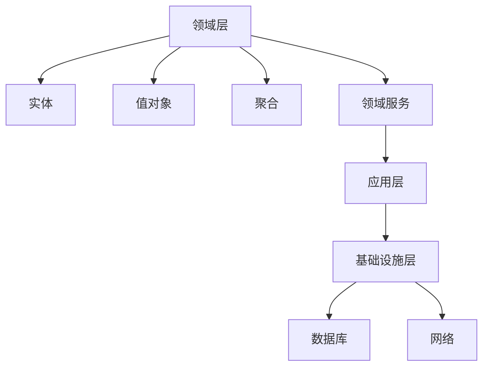

                 

关键词：软件2.0，领域驱动设计（DDD），架构，设计模式，编程实践，软件开发方法论。

## 摘要

随着软件系统复杂性的不断增加，传统的软件开发方法论逐渐暴露出其局限性。本文旨在探讨软件2.0时代的领域驱动设计（DDD）方法，这是一种应对复杂系统的全新设计理念。文章将深入剖析DDD的核心概念、原理与实践，旨在为开发者提供一种有效的软件开发方法论，帮助他们在面对复杂业务场景时，构建出更为灵活、可扩展和易于维护的软件系统。

## 1. 背景介绍

### 1.1 软件发展的历史

从最初的程序设计到面向对象编程，再到现在的软件2.0时代，软件发展历程中不断涌现出新的设计和开发方法。每一个阶段都有其独特的特点和挑战，同时也为软件开发带来了新的机遇。

- **程序设计（1950s-1960s）**：最初的软件开发主要依赖于汇编语言和早期的高级语言，程序的结构和功能相对简单。

- **面向过程编程（1960s-1970s）**：随着计算机性能的提升，软件开发逐渐转向面向过程的方法，如C语言的出现，使得程序的可读性和维护性得到了显著提高。

- **面向对象编程（1970s-1990s）**：面向对象编程方法的出现，使软件设计更加模块化和抽象，提高了代码的重用性和可维护性。

- **软件2.0（1990s-至今）**：随着互联网的兴起，软件系统变得越来越复杂，传统的设计方法逐渐暴露出其局限性。软件2.0时代强调系统的灵活性、可扩展性和可持续性。

### 1.2 DDD的产生背景

领域驱动设计（Domain-Driven Design，简称DDD）是一种针对复杂业务场景的软件开发方法论。它的产生背景是：

- **业务复杂性**：现代软件系统需要处理越来越复杂的业务逻辑，这使得传统的软件开发方法难以满足需求。

- **开发与业务的脱节**：在传统的软件开发过程中，开发人员往往难以深入理解业务需求，导致开发出的软件难以满足业务需求。

- **技术债务**：在快速迭代的开发过程中，技术债务不断积累，导致软件系统的维护成本越来越高。

DDD旨在解决这些问题，通过将业务领域模型化，使开发人员能够更好地理解业务需求，构建出更加灵活、可扩展和易于维护的软件系统。

## 2. 核心概念与联系

### 2.1 DDD的核心概念

DDD的核心概念包括：

- **实体（Entity）**：具有唯一标识的独立对象，如用户、订单等。

- **值对象（Value Object）**：无唯一标识的对象，如货币金额、日期等。

- **聚合（Aggregate）**：由一组实体和值对象组成，具有内部一致性和边界。

- **领域服务（Domain Service）**：用于处理跨越多个聚合的复杂业务逻辑。

- **边界（Boundary）**：定义了领域模型的边界，隔离了内部领域模型与外部系统。

### 2.2 DDD的架构

DDD的架构包括：

- **领域层（Domain Layer）**：包含实体、值对象、聚合和领域服务。

- **应用层（Application Layer）**：负责协调领域层和基础设施层。

- **基础设施层（Infrastructure Layer）**：提供技术支持，如数据库、网络等。

### 2.3 Mermaid 流程图

下面是一个简化的DDD架构的Mermaid流程图：



## 3. 核心算法原理 & 具体操作步骤

### 3.1 算法原理概述

DDD的核心算法原理是基于领域模型的方法论，其具体操作步骤包括：

- **识别领域模型**：通过对业务需求的深入理解，识别出领域模型中的实体、值对象、聚合和领域服务。

- **定义领域模型**：根据识别出的领域模型，定义其属性、行为和关系。

- **实现领域模型**：将定义好的领域模型转化为具体的代码实现。

- **迭代优化**：在开发过程中不断迭代优化领域模型，使其更加符合业务需求。

### 3.2 算法步骤详解

- **步骤1：识别领域模型**  
  在这一步，开发人员需要与业务专家紧密合作，通过调研、访谈等方式，深入了解业务需求，识别出领域模型中的实体、值对象、聚合和领域服务。

- **步骤2：定义领域模型**  
  根据识别出的领域模型，开发人员需要定义其属性、行为和关系。这一步可以通过领域模型图、实体图、值对象图等方式进行。

- **步骤3：实现领域模型**  
  在这一步，开发人员需要将定义好的领域模型转化为具体的代码实现。这通常涉及到实体类、值对象类、聚合类和领域服务类的编写。

- **步骤4：迭代优化**  
  在开发过程中，开发人员需要不断地迭代优化领域模型，以适应业务需求的变化。这可以通过重构、优化代码和改进设计模式等方式实现。

### 3.3 算法优缺点

- **优点**：  
  - **提高开发效率**：通过将业务需求模型化为领域模型，开发人员可以更快速地理解和实现业务需求。  
  - **提高代码质量**：领域模型有助于规范代码结构和设计模式，从而提高代码的可读性和可维护性。  
  - **降低技术债务**：通过迭代优化领域模型，可以及时发现和解决潜在的技术问题，降低技术债务。

- **缺点**：  
  - **学习成本较高**：DDD需要开发人员具备一定的业务知识和方法论基础，学习成本较高。  
  - **开发过程较长**：由于需要与业务专家紧密合作，DDD的开发过程相对较长。

### 3.4 算法应用领域

DDD适用于处理复杂业务场景的软件开发，如：

- **金融系统**：金融系统的业务逻辑复杂，DDD有助于构建出灵活、可扩展和易于维护的金融系统。

- **电商系统**：电商系统的业务流程多样，DDD有助于处理复杂的业务逻辑，提高系统的响应速度和用户体验。

- **物流系统**：物流系统的业务流程涉及多个领域，DDD有助于构建出高效的物流系统。

## 4. 数学模型和公式 & 详细讲解 & 举例说明

### 4.1 数学模型构建

在DDD中，数学模型主要用于描述领域模型中的关系和约束。以下是构建数学模型的一些基本步骤：

- **步骤1：识别领域模型中的变量**  
  根据领域模型，识别出需要描述的变量，如实体属性、值对象属性等。

- **步骤2：定义变量之间的关系**  
  根据领域模型，定义变量之间的关系，如实体之间的关联关系、值对象之间的比较关系等。

- **步骤3：建立数学模型**  
  根据变量之间的关系，建立数学模型，如函数关系、方程组等。

### 4.2 公式推导过程

以一个简单的订单系统为例，假设订单金额（OrderAmount）和折扣（Discount）之间存在以下关系：

\[ OrderAmount \times (1 - Discount) = FinalAmount \]

其中，OrderAmount 和 Discount 是订单系统的变量，FinalAmount 是计算后的最终金额。

### 4.3 案例分析与讲解

假设一个订单系统的订单金额为1000元，折扣为10%，我们需要计算最终金额。根据上面的公式：

\[ FinalAmount = 1000 \times (1 - 0.1) = 900 \]

因此，最终金额为900元。

## 5. 项目实践：代码实例和详细解释说明

### 5.1 开发环境搭建

在开始编写代码之前，我们需要搭建一个合适的开发环境。以下是一个基本的开发环境搭建步骤：

- **安装Java开发工具包（JDK）**  
  JDK是Java开发的基础，我们需要安装一个合适的版本，如JDK 11。

- **安装集成开发环境（IDE）**  
  我们可以选择一个流行的IDE，如IntelliJ IDEA或Eclipse。

- **创建Maven项目**  
  Maven是一个项目构建和依赖管理工具，我们可以使用它来创建一个Maven项目。

### 5.2 源代码详细实现

以下是一个简单的订单系统的源代码实现，包括实体类、值对象类和领域服务类。

```java
// 实体类
public class Order {
    private String id;
    private List<OrderItem> items;
    private double totalAmount;

    // 构造函数、getter和setter方法等
}

// 值对象类
public class OrderItem {
    private String productId;
    private String productName;
    private double price;

    // 构造函数、getter和setter方法等
}

// 领域服务类
public class OrderService {
    public double calculateTotalAmount(Order order) {
        double total = 0;
        for (OrderItem item : order.getItems()) {
            total += item.getPrice();
        }
        return total;
    }

    public double calculateDiscount(Order order) {
        // 根据订单信息计算折扣
        return 0.1;
    }
}
```

### 5.3 代码解读与分析

- **实体类**：Order类是一个实体类，代表订单。它包含订单ID、订单项列表和总金额等属性。

- **值对象类**：OrderItem类是一个值对象类，代表订单项。它包含产品ID、产品名称和价格等属性。

- **领域服务类**：OrderService类是一个领域服务类，用于计算订单的总金额和折扣。calculateTotalAmount()方法用于计算总金额，calculateDiscount()方法用于计算折扣。

### 5.4 运行结果展示

假设我们有一个订单，包含2个订单项，单价分别为100元和200元。根据上面的代码，我们可以计算出总金额和折扣：

```java
Order order = new Order();
order.addItem(new OrderItem("P1", "产品1", 100));
order.addItem(new OrderItem("P2", "产品2", 200));
OrderService service = new OrderService();
double totalAmount = service.calculateTotalAmount(order);
double discount = service.calculateDiscount(order);
System.out.println("总金额：" + totalAmount);
System.out.println("折扣：" + discount);
```

输出结果：

```
总金额：300
折扣：0.1
```

## 6. 实际应用场景

领域驱动设计（DDD）在实际应用中有着广泛的应用场景，以下是几个典型的应用案例：

### 6.1 金融系统

金融系统中的业务逻辑复杂，如银行账户管理、贷款审批、证券交易等。DDD可以帮助开发者构建出灵活、可扩展的金融系统，提高系统的稳定性和安全性。

### 6.2 电商系统

电商系统中的业务流程多样，如商品管理、订单处理、支付等。DDD可以帮助开发者处理复杂的业务逻辑，提高系统的响应速度和用户体验。

### 6.3 物流系统

物流系统中的业务流程涉及多个领域，如仓储管理、运输调度、订单跟踪等。DDD可以帮助开发者构建出高效的物流系统，提高物流效率。

## 7. 工具和资源推荐

为了更好地理解和应用领域驱动设计（DDD），以下是一些建议的工具和资源：

### 7.1 学习资源推荐

- **书籍**：《领域驱动设计》、《实现领域驱动设计》等经典著作。

- **在线课程**：Coursera、Udemy等平台上的DDD相关课程。

- **博客和社区**：DZone、InfoQ等IT技术社区中的DDD相关文章和讨论。

### 7.2 开发工具推荐

- **IDE**：IntelliJ IDEA、Eclipse等强大的集成开发环境。

- **建模工具**：Enterprise Architect、Visual Paradigm等专业的建模工具。

### 7.3 相关论文推荐

- **《领域驱动设计方法在软件工程中的应用》**：介绍了DDD在软件工程中的应用和研究。

- **《领域驱动设计：从理论到实践》**：详细讲解了DDD的理论和实践方法。

## 8. 总结：未来发展趋势与挑战

领域驱动设计（DDD）作为一种新兴的软件开发方法论，已经在业界得到了广泛应用。未来，DDD将继续在以下方面发展：

### 8.1 研究成果总结

- **模型驱动的软件开发**：研究如何将DDD与模型驱动软件开发（MDE）相结合，提高软件开发的自动化程度。

- **跨领域协同**：研究如何在不同领域之间实现高效的协同工作，提高软件系统的整体性能。

### 8.2 未来发展趋势

- **领域特定语言（DSL）**：开发针对特定领域的DSL，使开发者能够更加高效地构建领域模型。

- **云计算和大数据**：在云计算和大数据环境下，如何利用DDD构建高效、可扩展的软件系统。

### 8.3 面临的挑战

- **方法论标准化**：如何统一DDD的方法论，降低开发者的学习成本。

- **开发工具的普及**：如何开发出易于使用、功能强大的DDD开发工具。

### 8.4 研究展望

未来，DDD将继续在软件工程领域发挥重要作用。通过不断的研究和实践，我们有望构建出更加灵活、可扩展和易于维护的软件系统，为软件开发带来更多的可能性。

## 9. 附录：常见问题与解答

### 9.1 Q：DDD与传统的设计模式有何区别？

A：DDD与传统的设计模式相比，更注重业务领域模型的设计。DDD强调将业务领域模型化，使开发人员能够更好地理解和实现业务需求。而传统的设计模式主要关注软件架构和代码结构的优化。

### 9.2 Q：DDD适用于所有的软件开发项目吗？

A：不是。DDD适用于需要处理复杂业务逻辑的软件开发项目。对于业务逻辑相对简单的项目，传统的开发方法可能更为适用。

### 9.3 Q：如何评估一个软件项目是否适合使用DDD？

A：可以通过以下因素进行评估：

- **业务复杂性**：业务逻辑是否复杂，是否需要处理大量的关联关系和约束。

- **开发团队经验**：开发团队是否具备DDD的方法论基础。

- **项目规模**：项目规模是否较大，是否需要处理复杂的并发和分布式问题。

### 9.4 Q：DDD如何与敏捷开发相结合？

A：DDD与敏捷开发可以相互补充。在敏捷开发中，DDD可以帮助开发团队更好地理解和实现业务需求，提高开发效率。同时，敏捷开发的方法可以确保DDD的迭代和优化过程更加高效。

### 9.5 Q：DDD如何与数据库设计相结合？

A：DDD和数据库设计可以相互影响。在DDD中，领域模型通常作为数据库设计的基础。而数据库设计又可以反过来影响领域模型，使其更加符合实际业务需求。

----------------------------------------------------------------

###  作者署名 ###
作者：禅与计算机程序设计艺术 / Zen and the Art of Computer Programming

