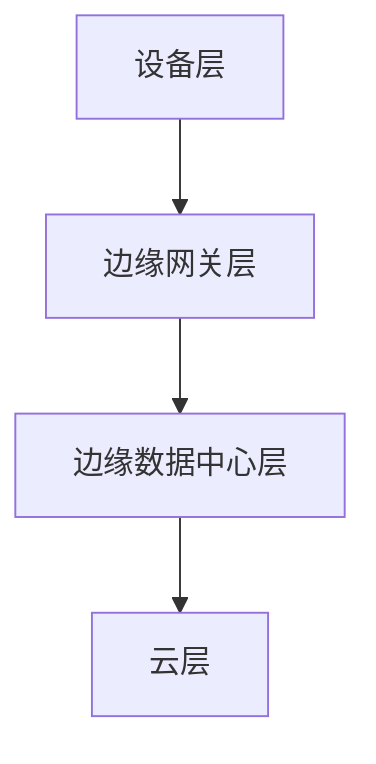

                 

关键词：边缘计算，分布式计算，物联网，数据处理，实时性，云计算，智能设备

> 摘要：边缘计算作为分布式计算的新范式，正逐步改变传统云计算的模式。本文将深入探讨边缘计算的核心概念、架构设计、算法原理及其在不同应用场景中的实际运用，并对未来发展趋势与挑战进行展望。

## 1. 背景介绍

随着物联网（IoT）技术的迅猛发展，智能设备和传感器的大量涌现，数据生成和传输的速度和规模前所未有。这种趋势对传统云计算模型提出了巨大的挑战。传统的云计算依赖于集中的数据中心进行数据处理，但这种模式在应对实时性和大规模数据处理方面存在明显的局限性。

为了提高数据处理的速度和效率，减少网络延迟，边缘计算应运而生。边缘计算通过将计算任务从云端迁移到网络边缘（即靠近数据生成源的位置），实现了更快速的数据处理和更高的响应速度。这种分布式计算的新范式为智能设备和物联网应用提供了强有力的支持。

## 2. 核心概念与联系

### 2.1 边缘计算定义

边缘计算（Edge Computing）是一种分布式计算范式，它将数据处理、存储、分析和应用程序分布在网络的边缘设备上，而不是在远程数据中心。这种分布式架构使得数据可以在靠近数据生成源的地方进行处理，从而减少了数据传输的时间和带宽消耗。

### 2.2 云计算与边缘计算的关系

云计算和边缘计算并非互斥的，而是互补的。云计算提供了强大的计算资源、存储能力和丰富的应用程序，而边缘计算则通过本地处理实现了实时性和低延迟。二者结合，可以更好地满足不同类型的应用需求。

### 2.3 边缘计算架构

边缘计算架构通常包括以下几个层次：

- **设备层**：包括各种边缘设备，如传感器、智能设备和物联网设备。
- **边缘网关层**：负责数据的采集、处理和传输，是连接设备层与云端的桥梁。
- **边缘数据中心层**：提供更加集中的计算资源，处理复杂的计算任务。
- **云层**：提供长期的存储、分析和高级应用程序。

### 2.4 Mermaid 流程图



## 3. 核心算法原理 & 具体操作步骤

### 3.1 算法原理概述

边缘计算的核心在于数据的局部处理。具体来说，它包括以下几个步骤：

- **数据采集**：边缘设备采集数据，如传感器数据、用户行为数据等。
- **预处理**：边缘网关对数据进行预处理，如去噪、压缩、加密等。
- **实时处理**：边缘网关执行实时数据处理任务，如机器学习推理、实时分析等。
- **数据传输**：处理后的数据可以部分或全部上传到边缘数据中心或云端进行进一步处理。
- **反馈与控制**：处理结果返回给边缘设备或用户，进行反馈控制和决策。

### 3.2 算法步骤详解

1. **数据采集**：
   边缘设备通过传感器或其他手段收集数据。
   $$ 
   数据 = 传感器采集数据() 
   $$

2. **预处理**：
   边缘网关对采集到的数据进行预处理。
   $$
   预处理数据 = 预处理(数据)
   $$

3. **实时处理**：
   边缘网关执行实时数据处理任务，如使用机器学习模型进行预测。
   $$
   预测结果 = 实时处理(预处理数据)
   $$

4. **数据传输**：
   处理后的数据可以选择性地上传到边缘数据中心或云端。
   $$
   上传数据 = 传输(预测结果)
   $$

5. **反馈与控制**：
   将处理结果返回给边缘设备或用户，进行实时反馈和控制。
   $$
   控制动作 = 反馈(上传数据)
   $$

### 3.3 算法优缺点

**优点**：

- **实时性**：数据在本地处理，减少了网络延迟。
- **效率**：减少了数据传输的带宽消耗，提高了处理速度。
- **安全性**：部分敏感数据可以在本地处理，降低了数据泄露的风险。

**缺点**：

- **计算资源有限**：边缘设备通常计算资源有限，可能无法执行复杂任务。
- **维护难度**：边缘设备的维护和管理较为困难，需要更多的技术支持。

### 3.4 算法应用领域

边缘计算适用于多种应用场景，包括：

- **智能城市**：实时监控交通流量、环境质量等。
- **工业物联网**：实时监测生产线、设备状态等。
- **医疗健康**：实时监控患者健康数据、远程手术等。
- **智能家居**：智能家居设备间的实时通信和控制。

## 4. 数学模型和公式 & 详细讲解 & 举例说明

### 4.1 数学模型构建

边缘计算中的数学模型通常涉及以下几个方面：

- **数据传输模型**：描述数据在网络中的传输行为。
- **计算负载模型**：描述边缘设备的计算能力。
- **能耗模型**：描述边缘设备的能耗情况。

### 4.2 公式推导过程

1. **数据传输模型**：
   $$
   传输时间 = \frac{数据大小}{带宽}
   $$
   
2. **计算负载模型**：
   $$
   计算负载 = 时间 \times 处理速度
   $$
   
3. **能耗模型**：
   $$
   能耗 = 计算负载 \times 能耗率
   $$

### 4.3 案例分析与讲解

假设我们有一个智能城市监控系统，需要实时监控城市交通流量。边缘设备安装在道路交叉口，每秒采集一次交通流量数据，并将数据传输到边缘数据中心进行处理。

- **数据传输模型**：
  数据大小为100KB，带宽为10Mbps，传输时间为：
  $$
  传输时间 = \frac{100KB}{10Mbps} = 0.008秒
  $$
  
- **计算负载模型**：
  边缘设备每秒处理一次数据，处理速度为1秒/次，计算负载为：
  $$
  计算负载 = 1秒 \times 1次/秒 = 1秒
  $$
  
- **能耗模型**：
  边缘设备的能耗率为1J/秒，能耗为：
  $$
  能耗 = 1秒 \times 1J/秒 = 1J
  $$

## 5. 项目实践：代码实例和详细解释说明

### 5.1 开发环境搭建

为了更好地理解边缘计算，我们将使用一个简单的示例项目——一个智能交通流量监控系统。

- **硬件环境**： Raspberry Pi 3 或类似设备作为边缘计算节点。
- **软件环境**： Python 3，OpenCV 库，MQTT 协议库。

### 5.2 源代码详细实现

以下是该项目的主要代码实现：

```python
import cv2
import paho.mqtt.client as mqtt

# 初始化摄像头
cap = cv2.VideoCapture(0)

# MQTT 客户端设置
client = mqtt.Client()
client.connect("mqtt-server.example.com", 1883, 60)

while True:
    # 读取摄像头帧
    ret, frame = cap.read()
    
    # 对图像进行预处理
    processed_frame = preprocess_frame(frame)
    
    # 获取交通流量数据
    traffic_data = analyze_traffic(processed_frame)
    
    # 将数据发布到 MQTT 主题
    client.publish("traffic_data", traffic_data)

# 关闭摄像头
cap.release()
```

### 5.3 代码解读与分析

上述代码实现了边缘设备上的实时交通流量监控功能。

- **摄像头读取**：使用 OpenCV 库初始化摄像头，读取实时视频帧。
- **图像预处理**：对视频帧进行预处理，如灰度转换、二值化等，以便更好地分析交通流量。
- **MQTT 发布**：使用 MQTT 协议将处理后的交通流量数据发送到 MQTT 服务器，供其他系统进一步处理。

### 5.4 运行结果展示

在运行该项目后，边缘设备将实时监控摄像头捕获的交通流量图像，并发布交通流量数据到 MQTT 服务器。其他系统可以根据这些数据进行分析和决策。

## 6. 实际应用场景

边缘计算在实际应用中具有广泛的应用场景，以下是一些典型的例子：

- **智能交通**：实时监控交通流量，优化交通信号灯控制，减少交通拥堵。
- **智能工厂**：实时监控生产线设备状态，提高生产效率和降低故障率。
- **智能医疗**：实时监控患者健康数据，提供远程医疗咨询和诊断。
- **智能家居**：实时监控家居设备状态，提供智能化的家居控制和管理。

## 7. 工具和资源推荐

为了更好地学习和实践边缘计算，以下是一些推荐的工具和资源：

### 7.1 学习资源推荐

- **书籍**：《边缘计算：分布式计算的新范式》
- **在线课程**：Coursera 上的《边缘计算》课程
- **博客**：GeekTime 上的边缘计算专栏

### 7.2 开发工具推荐

- **硬件**：Raspberry Pi、Arduino 等
- **软件**：Python、Node.js、MQTT 协议库等

### 7.3 相关论文推荐

- **论文 1**："Edge Computing: A Comprehensive Survey" by Muhammad A. Ilyas et al.
- **论文 2**："A survey on edge computing: Architecture, Enabling technologies, Security and Privacy, and Applications" by Jing Liu et al.

## 8. 总结：未来发展趋势与挑战

### 8.1 研究成果总结

边缘计算作为一种新兴的分布式计算范式，已经在智能城市、工业物联网、医疗健康等领域取得了显著的应用成果。通过边缘计算，我们可以实现更高效的数据处理、更低的网络延迟和更高的系统可靠性。

### 8.2 未来发展趋势

- **智能设备融合**：随着 5G 和物联网技术的不断发展，边缘计算将进一步与智能设备融合，实现更广泛的应用场景。
- **云计算与边缘计算融合**：云计算和边缘计算将更加紧密地结合，形成统一的计算架构。
- **自动化与智能化**：边缘计算将推动自动化和智能化水平的进一步提升。

### 8.3 面临的挑战

- **安全性**：边缘计算涉及到大量的数据传输和处理，确保数据安全是一个重大挑战。
- **可靠性**：边缘设备的计算资源有限，如何保证系统的可靠性和稳定性是一个重要课题。
- **标准化**：边缘计算技术缺乏统一的标准化，阻碍了其发展和应用。

### 8.4 研究展望

边缘计算作为分布式计算的新范式，具有广阔的发展前景。未来的研究应重点关注以下几个方面：

- **安全性**：提高边缘计算系统的安全性，保护用户数据隐私。
- **可靠性**：优化边缘设备的性能和稳定性，提高系统的可靠性。
- **标准化**：推动边缘计算技术的标准化，促进其广泛应用。

## 9. 附录：常见问题与解答

### 9.1 什么是边缘计算？

边缘计算是一种分布式计算范式，它将数据处理、存储、分析和应用程序分布在网络的边缘设备上，以实现更快速的数据处理和更高的响应速度。

### 9.2 边缘计算有哪些优势？

边缘计算的主要优势包括实时性、效率、安全性和减少数据传输延迟。

### 9.3 边缘计算在哪些领域有应用？

边缘计算适用于智能城市、工业物联网、医疗健康、智能家居等多个领域。

### 9.4 如何开始学习边缘计算？

可以通过阅读相关书籍、在线课程和博客，了解边缘计算的基本概念和技术。同时，可以通过实践项目来加深理解。

---

作者：禅与计算机程序设计艺术 / Zen and the Art of Computer Programming

在结束这篇文章之前，我想再次强调边缘计算的重要性和潜力。随着技术的不断进步，边缘计算必将在未来的智能世界发挥关键作用。希望这篇文章能为您带来对边缘计算的深入理解，激发您对这一领域的热情和探索精神。谢谢您的阅读！
----------------------------------------------------------------

[End of Document]

