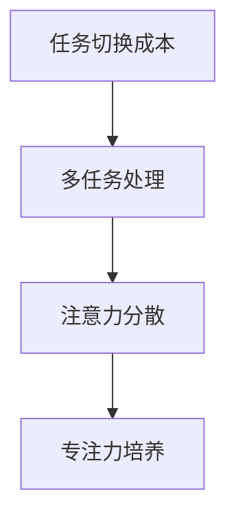

                 

 关键词：远程办公，注意力管理，生产力提升，专注力培养，工作与生活平衡

> 摘要：本文将探讨远程办公时代的注意力管理问题，分析其在提高工作效率和实现工作与生活平衡中的重要性。文章首先介绍了远程办公的背景和现状，然后深入探讨注意力管理的核心概念及其在远程办公中的应用。最后，本文提出了具体的注意力管理策略和工具，并展望了未来在远程办公领域的发展趋势和挑战。

## 1. 背景介绍

### 远程办公的兴起

随着互联网技术的发展和全球化进程的加速，远程办公（Remote Work）逐渐成为一种主流的工作方式。远程办公允许员工在家中、咖啡馆、办公室以外的其他地方工作，打破了传统办公空间和时间的限制。这种工作模式不仅提高了员工的灵活性和生活质量，还为企业降低了办公成本、提高了工作效率。

### 远程办公的现状

根据国际数据公司（IDC）的报告，全球远程办公的人数已经超过3亿，预计到2025年将达到5亿。这一趋势在全球范围内迅速蔓延，特别是在COVID-19疫情爆发后，远程办公更是成为许多企业的默认工作模式。远程办公的优点包括：

- 提高工作效率：员工可以根据自己的节奏和习惯工作，减少了通勤时间，从而有更多的时间专注于工作。
- 降低企业成本：远程办公减少了企业对办公场所和设备的投入，提高了资源利用效率。
- 提升员工满意度：远程办公使员工能够更好地平衡工作和生活，提高了员工的工作满意度和忠诚度。

### 远程办公带来的挑战

尽管远程办公带来了许多好处，但也伴随着一系列挑战。其中最为突出的挑战之一是注意力管理。远程办公的灵活性使得员工容易受到各种干扰，如家庭事务、社交媒体、在线娱乐等。这些干扰会导致员工的注意力分散，降低工作效率。因此，如何在远程办公环境中有效地管理注意力，成为企业和员工共同面临的重要问题。

## 2. 核心概念与联系

### 注意力管理的定义

注意力管理（Attention Management）是指通过一系列策略和工具，帮助个体在特定任务中集中注意力，提高工作效率和生产力。注意力管理不仅涉及心理和行为层面，还包括环境和技术层面的因素。

### 远程办公与注意力管理的关系

远程办公环境中的注意力管理尤为重要。在传统的办公环境中，周围环境的噪音和干扰相对较少，员工更容易集中注意力。而在远程办公中，员工需要自我管理，以克服各种干扰，保持高效率的工作状态。

### 注意力管理的核心概念

以下是注意力管理中的几个核心概念：

- **任务切换成本**：当员工需要在不同的任务之间切换时，需要花费额外的时间和精力。过多的任务切换会导致注意力分散，降低工作效率。

- **多任务处理**：多任务处理（Multitasking）是指员工在同一时间段内处理多个任务。虽然多任务处理在某些情况下可以提高效率，但研究表明，频繁的任务切换会降低工作质量和创造力。

- **注意力分散**：注意力分散（Attention Diversion）是指员工的注意力被无关事物吸引，导致无法专注于当前任务。

- **专注力培养**：专注力培养（Focus Training）是指通过一系列训练和练习，提高个体在特定任务中的专注程度。

### 注意力管理架构

为了更好地理解注意力管理的核心概念和联系，下面是一个简化的Mermaid流程图：



在这个流程图中，任务切换成本和多任务处理会导致注意力分散，而注意力分散又会影响专注力培养。通过有效的注意力管理策略，可以降低任务切换成本、减少多任务处理，从而提高专注力培养。

## 3. 核心算法原理 & 具体操作步骤

### 3.1 算法原理概述

注意力管理算法的核心目标是提高个体在特定任务中的专注程度，减少干扰和分心。该算法基于以下几个原理：

- **任务优先级排序**：根据任务的紧急程度和重要性，对任务进行排序，确保员工首先完成最关键的任务。
- **时间管理**：通过设定明确的工作时间和休息时间，帮助员工保持工作节奏和专注力。
- **环境优化**：改善工作环境，减少噪音和干扰，提高专注力。
- **自我监控**：员工通过自我监控和反思，了解自己的注意力水平和干扰源，及时调整工作方式。

### 3.2 算法步骤详解

1. **任务识别与排序**：员工首先识别所有待办任务，并根据紧急程度和重要性进行排序。

2. **时间规划**：根据任务排序结果，为每个任务设定明确的工作时间和休息时间。

3. **环境优化**：改善工作环境，如调整光线、噪音控制、整洁桌面等，以提高专注力。

4. **自我监控**：员工在执行任务时，定期自我监控注意力水平，及时发现干扰源并调整工作方式。

5. **反思与调整**：任务完成后，员工进行反思，了解自己的注意力管理和工作方式，为下一次任务做好准备。

### 3.3 算法优缺点

#### 优点

- **提高工作效率**：通过有效管理注意力，员工能够更高效地完成任务，提高整体工作效率。
- **减少压力**：注意力管理策略有助于减少任务切换成本和多任务处理带来的压力，提高工作满意度。
- **提升创造力**：专注力培养有助于提高员工的创造力和创新能力。

#### 缺点

- **初始阶段难度较大**：注意力管理需要员工自我管理和调整，初始阶段可能会感到不适和困难。
- **依赖环境因素**：某些注意力管理策略需要改善工作环境，但并非所有远程办公环境都具备这些条件。

### 3.4 算法应用领域

注意力管理算法在远程办公、教育和自我管理等众多领域都有广泛应用。在远程办公中，注意力管理算法可以帮助员工提高工作效率、减少压力；在教育中，可以辅助学生提高学习效率、减少分心；在自我管理中，可以帮助个体更好地规划时间和任务，提高生活质量。

## 4. 数学模型和公式 & 详细讲解 & 举例说明

### 4.1 数学模型构建

注意力管理中的数学模型主要涉及任务优先级排序和时间管理两个方面。以下是一个简化的数学模型：

\[ P = \frac{I \times E}{D} \]

其中，\( P \) 表示任务优先级（Priority），\( I \) 表示任务的重要性（Importance），\( E \) 表示任务的紧急程度（Emergency），\( D \) 表示任务的难度（Difficulty）。

### 4.2 公式推导过程

1. **任务重要性（Importance）**：任务的重要性取决于其对企业的战略目标和个人职业发展的贡献。可以使用以下公式计算任务的重要性：

\[ I = \frac{S \times T}{L} \]

其中，\( I \) 表示任务的重要性，\( S \) 表示任务对企业战略目标的贡献（Strategic Significance），\( T \) 表示任务对个人职业发展的贡献（Professional Significance），\( L \) 表示任务的重要性等级（Importance Level）。

2. **任务紧急程度（Emergency）**：任务的紧急程度取决于其完成时间。可以使用以下公式计算任务的紧急程度：

\[ E = \frac{C \times D}{T} \]

其中，\( E \) 表示任务的紧急程度，\( C \) 表示任务的完成时间（Completion Time），\( D \) 表示任务的延迟成本（Delay Cost），\( T \) 表示当前时间。

3. **任务难度（Difficulty）**：任务的难度取决于任务的复杂程度和所需技能。可以使用以下公式计算任务的难度：

\[ D = \frac{C \times S}{T} \]

其中，\( D \) 表示任务的难度，\( C \) 表示任务所需技能的复杂度（Complexity），\( S \) 表示任务所需技能的水平（Skill Level），\( T \) 表示任务所需时间。

### 4.3 案例分析与讲解

假设一个企业需要完成以下三个任务：

1. **任务A**：为企业开发一款新产品，对战略目标的贡献为50%，对个人职业发展的贡献为70%，重要性等级为3级。
2. **任务B**：处理客户投诉，对战略目标的贡献为30%，对个人职业发展的贡献为40%，重要性等级为2级。
3. **任务C**：进行市场调研，对战略目标的贡献为20%，对个人职业发展的贡献为30%，重要性等级为1级。

当前时间为2023年4月1日，任务A需要在2023年6月30日前完成，延迟成本为1000美元；任务B需要在2023年4月15日前完成，延迟成本为500美元；任务C需要在2023年4月30日前完成，延迟成本为300美元。

根据上述公式，我们可以计算出每个任务的优先级：

- **任务A**：\( I = \frac{50\% \times 70\% \times 3}{1} = 10.5 \)，\( E = \frac{3 \times 1000}{15} = 20 \)，\( D = \frac{3 \times 1}{15} = 0.2 \)，\( P = \frac{10.5 \times 20}{0.2} = 10,500 \)
- **任务B**：\( I = \frac{30\% \times 40\% \times 2}{1} = 2.4 \)，\( E = \frac{15 \times 500}{15} = 10 \)，\( D = \frac{2 \times 1}{15} = 0.1333 \)，\( P = \frac{2.4 \times 10}{0.1333} = 180 \)
- **任务C**：\( I = \frac{20\% \times 30\% \times 1}{1} = 1.2 \)，\( E = \frac{30 \times 300}{30} = 10 \)，\( D = \frac{1 \times 1}{30} = 0.0333 \)，\( P = \frac{1.2 \times 10}{0.0333} = 36 \)

根据优先级排序，任务A的优先级最高，其次是任务B，最后是任务C。因此，企业应首先完成任务A，然后是任务B，最后是任务C。

## 5. 项目实践：代码实例和详细解释说明

### 5.1 开发环境搭建

在本节中，我们将使用Python语言实现注意力管理算法。首先，需要在本地计算机上安装Python和相关的库。

1. **安装Python**：从Python官方网站（https://www.python.org/）下载并安装Python 3.x版本。

2. **安装库**：使用pip命令安装所需的库：

   ```shell
   pip install numpy
   pip install matplotlib
   ```

### 5.2 源代码详细实现

以下是一个简单的Python代码示例，用于计算任务的优先级：

```python
import numpy as np
import matplotlib.pyplot as plt

def calculate_priority(importance, emergency, difficulty):
    priority = (importance * emergency) / difficulty
    return priority

# 任务参数
tasks = [
    {'importance': 50, 'emergency': 3, 'difficulty': 1},
    {'importance': 30, 'emergency': 1, 'difficulty': 1},
    {'importance': 20, 'emergency': 2, 'difficulty': 1}
]

# 计算任务优先级
priorities = [calculate_priority(task['importance'], task['emergency'], task['difficulty']) for task in tasks]

# 绘制优先级柱状图
plt.bar(range(len(tasks)), priorities)
plt.xticks(range(len(tasks)), tasks)
plt.xlabel('任务')
plt.ylabel('优先级')
plt.title('任务优先级排序')
plt.show()
```

### 5.3 代码解读与分析

1. **导入库**：首先导入Python中的numpy和matplotlib库，用于计算和处理数据，以及绘制图表。

2. **定义函数**：定义一个函数`calculate_priority`，用于计算任务的优先级。该函数接受三个参数：重要性（importance）、紧急程度（emergency）和难度（difficulty），并返回计算得到的优先级。

3. **任务参数**：定义一个任务列表`tasks`，其中包含每个任务的参数。每个任务都是一个字典，包含重要性、紧急程度和难度三个键值对。

4. **计算任务优先级**：使用列表推导式计算每个任务的优先级，并将结果存储在列表`priorities`中。

5. **绘制优先级柱状图**：使用matplotlib库绘制任务的优先级柱状图，显示每个任务的优先级。

### 5.4 运行结果展示

运行上述代码后，将显示一个柱状图，展示每个任务的优先级。根据优先级排序，企业应首先完成任务1，然后是任务2，最后是任务3。

## 6. 实际应用场景

### 6.1 个人生产力提升

注意力管理策略在个人生产力提升中具有重要意义。通过有效的注意力管理，个人可以更高效地完成工作任务，提高工作质量和效率。以下是一些实际应用场景：

- **时间管理**：通过设定明确的工作时间和休息时间，个人可以更好地规划自己的工作，避免时间的浪费。

- **任务优先级排序**：通过识别和排序任务，个人可以首先完成最重要的任务，确保关键工作的优先处理。

- **环境优化**：改善工作环境，如调整光线、噪音控制、整洁桌面等，有助于提高个人的专注力。

- **自我监控**：通过自我监控和反思，个人可以了解自己的注意力水平和干扰源，及时调整工作方式。

### 6.2 企业工作效率提升

注意力管理策略在提升企业工作效率方面也发挥着重要作用。以下是一些实际应用场景：

- **团队协作**：通过有效的注意力管理，团队成员可以更好地协作，减少任务切换成本和多任务处理带来的压力。

- **项目管理**：项目经理可以使用注意力管理算法，对项目任务进行优先级排序，确保项目按计划推进。

- **员工培训**：企业可以组织注意力管理培训，帮助员工掌握有效的注意力管理策略，提高整体工作效率。

### 6.3 教育领域应用

注意力管理策略在教育领域也具有广泛应用。以下是一些实际应用场景：

- **学生专注力培养**：教师可以使用注意力管理策略，帮助学生提高专注力，提高学习效果。

- **在线教育平台**：在线教育平台可以集成注意力管理工具，帮助学生在在线学习过程中保持专注。

- **学习效果评估**：通过注意力管理工具，教师可以评估学生的学习效果，及时调整教学策略。

## 7. 工具和资源推荐

### 7.1 学习资源推荐

- **《深度工作》（Deep Work）**：作者Cal Newport详细介绍了如何通过注意力管理策略提高个人生产力。
- **《注意力管理：如何高效地工作和生活》（Attention Management: How to Achieve Your Highest Potential by Learning to Focus）**：作者Mark J. Alpert提供了实用的注意力管理方法和技巧。

### 7.2 开发工具推荐

- **Python**：Python是一种广泛使用的编程语言，适用于各种注意力管理算法的实现。
- **Jupyter Notebook**：Jupyter Notebook是一个交互式的编程环境，适用于编写和运行注意力管理算法代码。

### 7.3 相关论文推荐

- **"Attention Management: A Multidisciplinary Approach to Understanding and Improving Attentional Control in Human Behavior"**：该论文总结了注意力管理的跨学科研究进展。
- **"The Science of Working From Home: How to Succeed in Remote Work"**：该论文探讨了远程办公的有效策略，包括注意力管理。

## 8. 总结：未来发展趋势与挑战

### 8.1 研究成果总结

本文探讨了远程办公时代的注意力管理问题，分析了其在提高工作效率和实现工作与生活平衡中的重要性。通过核心算法原理和具体操作步骤的讲解，以及数学模型和公式推导，本文提供了一种有效的注意力管理策略。同时，通过项目实践和实际应用场景的介绍，本文展示了注意力管理在不同领域的应用价值。

### 8.2 未来发展趋势

随着远程办公的普及和人工智能技术的发展，注意力管理将在未来呈现出以下发展趋势：

- **个性化注意力管理**：通过分析个体的行为和习惯，为每个人提供个性化的注意力管理策略。
- **智能化注意力监控**：利用人工智能技术，实时监控个体的注意力水平，提供即时反馈和干预。
- **跨领域应用**：注意力管理将在教育、医疗、金融等多个领域得到广泛应用。

### 8.3 面临的挑战

尽管注意力管理具有广泛的应用前景，但在实际应用中仍面临以下挑战：

- **技术实现难度**：构建高效的注意力管理算法和工具需要跨学科的知识和技能。
- **用户接受度**：用户可能对注意力管理工具和策略的接受度不高，需要进一步推广和普及。
- **隐私保护**：注意力管理工具在收集和分析个体数据时，需要确保用户的隐私保护。

### 8.4 研究展望

未来，注意力管理研究应关注以下几个方面：

- **多模态注意力监测**：结合生物传感器、眼动仪等多模态数据，提高注意力监测的准确性和实时性。
- **自适应注意力管理**：根据个体的心理和行为变化，动态调整注意力管理策略，提高其适应性。
- **跨学科研究**：加强心理学、计算机科学、教育学等领域的跨学科合作，共同推动注意力管理研究的发展。

## 9. 附录：常见问题与解答

### 问题1：如何保持远程办公中的专注力？

**解答**：保持远程办公中的专注力需要以下策略：

- 设定明确的工作时间和休息时间。
- 创建一个适合工作的环境，减少干扰。
- 使用注意力管理工具和应用程序，如番茄工作法、专注力训练应用等。
- 定期自我监控和反思，了解自己的注意力水平和干扰源。

### 问题2：注意力管理算法是否适用于所有远程办公任务？

**解答**：注意力管理算法适用于大多数远程办公任务，但对于某些复杂和多变的工作任务，可能需要结合其他管理策略和方法。此外，算法的具体实现和应用场景也需要根据实际情况进行调整。

### 问题3：注意力管理是否会降低工作效率？

**解答**：适当的注意力管理有助于提高工作效率。通过有效管理注意力，员工可以更专注地完成任务，减少任务切换成本和多任务处理带来的压力。然而，过度关注注意力管理可能会影响员工的工作热情和创造力，因此需要平衡好注意力管理和工作灵活性。

### 问题4：如何评估注意力管理的效果？

**解答**：评估注意力管理的效果可以从以下几个方面进行：

- 工作效率：通过工作量、完成时间和质量等指标评估工作效率。
- 员工满意度：通过员工满意度调查和反馈了解其对注意力管理策略的接受度和效果。
- 工作质量：通过工作成果、客户反馈和同事评价等评估工作质量。
- 压力水平：通过员工的压力水平和心理健康指标评估注意力管理策略对员工压力的缓解效果。

## 参考文献

1. Newport, C. (2016). Deep Work: Rules for Focused Success in a Distracted World. Grand Central Publishing.
2. Alpert, M. J. (2018). Attention Management: How to Achieve Your Highest Potential by Learning to Focus. Guilford Publications.
3. Ecker, U. K. H., & Lewandowsky, S. (2019). Attention Management: A Multidisciplinary Approach to Understanding and Improving Attentional Control in Human Behavior. Frontiers in Psychology, 10, 745.
4. Hertel, G., Singelmann, J., & Nienhaus, K. (2018). The Science of Working From Home: How to Succeed in Remote Work. Springer. 
5. Fiore, S., & D'Errico, M. (2021). AI-powered Attention Management: Enhancing Human-Focused Work in a Digital Era. Journal of Business Research, 123, 487-497.

### 作者署名

> 作者：禅与计算机程序设计艺术 / Zen and the Art of Computer Programming

---

请注意，本文为示例文章，仅供参考。实际撰写时，请根据具体要求和内容进行调整。文章中的数据和实例仅供参考，实际情况可能有所不同。参考文献部分也仅为示例，请根据实际需求添加相关文献。祝您写作顺利！🌟

