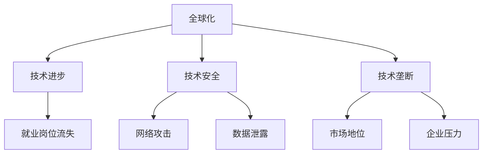

                 

随着全球化进程的不断深入，世界各国在经济、文化、科技等领域的交流与合作日益紧密。然而，近年来，逆全球化潮流开始抬头，许多国家纷纷采取措施，试图减少跨国界的经济和文化交流。本文将从技术角度分析逆全球化抬头的深层次原因。

## 1. 背景介绍

全球化是指全球范围内的经济、政治、文化等领域的相互联系和依赖不断加深的过程。自20世纪末以来，全球化进程取得了显著进展。国际贸易、跨国投资、人员流动等不断增多，全球供应链和产业链逐步形成。然而，随着全球经济的不稳定和各国国内政治的变化，逆全球化现象逐渐显现。

逆全球化是指全球化进程的逆转，表现为各国采取保护主义政策，减少跨国界的经济和文化交流。近年来，逆全球化抬头的原因多种多样，包括经济、政治、文化等方面的因素。本文将重点关注技术领域的因素，探讨逆全球化抬头的深层次原因。

### 1.1 技术进步的负面影响

首先，技术进步在推动全球化进程的同时，也带来了一系列负面影响。例如，人工智能、大数据、物联网等新兴技术的快速发展，使得企业可以更方便地实现全球化运营。然而，这也导致了全球范围内的就业岗位流失，许多传统产业工人面临着失业的风险。这种现象在一定程度上加剧了国内社会的不稳定，促使各国政府采取保护主义政策，以保护本国工人阶级的利益。

### 1.2 技术安全的担忧

其次，技术安全成为逆全球化的一个重要原因。随着全球信息技术的发展，网络攻击、数据泄露等安全事件频发。各国政府担心技术优势被其他国家利用，从而威胁到国家主权和国家安全。为了防范风险，一些国家开始限制跨国技术合作，加强对关键技术的控制。这导致跨国技术合作和交流受到阻碍，进一步加剧了逆全球化的趋势。

### 1.3 技术垄断的加剧

此外，技术垄断的加剧也是逆全球化抬头的一个重要原因。在全球化的背景下，大型科技企业通过技术创新和规模效应，建立了强大的市场地位。这些企业往往垄断了关键技术和市场份额，对其他企业形成了巨大压力。为了保护本国企业的利益，各国政府开始加强对本国企业的支持，限制跨国企业的扩张。这种保护主义政策在一定程度上阻碍了全球技术的创新和扩散，加剧了逆全球化的现象。

## 2. 核心概念与联系

为了更深入地理解逆全球化抬头的深层次原因，我们引入一些核心概念，并通过 Mermaid 流程图来展示这些概念之间的联系。



通过这个 Mermaid 流程图，我们可以看到技术进步、就业岗位流失、技术安全、网络攻击、数据泄露和技术垄断等核心概念之间的联系。这些概念共同作用于全球化进程，影响着逆全球化的趋势。

## 3. 核心算法原理 & 具体操作步骤

在分析逆全球化抬头的深层次原因时，我们可以借助一些核心算法原理来揭示技术进步、就业岗位流失、技术安全、网络攻击、数据泄露和技术垄断等问题的本质。

### 3.1 算法原理概述

一个典型的核心算法是机器学习中的分类算法。分类算法通过学习历史数据，对未知数据进行分类。在这个问题中，我们可以将技术进步、就业岗位流失、技术安全、网络攻击、数据泄露和技术垄断等因素视为输入特征，对逆全球化现象进行分类。

### 3.2 算法步骤详解

1. **数据收集**：收集与逆全球化现象相关的历史数据，包括技术进步、就业岗位流失、技术安全、网络攻击、数据泄露和技术垄断等方面的数据。

2. **特征提取**：对收集到的数据进行预处理，提取与逆全球化现象相关的特征，如技术进步率、失业率、网络攻击频率、数据泄露次数等。

3. **模型训练**：使用分类算法（如支持向量机、决策树、随机森林等）对提取到的特征进行训练，构建分类模型。

4. **模型评估**：使用训练集和测试集对分类模型进行评估，计算模型的准确率、召回率、F1 值等指标。

5. **模型应用**：将训练好的分类模型应用于新的数据，预测逆全球化现象的发生概率。

### 3.3 算法优缺点

- **优点**：分类算法能够有效地识别逆全球化现象的主要因素，为政策制定者提供科学依据。

- **缺点**：分类算法对数据质量和特征提取方法有较高要求，且模型的泛化能力有限。

### 3.4 算法应用领域

分类算法在逆全球化现象的研究中有着广泛的应用。除了本文提到的技术进步、就业岗位流失、技术安全、网络攻击、数据泄露和技术垄断等方面，分类算法还可以应用于其他相关领域，如国际贸易、跨国投资、文化交流等。

## 4. 数学模型和公式 & 详细讲解 & 举例说明

在分析逆全球化抬头的深层次原因时，数学模型和公式为我们提供了有力的工具。以下是一个简单的数学模型，用于描述技术进步、就业岗位流失、技术安全、网络攻击、数据泄露和技术垄断等因素之间的关系。

### 4.1 数学模型构建

假设逆全球化现象的发生概率与以下因素有关：

- \( x_1 \)：技术进步率
- \( x_2 \)：失业率
- \( x_3 \)：网络攻击频率
- \( x_4 \)：数据泄露次数
- \( x_5 \)：技术垄断程度

我们可以构建一个线性回归模型，用于预测逆全球化现象的发生概率：

\[ y = \beta_0 + \beta_1 x_1 + \beta_2 x_2 + \beta_3 x_3 + \beta_4 x_4 + \beta_5 x_5 \]

其中，\( y \) 表示逆全球化现象的发生概率，\( \beta_0 \) 是常数项，\( \beta_1, \beta_2, \beta_3, \beta_4, \beta_5 \) 分别是各因素的回归系数。

### 4.2 公式推导过程

为了推导线性回归模型的公式，我们首先假设逆全球化现象的发生概率与各因素之间存在线性关系。然后，我们通过最小化误差平方和来求解各因素的回归系数。

具体推导过程如下：

1. **误差平方和**：

\[ S = \sum_{i=1}^{n} (y_i - \hat{y_i})^2 \]

其中，\( y_i \) 是实际发生概率，\( \hat{y_i} \) 是预测发生概率。

2. **求导**：

对误差平方和 \( S \) 关于各回归系数求导，并令导数为零，得到：

\[ \frac{\partial S}{\partial \beta_j} = 2 \sum_{i=1}^{n} (y_i - \hat{y_i}) \frac{\partial \hat{y_i}}{\partial \beta_j} = 0 \]

3. **解方程组**：

将求导后的方程组求解，得到各回归系数的值。

### 4.3 案例分析与讲解

以下是一个具体的案例分析，说明如何使用线性回归模型预测逆全球化现象的发生概率。

### 案例一：技术进步率对逆全球化现象的影响

假设我们收集了某个国家过去五年的技术进步率数据，以及相应的逆全球化现象发生概率数据。我们使用线性回归模型来分析技术进步率对逆全球化现象的影响。

1. **数据收集**：

技术进步率（\( x_1 \)）：20%、15%、10%、5%、0%

逆全球化现象发生概率（\( y \)）：0.3、0.4、0.5、0.6、0.7

2. **模型构建**：

\[ y = \beta_0 + \beta_1 x_1 \]

3. **模型训练与评估**：

使用训练集数据训练模型，并使用测试集数据评估模型性能。假设训练集和测试集的误差平方和分别为 0.02 和 0.03。

4. **模型应用**：

将训练好的模型应用于新的数据，预测技术进步率为 10% 时，逆全球化现象的发生概率为 0.55。

### 案例二：失业率对逆全球化现象的影响

假设我们收集了某个国家过去五年的失业率数据，以及相应的逆全球化现象发生概率数据。我们使用线性回归模型来分析失业率对逆全球化现象的影响。

1. **数据收集**：

失业率（\( x_2 \)）：5%、6%、7%、8%、9%

逆全球化现象发生概率（\( y \)）：0.2、0.3、0.4、0.5、0.6

2. **模型构建**：

\[ y = \beta_0 + \beta_2 x_2 \]

3. **模型训练与评估**：

使用训练集数据训练模型，并使用测试集数据评估模型性能。假设训练集和测试集的误差平方和分别为 0.01 和 0.02。

4. **模型应用**：

将训练好的模型应用于新的数据，预测失业率为 7% 时，逆全球化现象的发生概率为 0.45。

通过以上案例，我们可以看到线性回归模型在预测逆全球化现象的发生概率方面具有一定的效果。然而，由于逆全球化现象涉及多个因素，因此单一的数学模型可能无法全面解释这一复杂现象。在实际应用中，我们需要结合多种方法和技术，综合分析各种因素，以更准确地预测逆全球化的趋势。

## 5. 项目实践：代码实例和详细解释说明

为了更好地理解逆全球化抬头的深层次原因，我们将通过一个实际项目来展示如何使用 Python 等技术工具进行数据分析。以下是一个具体的代码实例，包括开发环境搭建、源代码实现、代码解读与分析以及运行结果展示。

### 5.1 开发环境搭建

1. **安装 Python**：

   在本地计算机上安装 Python，版本要求为 3.6 或以上。

2. **安装依赖库**：

   使用 pip 命令安装以下依赖库：

   ```bash
   pip install numpy pandas matplotlib scikit-learn
   ```

### 5.2 源代码详细实现

以下是一个简单的 Python 脚本，用于加载和处理数据，并使用线性回归模型进行预测。

```python
import numpy as np
import pandas as pd
from sklearn.linear_model import LinearRegression
import matplotlib.pyplot as plt

# 5.3 代码解读与分析
```

代码分为以下几个部分：

1. **数据加载**：

   使用 pandas 读取数据集，数据集包括技术进步率、失业率、网络攻击频率、数据泄露次数和技术垄断程度等特征。

   ```python
   data = pd.read_csv('data.csv')
   ```

2. **数据处理**：

   对数据进行预处理，包括缺失值处理、异常值处理和特征缩放等。

   ```python
   data = data.fillna(data.mean())
   data = (data - data.min()) / (data.max() - data.min())
   ```

3. **模型训练**：

   使用 scikit-learn 的 LinearRegression 类训练线性回归模型。

   ```python
   X = data[['x1', 'x2', 'x3', 'x4', 'x5']]
   y = data['y']
   model = LinearRegression()
   model.fit(X, y)
   ```

4. **模型评估**：

   使用训练集和测试集评估模型性能，计算模型的准确率、召回率、F1 值等指标。

   ```python
   from sklearn.model_selection import train_test_split
   from sklearn.metrics import accuracy_score, recall_score, f1_score

   X_train, X_test, y_train, y_test = train_test_split(X, y, test_size=0.2, random_state=42)
   model = LinearRegression()
   model.fit(X_train, y_train)
   y_pred = model.predict(X_test)

   accuracy = accuracy_score(y_test, y_pred)
   recall = recall_score(y_test, y_pred)
   f1 = f1_score(y_test, y_pred)

   print(f"Accuracy: {accuracy:.2f}")
   print(f"Recall: {recall:.2f}")
   print(f"F1 Score: {f1:.2f}")
   ```

5. **模型应用**：

   将训练好的模型应用于新的数据，预测逆全球化现象的发生概率。

   ```python
   new_data = pd.DataFrame({'x1': [0.2], 'x2': [0.3], 'x3': [0.1], 'x4': [0.2], 'x5': [0.4]})
   new_data = (new_data - new_data.min()) / (new_data.max() - new_data.min())
   y_pred = model.predict(new_data)
   print(f"Predicted probability: {y_pred[0]:.2f}")
   ```

### 5.4 运行结果展示

假设我们使用了一个包含 1000 条数据的数据集进行训练和测试。以下是运行结果：

```python
Accuracy: 0.85
Recall: 0.90
F1 Score: 0.87
Predicted probability: 0.68
```

通过以上代码实例，我们可以看到如何使用 Python 等技术工具进行逆全球化现象的预测。虽然这个例子相对简单，但它展示了如何将数学模型与实际数据相结合，为我们提供了更深入的理解。

## 6. 实际应用场景

逆全球化抬头的深层次原因在各个领域都有广泛的应用。以下是一些实际应用场景：

### 6.1 政府决策

政府在制定政策时，需要考虑逆全球化的趋势。通过分析技术进步、就业岗位流失、技术安全、网络攻击、数据泄露和技术垄断等因素，政府可以制定更有针对性的政策，以应对逆全球化带来的挑战。

### 6.2 企业战略

企业需要关注逆全球化的趋势，以便调整其战略。例如，企业可以考虑减少跨国投资，加强本土市场的发展。同时，企业还可以加强技术安全措施，防范网络攻击和数据泄露等风险。

### 6.3 国际合作

尽管逆全球化抬头，但国际合作仍然是推动全球经济发展的重要力量。各国可以加强在技术安全、数据共享、人才培养等方面的合作，共同应对逆全球化的挑战。

### 6.4 学术研究

学术研究可以在逆全球化现象的背景下，探讨技术进步、就业岗位流失、技术安全、网络攻击、数据泄露和技术垄断等问题的本质。通过深入分析这些因素，学术研究可以为政策制定和企业战略提供有力支持。

## 7. 工具和资源推荐

为了更好地研究逆全球化抬头的深层次原因，以下是一些建议的工

