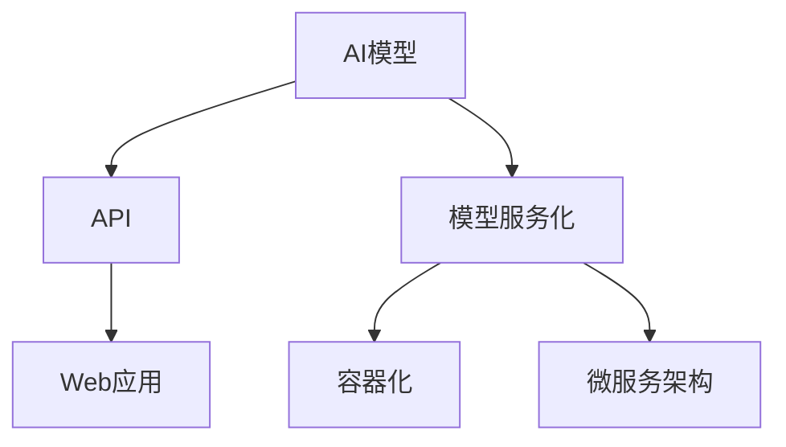

                 

关键词：AI模型部署、API、Web应用、模型服务化、容器化、微服务架构、性能优化、安全性、监控与维护

> 摘要：本文深入探讨了如何将AI模型从开发阶段成功部署到API和Web应用中。通过详细的步骤和实例，我们了解了如何实现AI模型的API接口化、Web应用集成以及模型的服务化和容器化部署，包括性能优化、安全性考虑以及监控与维护的最佳实践。

## 1. 背景介绍

随着深度学习和大数据技术的发展，AI模型在各个行业中的应用越来越广泛。从自然语言处理到图像识别，从推荐系统到自动驾驶，AI模型无处不在。然而，将AI模型从开发环境迁移到实际生产环境是一个复杂的过程，需要考虑多个方面，包括模型的性能、可靠性、可扩展性以及安全性。

在AI模型部署过程中，API和Web应用是两种常见的方式。API（应用程序接口）允许不同的软件系统之间进行通信，使模型能够以服务的形式被其他应用调用。而Web应用则提供了用户与AI模型交互的界面，使得AI服务更加用户友好。

本文的目标是提供一套全面的指南，帮助读者了解如何将AI模型部署到API和Web应用中，并探讨相关的技术细节和实践经验。

## 2. 核心概念与联系

在开始具体实施之前，我们需要明确几个核心概念和它们之间的关系。

### 2.1 AI模型

AI模型是指通过机器学习算法训练出来的计算机程序，可以接受输入数据并生成相应的输出。常见的模型有神经网络、决策树、支持向量机等。

### 2.2 API

API是一种接口，用于允许不同的软件系统之间进行通信。在AI模型部署中，API通常用于暴露模型的功能，使得其他应用可以通过HTTP请求调用模型服务。

### 2.3 Web应用

Web应用是一种基于网页的应用程序，可以通过浏览器访问。Web应用可以与API集成，使用户能够与AI模型进行交互。

### 2.4 模型服务化

模型服务化是指将AI模型封装为一个服务，通过API对外提供服务。服务化可以提高模型的复用性、可维护性和可扩展性。

### 2.5 容器化

容器化是一种轻量级虚拟化技术，可以将应用程序及其运行环境封装在一起，实现环境的隔离和一致性。容器化有助于简化模型的部署过程，提高部署的灵活性和可移植性。

### 2.6 微服务架构

微服务架构是一种基于服务的方式来组织应用程序，每个服务都是独立部署、独立运行的小型应用。微服务架构有助于提高应用程序的可维护性和可扩展性。

以下是上述核心概念之间的联系：



## 3. 核心算法原理 & 具体操作步骤

### 3.1 算法原理概述

在部署AI模型之前，我们需要了解模型背后的算法原理。以下是一些常见的算法原理：

- **神经网络**：通过多层神经元的连接和激活函数，对输入数据进行特征提取和分类。
- **决策树**：通过一系列的决策规则，对输入数据进行分类或回归。
- **支持向量机（SVM）**：通过找到一个最佳的超平面，将不同类别的数据分开。

### 3.2 算法步骤详解

#### 3.2.1 模型训练

- **数据预处理**：清洗数据，进行特征工程，将数据转换为适合训练的格式。
- **模型选择**：选择合适的模型，例如神经网络、决策树或SVM。
- **训练过程**：使用训练数据对模型进行训练，调整模型参数。
- **评估模型**：使用验证数据评估模型性能，调整模型参数或选择更好的模型。

#### 3.2.2 模型服务化

- **接口设计**：设计API接口，定义模型的输入和输出。
- **服务部署**：将模型部署为API服务，确保服务的稳定性和高性能。

#### 3.2.3 容器化部署

- **Dockerfile编写**：编写Dockerfile，定义模型的运行环境。
- **容器构建**：使用Docker构建容器镜像。
- **容器运行**：部署容器，确保服务的可用性和可靠性。

#### 3.2.4 微服务架构

- **服务拆分**：将应用程序拆分为多个微服务。
- **服务注册与发现**：使用服务注册与发现机制，确保服务之间可以互相访问。
- **服务监控**：监控服务的性能和健康状态。

### 3.3 算法优缺点

每种算法都有其优缺点，具体取决于应用场景和数据集。以下是一些常见算法的优缺点：

- **神经网络**：强大的特征提取能力，适用于复杂任务，但训练过程较慢，对数据要求较高。
- **决策树**：简单易懂，易于解释，但容易过拟合。
- **支持向量机**：适用于高维空间，但计算复杂度较高。

### 3.4 算法应用领域

AI模型在多个领域都有广泛的应用，包括但不限于：

- **金融**：信用评分、风险管理、欺诈检测。
- **医疗**：疾病预测、诊断辅助、个性化治疗。
- **零售**：客户行为分析、推荐系统、库存管理。
- **制造**：质量检测、设备维护、生产优化。

## 4. 数学模型和公式 & 详细讲解 & 举例说明

在AI模型中，数学模型和公式起着至关重要的作用。以下我们将详细讲解一些常见的数学模型和公式，并通过实例进行说明。

### 4.1 数学模型构建

以神经网络为例，其基本结构包括输入层、隐藏层和输出层。每个层由多个神经元组成，神经元之间的连接通过权重和偏置来传递信息。神经元的激活函数通常为Sigmoid或ReLU。

假设我们有一个简单的神经网络模型，输入层有3个神经元，隐藏层有2个神经元，输出层有1个神经元。输入数据为\( x_1, x_2, x_3 \)，隐藏层激活值为\( a_1, a_2, b_1, b_2 \)，输出值为\( y \)。

输入层到隐藏层的权重为\( w_{11}, w_{12}, w_{13}, w_{21}, w_{22}, w_{23} \)，隐藏层到输出层的权重为\( v_{1}, v_{2} \)，偏置为\( b_1, b_2, c \)。

### 4.2 公式推导过程

隐藏层激活值计算公式为：
\[ a_1 = \sigma(w_{11}x_1 + w_{12}x_2 + w_{13}x_3 + b_1) \]
\[ a_2 = \sigma(w_{21}x_1 + w_{22}x_2 + w_{23}x_3 + b_2) \]

输出层激活值计算公式为：
\[ y = \sigma(v_{1}a_1 + v_{2}a_2 + c) \]

其中，\( \sigma \)为Sigmoid函数：
\[ \sigma(x) = \frac{1}{1 + e^{-x}} \]

### 4.3 案例分析与讲解

假设我们有一个输入数据集，其中包含以下数据点：
\[ (x_1, x_2, x_3) = (2, 3, 4) \]

我们可以使用上述公式计算隐藏层和输出层的激活值：

1. 首先计算隐藏层激活值：
\[ a_1 = \sigma(w_{11} \cdot 2 + w_{12} \cdot 3 + w_{13} \cdot 4 + b_1) \]
\[ a_2 = \sigma(w_{21} \cdot 2 + w_{22} \cdot 3 + w_{23} \cdot 4 + b_2) \]

2. 然后计算输出层激活值：
\[ y = \sigma(v_{1}a_1 + v_{2}a_2 + c) \]

通过调整权重和偏置，我们可以使输出值更接近目标值。

## 5. 项目实践：代码实例和详细解释说明

### 5.1 开发环境搭建

在开始项目实践之前，我们需要搭建一个适合AI模型部署的开发环境。以下是一个简单的步骤：

1. 安装Python环境（建议使用Python 3.8及以上版本）。
2. 安装Docker和Docker-CE。
3. 安装Kubernetes集群（可选）。

### 5.2 源代码详细实现

以下是一个简单的示例，展示了如何使用Python和Flask框架创建一个简单的API服务，并将其容器化。

**app.py**（Flask API服务）：

```python
from flask import Flask, request, jsonify
from sklearn.externals import joblib
import numpy as np

app = Flask(__name__)

# 加载模型
model = joblib.load('model.joblib')

@app.route('/predict', methods=['POST'])
def predict():
    data = request.get_json()
    features = np.array([list(data.values())])
    prediction = model.predict(features)
    return jsonify({'prediction': prediction[0]})

if __name__ == '__main__':
    app.run(host='0.0.0.0', port=5000)
```

**Dockerfile**（容器镜像文件）：

```Dockerfile
FROM python:3.8-slim

WORKDIR /app

COPY requirements.txt ./
RUN pip install -r requirements.txt

COPY . .

CMD ["python", "app.py"]
```

**requirements.txt**（依赖项）：

```
Flask==2.0.1
scikit-learn==0.24.2
```

### 5.3 代码解读与分析

1. **Flask API服务**：我们使用Flask框架创建了一个简单的API服务，用于接收输入数据并返回预测结果。
2. **模型加载**：使用scikit-learn的joblib模块加载预训练的模型。
3. **路由定义**：定义了一个 `/predict` 路由，用于处理POST请求，并返回预测结果。
4. **容器镜像**：Dockerfile定义了基于Python 3.8-slim的基础镜像，并安装了必要的依赖项。最后，将应用程序的源代码复制到容器镜像中，并指定了容器的启动命令。

### 5.4 运行结果展示

1. **构建容器镜像**：在终端执行以下命令：
   ```bash
   docker build -t my_api .
   ```
2. **运行容器**：在终端执行以下命令：
   ```bash
   docker run -p 5000:5000 my_api
   ```
3. **测试API**：使用curl或Postman等工具发送POST请求到 `http://localhost:5000/predict`，并将输入数据以JSON格式发送。

例如，使用curl测试API：
```bash
curl -X POST -H "Content-Type: application/json" -d '{"feature1": 2, "feature2": 3, "feature3": 4}' http://localhost:5000/predict
```

返回结果可能如下所示：
```json
{"prediction": 1}
```

## 6. 实际应用场景

AI模型的部署不仅限于学术研究，它在实际应用场景中也有着广泛的应用。以下是一些常见的应用场景：

### 6.1 金融领域

- **信用评分**：使用AI模型对个人或企业的信用进行评分，帮助金融机构评估信用风险。
- **欺诈检测**：通过分析交易行为和用户行为，检测并预防欺诈行为。

### 6.2 医疗领域

- **疾病预测**：利用AI模型预测疾病的发生，为医生提供诊断辅助。
- **个性化治疗**：根据患者的病史和基因信息，为患者提供个性化的治疗方案。

### 6.3 零售领域

- **推荐系统**：使用AI模型分析用户行为，提供个性化的商品推荐。
- **库存管理**：预测未来商品的需求，优化库存水平。

### 6.4 制造领域

- **质量检测**：使用AI模型对生产线的产品进行质量检测，确保产品质量。
- **设备维护**：预测设备故障，提前进行维护，减少设备停机时间。

### 6.5 交通领域

- **交通流量预测**：使用AI模型预测交通流量，优化交通信号控制。
- **自动驾驶**：利用AI模型实现自动驾驶功能，提高道路安全。

## 7. 工具和资源推荐

### 7.1 学习资源推荐

- **书籍**：《深度学习》（Ian Goodfellow、Yoshua Bengio、Aaron Courville 著）
- **在线课程**：Coursera上的《深度学习专项课程》、Udacity的《深度学习纳米学位》
- **博客和社区**：知乎、CSDN、Medium上的AI相关博客

### 7.2 开发工具推荐

- **编程语言**：Python、Java、R
- **框架**：TensorFlow、PyTorch、Scikit-learn
- **容器化工具**：Docker、Kubernetes
- **API服务**：Flask、Django、Spring Boot

### 7.3 相关论文推荐

- **《Deep Learning》（Ian Goodfellow、Yoshua Bengio、Aaron Courville 著）**
- **《Convolutional Neural Networks for Visual Recognition》（Geoffrey Hinton、Li Deng、Dharwashan Satyanarayanan、Marc’Aurelio Ranzato、Yukun Zhu 著）**
- **《Recurrent Neural Networks for Language Modeling》（Yoshua Bengio、Samy Bengio、Paul Simard 著）**

## 8. 总结：未来发展趋势与挑战

### 8.1 研究成果总结

近年来，AI模型在各个领域取得了显著的成果。深度学习算法的突破使得模型在图像识别、语音识别和自然语言处理等领域取得了前所未有的准确率。此外，随着云计算和大数据技术的发展，AI模型的训练和部署变得更加高效和灵活。

### 8.2 未来发展趋势

未来，AI模型部署将朝着以下方向发展：

- **边缘计算**：将AI模型部署到边缘设备，降低延迟，提高响应速度。
- **联邦学习**：通过分布式计算，保护用户隐私，同时进行模型训练。
- **无服务器架构**：利用无服务器架构，实现按需扩展和成本优化。

### 8.3 面临的挑战

尽管AI模型部署取得了很大的进展，但仍然面临以下挑战：

- **数据隐私和安全**：如何在保证数据隐私和安全的前提下，进行有效的模型训练和部署。
- **可解释性**：如何提高AI模型的透明度和可解释性，使其更易于理解和信任。
- **性能优化**：如何在有限的计算资源下，提高模型的性能和效率。

### 8.4 研究展望

为了应对上述挑战，未来的研究可以从以下几个方面展开：

- **隐私保护技术**：研究更为先进的隐私保护技术，确保数据隐私和安全。
- **可解释性方法**：开发新的方法，提高AI模型的透明度和可解释性。
- **高效算法**：研究更高效的算法和模型，提高模型性能和效率。

## 9. 附录：常见问题与解答

### 9.1 如何选择合适的模型？

选择合适的模型取决于应用场景和数据集。以下是一些常见的考虑因素：

- **任务类型**：分类、回归、聚类等。
- **数据集大小**：数据量较大时，可以考虑使用深度学习模型；数据量较小时，可以考虑使用传统的机器学习算法。
- **计算资源**：计算资源有限时，可以考虑使用轻量级模型；计算资源充足时，可以考虑使用复杂的深度学习模型。

### 9.2 如何优化模型性能？

以下是一些常见的优化策略：

- **数据预处理**：对数据进行清洗、归一化、特征工程等预处理，提高模型训练效果。
- **模型选择**：选择合适的模型，例如神经网络、决策树、支持向量机等。
- **超参数调整**：调整模型超参数，例如学习率、正则化参数等，优化模型性能。
- **交叉验证**：使用交叉验证方法，选择最佳的模型参数。

### 9.3 如何确保模型安全性和隐私保护？

以下是一些常见的策略：

- **数据加密**：对敏感数据进行加密处理，确保数据在传输和存储过程中的安全性。
- **同态加密**：使用同态加密技术，在加密状态下对数据进行计算，确保数据隐私。
- **差分隐私**：使用差分隐私技术，在模型训练过程中引入噪声，保护数据隐私。

### 9.4 如何监控和维护模型？

以下是一些常见的监控和维护策略：

- **性能监控**：监控模型的准确率、召回率、F1分数等关键指标，确保模型性能稳定。
- **异常检测**：使用异常检测方法，及时发现模型异常，并进行调整。
- **模型更新**：定期更新模型，以适应新的数据集和需求。
- **文档记录**：详细记录模型训练、部署和维护的过程，便于后续维护和优化。

---
**作者：禅与计算机程序设计艺术 / Zen and the Art of Computer Programming**

