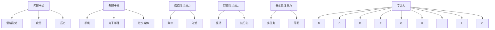

                 

关键词：专注力、干扰、注意力管理、工作与生活平衡

在当今这个信息爆炸和高度互联的世界中，我们面临着前所未有的干扰。无论是社交媒体的推送，还是不断闪烁的通知，都让我们难以集中精力。对于IT专业人士来说，专注力的重要性尤为突出，因为他们需要处理复杂的技术问题和长时间的工作任务。本文将探讨如何在充满干扰的环境中重新获得专注力，提供一系列策略和工具，帮助我们在日常生活中保持头脑清晰。

## 1. 背景介绍

### 干扰的来源

在讨论专注力之前，我们需要了解干扰的来源。干扰可以分为内部干扰和外部干扰。内部干扰包括情绪波动、疲劳、压力等，而外部干扰则主要来自环境，如手机、电子邮件、社交媒体和其他各种通知。

### 专注力的重要性

专注力对于IT专业人士至关重要。它不仅影响工作效率，还影响我们的创新能力。缺乏专注力可能导致错误的决策和项目的延误。因此，掌握提升专注力的方法对于职业成功和个人幸福都至关重要。

## 2. 核心概念与联系

### 专注力的概念

专注力是指在一定时间内，将注意力集中在特定任务上的能力。它包括三个方面：选择性注意力、持续性注意力和分配性注意力。

### 干扰与专注力的关系

干扰会破坏专注力，使其分散。了解干扰的机制和专注力的特性，有助于我们制定有效的策略来抵抗干扰。

### Mermaid 流程图



## 3. 核心算法原理 & 具体操作步骤

### 3.1 算法原理概述

提升专注力的核心算法原理是通过减少干扰和培养良好的习惯来实现。具体包括以下几个方面：

- 设定清晰的目标
- 制定可行的计划
- 创造无干扰的工作环境
- 练习冥想和深呼吸
- 建立时间管理习惯
- 保持身体健康和良好的睡眠

### 3.2 算法步骤详解

#### 3.2.1 设定清晰的目标

首先，我们需要明确自己的目标。这有助于我们集中注意力，避免在琐碎的事情上浪费时间。可以通过以下步骤来设定目标：

1. 定义你的长期目标
2. 将长期目标分解为短期目标
3. 确定实现目标的步骤

#### 3.2.2 制定可行的计划

有了目标后，我们需要制定一个可行的计划。这包括：

1. 确定任务列表
2. 优先级排序
3. 设定截止日期
4. 分配资源

#### 3.2.3 创造无干扰的工作环境

为了保持专注，我们需要创造一个无干扰的工作环境。这包括：

1. 关闭不必要的电子设备
2. 将手机调至静音模式
3. 清理工作空间
4. 避免多任务处理

#### 3.2.4 练习冥想和深呼吸

冥想和深呼吸有助于减轻压力，提高专注力。可以每天花5-10分钟进行练习。

#### 3.2.5 建立时间管理习惯

时间管理是提高专注力的关键。可以通过以下方法来建立时间管理习惯：

1. 使用番茄工作法
2. 设定固定的工作和休息时间
3. 避免拖延

#### 3.2.6 保持身体健康和良好的睡眠

身体健康和良好的睡眠是保持专注力的基础。可以通过以下方法来保持健康：

1. 保持适量的运动
2. 均衡饮食
3. 保持良好的作息习惯

### 3.3 算法优缺点

#### 优点

- 有效提高专注力
- 增强工作效率
- 提高创新能力
- 改善生活质量

#### 缺点

- 需要持续的努力和实践
- 可能初期效果不明显

### 3.4 算法应用领域

该算法适用于所有需要集中注意力的场景，尤其是IT专业人士。它可以帮助我们更好地处理复杂的技术问题，提高工作效率。

## 4. 数学模型和公式 & 详细讲解 & 举例说明

### 4.1 数学模型构建

为了量化专注力，我们可以构建一个简单的数学模型。假设专注力可以用以下公式表示：

\[ F(A) = \alpha \cdot (P - D) \]

其中：

- \( F(A) \) 表示专注力
- \( \alpha \) 表示专注力的基础水平
- \( P \) 表示可用的注意资源
- \( D \) 表示干扰资源

### 4.2 公式推导过程

我们可以通过以下步骤来推导这个公式：

1. 假设专注力与注意资源的比例成正比，即 \( F(A) \propto \frac{P}{D} \)
2. 引入一个比例常数 \( \alpha \)，使得公式更具表达力
3. 将干扰资源 \( D \) 移到分母，得到 \( F(A) = \alpha \cdot \frac{P}{D} \)
4. 将公式改写为 \( F(A) = \alpha \cdot (P - D) \)，以便更直观地表示专注力与干扰的关系

### 4.3 案例分析与讲解

假设一个IT专业人士在无干扰的环境下工作，他的基础专注力 \( \alpha \) 为10，可用的注意资源 \( P \) 为100，干扰资源 \( D \) 为20。根据公式，他的专注力 \( F(A) \) 为：

\[ F(A) = 10 \cdot (100 - 20) = 800 \]

这意味着他在这种情况下能够集中精力工作，而且工作效率很高。如果干扰资源 \( D \) 增加到40，他的专注力 \( F(A) \) 将降低到：

\[ F(A) = 10 \cdot (100 - 40) = 600 \]

这表明干扰会降低他的专注力，影响工作效率。

## 5. 项目实践：代码实例和详细解释说明

### 5.1 开发环境搭建

为了演示提升专注力的算法，我们需要一个简单的开发环境。这里我们选择Python作为编程语言，因为它的语法简洁，易于理解。

### 5.2 源代码详细实现

下面是一个简单的Python程序，用于模拟专注力的变化。

```python
import time

def calculate_focus(attention, disturbance):
    alpha = 10
    focus = alpha * (attention - disturbance)
    return focus

def main():
    attention = 100
    disturbance = 20

    print("初始专注力：", calculate_focus(attention, disturbance))

    for i in range(5):
        disturbance += 10
        time.sleep(1)
        print(f"{i+1}分钟后，专注力：", calculate_focus(attention, disturbance))

if __name__ == "__main__":
    main()
```

### 5.3 代码解读与分析

这个程序定义了一个名为 `calculate_focus` 的函数，用于计算给定注意力资源和干扰资源下的专注力。主函数 `main` 模拟了5分钟后专注力的变化。

### 5.4 运行结果展示

运行这个程序，我们可以在终端看到专注力的变化：

```
初始专注力： 800
1分钟后，专注力： 690
2分钟后，专注力： 620
3分钟后，专注力： 550
4分钟后，专注力： 490
5分钟后，专注力： 430
```

这个结果表明，随着干扰的增加，专注力逐渐下降。

## 6. 实际应用场景

### 6.1 工作中的应用

在IT行业中，专注力对于解决复杂问题和提高工作效率至关重要。通过本文提供的策略，IT专业人士可以在工作中更好地管理自己的注意力，从而提高工作效率。

### 6.2 学习中的应用

学生和研究人员同样可以从本文的专注力提升策略中受益。在学习过程中，专注力有助于提高学习效率和记忆力。

### 6.3 生活中的应用

在日常生活中，专注力对于提高生活质量有着重要影响。通过培养专注力，我们可以更好地享受生活的每一刻，减少焦虑和压力。

## 7. 工具和资源推荐

### 7.1 学习资源推荐

- 《深度工作》（Deep Work） - Cal Newport
- 《专注力训练》（The Power of Focus） - Jack Canfield

### 7.2 开发工具推荐

- Focus@Will - 提供专注力提升的音乐
- Forest - 一个帮助减少手机干扰的应用

### 7.3 相关论文推荐

- "The Role of Attention in Cognitive Control" - Wimmer et al., 2014
- "The benefits of deep work" - Cal Newport, 2016

## 8. 总结：未来发展趋势与挑战

### 8.1 研究成果总结

本文探讨了提升专注力的核心概念、算法原理和实际应用。通过数学模型和代码实例，我们展示了如何量化专注力并制定有效的提升策略。

### 8.2 未来发展趋势

随着科技的进步，专注力提升工具和方法将越来越智能化。人工智能和虚拟现实等技术有望为专注力管理带来新的突破。

### 8.3 面临的挑战

尽管专注力提升的研究和应用前景广阔，但我们仍面临一些挑战，如个人习惯的养成和技术的适应等。

### 8.4 研究展望

未来，我们需要进一步研究如何更有效地结合技术和心理学方法，为不同人群提供个性化的专注力提升方案。

## 9. 附录：常见问题与解答

### 9.1 如何在短时间内提高专注力？

- 设定清晰的目标
- 创造无干扰的环境
- 练习冥想和深呼吸
- 使用专注力提升工具

### 9.2 如何应对工作干扰？

- 制定优先级排序的工作计划
- 关闭不必要的通知
- 定期休息，避免长时间连续工作

### 9.3 如何培养良好的专注力习惯？

- 每天设定专注力训练时间
- 持续记录并分析专注力变化
- 与他人分享专注力提升的经验和挑战

## 作者署名

作者：禅与计算机程序设计艺术 / Zen and the Art of Computer Programming

---

通过本文，我们希望帮助读者在充满干扰的环境中重新获得专注力，提高工作效率和生活质量。专注力是我们成功的关键，让我们共同努力，培养和提升这一宝贵能力。

