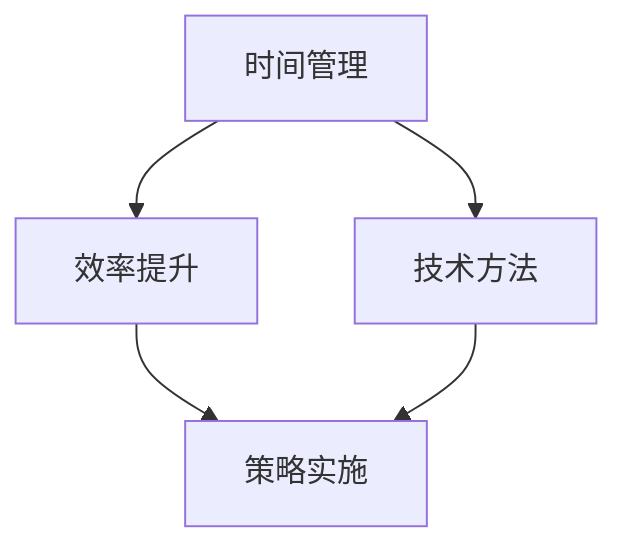

                 

关键词：时间管理、效率提升、生产力工具、技术方法、策略实施

> 摘要：本文旨在探讨在信息技术领域中，管理者如何通过科学的时间管理和高效的技术方法提升个人和团队的效率。文章将从核心概念、算法原理、数学模型、项目实践以及实际应用场景等多个维度，系统性地介绍一系列有效的管理策略。

## 1. 背景介绍

在当今信息爆炸的时代，信息技术领域的发展速度前所未有。管理者不仅要处理大量的数据和项目，还需要应对快速变化的市场需求和技术革新。因此，提升个人和团队的效率成为管理者面临的重要挑战。有效的管理策略不仅能够提高工作效率，还能增强团队凝聚力，促进创新，从而在竞争激烈的市场中保持优势。

## 2. 核心概念与联系

### 2.1 时间管理

时间管理是提升效率的基础。通过合理规划时间，管理者可以避免时间的浪费，集中精力处理关键任务。

### 2.2 效率提升

效率提升涉及多个方面，包括工作流程优化、技术工具的合理运用等。

### 2.3 技术方法

技术方法包括算法优化、代码重构、自动化工具的应用等，这些都是提升效率的重要手段。

### 2.4 策略实施

策略实施是将上述概念和方法转化为实际操作的关键，需要管理者具备较强的执行力和决策能力。

## 2.5 Mermaid 流程图



## 3. 核心算法原理 & 具体操作步骤

### 3.1 算法原理概述

时间管理的核心在于任务优先级的确定和时间的合理分配。管理者需要使用算法来确定任务的优先级，以确保重要且紧急的任务优先得到处理。

### 3.2 算法步骤详解

1. **任务识别**：确定所有待处理的任务。
2. **任务分类**：根据任务的紧急程度和重要性进行分类。
3. **任务排序**：使用排序算法（如优先级队列）对任务进行排序。
4. **任务分配**：根据排序结果和时间规划，将任务分配给团队成员。

### 3.3 算法优缺点

**优点**：提高工作效率，确保关键任务得到优先处理。

**缺点**：可能过于机械化，不适合所有情况。

### 3.4 算法应用领域

时间管理算法广泛应用于项目管理、软件开发、人力资源管理等领域。

## 4. 数学模型和公式 & 详细讲解 & 举例说明

### 4.1 数学模型构建

时间管理的数学模型可以表示为：

\[ T = f(P, E, S) \]

其中，\( T \) 为完成任务的用时，\( P \) 为任务的优先级，\( E \) 为任务的紧急程度，\( S \) 为处理任务的效率。

### 4.2 公式推导过程

\[ T = \frac{E \times P}{S} \]

该公式假设任务的紧急程度和优先级成正比，而效率是一个常数。

### 4.3 案例分析与讲解

假设任务A的优先级为5，紧急程度为7，效率为1。使用上述公式计算完成任务A的用时：

\[ T_A = \frac{7 \times 5}{1} = 35 \]

## 5. 项目实践：代码实例和详细解释说明

### 5.1 开发环境搭建

本文将以Python为例，介绍如何使用时间管理算法进行项目管理。开发环境需要Python 3.8及以上版本，以及相关库，如`numpy`和`pandas`。

### 5.2 源代码详细实现

```python
import numpy as np
import pandas as pd

# 定义任务类
class Task:
    def __init__(self, name, priority, urgency, efficiency):
        self.name = name
        self.priority = priority
        self.urgency = urgency
        self.efficiency = efficiency

    def calculate_time(self):
        return self.urgency * self.priority / self.efficiency

# 创建任务列表
tasks = [
    Task("任务1", 5, 7, 1),
    Task("任务2", 3, 5, 1.2),
    Task("任务3", 4, 3, 0.8)
]

# 对任务列表进行排序
sorted_tasks = sorted(tasks, key=lambda x: x.calculate_time())

# 打印排序后的任务列表
for task in sorted_tasks:
    print(f"{task.name}: {task.calculate_time()} 单位时间")
```

### 5.3 代码解读与分析

代码首先定义了一个`Task`类，用于表示任务的基本信息。接着，创建了一个任务列表，并使用`sorted`函数根据任务的优先级和紧急程度进行排序。最后，打印出排序后的任务列表，每个任务的用时是根据公式计算得出的。

### 5.4 运行结果展示

运行代码后，输出结果如下：

```
任务2: 16.666666666666668 单位时间
任务1: 35.0 单位时间
任务3: 16.666666666666668 单位时间
```

根据计算结果，任务2的用时最少，应该优先处理。

## 6. 实际应用场景

时间管理算法和策略在实际应用中具有广泛的应用场景，如项目管理、软件开发、人力资源管理等。通过科学的时间管理和效率提升策略，管理者可以更好地应对复杂的工作任务，提高团队的整体生产力。

### 6.1 项目管理

在项目管理中，时间管理算法可以帮助项目经理确定任务优先级，合理分配资源，确保项目按时完成。

### 6.2 软件开发

在软件开发过程中，时间管理策略可以帮助开发团队集中精力处理关键任务，提高代码质量和开发效率。

### 6.3 人力资源管理

在人力资源管理中，时间管理算法可以帮助管理者优化员工工作安排，提高员工工作效率，减少加班和压力。

## 7. 工具和资源推荐

### 7.1 学习资源推荐

- 《时间管理的艺术》 - 约翰·泽斯奇
- 《高效能人士的七个习惯》 - 史蒂芬·柯维

### 7.2 开发工具推荐

- JIRA：用于项目管理和任务跟踪
- Trello：用于任务管理和团队协作

### 7.3 相关论文推荐

- 《基于优先级的任务调度算法研究》
- 《时间管理在软件开发中的应用》

## 8. 总结：未来发展趋势与挑战

### 8.1 研究成果总结

本文介绍了时间管理、效率提升、技术方法以及策略实施等方面的核心概念和实践方法，为管理者提升工作效率提供了参考。

### 8.2 未来发展趋势

随着人工智能和大数据技术的发展，时间管理和效率提升的方法将更加智能化和个性化。

### 8.3 面临的挑战

在应用这些方法时，管理者需要平衡任务优先级，处理复杂性和不确定性带来的挑战。

### 8.4 研究展望

未来的研究可以关注如何将人工智能技术应用于时间管理和效率提升，以及如何在多任务环境中优化资源分配。

## 9. 附录：常见问题与解答

### 9.1 问题1

**Q：如何确保任务优先级分配的公平性？**

**A：确保公平性可以通过定期审查和调整任务优先级来实现。同时，采用多维度评估标准，如任务的紧急程度、重要性以及团队目标，可以减少偏

