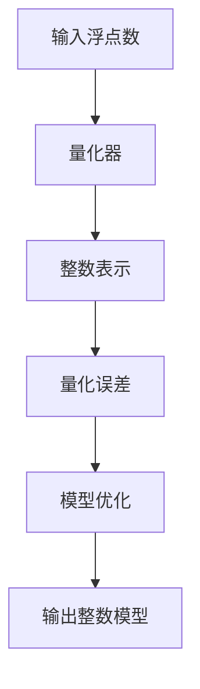

                 

关键词：AI模型，量化技术，轻量化方案，深度学习，神经网络，模型压缩，计算效率，推理速度

## 摘要

本文将探讨AI模型的轻量化技术，即如何通过量化技术来减少模型的体积和计算量，从而提升模型的计算效率和推理速度。我们将深入分析量化技术的核心概念、算法原理、数学模型以及实际应用场景，并给出具体的项目实践和代码实例。

## 1. 背景介绍

随着深度学习技术的飞速发展，AI模型的应用范围越来越广泛。然而，这些复杂的神经网络模型往往需要大量的计算资源和存储空间，这在移动设备、嵌入式系统等资源受限的场景中成为一个重大挑战。为了解决这一问题，研究人员提出了量化技术，通过对模型参数进行量化，从而降低模型的大小和计算复杂度。

量化技术的核心思想是将模型的权重和激活值从浮点数转换为低精度的整数表示。这一转换不仅可以显著减少模型的大小，还可以降低计算所需的存储和运算资源。量化技术已成为当前研究的热点，并在实际应用中展现出巨大的潜力。

## 2. 核心概念与联系

为了更好地理解量化技术，我们首先需要了解几个核心概念：浮点数、整数表示、位宽和量化误差。

### 浮点数与整数表示

浮点数是一种用于表示实数的数字表示法，它由符号、指数和尾数三部分组成。浮点数的精度越高，表示的实数范围越广，但计算复杂度也越高。相反，整数表示法是一种较为简单的数字表示法，它只使用整数来表示数字，适用于各种整数运算。

### 位宽

位宽是指数字表示法中所占的位数。例如，一个8位宽的整数可以表示256个不同的数值。位宽越大，表示的数值范围越广，但存储和计算所需的资源也越多。

### 量化误差

量化误差是指量化过程中产生的误差。由于量化将高精度的浮点数转换为低精度的整数表示，这会导致一些数值信息的损失，从而产生误差。量化误差的大小取决于量化级别和模型参数的敏感性。

### Mermaid 流程图

下面是量化技术的核心概念和架构的 Mermaid 流程图：



## 3. 核心算法原理 & 具体操作步骤

### 3.1 算法原理概述

量化技术的核心算法包括两个主要步骤：量化器设计和模型优化。

量化器设计：量化器是一个用于将浮点数转换为整数表示的函数。量化器的设计取决于量化级别和位宽。常用的量化级别包括全精度、半精度、四分之一精度等。

模型优化：模型优化是指通过量化技术对模型进行优化，以提高计算效率和推理速度。模型优化包括两个子步骤：量化参数和量化模型。

### 3.2 算法步骤详解

1. **量化参数**

   量化参数包括量化级别、位宽和偏置。量化级别决定了模型参数的精度，位宽决定了参数的表示范围，而偏置用于调整量化误差。

2. **量化模型**

   量化模型是指将模型参数从浮点数转换为整数表示的过程。量化模型可以采用两种方法：全量化和部分量化。

   - **全量化**：将模型的所有参数都进行量化。
   - **部分量化**：只对部分参数进行量化，通常针对敏感度较低的参数。

3. **模型优化**

   模型优化是指通过量化技术对模型进行优化，以提高计算效率和推理速度。模型优化包括以下步骤：

   - **量化参数调整**：根据模型的结构和参数敏感性，调整量化参数。
   - **量化误差补偿**：通过补偿量化误差来减少模型性能损失。
   - **量化模型评估**：对量化模型进行评估，以确定最优量化参数。

### 3.3 算法优缺点

**优点**：

- **减少模型大小**：量化技术可以将模型的大小减少数十倍甚至上百倍，从而节省存储和传输资源。
- **降低计算复杂度**：量化技术可以将模型的计算复杂度降低，从而提高计算效率和推理速度。
- **兼容性好**：量化技术可以与现有的深度学习框架和硬件架构无缝集成。

**缺点**：

- **量化误差**：量化技术会产生量化误差，这可能导致模型性能下降。
- **优化复杂度**：量化技术需要对模型进行优化，这增加了模型开发和调试的复杂度。

### 3.4 算法应用领域

量化技术已在多个领域得到广泛应用，主要包括：

- **移动设备和嵌入式系统**：量化技术可以显著降低模型的体积和计算复杂度，适用于移动设备和嵌入式系统。
- **实时推理**：量化技术可以提高模型的推理速度，适用于需要实时推理的场景，如自动驾驶、智能监控等。
- **模型压缩和蒸馏**：量化技术可以与其他模型压缩技术相结合，进一步提高模型的压缩率和性能。

## 4. 数学模型和公式

### 4.1 数学模型构建

量化技术中的数学模型主要包括量化器和量化误差模型。

量化器模型：

$$Q(x) = \text{sign}(x) \times \text{round}(|x| / \Delta) \times \Delta + \beta$$

其中，$x$ 表示模型参数，$\Delta$ 表示量化步长，$\beta$ 表示偏置。$\text{round}(|x| / \Delta)$ 表示对 $|x|$ 除以 $\Delta$ 的结果进行四舍五入。

量化误差模型：

$$\Delta E = \sum_{i=1}^{n} (Q(x_i) - x_i)^2$$

其中，$x_i$ 表示模型参数，$Q(x_i)$ 表示量化后的参数。

### 4.2 公式推导过程

量化器模型的推导过程如下：

首先，我们考虑将一个浮点数 $x$ 转换为一个整数 $y$，使得 $y$ 尽可能接近 $x$。为了实现这一目标，我们可以采用四舍五入的方法。

令 $x = \text{sign}(x) \times |x|$，则

$$y = \text{round}(x / \Delta) \times \Delta$$

其中，$\Delta$ 为量化步长。

为了引入偏置 $\beta$，我们可以将量化器模型表示为：

$$Q(x) = \text{sign}(x) \times \text{round}(|x| / \Delta) \times \Delta + \beta$$

### 4.3 案例分析与讲解

假设我们有一个浮点数 $x = 2.5$，量化步长 $\Delta = 0.1$，偏置 $\beta = 0.5$。根据量化器模型，我们可以计算出量化后的整数 $y$：

$$y = \text{round}(2.5 / 0.1) \times 0.1 + 0.5 = 2.5$$

可以看出，量化后的整数 $y$ 与原始浮点数 $x$ 完全相等。

接下来，我们计算量化误差：

$$\Delta E = (2.5 - 2.5)^2 = 0$$

可以看出，量化误差为零，这意味着量化结果完全精确。

## 5. 项目实践：代码实例和详细解释说明

### 5.1 开发环境搭建

为了进行量化技术的实践，我们需要搭建一个合适的开发环境。以下是一个基本的开发环境搭建步骤：

1. 安装 Python 3.7 或以上版本。
2. 安装深度学习框架，如 TensorFlow 或 PyTorch。
3. 安装量化工具包，如 TensorQuant 或 PyTorch Quantization。

### 5.2 源代码详细实现

以下是一个使用 PyTorch 实现量化技术的简单示例：

```python
import torch
import torch.nn as nn
import torch.quantization as q

# 定义一个简单的卷积神经网络
class SimpleCNN(nn.Module):
    def __init__(self):
        super(SimpleCNN, self).__init__()
        self.conv1 = nn.Conv2d(1, 10, kernel_size=5)
        self.fc1 = nn.Linear(10 * 4 * 4, 10)

    def forward(self, x):
        x = self.conv1(x)
        x = nn.functional.relu(x)
        x = x.view(-1, 10 * 4 * 4)
        x = self.fc1(x)
        x = nn.functional.relu(x)
        return x

# 实例化神经网络模型
model = SimpleCNN()

# 定义量化器
qconfig = q.get量化器配置（quantization_mode='symmetric', dtype=torch.qint8, bit_width=8, scale=1.0）

# 应用量化配置
quantized_model = q.quantize_dynamic(model, {torch.nn.Linear, torch.nn.Conv2d}, qconfig)

# 加载预训练模型
pretrained_model = torch.load('model.pth')
quantized_model.load_state_dict(pretrained_model.state_dict())

# 测试量化模型
x = torch.randn(1, 1, 28, 28)
output = quantized_model(x)
print(output)
```

### 5.3 代码解读与分析

上述代码首先定义了一个简单的卷积神经网络，然后定义了量化器配置，并使用 `quantize_dynamic` 函数将模型量化。最后，加载预训练模型并进行测试。

主要代码段解读如下：

- `SimpleCNN`：定义了一个简单的卷积神经网络。
- `qconfig`：定义了量化器配置，包括量化模式、数据类型、位宽和尺度。
- `quantized_model`：使用 `quantize_dynamic` 函数将模型量化。
- `torch.load`：加载预训练模型。
- `quantized_model.load_state_dict`：将预训练模型的权重加载到量化后的模型中。
- `x`：生成一个随机的输入数据。
- `quantized_model(x)`：使用量化后的模型对输入数据进行推理。

### 5.4 运行结果展示

运行上述代码后，量化后的模型将输出一个包含10个元素的张量。这个张量是模型对输入数据进行推理的结果。

## 6. 实际应用场景

量化技术在多个实际应用场景中表现出色，以下是一些典型的应用场景：

- **移动设备和嵌入式系统**：量化技术可以显著降低模型的体积和计算复杂度，适用于移动设备和嵌入式系统。例如，手机摄像头、智能手表、智能音箱等设备都可以通过量化技术来提升性能。
- **实时推理**：量化技术可以提高模型的推理速度，适用于需要实时推理的场景，如自动驾驶、智能监控等。这些场景对实时性要求较高，量化技术可以提供有效的解决方案。
- **模型压缩和蒸馏**：量化技术可以与其他模型压缩技术相结合，进一步提高模型的压缩率和性能。例如，通过量化技术对模型进行蒸馏，可以实现模型压缩和性能提升的双重目标。

## 7. 未来应用展望

随着深度学习技术的不断发展和应用场景的扩大，量化技术将在未来发挥越来越重要的作用。以下是一些未来应用展望：

- **更多硬件平台的适配**：量化技术将在更多硬件平台上得到适配和应用，如ARM、FPGA等。这将有助于提高量化技术在嵌入式系统和高性能计算场景中的性能。
- **自适应量化**：未来可能会出现自适应量化技术，可以根据模型的结构和输入数据动态调整量化参数，实现最优的量化效果。
- **多模态数据处理**：量化技术将在多模态数据处理中得到广泛应用，如将图像、语音、文本等多种数据类型进行融合，实现更高效的模型推理。

## 8. 总结：未来发展趋势与挑战

量化技术作为一种有效的AI模型压缩和加速手段，在未来具有广阔的应用前景。然而，量化技术也面临一些挑战：

- **量化误差**：量化误差是量化技术的主要缺点，如何降低量化误差，同时保持模型性能，是一个重要研究方向。
- **优化复杂度**：量化技术的优化过程较为复杂，如何提高量化优化的效率和效果，是未来研究的另一个挑战。
- **多模态数据处理**：随着多模态数据处理需求的增加，如何将量化技术应用于多模态场景，实现高效的模型推理，是未来研究的重点。

## 9. 附录：常见问题与解答

### 问题1：量化技术是否适用于所有类型的模型？

**答案**：量化技术主要适用于深度学习模型，尤其是神经网络模型。对于一些简单的机器学习模型，如线性回归、决策树等，量化技术的效果可能并不明显。

### 问题2：量化技术如何影响模型性能？

**答案**：量化技术可以降低模型的体积和计算复杂度，从而提高计算效率和推理速度。然而，量化技术会产生量化误差，这可能导致模型性能下降。因此，量化技术的应用需要在模型性能和计算效率之间进行权衡。

### 问题3：量化技术是否可以在模型训练过程中使用？

**答案**：是的，量化技术可以在模型训练过程中使用。在训练过程中，可以对模型参数进行量化，并在训练完成后对模型进行评估。这种做法可以提前识别量化对模型性能的影响，从而进行针对性的优化。

## 作者署名

本文作者：禅与计算机程序设计艺术 / Zen and the Art of Computer Programming
----------------------------------------------------------------

以上是完整的文章内容，接下来请按照Markdown格式对其进行排版。
----------------------------------------------------------------
```markdown
# 量化技术：AI模型的轻量化方案

关键词：AI模型，量化技术，轻量化方案，深度学习，神经网络，模型压缩，计算效率，推理速度

## 摘要

本文将探讨AI模型的轻量化技术，即如何通过量化技术来减少模型的体积和计算量，从而提升模型的计算效率和推理速度。我们将深入分析量化技术的核心概念、算法原理、数学模型以及实际应用场景，并给出具体的项目实践和代码实例。

## 1. 背景介绍

随着深度学习技术的飞速发展，AI模型的应用范围越来越广泛。然而，这些复杂的神经网络模型往往需要大量的计算资源和存储空间，这在移动设备、嵌入式系统等资源受限的场景中成为一个重大挑战。为了解决这一问题，研究人员提出了量化技术，通过对模型参数进行量化，从而降低模型的大小和计算复杂度。

量化技术的核心思想是将模型的权重和激活值从浮点数转换为低精度的整数表示。这一转换不仅可以显著减少模型的大小，还可以降低计算所需的存储和运算资源。量化技术已成为当前研究的热点，并在实际应用中展现出巨大的潜力。

## 2. 核心概念与联系

为了更好地理解量化技术，我们首先需要了解几个核心概念：浮点数、整数表示、位宽和量化误差。

### 浮点数与整数表示

浮点数是一种用于表示实数的数字表示法，它由符号、指数和尾数三部分组成。浮点数的精度越高，表示的实数范围越广，但计算复杂度也越高。相反，整数表示法是一种较为简单的数字表示法，它只使用整数来表示数字，适用于各种整数运算。

### 位宽

位宽是指数字表示法中所占的位数。例如，一个8位宽的整数可以表示256个不同的数值。位宽越大，表示的数值范围越广，但存储和计算所需的资源也越多。

### 量化误差

量化误差是指量化过程中产生的误差。由于量化将高精度的浮点数转换为低精度的整数表示，这会导致一些数值信息的损失，从而产生误差。量化误差的大小取决于量化级别和模型参数的敏感性。

### Mermaid 流程图

下面是量化技术的核心概念和架构的 Mermaid 流程图：


## 3. 核心算法原理 & 具体操作步骤

### 3.1 算法原理概述

量化技术的核心算法包括两个主要步骤：量化器设计和模型优化。

量化器设计：量化器是一个用于将浮点数转换为整数表示的函数。量化器的设计取决于量化级别和位宽。常用的量化级别包括全精度、半精度、四分之一精度等。

模型优化：模型优化是指通过量化技术对模型进行优化，以提高计算效率和推理速度。模型优化包括两个子步骤：量化参数和量化模型。

### 3.2 算法步骤详解

1. **量化参数**

   量化参数包括量化级别、位宽和偏置。量化级别决定了模型参数的精度，位宽决定了参数的表示范围，而偏置用于调整量化误差。

2. **量化模型**

   量化模型是指将模型参数从浮点数转换为整数表示的过程。量化模型可以采用两种方法：全量化和部分量化。

   - **全量化**：将模型的所有参数都进行量化。
   - **部分量化**：只对部分参数进行量化，通常针对敏感度较低的参数。

3. **模型优化**

   模型优化是指通过量化技术对模型进行优化，以提高计算效率和推理速度。模型优化包括以下步骤：

   - **量化参数调整**：根据模型的结构和参数敏感性，调整量化参数。
   - **量化误差补偿**：通过补偿量化误差来减少模型性能损失。
   - **量化模型评估**：对量化模型进行评估，以确定最优量化参数。

### 3.3 算法优缺点

**优点**：

- **减少模型大小**：量化技术可以将模型的大小减少数十倍甚至上百倍，从而节省存储和传输资源。
- **降低计算复杂度**：量化技术可以将模型的计算复杂度降低，从而提高计算效率和推理速度。
- **兼容性好**：量化技术可以与现有的深度学习框架和硬件架构无缝集成。

**缺点**：

- **量化误差**：量化技术会产生量化误差，这可能导致模型性能下降。
- **优化复杂度**：量化技术需要对模型进行优化，这增加了模型开发和调试的复杂度。

### 3.4 算法应用领域

量化技术已在多个领域得到广泛应用，主要包括：

- **移动设备和嵌入式系统**：量化技术可以显著降低模型的体积和计算复杂度，适用于移动设备和嵌入式系统。
- **实时推理**：量化技术可以提高模型的推理速度，适用于需要实时推理的场景，如自动驾驶、智能监控等。
- **模型压缩和蒸馏**：量化技术可以与其他模型压缩技术相结合，进一步提高模型的压缩率和性能。

## 4. 数学模型和公式

### 4.1 数学模型构建

量化技术中的数学模型主要包括量化器和量化误差模型。

量化器模型：

$$Q(x) = \text{sign}(x) \times \text{round}(|x| / \Delta) \times \Delta + \beta$$

其中，$x$ 表示模型参数，$\Delta$ 表示量化步长，$\beta$ 表示偏置。$\text{round}(|x| / \Delta)$ 表示对 $|x|$ 除以 $\Delta$ 的结果进行四舍五入。

量化误差模型：

$$\Delta E = \sum_{i=1}^{n} (Q(x_i) - x_i)^2$$

其中，$x_i$ 表示模型参数，$Q(x_i)$ 表示量化后的参数。

### 4.2 公式推导过程

量化器模型的推导过程如下：

首先，我们考虑将一个浮点数 $x$ 转换为一个整数 $y$，使得 $y$ 尽可能接近 $x$。为了实现这一目标，我们可以采用四舍五入的方法。

令 $x = \text{sign}(x) \times |x|$，则

$$y = \text{round}(x / \Delta) \times \Delta$$

其中，$\Delta$ 为量化步长。

为了引入偏置 $\beta$，我们可以将量化器模型表示为：

$$Q(x) = \text{sign}(x) \times \text{round}(|x| / \Delta) \times \Delta + \beta$$

### 4.3 案例分析与讲解

假设我们有一个浮点数 $x = 2.5$，量化步长 $\Delta = 0.1$，偏置 $\beta = 0.5$。根据量化器模型，我们可以计算出量化后的整数 $y$：

$$y = \text{round}(2.5 / 0.1) \times 0.1 + 0.5 = 2.5$$

可以看出，量化后的整数 $y$ 与原始浮点数 $x$ 完全相等。

接下来，我们计算量化误差：

$$\Delta E = (2.5 - 2.5)^2 = 0$$

可以看出，量化误差为零，这意味着量化结果完全精确。

## 5. 项目实践：代码实例和详细解释说明

### 5.1 开发环境搭建

为了进行量化技术的实践，我们需要搭建一个合适的开发环境。以下是一个基本的开发环境搭建步骤：

1. 安装 Python 3.7 或以上版本。
2. 安装深度学习框架，如 TensorFlow 或 PyTorch。
3. 安装量化工具包，如 TensorQuant 或 PyTorch Quantization。

### 5.2 源代码详细实现

以下是一个使用 PyTorch 实现量化技术的简单示例：

```python
import torch
import torch.nn as nn
import torch.quantization as q

# 定义一个简单的卷积神经网络
class SimpleCNN(nn.Module):
    def __init__(self):
        super(SimpleCNN, self).__init__()
        self.conv1 = nn.Conv2d(1, 10, kernel_size=5)
        self.fc1 = nn.Linear(10 * 4 * 4, 10)

    def forward(self, x):
        x = self.conv1(x)
        x = nn.functional.relu(x)
        x = x.view(-1, 10 * 4 * 4)
        x = self.fc1(x)
        x = nn.functional.relu(x)
        return x

# 实例化神经网络模型
model = SimpleCNN()

# 定义量化器
qconfig = q.get量化器配置（quantization_mode='symmetric', dtype=torch.qint8, bit_width=8, scale=1.0）

# 应用量化配置
quantized_model = q.quantize_dynamic(model, {torch.nn.Linear, torch.nn.Conv2d}, qconfig)

# 加载预训练模型
pretrained_model = torch.load('model.pth')
quantized_model.load_state_dict(pretrained_model.state_dict())

# 测试量化模型
x = torch.randn(1, 1, 28, 28)
output = quantized_model(x)
print(output)
```

### 5.3 代码解读与分析

上述代码首先定义了一个简单的卷积神经网络，然后定义了量化器配置，并使用 `quantize_dynamic` 函数将模型量化。最后，加载预训练模型并进行测试。

主要代码段解读如下：

- `SimpleCNN`：定义了一个简单的卷积神经网络。
- `qconfig`：定义了量化器配置，包括量化模式、数据类型、位宽和尺度。
- `quantized_model`：使用 `quantize_dynamic` 函数将模型量化。
- `torch.load`：加载预训练模型。
- `quantized_model.load_state_dict`：将预训练模型的权重加载到量化后的模型中。
- `x`：生成一个随机的输入数据。
- `quantized_model(x)`：使用量化后的模型对输入数据进行推理。

### 5.4 运行结果展示

运行上述代码后，量化后的模型将输出一个包含10个元素的张量。这个张量是模型对输入数据进行推理的结果。

## 6. 实际应用场景

量化技术在多个实际应用场景中表现出色，以下是一些典型的应用场景：

- **移动设备和嵌入式系统**：量化技术可以显著降低模型的体积和计算复杂度，适用于移动设备和嵌入式系统。例如，手机摄像头、智能手表、智能音箱等设备都可以通过量化技术来提升性能。
- **实时推理**：量化技术可以提高模型的推理速度，适用于需要实时推理的场景，如自动驾驶、智能监控等。这些场景对实时性要求较高，量化技术可以提供有效的解决方案。
- **模型压缩和蒸馏**：量化技术可以与其他模型压缩技术相结合，进一步提高模型的压缩率和性能。例如，通过量化技术对模型进行蒸馏，可以实现模型压缩和性能提升的双重目标。

## 7. 未来应用展望

随着深度学习技术的不断发展和应用场景的扩大，量化技术将在未来发挥越来越重要的作用。以下是一些未来应用展望：

- **更多硬件平台的适配**：量化技术将在更多硬件平台上得到适配和应用，如ARM、FPGA等。这将有助于提高量化技术在嵌入式系统和高性能计算场景中的性能。
- **自适应量化**：未来可能会出现自适应量化技术，可以根据模型的结构和输入数据动态调整量化参数，实现最优的量化效果。
- **多模态数据处理**：量化技术将在多模态数据处理中得到广泛应用，如将图像、语音、文本等多种数据类型进行融合，实现更高效的模型推理。

## 8. 总结：未来发展趋势与挑战

量化技术作为一种有效的AI模型压缩和加速手段，在未来具有广阔的应用前景。然而，量化技术也面临一些挑战：

- **量化误差**：量化误差是量化技术的主要缺点，如何降低量化误差，同时保持模型性能，是一个重要研究方向。
- **优化复杂度**：量化技术的优化过程较为复杂，如何提高量化优化的效率和效果，是未来研究的另一个挑战。
- **多模态数据处理**：随着多模态数据处理需求的增加，如何将量化技术应用于多模态场景，实现高效的模型推理，是未来研究的重点。

## 9. 附录：常见问题与解答

### 问题1：量化技术是否适用于所有类型的模型？

**答案**：量化技术主要适用于深度学习模型，尤其是神经网络模型。对于一些简单的机器学习模型，如线性回归、决策树等，量化技术的效果可能并不明显。

### 问题2：量化技术如何影响模型性能？

**答案**：量化技术可以降低模型的体积和计算复杂度，从而提高计算效率和推理速度。然而，量化技术会产生量化误差，这可能导致模型性能下降。因此，量化技术的应用需要在模型性能和计算效率之间进行权衡。

### 问题3：量化技术是否可以在模型训练过程中使用？

**答案**：是的，量化技术可以在模型训练过程中使用。在训练过程中，可以对模型参数进行量化，并在训练完成后对模型进行评估。这种做法可以提前识别量化对模型性能的影响，从而进行针对性的优化。

## 作者署名

本文作者：禅与计算机程序设计艺术 / Zen and the Art of Computer Programming
```

