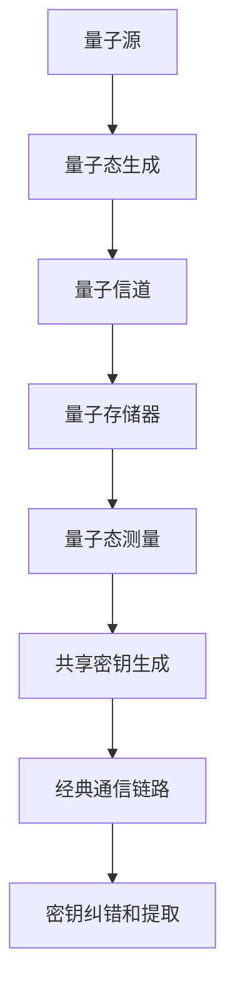

                 

关键词：量子密钥分发、量子通信、安全通信、密钥生成、量子算法

> 摘要：本文将深入探讨量子密钥分发（Quantum Key Distribution，QKD）技术，一种旨在实现未来安全通信的核心技术。通过分析量子密钥分发的工作原理、技术架构、核心算法以及数学模型，我们将揭示量子密钥分发如何在未来通信领域发挥重要作用，并探讨其面临的挑战和未来发展前景。

## 1. 背景介绍

在信息安全领域，加密通信一直是确保信息传输安全的关键手段。传统加密通信依赖于对称加密和非对称加密算法，但它们都存在安全隐患。对称加密需要通信双方共享一个密钥，而密钥的分发过程往往不安全，容易遭受中间人攻击。非对称加密则使用一对公私钥，虽然解决了密钥分发问题，但算法复杂度高，计算资源消耗大。

随着信息技术的快速发展，人们对信息安全的关注度不断提高。量子通信作为一项颠覆性技术，其独特的物理特性为安全通信提供了新的解决方案。量子密钥分发（Quantum Key Distribution，QKD）正是基于量子物理原理的一种安全通信技术，它利用量子态的不可克隆特性和量子纠缠特性，确保通信双方能够安全地生成和共享密钥。

本文旨在介绍量子密钥分发技术的核心概念、原理、算法以及数学模型，探讨其在未来通信领域的重要应用，并分析其面临的挑战和未来发展前景。通过本文的介绍，读者可以全面了解量子密钥分发技术的基本原理和应用场景，为未来通信技术的发展提供有益的参考。

## 2. 核心概念与联系

### 2.1. 量子密钥分发的定义

量子密钥分发（Quantum Key Distribution，QKD）是一种基于量子物理原理的安全通信技术。QKD 的主要目标是实现通信双方能够安全地生成和共享密钥，从而确保通信信息的安全性。与传统加密通信技术不同，QKD 利用量子态的不可克隆特性和量子纠缠特性，确保密钥生成和分发过程的安全性。

### 2.2. 量子密钥分发的工作原理

量子密钥分发的工作原理主要基于量子态的不可克隆特性和量子纠缠特性。在 QKD 过程中，发送方（Alice）生成一个随机的量子态，并将其发送给接收方（Bob）。接收方对收到的量子态进行测量，并根据测量结果生成一个共享密钥。由于量子态的不可克隆特性，任何对量子态的干扰都会导致测量结果的改变，从而确保密钥生成和分发过程的安全性。

具体来说，QKD 过程可以分为以下几个步骤：

1. **量子态生成**：发送方（Alice）使用一个量子源生成随机量子态，并将其发送给接收方（Bob）。

2. **量子态传输**：接收方（Bob）接收到发送方（Alice）发送的量子态，并将其存储在一个量子存储器中。

3. **量子态测量**：接收方（Bob）对存储的量子态进行测量，并根据测量结果生成一个共享密钥。

4. **密钥纠错和提取**：发送方（Alice）和接收方（Bob）使用经典通信协议对生成的共享密钥进行纠错和提取，以确保密钥的正确性。

### 2.3. 量子密钥分发的技术架构

量子密钥分发技术架构主要包括以下几个关键部分：

1. **量子源**：量子源是生成随机量子态的核心设备，用于生成发送给接收方的量子态。

2. **量子信道**：量子信道是用于传输量子态的物理通道，可以是光纤、自由空间或其他传输介质。

3. **量子存储器**：量子存储器用于存储接收方（Bob）接收到的量子态，以便进行测量。

4. **测量设备**：测量设备用于对量子态进行测量，并根据测量结果生成共享密钥。

5. **经典通信链路**：经典通信链路用于发送方（Alice）和接收方（Bob）之间的信息交换，包括密钥纠错和提取过程。

### 2.4. 核心概念原理和架构的 Mermaid 流程图

下面是量子密钥分发核心概念原理和架构的 Mermaid 流程图：

### 2.5. 量子密钥分发的核心算法原理

量子密钥分发的核心算法原理主要包括量子态生成、量子态传输、量子态测量和经典通信链路四个关键步骤。

#### 2.5.1. 量子态生成

量子态生成是量子密钥分发的基础步骤。发送方（Alice）使用一个量子源生成随机量子态，并将其发送给接收方（Bob）。量子态生成过程可以通过以下步骤实现：

1. **量子态初始化**：使用一个量子比特（qubit）作为量子态的载体，对其进行初始化操作，生成一个随机的量子态。
2. **量子态编码**：将生成的随机量子态编码到一个量子比特序列中，以便进行量子态传输。

#### 2.5.2. 量子态传输

量子态传输是量子密钥分发中的关键步骤，用于将发送方（Alice）生成的量子态传输到接收方（Bob）。量子态传输可以通过以下步骤实现：

1. **量子态传输**：通过量子信道将发送方（Alice）生成的量子态传输到接收方（Bob）。
2. **量子态存储**：接收方（Bob）将接收到的量子态存储在一个量子存储器中，以便进行后续测量。

#### 2.5.3. 量子态测量

量子态测量是量子密钥分发中的核心步骤，用于根据量子态的测量结果生成共享密钥。量子态测量可以通过以下步骤实现：

1. **量子态选择**：发送方（Alice）和接收方（Bob）通过经典通信链路协商一个量子态选择方案，以确保测量结果的一致性。
2. **量子态测量**：接收方（Bob）对存储的量子态进行测量，并根据测量结果生成一个共享密钥。

#### 2.5.4. 经典通信链路

经典通信链路用于发送方（Alice）和接收方（Bob）之间的信息交换，包括密钥纠错和提取过程。经典通信链路可以通过以下步骤实现：

1. **密钥纠错**：发送方（Alice）和接收方（Bob）通过经典通信链路交换纠错信息，以纠正测量结果中的错误。
2. **密钥提取**：发送方（Alice）和接收方（Bob）通过经典通信链路提取最终的共享密钥。

### 2.6. 量子密钥分发的具体操作步骤

量子密钥分发的具体操作步骤可以分为以下几个阶段：

#### 2.6.1. 预处理阶段

1. **量子源初始化**：发送方（Alice）使用一个量子源初始化量子比特，生成随机量子态。
2. **量子态编码**：发送方（Alice）将生成的随机量子态编码到一个量子比特序列中，以便进行量子态传输。

#### 2.6.2. 量子态传输阶段

1. **量子态传输**：发送方（Alice）通过量子信道将量子态传输到接收方（Bob）。
2. **量子态存储**：接收方（Bob）将接收到的量子态存储在一个量子存储器中，以便进行后续测量。

#### 2.6.3. 测量阶段

1. **量子态选择**：发送方（Alice）和接收方（Bob）通过经典通信链路协商一个量子态选择方案，以确保测量结果的一致性。
2. **量子态测量**：接收方（Bob）对存储的量子态进行测量，并根据测量结果生成一个共享密钥。

#### 2.6.4. 密钥纠错和提取阶段

1. **密钥纠错**：发送方（Alice）和接收方（Bob）通过经典通信链路交换纠错信息，以纠正测量结果中的错误。
2. **密钥提取**：发送方（Alice）和接收方（Bob）通过经典通信链路提取最终的共享密钥。

### 2.7. 量子密钥分发的优缺点

#### 2.7.1. 优点

1. **安全性高**：量子密钥分发利用量子态的不可克隆特性和量子纠缠特性，确保密钥生成和分发过程的安全性。
2. **抗干扰性强**：量子密钥分发对通信过程中的干扰和窃听具有极强的抗干扰能力，确保通信信息的安全。
3. **高效性**：量子密钥分发在生成和分发密钥过程中具有高效性，可以实现大规模、高速的密钥分发。

#### 2.7.2. 缺点

1. **技术成熟度不高**：量子密钥分发技术仍处于研究阶段，技术成熟度相对较低，存在一定的技术难题。
2. **成本高**：量子密钥分发设备成本较高，限制了其大规模应用。
3. **传输距离有限**：量子密钥分发在传输过程中存在传输距离限制，目前尚未实现远距离传输。

### 2.8. 量子密钥分发应用领域

量子密钥分发技术具有广泛的应用领域，主要包括以下几个方面：

1. **政府通信**：量子密钥分发技术可以用于政府保密通信，确保政府信息的安全传输。
2. **金融通信**：量子密钥分发技术可以用于金融通信领域，确保金融信息的安全传输。
3. **国防通信**：量子密钥分发技术可以用于国防通信，确保军事信息的安全传输。
4. **电子商务**：量子密钥分发技术可以用于电子商务交易，确保交易信息的安全。
5. **物联网**：量子密钥分发技术可以用于物联网通信，确保物联网设备之间的安全通信。

### 2.9. 量子密钥分发与其他安全通信技术的比较

#### 2.9.1. 与对称加密的比较

对称加密和非对称加密是传统加密通信技术的两种主要方式。与对称加密相比，量子密钥分发具有以下优势：

1. **安全性更高**：量子密钥分发利用量子态的不可克隆特性和量子纠缠特性，确保密钥生成和分发过程的安全性。
2. **抗干扰性强**：量子密钥分发对通信过程中的干扰和窃听具有极强的抗干扰能力。
3. **高效性**：量子密钥分发在生成和分发密钥过程中具有高效性，可以实现大规模、高速的密钥分发。

#### 2.9.2. 与非对称加密的比较

与 **非对称加密** 相比，量子密钥分发具有以下优势：

1. **安全性更高**：量子密钥分发利用量子态的不可克隆特性和量子纠缠特性，确保密钥生成和分发过程的安全性。
2. **抗干扰性强**：量子密钥分发对通信过程中的干扰和窃听具有极强的抗干扰能力。
3. **高效性**：量子密钥分发在生成和分发密钥过程中具有高效性，可以实现大规模、高速的密钥分发。

### 2.10. 量子密钥分发技术的未来发展趋势

随着量子通信技术的发展，量子密钥分发技术在未来具有广阔的应用前景。未来发展趋势主要包括以下几个方面：

1. **技术成熟度提升**：随着研究的深入和技术的不断创新，量子密钥分发技术将在未来得到更高的技术成熟度。
2. **成本降低**：随着生产规模的扩大和技术进步，量子密钥分发设备的成本将逐步降低，促进其在各个领域的应用。
3. **传输距离扩展**：未来量子密钥分发技术将在传输距离方面取得突破，实现远距离、高速的量子密钥分发。
4. **与其他技术的融合**：量子密钥分发技术将与其他先进技术如量子计算、量子传感器等相结合，推动未来通信技术的发展。

### 2.11. 量子密钥分发技术面临的挑战

尽管量子密钥分发技术具有巨大的应用前景，但在实际应用中仍面临一系列挑战：

1. **技术难题**：量子密钥分发技术涉及多个学科领域，如量子物理、信息科学等，技术难题较多，需要进一步研究和突破。
2. **成本问题**：量子密钥分发设备成本较高，限制了其大规模应用。未来需要降低设备成本，提高市场竞争力。
3. **应用场景限制**：量子密钥分发技术在实际应用中受到传输距离和通信环境的限制，未来需要解决这些问题，拓展其应用范围。
4. **安全威胁**：随着量子计算机的发展，量子密钥分发技术面临潜在的安全威胁。未来需要加强对量子密钥分发技术的安全性研究，提高其抗攻击能力。

### 2.12. 总结与展望

量子密钥分发技术作为一种具有革命性的安全通信技术，在未来通信领域具有重要应用价值。通过本文的介绍，我们了解了量子密钥分发技术的核心概念、原理、算法以及数学模型，探讨了其在未来通信领域的重要应用和面临的挑战。未来，随着量子通信技术的发展和成熟，量子密钥分发技术将在政府通信、金融通信、国防通信、电子商务和物联网等领域发挥重要作用，推动未来通信技术的创新发展。

### 附录：常见问题与解答

1. **什么是量子密钥分发？**

量子密钥分发（Quantum Key Distribution，QKD）是一种基于量子物理原理的安全通信技术，它利用量子态的不可克隆特性和量子纠缠特性，实现通信双方安全地生成和共享密钥。

2. **量子密钥分发有哪些优点？**

量子密钥分发具有以下优点：

- 安全性高：利用量子态的不可克隆特性和量子纠缠特性，确保密钥生成和分发过程的安全性。
- 抗干扰性强：对通信过程中的干扰和窃听具有极强的抗干扰能力。
- 高效性：在生成和分发密钥过程中具有高效性，可以实现大规模、高速的密钥分发。

3. **量子密钥分发有哪些应用领域？**

量子密钥分发技术具有广泛的应用领域，主要包括政府通信、金融通信、国防通信、电子商务和物联网等领域。

4. **量子密钥分发技术有哪些挑战？**

量子密钥分发技术面临的挑战主要包括：

- 技术难题：涉及多个学科领域，技术难题较多，需要进一步研究和突破。
- 成本问题：设备成本较高，限制了其大规模应用。
- 应用场景限制：受到传输距离和通信环境的限制，未来需要解决这些问题，拓展其应用范围。
- 安全威胁：随着量子计算机的发展，量子密钥分发技术面临潜在的安全威胁。

5. **量子密钥分发技术的未来发展趋势如何？**

未来，随着量子通信技术的发展和成熟，量子密钥分发技术将在政府通信、金融通信、国防通信、电子商务和物联网等领域发挥重要作用，推动未来通信技术的创新发展。同时，技术成熟度提升、成本降低、传输距离扩展以及与其他技术的融合将是量子密钥分发技术未来发展的主要趋势。

