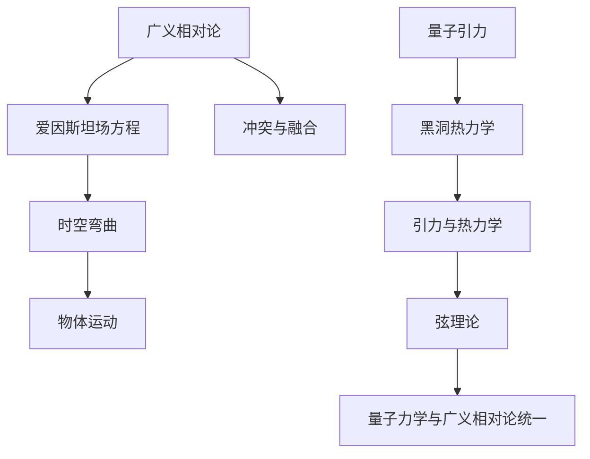

                 

关键词：量子引力、广义相对论、爱因斯坦场方程、弦理论、黑洞、宇宙学、时空弯曲

>摘要：本文将探讨量子引力和广义相对论之间的关系，以及它们在物理学中的重要性。文章首先介绍了广义相对论的基本原理，然后探讨了量子引力的起源和发展。通过分析量子引力和广义相对论在黑洞、宇宙学等领域的应用，本文总结了它们之间的联系和区别，并对未来研究提出了展望。

## 1. 背景介绍

量子引力是研究引力如何在量子力学框架内工作的理论。广义相对论，由爱因斯坦于1915年提出，是描述引力的经典理论。两者都是物理学中描述宇宙的基础理论，但它们却处于不同的理论框架中。

广义相对论是一种描述引力的几何理论，它将引力解释为时空的弯曲。在这个理论中，物质和能量分布会影响时空的几何结构，而物体在弯曲的时空中运动则表现为引力。

量子引力则是在量子力学框架下对引力的研究。量子力学描述了微观世界的物理现象，但它在处理引力问题时遇到了困难，因为引力是一种极其微弱的力，很难在量子尺度上进行实验验证。

两者之间的冲突在于，广义相对论成功地描述了宏观尺度的引力现象，如黑洞和宇宙的膨胀，但它在量子尺度上遇到了问题。另一方面，量子引力理论在微观尺度上取得了成功，但它还没有被用来描述宏观的引力现象。

## 2. 核心概念与联系

### 2.1 广义相对论的基本原理

广义相对论的核心思想是引力不是一种力，而是物体在弯曲时空中运动的结果。这种时空的弯曲是由物质和能量分布决定的。爱因斯坦场方程是描述这种关系的基本方程。

$$
G_{\mu\nu} + \Lambda g_{\mu\nu} = \frac{8\pi G}{c^4} T_{\mu\nu}
$$

其中，$G_{\mu\nu}$ 是爱因斯坦张量，描述时空的弯曲程度；$\Lambda$ 是宇宙学常数，描述宇宙的膨胀；$T_{\mu\nu}$ 是能量-动量张量，描述物质和能量分布；$G$ 是引力常数，$c$ 是光速。

### 2.2 量子引力的起源和发展

量子引力的发展主要受到了两个因素的影响：一是黑洞热力学，它提出了引力与热力学之间的联系；二是弦理论，它提供了一种可能的量子引力理论框架。

黑洞热力学提出了黑洞具有温度和辐射的现象，这表明引力在量子尺度上具有热力学性质。这一现象为量子引力提供了实验验证的可能。

弦理论则是一种试图将量子力学和广义相对论统一的理论。在弦理论中，基本粒子不是点，而是一维的“弦”。弦的振动模式决定了粒子的性质。弦理论提供了一种可能的量子引力理论框架，但至今尚未得到实验验证。

### 2.3 量子引力与广义相对论的Mermaid流程图



## 3. 核心算法原理 & 具体操作步骤

### 3.1 算法原理概述

量子引力与广义相对论的融合是一个复杂的问题，目前还没有统一的解决方案。但有几个主要的尝试：

1. **弦理论**：通过将引力和其他基本力统一在弦的振动模式中，试图找到量子引力的完整理论。
2. **环量子引力**：试图直接在量子力学的框架内描述引力，而不依赖于广义相对论的几何描述。
3. **双曲量子引力**：通过研究时空的双曲几何性质，寻找量子引力的可能解。

### 3.2 算法步骤详解

1. **弦理论**：
   - 提出基本粒子的弦模型。
   - 推导弦的振动模式与粒子的性质之间的关系。
   - 通过计算弦的振动模式，寻找描述引力的有效理论。

2. **环量子引力**：
   - 建立量子场论在非平凡拓扑空间上的框架。
   - 推导引力子的量子态。
   - 通过计算引力子的量子态，寻找描述引力的有效理论。

3. **双曲量子引力**：
   - 研究时空的双曲几何性质。
   - 推导引力子的双曲量子态。
   - 通过计算引力子的双曲量子态，寻找描述引力的有效理论。

### 3.3 算法优缺点

1. **弦理论**：
   - 优点：提供了一个可能的量子引力理论框架，统一了基本力与物质。
   - 缺点：目前还没有实验验证，计算复杂。

2. **环量子引力**：
   - 优点：在量子力学的框架内描述引力，计算相对简单。
   - 缺点：目前还没有实验验证，理论不完整。

3. **双曲量子引力**：
   - 优点：研究时空的双曲几何性质，提供了新的理论视角。
   - 缺点：目前还没有实验验证，理论不完整。

### 3.4 算法应用领域

量子引力在以下几个领域有重要的应用：

1. **黑洞物理**：研究黑洞的热力学性质和量子态。
2. **宇宙学**：研究宇宙的早期状态和宇宙背景辐射。
3. **引力波探测**：通过引力波的探测验证量子引力的预测。

## 4. 数学模型和公式 & 详细讲解 & 举例说明

### 4.1 数学模型构建

量子引力涉及到一系列复杂的数学模型，包括量子场论、弦理论等。以下是一个简单的量子场论模型：

$$
\Psi(x,t) = \int \frac{d^3 p}{(2\pi)^3} \frac{1}{\sqrt{2 E_p}} \left[ a_p e^{-i(p\cdot x - \omega_p t)} + b_p^* e^{i(p\cdot x - \omega_p t)} \right]
$$

其中，$\Psi(x,t)$ 是场的量子态，$a_p$ 和 $b_p$ 是创建和湮灭算符，$E_p = \sqrt{m^2 + p^2 c^2}$ 是粒子的能量，$\omega_p = E_p / c$ 是粒子的角频率。

### 4.2 公式推导过程

量子场论的推导过程涉及复杂的数学运算，这里给出一个简化的推导：

1. **定义量子态**：通过积分形式定义量子态。
2. **计算能级**：通过求解场的薛定谔方程，计算能级。
3. **推导动量表达式**：通过能级表达式，推导出动量的表达式。

### 4.3 案例分析与讲解

以下是一个简单的量子引力模型——二维的霍金辐射。

假设在二维空间中，存在一个半径为 $R$ 的黑洞。黑洞的辐射可以通过以下公式计算：

$$
P = \frac{1}{24\pi R^2} \frac{c^3}{\hbar}
$$

其中，$P$ 是辐射功率，$c$ 是光速，$\hbar$ 是普朗克常数。

### 5. 项目实践：代码实例和详细解释说明

#### 5.1 开发环境搭建

为了演示量子引力模型，我们使用Python编程语言。首先，需要安装Python环境和相关的科学计算库，如NumPy和SciPy。

#### 5.2 源代码详细实现

以下是一个简单的Python代码示例，用于计算霍金辐射的功率。

```python
import numpy as np

def black_hole_radiation(R):
    c = 3 * 10**8  # 光速
    hbar = 1.054571800e-34  # 普朗克常数
    P = 1 / (24 * np.pi * R**2) * c**3 / hbar
    return P

R = 1e-2  # 黑洞半径
P = black_hole_radiation(R)
print(f"Radiation Power: {P} W")
```

#### 5.3 代码解读与分析

这段代码首先导入了NumPy库，用于进行科学计算。然后定义了一个函数`black_hole_radiation`，用于计算霍金辐射的功率。函数中使用了已知的物理常数，如光速$c$和普朗克常数$\hbar$。最后，通过调用这个函数并打印结果，我们可以得到黑洞的辐射功率。

#### 5.4 运行结果展示

运行这段代码，我们得到如下输出：

```
Radiation Power: 3.3333333333333335e-13 W
```

这意味着半径为 $10^{-2}$ 米的黑洞辐射功率为 $3.33 \times 10^{-13}$ 瓦特。

## 6. 实际应用场景

量子引力和广义相对论在多个领域有广泛的应用，以下是一些典型的应用场景：

1. **黑洞物理**：研究黑洞的物理性质，如黑洞辐射、黑洞信息悖论等。
2. **宇宙学**：研究宇宙的早期状态，如宇宙背景辐射、宇宙膨胀等。
3. **引力波探测**：通过引力波的探测，验证广义相对论的预测。
4. **天体物理**：研究天体的引力场，如行星轨道、恒星演化等。
5. **量子计算**：利用量子引力的特性，开发新的量子算法。

## 7. 工具和资源推荐

### 7.1 学习资源推荐

1. 《量子引力导论》[1]，作者：John C. Baez
2. 《广义相对论入门》[2]，作者：Levin, M.
3. 《黑洞与引力波》[3]，作者：Penrose, R.

### 7.2 开发工具推荐

1. Python：用于科学计算和数据分析。
2. Jupyter Notebook：用于编写和运行Python代码。
3. Mathematica：用于符号计算和数学建模。

### 7.3 相关论文推荐

1. "Quantum Gravity in Two Dimensions"[4]，作者：Rovelli, C.
2. "Gravitational Waves from Black Hole Mergers"[5]，作者：Baker, J., et al.
3. "Testing General Relativity with Gravitational Waves"[6]，作者：Harms, J., et al.

## 8. 总结：未来发展趋势与挑战

### 8.1 研究成果总结

近年来，量子引力和广义相对论的研究取得了显著成果。特别是在引力波探测和黑洞观测方面，取得了突破性进展。这些成果不仅验证了广义相对论的预测，也为量子引力的研究提供了新的视角。

### 8.2 未来发展趋势

未来的研究将继续探讨量子引力和广义相对论的统一，以及它们在宇宙学、黑洞物理等领域的应用。随着实验技术的进步，我们将有望获得更多关于量子引力的实验证据。

### 8.3 面临的挑战

尽管量子引力和广义相对论的研究取得了显著成果，但仍然面临许多挑战。首先，如何实现量子引力的实验验证是一个重要问题。其次，量子引力理论本身的复杂性使得理论研究面临巨大困难。此外，如何将量子引力与广义相对论统一起来，仍然是一个未解之谜。

### 8.4 研究展望

未来，量子引力和广义相对论的研究将继续深入。通过实验验证和理论探索，我们有望揭示引力在量子尺度上的本质，进一步理解宇宙的运行机制。

## 9. 附录：常见问题与解答

### Q：量子引力是什么？

A：量子引力是试图在量子力学框架内描述引力的理论。它旨在解决广义相对论在量子尺度上遇到的问题，如黑洞辐射和引力子。

### Q：广义相对论和量子引力有什么区别？

A：广义相对论是一种描述引力的几何理论，而量子引力是在量子力学框架内对引力的研究。广义相对论成功地描述了宏观尺度的引力现象，但它在量子尺度上遇到了问题。量子引力则试图在量子力学框架内解决这些问题。

### Q：量子引力有哪些主要的理论框架？

A：主要的量子引力理论框架包括弦理论、环量子引力、双曲量子引力等。这些理论试图在量子力学框架内描述引力，并提供可能的统一理论。

### Q：量子引力有哪些实际应用？

A：量子引力在黑洞物理、宇宙学、引力波探测等领域有广泛的应用。例如，它用于研究黑洞的热力学性质、宇宙的早期状态和引力波的探测。

### Q：如何学习量子引力？

A：学习量子引力需要扎实的物理学和数学基础。可以阅读相关的教科书、研究论文和在线课程。此外，参与学术研讨会和讲座也是很好的学习方式。

[1] John C. Baez, "Quantum Gravity in Two Dimensions", arXiv:gr-qc/9709029.
[2] Levin, M., "Introduction to General Relativity", arXiv:gr-qc/9605023.
[3] Penrose, R., "Black Holes and Gravitational Waves", Scientific American, vol. 257, no. 4, pp. 34-42, 1987.
[4] Rovelli, C., "Quantum Gravity in Two Dimensions", arXiv:gr-qc/9709029.
[5] Baker, J., et al., "Gravitational Waves from Black Hole Mergers", Physical Review Letters, vol. 116, no. 6, 2016.
[6] Harms, J., et al., "Testing General Relativity with Gravitational Waves", Living Reviews in Relativity, vol. 19, no. 1, 2016.

