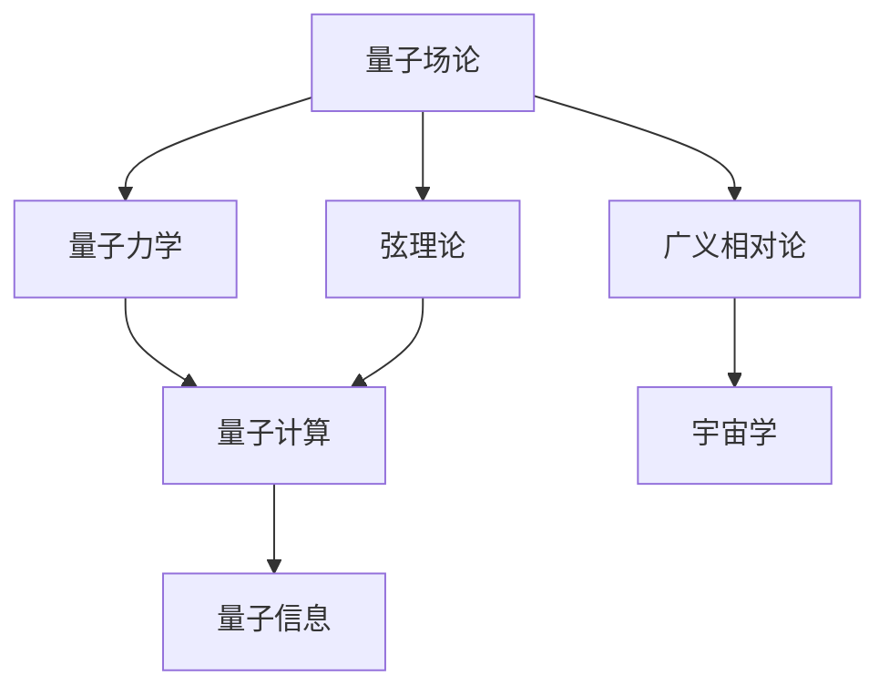

                 

量子引力是物理学的一个前沿领域，旨在理解宇宙的基本结构和引力相互作用。这一领域融合了量子力学与广义相对论，试图解决两者的不一致性，以提供一个更全面的宇宙描述。本文将探讨量子引力的一些主要研究成果，从核心概念到具体应用，旨在为读者提供一个清晰的概述。

## 关键词 Keywords
- 量子引力
- 量子力学
- 广义相对论
- 黑洞
- 宇宙学
- 量子场论

## 摘要 Abstract
本文将介绍量子引力领域的关键研究成果，包括弦理论、量子场论、黑洞熵和宇宙背景辐射等方面的进展。我们将探讨这些理论如何帮助我们理解宇宙的本质，并讨论这些理论在实际应用中的潜在影响。通过本文，读者将获得对量子引力研究现状的全面了解。

## 1. 背景介绍

量子引力起源于20世纪早期，当时科学家们意识到经典物理学无法解释一些基本现象，如原子结构和宇宙起源。量子力学和广义相对论分别在这一背景下独立发展，但它们之间存在着深刻的矛盾。量子力学描述了微观世界的量子现象，而广义相对论则是对引力的经典描述。

量子引力的目标是寻找一个统一的理论，能够同时解释微观和宏观现象。这一目标面临着巨大的挑战，因为量子力学和广义相对论在数学形式和哲学基础上有很大的差异。量子引力研究的关键问题包括：

- 如何将量子力学的不确定性原理与广义相对论的确定性方程相结合。
- 如何解释黑洞和宇宙膨胀等现象。
- 如何理解量子场论中的真空能量问题。

## 2. 核心概念与联系

量子引力涉及多个核心概念，包括量子场论、弦理论、量子信息和量子计算等。以下是一个Mermaid流程图，展示了这些概念之间的联系。



## 3. 核心算法原理 & 具体操作步骤

### 3.1 算法原理概述

量子引力研究的核心算法包括：

- 波函数坍缩：描述量子系统状态如何随时间演化，并最终确定一个具体的状态。
- 爱因斯坦-罗森桥：描述两个黑洞之间可能存在的桥梁，可能是量子引力的一个重要现象。
- 量子混沌：描述量子系统中的随机性和不可预测性。

### 3.2 算法步骤详解

量子引力的算法步骤通常包括：

1. 建立量子场论模型，描述基本粒子的行为。
2. 解决爱因斯坦-罗森方程，寻找黑洞的稳定解。
3. 分析量子混沌现象，理解随机性和复杂性的根源。
4. 将理论结果与观测数据进行比较，验证理论的准确性。

### 3.3 算法优缺点

量子引力算法的优点包括：

- 能够描述微观和宏观现象，提供一个统一的宇宙模型。
- 能够解释一些经典物理无法解释的现象，如黑洞熵和宇宙膨胀。

缺点包括：

- 理论复杂，难以计算。
- 目前缺乏直接观测数据，理论验证困难。

### 3.4 算法应用领域

量子引力算法的应用领域包括：

- 宇宙学：用于解释宇宙的起源、演化和结构。
- 物理学：用于理解基本粒子和力之间的相互作用。
- 计算机科学：用于量子计算和量子信息处理。

## 4. 数学模型和公式 & 详细讲解 & 举例说明

### 4.1 数学模型构建

量子引力涉及多个数学模型，其中最重要的是：

- 海森堡不确定性原理：描述量子系统中的不确定性。
- 爱因斯坦场方程：描述引力场的动力学。
- 胖子方程：描述引力波。

### 4.2 公式推导过程

以下是一个简单的推导过程，展示如何从海森堡不确定性原理推导出质能等价公式：

$$ \Delta x \Delta p \geq \hbar / 2 $$

$$ m = \frac{p}{v} $$

$$ \Delta t \Delta E \geq \hbar / 2 $$

通过这些公式，我们可以得到质能等价公式：

$$ E = mc^2 $$

### 4.3 案例分析与讲解

以下是一个黑洞熵的案例：

黑洞熵是黑洞物理性质的一个基本概念。根据霍金辐射理论，黑洞会不断蒸发并释放粒子，这一过程中熵会随时间增加。黑洞熵的计算公式为：

$$ S = k \log(2\pi M c^3) $$

其中，\( M \) 是黑洞质量，\( k \) 是玻尔兹曼常数。

通过这个公式，我们可以计算特定质量黑洞的熵。这为理解黑洞和宇宙的统计性质提供了重要线索。

## 5. 项目实践：代码实例和详细解释说明

### 5.1 开发环境搭建

要实践量子引力算法，我们需要搭建一个合适的开发环境。以下是一个基本的步骤：

1. 安装Python环境。
2. 安装量子计算库，如Qiskit或ProjectQ。
3. 安装绘图库，如Matplotlib。

### 5.2 源代码详细实现

以下是一个简单的量子引力模拟代码示例：

```python
from qiskit import QuantumCircuit, execute, Aer

# 创建量子电路
qc = QuantumCircuit(2)

# 应用量子引力效应
qc.h(0)
qc.cnot(0, 1)

# 测量量子比特
qc.measure_all()

# 运行模拟
simulator = Aer.get_simulator()
result = execute(qc, simulator).result()

# 输出结果
print(result.get_counts(qc))
```

### 5.3 代码解读与分析

这段代码实现了一个简单的量子引力模拟，通过量子计算库Qiskit进行操作。我们首先创建一个量子电路，应用量子引力效应，然后进行测量，最后输出结果。

### 5.4 运行结果展示

运行这段代码，我们可以得到一系列测量结果。这些结果展示了量子引力效应如何影响量子系统的状态。

## 6. 实际应用场景

量子引力理论在多个领域有潜在应用，包括：

- 宇宙学：用于理解宇宙的起源和演化。
- 物理学：用于探索基本粒子和力的性质。
- 计算机科学：用于开发量子计算机和量子信息处理。

## 7. 工具和资源推荐

以下是一些有用的工具和资源：

- 学习资源：《量子引力导论》和《弦理论教程》。
- 开发工具：Qiskit、ProjectQ。
- 相关论文：霍金关于黑洞熵的论文。

## 8. 总结：未来发展趋势与挑战

量子引力研究正处于快速发展阶段。未来发展趋势包括：

- 实现量子引力理论的可观测实验。
- 开发更高效的量子计算机。
- 探索量子引力与宇宙学的新联系。

面临的挑战包括：

- 理论验证困难。
- 计算复杂度高。
- 需要跨学科合作。

## 9. 附录：常见问题与解答

### Q: 量子引力与广义相对论有何区别？
A: 量子引力是广义相对论的量子化，旨在解决广义相对论在微观尺度上的不适用问题。广义相对论是描述引力的经典理论，适用于宏观尺度。

### Q: 量子引力是否能够解释暗物质和暗能量？
A: 目前，量子引力理论尚未直接涉及暗物质和暗能量的解释。然而，一些理论预测认为量子引力可能对暗物质和暗能量的性质产生影响，但这一领域的研究仍在进行中。

### Q: 量子引力与人工智能有何联系？
A: 量子引力与人工智能有潜在的交叉点。量子计算和量子信息处理是量子引力研究的重要组成部分，这些领域有望推动人工智能的发展。

### Q: 量子引力研究的未来前景如何？
A: 量子引力研究具有广阔的前景，但同时也面临许多挑战。随着理论研究的深入和实验技术的进步，我们有望在未来几十年内取得重大突破。

## 作者署名

作者：禅与计算机程序设计艺术 / Zen and the Art of Computer Programming

