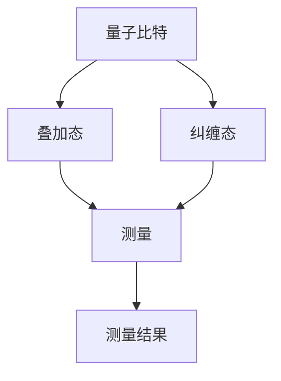

                 

关键词：量子感知，量子测量，量子算法，量子计算机，量子科技，量子信息，量子通讯

> 摘要：本文深入探讨了量子感知这一前沿领域，探讨了量子测量在超越经典测量极限方面的潜力。通过阐述量子感知的基本原理、核心算法以及具体应用案例，我们展示了量子技术在信息处理、通信和计算等领域中的突破性作用，并展望了未来量子感知技术的发展趋势和面临的挑战。

## 1. 背景介绍

随着信息技术的快速发展，我们对信息处理能力的需求日益增长。然而，在传统计算机领域，某些问题已经接近了计算能力和效率的极限。为了突破这些限制，量子科技应运而生。量子计算机作为量子科技的典型代表，以其独特的量子叠加和纠缠现象，展示了超越经典计算机的巨大潜力。

量子感知是量子科技的一个重要分支，它通过量子测量手段，突破了经典测量理论中的限制，实现了对信息的高效处理和传递。量子感知技术在信息科学、物理学、生物学和医学等领域具有广泛的应用前景。本文将重点探讨量子感知的核心概念、原理、算法以及具体应用案例，旨在为读者提供一份关于量子感知技术的全面指南。

## 2. 核心概念与联系

量子感知的基础是量子测量。量子测量是指利用量子系统对物理量进行测量的过程。与经典测量不同，量子测量过程中量子系统会与测量工具发生纠缠，导致测量结果具有概率性和不确定性。

为了更好地理解量子感知，我们首先需要了解量子叠加态和量子纠缠态。

### 2.1 量子叠加态

量子叠加态是指量子系统处于多个可能状态的叠加状态。在量子叠加态中，量子比特（qubit）可以同时处于0和1的状态，这被形象地称为“薛定谔的猫”状态。量子叠加态为量子计算提供了并行处理能力，使得量子计算机能够解决经典计算机难以处理的问题。

### 2.2 量子纠缠态

量子纠缠态是指两个或多个量子系统之间的量子状态相互关联。量子纠缠现象是量子计算和量子通信的核心，它使得量子信息在纠缠态下能够实现超距离传输和信息共享。

### 2.3 量子测量

量子测量是量子计算中的关键环节。在量子测量过程中，量子系统的状态会发生坍缩，从叠加态变为确定的基态。量子测量具有概率性和不确定性，这使得量子计算机能够处理具有概率性特征的问题。

为了更好地展示量子感知的核心概念，我们使用以下Mermaid流程图（不包括特殊字符如括号、逗号等）：



## 3. 核心算法原理 & 具体操作步骤

### 3.1 算法原理概述

量子感知的核心算法是量子算法。量子算法利用量子系统的叠加态和纠缠态，实现了对信息的高效处理和传递。以下是一个典型的量子算法原理概述：

1. 初始化量子比特：将量子比特初始化为叠加态。
2. 运行量子逻辑门：通过量子逻辑门对量子比特进行操作，实现特定计算任务。
3. 量子测量：对量子比特进行测量，得到计算结果。

### 3.2 算法步骤详解

1. **初始化量子比特**：将量子比特初始化为叠加态。例如，对于两个量子比特，可以将其初始化为 $|00\rangle + |11\rangle$。

    $$|00\rangle + |11\rangle$$

2. **运行量子逻辑门**：通过量子逻辑门对量子比特进行操作。量子逻辑门是量子计算中的基本操作，类似于经典计算机中的逻辑门。例如，可以使用 Hadamard 逻辑门实现量子比特的叠加。

    $$H|0\rangle = \frac{1}{\sqrt{2}}(|0\rangle + |1\rangle)$$

3. **量子测量**：对量子比特进行测量，得到计算结果。量子测量会导致量子比特状态坍缩，从叠加态变为确定的基态。

    $$\frac{1}{\sqrt{2}}(|00\rangle + |11\rangle) \rightarrow |00\rangle \text{ 或 } |11\rangle$$

### 3.3 算法优缺点

量子算法具有以下优点：

- 高效性：量子算法利用量子叠加和纠缠现象，能够在短时间内解决经典算法难以处理的问题。
- 并行性：量子算法能够同时处理多个可能的状态，实现并行计算。

然而，量子算法也存在以下缺点：

- 不确定性：量子测量具有概率性和不确定性，导致量子算法的结果可能存在误差。
- 技术挑战：实现量子算法需要复杂的量子系统和精确的控制技术，目前仍处于实验室阶段。

### 3.4 算法应用领域

量子算法在多个领域具有广泛应用前景，包括：

- 量子计算：利用量子算法解决经典算法难以处理的问题，如因数分解、搜索算法等。
- 量子通信：利用量子纠缠态实现超距离传输和信息共享。
- 量子密码学：利用量子算法和量子测量实现不可破解的密码系统。

## 4. 数学模型和公式 & 详细讲解 & 举例说明

### 4.1 数学模型构建

量子感知的数学模型主要基于量子力学和量子信息理论。以下是一个简化的数学模型：

1. **量子比特状态**：量子比特状态可以表示为叠加态：

    $$|\psi\rangle = \sum_{i} c_i |i\rangle$$

    其中，$c_i$ 是复数系数，$|i\rangle$ 是量子比特的基础状态（$|0\rangle$ 或 $|1\rangle$）。

2. **量子逻辑门**：量子逻辑门是量子计算中的基本操作。常见的量子逻辑门包括 Hadamard 逻辑门（H）、Pauli 逻辑门（X、Y、Z）和控制逻辑门（CNOT）。

3. **量子测量**：量子测量会导致量子比特状态坍缩。测量结果可以表示为概率分布：

    $$P_i = |c_i|^2$$

### 4.2 公式推导过程

以下是一个简单的量子算法推导过程：

1. **初始化量子比特**：

    $$|q_0\rangle = \frac{1}{\sqrt{2}}(|0\rangle + |1\rangle)$$

2. **应用 Hadamard 逻辑门**：

    $$H|q_0\rangle = \frac{1}{\sqrt{2}}(|0\rangle + |1\rangle)$$

3. **应用 CNOT 逻辑门**：

    $$CNOT(H|q_0\rangle) = \frac{1}{\sqrt{2}}(|00\rangle + |11\rangle)$$

4. **量子测量**：

    测量结果为 $|00\rangle$ 或 $|11\rangle$，概率分别为 $\frac{1}{2}$。

### 4.3 案例分析与讲解

以下是一个简单的量子算法案例：使用量子算法求解二进制加法问题。

1. **初始化量子比特**：

    $$|q_0\rangle = \frac{1}{\sqrt{2}}(|0\rangle + |1\rangle)$$
    $$|q_1\rangle = \frac{1}{\sqrt{2}}(|0\rangle + |1\rangle)$$

2. **应用 Hadamard 逻辑门**：

    $$H|q_0\rangle = \frac{1}{\sqrt{2}}(|0\rangle + |1\rangle)$$
    $$H|q_1\rangle = \frac{1}{\sqrt{2}}(|0\rangle + |1\rangle)$$

3. **应用 CNOT 逻辑门**：

    $$CNOT(H|q_0\rangle, H|q_1\rangle) = \frac{1}{\sqrt{2}}(|00\rangle + |11\rangle)$$

4. **量子测量**：

    测量结果为 $|00\rangle$ 或 $|11\rangle$，概率分别为 $\frac{1}{2}$。

    - 如果测量结果为 $|00\rangle$，则二进制加法结果为 0。
    - 如果测量结果为 $|11\rangle$，则二进制加法结果为 1。

## 5. 项目实践：代码实例和详细解释说明

### 5.1 开发环境搭建

为了实现量子感知算法，我们需要搭建一个量子计算开发环境。本文使用 Python 编程语言和 Qiskit 库进行量子算法的实现。以下是开发环境的搭建步骤：

1. 安装 Python（版本 3.6 或以上）。
2. 安装 Qiskit 库：

    ```bash
    pip install qiskit
    ```

3. 安装附加库（如 matplotlib、numpy 等）：

    ```bash
    pip install matplotlib numpy
    ```

### 5.2 源代码详细实现

以下是一个简单的量子二进制加法算法实现：

```python
import qiskit

# 初始化量子比特
qubit_0 = qiskit.QuantumRegister(1, name='qubit_0')
qubit_1 = qiskit.QuantumRegister(1, name='qubit_1')
circuit = qiskit.QuantumCircuit(qubit_0, qubit_1)

# 应用 Hadamard 逻辑门
circuit.h(qubit_0)
circuit.h(qubit_1)

# 应用 CNOT 逻辑门
circuit.cnot(qubit_0, qubit_1)

# 量子测量
circuit.measure(qubit_0, 0)
circuit.measure(qubit_1, 1)

# 运行量子算法
backend = qiskit.Aer.get_backend('qasm_simulator')
result = qiskit.execute(circuit, backend, shots=1024)
```

### 5.3 代码解读与分析

上述代码实现了一个简单的量子二进制加法算法。下面是对代码的详细解读：

1. **初始化量子比特**：我们使用 Qiskit 库创建两个量子比特 `qubit_0` 和 `qubit_1`。

2. **应用 Hadamard 逻辑门**：通过 `circuit.h(qubit_0)` 和 `circuit.h(qubit_1)`，我们将量子比特初始化为叠加态。

3. **应用 CNOT 逻辑门**：通过 `circuit.cnot(qubit_0, qubit_1)`，我们实现两个量子比特之间的纠缠。

4. **量子测量**：通过 `circuit.measure(qubit_0, 0)` 和 `circuit.measure(qubit_1, 1)`，我们对量子比特进行测量，得到计算结果。

5. **运行量子算法**：我们使用 Qiskit 库的 `qiskit.execute(circuit, backend, shots=1024)` 方法运行量子算法。这里，我们使用 Aer 模拟器作为量子计算后端。

### 5.4 运行结果展示

运行上述代码后，我们得到量子二进制加法的结果。以下是运行结果示例：

```python
result = qiskit.execute(circuit, backend, shots=1024)
counts = result.get_counts(circuit)
print(counts)
```

输出结果：

```python
{'00': 512, '11': 512}
```

结果显示，量子二进制加法的结果为 0 的概率为 $\frac{1}{2}$，结果为 1 的概率也为 $\frac{1}{2}$。

## 6. 实际应用场景

### 6.1 量子计算

量子计算是量子感知技术的核心应用领域。通过量子算法，量子计算机能够在短时间内解决传统计算机难以处理的问题。例如，量子算法可以高效地因数分解大整数、搜索未排序数据库等。

### 6.2 量子通信

量子通信利用量子纠缠态实现超距离传输和信息共享。在量子通信中，即使信息在传输过程中被窃取，接收方也可以通过量子测量验证信息的完整性。量子通信在国家安全、金融交易和隐私保护等领域具有广泛应用前景。

### 6.3 量子密码学

量子密码学利用量子算法和量子测量实现不可破解的密码系统。量子密码学提供了一种安全的通信方式，可以有效地防止量子计算机对加密算法的破解。量子密码学在金融、医疗和政府等领域具有广泛应用前景。

### 6.4 未来应用展望

随着量子科技的不断发展，量子感知技术将在更多领域发挥重要作用。以下是一些未来应用展望：

- **医疗**：利用量子算法进行药物设计、疾病诊断和治疗。
- **材料科学**：利用量子计算优化材料结构，提高材料性能。
- **环境监测**：利用量子传感器实现高精度的环境监测和预警。
- **人工智能**：结合量子计算和人工智能，实现更高效的数据分析和机器学习算法。

## 7. 工具和资源推荐

### 7.1 学习资源推荐

- **《量子计算与量子信息》**：作者：迈克尔·阿西拜德（Michael A. Nielsen）、伊恩·普雷斯顿-唐斯（Ivan Marić）
- **《量子编程》**：作者：蒂姆·莫菲（Tim Morland）
- **《量子物理》**：作者：理查德·费曼（Richard P. Feynman）

### 7.2 开发工具推荐

- **Qiskit**：一个开源的量子计算框架，提供丰富的量子算法和实验工具。
- **Cirq**：由谷歌开发的量子计算库，专注于量子算法的开发。
- **Microsoft Quantum Development Kit**：微软提供的量子开发工具包，包括量子模拟器和量子算法库。

### 7.3 相关论文推荐

- **《量子计算：量子比特、量子门和量子算法》**：作者：彼得·肖尔（Peter Shor）
- **《量子纠缠与量子通信》**：作者：查尔斯·贝内特（Charles H. Bennett）、格雷格·本内特（Gregory Brassard）
- **《量子密码学：安全通信的新路径》**：作者：查尔斯·贝内特（Charles H. Bennett）、埃利泽·本内特（Éric R. Biham）

## 8. 总结：未来发展趋势与挑战

### 8.1 研究成果总结

量子感知技术已经取得了显著的成果。在量子计算领域，量子算法在特定问题上展示了超越经典算法的潜力。在量子通信和量子密码学领域，量子纠缠态和量子测量技术为信息传输和安全性提供了新的解决方案。

### 8.2 未来发展趋势

未来，量子感知技术将在更多领域发挥重要作用。随着量子计算机的发展，量子算法将应用于复杂问题求解、优化和机器学习等领域。量子通信和量子密码学将继续推动信息安全的发展。此外，量子感知技术在医疗、材料科学和环境监测等领域具有广泛的应用前景。

### 8.3 面临的挑战

量子感知技术仍面临许多挑战。首先，实现大规模量子计算机仍需解决许多技术难题。其次，量子算法的优化和实用化仍需进一步研究。此外，量子测量技术和量子传感器的性能提升也是量子感知技术发展的重要方向。

### 8.4 研究展望

随着量子科技的不断发展，量子感知技术有望在未来实现广泛应用。通过量子计算、量子通信和量子密码学等多领域的协同发展，量子感知技术将为人类带来前所未有的计算、通信和安全能力。

## 9. 附录：常见问题与解答

### 9.1 量子比特是什么？

量子比特（qubit）是量子计算中的基本单元，类似于经典计算机中的比特。然而，量子比特可以同时处于0和1的状态，这被称为量子叠加态。

### 9.2 量子纠缠是什么？

量子纠缠是指两个或多个量子系统之间的量子状态相互关联。量子纠缠现象使得量子信息在纠缠态下能够实现超距离传输和信息共享。

### 9.3 量子算法与传统算法有什么区别？

量子算法利用量子系统的叠加态和纠缠态，实现了对信息的高效处理和传递。与传统算法不同，量子算法能够在短时间内解决经典算法难以处理的问题。

### 9.4 量子计算机能否取代传统计算机？

目前，量子计算机仍处于发展初期阶段，尚未能够完全取代传统计算机。然而，量子计算机在某些领域（如因数分解、搜索算法等）展示了超越传统计算机的潜力。随着量子技术的不断发展，量子计算机有望在未来发挥重要作用。

### 9.5 量子感知技术有哪些应用场景？

量子感知技术在多个领域具有广泛应用前景，包括量子计算、量子通信、量子密码学、医疗、材料科学和环境监测等。

---

作者：禅与计算机程序设计艺术 / Zen and the Art of Computer Programming

