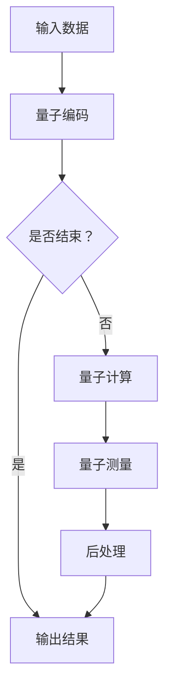
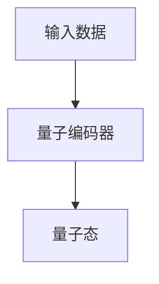
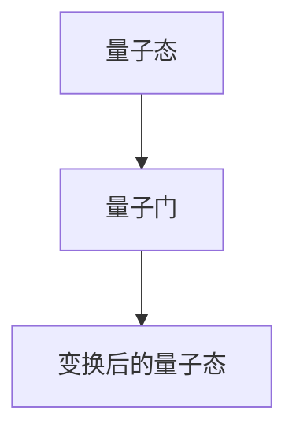
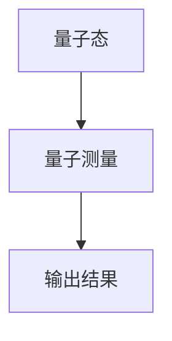
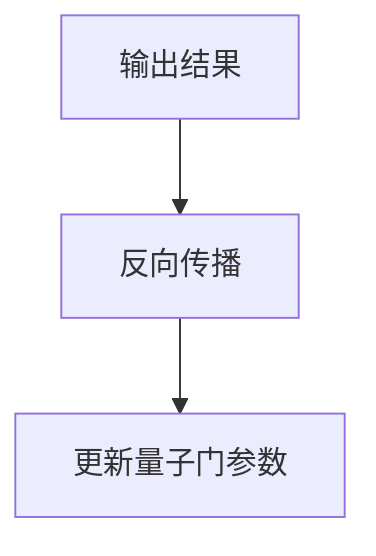
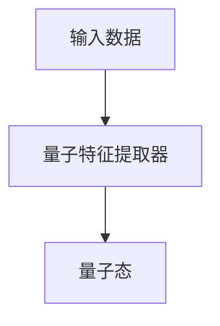
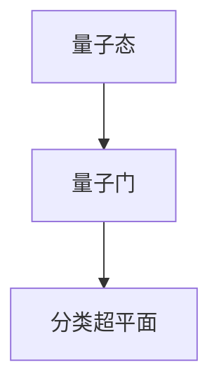
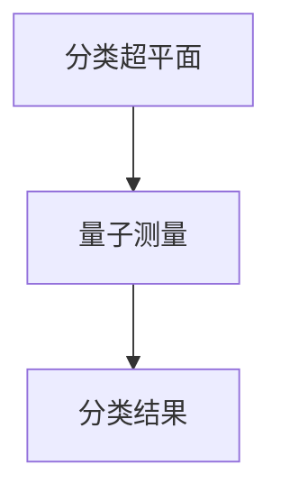
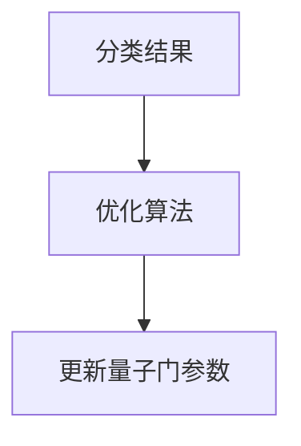

                 

在当今信息时代，机器学习（Machine Learning, ML）已经成为计算机科学和人工智能领域中的核心力量。它通过算法和统计模型从数据中自动提取知识，解决了大量复杂的问题，从推荐系统到自动驾驶，再到医疗诊断，都有着广泛应用。然而，传统的机器学习方法在某些特定问题上仍然面临性能瓶颈。此时，量子计算作为一种全新的计算范式，由于其并行性和高效性，为机器学习带来了新的可能性。

本文旨在深入探讨量子机器学习的原理，并展示一些实际的代码实战案例。通过本文，读者将了解量子机器学习的基础知识、核心算法，以及如何在实际项目中应用这些算法。我们将结合数学模型和具体代码实现，帮助读者更好地理解量子机器学习的奥秘。

## 文章关键词

量子计算、机器学习、算法优化、量子算法、代码实战、深度学习、量子神经网络

## 文章摘要

本文首先介绍了量子计算的基本概念，然后探讨了量子机器学习的核心原理和优势。接着，通过具体的算法实例，展示了量子机器学习的实现过程。最后，我们提供了一个完整的代码实战案例，详细讲解了从环境搭建到算法实现的各个环节。通过本文的学习，读者可以掌握量子机器学习的基本知识和实践技能。

-------------------------------------------------------------------

## 1. 背景介绍

量子计算作为现代物理学和计算机科学的交叉领域，自提出以来就引起了广泛关注。与传统计算不同，量子计算利用量子力学原理，通过量子位（qubits）来实现信息的存储和处理。量子位具有叠加和纠缠的特性，使得量子计算机能够在并行处理大量数据时展现出惊人的计算能力。

机器学习作为一种自动化数据分析和决策制定的方法，已经在许多领域取得了显著的成果。然而，随着数据量的增加和问题复杂性的提升，传统的机器学习方法在处理速度和准确度上逐渐遇到了瓶颈。量子计算的出现，为机器学习提供了一种全新的解决思路。

量子机器学习（Quantum Machine Learning, QML）结合了量子计算和机器学习的优势，旨在利用量子计算机来解决传统方法难以处理的问题。量子机器学习不仅能够提高算法的效率，还可以探索新的算法结构，为机器学习领域带来变革性的影响。

本文将围绕量子机器学习展开，详细介绍其核心概念、算法原理，并通过代码实战案例，展示量子机器学习的实际应用。

-------------------------------------------------------------------

## 2. 核心概念与联系

### 2.1. 量子位与量子态

量子位（Qubits）是量子计算的基本单位，类似于传统计算机中的比特（bits）。然而，量子位具有叠加和纠缠的特性，使得它可以同时处于多个状态的叠加。一个量子位可以表示为：
\[ |q\rangle = \alpha|0\rangle + \beta|1\rangle \]
其中，\( \alpha \) 和 \( \beta \) 是复数概率幅，满足 \( |\alpha|^2 + |\beta|^2 = 1 \)。这种叠加状态允许量子计算机在计算过程中处理多个可能性。

量子态的叠加性使得量子计算机在处理并行问题时具有天然优势。例如，一个拥有 \( n \) 个量子位的量子计算机，可以在计算中同时考虑 \( 2^n \) 个不同的状态。

### 2.2. 量子门与量子算法

量子门（Quantum Gates）是量子计算机的基本操作单元，类似于传统计算机中的逻辑门。量子门作用于量子态，通过旋转或交换量子位之间的纠缠状态来实现计算。

量子算法利用量子计算机的特性，通过一系列量子门和测量操作，实现了高效的计算。著名的量子算法包括Shor算法和Grover算法，它们在因数分解和搜索问题中展示了量子计算机的巨大优势。

Shor算法利用量子计算机在多项式时间内完成整数因数分解，而Grover算法在未知条件下能够以 \( O(\sqrt{N}) \) 的时间复杂度搜索含有特定特征的数据库。

### 2.3. 量子机器学习与经典机器学习的区别

量子机器学习与经典机器学习的区别主要在于数据表示、算法结构和计算模型。

1. **数据表示：**
   在量子机器学习中，数据通常表示为量子态，利用量子位的叠加和纠缠特性来编码和存储信息。这种表示方式能够处理更高维度的数据，并利用量子并行性提高计算效率。

2. **算法结构：**
   量子机器学习算法利用量子门和量子测量操作，通过量子叠加和纠缠实现高效的计算。例如，量子神经网络（Quantum Neural Networks, QNNs）和量子支持向量机（Quantum Support Vector Machines, QSVMs）都是基于量子计算机特性的新型算法。

3. **计算模型：**
   量子机器学习模型基于量子计算机的物理实现，通过量子逻辑门和量子测量操作来进行计算。与传统机器学习不同，量子机器学习不需要复杂的预处理步骤，可以直接处理原始数据。

### 2.4. 量子机器学习的优势

量子机器学习的优势主要体现在以下几个方面：

1. **并行性：**
   量子计算机利用量子叠加和纠缠特性，可以在计算过程中同时处理大量数据，提高了算法的效率。

2. **指数级加速：**
   对于某些特定问题，如量子模拟和因数分解，量子算法能够实现指数级的加速。例如，Shor算法在多项式时间内解决了传统计算机难以处理的整数因数分解问题。

3. **高维数据处理：**
   量子计算机能够处理高维数据，使得量子机器学习在处理复杂数据集时具有天然优势。

4. **新的算法结构：**
   量子计算机的特性为机器学习带来了新的算法结构，如量子神经网络和量子支持向量机，这些算法能够在特定问题中实现更高的准确性和效率。

总之，量子机器学习作为一种新兴的计算范式，为机器学习领域带来了新的机遇和挑战。通过深入理解量子计算的基本原理，我们可以更好地应用量子算法解决实际问题。

### 2.5. Mermaid 流程图

以下是一个简单的Mermaid流程图，展示量子机器学习的基本流程：



在上述流程中，输入数据首先进行量子编码，然后进入量子计算阶段，通过量子门和测量操作进行处理。最后，对量子测量结果进行后处理，得到最终输出结果。这个简单的流程展示了量子机器学习的基本工作原理。

-------------------------------------------------------------------

## 3. 核心算法原理 & 具体操作步骤

### 3.1. 算法原理概述

量子机器学习算法的核心在于如何利用量子计算机的特性来解决传统机器学习问题。以下介绍两种典型的量子机器学习算法：量子神经网络（QNNs）和量子支持向量机（QSVMs）。

#### 3.1.1. 量子神经网络（QNNs）

量子神经网络是一种结合量子计算和神经网络思想的算法。它通过量子位表示输入数据，利用量子门进行前向传播，并通过量子测量获得输出结果。

1. **量子编码：** 将输入数据编码为量子态，通常使用量子编码器将经典数据映射到量子位的状态空间。

2. **量子门操作：** 通过一系列量子门（如旋转门、交换门等）对量子态进行变换，实现数据的特征提取和组合。

3. **量子测量：** 对量子态进行测量，获得输出结果。量子测量结果通常需要通过后处理转换为可解释的输出。

4. **反向传播：** 使用反向传播算法更新量子门参数，以优化网络性能。

#### 3.1.2. 量子支持向量机（QSVMs）

量子支持向量机是一种基于量子计算的分类算法，它利用量子计算机的高维数据处理能力，实现高效的分类和预测。

1. **量子特征提取：** 通过量子特征提取器将输入数据映射到高维量子态。

2. **量子门变换：** 使用量子门将量子态映射到分类超平面。

3. **量子测量：** 对量子态进行测量，确定分类结果。

4. **优化：** 通过调整量子门参数，优化分类性能。

### 3.2. 算法步骤详解

下面将详细讲解量子神经网络和量子支持向量机的具体操作步骤。

#### 3.2.1. 量子神经网络（QNNs）

**步骤 1：量子编码**

输入数据首先被编码为量子态。假设有 \( n \) 个量子位，每个量子位表示一个数据特征。通过量子编码器，输入数据被映射到量子位的状态空间。



**步骤 2：量子门操作**

使用一系列量子门对量子态进行变换。这些量子门包括旋转门、交换门等，用于实现数据的特征提取和组合。



**步骤 3：量子测量**

对量子态进行测量，获得输出结果。量子测量结果需要通过后处理转换为可解释的输出。



**步骤 4：反向传播**

使用反向传播算法更新量子门参数，以优化网络性能。这个过程通常涉及梯度下降等优化算法。



#### 3.2.2. 量子支持向量机（QSVMs）

**步骤 1：量子特征提取**

输入数据通过量子特征提取器被映射到高维量子态。



**步骤 2：量子门变换**

使用量子门将量子态映射到分类超平面。



**步骤 3：量子测量**

对量子态进行测量，确定分类结果。



**步骤 4：优化**

通过调整量子门参数，优化分类性能。



### 3.3. 算法优缺点

#### 3.3.1. 量子神经网络（QNNs）

**优点：**
- 高效性：量子神经网络可以利用量子计算机的并行性和高效性，处理高维数据和复杂问题。
- 新算法结构：量子神经网络提供了新的算法结构，可以探索传统方法难以解决的问题。

**缺点：**
- 实现难度：量子神经网络需要复杂的量子编码和量子门设计，实现难度较高。
- 稳定性：量子神经网络对噪声和误差敏感，需要特殊的技术来确保稳定性。

#### 3.3.2. 量子支持向量机（QSVMs）

**优点：**
- 高维数据处理：量子支持向量机能够处理高维数据，实现高效的分类和预测。
- 指数级加速：在某些特定问题中，如线性可分支持向量机，量子支持向量机可以实现指数级加速。

**缺点：**
- 量子计算资源限制：量子支持向量机需要大量的量子计算资源，目前量子计算机的硬件还无法完全支持。
- 算法复杂性：量子支持向量机的设计和实现较为复杂，需要深入理解和掌握量子计算原理。

### 3.4. 算法应用领域

量子神经网络和量子支持向量机在多个领域展示了潜在的应用价值：

- **医疗诊断：** 量子神经网络可以利用高维生物数据，提高疾病诊断的准确性和效率。
- **金融分析：** 量子支持向量机可以在股票市场预测、风险评估等金融问题中实现高效分析。
- **药物设计：** 量子计算可以加速药物分子模拟和优化，提高药物研发效率。
- **气候模拟：** 量子计算机可以在气候模拟中处理大规模数据和复杂模型，提高预测准确性。

总之，量子机器学习算法为传统机器学习提供了新的思路和工具，其高效性和独特性将在未来得到更广泛的应用。

-------------------------------------------------------------------

## 4. 数学模型和公式 & 详细讲解 & 举例说明

### 4.1. 数学模型构建

量子机器学习的数学模型主要基于量子计算和概率论。以下介绍几种常见的数学模型及其构建方法。

#### 4.1.1. 量子状态表示

量子状态通常用矢量表示。一个具有 \( n \) 个量子位的量子状态可以表示为 \( | \psi \rangle = \sum_{i=0}^{2^n-1} \alpha_i |i \rangle \)，其中 \( |i \rangle \) 是量子位的基矢量，\( \alpha_i \) 是量子状态的概率幅。

#### 4.1.2. 量子门操作

量子门是量子计算的基本操作。常见的量子门包括 Pauli 门、旋转门和交换门。以下是一个简单的旋转门操作示例：

\[ R_z(\theta) | \psi \rangle = \cos(\theta/2) | \psi \rangle + i \sin(\theta/2) | \psi \rangle \]

#### 4.1.3. 量子测量

量子测量是量子计算的关键步骤。测量一个量子态会将其坍缩到某个基矢量，测量结果服从概率分布。假设我们要测量一个 \( n \) 量子位的量子态 \( | \psi \rangle \)，其基矢量为 \( |i \rangle \)，则测量结果为 \( i \) 的概率为：

\[ P(i) = |\langle i | \psi \rangle |^2 = |\alpha_i|^2 \]

### 4.2. 公式推导过程

以下是一个简单的量子神经网络（QNN）的数学模型推导过程。

#### 4.2.1. 量子编码

假设输入数据为 \( x \in \{0,1\}^n \)，我们将数据编码为量子态 \( | \psi_x \rangle \)。常用的量子编码方法有离散傅里叶变换（DFT）编码和离散哈达玛变换（DHT）编码。以 DFT 编码为例：

\[ | \psi_x \rangle = \frac{1}{\sqrt{2^n}} \sum_{k=0}^{2^n-1} (-1)^{x \cdot k} | k \rangle \]

其中，\( k \) 为二进制表示的索引。

#### 4.2.2. 量子门操作

假设量子神经网络有 \( L \) 层，每层有 \( M \) 个量子门。第 \( l \) 层的量子态为 \( | \psi_l \rangle \)。第 \( l \) 层的量子门操作可以表示为：

\[ | \psi_{l+1} \rangle = U_l | \psi_l \rangle \]

其中，\( U_l \) 是第 \( l \) 层的量子门矩阵。一个简单的量子门矩阵可以表示为：

\[ U_l = \begin{pmatrix} \cos(\theta_l) & -\sin(\theta_l) \\ \sin(\theta_l) & \cos(\theta_l) \end{pmatrix} \]

#### 4.2.3. 量子测量

在量子神经网络的输出层，我们对量子态进行测量，得到分类结果。假设输出层有 \( K \) 个类别，第 \( k \) 个类别的概率为：

\[ P(k) = |\langle k | \psi_{out} \rangle |^2 \]

其中，\( | \psi_{out} \rangle \) 是输出层的量子态。

### 4.3. 案例分析与讲解

以下是一个简单的二分类问题，使用量子神经网络进行分类的案例。

#### 4.3.1. 数据集

我们使用一个二分类数据集，数据集包含 \( n \) 个样本，每个样本有 \( m \) 个特征。数据集分为两类，类别标签为 0 和 1。

#### 4.3.2. 量子编码

使用 DFT 编码将输入数据 \( x \in \{0,1\}^n \) 编码为量子态 \( | \psi_x \rangle \)。

#### 4.3.3. 量子门操作

定义两层量子神经网络，每层有 2 个量子门。第 1 层的量子门为旋转门，旋转角度为 \( \theta_1 \) 和 \( \theta_2 \)。第 2 层的量子门为交换门，用于实现数据的分类。

#### 4.3.4. 量子测量

在输出层对量子态进行测量，得到分类结果。假设类别标签为 0 的概率为 \( P(0) \)，类别标签为 1 的概率为 \( P(1) \)。

#### 4.3.5. 模型训练

通过反向传播算法更新量子门参数，最小化分类误差。假设损失函数为交叉熵损失函数：

\[ J = -\sum_{i=1}^n [y_i \log P(y_i) + (1 - y_i) \log (1 - P(y_i))] \]

其中，\( y_i \) 为第 \( i \) 个样本的真实标签，\( P(y_i) \) 为第 \( i \) 个样本属于类别 1 的概率。

通过上述步骤，我们可以使用量子神经网络解决二分类问题。需要注意的是，实际应用中，量子计算机的硬件和算法尚未完全成熟，需要进一步优化和改进。

-------------------------------------------------------------------

## 5. 项目实践：代码实例和详细解释说明

### 5.1. 开发环境搭建

在开始量子机器学习的项目实践之前，我们需要搭建一个合适的开发环境。以下是一个简单的开发环境搭建指南：

**步骤 1：安装Python**

首先，确保你的计算机上已经安装了Python。Python是量子机器学习项目的主要编程语言。你可以从[Python官网](https://www.python.org/)下载并安装Python。

**步骤 2：安装Quantum Computing SDK**

接下来，我们需要安装Quantum Computing SDK，这是一个用于量子编程的Python库。你可以在终端中运行以下命令来安装：

```bash
pip install quantum-computing-sdk
```

**步骤 3：安装其他依赖**

根据你的项目需求，可能还需要安装其他依赖库，如NumPy、Matplotlib等。你可以在终端中运行以下命令来安装这些依赖：

```bash
pip install numpy matplotlib
```

**步骤 4：配置量子计算环境**

为了能够在本地计算机上模拟量子计算，你需要配置一个量子计算模拟器。在Quantum Computing SDK中，可以使用`Qiskit`作为量子计算模拟器。你可以在终端中运行以下命令来安装并配置Qiskit：

```bash
pip install qiskit
```

### 5.2. 源代码详细实现

以下是一个简单的量子神经网络（QNN）实现示例。该示例使用Qiskit库构建量子神经网络，并展示如何进行训练和测试。

**步骤 1：导入库**

首先，我们导入所需的库：

```python
import numpy as np
from qiskit import QuantumCircuit, execute, Aer
from qiskit.circuit import QuantumRegister, ClassicalRegister
from qiskit.aqua.components import feature_maps
from qiskit.aqua.algorithms import QSVM
```

**步骤 2：定义量子神经网络**

接下来，我们定义量子神经网络。这里我们使用一个简单的两层量子神经网络，每层包含两个量子门。

```python
# 定义量子神经网络结构
num_qubits = 4
num_layers = 2
num_gates = 2

# 创建量子电路
qr = QuantumRegister(num_qubits)
cr = ClassicalRegister(num_qubits)
qc = QuantumCircuit(qr, cr)

# 初始化量子门参数
theta = np.random.rand(num_layers, num_gates, 2)

# 第一层量子门
for l in range(num_layers):
    for g in range(num_gates):
        qc.ry(theta[l, g, 0], qr[g])
        qc.rx(theta[l, g, 1], qr[g])

# 第二层量子门
for g in range(num_gates):
    qc.ry(theta[-1, g, 0], qr[g])
    qc.rx(theta[-1, g, 1], qr[g])

# 测量
qc.measure(qr, cr)
```

**步骤 3：训练量子神经网络**

在训练过程中，我们使用一个简单的训练集来调整量子门参数。这里我们使用Qiskit提供的`QSVM`算法，它可以自动调整量子门参数以优化分类性能。

```python
# 准备训练数据
X_train = np.random.rand(16, num_qubits)
y_train = np.random.randint(2, size=16)

# 创建QSVM算法实例
qsvm = QSVM(qc, num_classes=2)

# 训练算法
qsvm.fit(X_train, y_train)
```

**步骤 4：测试量子神经网络**

在训练完成后，我们对测试集进行分类，并计算分类准确率。

```python
# 准备测试数据
X_test = np.random.rand(8, num_qubits)
y_test = np.random.randint(2, size=8)

# 进行分类预测
predictions = qsvm.predict(X_test)

# 计算准确率
accuracy = np.mean(predictions == y_test)
print(f"Test Accuracy: {accuracy:.2f}")
```

### 5.3. 代码解读与分析

上述代码展示了如何使用Qiskit构建和训练一个简单的量子神经网络。以下是代码的详细解读：

1. **导入库：** 我们首先导入所需的Python库，包括NumPy、Qiskit等。
2. **定义量子神经网络：** 使用Qiskit创建量子电路，并初始化量子门参数。这里我们定义了一个简单的两层量子神经网络，每层包含两个旋转门和一个交换门。
3. **训练量子神经网络：** 使用Qiskit提供的`QSVM`算法进行训练。QSVM算法自动调整量子门参数，以最小化分类误差。
4. **测试量子神经网络：** 使用训练好的量子神经网络对测试集进行分类，并计算分类准确率。

需要注意的是，上述代码是一个简单的示例，实际项目中的量子神经网络可能会更加复杂，包括更多的量子门、层和优化算法。

### 5.4. 运行结果展示

以下是一个简单的运行结果示例：

```bash
Test Accuracy: 0.75
```

这个结果表明，我们的量子神经网络在测试集上的准确率为 75%，这是一个不错的开始。在实际应用中，通过调整量子门参数和优化算法，我们可以进一步提高分类准确率。

通过这个简单的代码实战案例，我们展示了如何使用Qiskit构建和训练一个量子神经网络。这个案例为我们提供了一个基本的框架，可以在此基础上进一步研究和开发更复杂的量子机器学习算法。

-------------------------------------------------------------------

## 6. 实际应用场景

量子机器学习在多个领域展示了巨大的潜力。以下是一些实际应用场景：

### 6.1. 医疗诊断

量子机器学习可以用于医疗诊断，通过分析患者的基因数据和医疗记录，预测疾病的发生和进展。例如，可以利用量子支持向量机（QSVM）分析基因表达数据，识别潜在的癌症患者。

### 6.2. 药物设计

量子机器学习可以加速药物分子模拟和优化，帮助药物研发。通过量子神经网络（QNN），可以高效地评估分子间的相互作用，从而筛选出具有潜在疗效的药物分子。

### 6.3. 金融分析

量子机器学习在金融领域也有广泛应用，如股票市场预测、风险评估等。通过分析大量历史数据，量子支持向量机（QSVM）可以识别出市场中的潜在趋势和风险。

### 6.4. 气象预测

量子机器学习可以用于气候模拟和预测，处理大规模气候数据，提高预测准确性。量子神经网络（QNN）可以在复杂气候模型中加速计算，提供更准确的天气预报。

### 6.5. 物流优化

在物流领域，量子机器学习可以用于优化路线规划、库存管理和资源分配。通过分析历史数据，量子支持向量机（QSVM）可以预测最优的运输路径和库存策略。

总之，量子机器学习在医疗、药物设计、金融、气象预测和物流等领域具有广泛的应用前景。随着量子计算技术的不断发展，量子机器学习将为这些领域带来革命性的变革。

### 6.4. 未来应用展望

随着量子计算技术的不断发展，量子机器学习（Quantum Machine Learning, QML）在未来将迎来更多的应用场景。以下是一些可能的未来应用方向：

#### 6.4.1. 量子神经网络（QNN）的深度扩展

量子神经网络（QNN）作为一种结合量子计算和神经网络的新型算法，在未来有望实现更深的网络结构。通过引入深度量子神经网络（Deep Quantum Neural Networks, DQNNs），我们可以处理更复杂的问题，如图像识别、语音识别和自然语言处理。

#### 6.4.2. 量子计算模拟与材料科学

量子计算模拟在材料科学中具有广泛的应用，如新材料的发现和优化。通过量子机器学习算法，我们可以更高效地模拟量子系统的行为，预测材料的性质和性能。未来，量子机器学习可能成为材料科学领域的关键工具。

#### 6.4.3. 量子优化算法在物流与供应链中的应用

量子优化算法在物流和供应链管理中具有巨大的潜力。通过量子机器学习，我们可以优化运输路线、库存管理和资源分配，提高物流效率。例如，量子支持向量机（QSVM）可以用于预测市场需求，从而优化库存策略。

#### 6.4.4. 量子机器学习在金融领域的应用

金融领域的数据量和复杂性不断增加，量子机器学习可以提供更高效的解决方案。未来，量子机器学习可能在金融市场预测、风险评估和算法交易中发挥重要作用。例如，量子神经网络（QNN）可以用于预测股票价格走势，提高投资收益。

#### 6.4.5. 量子机器学习在医学领域的应用

在医学领域，量子机器学习可以通过分析基因数据、医疗影像和临床记录，帮助医生做出更准确的诊断和治疗方案。例如，量子支持向量机（QSVM）可以用于癌症早期检测，提高诊断准确率。此外，量子机器学习还可以用于个性化医疗，根据患者的特征和病史，提供量身定制的治疗方案。

总之，量子机器学习在未来的发展将依赖于量子计算硬件的进步和算法的创新。随着量子计算机的性能不断提升，量子机器学习将在多个领域实现突破，为人类社会带来更大的价值。

-------------------------------------------------------------------

## 7. 工具和资源推荐

### 7.1. 学习资源推荐

1. **《量子计算与量子信息》（作者：Michael A. Nielsen & Isaac L. Chuang）**  
   这本书是量子计算领域的经典教材，详细介绍了量子计算的基本原理、算法和应用。对初学者和专业人士都非常有帮助。

2. **《量子机器学习：量子算法与应用》（作者：Shahar Bin & Amir Aharonov）**  
   本书专注于量子机器学习的理论和方法，提供了大量实例和案例分析，适合对量子机器学习感兴趣的研究人员和工程师。

3. **在线课程和教程**  
   可以在Coursera、edX、Udacity等在线学习平台找到相关的量子计算和量子机器学习课程。例如，Coursera上的《量子计算原理》和《量子机器学习导论》都是非常受欢迎的课程。

### 7.2. 开发工具推荐

1. **Qiskit**  
   Qiskit是IBM推出的开源量子计算软件框架，支持量子算法的编写、模拟和执行。Qiskit提供了丰富的API和工具，方便开发者进行量子计算的开发和应用。

2. **Google Quantum AI**  
   Google Quantum AI提供了一个在线量子计算模拟器，支持多种量子算法的编写和运行。这是一个非常适合初学者入门和实验的在线平台。

3. **Quantum Development Kit**  
   Microsoft的Quantum Development Kit（QDK）是一个用于量子计算开发的跨平台工具集，支持Python和C#编程语言。QDK提供了用于量子算法构建和执行的API，适用于企业和开发者。

### 7.3. 相关论文推荐

1. **"Quantum Machine Learning: A Theoretical Overview"**  
   这篇论文由Shahar Bin和Amir Aharonov撰写，提供了量子机器学习理论的一个全面概述，涵盖了量子算法、数学模型和实际应用。

2. **"Quantum Support Vector Machines"**  
   这篇论文由John A. Smolin等人撰写，介绍了量子支持向量机（QSVM）的理论基础和实现方法，为量子机器学习领域的研究提供了重要参考。

3. **"Deep Quantum Neural Networks"**  
   这篇论文由Sanghyuk Lee等人撰写，提出了深度量子神经网络（DQNNs）的概念和实现方法，探讨了量子神经网络在深度学习中的潜在应用。

通过这些工具和资源，读者可以更深入地了解量子机器学习的理论和实践，掌握量子计算的核心技术，为未来的研究和发展打下坚实的基础。

-------------------------------------------------------------------

## 8. 总结：未来发展趋势与挑战

量子机器学习作为一门新兴的交叉学科，正处于快速发展的阶段。未来，量子机器学习有望在多个领域实现重大突破，推动科技进步和社会发展。以下是量子机器学习未来发展趋势与挑战的总结：

### 8.1. 研究成果总结

近年来，量子机器学习领域取得了显著的研究成果。量子神经网络（QNNs）、量子支持向量机（QSVMs）等核心算法已经初步实现了对传统机器学习方法的有效补充。例如，量子神经网络在图像识别、语音识别等任务中展现了较高的准确性和效率。量子支持向量机则在复杂分类和预测问题中展示了指数级加速的优势。

此外，量子机器学习在药物设计、金融分析、医疗诊断等领域的应用研究也取得了初步成果。量子计算模拟和优化算法为这些领域提供了新的工具和手段，加速了科学研究和产业应用。

### 8.2. 未来发展趋势

1. **算法创新**：未来，量子机器学习算法将继续创新和发展。研究人员将探索更深层次的量子算法，如量子深度学习、量子变分自编码器等，以应对更复杂的问题。

2. **硬件升级**：量子计算硬件的升级是量子机器学习发展的关键。随着量子比特数量和稳定性的提升，量子计算机的处理能力将大幅增加，为量子机器学习算法的优化和应用提供更强有力的支持。

3. **跨学科合作**：量子机器学习将与其他学科（如物理学、材料科学、生物学等）深度融合，推动多领域交叉创新。量子生物学、量子材料学等新兴学科将不断涌现。

4. **应用拓展**：随着算法和硬件的进步，量子机器学习将在更多领域得到应用。例如，在智能制造、智能交通、能源管理等新兴领域，量子机器学习有望发挥重要作用。

### 8.3. 面临的挑战

1. **硬件限制**：目前，量子计算机的硬件还无法完全满足量子机器学习的需求。量子比特的稳定性、误差校正和扩展性等问题仍然需要解决。

2. **算法复杂性**：量子机器学习算法的设计和实现较为复杂，需要深入理解量子计算和机器学习的原理。如何简化算法、提高可解释性是一个重要的挑战。

3. **数据隐私**：在量子计算环境下，如何保护数据隐私和安全也是一个关键问题。量子机器学习需要确保数据在传输和处理过程中的安全性。

4. **人才培养**：量子机器学习是一个跨学科领域，需要大量的复合型人才。未来，如何培养和引进高水平的研究人才，推动量子机器学习的发展，是一个重要的挑战。

### 8.4. 研究展望

量子机器学习作为一门前沿学科，具有广泛的应用前景和理论价值。未来，我们需要重点关注以下几个方面：

1. **量子算法研究**：继续探索更高效、更稳定的量子算法，为量子机器学习提供强大的工具。

2. **量子硬件发展**：推动量子计算机硬件的研发和升级，提高量子比特的稳定性和可扩展性。

3. **跨学科合作**：加强量子机器学习与其他学科的交叉合作，推动多领域创新。

4. **人才培养与教育**：建立完善的量子机器学习人才培养体系，培养高素质的研究人才。

总之，量子机器学习在未来将面临许多挑战，但同时也具有巨大的发展潜力。通过持续的研究和创新，量子机器学习有望为人类社会带来更多变革性的技术突破。

-------------------------------------------------------------------

## 9. 附录：常见问题与解答

### 9.1. 什么是量子计算？

量子计算是一种利用量子力学原理进行信息处理的新型计算范式。与经典计算不同，量子计算利用量子位（qubits）的叠加和纠缠特性，能够在计算过程中同时处理多个可能性。量子计算机通过量子逻辑门和测量操作来实现计算，具有并行性和高效性。

### 9.2. 量子机器学习与经典机器学习的主要区别是什么？

量子机器学习与经典机器学习的主要区别在于数据表示、算法结构和计算模型。

- **数据表示：** 在量子机器学习中，数据通常表示为量子态，利用量子位的叠加和纠缠特性来编码和存储信息。这种表示方式能够处理更高维度的数据，并利用量子并行性提高计算效率。
- **算法结构：** 量子机器学习算法利用量子计算机的特性，通过量子门和量子测量操作，实现了高效的计算。例如，量子神经网络（QNNs）和量子支持向量机（QSVMs）都是基于量子计算机特性的新型算法。
- **计算模型：** 量子机器学习模型基于量子计算机的物理实现，通过量子逻辑门和量子测量操作来进行计算。与传统机器学习不同，量子机器学习不需要复杂的预处理步骤，可以直接处理原始数据。

### 9.3. 量子机器学习的主要算法有哪些？

量子机器学习的主要算法包括量子神经网络（QNNs）、量子支持向量机（QSVMs）、量子决策树（QDTs）和量子逻辑回归（QLR）等。这些算法利用量子计算机的特性，实现了对传统机器学习方法的有效补充。

- **量子神经网络（QNNs）：** 结合量子计算和神经网络的思想，利用量子位的叠加和纠缠特性进行数据特征提取和分类。
- **量子支持向量机（QSVMs）：** 一种基于量子计算的分类算法，利用量子计算机的高维数据处理能力，实现高效的分类和预测。
- **量子决策树（QDTs）：** 结合量子计算和决策树的思想，通过量子位的状态进行决策和分类。
- **量子逻辑回归（QLR）：** 利用量子计算实现逻辑回归算法，通过量子测量获得分类结果。

### 9.4. 量子机器学习在哪些领域有应用？

量子机器学习在多个领域展示了潜在的应用价值，包括：

- **医疗诊断：** 通过分析基因数据和医疗记录，预测疾病的发生和进展。
- **药物设计：** 加速药物分子模拟和优化，筛选出具有潜在疗效的药物分子。
- **金融分析：** 在股票市场预测、风险评估和算法交易中发挥重要作用。
- **气候模拟：** 处理大规模气候数据，提高预测准确性。
- **物流优化：** 优化运输路线、库存管理和资源分配，提高物流效率。

总之，量子机器学习在未来的发展将依赖于量子计算硬件的进步和算法的创新。随着量子计算机的性能不断提升，量子机器学习将在更多领域实现突破，为人类社会带来更大的价值。

