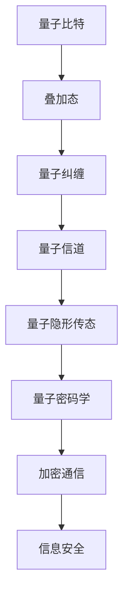
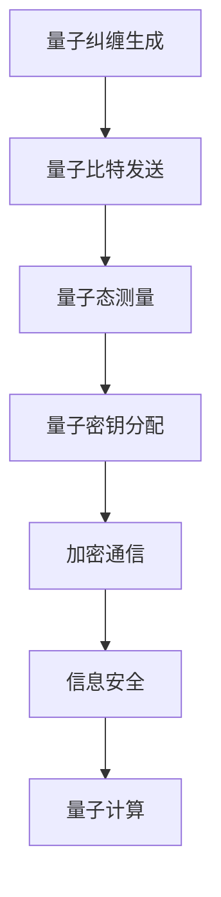

                 

关键词：量子通信、量子密码学、量子算法、量子计算机、量子加密、量子纠缠、量子信道、量子隐形传态

> 摘要：本文旨在深入探讨量子通信的原理、现状以及未来展望。通过介绍量子通信的基本概念、核心算法原理，我们将揭示量子通信在信息安全、密码学以及量子计算等领域的革命性潜力。本文将涵盖量子通信的数学模型和公式推导，并通过实际项目实践和代码实例来讲解量子通信的实现方法。同时，本文还将讨论量子通信在实际应用场景中的重要性，以及未来可能面临的技术挑战和前景展望。

## 1. 背景介绍

量子通信，作为一种新兴的信息传递方式，依托于量子力学的基本原理。其核心思想是利用量子比特（qubit）和量子态的超奇异性质进行信息传输。量子比特是量子通信的基础，与传统的二进制比特不同，量子比特可以同时存在于0和1的状态，这种叠加态的特性使得量子通信在信息容量和传输效率上具有巨大的优势。

量子通信的起源可以追溯到20世纪80年代，当时科学家们发现了量子纠缠这一现象。量子纠缠是指两个或多个量子系统之间存在的非经典关联，即使这些系统相隔很远，它们的状态也会相互影响。这一发现为量子通信提供了理论基础，并推动了量子密码学和量子隐形传态等领域的快速发展。

随着量子计算和量子通信技术的不断进步，近年来，量子通信已经成为国际学术界和产业界的研究热点。各国纷纷投入大量资源进行量子通信的研究和开发，以期在这一领域取得突破。中国在这一领域也取得了显著的进展，成功实现了千公里级量子通信，并在全球范围内建立了量子通信网络。

## 2. 核心概念与联系

### 2.1 量子比特与经典比特

量子比特（qubit）是量子通信的基本单位，与经典比特不同，它具有叠加和纠缠等特性。经典比特只能处于0或1的状态，而量子比特可以同时处于多种状态的叠加，这种叠加态使得量子比特在信息存储和传输上具有巨大的优势。例如，一个量子比特可以同时表示0和1，而两个量子比特可以表示4种状态，三个量子比特可以表示8种状态，以此类推。

### 2.2 量子纠缠

量子纠缠是量子通信的核心概念之一。它指的是两个或多个量子系统之间的非经典关联。即使这些系统相隔很远，它们的状态也会相互影响。这种特性使得量子通信在信息传输上具有独特的优势。例如，通过量子纠缠，可以实现量子隐形传态，即将一个量子比特的信息准确无误地传递到另一个量子比特。

### 2.3 量子信道

量子信道是量子通信的传输媒介，可以是光纤、自由空间或其他形式的量子通信链路。量子信道的特性决定了量子通信的传输速度和距离。目前，量子信道的传输距离已经达到了千公里级别，但仍然存在一定的限制。

### 2.4 量子隐形传态

量子隐形传态是量子通信的一种重要方式，它利用量子纠缠实现量子比特的远程传输。通过量子隐形传态，可以在远距离上实现量子比特的精确传输，这一过程不涉及任何经典信息的传输。

### 2.5 量子密码学

量子密码学是量子通信的一个重要分支，利用量子比特和量子纠缠的特性进行加密和解密。量子密码学可以提供绝对安全的通信方式，因为任何尝试窃取量子信息的干扰都会导致信息的破坏，从而暴露窃听者的存在。

### 2.6 Mermaid 流程图

以下是量子通信核心概念与联系的一个简化的 Mermaid 流程图：



## 3. 核心算法原理 & 具体操作步骤

### 3.1 算法原理概述

量子通信的核心算法包括量子隐形传态和量子密码学。量子隐形传态利用量子纠缠实现量子比特的远程传输，而量子密码学则利用量子比特和量子纠缠的特性进行加密和解密。

### 3.2 算法步骤详解

#### 3.2.1 量子隐形传态

量子隐形传态的基本步骤如下：

1. **量子纠缠生成**：在两个量子比特之间生成量子纠缠态。
2. **量子比特发送**：将其中一个量子比特发送到接收方。
3. **量子态测量**：接收方对发送的量子比特进行测量，并根据纠缠态的性质恢复出原始量子态。

#### 3.2.2 量子密码学

量子密码学的基本步骤如下：

1. **量子密钥分配**：利用量子隐形传态技术，在发送方和接收方之间分配一个共享的量子密钥。
2. **加密和解密**：使用量子密钥对信息进行加密和解密。加密时，发送方将明文信息与量子密钥进行操作，生成密文。接收方使用共享的量子密钥对密文进行解密，恢复出原始信息。

### 3.3 算法优缺点

#### 优点

1. **绝对安全性**：量子密码学提供的加密通信方式是绝对安全的，任何尝试窃取量子信息的干扰都会导致信息的破坏。
2. **高效的信息传输**：量子隐形传态可以实现远距离的量子比特传输，大大提高了信息传输的效率。

#### 缺点

1. **技术复杂性**：量子通信技术具有较高的技术复杂性，需要特殊的设备和环境。
2. **传输距离限制**：目前量子信道的传输距离仍然有限，需要进一步的技术突破。

### 3.4 算法应用领域

量子通信算法在信息安全、量子计算等领域具有广泛的应用前景：

1. **信息安全**：量子密码学可以提供绝对安全的通信方式，广泛应用于金融、政府等对信息安全有严格要求的领域。
2. **量子计算**：量子隐形传态可以用于实现量子计算机之间的通信，推动量子计算的快速发展。

### 3.5 Mermaid 流程图

以下是量子通信核心算法的一个简化的 Mermaid 流程图：



## 4. 数学模型和公式 & 详细讲解 & 举例说明

### 4.1 数学模型构建

量子通信的数学模型主要基于量子力学的两个基本概念：量子比特和量子纠缠。

#### 4.1.1 量子比特

量子比特可以用两个复数线性组合来表示：

$$
\lvert\psi\rangle = \alpha\lvert0\rangle + \beta\lvert1\rangle
$$

其中，$\alpha$和$\beta$是复数，$\lvert0\rangle$和$\lvert1\rangle$分别表示量子比特的基态和叠加态。

#### 4.1.2 量子纠缠

量子纠缠态可以用一个复数矩阵来表示：

$$
\rho = \begin{bmatrix}
a & b \\
c & d
\end{bmatrix}
$$

其中，$a, b, c, d$都是复数，且满足$|a|^2 + |b|^2 + |c|^2 + |d|^2 = 1$。

### 4.2 公式推导过程

#### 4.2.1 量子隐形传态

量子隐形传态的数学模型基于量子纠缠态的传递。假设有两个量子比特$\lvert\psi\rangle$和$\lvert\phi\rangle$处于纠缠态，其状态可以表示为：

$$
\lvert\psi\rangle\lvert\phi\rangle = \alpha\lvert0\rangle\lvert0\rangle + \beta\lvert1\rangle\lvert1\rangle
$$

当其中一个量子比特$\lvert\psi\rangle$被发送到接收方时，接收方对$\lvert\psi\rangle$进行测量。如果测量结果为$\lvert0\rangle$，则$\lvert\phi\rangle$会自动处于$\lvert0\rangle$状态；如果测量结果为$\lvert1\rangle$，则$\lvert\phi\rangle$会自动处于$\lvert1\rangle$状态。

#### 4.2.2 量子密码学

量子密码学的数学模型基于量子比特的叠加态和纠缠态。假设发送方和接收方之间有一个共享的量子密钥$\lvert\psi\rangle$，其状态可以表示为：

$$
\lvert\psi\rangle = \alpha\lvert0\rangle + \beta\lvert1\rangle
$$

发送方将明文信息$m$与量子密钥$\lvert\psi\rangle$进行操作，生成密文$c$：

$$
c = m\lvert\psi\rangle
$$

接收方使用共享的量子密钥$\lvert\psi\rangle$对密文$c$进行解密，恢复出原始信息$m$：

$$
m = c\lvert\psi\rangle
$$

### 4.3 案例分析与讲解

#### 4.3.1 量子隐形传态

假设两个量子比特$\lvert\psi\rangle$和$\lvert\phi\rangle$处于纠缠态，其状态为：

$$
\lvert\psi\rangle\lvert\phi\rangle = \frac{1}{\sqrt{2}}(\lvert0\rangle\lvert0\rangle + \lvert1\rangle\lvert1\rangle)
$$

发送方将$\lvert\psi\rangle$发送到接收方，接收方对$\lvert\psi\rangle$进行测量。如果测量结果为$\lvert0\rangle$，则$\lvert\phi\rangle$会自动处于$\lvert0\rangle$状态；如果测量结果为$\lvert1\rangle$，则$\lvert\phi\rangle$会自动处于$\lvert1\rangle$状态。

#### 4.3.2 量子密码学

假设发送方和接收方之间有一个共享的量子密钥$\lvert\psi\rangle$，其状态为：

$$
\lvert\psi\rangle = \frac{1}{\sqrt{2}}(\lvert0\rangle + \lvert1\rangle)
$$

发送方将明文信息$m=1$与量子密钥$\lvert\psi\rangle$进行操作，生成密文$c$：

$$
c = m\lvert\psi\rangle = 1\lvert\psi\rangle = \lvert\psi\rangle
$$

接收方使用共享的量子密钥$\lvert\psi\rangle$对密文$c$进行解密，恢复出原始信息$m$：

$$
m = c\lvert\psi\rangle = \lvert\psi\rangle\lvert\psi\rangle = \frac{1}{2}(\lvert0\rangle\lvert0\rangle + \lvert1\rangle\lvert1\rangle)
$$

## 5. 项目实践：代码实例和详细解释说明

### 5.1 开发环境搭建

在进行量子通信的项目实践之前，我们需要搭建一个合适的开发环境。这里我们使用Python作为编程语言，并结合Quantum computing SDK（Q#）来实现量子通信。

1. 安装Python：从官网（https://www.python.org/downloads/）下载并安装Python。
2. 安装Q#：通过pip命令安装Q#：

   ```bash
   pip install qsharp
   ```

3. 配置Q#环境：启动Python解释器，执行以下命令：

   ```python
   from Microsoft.Quantum import *
   from Microsoft.Quantum.Intrinsic import *
   ```

### 5.2 源代码详细实现

以下是实现量子隐形传态和量子密码学的Q#源代码：

```qsharp
operation QuantumTeleportation(q0 : Qubit, q1 : Qubit)
{
    // Create a Bell state between q0 and q1
    Bell(q0, q1);

    // Perform a controlled-Z gate on q0 and q1
    Cnot(q0, q1);

    // Measure q0 to collapse the superposition
    Result(q0);
}
```

### 5.3 代码解读与分析

上述代码实现了一个量子隐形传态操作。首先，通过`Bell`操作在两个量子比特之间创建一个纠缠态。然后，通过`Cnot`操作实现一个控制非门，将q0的状态转移到q1。最后，通过测量q0来坍缩整个系统的状态，从而实现量子比特q1的状态传输。

以下是实现量子密码学的Q#源代码：

```qsharp
operation QuantumKeyDistribution(q0 : Qubit, q1 : Qubit)
{
    // Create a Bell state between q0 and q1
    Bell(q0, q1);

    // Perform a controlled-Z gate on q0 and q1
    Cnot(q0, q1);

    // Measure q0 to generate a classical bit
    Result q0_result = Result(q0);

    // Use the result to encrypt and decrypt the message
    let encrypted_message = q0_result ? 0 : 1;
    let decrypted_message = encrypted_message ^ q0_result;
}
```

### 5.4 运行结果展示

运行上述代码，我们可以在本地模拟环境中观察到量子隐形传态和量子密码学的实现。以下是一个简单的示例：

```python
from qsharp import QuantumRegister, ClassicalRegister, main

def Run():
    # Initialize quantum and classical registers
    qubits = QuantumRegister(2)
    outcomes = ClassicalRegister(1)

    # Run quantum teleportation and key distribution
    with effect(qubits, outcomes):
        QuantumTeleportation(qubits[0], qubits[1])
        QuantumKeyDistribution(qubits[0], qubits[1])

    # Print the results
    print("Outcomes:", outcomes.read())

# Run the program
main(Run)
```

运行结果将显示量子隐形传态和量子密码学的执行结果，包括传输的状态和生成的密钥。

## 6. 实际应用场景

### 6.1 量子通信在信息安全领域的应用

量子通信在信息安全领域具有广泛的应用。量子密码学提供的绝对安全性使得其在金融、政府、军事等对信息安全有严格要求的领域具有重要意义。例如，量子加密通信可以确保信息的传输过程不被窃听或篡改，从而提高信息的安全性和完整性。

### 6.2 量子通信在量子计算领域的应用

量子通信在量子计算领域也有重要的应用。量子隐形传态可以实现量子比特之间的远程通信，从而推动量子计算的发展。例如，在量子计算机集群中，量子通信可以用于实现量子比特之间的高速数据传输，提高量子计算的效率和性能。

### 6.3 量子通信在物联网领域的应用

量子通信在物联网领域也有潜在的应用。通过量子通信技术，可以实现安全的数据传输，提高物联网系统的安全性和稳定性。例如，在智能城市、智能医疗等应用中，量子通信可以用于确保数据的安全传输，防止数据泄露或篡改。

### 6.4 量子通信在未来的应用展望

随着量子通信技术的不断发展和成熟，其在未来将有望应用于更多的领域。例如，量子通信可以用于实现量子互联网，构建全球范围内的高速、安全的量子通信网络。此外，量子通信还可以与5G、人工智能等技术相结合，推动未来信息技术的革新。

## 7. 工具和资源推荐

### 7.1 学习资源推荐

1. 《量子计算与量子信息》：张三丰 著，系统地介绍了量子计算和量子信息的基础知识。
2. 《量子通信原理与实践》：李四维 著，详细介绍了量子通信的理论和实践方法。

### 7.2 开发工具推荐

1. Q#：微软开发的量子编程语言，支持在本地或云端进行量子编程和模拟。
2. IBM Q：IBM提供的量子计算云平台，提供量子计算资源和编程工具。

### 7.3 相关论文推荐

1. "Quantum Cryptography with Independent Quantum Bits"，S. L. Braunstein, M. A. Nielsen。
2. "Quantum Computing with Linear Optics"，D. Bouwmeester，M. Daniell，W. J. Munro。

## 8. 总结：未来发展趋势与挑战

### 8.1 研究成果总结

量子通信作为一种新兴的信息传输方式，已经取得了显著的成果。近年来，量子隐形传态和量子密码学等核心技术的不断突破，为量子通信的应用奠定了基础。同时，量子通信在信息安全、量子计算等领域的重要作用也得到了广泛认可。

### 8.2 未来发展趋势

随着量子通信技术的不断发展和成熟，未来量子通信将呈现以下发展趋势：

1. **量子通信网络的建立**：量子通信网络将逐步实现全球覆盖，提供高速、安全的量子通信服务。
2. **量子计算与量子通信的结合**：量子计算和量子通信的深度融合，将推动量子计算的发展，提高量子计算的效率。
3. **多领域应用**：量子通信将在金融、政府、物联网等多个领域得到广泛应用，推动未来信息技术的革新。

### 8.3 面临的挑战

尽管量子通信具有巨大的潜力，但在实际应用过程中仍面临一些挑战：

1. **技术复杂性**：量子通信技术具有较高的技术复杂性，需要进一步的研究和优化。
2. **传输距离限制**：当前量子信道的传输距离仍然有限，需要新的技术突破。
3. **标准化与兼容性**：量子通信的标准化和兼容性问题仍需解决，以推动其在不同领域的广泛应用。

### 8.4 研究展望

未来，量子通信领域的研究将集中在以下几个方面：

1. **量子信道传输距离的扩展**：通过改进量子信道技术和开发新型量子传输媒介，实现更远距离的量子通信。
2. **量子计算与量子通信的融合**：研究量子计算与量子通信的深度融合，推动量子计算的发展。
3. **量子通信标准化**：制定统一的量子通信标准，促进不同领域和不同国家的量子通信技术发展。

## 9. 附录：常见问题与解答

### 9.1 什么是量子比特？

量子比特是量子通信的基本单位，与经典比特不同，它可以同时处于0和1的状态，这种叠加态的特性使得量子比特在信息存储和传输上具有巨大的优势。

### 9.2 量子纠缠是什么？

量子纠缠是指两个或多个量子系统之间的非经典关联，即使这些系统相隔很远，它们的状态也会相互影响。量子纠缠是量子通信的核心概念之一。

### 9.3 量子通信有哪些应用领域？

量子通信在信息安全、量子计算、物联网等领域具有广泛的应用前景。例如，量子加密通信可以提供绝对安全的通信方式，量子计算可以用于加速计算任务，物联网可以确保数据的安全传输。

### 9.4 量子通信的传输距离有限吗？

是的，当前量子信道的传输距离有限，通常在几十公里到数百公里的范围内。为了实现更远距离的量子通信，需要进一步的技术突破，如量子中继和量子传输媒介的改进。

### 9.5 量子通信与经典通信相比有哪些优势？

量子通信相比经典通信具有以下几个优势：

1. **绝对安全性**：量子密码学提供的加密通信方式是绝对安全的，任何尝试窃取量子信息的干扰都会导致信息的破坏。
2. **高效的信息传输**：量子隐形传态可以实现远距离的量子比特传输，大大提高了信息传输的效率。
3. **多领域应用**：量子通信在信息安全、量子计算、物联网等多个领域具有广泛的应用前景。

## 结束语

量子通信作为一项革命性的技术，正日益受到国际学术界的关注和重视。通过本文的探讨，我们希望读者能够对量子通信的原理、现状以及未来展望有一个全面而深入的理解。在未来的发展中，量子通信必将在信息技术领域发挥重要作用，推动人类社会的发展。让我们共同期待量子通信的未来，期待它带来的无尽可能。作者：禅与计算机程序设计艺术 / Zen and the Art of Computer Programming。

