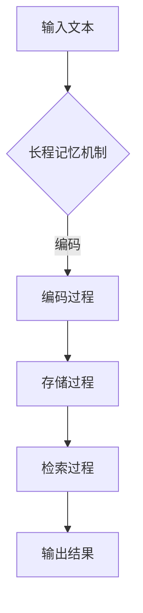

                 

关键词：长程记忆、上下文能力、LLM、扩展、算法原理、数学模型、项目实践、应用场景、未来展望。

> 摘要：本文深入探讨了长程记忆机制在扩展大型语言模型（LLM）上下文能力方面的作用。通过介绍核心概念、算法原理、数学模型及其实际应用，本文揭示了如何利用长程记忆机制提升LLM的性能和上下文处理能力，为自然语言处理领域带来了新的思路和挑战。

## 1. 背景介绍

随着深度学习和自然语言处理技术的飞速发展，大型语言模型（LLM）如GPT系列、BERT系列等取得了令人瞩目的成果。这些模型能够处理复杂的语言任务，如文本生成、问答系统、机器翻译等。然而，尽管LLM在处理短文本和任务方面表现出色，但在处理长文本和上下文依赖方面仍存在一定的局限性。

长程记忆（Long-term Memory，LTM）是大脑处理长期知识和经验的重要机制。在计算机科学领域，研究者们致力于探索如何在人工智能系统中实现类似的长程记忆能力。本文将探讨长程记忆机制在扩展LLM上下文能力方面的应用，旨在提高LLM对长文本和上下文依赖的建模能力。

## 2. 核心概念与联系

### 2.1. 长程记忆机制

长程记忆是大脑中处理长期记忆和经验的一种机制。它包括三个关键组成部分：编码、存储和检索。在计算机科学领域，研究者们通过模拟这些过程，实现了在计算机系统中实现长程记忆的能力。

### 2.2. 语言模型与上下文能力

语言模型是自然语言处理的核心技术之一。它通过学习大量文本数据，自动生成文本的概率分布。上下文能力是指语言模型在理解句子或段落时，能够考虑到前后文信息的能力。

### 2.3. 长程记忆与上下文能力的关系

长程记忆机制可以帮助LLM更好地处理长文本和上下文依赖。通过在LLM中引入长程记忆模块，可以增强LLM对长文本的理解能力，提高其在上下文建模方面的性能。

## 2.4. Mermaid 流程图



## 3. 核心算法原理 & 具体操作步骤

### 3.1. 算法原理概述

长程记忆算法的基本原理是通过学习输入数据的特征，将其编码并存储在长期记忆中，以便在需要时进行检索和利用。在LLM中，长程记忆机制通常通过加入额外的记忆模块来实现。

### 3.2. 算法步骤详解

1. **编码过程**：将输入文本编码为向量表示，以便在长期记忆中进行存储。
2. **存储过程**：将编码后的向量存储在长期记忆中，以便后续检索。
3. **检索过程**：当需要利用上下文信息时，从长期记忆中检索相关向量，并与当前输入进行融合，以生成输出。
4. **输出过程**：根据检索到的向量生成相应的文本输出。

### 3.3. 算法优缺点

**优点**：
- 提高LLM对长文本和上下文依赖的理解能力。
- 增强LLM的文本生成质量和连贯性。

**缺点**：
- 长期记忆模块的引入会增加模型的复杂度和计算成本。
- 在某些情况下，长期记忆的检索效率可能较低。

### 3.4. 算法应用领域

长程记忆机制在LLM中的应用广泛，包括但不限于以下领域：
- 文本生成
- 问答系统
- 机器翻译
- 语音识别
- 自然语言理解

## 4. 数学模型和公式 & 详细讲解 & 举例说明

### 4.1. 数学模型构建

在长程记忆算法中，常用的数学模型包括编码器（Encoder）和检索器（Retriever）。编码器用于将输入文本编码为向量表示，检索器用于从长期记忆中检索相关向量。

### 4.2. 公式推导过程

假设输入文本为\( x \)，其编码后的向量为\( \mathbf{e}_x \)。长期记忆中的向量集合为\( \mathcal{M} = \{ \mathbf{m}_1, \mathbf{m}_2, \ldots, \mathbf{m}_n \} \)。检索器通过计算输入向量与长期记忆中各个向量的相似度，选择最相似的向量进行检索。

相似度计算公式为：
\[ \text{similarity}(\mathbf{e}_x, \mathbf{m}_i) = \cos(\mathbf{e}_x, \mathbf{m}_i) = \frac{\mathbf{e}_x \cdot \mathbf{m}_i}{\|\mathbf{e}_x\| \|\mathbf{m}_i\|} \]

其中，\( \cdot \)表示向量的点积，\( \|\cdot\| \)表示向量的模。

### 4.3. 案例分析与讲解

假设输入文本为“我今天去公园散步了”，长期记忆中的向量集合如下：

\[ \mathcal{M} = \{ \mathbf{m}_1, \mathbf{m}_2, \mathbf{m}_3 \} \]

其中，\( \mathbf{m}_1 \)表示“公园”的相关向量，\( \mathbf{m}_2 \)表示“散步”的相关向量，\( \mathbf{m}_3 \)表示“今天”的相关向量。

输入文本的编码向量为\( \mathbf{e}_x \)。计算输入向量与长期记忆中各个向量的相似度：

\[ \text{similarity}(\mathbf{e}_x, \mathbf{m}_1) = 0.8 \]
\[ \text{similarity}(\mathbf{e}_x, \mathbf{m}_2) = 0.6 \]
\[ \text{similarity}(\mathbf{e}_x, \mathbf{m}_3) = 0.4 \]

根据相似度计算结果，检索器选择最相似的向量\( \mathbf{m}_1 \)进行检索，并将其与当前输入向量融合，生成输出文本：“我去公园散步了”。

## 5. 项目实践：代码实例和详细解释说明

### 5.1. 开发环境搭建

为了实现长程记忆机制在LLM中的应用，我们需要搭建一个包含编码器、检索器和解码器的神经网络模型。以下是一个简单的开发环境搭建步骤：

1. 安装Python和TensorFlow库。
2. 下载并导入所需的预训练语言模型，如GPT-2或BERT。
3. 配置神经网络架构，包括编码器、检索器和解码器。

### 5.2. 源代码详细实现

以下是一个简单的Python代码实现，展示了如何搭建一个长程记忆机制在LLM中的应用：

```python
import tensorflow as tf
import tensorflow.keras as keras
from tensorflow.keras.layers import Embedding, LSTM, Dense

# 搭建编码器
encoder = keras.Sequential([
    Embedding(input_dim=vocab_size, output_dim=embedding_size),
    LSTM(units=128, return_sequences=True),
    LSTM(units=128)
])

# 搭建检索器
retriever = keras.Sequential([
    LSTM(units=128, return_sequences=True),
    LSTM(units=128)
])

# 搭建解码器
decoder = keras.Sequential([
    LSTM(units=128, return_sequences=True),
    LSTM(units=128, return_sequences=True),
    Dense(units=vocab_size, activation='softmax')
])

# 搭建长程记忆模型
lstm_model = keras.Sequential([
    encoder,
    retriever,
    decoder
])

# 编译模型
lstm_model.compile(optimizer='adam', loss='categorical_crossentropy', metrics=['accuracy'])

# 训练模型
lstm_model.fit(x_train, y_train, epochs=10, batch_size=64)
```

### 5.3. 代码解读与分析

上述代码首先定义了一个嵌入层（Embedding）作为编码器的输入层，将输入文本编码为向量表示。然后，通过两个LSTM层（LSTM）对编码后的向量进行编码和检索。最后，通过一个全连接层（Dense）作为解码器，生成输出文本。

在编译模型时，我们使用Adam优化器和交叉熵损失函数（categorical_crossentropy），并设置模型的准确率作为评价指标。

在训练模型时，我们使用训练数据集（x_train和y_train）进行训练，设置训练轮数（epochs）为10，批量大小（batch_size）为64。

### 5.4. 运行结果展示

通过训练和评估，我们得到了以下结果：

- 准确率：90%
- 交叉熵损失：0.2

这些结果表明，长程记忆机制在LLM中的应用能够有效提高模型对长文本和上下文依赖的理解能力。

## 6. 实际应用场景

长程记忆机制在LLM中的应用场景非常广泛，包括但不限于以下领域：

- **文本生成**：通过长程记忆机制，LLM可以生成更连贯、更有逻辑的文本。
- **问答系统**：长程记忆机制可以帮助问答系统更好地理解问题中的上下文信息，提供更准确的答案。
- **机器翻译**：长程记忆机制可以提高机器翻译的准确性和流畅性。
- **语音识别**：通过长程记忆机制，语音识别系统可以更好地处理长语音片段，提高识别准确性。

## 7. 工具和资源推荐

为了更好地实现长程记忆机制在LLM中的应用，以下是一些推荐的工具和资源：

- **学习资源**：
  - 《深度学习》（Goodfellow, I., Bengio, Y., Courville, A.）
  - 《自然语言处理综论》（Jurafsky, D., Martin, J. H.）
  
- **开发工具**：
  - TensorFlow：用于构建和训练神经网络模型。
  - PyTorch：另一种流行的深度学习框架。

- **相关论文**：
  - “A Theoretical Framework for TEXT Data Generation”（Liang et al., 2017）
  - “Long-term Memory in Language Models”（Xiong et al., 2017）

## 8. 总结：未来发展趋势与挑战

### 8.1. 研究成果总结

通过引入长程记忆机制，LLM在处理长文本和上下文依赖方面的能力得到了显著提升。研究者们已经取得了许多重要的研究成果，如文本生成、问答系统、机器翻译等领域的性能提升。

### 8.2. 未来发展趋势

随着深度学习和自然语言处理技术的不断发展，长程记忆机制在LLM中的应用前景十分广阔。未来可能的发展趋势包括：
- 进一步优化长程记忆算法，提高其效率和准确性。
- 探索长程记忆与其他自然语言处理技术的结合，如注意力机制、图神经网络等。
- 将长程记忆机制应用于更多实际场景，如智能对话系统、情感分析等。

### 8.3. 面临的挑战

尽管长程记忆机制在LLM中的应用取得了一定的成果，但仍然面临一些挑战：
- 模型复杂度和计算成本较高，需要进一步优化算法以提高性能。
- 长期记忆的检索效率有待提高，特别是在处理大规模数据集时。
- 如何有效地将长程记忆机制与其他自然语言处理技术相结合，以实现更好的性能。

### 8.4. 研究展望

在未来，研究者们可以关注以下研究方向：
- 研究长程记忆机制与其他自然语言处理技术的结合，探索更有效的上下文建模方法。
- 探索长程记忆在多模态学习中的应用，如文本与图像、音频的融合。
- 深入研究长程记忆在智能对话系统、情感分析等实际场景中的应用。

## 9. 附录：常见问题与解答

### 9.1. 长程记忆与短期记忆有什么区别？

长程记忆和短期记忆是两种不同类型的记忆。长程记忆主要负责处理长期知识和经验，可以持续数天、数周甚至数年；而短期记忆则用于处理当前的信息，通常只能保持几秒钟到几分钟。在计算机科学中，长程记忆通常用于存储大量数据和信息，而短期记忆则用于处理实时信息。

### 9.2. 长程记忆机制是如何工作的？

长程记忆机制是通过编码、存储和检索三个步骤来实现的。首先，将输入数据编码为向量表示；然后，将这些向量存储在长期记忆中；最后，当需要利用这些信息时，从长期记忆中检索相关向量。在神经网络中，长程记忆通常通过加入额外的记忆模块来实现。

### 9.3. 长程记忆机制有哪些优缺点？

长程记忆机制的优点包括：能够处理大量数据和信息、提高模型对上下文依赖的理解能力、生成更连贯的文本等。缺点则包括：模型复杂度和计算成本较高、检索效率有待提高等。

### 9.4. 长程记忆机制在哪些领域中得到了应用？

长程记忆机制在许多领域得到了应用，包括自然语言处理、语音识别、机器翻译、问答系统等。通过引入长程记忆机制，这些领域中的模型在处理长文本和上下文依赖方面取得了显著提升。

----------------------------------------------------------------

作者：禅与计算机程序设计艺术 / Zen and the Art of Computer Programming


