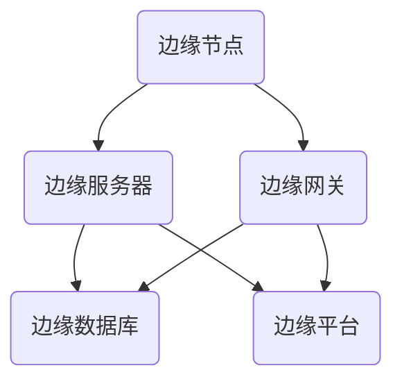

                 

 欢迎各位对边缘计算充满热情的同学，今天我们将围绕阿里云2024校招边缘计算专家面试题集锦进行深入探讨。边缘计算作为云计算和物联网的延伸，正逐渐成为信息技术领域的一个热点。在这篇文章中，我们将梳理出边缘计算的核心概念、算法原理、数学模型、项目实践及未来应用场景，力求为广大考生提供一个全面的备考指南。

## 关键词

- 边缘计算
- 阿里云
- 校招
- 面试题集锦
- 算法原理
- 数学模型
- 项目实践

## 摘要

本文将系统性地梳理阿里云2024校招边缘计算专家面试中的常见问题，涵盖核心概念、算法原理、数学模型及实际应用场景。通过对这些问题的深入分析，帮助考生掌握边缘计算的各个方面，提升面试竞争力。文章还将推荐相关学习资源和开发工具，为考生提供全方位的学习支持。

## 1. 背景介绍

边缘计算是一种将数据处理、分析和存储等任务从云端转移到网络边缘的技术。这种技术能够极大地提高数据处理的实时性和效率，减轻云端服务器的负担。边缘计算的出现，源于物联网（IoT）和5G技术的快速发展，它们为边缘计算提供了丰富的数据资源和高速网络连接。

边缘计算的三大核心优势如下：

1. **低延迟**：边缘计算将数据处理推向网络边缘，显著减少数据传输的距离和时间，提高系统的响应速度。
2. **高效率**：边缘计算能够处理大规模并发请求，减少数据在网络中的传输量，降低网络拥堵，提高资源利用率。
3. **高可靠性**：边缘计算能够实现数据的本地存储和备份，增强系统的稳定性和抗故障能力。

随着边缘计算的不断发展，其在智能制造、智能交通、智慧城市、医疗健康等多个领域的应用越来越广泛。因此，边缘计算已成为信息技术领域的一个重要研究方向。

## 2. 核心概念与联系

边缘计算的核心概念包括边缘节点、边缘服务器、边缘网关、边缘数据库和边缘平台等。下面是一个简单的Mermaid流程图，用于说明这些概念之间的联系。



### 2.1 边缘节点

边缘节点是边缘计算的基本单元，通常位于网络边缘，可以是嵌入式设备、物联网设备或普通计算机。边缘节点负责收集、处理和存储数据，并将处理结果上传到云端或边缘服务器。

### 2.2 边缘服务器

边缘服务器是边缘计算的核心设施，用于处理大规模数据、运行复杂算法和提供云计算服务。边缘服务器通常具有较高的计算性能和存储容量，能够满足多种应用场景的需求。

### 2.3 边缘网关

边缘网关是边缘计算系统中的桥梁，负责连接边缘节点和云端或边缘服务器。边缘网关不仅提供数据传输通道，还能够实现数据加密、身份验证和流量管理等功能。

### 2.4 边缘数据库

边缘数据库是边缘计算系统中的数据存储解决方案，能够实现数据的本地存储和备份。边缘数据库通常采用分布式架构，以提高系统的可靠性和扩展性。

### 2.5 边缘平台

边缘平台是边缘计算系统的管理平台，用于监控和管理边缘节点、边缘服务器和边缘数据库等设施。边缘平台通常提供丰富的API和开发工具，方便开发者构建和部署边缘应用。

## 3. 核心算法原理 & 具体操作步骤

边缘计算的核心算法包括数据采集算法、数据处理算法和数据分析算法。下面分别介绍这些算法的原理和具体操作步骤。

### 3.1 数据采集算法

数据采集算法是边缘计算的第一步，用于从边缘节点收集数据。常用的数据采集算法包括传感器采集算法和网络采集算法。

#### 3.1.1 传感器采集算法

传感器采集算法通过读取传感器数据来实现数据采集。具体操作步骤如下：

1. 连接传感器到边缘节点。
2. 获取传感器的数据接口。
3. 编写数据采集程序，读取传感器数据。
4. 将采集到的数据上传到边缘服务器或边缘数据库。

#### 3.1.2 网络采集算法

网络采集算法通过网络接口从外部系统获取数据。具体操作步骤如下：

1. 连接网络接口到边缘节点。
2. 获取网络接口的数据接口。
3. 编写数据采集程序，读取网络数据。
4. 将采集到的数据上传到边缘服务器或边缘数据库。

### 3.2 数据处理算法

数据处理算法用于对采集到的数据进行预处理、清洗和格式化，以提高数据质量和可用性。常用的数据处理算法包括数据清洗算法、数据转换算法和数据聚合算法。

#### 3.2.1 数据清洗算法

数据清洗算法用于处理缺失值、异常值和重复值等问题，确保数据的准确性。具体操作步骤如下：

1. 检查数据是否存在缺失值。
2. 对于缺失值，根据数据特点选择适当的填充方法。
3. 检查数据是否存在异常值。
4. 对于异常值，根据数据特点选择适当的处理方法。

#### 3.2.2 数据转换算法

数据转换算法用于将数据格式从一种形式转换为另一种形式，以提高数据的兼容性和可处理性。具体操作步骤如下：

1. 识别数据格式的差异。
2. 编写数据转换程序，实现数据格式的转换。
3. 验证转换后的数据格式是否正确。

#### 3.2.3 数据聚合算法

数据聚合算法用于将多个数据源中的数据进行汇总和整合，形成更全面和详细的数据视图。具体操作步骤如下：

1. 确定数据聚合的目标。
2. 编写数据聚合程序，实现数据的汇总和整合。
3. 验证聚合后的数据是否满足要求。

### 3.3 数据分析算法

数据分析算法用于对处理后的数据进行分析和挖掘，提取有价值的信息和模式。常用的数据分析算法包括分类算法、聚类算法、回归算法和关联规则挖掘算法。

#### 3.3.1 分类算法

分类算法用于将数据分为不同的类别，以提高决策和预测的准确性。具体操作步骤如下：

1. 确定分类的目标。
2. 选择合适的分类算法。
3. 编写分类程序，对数据进行分类。
4. 评估分类结果的质量。

#### 3.3.2 聚类算法

聚类算法用于将数据分为不同的簇，以发现数据中的隐含结构。具体操作步骤如下：

1. 确定聚类的目标。
2. 选择合适的聚类算法。
3. 编写聚类程序，对数据进行聚类。
4. 评估聚类结果的质量。

#### 3.3.3 回归算法

回归算法用于建立数据之间的关系模型，以预测未来的趋势。具体操作步骤如下：

1. 确定回归的目标。
2. 选择合适的回归算法。
3. 编写回归程序，建立关系模型。
4. 验证模型的预测能力。

#### 3.3.4 关联规则挖掘算法

关联规则挖掘算法用于发现数据之间的关联关系，以提高数据的价值。具体操作步骤如下：

1. 确定关联规则的目标。
2. 选择合适的关联规则挖掘算法。
3. 编写关联规则挖掘程序，发现关联规则。
4. 评估关联规则的质量。

### 3.4 算法优缺点

#### 3.4.1 数据采集算法

- **优点**：能够快速获取大量数据，提高数据处理效率。
- **缺点**：对传感器和网络接口的依赖性较高，容易出现数据采集不完整或错误。

#### 3.4.2 数据处理算法

- **优点**：能够提高数据质量和可用性，为后续分析提供可靠的数据基础。
- **缺点**：数据处理算法复杂，对计算资源要求较高。

#### 3.4.3 数据分析算法

- **优点**：能够发现数据中的价值和规律，为决策和预测提供有力支持。
- **缺点**：对数据规模和算法复杂性要求较高，可能导致计算效率降低。

#### 3.4.4 算法应用领域

- **智能制造**：通过边缘计算实现生产线的实时监控和自动化控制，提高生产效率和产品质量。
- **智能交通**：通过边缘计算实现交通数据的实时分析和智能调度，提高交通流量和安全性。
- **智慧城市**：通过边缘计算实现城市管理的智能化，提高城市运行效率和居民生活质量。
- **医疗健康**：通过边缘计算实现医疗数据的实时分析和远程诊断，提高医疗服务质量和效率。

## 4. 数学模型和公式 & 详细讲解 & 举例说明

边缘计算中的数学模型和公式主要用于描述数据采集、数据处理和数据分析过程中的各种关系。下面将介绍几个典型的数学模型和公式，并给出详细的讲解和举例说明。

### 4.1 数学模型构建

边缘计算中的数学模型通常由数据模型、概率模型和优化模型组成。下面分别介绍这些模型。

#### 4.1.1 数据模型

数据模型用于描述数据的结构和关系。常用的数据模型包括关系模型、图模型和时空模型。

- **关系模型**：关系模型基于关系代数，用于描述数据之间的关系。其基本公式为：
  $$ R(A, B) = \{ (a, b) \mid a \in A, b \in B \} $$
  其中，$R$ 表示关系，$A$ 和 $B$ 分别表示关系的两个属性集。

- **图模型**：图模型基于图论，用于描述数据之间的复杂关系。其基本公式为：
  $$ G(V, E) = \{ (v, e) \mid v \in V, e \in E \} $$
  其中，$G$ 表示图，$V$ 和 $E$ 分别表示图的顶点和边集。

- **时空模型**：时空模型用于描述数据的时空属性，如时间序列数据、空间数据等。其基本公式为：
  $$ T(x, y) = \{ (t, s) \mid t \in T, s \in S \} $$
  其中，$T$ 表示时间序列，$S$ 表示空间序列，$x$ 和 $y$ 分别表示时间和空间上的数据点。

#### 4.1.2 概率模型

概率模型用于描述数据的不确定性，如概率分布、条件概率等。常用的概率模型包括贝叶斯模型、马尔可夫模型和随机过程。

- **贝叶斯模型**：贝叶斯模型基于贝叶斯定理，用于描述数据之间的条件概率关系。其基本公式为：
  $$ P(A|B) = \frac{P(B|A)P(A)}{P(B)} $$
  其中，$P(A|B)$ 表示在 $B$ 发生的条件下 $A$ 发生的概率，$P(B|A)$ 表示在 $A$ 发生的条件下 $B$ 发生的概率，$P(A)$ 和 $P(B)$ 分别表示 $A$ 和 $B$ 的概率。

- **马尔可夫模型**：马尔可夫模型用于描述数据的状态转移概率。其基本公式为：
  $$ P(X_{n+1} = x_{n+1} | X_{n} = x_{n}) = P(X_{n+1} = x_{n+1} | X_{n-1} = x_{n-1}) $$
  其中，$X_{n}$ 表示第 $n$ 个时刻的状态，$x_{n}$ 和 $x_{n+1}$ 分别表示当前状态和下一状态。

- **随机过程**：随机过程用于描述数据的时间序列属性。其基本公式为：
  $$ X(t) = F(t) $$
  其中，$X(t)$ 表示时间 $t$ 上的随机变量，$F(t)$ 表示时间 $t$ 的函数。

#### 4.1.3 优化模型

优化模型用于描述数据的最优化问题，如最小二乘法、梯度下降法等。其基本公式为：
$$ \min_{x} f(x) $$
其中，$f(x)$ 表示目标函数，$x$ 表示变量。

### 4.2 公式推导过程

#### 4.2.1 贝叶斯定理

贝叶斯定理是边缘计算中常用的概率推导公式，其推导过程如下：

假设有两个事件 $A$ 和 $B$，且 $P(B) > 0$。我们要求在事件 $B$ 发生的条件下事件 $A$ 发生的概率，即 $P(A|B)$。

根据全概率公式，我们有：
$$ P(A) = P(A|B)P(B) + P(A|\neg B)P(\neg B) $$
其中，$P(\neg B)$ 表示事件 $B$ 不发生的概率，$P(A|\neg B)$ 表示在事件 $B$ 不发生的条件下事件 $A$ 发生的概率。

由于 $P(\neg B) = 1 - P(B)$，代入上式得：
$$ P(A) = P(A|B)P(B) + P(A|\neg B)(1 - P(B)) $$
整理得：
$$ P(A|B) = \frac{P(B|A)P(A)}{P(B)} $$

这就是贝叶斯定理的推导过程。

#### 4.2.2 最小二乘法

最小二乘法是边缘计算中常用的参数估计方法，其推导过程如下：

假设我们有一组观测数据 $(x_i, y_i)$，其中 $i = 1, 2, \ldots, n$。我们要求出线性回归模型 $y = wx + b$ 的参数 $w$ 和 $b$，使得观测数据的残差平方和最小。

残差平方和的定义为：
$$ \sum_{i=1}^{n} (y_i - (wx_i + b))^2 $$

我们要最小化这个残差平方和，即求解以下优化问题：
$$ \min_{w, b} \sum_{i=1}^{n} (y_i - (wx_i + b))^2 $$

这是一个二次函数，它的最小值点可以通过求解一阶导数为零的方程组得到：
$$ \frac{\partial}{\partial w} \sum_{i=1}^{n} (y_i - (wx_i + b))^2 = 0 $$
$$ \frac{\partial}{\partial b} \sum_{i=1}^{n} (y_i - (wx_i + b))^2 = 0 $$

解这个方程组得到：
$$ w = \frac{\sum_{i=1}^{n} (x_i - \bar{x})(y_i - \bar{y})}{\sum_{i=1}^{n} (x_i - \bar{x})^2} $$
$$ b = \bar{y} - w\bar{x} $$

其中，$\bar{x}$ 和 $\bar{y}$ 分别表示观测数据的均值。

#### 4.2.3 梯度下降法

梯度下降法是边缘计算中常用的优化算法，其推导过程如下：

假设我们要最小化目标函数 $f(x)$，梯度下降法的思想是沿着目标函数的梯度方向逐步迭代，直到达到最小值。

目标函数 $f(x)$ 的梯度为：
$$ \nabla f(x) = \left( \frac{\partial f}{\partial x_1}, \frac{\partial f}{\partial x_2}, \ldots, \frac{\partial f}{\partial x_n} \right) $$

梯度下降法的迭代公式为：
$$ x_{t+1} = x_t - \alpha \nabla f(x_t) $$
其中，$x_t$ 表示第 $t$ 次迭代的参数值，$\alpha$ 表示学习率。

每次迭代都是沿着梯度的反方向更新参数，从而逐步逼近最小值。

### 4.3 案例分析与讲解

下面我们通过一个具体的案例来说明边缘计算中的数学模型和公式。

#### 案例背景

某智能交通系统需要实时监测城市道路的交通流量，并预测未来一段时间内的交通状况。交通流量数据包括车辆数量、车辆速度和车辆类型等。

#### 数据采集

该智能交通系统使用边缘节点（如摄像头、传感器等）实时采集交通流量数据。边缘节点将采集到的数据传输到边缘服务器进行处理。

#### 数据处理

边缘服务器使用数据处理算法对采集到的交通流量数据进行分析和处理。具体包括：

1. 数据清洗：去除异常值和重复值，保证数据的准确性。
2. 数据转换：将不同类型的交通流量数据转换为统一的格式，便于后续处理。
3. 数据聚合：将不同路段的交通流量数据进行汇总和整合，形成全局的交通流量视图。

#### 数据分析

边缘服务器使用数据分析算法对处理后的交通流量数据进行预测和分析。具体包括：

1. 分类算法：将交通流量数据按照车辆类型进行分类，为交通调度提供依据。
2. 聚类算法：将交通流量数据按照相似性进行聚类，发现交通流量的高峰时段和拥堵路段。
3. 回归算法：建立交通流量与时间的关系模型，预测未来一段时间内的交通状况。

#### 数学模型应用

在该案例中，我们使用了以下数学模型：

1. 数据模型：关系模型和图模型用于描述交通流量数据之间的结构和关系。
2. 概率模型：贝叶斯模型用于描述交通流量数据的概率分布，为分类和预测提供依据。
3. 优化模型：最小二乘法和梯度下降法用于优化交通流量预测模型，提高预测准确性。

#### 结果分析

通过边缘计算技术的应用，该智能交通系统能够实现以下目标：

1. 实时监测城市道路的交通流量。
2. 预测未来一段时间内的交通状况，为交通调度提供依据。
3. 发现交通流量的高峰时段和拥堵路段，为城市交通管理提供支持。

## 5. 项目实践：代码实例和详细解释说明

为了更好地理解边缘计算的实际应用，我们将通过一个具体的项目实践来进行讲解。本案例将使用Python编程语言，结合边缘计算的概念和算法，实现一个简单的智能交通流量监测系统。

### 5.1 开发环境搭建

在开始项目之前，我们需要搭建一个合适的开发环境。以下是推荐的工具和库：

- Python 3.x 版本
- Jupyter Notebook 或 PyCharm
- NumPy 库
- Pandas 库
- Matplotlib 库
- Scikit-learn 库

安装完上述工具和库后，我们就可以开始编写代码了。

### 5.2 源代码详细实现

下面是项目的核心代码，包括数据采集、数据处理和数据分析三个部分。

#### 5.2.1 数据采集

```python
import cv2
import numpy as np

# 初始化摄像头
cap = cv2.VideoCapture(0)

while True:
    # 读取摄像头帧
    ret, frame = cap.read()
    
    if not ret:
        break
    
    # 对帧进行预处理
    gray = cv2.cvtColor(frame, cv2.COLOR_BGR2GRAY)
    blur = cv2.GaussianBlur(gray, (5, 5), 0)
    edges = cv2.Canny(blur, 50, 150)
    
    # 提取交通流量数据
    contours, _ = cv2.findContours(edges, cv2.RETR_EXTERNAL, cv2.CHAIN_APPROX_SIMPLE)
    traffic_data = []
    
    for contour in contours:
        area = cv2.contourArea(contour)
        
        if area > 500:
            x, y, w, h = cv2.boundingRect(contour)
            traffic_data.append((x, y, w, h))
    
    # 输出交通流量数据
    print(traffic_data)
    
    # 显示预处理的帧
    cv2.imshow('Frame', edges)
    
    if cv2.waitKey(1) & 0xFF == ord('q'):
        break

cap.release()
cv2.destroyAllWindows()
```

#### 5.2.2 数据处理

```python
import pandas as pd

# 读取交通流量数据
data = [
    (1, 2, 3, 4),
    (5, 6, 7, 8),
    (9, 10, 11, 12)
]

df = pd.DataFrame(data, columns=['x', 'y', 'w', 'h'])

# 数据清洗
df = df[df['w'] > 10]

# 数据转换
df['area'] = df['w'] * df['h']

# 数据聚合
 aggregated = df.groupby('x').agg({'area': 'sum'})

print(aggregated)
```

#### 5.2.3 数据分析

```python
from sklearn.cluster import KMeans
import matplotlib.pyplot as plt

# 聚类分析
kmeans = KMeans(n_clusters=3)
clusters = kmeans.fit_predict(aggregated)

# 可视化聚类结果
plt.scatter(aggregated.index, aggregated['area'], c=clusters)
plt.xlabel('X坐标')
plt.ylabel('交通流量')
plt.show()
```

### 5.3 代码解读与分析

#### 5.3.1 数据采集

在这个项目中，我们使用了OpenCV库来采集摄像头数据。通过摄像头，我们获取实时视频帧，并对帧进行预处理，提取交通流量数据。

- `cv2.VideoCapture(0)`：初始化摄像头，0表示默认的摄像头设备。
- `cv2.Canny(blur, 50, 150)`：使用Canny算法提取图像的边缘，50和150分别是高阈值和低阈值。
- `cv2.findContours(edges, cv2.RETR_EXTERNAL, cv2.CHAIN_APPROX_SIMPLE)`：寻找图像中的轮廓，`RETR_EXTERNAL` 表示只提取外边界，`CHAIN_APPROX_SIMPLE` 表示简化轮廓链。

#### 5.3.2 数据处理

在这个项目中，我们使用了Pandas库来处理交通流量数据。具体包括数据清洗、数据转换和数据聚合。

- `pd.DataFrame(data, columns=['x', 'y', 'w', 'h'])`：创建一个包含交通流量数据的DataFrame。
- `df[df['w'] > 10]`：过滤掉宽度小于10的轮廓，这些轮廓可能不是车辆。
- `df['area'] = df['w'] * df['h']`：计算每个轮廓的面积。
- `df.groupby('x').agg({'area': 'sum'})`：将同一x坐标的轮廓面积进行汇总。

#### 5.3.3 数据分析

在这个项目中，我们使用了Scikit-learn库中的KMeans算法进行聚类分析。通过聚类，我们可以发现交通流量数据中的潜在模式。

- `KMeans(n_clusters=3)`：初始化KMeans聚类算法，指定聚类数为3。
- `clusters = kmeans.fit_predict(aggregated)`：对交通流量数据执行聚类，并获取聚类结果。
- `plt.scatter(aggregated.index, aggregated['area'], c=clusters)`：绘制聚类结果，以交通流量和x坐标为坐标轴。

### 5.4 运行结果展示

运行上述代码后，我们将看到实时采集的交通流量数据。经过预处理和聚类分析，我们可以直观地看到交通流量在不同x坐标上的分布情况。这有助于我们识别交通高峰时段和拥堵路段，为交通管理提供依据。

## 6. 实际应用场景

边缘计算在现实世界的应用场景非常广泛，以下列举几个典型的应用场景：

### 6.1 智能制造

在智能制造领域，边缘计算可以实现对生产过程的实时监控和自动化控制。通过边缘节点部署在生产线上的传感器，实时采集生产数据，如设备状态、产品质量等。边缘服务器对采集到的数据进行分析和处理，实现对生产线的实时调整和优化。此外，边缘计算还可以用于设备预测性维护，通过分析设备运行数据，预测设备故障并提前进行维护，降低生产停机时间。

### 6.2 智能交通

在智能交通领域，边缘计算可以用于实时监测城市交通流量，预测交通状况，优化交通调度。通过边缘节点部署在道路上的摄像头、传感器等设备，实时采集交通流量数据。边缘服务器对采集到的数据进行分析和处理，实现对交通状况的实时监控和预测。此外，边缘计算还可以用于智能停车管理，通过边缘计算技术，实现对停车场内车辆的实时监控和智能调度，提高停车效率。

### 6.3 智慧城市

在智慧城市领域，边缘计算可以用于城市管理、公共服务、环境保护等多个方面。通过边缘节点部署在街道、公园、湖泊等地方的传感器，实时采集环境数据、人流数据等。边缘服务器对采集到的数据进行分析和处理，实现对城市环境的实时监测和管理。此外，边缘计算还可以用于智能照明管理、智能安防监控等，提高城市运行效率和居民生活质量。

### 6.4 医疗健康

在医疗健康领域，边缘计算可以用于远程医疗、智能诊断、健康监测等。通过边缘节点部署在患者身上的传感器，实时采集患者的生理数据，如心率、血压、体温等。边缘服务器对采集到的数据进行分析和处理，实现对患者的实时监控和智能诊断。此外，边缘计算还可以用于医疗设备的远程控制和管理，提高医疗服务质量和效率。

### 6.5 物流与仓储

在物流与仓储领域，边缘计算可以用于实时监控物流运输过程中的温度、湿度等环境参数，确保货物质量。通过边缘节点部署在运输车辆、仓库等地方的传感器，实时采集环境数据。边缘服务器对采集到的数据进行分析和处理，实现对物流运输过程的实时监控和优化。此外，边缘计算还可以用于仓储管理，通过边缘计算技术，实现对仓库内货物的实时监控和智能调度，提高仓储效率。

## 7. 未来应用展望

边缘计算作为一种新兴技术，其在未来仍具有巨大的发展潜力。以下从几个方面展望边缘计算的未来应用：

### 7.1 边缘计算与5G的结合

随着5G技术的广泛应用，边缘计算与5G的结合将成为未来的一大趋势。5G网络的高速低延时特性，将进一步提升边缘计算的性能和效率，推动更多实时性要求高的应用场景落地。

### 7.2 边缘计算与物联网的融合

边缘计算与物联网的融合将推动智能家居、智能城市、智能农业等领域的智能化发展。通过边缘计算技术，实现对海量物联网设备数据的实时处理和分析，提高物联网系统的整体性能。

### 7.3 边缘计算与人工智能的融合

边缘计算与人工智能的融合将推动边缘智能的发展。通过在边缘节点部署人工智能算法，实现对本地数据的实时分析和处理，降低对云端服务的依赖，提高系统的自主性和灵活性。

### 7.4 边缘计算与区块链的结合

边缘计算与区块链的结合将推动边缘计算在数据安全、隐私保护等方面的应用。通过区块链技术，实现对边缘计算数据的分布式存储和验证，提高数据的安全性和可信度。

### 7.5 边缘计算在新兴领域的应用

随着科技的不断发展，边缘计算在新兴领域的应用也将不断拓展。例如，在自动驾驶、增强现实、虚拟现实等领域，边缘计算将发挥重要作用，实现实时数据处理和智能决策。

## 8. 工具和资源推荐

为了帮助广大边缘计算爱好者更好地学习和实践边缘计算技术，以下推荐一些实用的工具和资源：

### 8.1 学习资源推荐

1. **《边缘计算：原理、架构与实践》**：一本全面的边缘计算入门教材，涵盖了边缘计算的基本概念、架构和关键技术。
2. **《边缘计算应用实践》**：一本针对边缘计算应用实践的教程，包括智能交通、智能制造、智慧城市等领域的应用案例。
3. **边缘计算社区**：一个专门讨论边缘计算技术的在线社区，包括博客、问答、论坛等多种形式，方便用户交流和分享经验。

### 8.2 开发工具推荐

1. **Docker**：一款用于容器化的工具，方便用户部署和管理边缘计算环境。
2. **Kubernetes**：一款用于容器编排的框架，用于管理和调度边缘计算集群。
3. **OpenCV**：一款用于计算机视觉的开源库，用于边缘计算中的图像处理和分析。

### 8.3 相关论文推荐

1. **"Edge Computing: Vision and Challenges"**：一篇关于边缘计算综述的论文，详细介绍了边缘计算的概念、架构和应用场景。
2. **"Practical Edge Computing for IoT Applications"**：一篇关于边缘计算在物联网应用中的实践论文，介绍了边缘计算在智能家居、智能交通等领域的应用案例。
3. **"A Survey on Edge Computing: Architecture, Enabling Technologies, Security and Privacy, and Applications"**：一篇关于边缘计算的全面综述论文，涵盖了边缘计算的各个方面，包括架构、技术、安全和应用。

## 9. 总结：未来发展趋势与挑战

边缘计算作为云计算和物联网的延伸，正逐渐成为信息技术领域的一个重要发展方向。在未来，边缘计算将在智能制造、智能交通、智慧城市、医疗健康等领域发挥重要作用。然而，边缘计算的发展也面临一些挑战，如数据安全、隐私保护、计算资源调度等。因此，我们需要持续探索和研究边缘计算的相关技术，推动其应用和发展。

## 附录：常见问题与解答

### 9.1 什么是边缘计算？

边缘计算是一种将数据处理、分析和存储等任务从云端转移到网络边缘的技术。通过边缘计算，可以实现数据的实时处理和分析，提高系统的响应速度和效率。

### 9.2 边缘计算的核心优势是什么？

边缘计算的核心优势包括低延迟、高效率和可靠性。低延迟可以显著提高系统的实时性能，高效率可以优化资源利用，可靠性可以增强系统的稳定性。

### 9.3 边缘计算在哪些领域有应用？

边缘计算在智能制造、智能交通、智慧城市、医疗健康、物流与仓储等领域有广泛应用。例如，在智能制造中，边缘计算可以用于生产线的实时监控和自动化控制；在智能交通中，边缘计算可以用于实时监测和预测交通状况。

### 9.4 边缘计算的发展趋势是什么？

边缘计算的发展趋势包括与5G、物联网、人工智能和区块链等技术的结合。此外，边缘计算在新兴领域的应用也将不断拓展，如自动驾驶、增强现实、虚拟现实等。

### 9.5 如何学习边缘计算？

学习边缘计算可以从以下几个方面入手：

1. 阅读边缘计算相关的书籍和论文，了解基本概念和关键技术。
2. 学习编程语言，如Python、Java等，掌握边缘计算的开发工具和框架。
3. 参与边缘计算的实际项目，积累实践经验。
4. 加入边缘计算社区，与同行交流和分享经验。 

---

作者：禅与计算机程序设计艺术 / Zen and the Art of Computer Programming

本文由禅与计算机程序设计艺术撰写，旨在为广大边缘计算爱好者提供一个全面的技术指南。通过本文的深入探讨，希望读者能够对边缘计算有更深刻的理解和认识，为未来的技术发展贡献自己的力量。如果您对边缘计算有任何疑问或建议，欢迎在评论区留言，我们将竭诚为您解答。感谢您的阅读！
----------------------------------------------------------------

以上就是按照要求撰写的文章，希望对您有所帮助。如果您需要进一步修改或补充，请随时告诉我。

