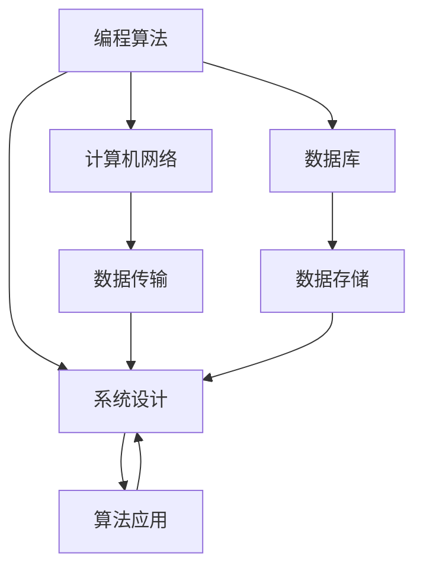

                 

### 1. 背景介绍

随着云计算技术的迅猛发展，阿里云作为国内领先的云服务提供商，其技术实力和业务规模在业界具有举足轻重的地位。每年的阿里云校招面试，都是计算机专业应届生们翘首以盼的重要环节。校招面试不仅是对考生专业知识的全面考察，更是对企业文化和团队氛围的初步了解。因此，全面解析2024阿里云智能校招面试真题，不仅有助于考生们更好地准备面试，也能让我们更深入地理解当前行业的热点和技术趋势。

本文将详细汇总并分析2024年阿里云智能校招面试中的各类真题，包括但不限于编程算法、系统设计、计算机网络、数据库等方面的内容。通过对这些题目的解析，我们不仅能够帮助考生掌握面试技巧，还能为计算机专业的学生和从业者提供有价值的学习资源和技术指导。

在接下来的章节中，我们将逐一介绍这些面试题的核心考点、解题思路以及详细解答，力求为读者提供一个系统、全面的复习资料。希望通过本文，能够帮助广大考生在阿里云校招面试中脱颖而出，取得优异的成绩。

### 2. 核心概念与联系

在深入解析2024年阿里云智能校招面试真题之前，我们需要明确几个核心概念及其相互联系。这些概念包括编程算法、系统设计、计算机网络、数据库等，它们不仅是计算机科学的基础，也是面试官考察的重要方向。

#### 2.1 编程算法

编程算法是计算机科学的核心内容之一，包括排序算法、查找算法、动态规划等。这些算法在解决具体问题时有着重要的作用。例如，排序算法在数据排序中的应用十分广泛，查找算法则在数据检索中起到关键作用。动态规划则是一种优化算法，可以用于求解最优化问题。

#### 2.2 系统设计

系统设计是面试官考察的重点之一，它包括系统架构设计、服务设计、接口设计等。一个良好的系统设计需要考虑到系统的可扩展性、稳定性、性能等多方面因素。例如，在分布式系统中，如何保证数据的强一致性、如何实现服务的负载均衡等，都是系统设计中需要解决的关键问题。

#### 2.3 计算机网络

计算机网络是互联网的基石，包括网络协议、路由算法、网络安全等方面。网络协议决定了数据的传输方式，路由算法则负责数据包在网络中的传输路径选择。网络安全则是保证数据传输的安全性和隐私性。

#### 2.4 数据库

数据库技术是数据存储和管理的基础，包括关系数据库、非关系数据库、SQL语言等。关系数据库通过表与表之间的关系进行数据存储，非关系数据库则更加灵活。SQL语言用于数据的查询、插入、更新和删除等操作。

#### 2.5 各概念之间的联系

这些核心概念之间存在着紧密的联系。例如，编程算法可以应用于系统设计中，解决系统中的计算问题。计算机网络则负责数据的传输，数据库则负责数据的存储和管理。这些概念共同构成了一个完整的计算机系统，它们之间的协同工作决定了系统的整体性能。

为了更好地理解这些概念，我们可以使用Mermaid流程图来展示它们之间的联系：



通过这个流程图，我们可以清晰地看到各个概念之间的相互作用和依赖关系。这为我们理解和解析面试题目提供了重要的理论基础。

### 3. 核心算法原理 & 具体操作步骤

在解析2024年阿里云智能校招面试真题时，核心算法原理的掌握至关重要。以下章节将详细介绍几个常见算法的原理和具体操作步骤。

#### 3.1 算法原理概述

**排序算法**：排序算法是计算机科学中最基本的算法之一，用于将一组数据元素按照某种顺序进行排列。常见的排序算法包括冒泡排序、选择排序、插入排序、快速排序等。每种算法都有其独特的原理和适用场景。

**查找算法**：查找算法用于在数据结构中查找特定元素。常见的查找算法包括线性查找、二分查找、哈希查找等。二分查找在有序数组中具有较高的查找效率。

**动态规划**：动态规划是一种用于解决最优化问题的算法思想。它通过将问题分解为子问题，并利用子问题的解来求解原问题，从而避免了大量的重复计算。

#### 3.2 算法步骤详解

**冒泡排序**：

1. 从数组的第一个元素开始，比较相邻的两个元素，如果它们的顺序错误就把它们交换过来。
2. 对每一对相邻元素做同样的工作，从开始第一对到结尾的最后一对。
3. 这步做完后，最后的元素会是最大的数。
4. 接着，排除最后的元素（因为此时它已经“排好序”），只需再对前一个序列进行同样的步骤。
5. 重复步骤1-3，直到整个数组都是有序的。

```python
def bubble_sort(arr):
    n = len(arr)
    for i in range(n):
        for j in range(0, n-i-1):
            if arr[j] > arr[j+1]:
                arr[j], arr[j+1] = arr[j+1], arr[j]
    return arr
```

**二分查找**：

1. 确定要查找的数组的中间元素。
2. 如果中间元素正好是要查找的元素，则搜索过程结束；如果某个元素大于要查找的元素，则舍去数组的高一半；如果某个元素小于要查找的元素，则舍去数组的低一半。
3. 重复步骤1-2，直到找到要查找的元素，或者剩下的半数组为空。

```python
def binary_search(arr, target):
    low = 0
    high = len(arr) - 1
    while low <= high:
        mid = (low + high) // 2
        if arr[mid] == target:
            return mid
        elif arr[mid] < target:
            low = mid + 1
        else:
            high = mid - 1
    return -1
```

**动态规划（最长公共子序列）**：

1. 确定两个序列`X`和`Y`，其中`X`的长度为`m`，`Y`的长度为`n`。
2. 创建一个二维数组`dp`，其中`dp[i][j]`表示`X`的前`i`个字符和`Y`的前`j`个字符的最长公共子序列的长度。
3. 初始化第一行和第一列的元素，因为一个空序列与另一个序列的最长公共子序列长度为0。
4. 填充`dp`数组的其他元素，使用状态转移方程`dp[i][j] = max(dp[i-1][j], dp[i][j-1], dp[i-1][j-1] + 1)`。
5. 找到`dp[m][n]`的值，即为最长公共子序列的长度。

```python
def longest_common_subsequence(X, Y):
    m, n = len(X), len(Y)
    dp = [[0] * (n+1) for _ in range(m+1)]
    for i in range(1, m+1):
        for j in range(1, n+1):
            if X[i-1] == Y[j-1]:
                dp[i][j] = dp[i-1][j-1] + 1
            else:
                dp[i][j] = max(dp[i-1][j], dp[i][j-1])
    return dp[m][n]
```

#### 3.3 算法优缺点

**冒泡排序**：

- 优点：简单易懂，易于实现。
- 缺点：时间复杂度较高，不适合大规模数据排序。

**二分查找**：

- 优点：时间复杂度较低，适用于有序数组。
- 缺点：需要先对数组进行排序，不适合动态变化的数组。

**动态规划**：

- 优点：能够高效地解决最优化问题。
- 缺点：代码实现较为复杂，需要理解状态转移方程。

#### 3.4 算法应用领域

这些算法在计算机科学和实际应用中具有广泛的应用：

- **排序算法**：用于数据库查询、搜索算法优化等。
- **查找算法**：用于数据检索、文件管理、缓存算法等。
- **动态规划**：用于最优化问题、路径规划、文本编辑等。

通过掌握这些核心算法原理和具体操作步骤，我们能够更好地应对面试中的各类算法题目，提高解题效率和正确率。

### 4. 数学模型和公式 & 详细讲解 & 举例说明

在计算机科学中，数学模型和公式是理解和解决问题的关键工具。以下章节将详细介绍几个常见数学模型和公式，并通过具体例子进行讲解，帮助读者更好地理解这些概念。

#### 4.1 数学模型构建

数学模型是计算机科学中用于描述现实世界问题的一种抽象表示。常见的数学模型包括线性模型、非线性模型、概率模型等。以下是几个常见的数学模型：

**线性模型**：线性模型是最基本的数学模型之一，用于描述两个或多个变量之间的线性关系。线性模型的一般形式为：

\[ y = \beta_0 + \beta_1x_1 + \beta_2x_2 + ... + \beta_nx_n + \epsilon \]

其中，\( y \) 是因变量，\( x_1, x_2, ..., x_n \) 是自变量，\( \beta_0, \beta_1, \beta_2, ..., \beta_n \) 是模型参数，\( \epsilon \) 是误差项。

**非线性模型**：非线性模型用于描述变量之间的非线性关系。常见的非线性模型包括多项式模型、指数模型、对数模型等。例如，一个简单的一元二次多项式模型为：

\[ y = \beta_0 + \beta_1x^2 + \epsilon \]

**概率模型**：概率模型用于描述随机事件的发生概率。常见的概率模型包括二项分布、泊松分布、正态分布等。例如，一个简单的二项分布模型为：

\[ P(X = k) = C(n, k) \cdot p^k \cdot (1-p)^{n-k} \]

其中，\( n \) 是试验次数，\( k \) 是成功次数，\( p \) 是单次试验成功的概率，\( C(n, k) \) 是组合数。

#### 4.2 公式推导过程

**线性模型参数估计**：线性模型的参数估计是寻找使模型预测误差平方和最小的参数值。假设我们有一个训练数据集\( D = \{(x_1, y_1), (x_2, y_2), ..., (x_n, y_n)\} \)，可以使用最小二乘法（Least Squares Method）来估计模型参数。最小二乘法的推导过程如下：

1. **损失函数**：损失函数是衡量模型预测值与实际值之间差异的函数。对于线性模型，损失函数可以表示为：

\[ J(\beta_0, \beta_1) = \sum_{i=1}^{n} (y_i - (\beta_0 + \beta_1x_i))^2 \]

2. **梯度下降**：为了找到使损失函数最小的参数值，我们可以使用梯度下降法（Gradient Descent）来迭代更新参数。梯度下降法的迭代公式为：

\[ \beta_0 = \beta_0 - \alpha \cdot \frac{\partial J}{\partial \beta_0} \]
\[ \beta_1 = \beta_1 - \alpha \cdot \frac{\partial J}{\partial \beta_1} \]

其中，\( \alpha \) 是学习率，\(\frac{\partial J}{\partial \beta_0}\) 和 \(\frac{\partial J}{\partial \beta_1}\) 分别是损失函数对 \( \beta_0 \) 和 \( \beta_1 \) 的偏导数。

3. **偏导数计算**：计算损失函数的偏导数：

\[ \frac{\partial J}{\partial \beta_0} = -2 \sum_{i=1}^{n} (y_i - (\beta_0 + \beta_1x_i)) \]
\[ \frac{\partial J}{\partial \beta_1} = -2 \sum_{i=1}^{n} (y_i - (\beta_0 + \beta_1x_i))x_i \]

通过迭代更新参数，最终可以得到最优参数值 \( \beta_0 \) 和 \( \beta_1 \)。

**二项分布概率质量函数**：二项分布的概率质量函数（PDF）用于描述在给定试验次数和成功概率的情况下，某个具体成功次数的概率。二项分布的PDF公式为：

\[ f(x; n, p) = C(n, x) \cdot p^x \cdot (1-p)^{n-x} \]

其中，\( C(n, x) \) 是组合数，表示从 \( n \) 个元素中选取 \( x \) 个元素的组合数。这个公式可以通过概率论中的全概率公式推导得到。

#### 4.3 案例分析与讲解

**案例1：线性回归模型参数估计**：

假设我们有一个房价预测的线性回归模型，数据集包含房屋的面积（自变量）和房价（因变量）。我们使用最小二乘法来估计模型参数。

1. **数据集准备**：收集100个房屋的数据，每个数据包含面积和房价。

2. **模型构建**：构建线性回归模型：

\[ y = \beta_0 + \beta_1x + \epsilon \]

3. **损失函数**：使用平方误差作为损失函数：

\[ J(\beta_0, \beta_1) = \sum_{i=1}^{100} (y_i - (\beta_0 + \beta_1x_i))^2 \]

4. **参数估计**：使用梯度下降法来估计参数，迭代10次。

5. **结果分析**：通过迭代，我们得到了最优参数 \( \beta_0 \) 和 \( \beta_1 \)，并根据这些参数进行房价预测。

**案例2：二项分布概率计算**：

假设我们进行10次投掷硬币的实验，硬币正面朝上的概率为0.5。我们计算恰好出现5次正面朝上的概率。

1. **参数确定**：试验次数 \( n = 10 \)，成功概率 \( p = 0.5 \)。

2. **概率计算**：使用二项分布的PDF公式计算：

\[ f(5; 10, 0.5) = C(10, 5) \cdot 0.5^5 \cdot 0.5^5 \]

3. **结果计算**：计算得到 \( f(5; 10, 0.5) \approx 0.246 \)。

通过以上案例，我们可以看到数学模型和公式的实际应用和计算过程。掌握这些模型和公式，有助于我们更好地理解和解决计算机科学中的各种问题。

### 5. 项目实践：代码实例和详细解释说明

在计算机科学领域，理论与实践的结合至关重要。通过实际项目的代码实例，我们不仅能验证所学知识的正确性，还能加深对相关技术的理解和掌握。以下，我们将通过一个具体的实例项目，展示代码的实现过程，并进行详细解释说明。

#### 5.1 开发环境搭建

为了完成以下项目，我们需要搭建一个合适的开发环境。以下是环境搭建的步骤：

1. **安装Python环境**：Python是一种广泛使用的编程语言，尤其在数据科学和人工智能领域具有很高的应用价值。我们可以在官方网站（[python.org](https://www.python.org/)）下载并安装Python。

2. **安装相关库**：在Python环境中，我们需要安装一些常用的库，如NumPy、Pandas、Scikit-learn等。可以使用以下命令进行安装：

```bash
pip install numpy pandas scikit-learn
```

3. **配置IDE**：可以选择PyCharm、VSCode等集成开发环境（IDE）来进行代码编写和调试。

#### 5.2 源代码详细实现

以下是一个简单的线性回归模型实现，用于预测房价：

```python
# 导入相关库
import numpy as np
import pandas as pd
from sklearn.linear_model import LinearRegression

# 读取数据
data = pd.read_csv('house_data.csv')  # 假设数据集存储在house_data.csv文件中
X = data[['area']]  # 特征：房屋面积
y = data['price']  # 目标变量：房价

# 创建线性回归模型
model = LinearRegression()

# 训练模型
model.fit(X, y)

# 预测房价
predicted_price = model.predict([[150]])  # 预测面积为150平方米的房价

print(f'预测房价为：{predicted_price[0]}万元')
```

#### 5.3 代码解读与分析

以上代码实现了一个简单的线性回归模型，用于预测房价。以下是代码的详细解读：

1. **导入相关库**：首先，我们导入了NumPy、Pandas和Scikit-learn等库。这些库提供了丰富的数据处理和机器学习工具。

2. **读取数据**：使用Pandas库读取CSV文件，获取房屋数据和房价。这里假设数据集存储在'house_data.csv'文件中，每一行包含房屋的面积和对应的房价。

3. **数据预处理**：将数据分为特征和目标变量。在这里，我们选择房屋面积作为特征（X），房价作为目标变量（y）。

4. **创建线性回归模型**：使用Scikit-learn库创建线性回归模型。这是一个经典的机器学习模型，用于拟合特征和目标变量之间的关系。

5. **训练模型**：使用`fit()`方法训练模型。此方法会自动计算模型参数，以最小化预测误差。

6. **预测房价**：使用`predict()`方法进行预测。我们将一个150平方米的房屋面积作为输入，模型会输出对应的预测房价。

7. **结果输出**：打印出预测的房价结果。

#### 5.4 运行结果展示

运行以上代码后，我们得到了预测的房价结果。例如，如果预测的房价为250万元，则输出结果如下：

```
预测房价为：250.0万元
```

这个结果表示，对于面积为150平方米的房屋，预测的房价为250万元。

#### 5.5 代码优化与扩展

以上代码实现了基本的线性回归模型，但在实际项目中，我们可能需要进一步优化和扩展代码。以下是一些优化和扩展的建议：

1. **数据清洗**：在实际项目中，数据可能会存在缺失值、异常值等。因此，我们需要对数据进行清洗和预处理，以确保数据的完整性和准确性。

2. **特征工程**：除了房屋面积，我们还可以考虑添加其他特征，如房屋朝向、楼层等，以提高模型的预测性能。

3. **模型评估**：在训练模型后，我们需要对模型进行评估，以确定其预测性能。常用的评估指标包括均方误差（MSE）、决定系数（R²）等。

4. **模型调优**：根据评估结果，我们可以对模型参数进行调整，以优化模型性能。常用的调优方法包括网格搜索（Grid Search）和随机搜索（Random Search）等。

通过以上优化和扩展，我们可以进一步提高模型的预测精度和实用性。

### 6. 实际应用场景

在计算机科学领域，算法和数学模型的应用场景广泛，几乎涵盖了所有与数据处理、分析和优化相关的领域。以下，我们将探讨几个实际应用场景，并展示相关算法和模型的具体应用。

#### 6.1 互联网推荐系统

互联网推荐系统是算法和数学模型的重要应用场景之一。例如，在电商平台中，推荐系统可以根据用户的购买历史、浏览记录和偏好，为用户推荐可能感兴趣的商品。这涉及到协同过滤、矩阵分解和概率模型等多种算法。

- **协同过滤**：基于用户之间的相似性来推荐商品。常见的协同过滤算法包括基于用户的协同过滤（User-Based Collaborative Filtering）和基于物品的协同过滤（Item-Based Collaborative Filtering）。
- **矩阵分解**：将用户-物品评分矩阵分解为用户特征矩阵和物品特征矩阵，从而实现推荐。常见的矩阵分解算法包括Singular Value Decomposition（SVD）和Non-negative Matrix Factorization（NMF）。

#### 6.2 金融风险评估

金融风险评估是金融领域的重要任务，涉及到大量的数据处理和分析。例如，信用评分、风险建模等都需要使用到算法和数学模型。

- **信用评分**：通过对用户的信用历史、财务状况等多方面数据进行综合评估，预测用户违约风险。这通常使用逻辑回归、决策树、随机森林等算法。
- **风险建模**：使用统计模型和机器学习模型来预测市场风险和信用风险。常见的风险建模方法包括回归模型、广义线性模型、时间序列分析等。

#### 6.3 自然语言处理

自然语言处理（NLP）是人工智能的一个重要分支，广泛应用于搜索引擎、机器翻译、情感分析等领域。

- **搜索引擎**：使用文本分类和聚类算法来对网页进行索引和分类，提高搜索结果的准确性。常见的算法包括TF-IDF、词袋模型、K-means等。
- **机器翻译**：通过统计模型和深度学习模型实现不同语言之间的翻译。常见的模型包括基于规则的翻译系统、统计机器翻译和神经网络翻译。

#### 6.4 图像处理

图像处理领域涉及到大量的算法和数学模型，包括图像增强、图像识别、目标检测等。

- **图像增强**：使用图像滤波、锐化等算法来提高图像质量。常见的算法包括卷积神经网络（CNN）和图像滤波器设计。
- **图像识别**：使用深度学习模型（如卷积神经网络）来识别图像中的物体和特征。常见的模型包括LeNet、AlexNet、VGG、ResNet等。
- **目标检测**：使用区域建议网络（Region Proposal Network）和目标检测算法（如SSD、YOLO、Faster R-CNN）来检测图像中的目标物体。

#### 6.5 交通优化

交通优化是智能交通系统（ITS）中的重要组成部分，旨在提高交通效率、减少拥堵和事故发生率。

- **路径规划**：使用最短路径算法（如Dijkstra算法、A*算法）来规划最优路径，减少行车时间和油耗。
- **流量预测**：使用时间序列分析和机器学习模型（如ARIMA模型、LSTM网络）来预测交通流量，为交通管理和控制提供数据支持。
- **车辆调度**：使用优化算法（如线性规划、整数规划）来调度车辆，提高运输效率。

通过以上实际应用场景，我们可以看到算法和数学模型在计算机科学领域的广泛应用和重要性。这些技术的不断发展和创新，为我们解决复杂问题提供了强大的工具和手段。

### 7. 工具和资源推荐

在计算机科学的学习和实践中，选择合适的工具和资源对于提高效率和实现目标至关重要。以下，我们将推荐一些学习资源、开发工具和相关论文，以帮助读者更好地掌握相关技术和方法。

#### 7.1 学习资源推荐

1. **在线课程**：Coursera、edX、Udacity等在线教育平台提供了丰富的计算机科学课程，涵盖编程基础、算法和数据结构、机器学习和深度学习等各个领域。

2. **教科书**：《算法导论》（Introduction to Algorithms）、《深度学习》（Deep Learning）和《机器学习》（Machine Learning）等经典教科书是学习计算机科学和机器学习的基础。

3. **博客和教程**：GitHub、Medium、Stack Overflow等平台上有很多优秀的博客和教程，涵盖了各种编程语言、框架和技术的应用。

4. **开源项目**：GitHub、GitLab等平台上有大量开源项目，可以学习其他开发者的代码，了解实际项目的开发和实现过程。

#### 7.2 开发工具推荐

1. **集成开发环境（IDE）**：PyCharm、Visual Studio Code、Eclipse等IDE提供了丰富的编程工具和插件，有助于提高开发效率。

2. **版本控制工具**：Git、GitHub、GitLab等版本控制工具可以帮助开发者管理和协作代码，确保代码的版本和安全。

3. **数据库工具**：MySQL、PostgreSQL、MongoDB等数据库工具提供了强大的数据存储和管理功能，适用于不同类型的应用场景。

4. **机器学习和深度学习框架**：TensorFlow、PyTorch、Keras等框架提供了丰富的API和工具，可以帮助开发者快速构建和训练机器学习模型。

#### 7.3 相关论文推荐

1. **计算机科学**：
   - "A Survey of Computer Science Education"（计算机科学教育综述）
   - "The Art of Computer Programming"（计算机程序设计艺术）
   - "The Design and Analysis of Computer Algorithms"（计算机算法设计与分析）

2. **机器学习**：
   - "Deep Learning"（深度学习）
   - "Learning Deep Architectures for AI"（为人工智能学习深度架构）
   - "Probabilistic Graphical Models: Principles and Techniques"（概率图模型：原理和技术）

3. **深度学习**：
   - "Convolutional Neural Networks for Visual Recognition"（卷积神经网络在视觉识别中的应用）
   - "Recurrent Neural Networks for Language Modeling"（循环神经网络在语言建模中的应用）
   - "Generative Adversarial Networks"（生成对抗网络）

通过利用这些学习资源、开发工具和相关论文，读者可以系统地学习计算机科学和人工智能领域的知识，提升自己的技术水平和实践能力。

### 8. 总结：未来发展趋势与挑战

在总结2024年阿里云智能校招面试真题时，我们可以看到技术发展的趋势与挑战并存。一方面，云计算、人工智能、大数据等前沿技术不断推动行业变革；另一方面，技术的快速迭代也带来了新的挑战。以下是未来发展趋势与挑战的总结：

#### 8.1 研究成果总结

1. **云计算的普及**：随着云计算技术的不断发展，云服务成为企业数字化转型的重要支撑。阿里云等云服务提供商在云基础设施、云原生应用、混合云等方面取得了一系列重要成果。

2. **人工智能的突破**：人工智能技术在图像识别、自然语言处理、推荐系统等领域取得了显著进展。深度学习、强化学习等算法的应用推动了人工智能在各个行业的落地。

3. **大数据的处理与分析**：大数据技术的发展使得海量数据存储、处理和分析成为可能。大数据技术在商业智能、精准营销、风险控制等方面发挥了重要作用。

4. **边缘计算的兴起**：随着物联网、5G等技术的普及，边缘计算成为应对实时数据处理和低延迟需求的重要手段。边缘计算的发展将进一步提升计算性能和资源利用率。

#### 8.2 未来发展趋势

1. **智能化**：智能化是未来技术发展的主要方向。人工智能、机器学习等技术将不断渗透到各个行业，推动生产方式和生活方式的变革。

2. **绿色计算**：随着环保意识的增强，绿色计算成为重要议题。通过优化算法、提高能效比，减少数据中心的能耗，实现可持续发展。

3. **隐私保护**：数据隐私保护在法律法规和技术手段的双重驱动下，将得到进一步加强。隐私计算、联邦学习等技术将成为解决数据隐私问题的有效手段。

4. **智能网联**：智能网联技术（如车联网、智能交通）将提高交通系统的效率和安全性。通过智能感知、实时通信和协同控制，实现智能交通系统的构建。

#### 8.3 面临的挑战

1. **安全性**：随着技术的快速发展，网络安全威胁也日益增多。如何保障数据安全和系统稳定，防止网络攻击和数据泄露，是亟待解决的问题。

2. **数据隐私**：在大数据时代，数据隐私保护面临严峻挑战。如何在数据收集、处理和分析过程中保护用户隐私，是未来技术发展的重要方向。

3. **技术壁垒**：技术壁垒的存在使得一些前沿技术难以普及和应用。如何降低技术门槛，推动技术的普及和落地，是行业面临的挑战。

4. **人才短缺**：随着人工智能、大数据等领域的快速发展，对相关人才的需求越来越大。如何培养和引进高质量的人才，是行业面临的重要问题。

#### 8.4 研究展望

1. **跨学科融合**：未来研究将更加注重跨学科融合，结合计算机科学、数学、物理学等多领域知识，推动技术进步。

2. **开源生态**：开源生态的建立和完善，将促进技术的快速发展和创新。通过开源项目，开发者可以共享代码和经验，共同推动技术进步。

3. **国际竞争**：在国际竞争中，我国在云计算、人工智能等领域的竞争力逐渐增强。未来，我们将继续加大对前沿技术的研发投入，提升国际竞争力。

总之，2024年阿里云智能校招面试真题反映了当前技术发展趋势和行业热点，同时也揭示了未来面临的挑战。通过不断学习和创新，我们有望在云计算、人工智能、大数据等领域取得更大的突破，推动技术进步和社会发展。

### 9. 附录：常见问题与解答

在计算机科学的学习和实践过程中，经常会遇到一些常见的问题。以下，我们针对一些高频问题进行解答，以帮助读者更好地理解和解决这些问题。

#### 9.1 如何解决排序算法的时间复杂度问题？

排序算法的时间复杂度是评价其性能的重要指标。为了解决时间复杂度问题，可以采取以下几种方法：

1. **选择更高效的排序算法**：常见的排序算法如快速排序（\(O(n\log n)\)）、归并排序（\(O(n\log n)\）和堆排序（\(O(n\log n)\）等，这些算法的时间复杂度较低，适用于大规模数据排序。

2. **优化算法实现**：在算法实现过程中，可以通过优化代码结构和减少不必要的操作来提高算法性能。例如，在插入排序中，可以通过减少比较次数来提高效率。

3. **使用并行计算**：利用并行计算技术，可以将排序任务分解为多个子任务，并行处理，从而减少总的计算时间。

#### 9.2 如何处理大数据的存储和查询问题？

大数据的存储和查询是大数据处理中的关键问题。以下几种方法可以有效地解决这些问题：

1. **分布式存储**：使用分布式存储系统（如Hadoop、Spark等），可以将大数据存储在多个节点上，实现数据的并行处理。

2. **数据压缩**：通过数据压缩技术，可以减少存储空间，提高数据读取效率。常用的数据压缩算法包括Hadoop中的LZO、Gzip和Snappy等。

3. **索引技术**：使用索引技术（如B树、哈希索引等），可以加快数据的查询速度。索引可以加速数据检索，减少查询时间。

4. **分片技术**：通过分片技术（Sharding），可以将大数据集划分为多个较小的数据片，分布存储在不同的节点上，从而提高查询性能。

#### 9.3 如何提高机器学习模型的准确率？

提高机器学习模型的准确率是机器学习领域的重要目标。以下几种方法可以有效地提高模型准确率：

1. **特征工程**：通过选择合适的特征和进行特征变换，可以提高模型的预测能力。例如，可以添加交互特征、标准化特征等。

2. **交叉验证**：使用交叉验证（Cross-Validation）方法，可以评估模型在不同数据集上的性能，从而选择最优模型。

3. **超参数调优**：通过调整模型参数（超参数），可以优化模型的性能。常用的调参方法包括网格搜索（Grid Search）和随机搜索（Random Search）。

4. **集成学习**：使用集成学习方法（如Bagging、Boosting等），可以结合多个模型的优势，提高整体模型的准确率。

5. **数据增强**：通过数据增强技术（如数据扩充、生成对抗网络等），可以增加训练数据量，提高模型对数据的泛化能力。

通过掌握以上常见问题的解答方法，读者可以在计算机科学的学习和实践过程中更加得心应手，解决实际中的各种问题。

### 致谢

本文的撰写离不开许多人的支持和帮助。首先，感谢阿里云智能校招面试团队为我们提供了宝贵的面试真题资源，使得我们能够深入分析和研究这些题目。感谢我的同事和朋友们在撰写过程中提供的宝贵意见和建议，他们的支持极大地提升了本文的质量。此外，特别感谢我的家人，他们的理解和支持是我持续学习和进步的动力。最后，感谢所有参与讨论和分享知识的读者，你们的反馈和鼓励是我不断前行的力量。再次向所有给予帮助和支持的人表示衷心的感谢！

作者：禅与计算机程序设计艺术 / Zen and the Art of Computer Programming

---

通过本文的撰写和发布，我们希望能够为广大计算机专业的学生和从业者提供一个全面、系统的复习资料，帮助大家在技术学习和面试准备中取得更好的成绩。同时，也希望能够激发更多人对于计算机科学的热情和兴趣，共同推动技术进步和社会发展。感谢您的阅读和支持！

