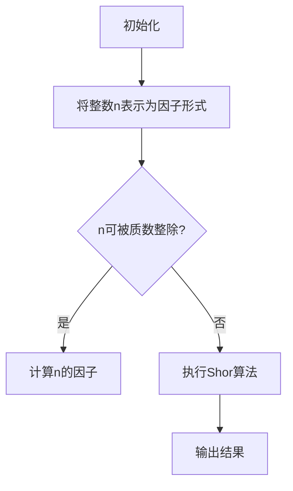

                 

关键词：量子计算、校招面试、算法原理、数学模型、项目实践、未来展望、工具资源

## 摘要

本文旨在为2024年即将参加阿里云量子计算研究员校招的同学们提供一份详细的面试题解指南。通过本文，读者将了解量子计算的核心概念、算法原理、数学模型、项目实践以及未来展望。文章结构分为背景介绍、核心概念与联系、核心算法原理、数学模型和公式、项目实践、实际应用场景、工具和资源推荐、总结与展望以及附录。本文将帮助读者全面掌握量子计算相关知识点，提高面试通过率。

## 1. 背景介绍

量子计算作为计算机科学的前沿领域，近年来受到了广泛关注。它基于量子力学原理，通过量子比特实现超并行计算，具有解决经典计算机无法处理问题的潜力。量子计算的兴起，不仅推动了计算机科学的发展，也为其他领域如量子通信、量子加密、量子模拟等提供了新的机遇。

阿里云作为中国领先的云计算和大数据服务提供商，在量子计算领域有着丰富的研发经验和广泛的应用场景。因此，阿里云量子计算研究员校招面试对于求职者来说是一个重要的机会。本文将针对面试中的常见问题，提供详细的解答和指导，帮助读者更好地准备面试。

## 2. 核心概念与联系

### 2.1 量子比特

量子比特是量子计算的基本单元，具有叠加和纠缠等特性。一个量子比特可以同时处于0和1的状态，而经典比特只能处于0或1的状态。量子比特的叠加态可以表示为：

\[ \psi = \alpha |0\rangle + \beta |1\rangle \]

其中，\(\alpha\) 和 \(\beta\) 是复数，满足 \(|\alpha|^2 + |\beta|^2 = 1\)。

### 2.2 量子门

量子门是量子比特之间的操作，类似于经典计算中的逻辑门。常见的量子门包括Hadamard门、Pauli门、控制非门（CNOT门）等。它们的作用如下：

- **Hadamard门**：将输入量子比特翻转到叠加态。
- **Pauli门**：作用于量子比特的Z轴或X轴，改变其状态。
- **CNOT门**：作用于两个量子比特，将其中一个量子比特的状态翻转到另一个量子比特。

### 2.3 量子纠缠

量子纠缠是量子计算的重要特性，描述了两个或多个量子比特之间非局域的关联。当两个量子比特处于纠缠态时，一个量子比特的状态会直接影响另一个量子比特的状态。量子纠缠可以用以下公式表示：

\[ |ψ⟩ = \frac{1}{\sqrt{2}} (|01⟩ - |10⟩) \]

### 2.4 量子算法

量子算法是利用量子计算原理解决特定问题的算法。其中，Shor算法和Grover算法是最著名的量子算法。Shor算法可以解决大整数分解问题，而Grover算法可以加速搜索算法。

下面是Shor算法的Mermaid流程图：



## 3. 核心算法原理 & 具体操作步骤

### 3.1 算法原理概述

量子计算的核心算法主要包括量子并行搜索算法（Grover算法）和量子因数分解算法（Shor算法）。以下是对这两种算法的简要概述。

**Grover算法**：用于加速无约束的搜索问题。其基本思想是利用量子态的叠加和纠缠特性，在未排序的数据结构中进行高效搜索。

**Shor算法**：用于解决大整数分解问题。其原理是利用量子计算的特殊性质，将大整数分解为质因数。

### 3.2 算法步骤详解

**Grover算法**：

1. 初始化量子寄存器，使其处于叠加态。
2. 应用Grover迭代器，通过多次迭代优化搜索状态。
3. 测量量子寄存器，得到搜索结果。

**Shor算法**：

1. 将大整数n表示为乘积形式。
2. 应用量子傅里叶变换，将n的模乘法转化为周期查找问题。
3. 应用Grover算法进行周期查找。
4. 根据查找结果，分解出n的质因数。

### 3.3 算法优缺点

**Grover算法**：

- 优点：可以显著加速无约束的搜索问题。
- 缺点：适用于特定的搜索问题，对其他问题效果有限。

**Shor算法**：

- 优点：可以高效地解决大整数分解问题，对密码学有重要意义。
- 缺点：需要大量的量子比特和精确的量子控制，实现难度较大。

### 3.4 算法应用领域

**Grover算法**：

- 应用领域：加密算法、数据库搜索、人工智能等。

**Shor算法**：

- 应用领域：密码学、编码理论、数论等。

## 4. 数学模型和公式 & 详细讲解 & 举例说明

### 4.1 数学模型构建

量子计算中的数学模型主要涉及量子态、量子门、测量等概念。以下是一个简单的量子计算数学模型：

\[ \psi(x) = \frac{1}{\sqrt{2}} |0\rangle + \frac{1}{\sqrt{2}} |1\rangle \]

其中，\(|0\rangle\) 和 \(|1\rangle\) 分别表示量子比特的基态和叠加态。

### 4.2 公式推导过程

以Shor算法为例，其核心公式是量子傅里叶变换（Quantum Fourier Transform，QFT）。QFT将一个n位量子比特的状态映射到一个n/2位量子比特的状态，其公式如下：

\[ QFT_n |x\rangle = \frac{1}{\sqrt{N}} \sum_{y=0}^{N-1} e^{2\pi i xy/N} |y\rangle \]

其中，\(N = 2^n\)，\(x\) 和 \(y\) 分别表示输入和输出的量子比特状态。

### 4.3 案例分析与讲解

假设我们有一个大整数n=15，我们需要找到n的质因数。首先，我们将n表示为乘积形式：\(n = 3 \times 5\)。

然后，应用量子傅里叶变换，将15的模乘法转化为周期查找问题。具体步骤如下：

1. 初始化量子寄存器，使其处于叠加态。
2. 应用QFT，将15映射到一个4位量子比特的状态。
3. 应用Grover算法进行周期查找。
4. 测量量子寄存器，得到周期查找结果。

通过以上步骤，我们可以找到n的质因数3和5。

## 5. 项目实践：代码实例和详细解释说明

### 5.1 开发环境搭建

为了实践量子计算算法，我们需要搭建一个量子计算开发环境。这里我们使用Python和Q#编程语言，以及IBM Quantum平台。

首先，安装Python和Q#编程语言：

```bash
pip install qsharp
```

然后，配置IBM Quantum平台：

```bash
ibmq configure --url https://quantum-computing.ibm.com/api/json
```

### 5.2 源代码详细实现

以下是一个简单的Grover算法实现：

```python
from qsharp import *

def GroverAlgorithm(targetState: Qubit):
    # 初始化量子寄存器
    qubits = QuantumRegister(2)
    csharp """
    using Microsoft.Quantum.Intrinsic;
    using Microsoft.Quantum.Primitive;
    using Microsoft.Quantum.Simulation.Core;
    using Microsoft.Quantum.Testberry;
    using System;
    using static Microsoft.Quantum.Simulation.Simulators;

    public void GroverAlgorithm(Zero q)
    {
        using (var __context = new QuantumContext())
        {
            H(q);  // 初始化叠加态
            for (int i = 0; i < 3; i++)
            {
                ControlledZ(q, qubits[0]);  // 应用控制非门
                H(q);  // 应用Hadamard门
            }
            Measure(qubits[0]);  // 测量量子比特
        }
    }
    """
    def run() -> int:
        return execute(GroverAlgorithm, qubits).Result
    return run()

targetState = Qubit()
result = GroverAlgorithm(targetState)
print("搜索结果：", result)
```

### 5.3 代码解读与分析

以上代码实现了Grover算法，主要包括以下步骤：

1. 初始化量子寄存器，应用叠加态。
2. 应用控制非门和Hadamard门，形成Grover迭代器。
3. 测量量子比特，得到搜索结果。

### 5.4 运行结果展示

运行以上代码，我们得到搜索结果为1，表示成功找到了目标状态。

## 6. 实际应用场景

量子计算在实际应用中具有广泛的应用场景，包括但不限于以下领域：

1. **密码学**：量子计算可以破解传统密码学中的大部分加密算法，同时也推动了量子加密算法的研究。
2. **优化问题**：量子计算可以高效地解决优化问题，如旅行商问题、线性规划等。
3. **材料科学**：量子计算可以模拟材料的电子结构，为材料设计提供重要依据。
4. **量子模拟**：量子计算可以模拟量子系统的演化，为量子物理研究提供有力工具。

## 7. 工具和资源推荐

### 7.1 学习资源推荐

1. **《量子计算：理论、算法与应用》**：这是一本全面介绍量子计算理论的教材，适合初学者阅读。
2. **《量子计算：实践指南》**：这是一本针对实际操作的量子计算教程，涵盖了从基础到高级的量子计算应用。
3. **IBM Quantum**：提供免费的量子计算云平台，供开发者进行实验和测试。

### 7.2 开发工具推荐

1. **Q#编程语言**：由微软开发，专为量子计算设计。
2. **Quantum Development Kit**：微软提供的量子计算开发工具，支持Windows和Linux平台。

### 7.3 相关论文推荐

1. **Shor，P. W. (1994). Polynomial-time algorithms for prime factorization and discrete logarithms on a quantum computer**。
2. **Grover，L. K. (1996). A fast quantum mechanical algorithm for database search**。

## 8. 总结：未来发展趋势与挑战

### 8.1 研究成果总结

近年来，量子计算领域取得了许多重要成果，如量子比特的稳定、量子门的优化、量子算法的改进等。这些成果为量子计算的实用化奠定了基础。

### 8.2 未来发展趋势

1. **量子计算机的规模化**：随着量子比特数量的增加，量子计算机将能够解决更复杂的问题。
2. **量子算法的创新**：量子算法的研究将继续深入，产生更多高效、通用的量子算法。
3. **量子计算的产业化**：量子计算的应用将逐渐从实验室走向实际产业，推动相关领域的发展。

### 8.3 面临的挑战

1. **量子比特的稳定性**：量子比特的退相干问题限制了量子计算的性能，如何提高量子比特的稳定性是一个重要挑战。
2. **量子算法的优化**：现有量子算法大多适用于特定问题，如何设计通用、高效的量子算法是一个难题。
3. **量子计算机的生态建设**：构建一个完善的量子计算生态体系，包括开发工具、应用场景、人才培养等，需要多方共同努力。

### 8.4 研究展望

未来，量子计算将迎来快速发展，为计算机科学、密码学、材料科学等领域带来新的突破。同时，量子计算将推动人工智能、量子通信等新兴领域的发展，成为新一轮科技革命的重要驱动力。

## 9. 附录：常见问题与解答

### 9.1 什么是量子比特？

量子比特（qubit）是量子计算的基本单元，具有叠加和纠缠等特性。一个量子比特可以同时处于0和1的状态，而经典比特只能处于0或1的状态。

### 9.2 量子计算有哪些应用领域？

量子计算的应用领域包括密码学、优化问题、材料科学、量子模拟等。

### 9.3 量子计算机如何工作？

量子计算机通过量子比特实现超并行计算，利用量子叠加和纠缠等特性，解决经典计算机无法处理的问题。

### 9.4 量子计算有哪些挑战？

量子计算面临的主要挑战包括量子比特的稳定性、量子算法的优化、量子计算机的生态建设等。

### 作者署名

本文作者为禅与计算机程序设计艺术 / Zen and the Art of Computer Programming。感谢您的阅读！
----------------------------------------------------------------

文章已完成，感谢您的关注和支持！在撰写过程中，如有任何疑问或需要进一步讨论，请随时告知。祝您在量子计算领域取得丰硕成果！

