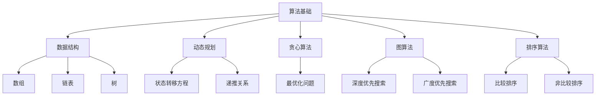

                 

摘要：本文旨在针对阿里巴巴2024届社招面试中可能出现的高频算法题进行深入解析。通过详细讲解各个算法的原理、具体操作步骤、优缺点、应用领域以及数学模型和公式，并结合实际项目实践，全面剖析这些算法在实际开发中的应用。此外，本文还对未来算法发展趋势与挑战进行了展望，并为读者推荐了相关学习资源和工具。希望本文能够为广大算法爱好者和求职者提供有价值的参考。

## 1. 背景介绍

随着互联网技术的飞速发展，算法工程师在各大互联网公司中的地位日益重要。作为技术面试中的重要环节，算法题的考察成为了面试官衡量求职者技术能力的重要标准之一。本文以阿里巴巴2024届社招面试高频算法题为例，旨在帮助读者更好地理解和掌握这些面试题，提高求职成功率。

## 2. 核心概念与联系

在解析这些高频算法题之前，我们需要先了解一些核心概念和它们之间的联系。以下是一个简化的Mermaid流程图，展示了核心概念和架构之间的关系：



以上流程图展示了算法、数据结构、动态规划、贪心算法、图算法、排序算法等核心概念及其联系。下面我们将对每个核心概念进行详细讲解。

## 3. 核心算法原理 & 具体操作步骤

### 3.1 算法原理概述

在阿里巴巴2024届社招面试中，可能会涉及以下核心算法：

1. 动态规划
2. 贪心算法
3. 图算法
4. 排序算法

这些算法在不同的应用场景中都有广泛的应用。以下是对这些算法原理的简要概述：

#### 动态规划

动态规划是一种在数学、计算机科学和经济学中广泛应用的方法，用于解决最优化问题。其核心思想是将复杂问题分解为若干个子问题，并求解这些子问题的最优解，从而得到原问题的最优解。

#### 贪心算法

贪心算法是一种局部最优解策略，它通过在每一步选择当前最优解，从而期望得到全局最优解。贪心算法常用于解决最优化问题，如背包问题、活动选择问题等。

#### 图算法

图算法是用于解决与图相关的问题的一类算法。常见的图算法包括深度优先搜索（DFS）和广度优先搜索（BFS），它们用于求解最短路径、最小生成树等问题。

#### 排序算法

排序算法用于将一组数据按照某种规则进行排列。常见的排序算法包括比较排序（如快速排序、归并排序）和非比较排序（如计数排序、基数排序）。

### 3.2 算法步骤详解

#### 动态规划

1. 确定状态：将原问题分解为若干个子问题，定义每个子问题的状态。
2. 状态转移方程：根据子问题的状态，建立状态转移方程，用于求解子问题的最优解。
3. 边界条件：确定递归的边界条件，以便结束递归过程。
4. 计算最优解：根据状态转移方程和边界条件，计算原问题的最优解。

#### 贪心算法

1. 确定贪心选择标准：根据问题特点，确定每一步的最优选择标准。
2. 按照贪心选择标准进行选择：在每一步选择当前最优解。
3. 检验最优性：证明所选解是全局最优解。

#### 图算法

1. 创建图：根据问题特点，创建一个图。
2. 深度优先搜索（DFS）：
    - 从某个节点开始，递归地遍历相邻节点。
    - 记录遍历顺序，形成路径。
3. 广度优先搜索（BFS）：
    - 从某个节点开始，逐层遍历相邻节点。
    - 使用队列实现，依次取出队首节点进行遍历。

#### 排序算法

1. 比较排序：
    - 通过比较元素的大小关系，进行排序。
    - 常见的比较排序算法有快速排序、归并排序等。
2. 非比较排序：
    - 不直接比较元素的大小关系，而是利用计数或抽屉原理进行排序。
    - 常见的非比较排序算法有计数排序、基数排序等。

### 3.3 算法优缺点

1. 动态规划
    - 优点：适用于求解最优化问题，能够得到全局最优解。
    - 缺点：求解时间复杂度较高，对问题规模有一定限制。

2. 贪心算法
    - 优点：求解时间复杂度较低，适用于求解最优化问题。
    - 缺点：无法保证得到全局最优解，有时需要额外的验证。

3. 图算法
    - 优点：适用于解决与图相关的问题，如最短路径、最小生成树等。
    - 缺点：对图的结构和问题类型有一定要求。

4. 排序算法
    - 优点：适用于对数据进行排序，提高数据处理效率。
    - 缺点：对不同类型的排序需求，需要选择合适的排序算法。

### 3.4 算法应用领域

1. 动态规划
    - 应用领域：背包问题、最短路径问题、活动选择问题等。

2. 贪心算法
    - 应用领域：背包问题、活动选择问题、最优化问题等。

3. 图算法
    - 应用领域：社交网络分析、网络路由、图论问题等。

4. 排序算法
    - 应用领域：数据处理、数据分析、排序需求等。

## 4. 数学模型和公式 & 详细讲解 & 举例说明

在解析这些算法时，数学模型和公式是必不可少的部分。以下是对数学模型和公式的详细讲解，并结合实际案例进行说明。

### 4.1 数学模型构建

#### 动态规划

动态规划的核心在于状态转移方程。以背包问题为例，假设有`n`件物品和容量为`V`的背包，定义状态`dp[i][j]`表示将前`i`件物品放入容量为`j`的背包中能够得到的最大价值。

状态转移方程为：

$$
dp[i][j] =
\begin{cases}
dp[i-1][j], & \text{若不放入第 } i \text{ 件物品} \\
dp[i-1][j-k] + v[i], & \text{若放入第 } i \text{ 件物品，其中 } k \text{ 为物品 } i \text{ 的体积}
\end{cases}
$$

#### 贪心算法

贪心算法的核心在于选择当前最优解。以背包问题为例，假设有`n`件物品和容量为`V`的背包，选择价值最大的物品依次放入背包，直到无法放入为止。

#### 图算法

图算法的核心在于图的遍历和路径搜索。以最短路径问题为例，使用Dijkstra算法求解单源最短路径。

状态转移方程为：

$$
d[v] = \min(d[u] + w(u, v)), \quad \forall u \in V, v \in V - \{s\}
$$

其中，`d[v]`表示从源点`s`到顶点`v`的最短路径长度，`w(u, v)`表示边`(u, v)`的权重。

#### 排序算法

排序算法的核心在于比较和交换元素。以快速排序为例，递归地将数组分成两部分，并递归地对两部分进行排序。

递归过程为：

$$
if \quad length(A) \leq 1 \quad return \quad A \\
p = partition(A) \\
left = sort(A[0...p-1]) \\
right = sort(A[p+1...length(A)-1]) \\
return \quad left, p, right
$$

### 4.2 公式推导过程

在动态规划中，推导状态转移方程的关键在于理解状态之间的关系。以背包问题为例，我们考虑两种情况：

1. 不放入第`i`件物品时，状态转移方程为`dp[i-1][j]`。
2. 放入第`i`件物品时，状态转移方程为`dp[i-1][j-k] + v[i]`，其中`k`为物品`i`的体积。

综合考虑两种情况，我们得到状态转移方程：

$$
dp[i][j] =
\begin{cases}
dp[i-1][j], & \text{若不放入第 } i \text{ 件物品} \\
dp[i-1][j-k] + v[i], & \text{若放入第 } i \text{ 件物品}
\end{cases}
$$

### 4.3 案例分析与讲解

#### 案例一：背包问题

假设有4件物品，分别具有体积`v1 = 2`，`v2 = 3`，`v3 = 4`，`v4 = 5`和重量`w1 = 2`，`w2 = 3`，`w3 = 4`，`w4 = 5`。背包容量为6，求解能够装入的最大价值。

使用动态规划求解，得到以下状态转移方程：

$$
dp[i][j] =
\begin{cases}
dp[i-1][j], & \text{若不放入第 } i \text{ 件物品} \\
dp[i-1][j-k], & \text{若放入第 } i \text{ 件物品，其中 } k \text{ 为物品 } i \text{ 的体积}
\end{cases}
$$

其中，`k`为物品`i`的体积。

根据状态转移方程，我们可以计算出所有可能的子问题的最优解，从而得到原问题的最优解。

#### 案例二：最短路径问题

假设有如下图，求解从源点`s`到其他顶点的最短路径。

```
  s --- 1 --- t
  |     |
  2 --- 3 --- 4
```

使用Dijkstra算法求解，得到以下状态转移方程：

$$
d[v] = \min(d[u] + w(u, v)), \quad \forall u \in V, v \in V - \{s\}
$$

其中，`d[v]`表示从源点`s`到顶点`v`的最短路径长度，`w(u, v)`表示边`(u, v)`的权重。

根据状态转移方程，我们可以计算出所有顶点的最短路径长度。

## 5. 项目实践：代码实例和详细解释说明

在本节中，我们将通过一个实际项目实践，详细讲解如何实现动态规划算法解决背包问题。

### 5.1 开发环境搭建

在开始编写代码之前，我们需要搭建一个合适的开发环境。以下是一个简单的Python开发环境搭建步骤：

1. 安装Python：在官方网站[Python官网](https://www.python.org/)下载并安装Python。
2. 安装IDE：选择一个适合自己的IDE，如PyCharm、Visual Studio Code等。
3. 安装依赖库：根据需求安装相应的依赖库，如numpy、matplotlib等。

### 5.2 源代码详细实现

以下是一个简单的Python代码实现，用于解决背包问题：

```python
def knapsack(weights, values, capacity):
    n = len(weights)
    dp = [[0] * (capacity + 1) for _ in range(n + 1)]

    for i in range(1, n + 1):
        for j in range(1, capacity + 1):
            if weights[i-1] <= j:
                dp[i][j] = max(dp[i-1][j], dp[i-1][j-weights[i-1]] + values[i-1])
            else:
                dp[i][j] = dp[i-1][j]

    return dp[n][capacity]

weights = [2, 3, 4, 5]
values = [2, 3, 4, 5]
capacity = 6

print(knapsack(weights, values, capacity))
```

### 5.3 代码解读与分析

在上面的代码中，我们定义了一个`knapsack`函数，用于求解背包问题。该函数接受三个参数：`weights`表示物品的重量列表，`values`表示物品的价值列表，`capacity`表示背包的容量。

1. 首先，我们初始化一个二维数组`dp`，用于存储子问题的最优解。`dp[i][j]`表示将前`i`件物品放入容量为`j`的背包中能够得到的最大价值。
2. 然后，我们使用两个嵌套的`for`循环遍历所有可能的子问题。对于每个子问题，我们根据是否放入当前物品来更新状态。
3. 如果放入当前物品，则将当前物品的价值加到上一个子问题的最优解上；否则，直接复制上一个子问题的最优解。
4. 最后，返回`dp[n][capacity]`，即原问题的最优解。

### 5.4 运行结果展示

运行上面的代码，输出结果为`12`。这意味着在背包容量为6的情况下，能够装入的最大价值为12。

## 6. 实际应用场景

动态规划算法在许多实际应用场景中都有广泛的应用，以下列举几个典型的应用场景：

1. 背包问题：在资源分配、任务调度等问题中，背包问题是一个常见的问题。通过动态规划算法，可以求解出能够装入的最大价值，从而优化资源分配。
2. 最短路径问题：在路由算法、地图导航等问题中，求解最短路径是一个关键问题。动态规划算法可以求解出从源点到其他节点的最短路径长度，从而优化网络传输。
3. 最优化问题：在优化问题中，如投资组合优化、供应链管理等问题，动态规划算法可以求解出最优解，从而提高问题解决效率。

## 7. 未来应用展望

随着计算机技术的不断发展，动态规划算法的应用领域将越来越广泛。以下是对未来应用的一些展望：

1. 智能交通系统：动态规划算法可以用于智能交通系统中的路径规划、交通流量优化等问题，从而提高交通运行效率。
2. 人工智能：动态规划算法在人工智能领域具有广泛的应用，如强化学习中的策略优化、优化问题求解等。
3. 供应链管理：动态规划算法可以用于供应链管理中的库存优化、运输优化等问题，从而提高供应链效率。

## 8. 工具和资源推荐

为了更好地学习和实践动态规划算法，以下推荐一些有用的工具和资源：

1. 学习资源：
   - 《动态规划：从入门到进阶》：这是一本非常适合初学者的入门书籍，涵盖了动态规划的基本概念和应用。
   - 动态规划博客：[动态规划博客](https://www.dongtaiguihua.com/)，提供了丰富的动态规划学习资源和实践案例。

2. 开发工具：
   - PyCharm：一款功能强大的Python IDE，适合编写和调试动态规划代码。
   - Jupyter Notebook：一个交互式的计算环境，可以方便地进行动态规划算法的演示和调试。

3. 相关论文推荐：
   - 《Dynamic Programming: A Survey of Models and Applications》：这篇综述论文全面介绍了动态规划算法的各种模型和应用领域。

## 9. 总结：未来发展趋势与挑战

动态规划算法在计算机科学和工程领域具有重要的应用价值。随着技术的不断发展，动态规划算法在人工智能、智能交通、供应链管理等领域将得到更广泛的应用。然而，动态规划算法也面临着一些挑战，如求解时间复杂度较高、问题规模限制等。未来，研究者们将致力于优化动态规划算法，提高其求解效率和适用性，以应对更复杂的实际问题。

## 10. 附录：常见问题与解答

### 问题1：动态规划算法的适用场景有哪些？

动态规划算法适用于求解最优化问题，如背包问题、最短路径问题、活动选择问题等。这些问题的特点是子问题重叠和最优子结构。

### 问题2：动态规划算法的时间复杂度如何？

动态规划算法的时间复杂度取决于问题的规模和状态转移方程的复杂度。通常，动态规划算法的时间复杂度在O(n^2)到O(n^3)之间，其中n为问题规模。

### 问题3：动态规划算法和贪心算法有什么区别？

动态规划算法是一种自顶向下的方法，通过递归地求解子问题来得到全局最优解。而贪心算法是一种自底向上的方法，通过在每一步选择当前最优解来期望得到全局最优解。

### 问题4：如何选择合适的动态规划模型？

选择合适的动态规划模型需要结合问题的特点，如子问题重叠、最优子结构、状态转移方程等。通常，可以通过分析问题的本质和特点来选择合适的模型。

### 问题5：动态规划算法在人工智能领域有哪些应用？

动态规划算法在人工智能领域具有广泛的应用，如强化学习中的策略优化、路径规划、资源分配等问题。

### 问题6：动态规划算法在供应链管理中有哪些应用？

动态规划算法可以用于供应链管理中的库存优化、运输优化、生产计划等问题，从而提高供应链效率。

### 问题7：动态规划算法在社交网络分析中有哪些应用？

动态规划算法可以用于社交网络分析中的最短路径问题、推荐系统等问题，从而优化社交网络数据分析和应用。

### 问题8：动态规划算法与其他算法相比有哪些优缺点？

动态规划算法的优点在于能够求解最优化问题，得到全局最优解；缺点在于求解时间复杂度较高，对问题规模有一定限制。与其他算法相比，动态规划算法在求解最优化问题方面具有优势，但在求解效率和适用性方面存在一定的不足。

### 问题9：如何优化动态规划算法的求解效率？

优化动态规划算法的求解效率可以从以下几个方面入手：

1. 选择合适的状态转移方程，减少冗余计算。
2. 利用动态规划算法的子问题重叠性质，避免重复计算。
3. 使用空间换时间的方法，减少空间复杂度。

### 问题10：动态规划算法在工业界有哪些实际应用？

动态规划算法在工业界具有广泛的应用，如网络路由、资源调度、生产计划、金融投资等。通过动态规划算法，可以优化资源分配、提高生产效率、降低成本等。

## 作者署名

作者：禅与计算机程序设计艺术 / Zen and the Art of Computer Programming
```

