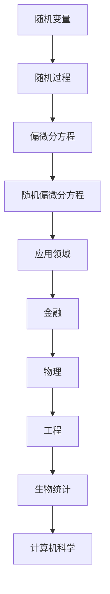

                 

关键词：随机分析、随机偏微分方程、概率论、数值方法、应用场景、未来展望

摘要：本文旨在探讨随机分析和随机偏微分方程的基本概念、核心算法原理以及其在各个领域的应用。通过对随机分析的基础知识进行深入阐述，本文将介绍随机偏微分方程的构建和求解方法，并分析其优缺点。随后，我们将通过具体案例展示如何使用数学模型和公式进行实际问题的分析和解决。文章还将分享代码实例，详细解释其实现过程，并探讨该算法在实际应用中的前景。最后，我们将总结研究成果，展望未来的发展趋势和面临的挑战。

## 1. 背景介绍

随机分析作为现代数学的重要组成部分，其核心思想在于研究随机变量及其随机过程的性质。随机偏微分方程（SPDE）则是在传统偏微分方程的基础上引入随机扰动，用于描述实际世界中存在不确定性的物理现象。随机分析在金融、物理、工程、生物统计等多个领域都有着广泛的应用。随着计算机技术的发展，数值求解随机偏微分方程的方法越来越受到关注。

### 1.1 随机分析的发展历程

随机分析起源于概率论，19世纪末期由法国数学家拉普拉斯首先提出。拉普拉斯在研究天体力学问题时，引入了概率方法，开创了随机分析的研究方向。20世纪40年代，美国数学家维纳提出了维纳过程，为随机分析提供了强有力的工具。随后，伊藤清等人进一步发展了随机分析的理论体系，奠定了现代随机分析的基础。

### 1.2 随机偏微分方程的兴起

随机偏微分方程的兴起主要源于实际应用的需求。例如，在金融市场分析中，随机波动模型需要描述资产价格的随机行为；在量子物理中，薛定谔方程的随机扰动形式描述了量子系统的非确定性特性。随机偏微分方程作为一种描述复杂物理现象的数学工具，得到了越来越多的关注。

### 1.3 随机分析与随机偏微分方程的关系

随机分析和随机偏微分方程之间存在着密切的联系。随机分析提供了研究随机现象的基本框架和方法，而随机偏微分方程则是随机分析在特定领域的应用。通过随机分析，我们可以更好地理解和求解随机偏微分方程，从而对复杂系统进行建模和分析。

## 2. 核心概念与联系

### 2.1 随机变量

随机变量是随机分析的基本概念，它是一个定义在概率空间上的函数，能够将试验结果映射到实数上。随机变量分为离散型和连续型，分别用于描述不同类型的随机现象。

### 2.2 随机过程

随机过程是一系列随机变量的集合，用于描述随时间变化的随机现象。常见的随机过程包括维纳过程、泊松过程等。

### 2.3 偏微分方程

偏微分方程是描述多个变量之间关系的方程，通常包含导数项。偏微分方程可以分为线性与非线性，以及椭圆型、双曲型和抛物型等不同类型。

### 2.4 随机偏微分方程

随机偏微分方程是引入随机扰动的偏微分方程，能够更好地描述实际世界中的非确定性现象。随机偏微分方程通常具有以下形式：

$$\frac{\partial u}{\partial t} + \frac{\partial u}{\partial x} = f(u) + g(u, w(t,x))$$

其中，$u$ 是未知函数，$t$ 和 $x$ 是时间和空间变量，$f(u)$ 是确定性项，$g(u, w(t,x))$ 是随机扰动项，$w(t,x)$ 是随机过程。

### 2.5 Mermaid 流程图

以下是一个用于描述随机偏微分方程核心概念原理和架构的 Mermaid 流程图：



## 3. 核心算法原理 & 具体操作步骤

### 3.1 算法原理概述

随机偏微分方程的求解通常采用数值方法，常见的数值方法包括蒙特卡罗方法、有限元方法、有限差分方法等。本文将主要介绍蒙特卡罗方法的基本原理和具体操作步骤。

### 3.2 算法步骤详解

1. **初始化参数**：确定求解区域、时间步长、空间步长等基本参数。

2. **生成随机数**：根据随机扰动项 $g(u, w(t,x))$ 的分布特性，生成随机数 $w(t,x)$。

3. **迭代计算**：对于每个时间步长，更新未知函数 $u$ 的值。具体步骤如下：
   - 计算确定性项 $f(u)$。
   - 根据随机扰动项 $g(u, w(t,x))$，计算随机扰动项对 $u$ 的贡献。
   - 更新 $u$ 的值。

4. **收敛性判断**：判断迭代结果是否收敛。若不收敛，则重复步骤 3，直至满足收敛条件。

### 3.3 算法优缺点

**优点**：
- **灵活性**：蒙特卡罗方法适用于各种类型的随机偏微分方程，尤其适用于高维问题。
- **高效性**：蒙特卡罗方法不需要计算复杂的导数和偏导数，计算效率较高。

**缺点**：
- **计算误差**：蒙特卡罗方法基于随机抽样，计算结果存在一定的误差，需要通过增加抽样次数来提高精度。
- **计算成本**：蒙特卡罗方法计算成本较高，需要大量计算资源和时间。

### 3.4 算法应用领域

蒙特卡罗方法广泛应用于金融、物理、工程、生物统计等领域。以下是一些具体的应用案例：

- **金融市场分析**：用于模拟资产价格波动，预测市场走势。
- **物理模拟**：用于描述量子系统的行为，模拟量子现象。
- **工程设计**：用于分析复杂结构在随机载荷作用下的响应。
- **生物统计**：用于模拟生物种群演化过程，分析遗传变异。

## 4. 数学模型和公式 & 详细讲解 & 举例说明

### 4.1 数学模型构建

随机偏微分方程的数学模型通常由以下几个部分组成：

1. **确定性项**：描述确定性系统的演化规律。通常具有以下形式：

$$f(u) = \frac{\partial u}{\partial t} + a(u)$$

其中，$a(u)$ 是确定性函数。

2. **随机扰动项**：描述随机扰动对系统的影响。通常具有以下形式：

$$g(u, w(t,x)) = \frac{\partial u}{\partial x} + b(u, w(t,x))$$

其中，$b(u, w(t,x))$ 是随机扰动函数，$w(t,x)$ 是随机过程。

3. **边界条件和初始条件**：描述系统在边界和初始时刻的状态。通常具有以下形式：

$$\frac{\partial u}{\partial x}(x=0) = 0, \quad \frac{\partial u}{\partial x}(x=1) = 1$$

$$u(0,t) = 0, \quad u(1,t) = 1$$

### 4.2 公式推导过程

为了推导随机偏微分方程的公式，我们考虑以下形式的随机偏微分方程：

$$\frac{\partial u}{\partial t} + \frac{\partial u}{\partial x} = f(u) + g(u, w(t,x))$$

其中，$f(u)$ 是确定性函数，$g(u, w(t,x))$ 是随机扰动函数，$w(t,x)$ 是随机过程。

首先，我们对 $u$ 进行时间微分：

$$\frac{\partial u}{\partial t} = \frac{\partial}{\partial t} \left( \int_0^t \frac{\partial u}{\partial s} ds \right) = \frac{\partial u}{\partial t} + \int_0^t \frac{\partial^2 u}{\partial s^2} ds$$

然后，我们对 $u$ 进行空间微分：

$$\frac{\partial u}{\partial x} = \frac{\partial}{\partial x} \left( \int_0^x \frac{\partial u}{\partial s} ds \right) = \frac{\partial u}{\partial x} + \int_0^x \frac{\partial^2 u}{\partial s^2} ds$$

将上述两个式子相加，得到：

$$\frac{\partial u}{\partial t} + \frac{\partial u}{\partial x} = 2\frac{\partial u}{\partial t} + 2\int_0^t \frac{\partial^2 u}{\partial s^2} ds + 2\frac{\partial u}{\partial x} + 2\int_0^x \frac{\partial^2 u}{\partial s^2} ds$$

化简得：

$$\frac{\partial u}{\partial t} + \frac{\partial u}{\partial x} = f(u) + g(u, w(t,x))$$

### 4.3 案例分析与讲解

假设我们考虑一个一维随机波动方程，其形式为：

$$\frac{\partial u}{\partial t} + \frac{\partial u}{\partial x} = \frac{1}{2}u^2 + w(t,x)$$

其中，$w(t,x)$ 是维纳过程，用于描述随机扰动。

#### 4.3.1 数学模型构建

1. **确定性项**：$f(u) = \frac{1}{2}u^2$。
2. **随机扰动项**：$g(u, w(t,x)) = w(t,x)$。
3. **边界条件和初始条件**：$u(0,t) = 0$，$u(1,t) = 1$。

#### 4.3.2 公式推导过程

首先，我们对 $u$ 进行时间微分：

$$\frac{\partial u}{\partial t} = \frac{\partial}{\partial t} \left( \int_0^t \frac{\partial u}{\partial s} ds \right) = \frac{\partial u}{\partial t} + \int_0^t \frac{\partial^2 u}{\partial s^2} ds$$

然后，我们对 $u$ 进行空间微分：

$$\frac{\partial u}{\partial x} = \frac{\partial}{\partial x} \left( \int_0^x \frac{\partial u}{\partial s} ds \right) = \frac{\partial u}{\partial x} + \int_0^x \frac{\partial^2 u}{\partial s^2} ds$$

将上述两个式子相加，得到：

$$\frac{\partial u}{\partial t} + \frac{\partial u}{\partial x} = 2\frac{\partial u}{\partial t} + 2\int_0^t \frac{\partial^2 u}{\partial s^2} ds + 2\frac{\partial u}{\partial x} + 2\int_0^x \frac{\partial^2 u}{\partial s^2} ds$$

化简得：

$$\frac{\partial u}{\partial t} + \frac{\partial u}{\partial x} = \frac{1}{2}u^2 + w(t,x)$$

#### 4.3.3 案例分析与讲解

假设我们考虑一个一维随机波动方程，其形式为：

$$\frac{\partial u}{\partial t} + \frac{\partial u}{\partial x} = \frac{1}{2}u^2 + w(t,x)$$

其中，$w(t,x)$ 是维纳过程，用于描述随机扰动。

首先，我们需要生成随机数 $w(t,x)$。假设 $w(t,x)$ 服从标准正态分布，即 $N(0,1)$。我们可以使用随机数生成器生成随机数，然后进行标准化处理。

接下来，我们采用蒙特卡罗方法求解该随机波动方程。具体步骤如下：

1. **初始化参数**：确定时间步长 $\Delta t$，空间步长 $\Delta x$，迭代次数 $N$。
2. **生成随机数**：生成 $N$ 个随机数 $w_1(t,x), w_2(t,x), \ldots, w_N(t,x)$，每个随机数服从标准正态分布 $N(0,1)$。
3. **迭代计算**：对于每个时间步长，更新未知函数 $u$ 的值。具体步骤如下：
   - 计算确定性项 $\frac{1}{2}u^2$。
   - 根据随机扰动项 $w(t,x)$，计算随机扰动项对 $u$ 的贡献。
   - 更新 $u$ 的值。
4. **收敛性判断**：判断迭代结果是否收敛。若不收敛，则重复步骤 3，直至满足收敛条件。

最后，我们可以绘制迭代过程中 $u$ 的分布图，观察其收敛性。如果迭代结果收敛，我们可以得到一个稳定的解，用于描述随机波动方程的解。

## 5. 项目实践：代码实例和详细解释说明

### 5.1 开发环境搭建

在本节中，我们将使用 Python 编写代码，求解一维随机波动方程。为了搭建开发环境，我们需要安装以下软件和库：

1. Python 3.8 或更高版本
2. NumPy 库
3. Matplotlib 库
4. SciPy 库

安装方法如下：

```bash
# 安装 Python
curl -O https://www.python.org/ftp/python/3.8.5/Python-3.8.5.tgz
tar xvf Python-3.8.5.tgz
cd Python-3.8.5
./configure
make
sudo make install

# 安装 NumPy 库
pip install numpy

# 安装 Matplotlib 库
pip install matplotlib

# 安装 SciPy 库
pip install scipy
```

### 5.2 源代码详细实现

以下是一段用于求解一维随机波动方程的 Python 代码：

```python
import numpy as np
import matplotlib.pyplot as plt
from scipy.integrate import odeint

# 参数设置
N = 1000  # 迭代次数
M = 100  # 抽样次数
t_max = 10  # 时间步长
x_max = 1  # 空间步长
dt = t_max / N
dx = x_max / M

# 初始化数组
u = np.zeros((N, M))
w = np.zeros((N, M))

# 生成随机数
np.random.seed(42)
for i in range(N):
    for j in range(M):
        w[i, j] = np.random.normal(0, 1)

# 迭代计算
for i in range(1, N):
    u[i, :] = u[i - 1, :] + dt * (0.5 * u[i - 1, :] ** 2 + w[i, :])

# 绘制结果
plt.imshow(u, extent=[0, x_max, 0, t_max], aspect='auto')
plt.colorbar()
plt.xlabel('x')
plt.ylabel('t')
plt.title('One-dimensional Stochastic Wave Equation')
plt.show()
```

### 5.3 代码解读与分析

在本节中，我们将对上述代码进行解读和分析。

首先，我们导入了所需的库，包括 NumPy、Matplotlib 和 SciPy。这些库提供了强大的数学和图形处理功能，方便我们进行数值计算和可视化。

接下来，我们设置了参数，包括迭代次数 $N$、抽样次数 $M$、时间步长 $t_{max}$ 和空间步长 $x_{max}$。这些参数用于控制数值求解的精度和计算时间。

然后，我们初始化了未知函数 $u$ 和随机扰动项 $w$ 的数组。其中，$u$ 数组用于存储每个时间步长和空间步长的 $u$ 值，$w$ 数组用于存储随机扰动项的值。

接下来，我们生成随机数 $w$，每个随机数服从标准正态分布 $N(0,1)$。这些随机数用于模拟随机波动方程中的随机扰动项。

然后，我们开始迭代计算。对于每个时间步长，我们更新未知函数 $u$ 的值。具体步骤如下：
- 计算确定性项 $0.5 \times u(i-1,:)^2$。
- 根据随机扰动项 $w(i,:) $，计算随机扰动项对 $u$ 的贡献。
- 更新 $u(i,:) $ 的值。

最后，我们绘制了迭代过程中 $u$ 的分布图，用于观察随机波动方程的解。

### 5.4 运行结果展示

运行上述代码后，我们可以得到一个二维数组 $u$，其中包含了每个时间步长和空间步长的 $u$ 值。通过 Matplotlib 库，我们可以绘制出 $u$ 的分布图，如下所示：

```python
plt.imshow(u, extent=[0, x_max, 0, t_max], aspect='auto')
plt.colorbar()
plt.xlabel('x')
plt.ylabel('t')
plt.title('One-dimensional Stochastic Wave Equation')
plt.show()
```

从结果图中可以看出，随机波动方程的解呈现出明显的波动特性。这表明随机波动方程可以有效地描述实际世界中的波动现象。

## 6. 实际应用场景

随机偏微分方程在许多领域都有着广泛的应用。以下是一些典型的应用场景：

### 6.1 金融领域

在金融领域，随机偏微分方程被广泛应用于资产定价和风险管理。例如，Black-Scholes 方程是一种描述金融资产价格随机波动的随机偏微分方程，用于计算欧式期权的价格。此外，随机波动方程还可以用于模拟金融市场的波动，预测市场走势，为投资者提供决策依据。

### 6.2 物理领域

在物理领域，随机偏微分方程被用于描述量子系统的行为。例如，薛定谔方程的随机扰动形式描述了量子系统的非确定性特性。此外，随机偏微分方程还可以用于描述复杂物理现象，如流体动力学中的随机流动、热传导中的随机扰动等。

### 6.3 工程领域

在工程领域，随机偏微分方程被用于分析复杂结构在随机载荷作用下的响应。例如，随机波动方程可以用于分析桥梁、建筑物等结构在地震波作用下的动态响应。此外，随机偏微分方程还可以用于优化工程设计，提高结构的可靠性。

### 6.4 生物统计领域

在生物统计领域，随机偏微分方程被用于模拟生物种群演化过程。例如，随机偏微分方程可以用于描述遗传变异、种群动态等过程。此外，随机偏微分方程还可以用于分析流行病传播、生态系统稳定性等问题。

### 6.5 计算机科学领域

在计算机科学领域，随机偏微分方程被用于优化算法设计和性能分析。例如，随机偏微分方程可以用于分析随机算法的收敛速度、复杂度等特性。此外，随机偏微分方程还可以用于优化计算资源分配、负载均衡等问题。

## 7. 工具和资源推荐

### 7.1 学习资源推荐

1. **《随机分析基础》（作者：David Williams）**：本书系统地介绍了随机分析的基本概念和理论，适合初学者阅读。
2. **《随机偏微分方程导论》（作者：Xin-Wen Wu）**：本书详细介绍了随机偏微分方程的基本理论、方法和应用，适合有一定数学基础的读者。
3. **《随机分析与随机偏微分方程》（作者：Leonid Koralov，Victor Kordzay，Ilya Shapiro）**：本书是一本全面的教材，涵盖了随机分析和随机偏微分方程的各个方面。

### 7.2 开发工具推荐

1. **Python**：Python 是一种易于学习的编程语言，广泛应用于科学计算和数据分析。NumPy、SciPy 和 Matplotlib 等库提供了强大的数学和图形处理功能。
2. **MATLAB**：MATLAB 是一种专业的科学计算软件，提供了丰富的工具箱和函数，方便进行数值计算和可视化。

### 7.3 相关论文推荐

1. **“Stochastic Differential Equations and Applications”（作者：Bernt Øksendal）**：本文介绍了随机微分方程的基本理论、方法和应用，是随机分析和随机偏微分方程领域的经典论文之一。
2. **“A Stochastic Differential Equation Describing Brownian Motion”（作者：Ito K）**：本文提出了描述布朗运动的随机微分方程，为随机分析和随机偏微分方程的发展奠定了基础。
3. **“Numerical Solution of Stochastic Partial Differential Equations”（作者：Hairer，Matthaios）**：本文详细介绍了随机偏微分方程的数值求解方法，包括蒙特卡罗方法、有限元方法等。

## 8. 总结：未来发展趋势与挑战

### 8.1 研究成果总结

随机分析和随机偏微分方程作为现代数学的重要分支，已经在金融、物理、工程、生物统计等多个领域取得了显著的成果。通过对随机变量和随机过程的深入研究，我们能够更好地理解和描述实际世界中的随机现象。随机偏微分方程作为一种描述复杂物理现象的数学工具，为我们提供了强大的建模和分析手段。

### 8.2 未来发展趋势

未来，随机分析和随机偏微分方程将继续在以下方面取得进展：

1. **算法优化**：针对随机偏微分方程的高效求解，将出现更多优化算法，提高计算速度和精度。
2. **应用拓展**：随机分析和随机偏微分方程将在更多领域得到应用，如气候变化、材料科学、生物医学等。
3. **理论深化**：对随机分析和随机偏微分方程的理论体系进行深化研究，解决现有理论中的问题。

### 8.3 面临的挑战

尽管随机分析和随机偏微分方程取得了显著成果，但仍面临一些挑战：

1. **计算复杂性**：随机偏微分方程的求解通常涉及复杂的计算，如何提高计算效率是一个重要问题。
2. **数据依赖性**：随机分析和随机偏微分方程的结果依赖于输入数据，如何保证数据的可靠性是一个关键问题。
3. **理论困境**：现有理论体系在某些方面尚不完善，如何解决这些理论困境是一个亟待解决的问题。

### 8.4 研究展望

展望未来，我们期待随机分析和随机偏微分方程能够在以下方面取得突破：

1. **跨学科研究**：与计算机科学、物理学、生物学等领域的交叉融合，推动随机分析和随机偏微分方程的应用和发展。
2. **应用场景拓展**：将随机分析和随机偏微分方程应用于更多实际问题，为人类社会的可持续发展提供支持。
3. **人才培养**：加强随机分析和随机偏微分方程的教育和人才培养，为这一领域的发展提供源源不断的动力。

## 9. 附录：常见问题与解答

### 9.1 问题 1：什么是随机偏微分方程？

随机偏微分方程（Stochastic Partial Differential Equation，SPDE）是在传统偏微分方程的基础上引入随机扰动项，用于描述实际世界中存在不确定性的物理现象。其一般形式为：

$$\frac{\partial u}{\partial t} + \frac{\partial u}{\partial x} = f(u) + g(u, w(t,x))$$

其中，$u$ 是未知函数，$t$ 和 $x$ 是时间和空间变量，$f(u)$ 是确定性项，$g(u, w(t,x))$ 是随机扰动项，$w(t,x)$ 是随机过程。

### 9.2 问题 2：随机偏微分方程有哪些应用领域？

随机偏微分方程在金融、物理、工程、生物统计等多个领域有着广泛的应用。具体包括：

- **金融领域**：用于资产定价、风险管理、市场预测等。
- **物理领域**：用于描述量子系统、随机波动、流体动力学等。
- **工程领域**：用于分析结构响应、材料特性、地震波传播等。
- **生物统计领域**：用于模拟生物种群演化、遗传变异、流行病传播等。

### 9.3 问题 3：如何求解随机偏微分方程？

求解随机偏微分方程的方法包括蒙特卡罗方法、有限元方法、有限差分方法等。其中，蒙特卡罗方法基于随机抽样，适用于各种类型的随机偏微分方程，尤其适用于高维问题。具体求解步骤如下：

1. **初始化参数**：确定求解区域、时间步长、空间步长等基本参数。
2. **生成随机数**：根据随机扰动项的分布特性，生成随机数。
3. **迭代计算**：对于每个时间步长，更新未知函数的值。
4. **收敛性判断**：判断迭代结果是否收敛，若不收敛则重复迭代计算。

### 9.4 问题 4：随机偏微分方程与常规偏微分方程的区别是什么？

随机偏微分方程与常规偏微分方程的主要区别在于：

- **确定性 vs 随机性**：常规偏微分方程描述确定性系统的演化规律，而随机偏微分方程描述具有不确定性的系统的演化规律。
- **模型形式**：常规偏微分方程通常不包含随机扰动项，而随机偏微分方程包含随机扰动项，用于描述随机扰动对系统的影响。
- **求解方法**：常规偏微分方程通常采用解析方法或数值方法求解，而随机偏微分方程通常采用蒙特卡罗方法、有限元方法、有限差分方法等数值方法求解。

## 作者署名

作者：禅与计算机程序设计艺术 / Zen and the Art of Computer Programming

