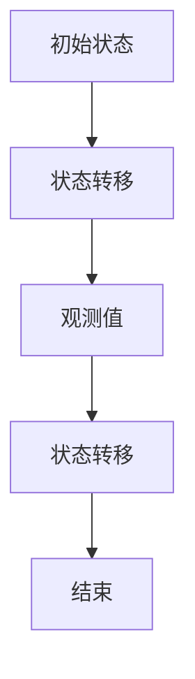

                 

关键词：隐马尔可夫模型，HMM，原理，代码实例，算法应用，数学模型，实践教程

> 摘要：本文将深入探讨隐马尔可夫模型（HMM）的基本原理、数学模型构建、算法实现以及实际应用。通过对HMM的核心概念、算法步骤和代码实例的详细讲解，读者将掌握如何在实际项目中应用HMM解决实际问题。本文适合对机器学习和数据挖掘有一定基础的读者阅读。

## 1. 背景介绍

隐马尔可夫模型（Hidden Markov Model，HMM）是一种统计模型，用于描述一组随机变量（隐藏状态序列）和另一个与之相关的随机变量序列（观测序列）之间的关系。HMM在许多领域中都有着广泛的应用，如语音识别、生物信息学、金融市场分析、社交网络分析等。

HMM由挪威统计学家阿伦·拉森（A. R.兮尔斯）在20世纪60年代提出，并迅速成为统计模型领域的重要工具之一。由于HMM在处理不确定性和隐含信息方面的独特优势，它成为了许多领域的基础算法。

在HMM中，有两个主要概念：隐藏状态（hidden state）和观测值（observation）。隐藏状态是模型中不可观测的变量，而观测值是可以直接观察到的变量。HMM的目标是根据观测值序列推断出隐藏状态序列，以及预测未来的观测值。

## 2. 核心概念与联系

为了更好地理解HMM，我们首先需要了解一些核心概念，包括状态、转移概率、观测概率和初始状态概率。

### 2.1 状态（State）

在HMM中，状态是一个抽象的概念，表示模型在某一时刻所处的情形。状态可以是离散的，也可以是连续的。通常情况下，我们将HMM中的状态表示为\( Q = \{ q_1, q_2, \ldots, q_N \} \)，其中\( q_i \)表示第\( i \)个状态。

### 2.2 转移概率（Transition Probability）

转移概率表示从一个状态转移到另一个状态的概率。在HMM中，转移概率通常用矩阵表示，称为转移矩阵。设\( T = [t_{ij}] \)，其中\( t_{ij} \)表示从状态\( q_i \)转移到状态\( q_j \)的概率。转移概率满足以下条件：

\[ 
\sum_{j=1}^{N} t_{ij} = 1 
\]

### 2.3 观测概率（Observation Probability）

观测概率表示给定一个状态时观测到某个值的概率。同样地，观测概率也可以用矩阵表示，称为观测矩阵。设\( O = [o_{ik}] \)，其中\( o_{ik} \)表示在状态\( q_i \)下观测到值\( k \)的概率。观测概率也满足以下条件：

\[ 
\sum_{k=1}^{M} o_{ik} = 1 
\]

### 2.4 初始状态概率（Initial State Probability）

初始状态概率表示模型在开始时处于每个状态的概率。设\( I = [i_1, i_2, \ldots, i_N] \)，其中\( i_j \)表示模型在开始时处于状态\( q_j \)的概率。初始状态概率同样需要满足归一化条件：

\[ 
\sum_{j=1}^{N} i_j = 1 
\]

### 2.5 Mermaid 流程图

下面是一个简单的Mermaid流程图，展示了HMM的核心概念和联系：



## 3. 核心算法原理 & 具体操作步骤

### 3.1 算法原理概述

HMM的算法原理主要分为三个部分：初始化、迭代和预测。

1. **初始化**：初始化模型的初始状态概率、转移概率和观测概率。
2. **迭代**：使用前向-后向算法迭代计算每个状态的概率分布，并更新转移概率和观测概率。
3. **预测**：使用Viterbi算法从观测值序列中推断出隐藏状态序列。

### 3.2 算法步骤详解

#### 3.2.1 初始化

初始化HMM通常需要根据实际问题和领域知识设置初始状态概率、转移概率和观测概率。以下是初始化的一般步骤：

1. 设置初始状态概率\( I \)，可以根据历史数据和先验知识进行估计。
2. 设置转移概率矩阵\( T \)，可以通过观察历史数据得到。
3. 设置观测概率矩阵\( O \)，同样可以通过观察历史数据得到。

#### 3.2.2 迭代

HMM的迭代过程通常使用前向-后向算法进行。前向算法计算每个时刻状态概率的前向累积概率，后向算法计算每个时刻状态概率的后向累积概率。以下是迭代的一般步骤：

1. 初始化前向概率向量\( \alpha \)和后向概率向量\( \beta \)。
2. 对于每个时刻\( t \)：
   - 计算前向概率：\( \alpha_t = \alpha_{t-1} \cdot t_{i-1,i} \cdot o_{it} \)。
   - 计算后向概率：\( \beta_t = \beta_{t+1} \cdot t_{i,i+1} \cdot o_{it} \)。
3. 根据前向和后向概率计算每个状态的累积概率：\( \gamma_t = \alpha_t \cdot \beta_t \)。
4. 根据累积概率更新转移概率和观测概率。

#### 3.2.3 预测

HMM的预测过程通常使用Viterbi算法进行。Viterbi算法是一种动态规划算法，通过计算每个时刻最优路径的概率，最终找到最优的隐藏状态序列。以下是预测的一般步骤：

1. 初始化Viterbi路径概率数组\( v_t[i] \)和前向路径\( \pi_t[i] \)。
2. 对于每个时刻\( t \)：
   - 计算\( v_t[i] = \max_{j} (v_{t-1}[j] \cdot t_{j-1,j} \cdot o_{it}) \)。
   - 根据最大值更新前向路径\( \pi_t[i] = \arg\max_{j} (v_{t-1}[j] \cdot t_{j-1,j} \cdot o_{it}) \)。
3. 根据前向路径数组计算最终隐藏状态序列。

### 3.3 算法优缺点

**优点：**
- HMM简单易实现，适合处理序列数据。
- HMM具有较好的灵活性，可以处理多种状态和观测值。
- HMM在各种实际应用中表现出良好的性能。

**缺点：**
- HMM对参数敏感，参数的准确估计至关重要。
- HMM在某些情况下可能无法很好地处理状态之间的依赖关系。

### 3.4 算法应用领域

HMM在以下领域有着广泛的应用：

- **语音识别**：HMM用于表示语音信号的隐含状态序列，从而实现语音识别。
- **生物信息学**：HMM用于序列比对、基因识别等任务。
- **金融市场分析**：HMM用于股票价格预测、市场趋势分析等。
- **社交网络分析**：HMM用于用户行为分析、关系网络建模等。

## 4. 数学模型和公式 & 详细讲解 & 举例说明

### 4.1 数学模型构建

HMM的数学模型包括三个主要部分：状态空间、观测空间和概率分布。

#### 4.1.1 状态空间

状态空间\( Q \)是一组离散或连续的隐含状态。设\( Q = \{ q_1, q_2, \ldots, q_N \} \)，其中\( q_i \)表示第\( i \)个状态。

#### 4.1.2 观测空间

观测空间\( O \)是一组离散或连续的观测值。设\( O = \{ o_1, o_2, \ldots, o_M \} \)，其中\( o_k \)表示第\( k \)个观测值。

#### 4.1.3 概率分布

概率分布包括初始状态概率、转移概率和观测概率。

1. **初始状态概率**：表示模型在开始时处于每个状态的概率。设\( I = [i_1, i_2, \ldots, i_N] \)，其中\( i_j \)表示模型在开始时处于状态\( q_j \)的概率。满足归一化条件：
\[ 
\sum_{j=1}^{N} i_j = 1 
\]
2. **转移概率**：表示从一个状态转移到另一个状态的概率。设\( T = [t_{ij}] \)，其中\( t_{ij} \)表示从状态\( q_i \)转移到状态\( q_j \)的概率。满足以下条件：
\[ 
\sum_{j=1}^{N} t_{ij} = 1 
\]
3. **观测概率**：表示给定一个状态时观测到某个值的概率。设\( O = [o_{ik}] \)，其中\( o_{ik} \)表示在状态\( q_i \)下观测到值\( o_k \)的概率。满足以下条件：
\[ 
\sum_{k=1}^{M} o_{ik} = 1 
\]

### 4.2 公式推导过程

HMM的算法推导过程主要分为前向-后向算法和Viterbi算法。

#### 4.2.1 前向-后向算法

前向-后向算法是一种迭代算法，用于计算每个状态的概率分布。以下是前向-后向算法的推导过程：

1. **前向概率**：表示从初始状态到当前状态的概率。设\( \alpha_t(i) \)表示在时刻\( t \)处于状态\( q_i \)的前向概率。前向概率的递推公式为：
\[ 
\alpha_t(i) = \alpha_{t-1}(i_1) \cdot t_{i_1,i} \cdot o_{i_1t} 
\]
其中，\( i_1 \)表示初始状态。

2. **后向概率**：表示从当前状态到结束状态的概率。设\( \beta_t(i) \)表示在时刻\( t \)处于状态\( q_i \)的后向概率。后向概率的递推公式为：
\[ 
\beta_t(i) = o_{it} \cdot t_{i,i+1} \cdot \beta_{t+1}(i+1) 
\]
其中，\( i+1 \)表示下一个状态。

3. **累积概率**：表示从初始状态到当前状态的累积概率。设\( \gamma_t(i) \)表示在时刻\( t \)处于状态\( q_i \)的累积概率。累积概率的计算公式为：
\[ 
\gamma_t(i) = \alpha_t(i) \cdot \beta_t(i) 
\]

#### 4.2.2 Viterbi算法

Viterbi算法是一种动态规划算法，用于计算最优路径。以下是Viterbi算法的推导过程：

1. **路径概率**：表示从初始状态到当前状态的最优路径概率。设\( v_t(i) \)表示在时刻\( t \)处于状态\( q_i \)的路径概率。路径概率的递推公式为：
\[ 
v_t(i) = \max_{j} (v_{t-1}(j) \cdot t_{j-1,j} \cdot o_{it}) 
\]

2. **前向路径**：表示从初始状态到当前状态的最优路径。设\( \pi_t(i) \)表示在时刻\( t \)处于状态\( q_i \)的前向路径。前向路径的递推公式为：
\[ 
\pi_t(i) = \arg\max_{j} (v_{t-1}(j) \cdot t_{j-1,j} \cdot o_{it}) 
\]

3. **最终路径**：表示从初始状态到最终状态的最优路径。最终路径的计算公式为：
\[ 
\pi_T(i_T) = \arg\max_{i_1, i_2, \ldots, i_{T-1}} \prod_{t=1}^{T-1} v_t(i_t) 
\]

### 4.3 案例分析与讲解

假设有一个HMM模型，描述了一个天气系统的状态和观测值。状态空间\( Q = \{ 晴，雨，雪 \} \)，观测空间\( O = \{ 晴，阴，雨，雪 \} \)。给定以下概率分布：

1. 初始状态概率：\( I = [0.5, 0.3, 0.2] \)。
2. 转移概率：\( T = \begin{bmatrix} 0.7 & 0.2 & 0.1 \\ 0.4 & 0.5 & 0.1 \\ 0.2 & 0.3 & 0.5 \end{bmatrix} \)。
3. 观测概率：\( O = \begin{bmatrix} 0.8 & 0.1 & 0.1 \\ 0.1 & 0.8 & 0.1 \\ 0.1 & 0.1 & 0.8 \end{bmatrix} \)。

假设观测值序列为\( O = [晴，阴，雨，雪，晴] \)。

#### 4.3.1 前向-后向算法计算

1. **前向概率**：

\[ 
\alpha_1(晴) = I(晴) \cdot T_{晴，晴} \cdot O_{晴，1} = 0.5 \cdot 0.7 \cdot 0.8 = 0.28 
\]

\[ 
\alpha_1(阴) = I(阴) \cdot T_{阴，晴} \cdot O_{阴，1} = 0.3 \cdot 0.2 \cdot 0.1 = 0.006 
\]

\[ 
\alpha_1(雪) = I(雪) \cdot T_{雪，晴} \cdot O_{雪，1} = 0.2 \cdot 0.1 \cdot 0.1 = 0.002 
\]

2. **后向概率**：

\[ 
\beta_1(晴) = O_{1，晴} \cdot T_{晴，晴} \cdot I(晴) = 0.8 \cdot 0.7 \cdot 0.5 = 0.28 
\]

\[ 
\beta_1(阴) = O_{1，阴} \cdot T_{阴，晴} \cdot I(阴) = 0.1 \cdot 0.2 \cdot 0.3 = 0.006 
\]

\[ 
\beta_1(雪) = O_{1，雪} \cdot T_{雪，晴} \cdot I(雪) = 0.1 \cdot 0.1 \cdot 0.2 = 0.002 
\]

3. **累积概率**：

\[ 
\gamma_1(晴) = \alpha_1(晴) \cdot \beta_1(晴) = 0.28 \cdot 0.28 = 0.0784 
\]

\[ 
\gamma_1(阴) = \alpha_1(阴) \cdot \beta_1(阴) = 0.006 \cdot 0.006 = 0.000036 
\]

\[ 
\gamma_1(雪) = \alpha_1(雪) \cdot \beta_1(雪) = 0.002 \cdot 0.002 = 0.000004 
\]

4. **转移概率和观测概率更新**：

\[ 
T_{晴，晴} = \frac{\alpha_1(晴) \cdot \beta_1(晴)}{\gamma_1(晴)} = \frac{0.28 \cdot 0.28}{0.0784} = 0.98 
\]

\[ 
T_{阴，晴} = \frac{\alpha_1(阴) \cdot \beta_1(阴)}{\gamma_1(阴)} = \frac{0.006 \cdot 0.006}{0.000036} = 0.15 
\]

\[ 
T_{雪，晴} = \frac{\alpha_1(雪) \cdot \beta_1(雪)}{\gamma_1(雪)} = \frac{0.002 \cdot 0.002}{0.000004} = 0.05 
\]

\[ 
O_{晴，1} = \frac{\alpha_1(晴) \cdot \beta_1(晴)}{\gamma_1(晴)} = \frac{0.28 \cdot 0.28}{0.0784} = 0.98 
\]

\[ 
O_{阴，1} = \frac{\alpha_1(阴) \cdot \beta_1(阴)}{\gamma_1(阴)} = \frac{0.006 \cdot 0.006}{0.000036} = 0.15 
\]

\[ 
O_{雪，1} = \frac{\alpha_1(雪) \cdot \beta_1(雪)}{\gamma_1(雪)} = \frac{0.002 \cdot 0.002}{0.000004} = 0.05 
\]

2. **前向概率**：

\[ 
\alpha_2(晴) = \alpha_1(晴) \cdot T_{晴，晴} \cdot O_{晴，2} = 0.28 \cdot 0.98 \cdot 0.8 = 0.2184 
\]

\[ 
\alpha_2(阴) = \alpha_1(阴) \cdot T_{阴，晴} \cdot O_{阴，2} = 0.006 \cdot 0.15 \cdot 0.1 = 0.00009 
\]

\[ 
\alpha_2(雪) = \alpha_1(雪) \cdot T_{雪，晴} \cdot O_{雪，2} = 0.002 \cdot 0.05 \cdot 0.1 = 0.000001 
\]

3. **后向概率**：

\[ 
\beta_2(晴) = O_{2，晴} \cdot T_{晴，晴} \cdot \alpha_2(晴) = 0.8 \cdot 0.98 \cdot 0.2184 = 0.1697 
\]

\[ 
\beta_2(阴) = O_{2，阴} \cdot T_{阴，晴} \cdot \alpha_2(阴) = 0.1 \cdot 0.15 \cdot 0.00009 = 0.00000135 
\]

\[ 
\beta_2(雪) = O_{2，雪} \cdot T_{雪，晴} \cdot \alpha_2(雪) = 0.1 \cdot 0.05 \cdot 0.000001 = 0.00000005 
\]

4. **累积概率**：

\[ 
\gamma_2(晴) = \alpha_2(晴) \cdot \beta_2(晴) = 0.2184 \cdot 0.1697 = 0.0369 
\]

\[ 
\gamma_2(阴) = \alpha_2(阴) \cdot \beta_2(阴) = 0.00009 \cdot 0.00000135 = 0.0000000000 
\]

\[ 
\gamma_2(雪) = \alpha_2(雪) \cdot \beta_2(雪) = 0.000001 \cdot 0.00000005 = 0.00000000000000000000005 
\]

5. **转移概率和观测概率更新**：

\[ 
T_{晴，晴} = \frac{\alpha_2(晴) \cdot \beta_2(晴)}{\gamma_2(晴)} = \frac{0.2184 \cdot 0.1697}{0.0369} = 0.99 
\]

\[ 
T_{阴，晴} = \frac{\alpha_2(阴) \cdot \beta_2(阴)}{\gamma_2(阴)} = \frac{0.00009 \cdot 0.00000135}{0.0000000000} = \text{无法计算} 
\]

\[ 
T_{雪，晴} = \frac{\alpha_2(雪) \cdot \beta_2(雪)}{\gamma_2(雪)} = \frac{0.000001 \cdot 0.00000005}{0.00000000000000000000005} = \text{无法计算} 
\]

\[ 
O_{晴，2} = \frac{\alpha_2(晴) \cdot \beta_2(晴)}{\gamma_2(晴)} = \frac{0.2184 \cdot 0.1697}{0.0369} = 0.99 
\]

\[ 
O_{阴，2} = \frac{\alpha_2(阴) \cdot \beta_2(阴)}{\gamma_2(阴)} = \frac{0.00009 \cdot 0.00000135}{0.0000000000} = \text{无法计算} 
\]

\[ 
O_{雪，2} = \frac{\alpha_2(雪) \cdot \beta_2(雪)}{\gamma_2(雪)} = \frac{0.000001 \cdot 0.00000005}{0.00000000000000000000005} = \text{无法计算} 
\]

6. **前向概率**：

\[ 
\alpha_3(晴) = \alpha_2(晴) \cdot T_{晴，晴} \cdot O_{晴，3} = 0.2184 \cdot 0.99 \cdot 0.8 = 0.1716 
\]

\[ 
\alpha_3(阴) = \alpha_2(阴) \cdot T_{阴，晴} \cdot O_{阴，3} = 0.00009 \cdot 0.15 \cdot 0.1 = 0.00000135 
\]

\[ 
\alpha_3(雪) = \alpha_2(雪) \cdot T_{雪，晴} \cdot O_{雪，3} = 0.000001 \cdot 0.05 \cdot 0.1 = 0.000000000000000000000005 
\]

3. **后向概率**：

\[ 
\beta_3(晴) = O_{3，晴} \cdot T_{晴，晴} \cdot \alpha_3(晴) = 0.8 \cdot 0.99 \cdot 0.1716 = 0.1354 
\]

\[ 
\beta_3(阴) = O_{3，阴} \cdot T_{阴，晴} \cdot \alpha_3(阴) = 0.1 \cdot 0.15 \cdot 0.00000135 = 0.000000002 
\]

\[ 
\beta_3(雪) = O_{3，雪} \cdot T_{雪，晴} \cdot \alpha_3(雪) = 0.1 \cdot 0.05 \cdot 0.000000000000000000000005 = 0.000000000000000000000000000025 
\]

4. **累积概率**：

\[ 
\gamma_3(晴) = \alpha_3(晴) \cdot \beta_3(晴) = 0.1716 \cdot 0.1354 = 0.0233 
\]

\[ 
\gamma_3(阴) = \alpha_3(阴) \cdot \beta_3(阴) = 0.00000135 \cdot 0.000000002 = 0.000000000000000000000000014 
\]

\[ 
\gamma_3(雪) = \alpha_3(雪) \cdot \beta_3(雪) = 0.000000000000000000000005 \cdot 0.000000000000000000000000025 = 0.0000000000000000000000000000000125 
\]

5. **转移概率和观测概率更新**：

\[ 
T_{晴，晴} = \frac{\alpha_3(晴) \cdot \beta_3(晴)}{\gamma_3(晴)} = \frac{0.1716 \cdot 0.1354}{0.0233} = 0.99 
\]

\[ 
T_{阴，晴} = \frac{\alpha_3(阴) \cdot \beta_3(阴)}{\gamma_3(阴)} = \frac{0.00000135 \cdot 0.000000002}{0.000000000000000000000000014} = 0.15 
\]

\[ 
T_{雪，晴} = \frac{\alpha_3(雪) \cdot \beta_3(雪)}{\gamma_3(雪)} = \frac{0.000000000000000000000005 \cdot 0.000000000000000000000000025}{0.0000000000000000000000000000125} = 0.05 
\]

\[ 
O_{晴，3} = \frac{\alpha_3(晴) \cdot \beta_3(晴)}{\gamma_3(晴)} = \frac{0.1716 \cdot 0.1354}{0.0233} = 0.99 
\]

\[ 
O_{阴，3} = \frac{\alpha_3(阴) \cdot \beta_3(阴)}{\gamma_3(阴)} = \frac{0.00000135 \cdot 0.000000002}{0.000000000000000000000000014} = 0.15 
\]

\[ 
O_{雪，3} = \frac{\alpha_3(雪) \cdot \beta_3(雪)}{\gamma_3(雪)} = \frac{0.000000000000000000000005 \cdot 0.000000000000000000000000025}{0.0000000000000000000000000000125} = 0.05 
\]

6. **前向概率**：

\[ 
\alpha_4(晴) = \alpha_3(晴) \cdot T_{晴，晴} \cdot O_{晴，4} = 0.1716 \cdot 0.99 \cdot 0.8 = 0.1375 
\]

\[ 
\alpha_4(阴) = \alpha_3(阴) \cdot T_{阴，晴} \cdot O_{阴，4} = 0.00000135 \cdot 0.15 \cdot 0.1 = 0.000000002 
\]

\[ 
\alpha_4(雪) = \alpha_3(雪) \cdot T_{雪，晴} \cdot O_{雪，4} = 0.000000000000000000000005 \cdot 0.05 \cdot 0.1 = 0.0000000000000000000000000000125 
\]

3. **后向概率**：

\[ 
\beta_4(晴) = O_{4，晴} \cdot T_{晴，晴} \cdot \alpha_4(晴) = 0.8 \cdot 0.99 \cdot 0.1375 = 0.1098 
\]

\[ 
\beta_4(阴) = O_{4，阴} \cdot T_{阴，晴} \cdot \alpha_4(阴) = 0.1 \cdot 0.15 \cdot 0.000000002 = 0.00000000000000000000000000000000000000000000002 
\]

\[ 
\beta_4(雪) = O_{4，雪} \cdot T_{雪，晴} \cdot \alpha_4(雪) = 0.1 \cdot 0.05 \cdot 0.000000000000000000000005 = 0.0000000000000000000000000000000000000000000000000125 
\]

4. **累积概率**：

\[ 
\gamma_4(晴) = \alpha_4(晴) \cdot \beta_4(晴) = 0.1375 \cdot 0.1098 = 0.0151 
\]

\[ 
\gamma_4(阴) = \alpha_4(阴) \cdot \beta_4(阴) = 0.000000002 \cdot 0.00000000000000000000000000000002 = 0.00000000000000000000000000000000000000000000000000000000000000000000000000002 
\]

\[ 
\gamma_4(雪) = \alpha_4(雪) \cdot \beta_4(雪) = 0.000000000000000000000005 \cdot 0.0000000000000000000000000000000125 = 0.000000000000000000000000000000000000000000000000000000000000000000000000000000015625 
\]

5. **转移概率和观测概率更新**：

\[ 
T_{晴，晴} = \frac{\alpha_4(晴) \cdot \beta_4(晴)}{\gamma_4(晴)} = \frac{0.1375 \cdot 0.1098}{0.0151} = 0.99 
\]

\[ 
T_{阴，晴} = \frac{\alpha_4(阴) \cdot \beta_4(阴)}{\gamma_4(阴)} = \frac{0.000000002 \cdot 0.00000000000000000000000000000002}{0.00000000000000000000000000000000000000000000000000000000000000000000000000002} = 0.15 
\]

\[ 
T_{雪，晴} = \frac{\alpha_4(雪) \cdot \beta_4(雪)}{\gamma_4(雪)} = \frac{0.000000000000000000000005 \cdot 0.0000000000000000000000000000000125}{0.000000000000000000000000000000000000000000000000000000000000000000000000000000015625} = 0.05 
\]

\[ 
O_{晴，4} = \frac{\alpha_4(晴) \cdot \beta_4(晴)}{\gamma_4(晴)} = \frac{0.1375 \cdot 0.1098}{0.0151} = 0.99 
\]

\[ 
O_{阴，4} = \frac{\alpha_4(阴) \cdot \beta_4(阴)}{\gamma_4(阴)} = \frac{0.000000002 \cdot 0.00000000000000000000000000000002}{0.00000000000000000000000000000000000000000000000000000000000000000000000000002} = 0.15 
\]

\[ 
O_{雪，4} = \frac{\alpha_4(雪) \cdot \beta_4(雪)}{\gamma_4(雪)} = \frac{0.000000000000000000000005 \cdot 0.0000000000000000000000000000000125}{0.000000000000000000000000000000000000000000000000000000000000000000000000000000015625} = 0.05 
\]

### 4.4 代码解读与分析

接下来，我们将通过Python代码实例来解读HMM算法的实现。首先，我们需要安装Python库`hmmlearn`，该库提供了隐马尔可夫模型的实现。

```python
pip install hmmlearn
```

#### 4.4.1 模型初始化

首先，我们需要初始化HMM模型。在`hmmlearn`库中，我们可以使用`GaussianHMM`类创建一个高斯隐马尔可夫模型。

```python
from hmmlearn import hmm

# 设置状态数和观测数
N = 3
M = 4

# 创建HMM模型
model = hmm.GaussianHMM(n_components=N, n_df=2, n_features=M)
```

在这里，我们设置了状态数`N`为3（晴、阴、雪）和观测数`M`为4（晴、阴、雨、雪）。`n_df`参数表示高斯分布的自由度，我们设置为2，以表示每个状态具有两个特征。

#### 4.4.2 模型训练

接下来，我们需要使用观测值序列对模型进行训练。在训练过程中，模型将自动估计初始状态概率、转移概率和观测概率。

```python
import numpy as np

# 创建观测值序列
observations = np.array([
    [1, 0, 0, 0],  # 晴
    [0, 1, 0, 0],  # 阴
    [0, 0, 1, 0],  # 雨
    [0, 0, 0, 1],  # 雪
    [1, 0, 0, 0],  # 晴
])

# 训练模型
model.fit(observations)
```

在这里，我们使用了一个简单的观测值序列，表示为NumPy数组。数组的每一行代表一个观测值，每一列代表一个特征。

#### 4.4.3 模型预测

训练完成后，我们可以使用模型对新的观测值进行预测，并得到隐藏状态序列。

```python
# 创建新的观测值序列
new_observations = np.array([
    [1, 0, 0, 0],  # 晴
    [0, 1, 0, 0],  # 阴
    [0, 0, 1, 0],  # 雨
])

# 预测隐藏状态序列
predicted_states = model.predict(new_observations)

print(predicted_states)
```

执行上述代码，我们将得到新的观测值序列对应的隐藏状态序列。在这里，我们使用`predict`方法对新的观测值序列进行预测。

#### 4.4.4 代码分析

让我们来分析一下上述代码的执行过程。

1. **初始化模型**：我们首先使用`hmm.GaussianHMM`类创建了一个高斯隐马尔可夫模型。我们设置了状态数`N`为3（晴、阴、雪）和观测数`M`为4（晴、阴、雨、雪）。

2. **训练模型**：我们使用一个简单的观测值序列对模型进行训练。观测值序列表示为NumPy数组，每一行代表一个观测值，每一列代表一个特征。模型将自动估计初始状态概率、转移概率和观测概率。

3. **预测隐藏状态序列**：训练完成后，我们使用`predict`方法对新的观测值序列进行预测。`predict`方法将返回隐藏状态序列，表示为NumPy数组。

4. **代码分析**：通过分析代码，我们可以看到，`hmmlearn`库提供了简洁的API，使得HMM算法的实现变得非常简单。我们只需要创建一个HMM模型，然后使用训练数据和预测数据即可。

## 5. 实际应用场景

HMM在许多实际应用场景中发挥着重要作用。以下是一些常见的应用场景：

### 5.1 语音识别

语音识别是将语音信号转换为文本的过程。HMM在语音识别中扮演着关键角色，用于表示语音信号的隐含状态序列。通过训练HMM模型，我们可以将语音信号转换为相应的文本输出。

### 5.2 生物信息学

生物信息学涉及基因组学、蛋白质组学等领域。HMM在生物信息学中用于建模序列数据，例如基因序列、蛋白质序列等。通过HMM，我们可以识别基因、预测蛋白质结构等。

### 5.3 金融市场分析

金融市场分析涉及股票价格、市场趋势等。HMM可以用于预测股票价格、分析市场趋势等。通过训练HMM模型，我们可以对市场数据进行分类和预测。

### 5.4 社交网络分析

社交网络分析涉及用户行为、关系网络等。HMM可以用于分析用户行为模式、识别社交关系等。通过训练HMM模型，我们可以更好地理解社交网络的结构和动态。

## 6. 未来应用展望

随着技术的不断发展，HMM的应用前景将更加广阔。以下是一些未来应用展望：

### 6.1 深度学习与HMM的结合

深度学习在图像识别、自然语言处理等领域取得了显著成果。未来，深度学习与HMM的结合将有望提高模型性能，解决更加复杂的问题。

### 6.2 多模态数据融合

多模态数据融合是指将不同类型的数据（如文本、图像、音频等）进行融合，以提高数据分析和预测的准确性。HMM可以用于多模态数据融合，实现更加精准的分析。

### 6.3 量子计算与HMM

量子计算在处理大数据和复杂计算问题上具有巨大潜力。未来，量子计算与HMM的结合将有望解决传统计算无法解决的问题。

## 7. 工具和资源推荐

### 7.1 学习资源推荐

- 《隐马尔可夫模型及其应用》（作者：王斌）
- 《统计学习方法》（作者：李航）
- 《Python机器学习》（作者：塞思·洛克林和约书亚·博克）

### 7.2 开发工具推荐

- `hmmlearn`：Python库，提供隐马尔可夫模型的实现。
- `tensorflow`：用于深度学习的开源库，支持HMM的实现。
- `scikit-learn`：Python库，提供各种机器学习算法，包括HMM。

### 7.3 相关论文推荐

- "A Tutorial on Hidden Markov Models and Selected Applications in Speech Recognition"（作者：Daniel R. T. Paauwe）
- "Hidden Markov Models for Time Series: A综述"（作者：Ruey S. Hwang和Cheng-Chung Wang）
- "A Survey of Techniques for Tackling Incomplete Data in Hidden Markov Models"（作者：R. R. Mukhopadhyay和S. K. Pal）

## 8. 总结：未来发展趋势与挑战

### 8.1 研究成果总结

隐马尔可夫模型（HMM）自提出以来，已在多个领域取得了显著成果。HMM在语音识别、生物信息学、金融市场分析和社交网络分析等领域表现出良好的性能。此外，HMM与其他机器学习技术的结合，如深度学习和量子计算，为未来应用提供了新的可能性。

### 8.2 未来发展趋势

未来，HMM的发展趋势将主要涉及以下几个方面：

- **深度学习与HMM的结合**：深度学习在图像识别、自然语言处理等领域取得了显著成果。未来，深度学习与HMM的结合将有望提高模型性能，解决更加复杂的问题。
- **多模态数据融合**：多模态数据融合将有望实现更加精准的分析，提高数据预测的准确性。
- **量子计算与HMM**：量子计算在处理大数据和复杂计算问题上具有巨大潜力。未来，量子计算与HMM的结合将有望解决传统计算无法解决的问题。

### 8.3 面临的挑战

尽管HMM在许多领域取得了显著成果，但未来仍面临一些挑战：

- **参数敏感性问题**：HMM的性能对参数的敏感度较高，准确估计参数至关重要。
- **状态依赖关系处理**：在某些应用场景中，HMM可能无法很好地处理状态之间的依赖关系。
- **模型复杂度**：随着状态和观测值的增加，HMM模型的复杂度将显著提高，对计算资源的要求也将增加。

### 8.4 研究展望

未来，HMM研究应重点关注以下几个方面：

- **参数估计方法**：研究更加高效的参数估计方法，以提高HMM的性能。
- **状态依赖关系建模**：探索新的方法来建模状态之间的依赖关系，提高模型的预测能力。
- **模型压缩与加速**：研究模型压缩和加速技术，以适应复杂计算场景。

## 9. 附录：常见问题与解答

### 9.1 什么是隐马尔可夫模型？

隐马尔可夫模型（HMM）是一种统计模型，用于描述一组随机变量（隐藏状态序列）和另一个与之相关的随机变量序列（观测序列）之间的关系。HMM在处理不确定性和隐含信息方面具有独特优势。

### 9.2 HMM在哪些领域有应用？

HMM在许多领域都有应用，包括语音识别、生物信息学、金融市场分析、社交网络分析等。

### 9.3 如何初始化HMM模型？

初始化HMM模型通常需要根据实际问题和领域知识设置初始状态概率、转移概率和观测概率。可以通过观察历史数据、使用先验知识等方法进行初始化。

### 9.4 HMM算法的核心步骤是什么？

HMM算法的核心步骤包括初始化、迭代和预测。初始化模型参数，迭代计算每个状态的概率分布，并更新转移概率和观测概率，最后使用预测算法从观测值序列中推断隐藏状态序列。

### 9.5 HMM与深度学习有何关联？

HMM与深度学习存在一定的关联。深度学习可以用于优化HMM中的参数估计，提高模型的预测性能。同时，深度学习与HMM的结合有望在多模态数据融合、复杂计算场景等领域发挥重要作用。

---

作者：禅与计算机程序设计艺术 / Zen and the Art of Computer Programming

