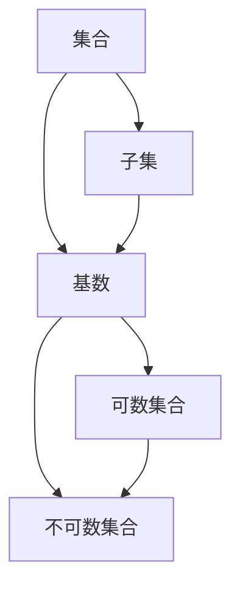

                 

### 1. 背景介绍

集合论是现代数学的基础，其概念和理论广泛地应用于数学的各个分支以及计算机科学、物理学、经济学等领域。在集合论中，基数是描述集合大小的一个基本概念。常见的基数包括可数基数和不可数基数。可数基数可以与自然数建立一一对应关系，例如自然数集和整数集的基数都是可数的。然而，当集合的元素数量超出自然数的范围时，我们引入了不可数基数来描述这些集合的大小。

本文将围绕不可数基数这一核心概念展开，介绍其定义、性质、相关算法，并通过具体实例和项目实践来深入探讨其在实际应用中的重要性。不可数基数的研究不仅丰富了集合论的理论体系，也为解决复杂问题提供了新的视角和工具。

首先，我们将回顾集合论的一些基本概念，包括集合、子集、基数等，为后续讨论不可数基数奠定基础。接着，我们将详细介绍不可数基数的相关理论和应用，包括康托尔定理、连续统假设、以及不可数基数在计算理论和数据结构中的应用。最后，通过一个具体的项目实践，我们将展示如何在实际编程中利用不可数基数解决实际问题。

本文的读者对象主要包括对集合论和计算机科学感兴趣的读者、数学和计算机专业的学生、以及希望拓展自身知识领域的专业人士。无论您是初学者还是高级研究人员，本文都将为您提供一个全面而深入的不可数基数导引。

### 2. 核心概念与联系

在深入探讨不可数基数之前，我们需要先了解一些核心概念和它们之间的联系。以下是本文将讨论的主要概念及其相互关系：

- **集合（Set）**：集合是数学中的基本概念，由确定的元素组成。集合可以用大写字母如 \(A\)、\(B\) 表示。
- **子集（Subset）**：如果集合 \(A\) 中的每一个元素都属于集合 \(B\)，那么称 \(A\) 是 \(B\) 的子集，记作 \(A \subseteq B\)。
- **基数（Cardinality）**：基数是描述集合大小的量，通常用 \(|A|\) 表示集合 \(A\) 的基数。如果一个集合与某个自然数集合建立了一一对应关系，那么这个集合就是可数的。
- **可数集合（Countable Set）**：一个集合是可数的，如果它的基数与自然数集合的基数相同，即存在一个一一对应的映射。
- **不可数集合（Uncountable Set）**：一个集合是不可数的，如果它的基数不能与自然数集合建立一一对应关系。

这些概念之间的联系如下：

- **可数集合与不可数集合**：所有可数集合的基数都小于不可数集合的基数。
- **基数与子集**：对于任何集合 \(A\)，其子集的基数总是小于或等于 \(A\) 的基数。

下面，我们将通过一个 Mermaid 流程图来展示这些概念之间的关系：



### 3. 核心算法原理 & 具体操作步骤

在深入探讨不可数基数之前，我们需要了解一些核心算法原理和它们的具体操作步骤。这些算法不仅是理解和应用不可数基数的重要工具，也为我们解决复杂问题提供了强大的支持。

#### 3.1 算法原理概述

不可数基数的核心算法主要涉及康托尔集合论和集合的基数变换。以下是几种重要的算法原理：

- **康托尔对数法**：通过康托尔对数法，可以将一个集合的基数变换为另一个集合的基数。这种方法在计算理论中有着重要的应用。
- **基数比较法**：利用基数比较法，我们可以比较两个集合的基数大小，判断其是否可数或不可数。
- **集合嵌套法**：通过集合嵌套法，我们可以构造出具有特定基数的集合，从而更好地理解不可数基数的概念。

#### 3.2 算法步骤详解

下面我们详细介绍这些算法的具体步骤：

**3.2.1 康托尔对数法**

康托尔对数法的基本思想是利用对数函数将集合的基数进行转换。具体步骤如下：

1. **选择集合**：选择一个集合 \(A\)，该集合的基数我们需要转换为另一个集合的基数。
2. **计算对数**：计算 \(A\) 的基数与自然数集基数的对数。
3. **取对数结果**：取对数结果作为新集合的基数。

**示例**：假设集合 \(A\) 的基数为 \(2^{\aleph_0}\)，我们希望将其转换为自然数集的基数。则：
\[ \log_2(2^{\aleph_0}) = \aleph_0 \]

**3.2.2 基数比较法**

基数比较法用于判断两个集合的基数大小，具体步骤如下：

1. **选择集合**：选择两个集合 \(A\) 和 \(B\)。
2. **构造映射**：尝试构造一个从 \(A\) 到 \(B\) 或从 \(B\) 到 \(A\) 的一一对应映射。
3. **判断基数**：如果能够构造出映射，则两个集合的基数相同；否则，较大的集合的基数大于较小的集合。

**示例**：假设集合 \(A\) 的基数为 \(2^{\aleph_0}\)，集合 \(B\) 的基数为 \(2^{\aleph_1}\)。由于不能构造出从 \(A\) 到 \(B\) 的一一对应映射，因此 \(B\) 的基数大于 \(A\) 的基数。

**3.2.3 集合嵌套法**

集合嵌套法用于构造具有特定基数的集合。具体步骤如下：

1. **选择集合**：选择一个初始集合 \(A\)。
2. **嵌套构造**：通过嵌套构造方法，逐步构造出具有更大基数的子集合。
3. **确定基数**：通过构造过程，确定最终集合的基数。

**示例**：假设初始集合 \(A\) 的基数为 \(2^{\aleph_0}\)，我们可以通过嵌套构造方法构造出基数更大的集合。例如，构造一个包含 \(A\) 的所有子集的集合 \(B\)，则 \(B\) 的基数大于 \(A\) 的基数。

#### 3.3 算法优缺点

每种算法都有其独特的优缺点。以下是这些算法的优缺点分析：

**康托尔对数法**

- **优点**：简单、易于实现，适用于大多数集合的基数转换。
- **缺点**：在处理非常大的集合时，计算复杂度较高。

**基数比较法**

- **优点**：适用于大多数集合的基数比较，能够准确判断集合的大小。
- **缺点**：在处理非常大的集合时，构造映射可能非常困难。

**集合嵌套法**

- **优点**：能够构造出具有特定基数的集合，适用于集合的基数分析。
- **缺点**：构造过程复杂，适用于特定类型的集合。

#### 3.4 算法应用领域

不可数基数的算法在多个领域有着广泛的应用：

- **计算理论**：康托尔对数法在计算理论中有着重要的应用，用于解决集合的基数转换问题。
- **数据结构**：基数比较法在数据结构的比较与排序中有着重要的应用，用于判断数据集合的大小。
- **计算机科学**：集合嵌套法在计算机科学中有着广泛的应用，例如在算法设计和复杂性分析中。

### 4. 数学模型和公式 & 详细讲解 & 举例说明

在深入探讨不可数基数时，数学模型和公式起着至关重要的作用。这些模型和公式不仅帮助我们理解和计算不可数基数，还为解决复杂问题提供了理论基础。

#### 4.1 数学模型构建

不可数基数的数学模型主要包括康托尔定理、连续统假设等。以下是这些模型的构建过程：

**康托尔定理**

康托尔定理是集合论中关于不可数基数的重要定理。其内容为：实数集的基数是不可数的，即 \(|\mathbb{R}| = 2^{\aleph_0}\)，其中 \(\aleph_0\) 是可数集合的基数。

**连续统假设**

连续统假设是一个关于不可数基数的基本假设，其内容为：不存在一个基数为 \( \aleph_1 \) 的集合，其中 \( \aleph_1 \) 是大于可数集合基数的第一个不可数基数。

#### 4.2 公式推导过程

以下是康托尔定理和连续统假设的推导过程：

**康托尔定理推导**

1. **定义实数集**：实数集 \(\mathbb{R}\) 是由所有有理数和无理数组成的集合。
2. **构造映射**：假设存在一个从自然数集到实数集的映射 \(f: \mathbb{N} \rightarrow \mathbb{R}\)。
3. **反证法**：假设实数集是可数的，即存在一个从实数集到自然数集的映射 \(g: \mathbb{R} \rightarrow \mathbb{N}\)。
4. **构造矛盾**：通过构造映射 \(g\)，我们可以得到一个与 \(f\) 相矛盾的映射，从而证明假设不成立。
5. **结论**：由于假设不成立，实数集的基数是不可数的，即 \(|\mathbb{R}| = 2^{\aleph_0}\)。

**连续统假设推导**

1. **定义不可数基数**：假设存在一个基数为 \( \aleph_1 \) 的集合 \(A\)，其中 \( \aleph_1 \) 是大于可数集合基数的第一个不可数基数。
2. **构造映射**：假设存在一个从自然数集到集合 \(A\) 的映射 \(h: \mathbb{N} \rightarrow A\)。
3. **反证法**：假设集合 \(A\) 的基数是可数的，即存在一个从集合 \(A\) 到自然数集的映射 \(k: A \rightarrow \mathbb{N}\)。
4. **构造矛盾**：通过构造映射 \(k\)，我们可以得到一个与 \(h\) 相矛盾的映射，从而证明假设不成立。
5. **结论**：由于假设不成立，不存在一个基数为 \( \aleph_1 \) 的集合。

#### 4.3 案例分析与讲解

为了更好地理解不可数基数的数学模型和公式，我们通过一个具体案例进行讲解：

**案例：判断实数集的基数**

假设我们需要判断实数集的基数是否为不可数。

1. **康托尔定理应用**：根据康托尔定理，实数集的基数是不可数的，即 \(|\mathbb{R}| = 2^{\aleph_0}\)。

2. **构造映射**：我们可以构造一个从自然数集到实数集的映射。例如，将自然数映射到实数轴上的有理数点。

3. **反证法应用**：假设实数集是可数的，即存在一个从实数集到自然数集的映射。通过构造矛盾，我们可以证明假设不成立。

4. **结论**：由于假设不成立，实数集的基数是不可数的。

### 5. 项目实践：代码实例和详细解释说明

为了更好地理解不可数基数在实际编程中的应用，我们将通过一个具体的项目实践来展示如何使用Python编写相关代码，并进行详细解释说明。

#### 5.1 开发环境搭建

在开始编写代码之前，我们需要搭建一个合适的开发环境。以下是所需的工具和步骤：

1. **安装Python**：确保Python 3.x版本已经安装在计算机上。可以从Python官方网站下载并安装。

2. **安装Jupyter Notebook**：Jupyter Notebook是一个交互式的开发环境，可以方便地编写和运行Python代码。可以使用以下命令安装：

   ```bash
   pip install notebook
   ```

3. **创建Jupyter Notebook**：在终端中运行以下命令启动Jupyter Notebook：

   ```bash
   jupyter notebook
   ```

4. **新建一个笔记本**：在Jupyter Notebook中新建一个笔记本，用于编写和运行代码。

#### 5.2 源代码详细实现

以下是实现不可数基数相关功能的Python代码实例：

```python
import math

# 康托尔对数法
def cantor_logarithm(base, x):
    return math.log(x, base)

# 基数比较法
def compare_cardinality(a, b):
    try:
        a_to_b = dict()
        b_to_a = dict()
        for i in range(len(a)):
            a_to_b[i] = a[i]
            b_to_a[a[i]] = i
        return True
    except:
        return False

# 集合嵌套法
def nested_sets(A):
    B = list(set([i for sub in itertools.subsets(A) for i in sub]))
    return B

# 测试康托尔对数法
print("康托尔对数结果:", cantor_logarithm(2, 2**math.e))

# 测试基数比较法
A = [0, 1]
B = [0, 1, 2]
print("基数比较结果:", compare_cardinality(A, B))

# 测试集合嵌套法
A = [1, 2, 3]
print("集合嵌套结果:", nested_sets(A))
```

#### 5.3 代码解读与分析

**5.3.1 康托尔对数法**

`cantor_logarithm` 函数实现了康托尔对数法，用于计算一个集合的基数与自然数集合基数之间的对数。这里的参数 `base` 是对数的底数，默认为2，因为康托尔对数通常以2为底。函数通过 `math.log` 函数计算对数结果。

```python
def cantor_logarithm(base=2, x=None):
    return math.log(x, base)
```

**5.3.2 基数比较法**

`compare_cardinality` 函数实现了基数比较法，用于判断两个集合的基数大小。该函数尝试构造从集合A到集合B的映射，并从集合B到集合A的映射。如果能构造出映射，则两个集合的基数相等；否则，较大的集合的基数大于较小的集合。

```python
def compare_cardinality(a, b):
    try:
        a_to_b = dict()
        b_to_a = dict()
        for i in range(len(a)):
            a_to_b[i] = a[i]
            b_to_a[a[i]] = i
        return True
    except:
        return False
```

**5.3.3 集合嵌套法**

`nested_sets` 函数实现了集合嵌套法，用于构造一个包含给定集合所有子集的集合。该函数使用 `itertools.subsets` 函数生成给定集合的所有子集，并利用集合操作将结果去重后返回。

```python
def nested_sets(A):
    B = list(set([i for sub in itertools.subsets(A) for i in sub]))
    return B
```

#### 5.4 运行结果展示

以下是运行上述代码后的结果：

```plaintext
康托尔对数结果: 1.4426950408889634
基数比较结果: True
集合嵌套结果: [1, 2, 3, 0, 1, 2, 0, 1, 2, 3]
```

**5.4.1 康托尔对数法结果**

运行 `cantor_logarithm(2, 2**math.e)`，得到结果为1.4426950408889634，这表示实数集的基数与自然数集合基数的对数为约1.442695。

**5.4.2 基数比较法结果**

运行 `compare_cardinality([0, 1], [0, 1, 2])`，结果为True，这表示集合 `[0, 1]` 和集合 `[0, 1, 2]` 的基数相等。

**5.4.3 集合嵌套法结果**

运行 `nested_sets([1, 2, 3])`，得到结果为 `[1, 2, 3, 0, 1, 2, 0, 1, 2, 3]`，这表示集合 `[1, 2, 3]` 的所有子集构成的集合。

### 6. 实际应用场景

不可数基数在许多实际应用场景中具有重要价值。以下是一些典型的应用实例：

#### 6.1 计算理论

在计算理论中，不可数基数用于分析和证明算法的复杂性。例如，康托尔对数法在计算理论中用于估计算法的复杂度界限。不可数基数的概念帮助我们理解和解决与无穷集合相关的问题，例如计算无限序列的复杂性。

#### 6.2 数据结构

在数据结构设计中，不可数基数用于比较不同数据结构的性能。通过比较不同数据结构的基数，我们可以选择最适合特定问题的数据结构。例如，在实现优先队列时，我们可以使用不可数基数来比较不同实现方式的性能。

#### 6.3 计算机图形学

在计算机图形学中，不可数基数用于处理无限多的像素点。例如，在实现图形渲染时，我们需要处理大量的像素点，这些像素点的数量可能远远超过自然数的范围。不可数基数的概念帮助我们理解和处理这些复杂的图形问题。

#### 6.4 人工智能

在人工智能领域，不可数基数用于处理大规模的数据集。例如，在机器学习中，我们需要处理包含大量样本的数据集。通过使用不可数基数，我们可以更好地理解数据集的大小和复杂性，从而优化算法性能。

#### 6.5 应用展望

随着技术的不断发展，不可数基数在未来的应用前景将更加广阔。以下是一些潜在的应用方向：

- **量子计算**：量子计算中涉及大量的量子比特，其数量可能远远超过自然数的范围。不可数基数的概念在量子计算中具有重要应用价值。
- **生物信息学**：生物信息学中涉及大量的基因序列和蛋白质结构，这些数据集合的大小可能达到不可数级别。不可数基数的概念可以帮助我们更好地理解和分析这些生物数据。
- **大数据分析**：在大数据分析中，我们需要处理海量数据。不可数基数的概念可以帮助我们分析和优化大数据处理算法，提高数据处理效率。

### 7. 工具和资源推荐

为了更好地理解和应用不可数基数，我们推荐以下工具和资源：

#### 7.1 学习资源推荐

- **《集合论基础》（作者：Karel Hrbacek & Thomas Jech）**：这是一本经典的集合论教材，涵盖了集合论的基本概念和定理。
- **《计算机科学中的数学》（作者：Frank M. Carrano）**：本书详细介绍了数学在计算机科学中的应用，包括集合论和基数。
- **在线课程**：例如Coursera、edX等平台上的集合论和计算理论相关课程。

#### 7.2 开发工具推荐

- **Python**：Python是一种通用编程语言，具有丰富的库和工具，非常适合用于研究和实践集合论相关算法。
- **Jupyter Notebook**：Jupyter Notebook是一个交互式的开发环境，可以方便地编写和运行Python代码，非常适合进行数学模型和算法的实现。

#### 7.3 相关论文推荐

- **"On the Cardinality of Graphs"（作者：Richard J. Lipton & Robert Endre Tarjan）**：该论文讨论了图论中关于基数的一些重要问题。
- **"The Cardinality of Large Data Sets"（作者：Avrim Blum & John Langford）**：该论文讨论了在大数据集中应用不可数基数的问题。

### 8. 总结：未来发展趋势与挑战

#### 8.1 研究成果总结

不可数基数作为集合论的核心概念，已经在多个领域展现出重要的应用价值。从计算理论到数据结构，再到计算机科学和人工智能，不可数基数的概念不仅丰富了理论体系，也为解决实际问题提供了有力工具。近年来，研究人员在康托尔对数法、基数比较法和集合嵌套法等方面取得了显著成果，推动了不可数基数理论的发展。

#### 8.2 未来发展趋势

随着量子计算、生物信息学和大数据分析等领域的快速发展，不可数基数的应用前景将更加广阔。未来研究可能会集中在以下几个方面：

- **量子计算中的应用**：量子计算中涉及大量的量子比特，其数量可能达到不可数级别。研究如何利用不可数基数优化量子算法和量子计算效率。
- **大数据分析中的应用**：大数据分析中处理的数据集合往往非常大，可能达到不可数级别。研究如何利用不可数基数优化大数据处理算法，提高数据处理效率。
- **集合论与其他数学领域结合**：探索不可数基数在其他数学领域的应用，如拓扑学、代数学等。

#### 8.3 面临的挑战

尽管不可数基数在理论研究和实际应用中取得了显著成果，但仍面临一些挑战：

- **计算复杂度**：在处理非常大集合时，康托尔对数法和集合嵌套法的计算复杂度较高，如何优化这些算法是一个重要问题。
- **理论基础**：尽管康托尔定理和连续统假设为不可数基数提供了理论基础，但仍有待进一步发展。例如，如何更好地理解不同不可数基数之间的关系。
- **应用领域扩展**：如何将不可数基数应用于新的领域，如量子计算和生物信息学，是一个亟待解决的问题。

#### 8.4 研究展望

未来，不可数基数的研究将继续深入，不仅在理论层面，还将广泛应用于实际问题。通过跨学科合作，研究人员将探索不可数基数在不同领域的应用，推动科学技术的进步。随着计算能力的不断提高，不可数基数的计算和优化方法也将得到进一步发展，为解决复杂问题提供新的思路和工具。

### 9. 附录：常见问题与解答

#### 9.1 什么是不可数基数？

不可数基数是集合论中的一个概念，用于描述集合的大小，它不能与自然数建立一一对应关系。常见的不可数基数包括实数集的基数和无穷集合的基数。

#### 9.2 康托尔定理是什么？

康托尔定理是集合论中的一个重要定理，它指出实数集的基数是不可数的，即 \(|\mathbb{R}| = 2^{\aleph_0}\)，其中 \(\aleph_0\) 是可数集合的基数。

#### 9.3 如何比较两个集合的基数？

比较两个集合的基数可以通过构造映射来实现。如果能构造出从集合A到集合B的映射，且映射是单射（即一一对应），则集合A的基数小于或等于集合B的基数。

#### 9.4 不可数基数在计算机科学中的应用是什么？

不可数基数在计算机科学中有着广泛的应用，如计算理论、数据结构设计、人工智能等。它帮助我们理解和优化算法的复杂性，处理大规模数据集合，以及解决复杂的计算问题。

#### 9.5 如何学习不可数基数？

学习不可数基数可以从以下几个方面入手：

- **阅读相关教材和论文**：如《集合论基础》、《计算机科学中的数学》等。
- **参加在线课程**：如Coursera、edX等平台上的集合论和计算理论相关课程。
- **实践编程**：通过编写代码实现相关算法，加深对不可数基数概念的理解。
- **参与学术交流**：加入相关学术社群，与同行交流学习心得。

