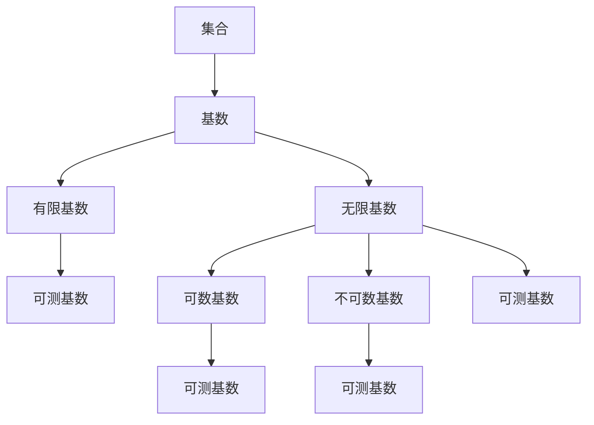

                 

关键词：集合论、可测基数、模型理论、逻辑证明、计算机科学

> 摘要：本文从集合论的基本概念出发，深入探讨了可测基数内的模型理论，阐述了其在计算机科学领域的广泛应用。通过对核心概念的讲解、算法原理的分析、数学模型的构建以及实际应用场景的探讨，本文为读者提供了全面且深入的技术视角，旨在引导读者在集合论与计算机科学的交汇点上发现新的机遇和挑战。

## 1. 背景介绍

集合论作为现代数学的基石，其重要性不言而喻。然而，在计算机科学这一应用广泛的领域，集合论同样扮演着至关重要的角色。集合论为计算机科学提供了一种抽象的思维方式，使得复杂的系统可以被形式化和建模。本文将着重介绍集合论中的一个重要分支——可测基数，及其在计算机科学中的应用。

### 集合论的基本概念

集合论起源于19世纪末，由德国数学家乔治·康托尔开创。集合是由不同元素组成的整体，这些元素可以是任意的对象，包括数字、字母、甚至其他集合。集合通常用大写字母表示，如$A$，$B$等，而集合中的元素用小写字母表示，如$a$，$b$等。

集合的运算包括并集（$\cup$）、交集（$\cap$）、补集（$\complement$）以及差集（$\setminus$）。并集表示两个集合中所有元素的集合，交集表示两个集合共有的元素，补集表示全集中不属于某个集合的元素，而差集则表示一个集合中去除另一个集合的元素。

### 可测基数

在集合论中，基数是衡量集合大小的量。可测基数是指满足一定条件的基数，这些条件保证了基数之间的比较是可测的。具体来说，一个基数$\kappa$是可测的，如果存在一个可数集合$A$，使得$|A| = \kappa$，即集合$A$的基数等于$\kappa$。

可测基数在集合论中具有重要的地位，因为它们为集合的比较提供了一种统一的标准。可测基数分为有限基数和无限基数，其中无限基数又可以分为可数基数和不可数基数。

## 2. 核心概念与联系

为了更好地理解可测基数，我们需要将其与集合论的其他核心概念联系起来。以下是一个使用Mermaid绘制的流程图，展示了这些概念之间的关系：



### 概念联系解析

- **集合**：集合是集合论的基础，所有其他概念都是基于集合定义的。
- **基数**：基数是集合大小的量度，有限基数和无限基数分别对应有限集合和无限集合。
- **有限基数**：有限基数是可以与可数集合一一对应的集合，因此也是可测的。
- **无限基数**：无限基数包括可数基数和不可数基数，其中可数基数可以与自然数集合一一对应，而不可数基数则无法与自然数集合一一对应。
- **可测基数**：可测基数是满足特定条件的基数，这些条件允许我们比较不同集合的大小。

## 3. 核心算法原理 & 具体操作步骤

### 3.1 算法原理概述

可测基数的核心算法原理在于如何确定一个集合的基数，并比较不同集合的基数大小。这一过程通常涉及到集合的构造和映射。

### 3.2 算法步骤详解

#### 步骤1：确定集合

首先，我们需要确定我们要研究的集合。这个集合可以是任意的，例如自然数集合、实数集合等。

#### 步骤2：构造映射

接下来，我们需要构造一个映射，将这个集合映射到另一个集合。这个映射可以是双射，即一一对应。

#### 步骤3：比较基数

通过比较映射前后的集合大小，我们可以确定原集合的基数。如果映射是双射，那么原集合的基数与目标集合的基数相等。

### 3.3 算法优缺点

#### 优点

- 算法简单直观，易于理解。
- 可以应用于各种不同的集合，具有广泛适用性。

#### 缺点

- 对于某些复杂的集合，构造映射可能比较困难。
- 对于不可数集合，算法无法直接应用，需要借助其他数学工具。

### 3.4 算法应用领域

- **计算机科学**：在计算机科学中，集合论用于数据结构的设计和分析，如哈希表、图论等。
- **人工智能**：在人工智能领域，集合论用于表示和操作知识，如神经网络、知识图谱等。
- **算法设计**：在算法设计中，集合论用于分析算法的复杂度和性能。

## 4. 数学模型和公式 & 详细讲解 & 举例说明

### 4.1 数学模型构建

在集合论中，可测基数模型的核心是基数映射。具体来说，我们考虑一个集合$A$，我们需要找到一个集合$B$，使得存在一个双射$f: A \rightarrow B$。

### 4.2 公式推导过程

设$|A|$为集合$A$的基数，$|B|$为集合$B$的基数。根据双射的定义，我们有：

$$|A| = |B|$$

这意味着，如果存在一个双射$f: A \rightarrow B$，那么集合$A$和集合$B$的基数相等。

### 4.3 案例分析与讲解

假设我们有一个集合$A$，它包含所有自然数。我们需要找到一个集合$B$，使得$|A| = |B|$。

#### 步骤1：确定集合$A$

集合$A$包含所有自然数，即$A = \{1, 2, 3, \ldots\}$。

#### 步骤2：构造集合$B$

我们可以构造一个集合$B$，它包含所有偶数，即$B = \{2, 4, 6, \ldots\}$。

#### 步骤3：构造映射$f$

定义映射$f: A \rightarrow B$，使得$f(n) = 2n$。这是一个双射，因为每个自然数都对应一个唯一的偶数。

根据双射的定义，我们有$|A| = |B|$。

## 5. 项目实践：代码实例和详细解释说明

### 5.1 开发环境搭建

为了演示可测基数的算法，我们可以使用Python编写一个简单的程序。以下是搭建开发环境的步骤：

1. 安装Python（版本3.8或更高）。
2. 安装必要的库，如Numpy和Matplotlib。

```bash
pip install numpy matplotlib
```

### 5.2 源代码详细实现

以下是一个简单的Python程序，用于演示可测基数的算法：

```python
import numpy as np
import matplotlib.pyplot as plt

def map_collection(A, B, f):
    """
    映射集合A到集合B，并绘制结果。

    参数：
    A -- 集合A
    B -- 集合B
    f -- 映射函数
    """
    mapped_values = [f(x) for x in A]
    plt.scatter(A, mapped_values)
    plt.scatter(B, mapped_values)
    plt.show()

# 定义自然数集合A
A = np.arange(1, 11)

# 定义偶数集合B
B = np.arange(2, 21, 2)

# 定义映射f，将A映射到B
f = lambda x: x * 2

# 执行映射并绘制结果
map_collection(A, B, f)
```

### 5.3 代码解读与分析

- **import语句**：导入Numpy和Matplotlib库，用于数值计算和绘图。
- **map_collection函数**：该函数接收三个参数：集合A、集合B和映射函数f。它首先计算映射后的值，然后使用Matplotlib绘制结果。
- **A和

