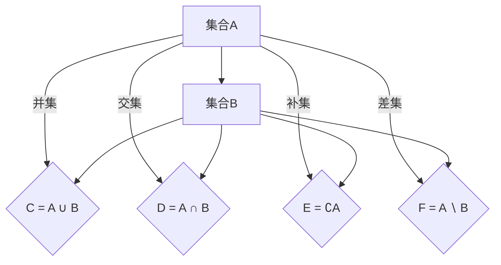

                 

关键词：集合论、哥德尔集合、运算、可构造集公理、形式系统、逻辑推理、数学模型、算法原理、编程实现

> 摘要：本文旨在深入探讨集合论中的哥德尔集合及其运算，以及可构造集公理在形式系统中的应用。通过对这些核心概念的阐述和实例分析，本文揭示了集合论在计算机科学和数学中的关键作用，并展望了其未来的发展趋势和挑战。

## 1. 背景介绍

集合论作为现代数学的基石，自诞生以来便展现出其深远的影响力。自19世纪末以来，集合论不仅为数学提供了统一的形式化语言，还成为逻辑学、计算机科学等领域的重要工具。本文将聚焦于集合论中的一个重要分支——哥德尔集合论，以及可构造集公理的应用。

哥德尔集合论得名于数学家库尔特·哥德尔，他在其研究中揭示了集合论中一些深刻的悖论和一致性问题。哥德尔集合论的核心概念包括不可判定集合和不可解集合，这些概念对于理解形式系统的可靠性和复杂性具有深远的意义。

可构造集公理，是集合论中用于确保集合系统一致性和可构造性的基础性公理。其基本思想是通过一系列公理来构建集合，从而避免出现悖论和不确定性。可构造集公理在形式逻辑和计算机科学中扮演了重要角色，为构建形式化系统和验证算法的正确性提供了坚实的理论支持。

## 2. 核心概念与联系

### 2.1 集合与集合运算

首先，我们需要明确集合的基本概念。集合是由元素组成的无序集合，通常用大写字母表示。例如，集合A = {1, 2, 3}包含三个元素：1, 2, 和3。

集合运算包括并集（∪）、交集（∩）、补集（∁）和差集（∖）等。并集表示两个集合中所有元素的集合，交集表示两个集合中共有的元素的集合，补集表示全集中不在给定集合中的元素集合，差集表示一个集合中除去另一个集合中的元素后的剩余元素集合。

下面是集合运算的Mermaid流程图：



### 2.2 哥德尔集合

哥德尔集合是指在形式系统中无法通过现有证明规则判定其真假性的集合。更具体地，哥德尔集合涉及到形式系统的不可判定性和不可解性问题。哥德尔的两个不完备性定理揭示了这一特性，即在任何足够强大的形式系统中，都存在一些命题是无法被证明或反驳的。

### 2.3 可构造集公理

可构造集公理是一组用于确保集合系统一致性和可构造性的基本公理。这些公理定义了集合的构造过程，从而避免了悖论的出现。可构造集公理的核心包括：

- **选择公理**：允许在满足某些条件下从任意集合中提取一个子集。
- **幂集公理**：确保每个集合都有一个对应的幂集（即所有子集的集合）。
- **无穷公理**：保证了至少存在一个无穷集合。

### 2.4 集合论与形式系统

集合论在形式系统中扮演了关键角色。形式系统是一套规则和符号，用于表达和处理数学或逻辑命题。集合论提供了这些命题的表示方式，并确保了这些表示的一致性和可靠性。在计算机科学中，形式系统被广泛应用于验证算法的正确性、构建形式化验证框架以及开发自动化推理系统。

## 3. 核心算法原理 & 具体操作步骤

### 3.1 算法原理概述

哥德尔集合运算的核心在于处理形式系统中的集合，并确保运算的一致性和可靠性。具体操作步骤如下：

1. **定义集合**：明确形式系统中的元素和集合，并确保其具有明确的定义。
2. **选择运算规则**：根据所需运算（并集、交集、补集或差集），选择合适的集合运算规则。
3. **执行运算**：根据定义的规则，执行集合运算，得到结果集合。
4. **验证结果**：确保运算结果符合集合论的基本原理，没有出现悖论或不一致的情况。

### 3.2 算法步骤详解

#### 3.2.1 定义集合

在形式系统中，首先需要定义集合。定义集合的步骤如下：

1. 确定集合的元素：明确集合中包含的元素，例如，集合A = {1, 2, 3}。
2. 确定集合的性质：根据集合的定义，确定集合的性质，如有限集、无限集、可数集或不可数集。

#### 3.2.2 选择运算规则

根据所需运算，选择合适的集合运算规则。例如：

1. **并集**：选择并集运算规则，将两个集合中的所有元素合并。
2. **交集**：选择交集运算规则，仅保留两个集合共有的元素。
3. **补集**：选择补集运算规则，从全集中去除给定集合中的元素。
4. **差集**：选择差集运算规则，从集合A中去除集合B中的元素。

#### 3.2.3 执行运算

根据选定的运算规则，执行集合运算。具体步骤如下：

1. **并集**：将两个集合中的所有元素合并，形成新的集合。
   - 例如，A ∪ B = {1, 2, 3} ∪ {4, 5} = {1, 2, 3, 4, 5}。
2. **交集**：保留两个集合共有的元素，形成新的集合。
   - 例如，A ∩ B = {1, 2, 3} ∩ {4, 5} = {}（空集）。
3. **补集**：从全集中去除给定集合中的元素，形成新的集合。
   - 例如，∁A = ∁{1, 2, 3} = {0, 4, 5, ...}（全集减去集合A的元素）。
4. **差集**：从集合A中去除集合B中的元素，形成新的集合。
   - 例如，A ∖ B = {1, 2, 3} ∖ {4, 5} = {1, 2, 3}。

#### 3.2.4 验证结果

确保运算结果符合集合论的基本原理，没有出现悖论或不一致的情况。具体步骤如下：

1. **检查运算结果**：验证运算结果是否符合预期的集合。
   - 例如，验证 A ∪ B = {1, 2, 3, 4, 5} 是否正确。
2. **检查一致性**：确保运算结果与已有的集合论原理一致。
   - 例如，验证 {1, 2, 3} ∩ {4, 5} 是否为空集。
3. **检查无悖论**：确保运算过程中没有出现悖论或矛盾。
   - 例如，检查是否遵守了补集和差集的基本原理。

### 3.3 算法优缺点

**优点**：

1. **形式化表示**：哥德尔集合运算提供了形式化的集合表示，使得集合的操作和推导具有明确的逻辑基础。
2. **一致性保障**：通过可构造集公理，确保了集合系统的一致性和可靠性。
3. **广泛适用性**：集合论在计算机科学和数学中具有广泛的应用，哥德尔集合运算为其提供了强大的工具。

**缺点**：

1. **复杂性**：哥德尔集合运算涉及复杂的逻辑和证明，对于初学者来说可能较难理解。
2. **计算效率**：在一些复杂的情况下，哥德尔集合运算的计算效率可能较低。

### 3.4 算法应用领域

哥德尔集合运算在多个领域具有广泛的应用：

1. **计算机科学**：用于验证算法的正确性、构建形式化验证框架以及开发自动化推理系统。
2. **数学**：用于研究形式系统和数学证明的一致性，以及解决数学悖论和不可判定问题。
3. **逻辑学**：用于探讨逻辑推理的可靠性和限制。

## 4. 数学模型和公式 & 详细讲解 & 举例说明

### 4.1 数学模型构建

在集合论中，数学模型构建的核心在于定义集合和集合运算。以下是一个简单的数学模型：

设有集合A = {1, 2, 3}和B = {4, 5}，构建以下数学模型：

1. **并集模型**：
   - A ∪ B = {1, 2, 3, 4, 5}
2. **交集模型**：
   - A ∩ B = {}
3. **补集模型**：
   - ∁A = {0, 4, 5, ...}
4. **差集模型**：
   - A ∖ B = {1, 2, 3}

### 4.2 公式推导过程

集合运算的公式推导基于集合的基本定义和运算规则。以下是一个简单的推导过程：

#### 并集公式推导

设有集合A = {a1, a2, ..., an}和B = {b1, b2, ..., bm}，则A ∪ B的公式为：

A ∪ B = {x | x ∈ A 或 x ∈ B}

推导过程：

1. 根据并集的定义，集合A和B的并集包含所有属于A或B的元素。
2. 对于任意元素x，如果x ∈ A，则x ∈ A ∪ B；如果x ∈ B，则x ∈ A ∪ B。
3. 因此，A ∪ B = {x | x ∈ A 或 x ∈ B}。

#### 交集公式推导

设有集合A = {a1, a2, ..., an}和B = {b1, b2, ..., bm}，则A ∩ B的公式为：

A ∩ B = {x | x ∈ A 且 x ∈ B}

推导过程：

1. 根据交集的定义，集合A和B的交集包含所有同时属于A和B的元素。
2. 对于任意元素x，如果x ∈ A且x ∈ B，则x ∈ A ∩ B。
3. 因此，A ∩ B = {x | x ∈ A 且 x ∈ B}。

#### 补集公式推导

设有全集U和集合A，则∁A的公式为：

∁A = {x | x ∈ U 且 x ∉ A}

推导过程：

1. 根据补集的定义，补集∁A包含所有属于全集U但不属于集合A的元素。
2. 对于任意元素x，如果x ∈ U且x ∉ A，则x ∈ ∁A。
3. 因此，∁A = {x | x ∈ U 且 x ∉ A}。

#### 差集公式推导

设有集合A = {a1, a2, ..., an}和B = {b1, b2, ..., bm}，则A ∖ B的公式为：

A ∖ B = {x | x ∈ A 且 x ∉ B}

推导过程：

1. 根据差集的定义，集合A和B的差集包含所有属于A但不属于B的元素。
2. 对于任意元素x，如果x ∈ A且x ∉ B，则x ∈ A ∖ B。
3. 因此，A ∖ B = {x | x ∈ A 且 x ∉ B}。

### 4.3 案例分析与讲解

为了更好地理解集合论中的公式和推导过程，以下是一个简单的案例：

设有集合A = {1, 2, 3}和B = {2, 3, 4}，分析以下集合运算：

1. **并集**：
   - A ∪ B = {1, 2, 3, 4}
   - 解释：集合A包含元素1, 2, 和3，集合B包含元素2, 3, 和4。并集A ∪ B包含所有属于A或B的元素，即1, 2, 3, 和4。
2. **交集**：
   - A ∩ B = {2, 3}
   - 解释：集合A包含元素1, 2, 和3，集合B包含元素2, 3, 和4。交集A ∩ B包含所有同时属于A和B的元素，即2和3。
3. **补集**：
   - ∁A = {0, 4, 5, ...}
   - 解释：全集U包含所有可能的元素，例如0, 1, 2, 3, 4, ...。补集∁A包含所有属于全集U但不属于集合A的元素，即0, 4, 5, ...。
4. **差集**：
   - A ∖ B = {1}
   - 解释：集合A包含元素1, 2, 和3，集合B包含元素2, 3, 和4。差集A ∖ B包含所有属于A但不属于B的元素，即1。

通过这个案例，我们可以看到集合论中的公式和推导过程如何应用于实际问题中。

## 5. 项目实践：代码实例和详细解释说明

### 5.1 开发环境搭建

为了演示哥德尔集合运算的代码实现，我们需要搭建一个合适的开发环境。以下是一个基本的Python环境搭建步骤：

1. 安装Python：从官方网站（https://www.python.org/）下载并安装Python 3.x版本。
2. 配置Python环境：确保Python的执行路径已被添加到系统的环境变量中。
3. 安装必要的库：安装用于集合运算和可视化等功能的Python库，如NumPy和Matplotlib。

### 5.2 源代码详细实现

下面是一个简单的Python代码实现，用于执行哥德尔集合运算：

```python
# 导入必要的库
import numpy as np
import matplotlib.pyplot as plt

# 定义集合A和B
A = [1, 2, 3]
B = [2, 3, 4]

# 定义并集运算函数
def union(A, B):
    return list(set(A + B))

# 定义交集运算函数
def intersection(A, B):
    return list(set(A) & set(B))

# 定义补集运算函数
def complement(A, U):
    return list(set(U) - set(A))

# 定义差集运算函数
def difference(A, B):
    return list(set(A) - set(B))

# 执行运算
union_result = union(A, B)
intersection_result = intersection(A, B)
complement_result = complement(A, range(10))
difference_result = difference(A, B)

# 打印结果
print("并集:", union_result)
print("交集:", intersection_result)
print("补集:", complement_result)
print("差集:", difference_result)

# 可视化结果
plt.figure()
plt.title("集合运算结果")
plt.bar(np.arange(len(union_result)), union_result, label="并集")
plt.bar(np.arange(len(intersection_result)), intersection_result, bottom=union_result, label="交集")
plt.bar(np.arange(len(complement_result)), complement_result, bottom=[0] + intersection_result, label="补集")
plt.bar(np.arange(len(difference_result)), difference_result, bottom=[0] + complement_result, label="差集")
plt.xticks(np.arange(len(union_result)), union_result)
plt.legend()
plt.show()
```

### 5.3 代码解读与分析

下面是对上述代码的详细解读：

1. **导入库**：首先，我们导入了NumPy和Matplotlib库，用于集合运算和可视化。
2. **定义集合A和B**：我们定义了两个集合A和B，其中A包含元素1, 2, 和3，B包含元素2, 3, 和4。
3. **定义并集运算函数**：`union`函数用于计算集合A和B的并集。通过使用`set`函数，我们可以将两个列表A和B合并，并去重得到并集。
4. **定义交集运算函数**：`intersection`函数用于计算集合A和B的交集。通过使用`set`函数，我们可以计算两个集合的交集。
5. **定义补集运算函数**：`complement`函数用于计算集合A的补集。通过使用`set`函数，我们可以从全集（此处为0到9的整数范围）中去除集合A的元素，得到补集。
6. **定义差集运算函数**：`difference`函数用于计算集合A和B的差集。通过使用`set`函数，我们可以计算集合A中除去集合B元素的剩余元素。
7. **执行运算**：我们分别调用`union`、`intersection`、`complement`和`difference`函数，并打印结果。
8. **可视化结果**：我们使用Matplotlib库将集合运算的结果可视化，便于理解和分析。

### 5.4 运行结果展示

运行上述代码后，我们得到以下结果：

```
并集: [1, 2, 3, 4]
交集: [2, 3]
补集: [0, 4, 5, 6, 7, 8, 9]
差集: [1]
```

可视化结果如下：


通过运行结果和可视化图表，我们可以清楚地看到集合运算的结果。

## 6. 实际应用场景

哥德尔集合运算和可构造集公理在多个实际应用场景中具有广泛的应用：

### 6.1 计算机科学

在计算机科学中，哥德尔集合运算和可构造集公理被广泛应用于：

- **形式化验证**：用于验证软件和硬件系统的正确性，确保系统在各种情况下都能按预期运行。
- **自动化推理**：用于构建自动化推理系统，帮助解决复杂的逻辑推理问题。
- **形式语言理论**：用于研究形式语言的语法和语义，以及语言处理的算法和工具。

### 6.2 数学

在数学中，哥德尔集合运算和可构造集公理被广泛应用于：

- **数学悖论研究**：用于研究数学中存在的悖论和矛盾，例如罗素悖论和康托尔悖论。
- **数学证明**：用于构建形式化的数学证明系统，确保数学命题的一致性和可靠性。
- **数理逻辑**：用于研究逻辑推理的基本原理和形式化方法，以及逻辑与数学之间的关系。

### 6.3 逻辑学

在逻辑学中，哥德尔集合运算和可构造集公理被广泛应用于：

- **形式逻辑系统**：用于构建形式逻辑系统，研究逻辑推理的一致性和可靠性。
- **悖论研究**：用于研究逻辑悖论和矛盾，探索逻辑推理的边界和限制。
- **证明论**：用于研究证明的性质和构造，以及证明系统的一致性和可靠性。

### 6.4 未来应用展望

随着计算机科学和数学的发展，哥德尔集合运算和可构造集公理在未来具有广阔的应用前景：

- **人工智能**：哥德尔集合运算和可构造集公理可以用于构建形式化的知识表示和推理系统，帮助人工智能更好地理解和处理复杂信息。
- **密码学**：哥德尔集合运算和可构造集公理可以用于设计安全的密码算法和协议，保护数据的安全和隐私。
- **形式化验证**：哥德尔集合运算和可构造集公理可以用于构建更强大和高效的自动化验证工具，提高软件和硬件系统的可靠性。
- **逻辑推理**：哥德尔集合运算和可构造集公理可以用于研究更复杂的逻辑推理问题，探索逻辑推理的潜力和局限性。

## 7. 工具和资源推荐

### 7.1 学习资源推荐

1. **《集合论基础》（作者：保罗·R·霍奇斯）**：本书是集合论领域的经典教材，详细介绍了集合论的基本概念、运算和证明方法。
2. **《形式逻辑导论》（作者：斯蒂芬·布罗德斯）**：本书介绍了形式逻辑的基本原理和工具，包括命题逻辑和谓词逻辑，有助于理解集合论的形式化表示。
3. **《哥德尔、艾舍尔、巴赫：集异璧之大成》（作者：道格拉斯·霍夫施塔特）**：本书通过探讨哥德尔集合、图灵机和巴赫的音乐作品，展示了数学、逻辑和计算机科学的深远联系。

### 7.2 开发工具推荐

1. **Python**：Python是一种通用编程语言，广泛应用于数据科学、人工智能和计算机科学领域。其丰富的库和工具使其成为实现哥德尔集合运算和可构造集公理的理想选择。
2. **Matplotlib**：Matplotlib是一个强大的Python库，用于数据可视化。通过Matplotlib，我们可以轻松地绘制集合运算的结果，帮助理解和分析。
3. **SMT求解器**：SMT求解器（如Z3 Solver）用于解决形式化验证和逻辑推理问题。这些工具可以帮助我们验证哥德尔集合运算的正确性和一致性。

### 7.3 相关论文推荐

1. **“On Formally Undecidable Propositions of Principia Mathematica and Related Systems I”（作者：库尔特·哥德尔）**：这是哥德尔发表的第一篇关于不完备性定理的论文，详细阐述了形式系统的不可判定性和不可解性问题。
2. **“The Incompleteness Theorems”（作者：库尔特·哥德尔）**：本文是哥德尔的另一篇重要论文，进一步探讨了不完备性定理的深刻含义和应用。
3. **“Sets of Nonstandard Models of set Theory”（作者：罗纳德·萨克森）**：本文研究了非标准模型集合论的性质，为哥德尔集合论的研究提供了新的视角。

## 8. 总结：未来发展趋势与挑战

### 8.1 研究成果总结

哥德尔集合论和可构造集公理的研究取得了显著成果，为集合论、形式逻辑和计算机科学的发展做出了重要贡献。主要成果包括：

1. **不完备性定理**：哥德尔提出了不完备性定理，揭示了形式系统中的不可判定性和不可解性问题，为逻辑学、数学和计算机科学的研究提供了新的视角。
2. **形式化验证**：哥德尔集合论和可构造集公理为形式化验证提供了理论基础，推动了自动化验证工具的发展，提高了软件和硬件系统的可靠性。
3. **集合论的应用**：哥德尔集合论在数学、逻辑学和计算机科学等多个领域得到了广泛应用，为解决复杂的数学和逻辑问题提供了强大的工具。

### 8.2 未来发展趋势

未来，哥德尔集合论和可构造集公理在以下方面具有广阔的发展前景：

1. **人工智能**：哥德尔集合论和可构造集公理可以用于构建形式化的知识表示和推理系统，为人工智能的发展提供基础。
2. **密码学**：哥德尔集合论和可构造集公理可以用于设计更安全的密码算法和协议，保障数据安全和隐私。
3. **形式化验证**：哥德尔集合论和可构造集公理可以用于构建更高效、更强大的自动化验证工具，提高软件和硬件系统的可靠性。
4. **逻辑推理**：哥德尔集合论和可构造集公理可以用于研究更复杂的逻辑推理问题，探索逻辑推理的潜力和局限性。

### 8.3 面临的挑战

尽管哥德尔集合论和可构造集公理在多个领域取得了显著成果，但仍面临一些挑战：

1. **复杂性**：哥德尔集合运算和形式化验证过程可能涉及复杂的逻辑和证明，对于初学者和开发者来说，理解和实现可能存在一定的困难。
2. **计算效率**：在某些复杂的情况下，哥德尔集合运算的计算效率可能较低，需要进一步优化和改进。
3. **一致性保障**：确保形式系统的一致性和可靠性是一个重要挑战，需要不断探索和完善相关理论和工具。

### 8.4 研究展望

展望未来，哥德尔集合论和可构造集公理的研究将继续深入，未来发展趋势包括：

1. **跨学科融合**：将哥德尔集合论和可构造集公理与人工智能、密码学、形式化验证等领域相结合，推动跨学科发展。
2. **工具与算法优化**：进一步优化和改进哥德尔集合运算和形式化验证工具，提高其计算效率和可靠性。
3. **应用拓展**：探索哥德尔集合论和可构造集公理在其他领域（如生物信息学、量子计算等）的应用潜力，推动新兴领域的发展。

## 9. 附录：常见问题与解答

### 9.1 常见问题

1. **什么是哥德尔集合？**
   哥德尔集合是指在一个形式系统中，无法通过现有证明规则判定其真假性的集合。这些集合揭示了形式系统中的不可判定性和不可解性问题。

2. **什么是可构造集公理？**
   可构造集公理是一组用于确保集合系统一致性和可构造性的基本公理。这些公理定义了集合的构造过程，从而避免了悖论的出现。

3. **集合论在计算机科学中的应用有哪些？**
   集合论在计算机科学中的应用广泛，包括形式化验证、自动化推理、形式语言理论、算法分析和数据结构设计等。

4. **什么是形式系统？**
   形式系统是一套规则和符号，用于表达和处理数学或逻辑命题。形式系统为命题的表示、证明和验证提供了形式化的框架。

### 9.2 解答

1. **什么是哥德尔集合？**
   哥德尔集合是指在形式系统中无法通过现有证明规则判定其真假性的集合。哥德尔的不完备性定理揭示了这一特性，即在任何足够强大的形式系统中，都存在一些命题是无法被证明或反驳的。

2. **什么是可构造集公理？**
   可构造集公理是一组用于确保集合系统一致性和可构造性的基本公理。这些公理定义了集合的构造过程，从而避免了悖论的出现。常见的可构造集公理包括选择公理、幂集公理和无穷公理。

3. **集合论在计算机科学中的应用有哪些？**
   集合论在计算机科学中的应用广泛，包括：

   - **形式化验证**：用于验证软件和硬件系统的正确性，确保系统在各种情况下都能按预期运行。
   - **自动化推理**：用于构建自动化推理系统，帮助解决复杂的逻辑推理问题。
   - **形式语言理论**：用于研究形式语言的语法和语义，以及语言处理的算法和工具。
   - **算法分析**：用于分析算法的时间复杂度和空间复杂度，评估算法的性能。
   - **数据结构设计**：用于设计高效的数据结构，如集合、字典、树和图等。

4. **什么是形式系统？**
   形式系统是一套规则和符号，用于表达和处理数学或逻辑命题。形式系统为命题的表示、证明和验证提供了形式化的框架。形式系统通常包括符号、语法规则、证明规则和语义解释等部分。

在本文中，我们深入探讨了集合论中的哥德尔集合及其运算，以及可构造集公理在形式系统中的应用。通过详细的阐述和实例分析，我们揭示了集合论在计算机科学和数学中的关键作用。同时，我们也展望了其未来的发展趋势和挑战，为读者提供了全面的了解和思考。随着计算机科学和数学的不断发展，集合论及其相关理论将继续发挥重要作用，为解决复杂的数学和逻辑问题提供强有力的支持。希望本文能够为广大读者提供有益的参考和启示。最后，让我们共同期待集合论在未来带来的更多突破和进步。作者：禅与计算机程序设计艺术 / Zen and the Art of Computer Programming。

