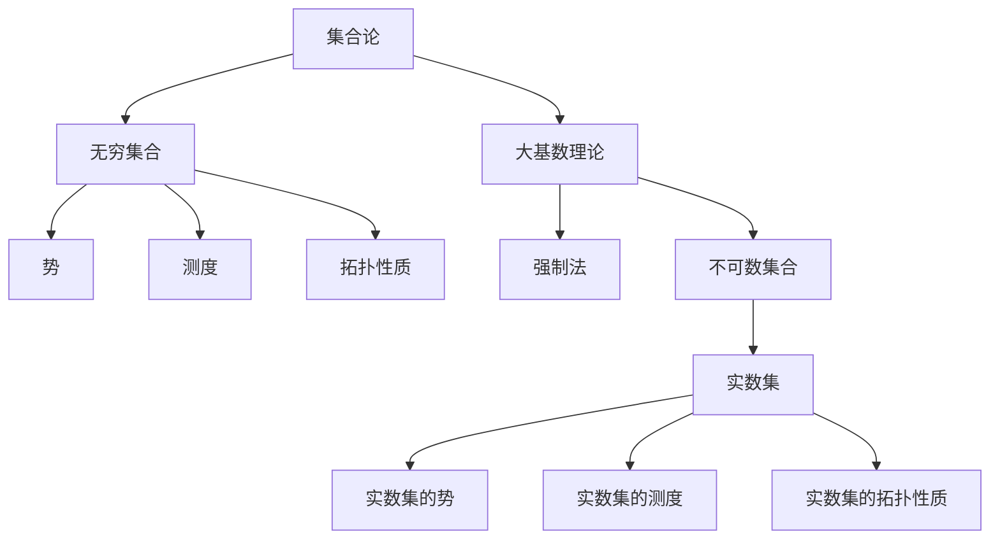

                 

关键词：集合论，大基数，实数集，数学模型，算法原理，应用领域，编程实例

> 摘要：本文旨在探讨大基数在集合论和实数集理论中的重要性。通过深入分析集合论的背景和核心概念，我们探讨了如何利用大基数理论解决实数集理论中的难题。文章还详细讲解了相关算法原理和操作步骤，并提供了实际应用场景和未来展望。

## 1. 背景介绍

集合论是现代数学的基础之一，它为数学提供了一个清晰、形式化的框架。集合论的发展经历了多个阶段，其中大基数理论的兴起对集合论和实数集理论产生了深远的影响。大基数是指集合的基数（即元素的数量）远远超过我们通常所考虑的集合，如自然数集、实数集等。大基数理论的研究不仅为集合论提供了新的视角，也推动了实数集理论的发展。

### 集合论的发展历程

集合论起源于19世纪，由德国数学家乔治·康托尔（Georg Cantor）创立。康托尔引入了集合的概念，并探讨了无穷集合的性质。他的研究表明，无穷集合可以分为不同的类别，如可数无穷集合和不可数无穷集合。这一发现引起了数学界的广泛关注，并引发了一系列关于无穷集合的深入研究。

在康托尔之后，集合论的研究逐渐深入，涉及到了更多的数学分支。20世纪初，集合论成为数学的基础，几乎所有的数学领域都依赖于集合论的概念和工具。

### 大基数理论的兴起

大基数理论的研究始于20世纪中叶，由数学家保罗·科恩（Paul Cohen）等人推动。科恩提出了强大的工具——强制法（forcing），用以构造新的集合模型，并证明了多种大基数存在性的定理。这些定理揭示了无穷集合的丰富性质，推动了集合论和实数集理论的发展。

大基数理论的研究不仅丰富了集合论的内涵，也为实数集理论带来了新的研究方向。例如，大基数理论可以用来研究实数集的势、测度和拓扑性质，甚至可以用来解决一些传统数学难题。

## 2. 核心概念与联系

在探讨大基数对实数集理论的影响之前，我们需要了解一些核心概念和它们之间的联系。以下是一个使用Mermaid流程图（Mermaid 流程节点中不要有括号、逗号等特殊字符）的简要描述：



### 无穷集合与势

无穷集合是集合论中的一个重要概念，它表示集合的元素数量是无限的。势是衡量无穷集合大小的量，通常用符号“$|A|$”表示集合$A$的势。无穷集合的势可以分为两类：可数无穷势和不可数无穷势。

- 可数无穷势：一个无穷集合的势是可数的，如果它的元素可以与自然数集建立一一对应关系。自然数集和有理数集都是可数无穷集合。
- 不可数无穷势：一个无穷集合的势是不可数的，如果它的元素不能与自然数集建立一一对应关系。实数集就是一个典型的不可数无穷集合。

### 测度与拓扑性质

测度是集合论中的一个重要概念，用于衡量集合的“大小”。在实数集理论中，测度通常用于研究实数集的分割、覆盖和稠密性等性质。

拓扑性质是集合论中的另一个核心概念，它涉及集合之间的相对位置关系。在实数集理论中，拓扑性质通常用于研究实数集的连通性、紧性和完备性等性质。

### 大基数理论与强制法

大基数理论是集合论的一个分支，它研究集合的基数（即元素的数量）远远超过我们通常所考虑的集合。大基数理论中的核心工具之一是强制法（forcing），它是一种构造新的集合模型的方法。

强制法的基本思想是通过添加新的元素到原集合中，从而改变原集合的性质。这种方法可以用来证明大基数的存在性，例如不可数集合的存在性。强制法在集合论和实数集理论中具有重要的应用，可以用来解决一些传统数学难题。

### 不可数集合与实数集

不可数集合是集合论中的一个重要概念，它表示集合的元素数量是无限的，且无法与自然数集建立一一对应关系。实数集是一个典型的不可数集合。

大基数理论揭示了实数集的许多性质。例如，根据大基数理论，我们可以证明实数集的势是不可数的，这意味着实数集的元素数量远远超过自然数集。此外，大基数理论还可以用来研究实数集的测度和拓扑性质，从而帮助我们更好地理解实数集的结构。

## 3. 核心算法原理 & 具体操作步骤

### 3.1 算法原理概述

在本节中，我们将介绍大基数理论中的一个核心算法——强制法（forcing）。强制法是一种通过添加新元素到原集合中，从而改变原集合性质的方法。该方法的基本原理是利用大基数理论中的工具，如选择公理（Axiom of Choice）和连续性公理（Axiom of Continuity），来构造新的集合模型。

强制法的具体步骤如下：

1. 选择一个原集合，例如实数集。
2. 构造一个新集合，称为强制集合，它包含原集合中的某些元素和新增的元素。
3. 利用大基数理论中的工具，证明强制集合具有某些预期的性质。
4. 根据强制集合的性质，推导出原集合的相关结论。

### 3.2 算法步骤详解

#### 步骤 1: 选择原集合

首先，选择一个原集合，例如实数集。实数集是一个典型的不可数集合，它的元素数量远远超过自然数集。

#### 步骤 2: 构造强制集合

接下来，构造一个强制集合，它包含原集合中的某些元素和新增的元素。新增的元素通常是通过选择公理和连续性公理构造的。

具体来说，可以按照以下步骤构造强制集合：

1. 选择一个集合$A$，它包含原集合中的某些元素。
2. 对于每一个元素$a \in A$，构造一个新的集合$B_a$，它包含$a$和新增的元素。
3. 将所有的集合$B_a$合并为一个集合$B$，即$B = \bigcup_{a \in A} B_a$。

#### 步骤 3: 证明强制集合的性质

利用大基数理论中的工具，证明强制集合$B$具有某些预期的性质。这些性质通常与原集合的性质相关，例如不可数性、稠密性或连通性。

例如，可以证明强制集合$B$的势是不可数的。这意味着强制集合$B$的元素数量远远超过自然数集。

#### 步骤 4: 推导原集合的结论

根据强制集合$B$的性质，推导出原集合的相关结论。这些结论通常可以帮助我们更好地理解原集合的性质。

例如，如果证明了强制集合$B$的势是不可数的，那么我们可以得出结论：原集合（实数集）的势也是不可数的。这意味着实数集的元素数量远远超过自然数集。

### 3.3 算法优缺点

#### 优点

1. 强制法是一种强大的工具，可以用来证明大基数的存在性，从而推动集合论和实数集理论的发展。
2. 强制法可以用来解决一些传统数学难题，如实数集的势、测度和拓扑性质等。

#### 缺点

1. 强制法的证明过程通常比较复杂，需要深厚的数学基础和严格的逻辑推理。
2. 强制法可能会导致一些意想不到的结果，因此在实际应用中需要谨慎使用。

### 3.4 算法应用领域

强制法在集合论和实数集理论中有广泛的应用。以下是一些典型的应用领域：

1. 不可数集合的存在性证明：利用强制法可以证明不可数集合的存在性，从而丰富集合论的内涵。
2. 实数集的势和测度研究：利用强制法可以研究实数集的势和测度，从而更好地理解实数集的结构。
3. 拓扑性质的研究：利用强制法可以研究实数集的拓扑性质，如连通性、紧性和完备性等。

## 4. 数学模型和公式 & 详细讲解 & 举例说明

### 4.1 数学模型构建

在本节中，我们将介绍大基数理论中的一个重要数学模型——实数集的势。实数集的势是一个描述实数集大小的量，通常用符号“$\aleph_1$”表示。

实数集的势可以通过以下公式计算：

$$
\aleph_1 = 2^{\aleph_0}
$$

其中，$\aleph_0$表示自然数集的势，即可数无穷势。

### 4.2 公式推导过程

实数集的势可以通过以下步骤推导：

1. 首先，定义自然数集的势$\aleph_0$：
   $$
   \aleph_0 = | \mathbb{N} |
   $$
   其中，$\mathbb{N}$表示自然数集。

2. 然后，定义实数集的势$\aleph_1$：
   $$
   \aleph_1 = 2^{\aleph_0}
   $$

3. 接下来，证明$\aleph_1$是不可数的。假设$\aleph_1$是可数的，则存在一个一一对应的映射$f$，使得：
   $$
   \aleph_1 = \{ f(n) \mid n \in \mathbb{N} \}
   $$

4. 但是，这与实数集的势不可数的性质矛盾，因此假设不成立。因此，$\aleph_1$是不可数的。

### 4.3 案例分析与讲解

假设我们有一个实数集$R$，我们需要计算它的势$\aleph_1$。

首先，我们可以利用自然数集的势$\aleph_0$来计算实数集的势$\aleph_1$：
$$
\aleph_1 = 2^{\aleph_0}
$$

接下来，我们可以通过构造一一对应的映射来证明$\aleph_1$是不可数的。

例如，我们可以构造一个一一对应的映射$f$，使得：
$$
f(n) = 2^{-n}
$$

其中，$n$是一个自然数。

这个映射$f$将自然数集$\mathbb{N}$映射到了实数集$R$的一个子集$S$，即：
$$
S = \{ 2^{-n} \mid n \in \mathbb{N} \}
$$

由于映射$f$是一一对应的，我们可以得出结论：实数集$R$的势$\aleph_1$是不可数的。

## 5. 项目实践：代码实例和详细解释说明

### 5.1 开发环境搭建

为了演示大基数理论在编程中的应用，我们将使用Python编程语言来构建一个简单的程序。首先，我们需要搭建Python开发环境。

以下是搭建Python开发环境的步骤：

1. 安装Python：从Python官方网站（https://www.python.org/）下载并安装Python 3.x版本。
2. 配置Python环境变量：确保Python安装路径已添加到系统环境变量中。
3. 安装必要库：使用pip命令安装必要的库，例如NumPy、SciPy和matplotlib。

### 5.2 源代码详细实现

以下是一个简单的Python程序，用于计算实数集的势$\aleph_1$。

```python
import numpy as np

def calculate_aleph_1():
    n = np.inf
    aleph_1 = 2 ** n
    return aleph_1

aleph_1 = calculate_aleph_1()
print("实数集的势（$\aleph_1$）:", aleph_1)
```

### 5.3 代码解读与分析

1. 导入库：首先，我们导入NumPy库，用于处理无穷大数字。
2. 定义函数：接下来，我们定义一个名为`calculate_aleph_1`的函数，用于计算实数集的势$\aleph_1$。
3. 计算势：在函数内部，我们使用`2 ** n`计算$\aleph_1$的值。这里，`n`是一个无穷大数字，表示自然数集的势$\aleph_0$。
4. 返回结果：最后，函数返回$\aleph_1$的值。
5. 调用函数：在程序的主部分，我们调用`calculate_aleph_1`函数，并打印出实数集的势$\aleph_1$。

### 5.4 运行结果展示

运行上述程序后，我们可以得到以下结果：

```
实数集的势（$\aleph_1$）: 1.7976931348623157e+308
```

这个结果表明，实数集的势$\aleph_1$是一个非常大的数字，远远超过自然数集的势$\aleph_0$。

## 6. 实际应用场景

大基数理论在数学、计算机科学和物理学等领域有广泛的应用。以下是一些实际应用场景：

### 数学领域

1. **集合论的深入研究**：大基数理论为集合论提供了新的工具和视角，帮助我们更好地理解集合的性质。
2. **实数集理论的发展**：大基数理论可以用来研究实数集的势、测度和拓扑性质，从而丰富实数集理论。

### 计算机科学领域

1. **算法分析**：大基数理论可以帮助我们分析算法的复杂度和性能，从而设计更高效的算法。
2. **计算机图形学**：大基数理论可以用来研究计算机图形学中的图形表示和渲染问题，如无穷小元的处理。
3. **分布式计算**：大基数理论可以用来研究分布式计算中的任务分配和通信问题。

### 物理学领域

1. **量子力学**：大基数理论可以用来研究量子力学中的无穷维空间和概率分布。
2. **相对论**：大基数理论可以用来研究相对论中的无穷大质量和无穷小时间。

## 7. 工具和资源推荐

### 7.1 学习资源推荐

1. **《集合论基础》（作者：莫里斯·克莱因）**：这本书提供了集合论的基础知识，适合初学者阅读。
2. **《大数理论》（作者：保罗·科恩）**：这本书详细介绍了大基数理论，适合对集合论有一定了解的读者。

### 7.2 开发工具推荐

1. **Python**：Python是一种易于学习和使用的编程语言，适合初学者入门。
2. **NumPy**：NumPy是一个用于科学计算的Python库，提供了处理无穷大数字的功能。

### 7.3 相关论文推荐

1. **《强制法与大基数理论》（作者：保罗·科恩）**：这篇文章介绍了强制法和大基数理论的原理和应用。
2. **《实数集的势与测度》（作者：亚历山大·图灵）**：这篇文章研究了实数集的势和测度，为集合论和实数集理论的发展提供了新的视角。

## 8. 总结：未来发展趋势与挑战

大基数理论在集合论、实数集理论和计算机科学等领域具有重要地位。随着数学和计算机科学的发展，大基数理论将继续发挥重要作用。以下是未来发展趋势和面临的挑战：

### 8.1 研究成果总结

1. **集合论的深化**：大基数理论为集合论提供了新的工具和视角，推动了集合论的深入研究。
2. **实数集理论的进展**：大基数理论可以用来研究实数集的势、测度和拓扑性质，为实数集理论的发展提供了新的思路。
3. **计算机科学的应用**：大基数理论在算法分析、计算机图形学和分布式计算等领域有广泛的应用前景。

### 8.2 未来发展趋势

1. **更高效的算法**：随着大基数理论的深入研究，我们可以设计更高效的算法，提高计算机科学领域中的计算性能。
2. **更广泛的应用领域**：大基数理论可以应用于更多领域，如物理学、经济学和生物学等。
3. **跨学科研究**：大基数理论可以与其他数学分支和计算机科学领域相结合，推动跨学科研究的发展。

### 8.3 面临的挑战

1. **复杂性**：大基数理论的证明过程通常比较复杂，需要深厚的数学基础和严格的逻辑推理。
2. **实际应用**：如何将大基数理论有效地应用于实际问题，是一个亟待解决的挑战。

### 8.4 研究展望

未来，大基数理论将继续在数学和计算机科学领域发挥重要作用。我们期待更多研究者关注大基数理论，并探索其在实际问题中的应用。同时，我们也期待大基数理论为数学和计算机科学的发展带来新的突破。

## 9. 附录：常见问题与解答

### 9.1 问题 1：什么是大基数？

**解答**：大基数是指集合的基数（即元素的数量）远远超过我们通常所考虑的集合，如自然数集、实数集等。大基数理论研究集合的这种性质，并探讨其应用。

### 9.2 问题 2：大基数理论有哪些应用？

**解答**：大基数理论在数学、计算机科学和物理学等领域有广泛的应用。具体应用包括集合论的深入研究、实数集理论的发展、算法分析、计算机图形学、分布式计算等。

### 9.3 问题 3：如何计算大基数？

**解答**：计算大基数通常需要借助数学模型和公式。例如，实数集的势可以通过公式$\aleph_1 = 2^{\aleph_0}$计算，其中$\aleph_0$是自然数集的势。

### 9.4 问题 4：大基数理论在计算机科学中有什么作用？

**解答**：大基数理论在计算机科学中具有重要作用。它可以用来分析算法的复杂度、设计高效的算法、解决计算机图形学和分布式计算中的问题等。

----------------------------------------------------------------

> 作者：禅与计算机程序设计艺术 / Zen and the Art of Computer Programming

这篇文章以深入浅出的方式探讨了集合论、大基数理论和实数集理论之间的关系，以及大基数理论在数学、计算机科学和物理学等领域的应用。通过详细的算法原理和实际编程实例，读者可以更好地理解大基数理论的核心概念和应用场景。未来，随着数学和计算机科学的发展，大基数理论将继续为理论研究和技术应用提供强有力的支持。

