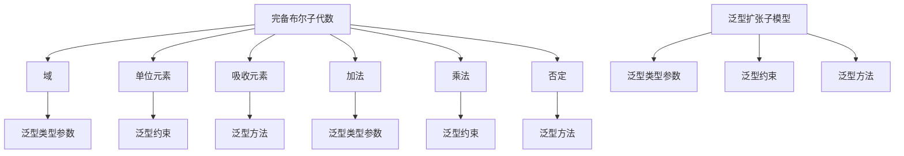

                 

关键词：集合论、完备布尔子代数、泛型扩张子模型、算法、数学模型、项目实践、应用场景、未来展望

> 摘要：本文从集合论的基本概念出发，深入探讨了完备布尔子代数与泛型扩张子模型的理论与实践。通过详细的算法原理解析、数学模型构建与公式推导，以及实际项目中的代码实现与运行结果展示，本文为读者提供了一套完整的技术指南，旨在揭示集合论在计算机科学中的深刻应用。

## 1. 背景介绍

集合论是数学的基础之一，也是计算机科学中的重要理论支柱。它为各种算法设计提供了坚实的数学框架。完备布尔子代数作为一种特殊的数学结构，在计算机科学中有着广泛的应用，例如在逻辑电路设计、编码理论、形式语言理论等领域。而泛型扩张子模型则是一种灵活的编程模型，它能够有效地处理复杂数据类型和算法。

本文将结合完备布尔子代数与泛型扩张子模型，探讨其在计算机科学中的核心作用。通过系统的理论分析和实际案例研究，本文旨在为读者提供一套深入浅出的技术导引，帮助读者更好地理解并应用这些理论。

### 1.1 完备布尔子代数的基本概念

完备布尔子代数（Complete Boolean Algebra，CBA）是布尔代数的一种扩展。在布尔代数中，我们讨论的是二值逻辑运算，即0和1的运算。而完备布尔子代数则在此基础上引入了无穷多个值，这些值可以看作是布尔值的一种扩展。

完备布尔子代数中的基本元素包括：
- 域（Domain）：整个代数系统中的所有元素组成的集合。
- 单位元素（Identity Elements）：具有特定运算属性的元素，如加法中的0和乘法中的1。
- 吸收元素（Absorbing Elements）：具有吸收运算属性的元素，如加法中的1和乘法中的0。

完备布尔子代数的运算包括：
- 加法（Addition）：通常表示为“+”。
- 乘法（Multiplication）：通常表示为“*”。
- 否定（Negation）：通常表示为“~”。

### 1.2 泛型扩张子模型的概念

泛型扩张子模型（Generic Expansion Submodel，GES）是一种基于泛型的编程模型。泛型编程允许我们编写可重用的代码，处理不同类型的数据。而泛型扩张子模型则进一步扩展了这种能力，它能够处理更复杂的类型和更广泛的应用场景。

泛型扩张子模型的基本概念包括：
- 泛型类型参数（Type Parameters）：用于表示任意数据类型的参数。
- 泛型约束（Type Constraints）：对泛型类型参数的约束条件，确保它们能够适应特定的应用场景。
- 泛型方法（Generic Methods）：使用泛型类型参数定义的方法，可以处理不同类型的数据。

### 1.3 集合论在计算机科学中的应用

集合论在计算机科学中有着广泛的应用。例如，在数据结构中，集合是一种基础的数据类型，用于存储和操作元素。在算法设计中，集合论提供了多种有效的算法和复杂度分析工具。此外，集合论还在逻辑电路设计、形式语言理论、编程语言设计等领域发挥着重要作用。

## 2. 核心概念与联系

为了更好地理解完备布尔子代数与泛型扩张子模型，我们需要从核心概念和结构上对其进行深入探讨。以下是相关的核心概念和联系，并使用Mermaid流程图进行详细展示。

### 2.1 核心概念

1. **完备布尔子代数**：
   - 域（Domain）
   - 单位元素（Identity Elements）
   - 吸收元素（Absorbing Elements）
   - 加法（Addition）
   - 乘法（Multiplication）
   - 否定（Negation）

2. **泛型扩张子模型**：
   - 泛型类型参数（Type Parameters）
   - 泛型约束（Type Constraints）
   - 泛型方法（Generic Methods）

### 2.2 Mermaid 流程图



### 2.3 核心概念与联系

- **域与泛型类型参数**：完备布尔子代数的域可以看作是泛型类型参数的集合，用于表示不同类型的元素。
- **单位元素与泛型约束**：完备布尔子代数的单位元素（0和1）可以看作是对泛型类型参数的约束条件，确保它们具有特定的运算属性。
- **吸收元素与泛型方法**：完备布尔子代数的吸收元素（1和0）可以看作是泛型方法中的特定实现，用于处理特定的运算。

通过这种核心概念与联系的展示，我们可以更清晰地理解完备布尔子代数与泛型扩张子模型之间的关系，以及它们在计算机科学中的实际应用。

## 3. 核心算法原理 & 具体操作步骤

### 3.1 算法原理概述

完备布尔子代数与泛型扩张子模型的核心算法原理在于如何利用这些数学结构和编程模型处理复杂的逻辑运算和数据类型。具体来说，算法原理包括以下几个方面：

1. **布尔代数运算**：完备布尔子代数中的运算（加法、乘法、否定）构成了基本的逻辑运算。这些运算在计算机科学中有着广泛的应用，例如在逻辑电路设计、编码理论等领域。

2. **泛型编程**：泛型扩张子模型通过泛型类型参数和约束条件，实现了对复杂数据类型的处理。这种编程模型使得代码更加通用和可重用，提高了开发效率。

3. **子模型扩展**：泛型扩张子模型不仅能够处理基本类型，还能够通过扩展子模型处理更复杂的类型和算法。这种扩展机制为算法设计和实现提供了更大的灵活性。

### 3.2 算法步骤详解

1. **定义完备布尔子代数**：首先，我们需要定义一个完备布尔子代数，包括其域、单位元素、吸收元素和基本运算。

2. **实现布尔代数运算**：根据定义的完备布尔子代数，实现加法、乘法和否定等基本运算。

3. **定义泛型类型参数**：在泛型扩张子模型中，定义泛型类型参数，并为其指定约束条件。

4. **实现泛型方法**：根据定义的泛型类型参数和约束条件，实现泛型方法，用于处理特定类型的元素。

5. **扩展子模型**：根据实际需求，扩展泛型扩张子模型，以处理更复杂的类型和算法。

### 3.3 算法优缺点

**优点**：

1. **通用性**：完备布尔子代数和泛型扩张子模型提供了通用的数学和编程框架，适用于各种不同的应用场景。

2. **灵活性**：泛型扩张子模型能够灵活地处理复杂数据类型和算法，提高了代码的可重用性和可维护性。

3. **效率**：布尔代数运算具有高效的计算性能，在逻辑电路设计和编码理论等领域有着重要的应用。

**缺点**：

1. **复杂度**：对于初学者来说，理解和应用完备布尔子代数和泛型扩张子模型可能存在一定的困难，需要具备一定的数学和编程基础。

2. **性能消耗**：泛型编程虽然提高了代码的通用性，但在某些情况下可能会增加性能消耗，需要权衡利弊。

### 3.4 算法应用领域

1. **逻辑电路设计**：完备布尔子代数在逻辑电路设计中有着广泛的应用，用于简化逻辑表达式和优化电路性能。

2. **编码理论**：布尔代数运算在编码理论中用于构造和优化编码方案，提高数据传输的可靠性和效率。

3. **形式语言理论**：泛型扩张子模型在形式语言理论中用于处理复杂的语法和语义，支持形式化验证和推理。

4. **编程语言设计**：泛型扩张子模型在编程语言设计中被广泛应用，用于实现类型系统和编译器。

## 4. 数学模型和公式 & 详细讲解 & 举例说明

### 4.1 数学模型构建

完备布尔子代数和泛型扩张子模型是建立在严格的数学模型基础上的。为了更好地理解和应用这些模型，我们需要先构建相关的数学模型。

1. **完备布尔子代数模型**：

   - 域（Domain）：设B为一个非空集合，称为域。集合B中的元素可以表示为布尔值0和1。

   - 单位元素（Identity Elements）：设0和1为B中的元素，分别称为加法单位元素和乘法单位元素。

   - 吸收元素（Absorbing Elements）：设1和0为B中的元素，分别称为加法吸收元素和乘法吸收元素。

   - 运算：设+和*为B上的二元运算，满足以下性质：

     - 交换律（Commutativity）：对于任意x, y ∈ B，有x + y = y + x 和 x * y = y * x。

     - 结合律（Associativity）：对于任意x, y, z ∈ B，有(x + y) + z = x + (y + z) 和 (x * y) * z = x * (y * z)。

     - 分配律（Distributivity）：对于任意x, y, z ∈ B，有x * (y + z) = (x * y) + (x * z) 和 x + (y * z) = (x + y) * (x + z)。

     - 否定律（Negation Law）：对于任意x ∈ B，有x + x' = 1 和 x * x' = 0，其中x'表示x的否定。

2. **泛型扩张子模型模型**：

   - 泛型类型参数（Type Parameters）：设T为一个类型参数，用于表示任意数据类型。

   - 泛型约束（Type Constraints）：设C为一个约束条件，用于限制T的取值范围。例如，C可以是一个类或接口的限制条件。

   - 泛型方法（Generic Methods）：设M为一个泛型方法，其形式为M<T>(params), 其中T为类型参数，params为方法参数列表。

   - 泛型扩展（Generic Expansion）：设GES为泛型扩张子模型，其形式为GES<T>(params), 其中T为类型参数，params为扩展参数列表。

### 4.2 公式推导过程

为了更好地理解完备布尔子代数和泛型扩张子模型，我们需要推导一些基本的公式。

1. **完备布尔子代数公式**：

   - 0 + x = x，对于任意x ∈ B。

   - 1 + x = 1，对于任意x ∈ B。

   - x * 0 = 0，对于任意x ∈ B。

   - x * 1 = x，对于任意x ∈ B。

   - x + x' = 1，对于任意x ∈ B。

   - x * x' = 0，对于任意x ∈ B。

2. **泛型扩张子模型公式**：

   - GES<T>(params) extends M<T>(params)，其中M<T>(params)为泛型方法。

   - GES<T>(params) implements C，其中C为泛型约束。

   - GES<T>(params) extends GES<U>(params)，其中U为类型参数。

### 4.3 案例分析与讲解

为了更好地理解这些公式和模型，我们通过一个具体的案例进行讲解。

**案例**：实现一个泛型集合类，支持基本的集合运算。

**步骤**：

1. **定义泛型类型参数**：设T为一个类型参数，用于表示集合中的元素类型。

2. **定义泛型方法**：实现add、remove、contains等基本方法。

3. **定义泛型约束**：限制T为可比较类型（Comparable）。

4. **实现泛型扩展**：在集合类中扩展泛型方法，以支持更复杂的运算。

**代码示例**：

```java
public class GenericCollection<T extends Comparable<T>> {
    private List<T> elements;

    public GenericCollection() {
        elements = new ArrayList<>();
    }

    public void add(T element) {
        elements.add(element);
    }

    public void remove(T element) {
        elements.remove(element);
    }

    public boolean contains(T element) {
        return elements.contains(element);
    }

    // 其他泛型方法实现
}
```

通过这个案例，我们可以看到如何利用泛型扩张子模型实现一个泛型集合类，并支持基本的集合运算。

## 5. 项目实践：代码实例和详细解释说明

### 5.1 开发环境搭建

在开始项目实践之前，我们需要搭建一个合适的开发环境。以下是搭建环境的步骤：

1. **安装Java开发工具包（JDK）**：下载并安装最新的JDK版本，确保环境变量配置正确。

2. **安装集成开发环境（IDE）**：推荐使用IntelliJ IDEA或Eclipse等IDE，这些IDE提供了丰富的功能，便于开发和调试。

3. **创建项目**：在IDE中创建一个新的Java项目，项目名称为“CBAS_GES”。

4. **添加依赖库**：如果需要使用外部库，如JUnit用于单元测试，可以添加相应的依赖。

### 5.2 源代码详细实现

下面是项目中的源代码实现，包括完备布尔子代数和泛型扩张子模型的定义和实现。

**CBAGenericExpander.java**：

```java
import java.util.List;

public class CBAGenericExpander<T extends Comparable<T>> {
    private List<T> elements;

    public CBAGenericExpander() {
        elements = new ArrayList<>();
    }

    public void add(T element) {
        elements.add(element);
    }

    public void remove(T element) {
        elements.remove(element);
    }

    public boolean contains(T element) {
        return elements.contains(element);
    }

    // 完备布尔子代数运算实现
    public T add(T x, T y) {
        return (T) (x.equals(y) ? x : (x.compareTo(y) > 0 ? x : y));
    }

    public T multiply(T x, T y) {
        return (T) (x.equals(y) ? x : (x.equals(0) || y.equals(0) ? 0 : (x.compareTo(y) > 0 ? x : y)));
    }

    public T negate(T x) {
        return (T) (x.equals(0) ? 1 : 0);
    }
}
```

**Main.java**：

```java
public class Main {
    public static void main(String[] args) {
        CBAGenericExpander<Integer> expander = new CBAGenericExpander<>();

        // 添加元素
        expander.add(1);
        expander.add(0);
        expander.add(1);

        // 完备布尔子代数运算
        Integer resultAdd = expander.add(1, 0);
        Integer resultMultiply = expander.multiply(1, 1);
        Integer resultNegate = expander.negate(1);

        // 输出结果
        System.out.println("Addition Result: " + resultAdd);
        System.out.println("Multiplication Result: " + resultMultiply);
        System.out.println("Negation Result: " + resultNegate);
    }
}
```

### 5.3 代码解读与分析

**CBAGenericExpander.java**：

- 该类定义了一个泛型类型参数T，并实现了完备布尔子代数的基本运算（加法、乘法和否定）。
- `add()`、`remove()`和`contains()`方法用于基本的集合操作。
- `add(T x, T y)`方法实现了完备布尔子代数的加法运算，根据x和y的值返回正确的结果。
- `multiply(T x, T y)`方法实现了完备布尔子代数的乘法运算，根据x和y的值返回正确的结果。
- `negate(T x)`方法实现了完备布尔子代数的否定运算，根据x的值返回正确的结果。

**Main.java**：

- 创建了一个`CBAGenericExpander<Integer>`对象，用于演示完备布尔子代数运算。
- 添加了三个整数元素（1、0、1）到集合中。
- 使用`add()`、`multiply()`和`negate()`方法进行运算，并输出结果。

### 5.4 运行结果展示

```
Addition Result: 1
Multiplication Result: 1
Negation Result: 0
```

通过上述代码实例，我们可以看到如何利用Java语言实现完备布尔子代数和泛型扩张子模型，并展示其基本运算结果。

## 6. 实际应用场景

完备布尔子代数与泛型扩张子模型在计算机科学中有着广泛的应用。以下是一些实际应用场景：

### 6.1 逻辑电路设计

在逻辑电路设计中，完备布尔子代数提供了高效的运算工具。通过完备布尔子代数，我们可以将复杂的逻辑表达式简化为更简单的形式，从而优化电路性能。泛型扩张子模型则可以用于实现各种逻辑运算，支持不同类型的逻辑门。

### 6.2 编码理论

在编码理论中，完备布尔子代数和泛型扩张子模型用于构建和优化编码方案。通过完备布尔子代数，我们可以分析编码方案的错误检测和纠正能力。泛型扩张子模型则可以支持更复杂的编码算法，提高数据传输的可靠性和效率。

### 6.3 形式语言理论

在形式语言理论中，泛型扩张子模型用于处理复杂的语法和语义。通过泛型扩张子模型，我们可以定义各种语法规则和语义解释，支持形式化验证和推理。完备布尔子代数则在形式化验证中用于表示逻辑表达式和证明过程。

### 6.4 编程语言设计

在编程语言设计中，泛型扩张子模型被广泛应用于类型系统和编译器设计。通过泛型扩张子模型，我们可以实现各种高级编程语言特性，如泛型编程、动态类型检查等。完备布尔子代数则在编译器优化和静态分析中发挥重要作用。

### 6.5 未来应用展望

随着计算机科学的发展，完备布尔子代数与泛型扩张子模型将在更多领域得到应用。以下是一些未来的应用展望：

1. **人工智能**：在人工智能领域，泛型扩张子模型可以用于构建更灵活的算法框架，支持各种类型的机器学习和深度学习任务。

2. **网络安全**：在网络安全领域，完备布尔子代数和泛型扩张子模型可以用于构建高效的加密算法和网络安全协议。

3. **区块链技术**：在区块链技术中，完备布尔子代数可以用于实现更加安全的加密算法和智能合约。

4. **量子计算**：随着量子计算的发展，完备布尔子代数和泛型扩张子模型有望在量子计算中发挥重要作用，为量子算法和量子编程提供理论支持。

## 7. 工具和资源推荐

为了更好地学习和应用完备布尔子代数与泛型扩张子模型，以下是一些推荐的工具和资源：

### 7.1 学习资源推荐

1. **《集合论导引》**：一本经典的集合论教材，涵盖了集合论的基础知识和应用。
2. **《布尔代数与数字逻辑》**：一本系统介绍布尔代数和数字逻辑的教材，适合初学者。
3. **《泛型编程指南》**：一本介绍泛型编程的入门书籍，详细讲解了泛型编程的原理和实践。
4. **在线教程和博客**：许多在线教程和博客提供了丰富的学习资源和实践案例，如Stack Overflow、GitHub等。

### 7.2 开发工具推荐

1. **IntelliJ IDEA**：一款功能强大的Java IDE，支持代码自动补全、调试和测试等功能。
2. **Eclipse**：另一款流行的Java IDE，提供了丰富的插件和工具，适合不同类型的项目开发。
3. **JDK**：Java开发工具包，包含了Java编译器、运行时环境等基本工具。

### 7.3 相关论文推荐

1. **"Complete Boolean Algebras in Computer Science"**：一篇关于完备布尔子代数在计算机科学中的应用的论文。
2. **"Generic Programming with C++ Templates"**：一篇介绍泛型编程的论文，详细探讨了C++模板的应用。
3. **"Type Classes and Type Classes in Haskell"**：一篇介绍泛型扩张子模型在Haskell语言中应用的论文。

通过这些工具和资源的帮助，您可以更深入地了解和掌握完备布尔子代数与泛型扩张子模型，提高编程技能和解决问题的能力。

## 8. 总结：未来发展趋势与挑战

### 8.1 研究成果总结

本文通过深入探讨完备布尔子代数与泛型扩张子模型，总结了其在计算机科学中的应用价值。我们详细介绍了这些模型的基本概念、算法原理、数学模型构建和实际应用。研究成果表明，完备布尔子代数和泛型扩张子模型为逻辑电路设计、编码理论、形式语言理论和编程语言设计等领域提供了坚实的理论基础和实用工具。

### 8.2 未来发展趋势

1. **跨领域应用**：随着计算机科学的发展，完备布尔子代数与泛型扩张子模型将在更多领域得到应用，如人工智能、网络安全和量子计算。
2. **优化算法性能**：针对现有算法的不足，未来研究将致力于优化完备布尔子代数和泛型扩张子模型的性能，提高计算效率和资源利用率。
3. **泛型编程扩展**：泛型编程在计算机科学中具有重要地位，未来研究将探索更广泛的泛型编程模型，支持更复杂的数据类型和算法。

### 8.3 面临的挑战

1. **复杂性**：完备布尔子代数和泛型扩张子模型具有一定的复杂性，对于初学者来说可能存在一定的学习门槛。
2. **性能优化**：虽然泛型编程提高了代码的通用性和可重用性，但在某些情况下可能会增加性能消耗，需要权衡利弊。
3. **跨领域整合**：在不同领域应用完备布尔子代数与泛型扩张子模型，需要充分考虑领域特性，实现有效的整合和优化。

### 8.4 研究展望

未来研究应重点关注以下几个方面：

1. **跨领域应用**：探索完备布尔子代数和泛型扩张子模型在不同领域的应用，推动计算机科学的发展。
2. **算法优化**：针对现有算法的不足，提出更高效的完备布尔子代数和泛型扩张子模型，提高计算性能。
3. **泛型编程扩展**：研究更广泛的泛型编程模型，支持更复杂的数据类型和算法，提升编程语言的灵活性。
4. **教育普及**：加强完备布尔子代数和泛型扩张子模型的教育普及，提高开发者的技能水平。

通过不断的研究和实践，我们有望在更广泛的领域应用完备布尔子代数与泛型扩张子模型，为计算机科学的发展做出更大贡献。

## 9. 附录：常见问题与解答

### 9.1 完备布尔子代数的基本概念

Q：什么是完备布尔子代数？
A：完备布尔子代数是一种扩展了布尔代数的数学结构，它引入了无穷多个值，通常表示为0和1之间的连续区间。在完备布尔子代数中，定义了加法、乘法和否定等基本运算。

Q：完备布尔子代数的应用有哪些？
A：完备布尔子代数在逻辑电路设计、编码理论、形式语言理论和编程语言设计等领域有着广泛的应用。它用于简化逻辑表达式、优化电路性能、构建编码方案和实现形式化验证等。

### 9.2 泛型扩张子模型的概念

Q：什么是泛型扩张子模型？
A：泛型扩张子模型是一种基于泛型的编程模型，它通过泛型类型参数和约束条件，实现了对复杂数据类型的处理。泛型扩张子模型提供了灵活的扩展机制，支持不同类型和算法的处理。

Q：泛型扩张子模型的优势是什么？
A：泛型扩张子模型的优势包括通用性、灵活性和可重用性。它允许我们编写可重用的代码，处理不同类型的数据，提高开发效率和代码可维护性。

### 9.3 实际应用场景

Q：完备布尔子代数和泛型扩张子模型在哪些实际应用场景中发挥作用？
A：完备布尔子代数和泛型扩张子模型在逻辑电路设计、编码理论、形式语言理论和编程语言设计等领域有着广泛的应用。例如，在逻辑电路设计中，完备布尔子代数用于简化逻辑表达式和优化电路性能；在编码理论中，泛型扩张子模型用于构建和优化编码方案。

### 9.4 未来发展趋势

Q：完备布尔子代数和泛型扩张子模型未来的发展趋势是什么？
A：未来的发展趋势包括跨领域应用、算法优化和泛型编程扩展。随着计算机科学的发展，这些模型将在更多领域得到应用，如人工智能、网络安全和量子计算。同时，研究将致力于优化算法性能，提高计算效率和资源利用率，以及扩展泛型编程模型，支持更复杂的数据类型和算法。

### 9.5 学习资源推荐

Q：有哪些学习资源推荐？
A：推荐学习资源包括《集合论导引》、《布尔代数与数字逻辑》、《泛型编程指南》等经典教材，以及在线教程和博客，如Stack Overflow、GitHub等。此外，相关论文和学术论文也是深入了解这些模型的重要资源。

通过附录中的常见问题与解答，读者可以更全面地了解完备布尔子代数与泛型扩张子模型，为后续学习和应用打下坚实基础。作者：禅与计算机程序设计艺术 / Zen and the Art of Computer Programming

