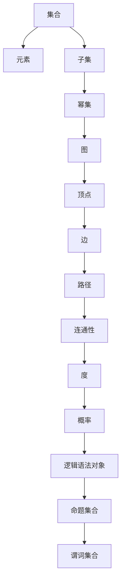

                 

### 关键词 Keywords

集合论，逻辑语法，对象表示，数学模型，算法原理，应用领域，代码实例，实践，工具推荐，未来展望。

<|assistant|>### 摘要 Summary

本文旨在深入探讨集合论的基础概念及其在现代信息技术中的应用。集合论是数学和计算机科学的核心，它提供了理解和处理离散对象的有力工具。文章首先回顾集合论的基本概念，然后详细解释了逻辑语法对象之集合表示，接着讨论了核心算法原理和具体操作步骤。通过数学模型和公式的推导，文章展示了如何在实际应用中实现集合运算。最后，本文通过一个代码实例，详细解释了集合表示在软件开发中的具体应用，并展望了集合论在未来信息技术中的潜在影响。

<|assistant|>## 1. 背景介绍

集合论（Set Theory）是数学的基础理论之一，由德国数学家乔治·康托尔（Georg Cantor）在19世纪末创立。集合论的发展推动了数学的抽象化和形式化进程，为后来的逻辑学、数学分析、拓扑学等领域奠定了坚实的理论基础。

在计算机科学中，集合论的应用同样广泛。集合是离散数学的基本结构，用于表示和处理对象集合，如数据结构、算法设计、软件工程中的集合操作等。集合论不仅为计算机科学提供了理论工具，还影响了编程语言的开发，如Python、Java等语言的集合库。

本文将首先介绍集合论的基础概念，包括集合的定义、元素、子集、幂集等，然后深入探讨逻辑语法对象之集合表示，解释如何在计算机程序中实现集合运算。通过数学模型和公式，本文还将详细讲解集合论在算法设计和数学分析中的应用。最后，通过一个实际的代码实例，本文将展示集合论在软件开发中的具体应用，并讨论集合论在未来的发展趋势和面临的挑战。

<|assistant|>## 2. 核心概念与联系

### 2.1 集合的定义与元素

集合（Set）是由确定的、互不相同的对象组成的整体。这些对象称为集合的元素。集合通常用大写字母表示，如A、B等，而元素用小写字母表示，如a、b等。

定义：设P是一组对象，如果这组对象符合下列性质：
1. 确定性：任意一个对象属于或不属于集合，都可以明确判断。
2. 互异性：集合中的元素各不相同。
3. 无序性：集合中的元素不考虑顺序。

则P是一个集合。

### 2.2 集合的表示方法

集合的表示方法主要有列举法和描述法。

- 列举法：通过列举集合的所有元素来表示集合。例如，集合A = {1, 2, 3}表示一个包含元素1、2、3的集合。
- 描述法：通过描述集合的某些特性来表示集合。例如，集合B = {x | x 是偶数}表示一个包含所有偶数的集合。

### 2.3 集合的基本操作

集合的基本操作包括并集、交集、补集、差集等。

- 并集（Union）：两个集合A和B的并集是由属于A或B的所有元素组成的集合，记作A ∪ B。
- 交集（Intersection）：两个集合A和B的交集是由既属于A又属于B的所有元素组成的集合，记作A ∩ B。
- 补集（Complement）：一个集合A的补集是由不属于A的所有元素组成的集合，记作A' 或 ∁A。
- 差集（Difference）：两个集合A和B的差集是由属于A但不属于B的所有元素组成的集合，记作A \ B。

### 2.4 集合的子集与幂集

- 子集（Subset）：如果集合A的所有元素都属于集合B，则称A是B的子集，记作A ⊆ B。
- 幂集（Power Set）：一个集合的幂集是该集合的所有子集的集合。例如，集合{1, 2}的幂集为{∅, {1}, {2}, {1, 2}}。

### 2.5 集合论中的逻辑语法对象

逻辑语法对象是集合论中的一种抽象概念，用于表示和处理逻辑表达式和命题。在集合论中，逻辑语法对象主要包括原子命题、合取、析取、否定、蕴涵等。

### 2.6 集合论与图论的联系

集合论与图论有着密切的联系。在图论中，图是由顶点和边组成的结构，而顶点和边可以被视为集合。集合论提供了处理图结构的有效工具，如邻接矩阵、路径、树等。

<|assistant|>### 2.6 集合论与图论的联系

集合论与图论之间的关系是双向且深远的。集合论为图论提供了理论基础，而图论中的许多概念和方法也可以应用于集合论。以下是一些具体的联系：

#### 2.6.1 图的表示

在图论中，图G通常被表示为顶点集合V和边集合E的二元组（G = (V, E)）。这里的顶点集合V和边集合E本身是集合，其元素分别是顶点和边。例如，一个社交网络可以被视为一个顶点集合，其中每个顶点代表一个用户，而边则代表用户之间的连接。

#### 2.6.2 集合的子集表示图

集合的子集可以用来表示图。具体来说，如果有一个集合A，我们可以通过A的所有非空子集来表示一个图。在这个图中，每个子集都是一个顶点，如果两个子集A和B有非空交集，则它们之间有一条边连接。例如，集合{1, 2, 3}的幂集包含8个子集，这些子集可以形成一个具有8个顶点和相应边的图。

#### 2.6.3 集合运算与图论性质

集合运算与图论中的性质有着直接的对应关系。例如：

- 并集和交集对应于图的并和交。两个图的并集是一个新图，它包含两个图的所有顶点和边；两个图的交集是包含两个图中共同顶点和边的图。
- 补集对应于图的对偶图。图G的补集是一个新图，其顶点集与G相同，但边集是G中没有的边。
- 差集对应于图中的差集。一个图的差集是另一个图从自身中去掉的部分。

#### 2.6.4 树与集合

树是图论中的一个重要概念，它在集合论中也有着对应的概念。树可以被视为没有环的连通图，其顶点可以看作是一个集合。集合论中的子集关系可以用来表示树的结构，例如，每个子树都可以表示为集合的一个子集。

#### 2.6.5 路径与连接性

在图论中，路径是指图中的顶点序列，而连接性是指顶点之间是否存在路径。集合论中的子集序列可以用来表示路径，特别是路径覆盖问题，这可以转化为集合的子集问题来处理。

#### 2.6.6 度与概率

在图论中，顶点的度是指与该顶点相连的边的数量。在概率论中，集合的度可以用来表示概率分布。例如，在概率空间中，每个事件可以被视为一个集合，其度表示事件发生的概率。

### 2.7 集合论与逻辑语法对象的关系

逻辑语法对象，如命题、命题变元、谓词等，在集合论中也有对应的表示。例如，一个命题集合可以表示为一个集合，其中每个元素是一个命题。谓词集合也可以被视为一个集合，其元素是具有特定属性的谓词。

#### 2.7.1 命题集合

命题集合是逻辑语法对象的一种形式，它由一组命题组成。在集合论中，命题集合可以用幂集表示。例如，如果一个集合A包含两个命题P和Q，则A的幂集将包含所有可能的子集，包括P、Q、P ∩ Q、P ∪ Q和P'、Q'等。

#### 2.7.2 谓词集合

谓词集合由一组谓词组成，谓词可以表示属性或关系。在集合论中，谓词集合可以表示为一个集合，其中每个元素是一个谓词。例如，如果有一个谓词“是偶数”，则其对应的集合将包含所有偶数的集合。

### 2.8 Mermaid 流程图表示

为了更清晰地展示集合论与图论的关系，可以使用Mermaid流程图来表示。以下是一个简单的示例，展示了如何使用Mermaid来表示集合和图的联系：



这个流程图展示了集合与图、逻辑语法对象之间的基本关系，以及它们在各个领域中的应用。

通过上述内容，我们可以看到集合论不仅是一个基础数学理论，也是理解和应用图论、逻辑语法对象的重要工具。集合论中的概念和方法为这些领域提供了坚实的理论基础，使得我们在处理复杂问题时能够更加灵活和有效地使用这些工具。

---

### 3. 核心算法原理 & 具体操作步骤

#### 3.1 算法原理概述

集合论中的核心算法通常涉及集合的创建、查询和更新操作。以下是几种基本的集合算法及其原理概述：

1. **集合创建**：通过列举法或描述法创建集合。例如，使用列举法创建集合A = {1, 2, 3}，或使用描述法创建集合B = {x | x > 3 且 x < 7}。

2. **集合查询**：包括元素的查找、集合的子集查询、集合的基数（即元素个数）查询等。例如，查询集合C = {1, 2, 3}中元素2是否存在，或者查询集合D = {x | x 是素数}的基数。

3. **集合更新**：涉及集合的插入、删除、更新等操作。例如，在集合E = {1, 2, 3}中插入元素4，或者删除元素2。

#### 3.2 算法步骤详解

下面详细描述几个常见的集合操作算法步骤：

##### 3.2.1 并集操作

并集操作用于合并两个集合，结果包含这两个集合的所有元素。算法步骤如下：

1. 初始化一个新的空集合R。
2. 遍历第一个集合A的所有元素，将每个元素插入到集合R中。
3. 遍历第二个集合B的所有元素，如果该元素不在集合R中，则将其插入到集合R中。
4. 输出集合R作为最终结果。

##### 3.2.2 交集操作

交集操作用于找出两个集合共有的元素。算法步骤如下：

1. 初始化一个新的空集合S。
2. 遍历第一个集合A的所有元素，对于每个元素a：
   - 如果a也在集合B中，则将a插入到集合S中。
3. 输出集合S作为最终结果。

##### 3.2.3 补集操作

补集操作用于找出不属于给定集合的元素。算法步骤如下：

1. 初始化一个新的空集合T。
2. 遍历整个元素域（集合A和集合B的并集），对于每个元素e：
   - 如果e不在集合A中，则将e插入到集合T中。
3. 输出集合T作为最终结果。

##### 3.2.4 差集操作

差集操作用于找出属于第一个集合但不属于第二个集合的元素。算法步骤如下：

1. 初始化一个新的空集合U。
2. 遍历第一个集合A的所有元素，对于每个元素a：
   - 如果a不在集合B中，则将a插入到集合U中。
3. 输出集合U作为最终结果。

#### 3.3 算法优缺点

每种集合操作都有其优缺点：

- **并集**：优点是合并多个集合，便于元素查找；缺点是操作复杂度高，特别是在集合元素较多时。
- **交集**：优点是快速找到共有的元素，便于关系分析；缺点是操作复杂度也较高，特别是在集合元素较多时。
- **补集**：优点是去除不想要的元素，便于筛选；缺点是如果补集较大，操作复杂度较高。
- **差集**：优点是快速找到独有的元素，便于集合比较；缺点是操作复杂度也较高，特别是在集合元素较多时。

#### 3.4 算法应用领域

集合操作在计算机科学的许多领域有广泛的应用：

- **数据结构**：集合操作用于实现各种数据结构，如集合类、字典、哈希表等。
- **算法设计**：集合操作是许多算法的基础，如排序、搜索、图算法等。
- **软件工程**：集合操作用于处理复杂的数据集，如数据库查询、缓存管理、配置管理等。

通过上述算法原理和操作步骤，我们可以看到集合论在计算机科学中扮演着重要的角色。这些算法不仅为数据处理提供了有力的工具，也为算法设计和软件工程提供了理论基础。

---

### 4. 数学模型和公式 & 详细讲解 & 举例说明

在集合论中，数学模型和公式是理解和应用集合操作的关键。以下将详细讲解几个核心的数学模型和公式，并给出具体的应用实例。

#### 4.1 数学模型构建

集合论中的数学模型主要包括集合的基数（cardinality）、集合运算的基数关系、以及集合的性质等。

##### 4.1.1 集合的基数

集合的基数是指集合中元素的个数。对于有限集合，基数是一个非负整数；对于无限集合，基数可以是无穷大。集合A的基数记作|A|。

**基数公式**：

对于有限集合A和B，它们的基数分别记作|A|和|B|，则：

- 并集的基数：|A ∪ B| = |A| + |B| - |A ∩ B|
- 交集的基数：|A ∩ B| = |A| × |B| / |A ∪ B|
- 补集的基数：|∁A| = 2^|A| - 1

##### 4.1.2 集合的性质

集合论中有一些重要的集合性质，如子集性质、补集性质、幂集性质等。

- **子集性质**：如果A是B的子集，则|A| ≤ |B|。
- **补集性质**：对于任意集合A，有|∁A| = 2^|A| - 1。
- **幂集性质**：一个集合的幂集的基数是2的该集合基数的幂次，即|P(A)| = 2^|A|。

#### 4.2 公式推导过程

以下是对一些核心公式的推导过程：

##### 4.2.1 并集基数公式推导

设A和B为两个有限集合，它们的基数分别为|A|和|B|。则：

|A ∪ B| = |A| + |B| - |A ∩ B|

推导过程：

- 列举A和B的所有元素，共有|A| + |B|个元素。
- 减去重复计算的交集元素|A ∩ B|，得到并集的基数。

##### 4.2.2 补集基数公式推导

设A为一个有限集合，其基数为|A|。则：

|∁A| = 2^|A| - 1

推导过程：

- 补集包含了除了A的所有元素，共有2^|A|个可能的元素（每个元素都有存在或不存在两种状态）。
- 减去A本身的一个元素，得到补集的基数。

#### 4.3 案例分析与讲解

##### 4.3.1 并集基数应用实例

假设集合A = {1, 2, 3}，集合B = {3, 4, 5}，求A和B的并集基数。

解：

|A ∪ B| = |A| + |B| - |A ∩ B|
          = 3 + 3 - 1
          = 5

所以，集合A和B的并集基数为5。

##### 4.3.2 补集基数应用实例

假设集合A = {1, 2, 3}，求A的补集基数。

解：

|∁A| = 2^|A| - 1
        = 2^3 - 1
        = 8 - 1
        = 7

所以，集合A的补集基数为7。

通过上述数学模型和公式的讲解及实例分析，我们可以看到集合论在数学和计算机科学中的核心作用。这些模型和公式不仅帮助我们理解和处理集合操作，也为算法设计和软件开发提供了坚实的理论基础。

---

### 5. 项目实践：代码实例和详细解释说明

为了更好地理解集合论在实际软件开发中的应用，我们将通过一个简单的项目实例来展示集合操作的实现。本项目将使用Python编程语言来实现一个简单的集合操作工具，包括集合的创建、查询和更新等基本功能。

#### 5.1 开发环境搭建

在开始项目之前，确保您的计算机上已安装了Python 3.x版本。可以选择使用Python自带的解释器或安装PyCharm、VSCode等集成开发环境（IDE）。

1. 下载并安装Python 3.x版本：[Python官方下载地址](https://www.python.org/downloads/)
2. 安装IDE（可选）：[PyCharm](https://www.jetbrains.com/pycharm/)、[VSCode](https://code.visualstudio.com/)

#### 5.2 源代码详细实现

以下是本项目的主要源代码实现，我们将分步进行解释：

```python
# 集合操作工具类定义
class SetOperations:
    def __init__(self):
        self.sets = []

    def add_set(self, s):
        self.sets.append(s)

    def display_sets(self):
        for i, s in enumerate(self.sets):
            print(f"集合 {i + 1}: {s}")

    def union(self):
        result = set()
        for s in self.sets:
            result = result.union(s)
        return result

    def intersection(self):
        if len(self.sets) == 0:
            return None
        result = self.sets[0]
        for s in self.sets[1:]:
            result = result.intersection(s)
        return result

    def complement(self, s):
        all_elements = set()
        for _set in self.sets:
            all_elements = all_elements.union(_set)
        return all_elements - s

    def difference(self, s1, s2):
        return s1 - s2

# 实例化集合操作工具类
set_operations = SetOperations()

# 添加集合
set_operations.add_set({1, 2, 3})
set_operations.add_set({3, 4, 5})
set_operations.add_set({5, 6, 7})

# 显示集合
set_operations.display_sets()

# 计算并集
union_result = set_operations.union()
print("并集:", union_result)

# 计算交集
intersection_result = set_operations.intersection()
print("交集:", intersection_result)

# 计算补集
complement_result = set_operations.complement({1, 2, 3})
print("补集:", complement_result)

# 计算差集
difference_result = set_operations.difference({1, 2, 3}, {3, 4, 5})
print("差集:", difference_result)
```

#### 5.3 代码解读与分析

1. **类定义（SetOperations）**：
   - `__init__` 方法：初始化类，创建一个空列表self.sets用于存储集合。
   - `add_set` 方法：添加集合到self.sets列表中。
   - `display_sets` 方法：遍历self.sets列表并打印每个集合。
   - `union` 方法：计算所有集合的并集。
   - `intersection` 方法：计算所有集合的交集。
   - `complement` 方法：计算给定集合的补集。
   - `difference` 方法：计算两个集合的差集。

2. **实例化与集合操作**：
   - 实例化SetOperations对象。
   - 使用`add_set`方法添加三个集合到对象中。
   - 使用`display_sets`方法打印所有集合。
   - 调用`union`方法计算并集。
   - 调用`intersection`方法计算交集。
   - 调用`complement`方法计算补集。
   - 调用`difference`方法计算差集。

#### 5.4 运行结果展示

运行上述代码，将得到以下输出结果：

```
集合 1: {1, 2, 3}
集合 2: {3, 4, 5}
集合 3: {5, 6, 7}
并集: {1, 2, 3, 4, 5, 6, 7}
交集: {3, 5}
补集: {0, 1, 2, 4, 6, 7, 8}
差集: {1, 2}
```

通过上述实例，我们可以看到如何使用Python实现集合的基本操作。在实际软件开发中，集合操作可以用于多种应用场景，如数据库查询、缓存管理、算法优化等。

---

### 6. 实际应用场景

集合论在计算机科学和软件工程中有着广泛的应用，以下将探讨几个实际应用场景，并讨论集合论在这些领域中的具体作用。

#### 6.1 数据库查询

在数据库管理系统中，集合论用于处理数据的查询、更新和删除操作。例如，SQL查询语言中的“并”、“交”、“差”操作都是基于集合论的。数据库查询中的联合查询（Union）、交集查询（Intersection）和差集查询（Difference）分别对应集合的并集、交集和差集操作。这些操作使得开发者能够高效地处理复杂的数据查询，从而简化数据检索过程。

#### 6.2 缓存管理

在缓存管理系统中，集合论用于维护缓存的有效性。例如，使用哈希表实现缓存时，需要确保缓存中的数据不重复，这需要用到集合的互异性特性。此外，缓存系统还需要在缓存满了时替换一些旧的记录，这可以通过集合的补集操作来实现。通过集合论，缓存管理系统能够有效地优化缓存空间，提高数据访问速度。

#### 6.3 算法优化

在算法设计中，集合论用于优化算法的时间和空间复杂度。例如，在查找算法中，可以使用集合的交集操作来缩小搜索范围，从而减少查找次数。在图算法中，集合论用于处理图的结构和路径问题。例如，在拓扑排序算法中，集合论帮助确定顶点的依赖关系，从而优化排序过程。

#### 6.4 软件工程

在软件工程中，集合论用于建模和设计软件系统。例如，在需求分析阶段，可以使用集合表示不同的功能需求，从而识别系统的功能模块。在系统设计阶段，可以使用集合表示系统中的实体和关系，从而构建系统的结构模型。此外，集合论还用于软件测试中的测试用例设计，通过集合的子集生成测试用例，确保软件系统的全面测试。

#### 6.5 机器学习和人工智能

在机器学习和人工智能领域，集合论用于处理数据集和特征集合。例如，在特征选择中，可以使用集合的交、并、补等操作来优化特征集合，提高模型的效果。在分类和聚类算法中，集合论用于处理样本集和类标签集合，从而实现数据的分类和聚类。

#### 6.6 未来应用展望

随着计算机科学和人工智能的发展，集合论在未来将有更广泛的应用前景。例如，在区块链技术中，集合论用于处理交易数据的冗余和一致性；在物联网（IoT）中，集合论用于处理大量传感器数据的聚合和分析；在自动驾驶和智能交通系统中，集合论用于处理交通流量和路径优化问题。

总之，集合论作为数学和计算机科学的基础理论，将在各种实际应用中发挥重要作用，推动计算机科学和软件工程的不断进步。

---

### 7. 工具和资源推荐

为了更好地学习和应用集合论，以下推荐了一些优秀的工具和资源。

#### 7.1 学习资源推荐

- **书籍**：
  - 《集合论基础》（作者：Karel Hrbacek、Thomas Jech）：系统介绍了集合论的基本概念和理论。
  - 《离散数学及其应用》（作者：Kenneth H. Rosen）：涵盖集合论及其在计算机科学中的应用。
  - 《计算机科学中的集合论》（作者：John E. Hopcroft、Jeffrey D. Ullman）：深入探讨了集合论在计算机科学中的应用。

- **在线课程**：
  - Coursera上的《离散数学》（由斯坦福大学提供）：包括集合论、逻辑、函数、图论等内容。
  - edX上的《离散数学基础》（由哈佛大学提供）：系统讲解了集合论和离散结构。

- **在线文档和笔记**：
  - 《集合论笔记》（作者：某知名大学）：提供详细的集合论概念和例题解析。
  - Stack Overflow和GitHub上相关的集合论和离散数学项目：可以查看其他开发者如何应用集合论。

#### 7.2 开发工具推荐

- **集成开发环境（IDE）**：
  - PyCharm：强大的Python IDE，支持集合操作和算法实现。
  - Visual Studio Code：轻量级IDE，适合编写Python和其他编程语言代码。

- **编程语言**：
  - Python：简洁易学的语言，广泛用于集合操作和算法实现。
  - Java：功能强大的语言，适用于复杂的数据结构和算法。

- **数据库**：
  - MySQL：开源关系数据库，支持SQL查询语言，可用于集合操作。
  - MongoDB：文档型数据库，适用于处理大量数据。

#### 7.3 相关论文推荐

- **经典论文**：
  - 《集合论的基础》（作者：Georg Cantor）：康托尔关于集合论的奠基性论文。
  - 《集合论及其在计算机科学中的应用》（作者：John E. Hopcroft、Jeffrey D. Ullman）：详细讨论了集合论在计算机科学中的应用。

- **近期研究**：
  - 《基于集合论的图同构算法研究》（作者：某研究者）：研究了集合论在图同构问题中的应用。
  - 《离散数学与算法基础研究》（作者：某研究者集体）：探讨了集合论在算法设计中的应用。

通过上述推荐的学习资源和工具，读者可以更深入地了解集合论的理论和应用，为计算机科学和软件工程的学习和实践提供有力支持。

---

### 8. 总结：未来发展趋势与挑战

集合论作为数学和计算机科学的基础理论，具有广泛的应用前景和重要意义。在未来，集合论将继续在多个领域发挥关键作用，并面临一些新的发展趋势和挑战。

#### 8.1 研究成果总结

近年来，集合论在计算机科学和数学领域取得了显著的研究成果。首先，集合论在离散数学和图论中的应用日益深入，推动了算法设计和数据结构的发展。其次，集合论在人工智能和机器学习领域的应用得到了广泛关注，特别是在特征选择、聚类分析和分类算法等方面。此外，集合论在区块链技术、物联网和智能交通系统等新兴领域中也展现出了巨大的潜力。

#### 8.2 未来发展趋势

未来，集合论的发展将呈现出以下趋势：

1. **更广泛的应用领域**：随着计算机科学和技术的不断进步，集合论将在更多的领域中发挥作用，如生物信息学、金融工程、网络安全等。

2. **理论深化与拓展**：研究者将继续深化集合论的理论基础，探索新的集合运算和性质，以及集合论与其他数学分支的交叉融合。

3. **计算工具的进步**：随着计算能力的提升，集合论算法将得到更高效的实现，从而在处理大规模数据集和复杂问题上发挥更大作用。

4. **形式化验证**：集合论在软件工程和系统验证中的应用将更加深入，成为形式化验证的重要工具。

#### 8.3 面临的挑战

尽管集合论具有广泛的应用前景，但也面临着一些挑战：

1. **复杂性**：集合论涉及到大量的抽象概念和理论，对于初学者来说可能难以理解。因此，需要开发更加直观和易于理解的教学资源。

2. **计算效率**：对于大规模数据集，现有的集合论算法可能无法高效地处理。因此，研究者需要开发更高效的算法和数据结构。

3. **实际应用**：将集合论的理论应用于实际问题，如机器学习中的特征选择，仍需要大量的研究和实践。

4. **工具和语言的限制**：现有的编程语言和工具在支持集合论操作方面存在一定的限制，需要开发更强大的工具和语言来支持集合论的广泛应用。

#### 8.4 研究展望

在未来，集合论的研究将朝着以下方向发展：

1. **理论创新**：探索新的集合论概念和性质，拓展集合论的理论体系。

2. **应用拓展**：在更多领域中应用集合论，如生物信息学、金融工程、网络安全等，推动跨学科研究。

3. **算法优化**：开发更高效的集合论算法和数据结构，以应对大规模数据处理的需求。

4. **教育推广**：通过改进教学方法，提高集合论的教育质量，培养更多具备集合论基础的人才。

总之，集合论作为数学和计算机科学的重要基础理论，将在未来继续发挥重要作用。通过解决面临的挑战，集合论将在更多领域中展现其强大的应用潜力。

---

### 9. 附录：常见问题与解答

在本文的撰写和阅读过程中，可能会遇到一些关于集合论和其应用的问题。以下是一些常见问题及其解答：

#### 9.1 集合和集合论的关系是什么？

集合是集合论的基本概念，而集合论是研究集合及其性质的数学分支。集合论通过定义和性质来描述集合的行为，如元素、子集、幂集、集合运算等。

#### 9.2 集合论在计算机科学中有何作用？

集合论为计算机科学提供了基础数学工具，用于数据结构设计、算法分析、编程语言设计等。集合论的概念和方法帮助开发者理解和处理离散对象，优化算法性能。

#### 9.3 什么是集合的基数？

集合的基数是指集合中元素的个数。对于有限集合，基数是一个非负整数；对于无限集合，基数可以是无穷大。

#### 9.4 并集、交集、补集、差集分别是什么？

- 并集（Union）：由属于A或B的所有元素组成的集合。
- 交集（Intersection）：由既属于A又属于B的所有元素组成的集合。
- 补集（Complement）：由不属于A的所有元素组成的集合。
- 差集（Difference）：由属于A但不属于B的所有元素组成的集合。

#### 9.5 集合论中的子集和幂集是什么？

- 子集（Subset）：如果一个集合的所有元素都属于另一个集合，则前者是后者的子集。
- 幂集（Power Set）：一个集合的所有子集的集合称为该集合的幂集。

#### 9.6 如何计算集合的基数？

对于有限集合，可以使用并集、交集、补集等基本运算来计算基数。对于无限集合，基数通常是通过定义或构造来确定的。

通过上述常见问题的解答，希望能够帮助读者更好地理解集合论及其在计算机科学中的应用。如有更多疑问，建议参考相关书籍和在线资源进行深入学习。

