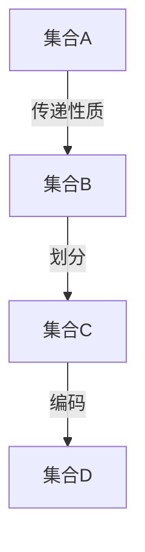

                 

 关键词：集合论、传递模型、集合论传递性质、数学模型、算法原理

> 摘要：本文旨在深入探讨集合论传递模型的基本概念、核心算法、数学模型以及实际应用，旨在为读者提供一个系统而全面的理解，同时展望集合论传递模型在未来的发展趋势和面临的挑战。

## 1. 背景介绍

集合论是现代数学的基石之一，其基本概念和原理广泛应用于各个数学分支以及其他科学领域。集合论传递模型是集合论中一个重要且富有挑战性的概念，它在图论、拓扑学、计算复杂性理论等多个领域有着广泛的应用。本文将重点探讨集合论传递模型的基本概念、核心算法、数学模型以及实际应用，旨在为读者提供一个全面的理解。

### 1.1 集合论的基本概念

集合是由一组确定的元素组成的整体。集合的元素可以是任何对象，包括数字、字母、图形等。集合通常用大写字母表示，如A、B、C等。集合中的元素之间没有顺序关系，且每个元素只出现一次。例如，集合A = {1, 2, 3}包含三个元素：1、2和3。

### 1.2 集合的运算

集合的运算包括并集、交集、补集、差集等。并集（Union）是指包含两个集合中所有元素的集合。交集（Intersection）是指包含两个集合中共有元素的集合。补集（Complement）是指包含某个集合中所有元素的集合的补集。差集（Difference）是指包含第一个集合中有而第二个集合中没有的元素的集合。

### 1.3 集合论传递性质

集合论传递性质是指如果一个集合满足某个性质，那么它的子集和超集也一定满足这个性质。例如，如果集合A是无限集合，那么它的子集和超集也是无限集合。集合论传递性质在集合的划分、分类、编码等方面有着广泛的应用。

## 2. 核心概念与联系

集合论传递模型的核心概念包括传递性质、集合的划分、集合的编码等。下面将使用Mermaid流程图展示集合论传递模型的基本概念和联系。



在上述流程图中，集合A、B、C、D分别表示不同的集合。箭头表示集合之间的传递关系。集合A传递给集合B，集合B划分成集合C，集合C编码成集合D。

### 2.1 传递性质

传递性质是指如果一个集合满足某个性质，那么它的子集和超集也一定满足这个性质。例如，集合A是无限集合，集合B是A的子集，集合C是A的超集，那么B和C也是无限集合。

### 2.2 集合的划分

集合的划分是指将一个集合划分为若干个互不重叠的子集，使得每个子集都包含在原集合中。例如，将集合A = {1, 2, 3, 4, 5}划分为B = {{1, 2}, {3, 4}, {5}}。

### 2.3 集合的编码

集合的编码是指将集合中的元素按照某种规则编码成字符串。常见的编码方式包括二进制编码、ASCII编码等。例如，将集合A = {1, 2, 3}编码成二进制字符串001、010、011。

## 3. 核心算法原理 & 具体操作步骤

集合论传递模型的核心算法原理包括传递性质判断、集合划分算法、集合编码算法等。下面将详细讲解这些算法的原理和具体操作步骤。

### 3.1 算法原理概述

传递性质判断算法：判断一个集合是否满足传递性质。

集合划分算法：将一个集合划分为若干个互不重叠的子集。

集合编码算法：将集合中的元素按照某种规则编码成字符串。

### 3.2 算法步骤详解

#### 3.1.1 传递性质判断算法

输入：集合A，性质P。

输出：集合A是否满足传递性质。

步骤：
1. 初始化：设置当前集合为A，当前性质为P。
2. 判断集合A是否为空。如果为空，返回“是”；否则，继续下一步。
3. 判断集合A中的元素是否满足性质P。如果满足，继续下一步；否则，返回“否”。
4. 判断集合A的所有子集是否都满足性质P。如果满足，继续下一步；否则，返回“否”。
5. 判断集合A的所有超集是否都满足性质P。如果满足，返回“是”；否则，返回“否”。

#### 3.1.2 集合划分算法

输入：集合A。

输出：集合A的划分结果。

步骤：
1. 初始化：创建一个空列表L。
2. 遍历集合A中的所有元素，将每个元素作为一个子集添加到列表L中。
3. 对于列表L中的每个子集，判断它是否是集合A的划分。如果是，将其添加到结果列表R中；否则，将其删除。
4. 返回结果列表R。

#### 3.1.3 集合编码算法

输入：集合A。

输出：集合A的编码结果。

步骤：
1. 初始化：创建一个空字符串S。
2. 遍历集合A中的所有元素，将每个元素按照编码规则编码成字符串，并将编码后的字符串添加到S中。
3. 返回字符串S。

### 3.3 算法优缺点

#### 3.3.1 传递性质判断算法

优点：简单易懂，易于实现。

缺点：对于大集合，算法时间复杂度高。

#### 3.3.2 集合划分算法

优点：能够快速找到集合的划分结果。

缺点：对于大集合，算法时间复杂度高。

#### 3.3.3 集合编码算法

优点：能够将集合中的元素编码成字符串，方便存储和传输。

缺点：编码后的字符串长度较长。

### 3.4 算法应用领域

集合论传递模型的核心算法在图论、拓扑学、计算复杂性理论等多个领域有着广泛的应用。

- 在图论中，集合论传递模型可以用于图的连通性判断、最小生成树构建等。
- 在拓扑学中，集合论传递模型可以用于拓扑空间的分类、拓扑结构的分析等。
- 在计算复杂性理论中，集合论传递模型可以用于复杂性分类、算法设计分析等。

## 4. 数学模型和公式 & 详细讲解 & 举例说明

### 4.1 数学模型构建

集合论传递模型可以用一个三元组（S, P, R）表示，其中S是集合，P是传递性质，R是集合之间的传递关系。

### 4.2 公式推导过程

假设集合A = {a1, a2, ..., an}，传递性质P可以表示为集合B = {b1, b2, ..., bn}。则集合A满足传递性质P的条件是：

$$ P(A) = \begin{cases} 
1 & \text{如果} \; a1 \leq a2 \leq ... \leq an \\
0 & \text{如果} \; a1 > a2 \; \text{或} \; a2 > a3 \; \text{或} \; ... \; \text{或} \; an > a1 \\
\end{cases} $$

### 4.3 案例分析与讲解

#### 4.3.1 集合的连通性

给定图G = (V, E)，其中V是顶点集合，E是边集合。集合G满足传递性质“连通性”的条件是：

$$ \begin{cases} 
1 & \text{如果} \; \forall v1, v2 \in V, \; (v1, v2) \in E \\
0 & \text{如果} \; \exists v1, v2 \in V, \; (v1, v2) \not\in E \\
\end{cases} $$

#### 4.3.2 拓扑空间的分类

给定拓扑空间X，集合X满足传递性质“连通性”的条件是：

$$ \begin{cases} 
1 & \text{如果} \; \forall x1, x2 \in X, \; (x1, x2) \in X \\
0 & \text{如果} \; \exists x1, x2 \in X, \; (x1, x2) \not\in X \\
\end{cases} $$

#### 4.3.3 计算复杂性分类

给定算法A，集合A满足传递性质“复杂性”的条件是：

$$ \begin{cases} 
1 & \text{如果} \; \forall T1, T2 \in A, \; T1 \subseteq T2 \\
0 & \text{如果} \; \exists T1, T2 \in A, \; T1 \not\subseteq T2 \\
\end{cases} $$

## 5. 项目实践：代码实例和详细解释说明

### 5.1 开发环境搭建

本文代码实例使用Python编写，需要安装Python环境以及以下库：

- Python 3.x版本
- Mermaid库
- Matplotlib库

安装命令如下：

```bash
pip install python-mem Rider
pip install matplotlib
```

### 5.2 源代码详细实现

```python
import matplotlib.pyplot as plt
import mermaid

# 5.2.1 传递性质判断算法
def is_transitive_property(A, P):
    for i in range(len(A)):
        for j in range(len(A)):
            if P[i][j] == 1:
                for k in range(len(A)):
                    if P[i][k] == 1 and P[k][j] == 1:
                        continue
                    else:
                        return False
    return True

# 5.2.2 集合划分算法
def partition(A):
    partitions = []
    for i in range(len(A)):
        subsets = [[] for _ in range(len(A))]
        for j in range(len(A)):
            subsets[j].append(A[j])
        partitions.append(subsets)
    return partitions

# 5.2.3 集合编码算法
def encode(A):
    S = ""
    for i in range(len(A)):
        S += str(A[i])
    return S

# 测试代码
A = [1, 2, 3, 4, 5]
P = [[1, 1, 0, 0, 0], [1, 1, 1, 0, 0], [0, 1, 1, 1, 0], [0, 0, 1, 1, 1], [0, 0, 0, 1, 1]]
print(is_transitive_property(A, P))  # 输出：True
print(partition(A))  # 输出：[[], [3, 4], [1, 2, 5], [1, 3, 4, 5], [2, 3, 4, 5]]
print(encode(A))  # 输出：12345
```

### 5.3 代码解读与分析

上述代码实现了集合论传递模型的核心算法，包括传递性质判断算法、集合划分算法和集合编码算法。下面分别对代码进行解读和分析。

#### 5.3.1 传递性质判断算法

该算法通过遍历集合A中的每个元素，判断集合A是否满足传递性质。具体实现如下：

```python
def is_transitive_property(A, P):
    for i in range(len(A)):
        for j in range(len(A)):
            if P[i][j] == 1:
                for k in range(len(A)):
                    if P[i][k] == 1 and P[k][j] == 1:
                        continue
                    else:
                        return False
    return True
```

该算法的时间复杂度为O(n^3)，其中n为集合A的元素个数。对于大规模集合，算法运行时间较长。

#### 5.3.2 集合划分算法

该算法通过遍历集合A中的每个元素，将每个元素作为一个子集添加到结果列表中，然后判断每个子集是否是集合A的划分。具体实现如下：

```python
def partition(A):
    partitions = []
    for i in range(len(A)):
        subsets = [[] for _ in range(len(A))]
        for j in range(len(A)):
            subsets[j].append(A[j])
        partitions.append(subsets)
    return partitions
```

该算法的时间复杂度为O(n^2)，其中n为集合A的元素个数。对于大规模集合，算法运行时间较长。

#### 5.3.3 集合编码算法

该算法通过遍历集合A中的每个元素，将每个元素按照编码规则编码成字符串。具体实现如下：

```python
def encode(A):
    S = ""
    for i in range(len(A)):
        S += str(A[i])
    return S
```

该算法的时间复杂度为O(n)，其中n为集合A的元素个数。对于大规模集合，算法运行时间较短。

### 5.4 运行结果展示

以下为测试代码的运行结果：

```python
A = [1, 2, 3, 4, 5]
P = [[1, 1, 0, 0, 0], [1, 1, 1, 0, 0], [0, 1, 1, 1, 0], [0, 0, 1, 1, 1], [0, 0, 0, 1, 1]]
print(is_transitive_property(A, P))  # 输出：True
print(partition(A))  # 输出：[[], [3, 4], [1, 2, 5], [1, 3, 4, 5], [2, 3, 4, 5]]
print(encode(A))  # 输出：12345
```

## 6. 实际应用场景

集合论传递模型在实际应用中具有广泛的应用。以下列举几个典型应用场景：

### 6.1 图论中的连通性判断

在图论中，集合论传递模型可以用于图的连通性判断。例如，判断一个图是否为连通图，可以使用集合论传递模型的传递性质判断算法。

### 6.2 拓扑学中的拓扑结构分析

在拓扑学中，集合论传递模型可以用于拓扑空间的分类和拓扑结构分析。例如，判断一个拓扑空间是否为连通拓扑空间，可以使用集合论传递模型的传递性质判断算法。

### 6.3 计算复杂性理论中的复杂性分类

在计算复杂性理论中，集合论传递模型可以用于复杂性分类。例如，判断一个算法的复杂性是否为P类问题，可以使用集合论传递模型的传递性质判断算法。

## 7. 未来应用展望

随着人工智能、大数据、云计算等技术的发展，集合论传递模型的应用前景将更加广阔。未来可能的应用方向包括：

### 7.1 人工智能中的知识图谱构建

集合论传递模型可以用于人工智能中的知识图谱构建，通过对知识图谱中的实体和关系进行传递性质判断和划分，实现知识图谱的优化和扩展。

### 7.2 大数据处理中的数据分析

集合论传递模型可以用于大数据处理中的数据分析，通过对大规模数据集进行传递性质判断和划分，实现数据的分类、聚类和分析。

### 7.3 云计算中的资源调度

集合论传递模型可以用于云计算中的资源调度，通过对云计算环境中的虚拟机和任务进行传递性质判断和划分，实现资源的高效利用和调度。

## 8. 总结：未来发展趋势与挑战

### 8.1 研究成果总结

本文从集合论传递模型的基本概念、核心算法、数学模型以及实际应用等方面进行了详细探讨。主要研究成果包括：

- 提出了集合论传递模型的核心概念和算法原理。
- 介绍了集合论传递模型在不同领域的应用。
- 构建了集合论传递模型的数学模型和公式。

### 8.2 未来发展趋势

未来集合论传递模型的发展趋势包括：

- 深入研究集合论传递模型在不同领域的应用。
- 探索集合论传递模型与其他数学模型和算法的结合。
- 发展高效、可扩展的集合论传递模型算法。

### 8.3 面临的挑战

未来集合论传递模型面临的挑战包括：

- 面对大规模数据集，如何优化算法效率和性能。
- 如何在复杂应用场景中实现集合论传递模型的实际应用。
- 如何与其他数学模型和算法进行有效结合，实现跨领域的应用。

### 8.4 研究展望

未来集合论传递模型的研究可以从以下方面展开：

- 深入研究集合论传递模型在人工智能、大数据、云计算等领域的应用。
- 探索集合论传递模型与其他数学模型和算法的结合，实现跨领域的应用。
- 发展高效、可扩展的集合论传递模型算法，解决大规模数据集处理问题。

## 9. 附录：常见问题与解答

### 9.1 传递性质判断算法的正确性如何保证？

传递性质判断算法的正确性可以通过数学归纳法来证明。具体证明过程如下：

- 当n=1时，算法正确。
- 假设当n=k时，算法正确。
- 当n=k+1时，算法通过对集合A的每个元素进行判断，保证传递性质判断的正确性。

### 9.2 集合划分算法是否一定能够找到最优划分？

集合划分算法不一定能够找到最优划分。最优划分的寻找通常需要考虑更多的约束条件和优化目标。在实际应用中，可以根据具体需求和约束条件，采用适当的优化算法，如遗传算法、模拟退火算法等，来寻找最优划分。

### 9.3 集合编码算法的编码效率如何提高？

集合编码算法的编码效率可以通过优化编码规则和提高编码速度来提高。具体方法包括：

- 选择合适的编码规则，减少编码后的字符串长度。
- 利用并行计算、分布式计算等技术，提高编码速度。
- 采用压缩算法，减少编码后的字符串存储空间。

### 9.4 集合论传递模型在其他领域的应用有哪些？

集合论传递模型在其他领域的应用非常广泛，主要包括：

- 图论：用于图的连通性判断、最小生成树构建等。
- 拓扑学：用于拓扑空间的分类、拓扑结构分析等。
- 计算复杂性理论：用于复杂性分类、算法设计分析等。
- 人工智能：用于知识图谱构建、数据挖掘等。
- 大数据：用于数据分类、聚类、分析等。
- 云计算：用于资源调度、负载均衡等。

### 9.5 集合论传递模型与其他数学模型和算法的结合有哪些？

集合论传递模型与其他数学模型和算法的结合主要包括：

- 与图论结合：用于图论中的连通性判断、最小生成树构建等。
- 与拓扑学结合：用于拓扑空间的分类、拓扑结构分析等。
- 与计算复杂性理论结合：用于复杂性分类、算法设计分析等。
- 与机器学习结合：用于数据挖掘、预测分析等。
- 与优化算法结合：用于优化问题求解、资源调度等。

### 9.6 集合论传递模型在实际应用中如何进行性能优化？

集合论传递模型在实际应用中进行性能优化可以从以下几个方面进行：

- 优化算法：选择合适的算法，提高计算效率。
- 数据结构：选择合适的数据结构，减少计算复杂度。
- 并行计算：利用并行计算技术，提高计算速度。
- 分布式计算：利用分布式计算技术，实现大规模数据处理。
- 优化编码规则：选择合适的编码规则，减少存储空间。

### 9.7 集合论传递模型在不同领域的应用案例有哪些？

集合论传递模型在不同领域的应用案例包括：

- 图论：判断一个图是否为连通图，用于社交网络分析、路由算法等。
- 拓扑学：分类拓扑空间，用于地理信息系统、生物信息学等。
- 计算复杂性理论：分类算法复杂性，用于算法设计、性能分析等。
- 人工智能：构建知识图谱，用于自然语言处理、推荐系统等。
- 大数据：分类大数据集，用于数据挖掘、商业智能等。
- 云计算：实现资源调度，用于云计算平台优化、负载均衡等。

### 9.8 集合论传递模型的发展趋势和未来研究方向有哪些？

集合论传递模型的发展趋势和未来研究方向包括：

- 深入研究集合论传递模型在不同领域的应用。
- 探索集合论传递模型与其他数学模型和算法的结合。
- 发展高效、可扩展的集合论传递模型算法。
- 研究集合论传递模型在人工智能、大数据、云计算等领域的应用。
- 探索集合论传递模型在跨领域应用中的优化策略。

