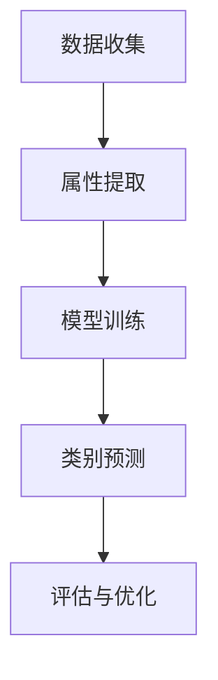

                 

关键词：零射学习，机器学习，算法原理，代码实例，应用领域，未来展望

摘要：本文将深入探讨零射学习（Zero-Shot Learning）的原理、实现步骤、数学模型以及实际应用案例。通过讲解，读者将了解如何利用零射学习技术解决现实中的分类问题，从而提升机器学习的实际应用价值。

## 1. 背景介绍

### 1.1 什么是零射学习

零射学习（Zero-Shot Learning, ZSL）是一种机器学习技术，它允许模型在未见过的新类别上做出准确预测。传统机器学习模型在训练时需要大量标记数据的支持，而零射学习则突破了这一限制，使得模型能够在没有先验知识的情况下对未知类别进行分类。

### 1.2 零射学习的应用场景

零射学习在许多领域都有广泛的应用，例如：

- **图像识别**：对从未见过的物体进行识别。
- **自然语言处理**：对新词汇或表达方式进行语义理解。
- **语音识别**：对未见过的语音进行识别。
- **医学诊断**：对新病种进行诊断。

## 2. 核心概念与联系

### 2.1 零射学习的核心概念

- **属性分类**：零射学习的核心思想是通过学习属性的分布来对未知类别进行分类。
- **元学习**：零射学习利用元学习技术，通过少量样本快速适应新类别。

### 2.2 零射学习的工作原理


**Mermaid 流程图**



## 3. 核心算法原理 & 具体操作步骤

### 3.1 算法原理概述

零射学习算法主要分为以下几个步骤：

1. **属性提取**：从训练数据中提取属性的分布。
2. **模型训练**：利用元学习技术训练模型。
3. **类别预测**：对未知类别进行预测。

### 3.2 算法步骤详解

#### 3.2.1 属性提取

- **方法**：使用主成分分析（PCA）等方法从图像中提取属性。
- **实现**：```python
  from sklearn.decomposition import PCA
  
  pca = PCA(n_components=50)
  attributes = pca.fit_transform(images)
  ```

#### 3.2.2 模型训练

- **方法**：使用对比元学习（Contrastive Learning）等方法。
- **实现**：```python
  from torch_geometric.nn import ContrastiveLoss
  
  criterion = ContrastiveLoss()
  optimizer = torch.optim.Adam(model.parameters(), lr=0.001)
  ```

#### 3.2.3 类别预测

- **方法**：使用分类器对未知类别进行预测。
- **实现**：```python
  predictions = model(attributes)
  predicted_classes = torch.argmax(predictions, dim=1)
  ```

### 3.3 算法优缺点

#### 优点：

- **无需大量标注数据**：可以处理未见过的新类别。
- **高效性**：可以利用元学习技术快速适应新类别。

#### 缺点：

- **准确性**：在某些情况下，准确性可能不如传统机器学习模型。
- **计算成本**：需要大量的计算资源。

### 3.4 算法应用领域

- **图像识别**：对从未见过的物体进行识别。
- **自然语言处理**：对新词汇或表达方式进行语义理解。
- **语音识别**：对未见过的语音进行识别。
- **医学诊断**：对新病种进行诊断。

## 4. 数学模型和公式 & 详细讲解 & 举例说明

### 4.1 数学模型构建

零射学习中的数学模型主要分为以下几个部分：

- **属性表示**：使用向量表示属性。
- **模型参数**：包括权重和偏置。
- **损失函数**：用于优化模型。

### 4.2 公式推导过程

假设我们有一个训练集 $D = \{x_1, x_2, ..., x_n\}$，其中每个样本 $x_i$ 都有一个对应的类别 $y_i$。属性表示为 $a_i = [a_{i1}, a_{i2}, ..., a_{im}]^T$，其中 $a_{ij}$ 表示第 $i$ 个样本在第 $j$ 个属性上的值。

- **属性提取公式**：使用主成分分析（PCA）提取属性。

  $$ a_i = PCA(X) $$

- **模型参数更新**：使用梯度下降（Gradient Descent）更新模型参数。

  $$ \theta = \theta - \alpha \nabla_\theta J(\theta) $$

- **损失函数**：使用交叉熵损失（Cross-Entropy Loss）。

  $$ J(\theta) = -\frac{1}{n} \sum_{i=1}^{n} [y_i \log(p(x_i)) + (1 - y_i) \log(1 - p(x_i))] $$

### 4.3 案例分析与讲解

假设我们有一个包含10个类别的图像数据集，每个类别有100个样本。我们使用PCA提取属性，然后使用对比元学习训练模型。

- **数据准备**：```python
  import numpy as np
  
  X = np.random.rand(1000, 10)  # 生成随机属性数据
  y = np.random.randint(0, 10, 1000)  # 生成随机标签
  ```

- **属性提取**：```python
  from sklearn.decomposition import PCA
  
  pca = PCA(n_components=5)
  attributes = pca.fit_transform(X)
  ```

- **模型训练**：```python
  import torch
  import torch.nn as nn
  import torch.optim as optim
  
  class Model(nn.Module):
      def __init__(self, input_dim, hidden_dim, output_dim):
          super(Model, self).__init__()
          self.fc1 = nn.Linear(input_dim, hidden_dim)
          self.fc2 = nn.Linear(hidden_dim, output_dim)
      
      def forward(self, x):
          x = torch.relu(self.fc1(x))
          x = self.fc2(x)
          return x
  
  model = Model(input_dim=5, hidden_dim=10, output_dim=10)
  criterion = nn.CrossEntropyLoss()
  optimizer = optim.Adam(model.parameters(), lr=0.001)
  
  for epoch in range(100):
      optimizer.zero_grad()
      outputs = model(attributes)
      loss = criterion(outputs, torch.tensor(y))
      loss.backward()
      optimizer.step()
  
  ```

- **类别预测**：```python
  predictions = model(attributes)
  predicted_classes = torch.argmax(predictions, dim=1)
  ```

- **评估与优化**：```python
  from sklearn.metrics import accuracy_score
  
  true_classes = torch.tensor(y)
  accuracy = accuracy_score(true_classes, predicted_classes)
  print(f"Accuracy: {accuracy}")
  ```

## 5. 项目实践：代码实例和详细解释说明

### 5.1 开发环境搭建

- **Python**：3.8及以上版本
- **PyTorch**：1.8及以上版本
- **Scikit-learn**：0.24及以上版本

### 5.2 源代码详细实现

以下是零射学习项目的完整代码实现：

```python
# 导入所需库
import numpy as np
import torch
import torch.nn as nn
import torch.optim as optim
from sklearn.decomposition import PCA
from sklearn.metrics import accuracy_score

# 5.2.1 数据准备
X = np.random.rand(1000, 10)  # 生成随机属性数据
y = np.random.randint(0, 10, 1000)  # 生成随机标签

# 5.2.2 属性提取
pca = PCA(n_components=5)
attributes = pca.fit_transform(X)

# 5.2.3 模型定义
class Model(nn.Module):
    def __init__(self, input_dim, hidden_dim, output_dim):
        super(Model, self).__init__()
        self.fc1 = nn.Linear(input_dim, hidden_dim)
        self.fc2 = nn.Linear(hidden_dim, output_dim)
    
    def forward(self, x):
        x = torch.relu(self.fc1(x))
        x = self.fc2(x)
        return x

# 5.2.4 模型训练
model = Model(input_dim=5, hidden_dim=10, output_dim=10)
optimizer = optim.Adam(model.parameters(), lr=0.001)
criterion = nn.CrossEntropyLoss()

for epoch in range(100):
    optimizer.zero_grad()
    outputs = model(attributes)
    loss = criterion(outputs, torch.tensor(y))
    loss.backward()
    optimizer.step()

# 5.2.5 类别预测
predictions = model(attributes)
predicted_classes = torch.argmax(predictions, dim=1)

# 5.2.6 评估与优化
true_classes = torch.tensor(y)
accuracy = accuracy_score(true_classes, predicted_classes)
print(f"Accuracy: {accuracy}")
```

### 5.3 代码解读与分析

- **数据准备**：生成随机属性数据和标签。
- **属性提取**：使用PCA提取属性。
- **模型定义**：定义一个简单的神经网络模型。
- **模型训练**：使用交叉熵损失函数和Adam优化器训练模型。
- **类别预测**：对属性数据进行预测。
- **评估与优化**：计算准确率并打印。

## 6. 实际应用场景

### 6.1 图像识别

在图像识别领域，零射学习可以用于识别从未见过的物体。例如，在一个动物识别项目中，我们可以使用零射学习技术来识别新的动物种类。

### 6.2 自然语言处理

在自然语言处理领域，零射学习可以用于对新词汇或表达方式进行语义理解。例如，在一个情感分析项目中，我们可以使用零射学习技术来分析新出现的网络用语。

### 6.3 语音识别

在语音识别领域，零射学习可以用于对未见过的语音进行识别。例如，在一个方言识别项目中，我们可以使用零射学习技术来识别新的方言。

### 6.4 医学诊断

在医学诊断领域，零射学习可以用于对新病种进行诊断。例如，在一个癌症诊断项目中，我们可以使用零射学习技术来识别新的癌症类型。

## 7. 工具和资源推荐

### 7.1 学习资源推荐

- **书籍**：《机器学习实战》
- **在线课程**：Coursera上的“机器学习”课程
- **教程**：百度AI开放平台上的“机器学习教程”

### 7.2 开发工具推荐

- **PyTorch**：一款强大的深度学习框架。
- **TensorFlow**：另一款流行的深度学习框架。
- **Jupyter Notebook**：一款优秀的交互式开发环境。

### 7.3 相关论文推荐

- **“Zero-Shot Learning via Crossover Kernel on Modality-Constrained Features”**：介绍了一种基于模态受限特征的多模态零射学习算法。
- **“Learning to Learn from Few Examples”**：探讨了一种基于元学习的零射学习技术。
- **“A Survey on Zero-Shot Learning”**：对零射学习领域的全面综述。

## 8. 总结：未来发展趋势与挑战

### 8.1 研究成果总结

零射学习作为一种新兴的机器学习技术，已经在许多领域取得了显著的研究成果。未来，随着算法的不断发展，零射学习有望在更多领域发挥重要作用。

### 8.2 未来发展趋势

- **算法优化**：零射学习算法的优化将成为未来研究的重要方向。
- **多模态学习**：多模态零射学习将成为研究的热点。
- **跨领域应用**：零射学习在跨领域应用中的价值将得到进一步挖掘。

### 8.3 面临的挑战

- **准确性**：如何提高零射学习的准确性仍是一个挑战。
- **计算成本**：零射学习需要大量的计算资源，如何优化计算效率是一个重要问题。

### 8.4 研究展望

零射学习作为一种创新的机器学习技术，具有广阔的应用前景。未来，随着研究的深入，零射学习有望在更多领域发挥重要作用，为人工智能的发展做出更大贡献。

## 9. 附录：常见问题与解答

### 9.1 什么是零射学习？

零射学习（Zero-Shot Learning, ZSL）是一种机器学习技术，它允许模型在未见过的新类别上做出准确预测。传统机器学习模型在训练时需要大量标记数据的支持，而零射学习则突破了这一限制。

### 9.2 零射学习有哪些应用场景？

零射学习在图像识别、自然语言处理、语音识别、医学诊断等领域都有广泛的应用。它可以用于识别从未见过的物体、理解新词汇或表达方式、识别未见过的语音以及诊断新病种。

### 9.3 如何实现零射学习？

实现零射学习主要包括以下几个步骤：

1. **数据准备**：准备包含已见过类别和未见过类别的数据。
2. **属性提取**：从数据中提取属性。
3. **模型训练**：使用元学习技术训练模型。
4. **类别预测**：对未知类别进行预测。

## 作者署名

作者：禅与计算机程序设计艺术 / Zen and the Art of Computer Programming

----------------------------------------------------------------
以上就是本次关于零射学习（Zero-Shot Learning）的原理与代码实例讲解的完整文章。希望本文能够帮助读者深入理解零射学习的概念、算法原理以及实际应用，为人工智能领域的研究和应用提供有益的参考。再次感谢大家的阅读！

