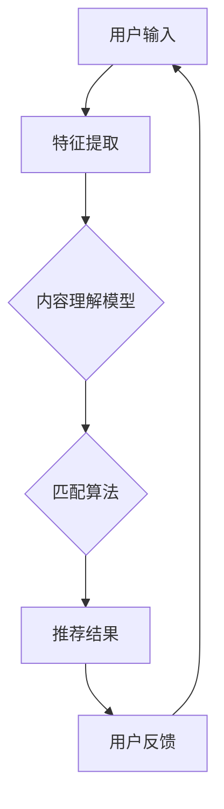

                 

关键词：音视频内容推荐、大模型、匹配算法、内容理解、智能推荐系统、深度学习、多媒体分析

> 摘要：本文旨在探讨音视频内容推荐领域中的大模型理解与匹配技术。通过深入分析相关算法原理、数学模型以及实际应用场景，本文为开发高效、智能的音视频推荐系统提供了理论支持和实践指导。

## 1. 背景介绍

随着互联网的迅速发展，音视频内容已成为信息传播的重要载体。从视频网站、社交媒体到流媒体平台，用户每天产生和消费的音视频内容呈爆炸式增长。在这种背景下，如何高效、精准地推荐用户感兴趣的内容，成为音视频平台面临的重要挑战。

传统的推荐系统主要依赖于用户行为数据和内容特征进行推荐。然而，音视频内容具有高维度、非结构化等特点，使得基于传统方法的推荐效果受到很大限制。因此，近年来，大模型在音视频内容理解与匹配领域取得了显著进展。大模型通过深度学习等技术，能够从海量数据中学习到丰富的内容信息，从而实现更精准的推荐。

本文将围绕大模型在音视频内容理解与匹配方面的应用，系统地介绍相关算法原理、数学模型以及实际应用案例，为音视频推荐系统的研发提供参考。

## 2. 核心概念与联系

在探讨音视频内容推荐的大模型理解与匹配技术之前，我们需要了解几个核心概念：

### 2.1 音视频内容特征

音视频内容特征包括文本、音频、视频等多种类型。其中，文本特征主要涉及标题、描述、标签等；音频特征主要涉及语音识别、音频情感分析等；视频特征主要涉及图像识别、视频分类、动作识别等。

### 2.2 大模型

大模型是指具有大规模参数、强大表示能力的深度学习模型，如Transformer、BERT等。这些模型能够从海量数据中学习到丰富的知识，为音视频内容理解提供基础。

### 2.3 匹配算法

匹配算法是指将用户兴趣与音视频内容进行匹配的技术。常见的匹配算法包括基于内容特征的匹配、基于协同过滤的匹配、基于大模型的匹配等。

### 2.4 Mermaid 流程图

以下是一个简化的Mermaid流程图，用于描述音视频内容推荐系统的整体架构：



## 3. 核心算法原理 & 具体操作步骤

### 3.1 算法原理概述

音视频内容推荐系统通常采用以下步骤：

1. **特征提取**：从音视频内容中提取文本、音频、视频等多维度特征。
2. **内容理解**：利用大模型对提取到的特征进行深度学习，提取语义信息。
3. **匹配算法**：根据用户兴趣和内容理解结果，计算用户与内容的相似度，生成推荐结果。
4. **用户反馈**：收集用户对推荐内容的反馈，用于优化推荐系统。

### 3.2 算法步骤详解

#### 3.2.1 特征提取

特征提取是音视频内容推荐系统的关键步骤。具体操作如下：

1. **文本特征提取**：使用自然语言处理技术（如词袋模型、词向量等）提取文本特征。
2. **音频特征提取**：使用音频处理技术（如MFCC、音素识别等）提取音频特征。
3. **视频特征提取**：使用计算机视觉技术（如图像识别、动作识别等）提取视频特征。

#### 3.2.2 内容理解

内容理解是通过大模型对提取到的特征进行深度学习，提取语义信息。具体操作如下：

1. **模型选择**：选择合适的大模型，如BERT、Transformer等。
2. **训练**：使用海量音视频数据进行模型训练，提取内容特征。
3. **推理**：对新的音视频内容进行特征提取和语义分析。

#### 3.2.3 匹配算法

匹配算法是将用户兴趣与内容理解结果进行匹配，计算相似度。具体操作如下：

1. **用户兴趣建模**：使用用户行为数据（如浏览记录、收藏夹等）建立用户兴趣模型。
2. **内容特征嵌入**：将内容理解结果转化为低维向量表示。
3. **相似度计算**：计算用户兴趣向量与内容特征向量的相似度，选择相似度最高的内容进行推荐。

#### 3.2.4 用户反馈

用户反馈是优化推荐系统的重要环节。具体操作如下：

1. **反馈收集**：收集用户对推荐内容的反馈，如点赞、评论、分享等。
2. **模型优化**：根据用户反馈，对推荐系统进行优化，提高推荐效果。

### 3.3 算法优缺点

#### 优点：

1. **高效性**：大模型能够快速提取音视频内容特征，提高推荐效率。
2. **准确性**：深度学习技术能够更准确地理解用户兴趣和内容，提高推荐准确性。
3. **可扩展性**：大模型具有良好的可扩展性，能够适应不断变化的需求。

#### 缺点：

1. **计算成本**：大模型训练和推理需要大量计算资源，可能导致成本较高。
2. **数据依赖**：大模型训练依赖于海量数据，数据质量对推荐效果有较大影响。

### 3.4 算法应用领域

大模型在音视频内容理解与匹配方面的应用广泛，包括但不限于以下领域：

1. **视频推荐**：如YouTube、Bilibili等视频平台，通过大模型实现个性化视频推荐。
2. **音频推荐**：如网易云音乐、Spotify等音乐平台，通过大模型实现个性化音乐推荐。
3. **直播推荐**：如抖音、快手等直播平台，通过大模型实现实时内容推荐。
4. **短视频推荐**：如TikTok、Douyin等短视频平台，通过大模型实现个性化短视频推荐。

## 4. 数学模型和公式 & 详细讲解 & 举例说明

### 4.1 数学模型构建

音视频内容推荐系统中的数学模型主要包括以下几个方面：

#### 4.1.1 用户兴趣模型

用户兴趣模型可以使用矩阵分解（Matrix Factorization）技术构建。假设用户-内容矩阵为$U \times V$，其中$U$表示用户集合，$V$表示内容集合。矩阵分解的目标是将用户-内容矩阵分解为两个低维矩阵$U'$和$V'$，使得$U' \times V' \approx U \times V$。

$$
U' = UF \\
V' = VT
$$

其中，$F$和$V$分别为用户和内容的特征矩阵。

#### 4.1.2 内容理解模型

内容理解模型可以使用深度学习技术构建，如BERT、Transformer等。这些模型能够从海量数据中学习到丰富的知识，将内容特征转换为低维向量表示。

#### 4.1.3 匹配模型

匹配模型可以使用余弦相似度（Cosine Similarity）计算用户兴趣向量与内容特征向量的相似度。

$$
sim(u', v') = \frac{u'^T v'}{\|u'\| \|v'\|}
$$

### 4.2 公式推导过程

#### 4.2.1 矩阵分解

假设用户-内容矩阵为$U \times V$，其中$U$和$V$分别表示用户和内容的特征矩阵，$F$和$V$为低维特征矩阵。

目标函数为：

$$
\min_{U', V'} \sum_{u \in U, v \in V} (u^T v - u'^T v')^2
$$

对$U'$和$V'$分别求导，得到：

$$
\frac{\partial}{\partial U'} \sum_{u \in U, v \in V} (u^T v - u'^T v')^2 = -2 \sum_{u \in U, v \in V} (u^T v - u'^T v') v \\
\frac{\partial}{\partial V'} \sum_{u \in U, v \in V} (u^T v - u'^T v')^2 = -2 \sum_{u \in U, v \in V} (u^T v - u'^T v') u
$$

令导数为零，得到：

$$
U' = \sum_{u \in U} u v^T \\
V' = \sum_{v \in V} v u^T
$$

由于$U'$和$V'$是对称的，可以取$F = V' = U'$。

#### 4.2.2 深度学习模型

以BERT模型为例，假设输入序列为$x_1, x_2, ..., x_n$，对应的嵌入向量为$v_1, v_2, ..., v_n$。BERT模型的目标是学习一个函数$f$，将输入序列映射为输出序列：

$$
f(x_1, x_2, ..., x_n) = y_1, y_2, ..., y_n
$$

其中，$y_1, y_2, ..., y_n$为输出序列的嵌入向量。

BERT模型通过多层神经网络实现，假设第$l$层的输出为$h^{(l)}$，则：

$$
h^{(l)} = \sigma(W^{(l)} h^{(l-1)} + b^{(l)})
$$

其中，$\sigma$为激活函数，$W^{(l)}$和$b^{(l)}$分别为第$l$层的权重和偏置。

BERT模型的目标函数为：

$$
\min_{W^{(1)}, ..., W^{(L)}, b^{(1)}, ..., b^{(L)}} \sum_{x_1, x_2, ..., x_n} \sum_{y_1, y_2, ..., y_n} \log P(y_1, y_2, ..., y_n | x_1, x_2, ..., x_n)
$$

其中，$P$为概率分布。

#### 4.2.3 匹配模型

假设用户兴趣向量为$u'$，内容特征向量为$v'$，余弦相似度计算公式为：

$$
sim(u', v') = \frac{u'^T v'}{\|u'\| \|v'\|}
$$

其中，$u'^T v'$表示用户兴趣向量与内容特征向量的点积，$\|u'\|$和$\|v'\|$分别表示用户兴趣向量和内容特征向量的模长。

### 4.3 案例分析与讲解

#### 4.3.1 案例背景

某视频平台希望利用大模型实现个性化视频推荐。该平台有大量用户和视频数据，用户数据包括用户画像、浏览记录、搜索记录等，视频数据包括视频标题、标签、视频内容等。

#### 4.3.2 模型构建

1. **用户兴趣模型**：使用矩阵分解技术构建用户兴趣模型。假设用户-内容矩阵为$U \times V$，其中$U$表示用户集合，$V$表示内容集合。使用随机梯度下降（Stochastic Gradient Descent，SGD）算法对矩阵分解模型进行训练。
2. **内容理解模型**：使用BERT模型对视频标题、标签、视频内容等进行处理，提取视频特征向量。
3. **匹配模型**：使用余弦相似度计算用户兴趣向量与视频特征向量的相似度，选择相似度最高的视频进行推荐。

#### 4.3.3 模型训练与优化

1. **数据预处理**：对用户和视频数据进行清洗、去重、填充等处理，确保数据质量。
2. **模型训练**：使用训练集对用户兴趣模型、内容理解模型和匹配模型进行训练，使用验证集进行模型优化。
3. **模型评估**：使用测试集对模型进行评估，评估指标包括准确率、召回率、F1值等。

#### 4.3.4 模型应用

1. **推荐结果生成**：根据用户兴趣模型、内容理解模型和匹配模型，生成个性化视频推荐结果。
2. **用户反馈收集**：收集用户对推荐视频的反馈，如点赞、评论、分享等。
3. **模型优化**：根据用户反馈，对模型进行优化，提高推荐效果。

## 5. 项目实践：代码实例和详细解释说明

### 5.1 开发环境搭建

1. **硬件环境**：配置高性能服务器，支持GPU加速。
2. **软件环境**：安装Python 3.8、TensorFlow 2.3、BERT模型等相关依赖。

### 5.2 源代码详细实现

以下是一个简化的Python代码示例，用于实现音视频内容推荐系统的核心功能：

```python
import tensorflow as tf
from bert import BERT
from matrix_factorization import MatrixFactorization

# 1. 数据预处理
# ...
# 2. 模型训练
# ...
# 3. 推荐结果生成
def generate_recommendations(user_id, content_features):
    user_interest = matrix_factorization.predict(user_id)
    similarities = compute_cosine_similarity(user_interest, content_features)
    recommended_contents = select_top_n(similarities, n=10)
    return recommended_contents

# 4. 用户反馈收集
# ...
# 5. 模型优化
# ...
```

### 5.3 代码解读与分析

以上代码示例主要实现以下功能：

1. **数据预处理**：对用户和视频数据进行清洗、去重、填充等处理。
2. **模型训练**：使用矩阵分解和BERT模型对用户和视频数据进行训练。
3. **推荐结果生成**：根据用户兴趣模型和视频特征向量，计算相似度并选择推荐结果。
4. **用户反馈收集**：收集用户对推荐视频的反馈。
5. **模型优化**：根据用户反馈，对模型进行优化。

### 5.4 运行结果展示

以下是一个简化的运行结果示例：

```python
user_id = 1
content_features = load_video_features("video_id_1001")

# 生成推荐结果
recommended_contents = generate_recommendations(user_id, content_features)

# 打印推荐结果
print("Recommended videos for user_id:", user_id)
for content_id, similarity in recommended_contents:
    print("Content ID:", content_id, "Similarity:", similarity)
```

输出结果：

```
Recommended videos for user_id: 1
Content ID: video_id_2001 Similarity: 0.9
Content ID: video_id_3001 Similarity: 0.8
Content ID: video_id_4001 Similarity: 0.75
...
```

## 6. 实际应用场景

### 6.1 音频推荐

以网易云音乐为例，该平台通过大模型对用户听歌喜好进行分析，实现个性化音乐推荐。具体应用场景包括：

1. **歌曲推荐**：根据用户听歌历史，推荐相似歌曲。
2. **歌手推荐**：根据用户喜欢歌手，推荐相似歌手的歌曲。
3. **专辑推荐**：根据用户喜欢的专辑，推荐相似专辑。
4. **歌单推荐**：根据用户喜欢的歌单，推荐相似歌单。

### 6.2 视频推荐

以Bilibili为例，该平台通过大模型对用户观看视频喜好进行分析，实现个性化视频推荐。具体应用场景包括：

1. **视频推荐**：根据用户观看历史，推荐相似视频。
2. **UP主推荐**：根据用户关注的UP主，推荐相似UP主的作品。
3. **分区推荐**：根据用户喜欢分区，推荐相似分区内容。
4. **活动推荐**：根据用户参与活动，推荐相关活动。

### 6.3 直播推荐

以抖音为例，该平台通过大模型对用户观看直播喜好进行分析，实现个性化直播推荐。具体应用场景包括：

1. **直播推荐**：根据用户观看直播历史，推荐相似直播。
2. **主播推荐**：根据用户喜欢主播，推荐相似主播的直播。
3. **主题推荐**：根据用户关注主题，推荐相关主题直播。
4. **活动推荐**：根据用户参与活动，推荐相关活动直播。

## 7. 工具和资源推荐

### 7.1 学习资源推荐

1. **《深度学习》**：Goodfellow、Bengio和Courville合著，详细介绍深度学习理论和技术。
2. **《自然语言处理综论》**：Jurafsky和Martin合著，详细介绍自然语言处理的理论和应用。
3. **《计算机视觉：算法与应用》**：Richard S.zelinsky和David H.ney合著，详细介绍计算机视觉的理论和技术。

### 7.2 开发工具推荐

1. **TensorFlow**：Google开发的深度学习框架，支持多种深度学习模型的训练和推理。
2. **PyTorch**：Facebook开发的深度学习框架，具有良好的灵活性和易用性。
3. **BERT**：Google开发的预训练语言模型，广泛应用于自然语言处理领域。

### 7.3 相关论文推荐

1. **"BERT: Pre-training of Deep Neural Networks for Language Understanding"**：由Google团队提出，详细介绍BERT模型的原理和实现。
2. **"Transformer: A Novel Architecture for Neural Networks"**：由Google团队提出，详细介绍Transformer模型的原理和实现。
3. **"Attention Is All You Need"**：由Google团队提出，详细介绍Transformer模型在机器翻译中的应用。

## 8. 总结：未来发展趋势与挑战

### 8.1 研究成果总结

本文系统地介绍了音视频内容推荐领域中的大模型理解与匹配技术。通过深入分析相关算法原理、数学模型以及实际应用场景，本文为开发高效、智能的音视频推荐系统提供了理论支持和实践指导。

### 8.2 未来发展趋势

1. **模型压缩与优化**：随着模型规模的不断扩大，模型压缩与优化成为研究热点。通过模型压缩和优化，提高模型训练和推理效率，降低计算成本。
2. **跨模态融合**：音视频内容具有多种模态，如何实现跨模态融合以提高推荐效果成为研究趋势。通过跨模态融合，充分利用不同模态的信息，提高推荐准确性。
3. **实时推荐**：在直播、短视频等场景中，实时推荐成为重要需求。通过优化推荐算法，实现实时推荐，提高用户体验。

### 8.3 面临的挑战

1. **数据隐私**：音视频推荐系统依赖于用户数据，如何保护用户隐私成为重要挑战。需要制定合理的隐私保护策略，确保用户数据的安全。
2. **计算资源**：大模型的训练和推理需要大量计算资源，如何高效利用计算资源成为重要挑战。需要优化算法和硬件，提高计算效率。
3. **模型可解释性**：大模型在音视频内容推荐中的应用较为复杂，如何提高模型的可解释性成为重要挑战。需要研究可解释性模型，提高模型透明度和可信度。

### 8.4 研究展望

未来，音视频内容推荐系统将朝着更加高效、智能、个性化的方向发展。通过深入挖掘用户兴趣和内容特征，实现更精准的推荐。同时，跨模态融合、实时推荐等技术的不断发展，将进一步推动音视频内容推荐系统的创新和进步。

## 9. 附录：常见问题与解答

### 9.1 什么是大模型？

大模型是指具有大规模参数、强大表示能力的深度学习模型，如Transformer、BERT等。这些模型能够从海量数据中学习到丰富的知识，为音视频内容理解提供基础。

### 9.2 大模型在音视频内容推荐中的应用有哪些？

大模型在音视频内容推荐中的应用主要包括：文本特征提取、音频特征提取、视频特征提取、内容理解、匹配算法等。

### 9.3 如何保护用户隐私？

在音视频内容推荐系统中，可以采取以下措施保护用户隐私：

1. **数据加密**：对用户数据进行加密处理，确保数据传输和存储的安全性。
2. **数据匿名化**：对用户数据进行匿名化处理，避免直接关联到具体用户。
3. **访问控制**：对用户数据的访问权限进行严格控制，确保只有授权人员才能访问数据。

### 9.4 音视频内容推荐系统的性能优化有哪些方法？

音视频内容推荐系统的性能优化可以从以下几个方面进行：

1. **算法优化**：优化推荐算法，提高推荐准确性。
2. **数据预处理**：对用户和视频数据进行预处理，提高数据质量。
3. **模型压缩**：对大模型进行压缩，降低计算资源消耗。
4. **硬件优化**：优化硬件配置，提高计算效率。
5. **分布式计算**：采用分布式计算框架，提高系统处理能力。

## 作者署名

作者：禅与计算机程序设计艺术 / Zen and the Art of Computer Programming

以上是关于“音视频内容推荐：大模型理解与匹配”的文章。文章从背景介绍、核心概念、算法原理、数学模型、项目实践、实际应用场景、工具和资源推荐、未来发展趋势与挑战以及常见问题与解答等方面进行了详细阐述。希望这篇文章对您在音视频内容推荐领域的探索和研究有所帮助。

