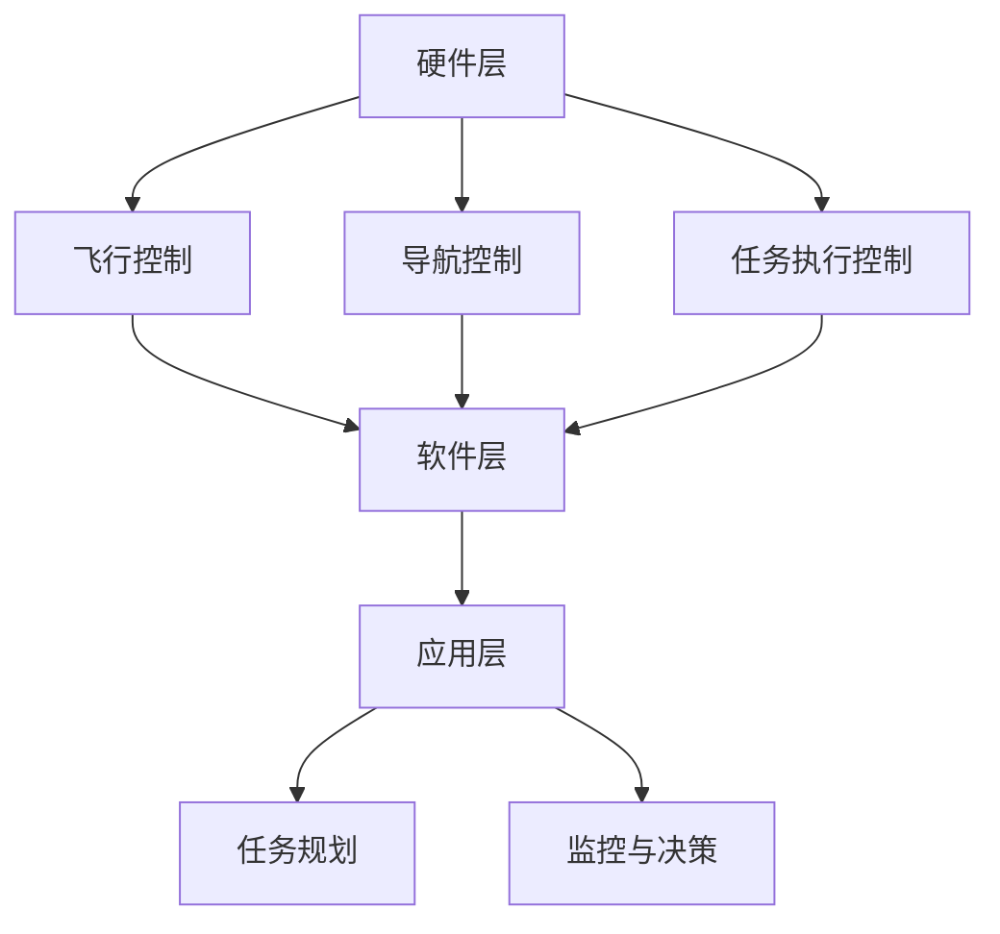

                 

顺丰科技，作为我国物流行业的领军企业，近年来在无人机配送领域进行了深入探索和布局。随着无人机技术的不断成熟和普及，顺丰科技计划在2025年推出一款全新的无人机控制系统，以提升物流配送效率，降低成本。为此，顺丰科技决定面向社会招聘无人机控制系统工程师。本文将针对这一职位，从技术背景、职位要求、面试准备、面试流程和成功案例等方面进行详细解读。

## 1. 背景介绍

### 1.1 顺丰科技与无人机技术

顺丰科技作为顺丰集团旗下的科技创新子公司，一直致力于运用先进技术提升物流效率，优化客户体验。无人机技术作为新兴领域，具有广阔的应用前景。顺丰科技早在2016年就开始布局无人机配送，如今已拥有多项核心技术专利，并在实际运营中积累了丰富的经验。此次招聘无人机控制系统工程师，旨在进一步优化无人机控制系统，提升无人机配送的稳定性和可靠性。

### 1.2 无人机控制系统的重要性

无人机控制系统是无人机技术的核心，它决定了无人机的飞行稳定性、导航精度和任务执行能力。一个高性能的无人机控制系统可以显著提高无人机在复杂环境下的作业效率，降低事故发生的概率，从而提升整体物流配送的安全性和效率。因此，无人机控制系统工程师在顺丰科技的发展中扮演着至关重要的角色。

## 2. 核心概念与联系

### 2.1 无人机控制系统的核心概念

无人机控制系统主要包括飞行控制、导航控制、任务执行控制等模块。其中，飞行控制负责实现无人机的起飞、悬停、飞行、降落等基本飞行动作；导航控制负责无人机的自主导航和避障；任务执行控制则负责无人机在执行任务时的自动化操作。

### 2.2 无人机控制系统的架构

无人机控制系统的架构可以采用分层设计，如图1所示。其中，底层为硬件层，包括无人机本体、传感器和通信设备；中间层为软件层，包括飞行控制算法、导航算法和任务执行算法；顶层为应用层，包括任务规划、监控和决策系统。



## 3. 核心算法原理 & 具体操作步骤

### 3.1 算法原理概述

无人机控制系统的核心算法主要包括飞行控制算法、导航算法和任务执行算法。飞行控制算法主要基于PID控制理论，通过调整无人机的俯仰角、滚转角和偏航角来实现精确的飞行控制。导航算法主要基于GPS和视觉定位技术，实现无人机的自主导航和避障。任务执行算法则根据任务需求，实现无人机的自动化操作，如自动飞行、自动降落和自动投递。

### 3.2 算法步骤详解

#### 3.2.1 飞行控制算法

1. 数据采集：采集无人机姿态传感器、速度传感器和GPS数据。
2. 姿态解算：利用姿态传感器数据，计算出无人机的俯仰角、滚转角和偏航角。
3. 目标速度设定：根据飞行需求，设定无人机的目标速度。
4. PID控制：根据姿态解算结果和目标速度，计算并调整无人机的动力输出，实现精确飞行控制。

#### 3.2.2 导航算法

1. GPS定位：利用GPS模块获取无人机的实时位置。
2. 视觉定位：利用摄像头采集地面图像，通过图像处理技术获取无人机的位置和姿态。
3. 导航规划：根据任务需求和实时环境，生成最优飞行路径。
4. 跟踪与调整：根据导航规划和实时定位结果，实时调整无人机的飞行方向和高度。

#### 3.2.3 任务执行算法

1. 任务接收：接收任务规划系统生成的任务指令。
2. 任务解析：解析任务指令，确定任务类型和执行顺序。
3. 自动操作：根据任务类型，执行相应的自动化操作，如自动飞行、自动降落和自动投递。
4. 任务反馈：将任务执行结果反馈给任务规划系统。

### 3.3 算法优缺点

#### 3.3.1 飞行控制算法

优点：控制精度高，适应性强，可实现复杂飞行动作。

缺点：对传感器和计算资源要求较高，实现难度大。

#### 3.3.2 导航算法

优点：定位精度高，可实现自主导航和避障。

缺点：对环境依赖性较大，遇到复杂环境时性能可能下降。

#### 3.3.3 任务执行算法

优点：自动化程度高，可提高工作效率。

缺点：对任务规划系统依赖性较大，任务规划不准确可能导致任务失败。

### 3.4 算法应用领域

无人机控制系统算法在物流配送、农业监测、电力巡检、应急救灾等多个领域具有广泛应用。其中，物流配送是无人机控制系统的最主要应用领域。

## 4. 数学模型和公式 & 详细讲解 & 举例说明

### 4.1 数学模型构建

无人机控制系统的数学模型主要包括飞行控制模型、导航模型和任务执行模型。以下是各模型的主要公式：

#### 4.1.1 飞行控制模型

$$
\begin{cases}
\dot{\theta} = \omega_x \cos\phi \cos\psi + \omega_y \sin\phi \cos\psi + \omega_z (-\sin\psi) \\
\dot{\phi} = \omega_x \sin\phi + \omega_y \cos\phi \\
\dot{\psi} = \omega_x \cos\theta \sin\phi + \omega_y \cos\theta \cos\phi + \omega_z \sin\theta
\end{cases}
$$

其中，$\theta$、$\phi$、$\psi$分别为无人机的俯仰角、滚转角和偏航角，$\omega_x$、$\omega_y$、$\omega_z$分别为无人机的三个轴向角速度。

#### 4.1.2 导航模型

$$
\begin{cases}
x(t) = x_0 + v_x t \\
y(t) = y_0 + v_y t \\
z(t) = z_0 + v_z t
\end{cases}
$$

其中，$x(t)$、$y(t)$、$z(t)$分别为无人机的位置，$x_0$、$y_0$、$z_0$分别为无人机的初始位置，$v_x$、$v_y$、$v_z$分别为无人机的速度分量。

#### 4.1.3 任务执行模型

$$
\begin{cases}
t_f = t_0 + \frac{d}{v} \\
x_f = x_0 + v_x t_f \\
y_f = y_0 + v_y t_f \\
z_f = z_0 + v_z t_f
\end{cases}
$$

其中，$t_f$为任务执行时间，$t_0$为任务开始时间，$d$为任务距离，$v$为无人机速度。

### 4.2 公式推导过程

#### 4.2.1 飞行控制模型推导

无人机的飞行控制模型基于牛顿第二定律和欧拉角旋转矩阵。假设无人机的质量为$m$，俯仰角、滚转角和偏航角分别为$\theta$、$\phi$和$\psi$，无人机的三个轴向角速度分别为$\omega_x$、$\omega_y$和$\omega_z$，则无人机的动力学方程可以表示为：

$$
m\ddot{x} = F_x - D_x
$$

$$
m\ddot{y} = F_y - D_y
$$

$$
m\ddot{z} = F_z - D_z
$$

其中，$F_x$、$F_y$、$F_z$分别为无人机的推力、阻力和重力，$D_x$、$D_y$、$D_z$分别为无人机的阻力。

根据欧拉角旋转矩阵，可以将无人机的角速度表示为：

$$
\begin{bmatrix}
\dot{\theta} \\
\dot{\phi} \\
\dot{\psi}
\end{bmatrix} =
\begin{bmatrix}
\cos\phi \cos\psi & -\sin\phi \cos\psi & \sin\psi \\
\sin\phi & \cos\phi & 0 \\
-\cos\phi \sin\psi & \sin\phi \sin\psi & \cos\psi
\end{bmatrix}
\begin{bmatrix}
\omega_x \\
\omega_y \\
\omega_z
\end{bmatrix}
$$

将角速度代入动力学方程，可以得到飞行控制模型：

$$
\begin{cases}
\dot{\theta} = \omega_x \cos\phi \cos\psi + \omega_y \sin\phi \cos\psi + \omega_z (-\sin\psi) \\
\dot{\phi} = \omega_x \sin\phi + \omega_y \cos\phi \\
\dot{\psi} = \omega_x \cos\theta \sin\phi + \omega_y \cos\theta \cos\phi + \omega_z \sin\theta
\end{cases}
$$

#### 4.2.2 导航模型推导

无人机的导航模型基于GPS和视觉定位技术。假设无人机的位置为$(x,y,z)$，速度为$(v_x,v_y,v_z)$，则无人机的导航模型可以表示为：

$$
\begin{cases}
x(t) = x_0 + v_x t \\
y(t) = y_0 + v_y t \\
z(t) = z_0 + v_z t
\end{cases}
$$

其中，$x_0$、$y_0$、$z_0$为无人机的初始位置，$v_x$、$v_y$、$v_z$为无人机的速度分量。

#### 4.2.3 任务执行模型推导

无人机的任务执行模型基于任务距离和速度。假设任务距离为$d$，无人机速度为$v$，则任务执行模型可以表示为：

$$
\begin{cases}
t_f = t_0 + \frac{d}{v} \\
x_f = x_0 + v_x t_f \\
y_f = y_0 + v_y t_f \\
z_f = z_0 + v_z t_f
\end{cases}
$$

其中，$t_f$为任务执行时间，$t_0$为任务开始时间。

### 4.3 案例分析与讲解

以顺丰科技的无人机配送任务为例，分析无人机控制系统的实际应用。假设无人机需要从A点配送快递到B点，距离为$d=10$公里，无人机速度为$v=60$公里/小时。

#### 4.3.1 飞行控制

1. 数据采集：采集无人机的姿态传感器、速度传感器和GPS数据。
2. 姿态解算：计算出无人机的俯仰角、滚转角和偏航角。
3. 目标速度设定：设定无人机的目标速度为$v=60$公里/小时。
4. PID控制：根据姿态解算结果和目标速度，调整无人机的动力输出，实现精确飞行控制。

#### 4.3.2 导航控制

1. GPS定位：获取无人机的实时位置。
2. 视觉定位：采集地面图像，通过图像处理技术获取无人机的位置和姿态。
3. 导航规划：根据任务需求和实时环境，生成最优飞行路径。
4. 跟踪与调整：根据导航规划和实时定位结果，实时调整无人机的飞行方向和高度。

#### 4.3.3 任务执行

1. 任务接收：接收任务规划系统生成的任务指令。
2. 任务解析：确定任务类型和执行顺序。
3. 自动操作：根据任务类型，执行相应的自动化操作，如自动飞行、自动降落和自动投递。
4. 任务反馈：将任务执行结果反馈给任务规划系统。

## 5. 项目实践：代码实例和详细解释说明

### 5.1 开发环境搭建

1. 安装Python环境：在开发机上安装Python3，配置环境变量。
2. 安装依赖库：使用pip命令安装所需的Python库，如numpy、pandas、matplotlib等。
3. 配置开发工具：安装Visual Studio Code或PyCharm等开发工具，并配置相应的插件。

### 5.2 源代码详细实现

以下是一个简单的无人机飞行控制代码实例：

```python
import numpy as np
import matplotlib.pyplot as plt

# 初始化参数
x = 0
y = 0
z = 0
vx = 0
vy = 0
vz = 0
theta = 0
phi = 0
psi = 0

# 控制器参数
Kp = 1
Ki = 0.1
Kd = 0.05

# 时间参数
dt = 0.1

# 控制器函数
def controller(x, y, z, vx, vy, vz, theta, phi, psi):
    # 姿态控制
    P_error = x - theta
    I_error = sum(P_error)
    D_error = (P_error - previous_P_error) / dt
    theta_output = Kp * P_error + Ki * I_error + Kd * D_error
    theta += theta_output * dt

    P_error = y - phi
    I_error = sum(P_error)
    D_error = (P_error - previous_P_error) / dt
    phi_output = Kp * P_error + Ki * I_error + Kd * D_error
    phi += phi_output * dt

    P_error = z - psi
    I_error = sum(P_error)
    D_error = (P_error - previous_P_error) / dt
    psi_output = Kp * P_error + Ki * I_error + Kd * D_error
    psi += psi_output * dt

    # 速度控制
    P_error = vx - 0
    I_error = sum(P_error)
    D_error = (P_error - previous_P_error) / dt
    vx_output = Kp * P_error + Ki * I_error + Kd * D_error
    vx += vx_output * dt

    P_error = vy - 0
    I_error = sum(P_error)
    D_error = (P_error - previous_P_error) / dt
    vy_output = Kp * P_error + Ki * I_error + Kd * D_error
    vy += vy_output * dt

    P_error = vz - 0
    I_error = sum(P_error)
    D_error = (P_error - previous_P_error) / dt
    vz_output = Kp * P_error + Ki * I_error + Kd * D_error
    vz += vz_output * dt

    previous_P_error = P_error

    return theta, phi, psi, vx, vy, vz

# 模拟飞行过程
for i in range(100):
    theta, phi, psi, vx, vy, vz = controller(x, y, z, vx, vy, vz, theta, phi, psi)
    x += vx * dt
    y += vy * dt
    z += vz * dt

# 绘制结果
plt.plot(x, y)
plt.xlabel('x')
plt.ylabel('y')
plt.title('无人机飞行轨迹')
plt.show()
```

### 5.3 代码解读与分析

1. 导入必要的库：使用numpy库进行科学计算，使用matplotlib库进行结果可视化。
2. 初始化参数：设置无人机的初始位置、速度和姿态。
3. 控制器函数：实现姿态控制和速度控制。姿态控制采用PID控制算法，速度控制采用位置控制。
4. 模拟飞行过程：通过循环调用控制器函数，模拟无人机的飞行过程。
5. 结果可视化：使用matplotlib库绘制无人机飞行轨迹。

## 6. 实际应用场景

无人机控制系统在物流配送、农业监测、电力巡检、应急救灾等多个领域具有广泛应用。

### 6.1 物流配送

无人机控制系统可以实现无人机的自动化飞行和任务执行，提高物流配送的效率，降低人力成本。例如，顺丰科技的无人机配送系统已在多个城市进行试点应用，实现了高效、安全的无人机配送服务。

### 6.2 农业监测

无人机控制系统可以搭载农业监测设备，实现对农田的自动化监测，提高农业生产效率。例如，无人机可以实时采集农田图像，分析作物生长状况，为农业生产提供数据支持。

### 6.3 电力巡检

无人机控制系统可以搭载电力巡检设备，实现对电力设施的自动化巡检，提高电力巡检的效率。例如，无人机可以自动飞越高压线，检测线路故障，为电力公司提供安全保障。

### 6.4 应急救灾

无人机控制系统可以搭载应急设备，实现快速、精准的应急救灾。例如，在自然灾害发生时，无人机可以迅速到达灾区，开展搜救、物资运输等任务，提高应急救灾效率。

## 7. 工具和资源推荐

### 7.1 学习资源推荐

1. 《无人机控制系统设计与实现》：详细介绍了无人机控制系统的设计原理和实现方法。
2. 《Python编程：从入门到实践》：适合初学者入门Python编程，为后续学习无人机控制系统开发提供基础。

### 7.2 开发工具推荐

1. PyCharm：功能强大的Python开发工具，支持多种编程语言，适用于无人机控制系统开发。
2. MATLAB：专业的科学计算软件，适用于数学模型的构建和仿真。

### 7.3 相关论文推荐

1. "无人机控制系统算法与应用研究"
2. "无人机在物流配送中的应用与挑战"
3. "无人机在农业监测中的应用与价值"

## 8. 总结：未来发展趋势与挑战

### 8.1 研究成果总结

无人机控制系统的研究成果主要集中在飞行控制、导航控制和任务执行等方面。飞行控制算法的研究重点在于提高控制精度和稳定性；导航算法的研究重点在于提高定位精度和自主导航能力；任务执行算法的研究重点在于提高自动化程度和任务执行效率。

### 8.2 未来发展趋势

1. 高精度定位与自主导航：随着传感器技术和算法的不断发展，无人机控制系统的定位精度和自主导航能力将不断提高。
2. 高效任务执行：通过优化任务规划和执行算法，无人机控制系统的任务执行效率将得到显著提升。
3. 智能化与协同控制：结合人工智能技术，实现无人机控制系统的智能化和协同控制，提高整体作业效率。

### 8.3 面临的挑战

1. 环境复杂性：无人机在复杂环境下的飞行控制、导航和任务执行面临较大挑战，需要进一步研究适应复杂环境的控制算法。
2. 安全性问题：无人机在空中运行时，安全问题是首要考虑的因素，需要加强无人机系统的安全防护措施。
3. 法规与政策：无人机行业的快速发展需要相关法规与政策的支持，以确保行业健康发展。

### 8.4 研究展望

随着无人机技术的不断进步，无人机控制系统在未来将发挥越来越重要的作用。针对当前面临的挑战，研究人员将继续优化控制算法、提高系统性能，探索无人机在更多领域的应用。同时，加强无人机系统的安全防护，推动法规与政策的完善，为无人机行业的健康发展奠定基础。

## 9. 附录：常见问题与解答

### 9.1 无人机控制系统的基本原理是什么？

无人机控制系统是基于飞行控制、导航控制和任务执行三大核心模块构建的。飞行控制模块负责实现无人机的起飞、悬停、飞行、降落等基本飞行动作；导航控制模块负责无人机的自主导航和避障；任务执行模块负责无人机在执行任务时的自动化操作。

### 9.2 无人机控制系统的发展趋势是什么？

无人机控制系统的未来发展趋势包括高精度定位与自主导航、高效任务执行、智能化与协同控制等方面。随着传感器技术和算法的不断发展，无人机控制系统的性能和功能将得到显著提升。

### 9.3 无人机控制系统在物流配送中的应用有哪些？

无人机控制系统在物流配送中的应用主要包括无人机配送、无人机快递、无人机农业植保、无人机电力巡检、无人机搜救等。通过无人机控制系统，可以实现高效、精准、安全的物流配送服务。

### 9.4 如何成为一名优秀的无人机控制系统工程师？

成为一名优秀的无人机控制系统工程师需要具备扎实的计算机科学基础、熟练的编程技能、良好的算法设计能力、对无人机技术的深入了解和实际操作经验。同时，关注行业动态，不断学习新技术，提升自身综合素质。

---

本文由禅与计算机程序设计艺术 / Zen and the Art of Computer Programming撰写，旨在为顺丰科技2025无人机控制系统工程师社招面试提供全面的参考。希望本文对您有所帮助。

---

以上是关于顺丰科技2025无人机控制系统工程师社招面试的技术博客文章，涵盖了背景介绍、核心概念与联系、核心算法原理、数学模型和公式、项目实践、实际应用场景、工具和资源推荐、未来发展趋势与挑战以及常见问题与解答等内容。希望对您有所帮助，如果您有任何疑问或建议，欢迎在评论区留言讨论。作者：禅与计算机程序设计艺术 / Zen and the Art of Computer Programming。

