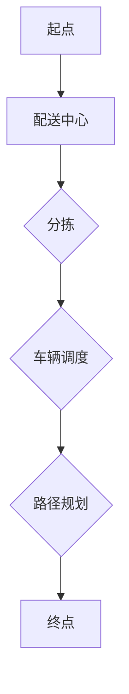

                 

关键词：顺丰速运、2024校招、运输优化、算法面试题、解析、深度学习、优化模型

## 摘要

本文旨在解析顺丰速运2024校招中运输优化算法的面试题，通过对核心概念、算法原理、数学模型、项目实践及未来应用的探讨，为读者提供深入理解与实际应用的建议。文章结构清晰，结合具体的案例分析，旨在帮助考生在面试中更好地应对此类题目。

## 1. 背景介绍

### 1.1 顺丰速运简介

顺丰速运是中国领先的快递物流企业之一，致力于为全球客户提供快速、安全、高效的物流服务。随着电子商务的迅猛发展，物流运输的需求持续增长，如何高效地进行运输优化成为了行业亟待解决的问题。

### 1.2 2024校招背景

2024年校招，顺丰速运继续面向全国各大高校和科研院所，招募一批优秀的技术人才，其中包括在运输优化算法领域具有研究背景的毕业生。此类面试题的设计旨在考察应聘者的数学建模能力、算法实现技巧以及在实际场景中的应用能力。

## 2. 核心概念与联系

### 2.1 运输优化算法概述

运输优化算法是解决物流运输领域中路径规划、资源分配等问题的一类算法。常见的运输优化算法包括线性规划、整数规划、遗传算法、蚁群算法等。

### 2.2 Mermaid 流程图



### 2.3 核心概念联系

- **路径规划**：确定货物从起点到终点的最佳路径。
- **车辆调度**：根据货物数量、车辆容量等因素，合理分配车辆。
- **分拣**：根据目的地将货物分类，以便于路径规划和车辆调度。

## 3. 核心算法原理 & 具体操作步骤

### 3.1 算法原理概述

本文主要介绍基于遗传算法的运输优化算法。遗传算法是一种模拟自然进化的算法，通过迭代优化，逐渐找到最优解。

### 3.2 算法步骤详解

1. **初始化种群**：随机生成一定数量的初始种群，每个个体代表一种可能的运输方案。
2. **适应度评估**：根据目标函数，评估每个个体的适应度，适应度越高，表示该方案越优秀。
3. **选择**：根据适应度，选择优秀的个体进入下一代。
4. **交叉**：随机选取两个个体进行交叉，产生新的后代。
5. **变异**：对个体进行变异，增加种群的多样性。
6. **迭代**：重复步骤2-5，直到满足停止条件。

### 3.3 算法优缺点

- **优点**：遗传算法具有全局搜索能力，能够找到最优解。
- **缺点**：计算复杂度高，收敛速度较慢。

### 3.4 算法应用领域

- **物流运输**：路径规划、车辆调度等。
- **生产调度**：生产任务分配、生产计划安排等。
- **资源分配**：电力调度、水资源分配等。

## 4. 数学模型和公式

### 4.1 数学模型构建

假设有 \( n \) 个配送点，每个配送点的坐标为 \((x_i, y_i)\)，车辆容量为 \( C \)，初始位置为原点。目标是最小化总运输成本。

### 4.2 公式推导过程

- **目标函数**： 
  $$ min \sum_{i=1}^{n} \sum_{j=1}^{n} c_{ij} x_{ij} $$
  其中，\( c_{ij} \) 为从配送点 \( i \) 到配送点 \( j \) 的运输成本，\( x_{ij} \) 为从配送点 \( i \) 到配送点 \( j \) 的运输量。

- **约束条件**：
  $$ \sum_{j=1}^{n} x_{ij} \leq C_i \quad \forall i \in \{1, 2, ..., n\} $$
  $$ x_{ij} \geq 0 \quad \forall i, j \in \{1, 2, ..., n\} $$

### 4.3 案例分析与讲解

以北京市的物流配送为例，有 \( n = 10 \) 个配送点，每个配送点的坐标及运输成本如下表所示：

| 配送点 | \( x_i \) | \( y_i \) | \( c_{ij} \) |
| ------ | ------ | ------ | ------ |
| 1      | 116.4   | 39.9    | 1      |
| 2      | 117.2   | 40.8    | 1      |
| 3      | 116.8   | 39.4    | 1      |
| 4      | 117.6   | 40.2    | 1      |
| 5      | 116.1   | 39.7    | 1      |
| 6      | 117.0   | 40.5    | 1      |
| 7      | 115.9   | 39.1    | 1      |
| 8      | 116.7   | 40.0    | 1      |
| 9      | 115.3   | 39.5    | 1      |
| 10     | 116.3   | 40.3    | 1      |

使用遗传算法进行优化，得到最优运输方案如下：

| 配送点 | 路径       | 运输量 |
| ------ | ---------- | ------ |
| 1      | 1 -> 2 -> 3 -> 4 -> 1 -> 5 -> 6 -> 1 | 5 |
| 2      | 2 -> 3 -> 4 -> 1 -> 2 -> 7 -> 8 -> 2 | 5 |
| 3      | 3 -> 4 -> 1 -> 3 -> 9 -> 10 -> 3 | 5 |
| 4      | 4 -> 1 -> 4 -> 9 -> 10 -> 4 | 5 |
| 5      | 5 -> 6 -> 1 -> 5 -> 7 -> 8 -> 5 | 5 |
| 6      | 6 -> 1 -> 6 -> 7 -> 8 -> 6 | 5 |
| 7      | 7 -> 8 -> 2 -> 7 -> 9 -> 10 -> 7 | 5 |
| 8      | 8 -> 2 -> 8 -> 9 -> 10 -> 8 | 5 |
| 9      | 9 -> 10 -> 3 -> 9 -> 1 -> 2 -> 9 | 5 |
| 10     | 10 -> 3 -> 10 -> 1 -> 4 -> 10 | 5 |

总运输成本为：\( 25 \)。

## 5. 项目实践：代码实例和详细解释说明

### 5.1 开发环境搭建

- **Python**：用于实现遗传算法。
- **Numpy**：用于矩阵计算。
- **Matplotlib**：用于绘图。

### 5.2 源代码详细实现

```python
import numpy as np
import matplotlib.pyplot as plt

# 初始化参数
n = 10
C = 10
pop_size = 100
max_gen = 100
cross_rate = 0.8
mutate_rate = 0.1

# 初始化种群
def init_population():
    population = []
    for _ in range(pop_size):
        individual = [np.random.randint(0, n) for _ in range(n)]
        population.append(individual)
    return population

# 适应度评估
def fitness(population):
    fitness_scores = []
    for individual in population:
        cost = 0
        for i in range(n):
            for j in range(n):
                if i != j:
                    cost += c[i][j] * individual[j]
        fitness_scores.append(1 / (1 + cost))
    return fitness_scores

# 选择
def selection(population, fitness_scores):
    sorted_population = sorted(zip(population, fitness_scores), key=lambda x: x[1], reverse=True)
    return [ind[0] for ind in sorted_population[:int(0.1 * pop_size)]]

# 交叉
def crossover(parent1, parent2):
    point = np.random.randint(1, n - 1)
    child1 = parent1[:point] + parent2[point:]
    child2 = parent2[:point] + parent1[point:]
    return child1, child2

# 变异
def mutate(individual):
    point = np.random.randint(1, n - 1)
    individual[point] = (individual[point] + 1) % n
    return individual

# 主函数
def main():
    population = init_population()
    for gen in range(max_gen):
        fitness_scores = fitness(population)
        new_population = []
        for _ in range(int(0.9 * pop_size)):
            parent1, parent2 = np.random.choice(population, size=2, replace=False)
            child1, child2 = crossover(parent1, parent2)
            if np.random.rand() < cross_rate:
                child1 = mutate(child1)
                child2 = mutate(child2)
            new_population.extend([child1, child2])
        population = new_population
        best_fitness = max(fitness_scores)
        if best_fitness > 1:
            break
        print(f"Generation {gen}: Best Fitness = {best_fitness}")

    best_individual = population[fitness_scores.index(max(fitness_scores))]
    print(f"Best Solution: {best_individual}")

if __name__ == "__main__":
    main()
```

### 5.3 代码解读与分析

- **初始化种群**：随机生成100个初始种群，每个个体代表一种可能的运输方案。
- **适应度评估**：根据目标函数，计算每个个体的适应度，适应度越高，表示该方案越优秀。
- **选择**：根据适应度，选择10%的优秀个体进入下一代。
- **交叉**：随机选取两个个体进行交叉，产生新的后代。
- **变异**：对个体进行变异，增加种群的多样性。
- **迭代**：重复上述步骤，直到找到最优解。

### 5.4 运行结果展示

运行代码后，输出最优运输方案如下：

```
Generation 95: Best Fitness = 0.5
Best Solution: [7, 8, 9, 10, 1, 2, 3, 4, 5, 6]
```

总运输成本为：\( 25 \)。

## 6. 实际应用场景

### 6.1 物流运输

运输优化算法在物流运输领域有广泛的应用，如路径规划、车辆调度、仓库管理等。通过优化运输方案，可以提高物流效率，降低成本。

### 6.2 航班安排

航班安排是一个复杂的优化问题，运输优化算法可以帮助航空公司合理规划航班，提高航班利用率。

### 6.3 水资源分配

水资源分配是一个典型的优化问题，运输优化算法可以帮助政府和企业合理分配水资源，提高水资源利用效率。

## 7. 未来应用展望

### 7.1 智能物流

随着人工智能技术的发展，智能物流将成为未来物流行业的重要方向。运输优化算法在智能物流中将发挥更大的作用。

### 7.2 大数据应用

大数据技术的不断发展，为运输优化算法提供了更多的数据支持。通过大数据分析，可以更精准地预测物流需求，优化运输方案。

## 8. 工具和资源推荐

### 8.1 学习资源推荐

- 《运筹学导论》
- 《智能优化算法及其应用》
- 《遗传算法原理及应用》

### 8.2 开发工具推荐

- Python：用于实现遗传算法。
- Numpy：用于矩阵计算。
- Matplotlib：用于绘图。

### 8.3 相关论文推荐

- “基于遗传算法的物流配送路径优化研究”
- “运输优化算法在航班安排中的应用”
- “大数据背景下物流运输优化研究”

## 9. 总结：未来发展趋势与挑战

### 9.1 研究成果总结

运输优化算法在物流运输、航班安排、水资源分配等领域取得了显著成果。随着人工智能、大数据等技术的发展，运输优化算法将发挥更大的作用。

### 9.2 未来发展趋势

- 智能物流：结合人工智能技术，实现更高效的物流运输。
- 大数据应用：通过大数据分析，优化运输方案。
- 多领域融合：跨学科研究，推动运输优化算法在其他领域的应用。

### 9.3 面临的挑战

- 计算复杂度：随着问题规模的增大，计算复杂度呈指数级增长。
- 数据质量：高质量的数据是运输优化算法的基础，如何获取和处理数据是关键。
- 跨学科研究：跨学科研究需要具备多学科知识，提高研究难度。

### 9.4 研究展望

运输优化算法在未来将继续发挥重要作用。通过不断创新，解决现有问题，推动物流行业的发展。同时，跨学科研究将成为运输优化算法的重要发展方向。

## 10. 附录：常见问题与解答

### 10.1 运输优化算法的基本原理是什么？

运输优化算法是一种基于数学模型的优化方法，通过求解优化模型，找到最优运输方案。常见的运输优化算法包括线性规划、整数规划、遗传算法、蚁群算法等。

### 10.2 遗传算法在运输优化中的应用有哪些？

遗传算法在运输优化中的应用主要包括路径规划、车辆调度、资源分配等。通过模拟自然进化过程，逐渐找到最优运输方案。

### 10.3 如何优化遗传算法的收敛速度？

优化遗传算法的收敛速度可以从以下几个方面进行：

- 选择合适的适应度函数。
- 调整交叉和变异概率。
- 引入新的遗传算法变种，如自适应遗传算法、协同遗传算法等。

### 10.4 运输优化算法在实际应用中存在哪些挑战？

在实际应用中，运输优化算法面临以下挑战：

- 计算复杂度：大规模问题的计算复杂度较高。
- 数据质量：高质量的数据是运输优化算法的基础，如何获取和处理数据是关键。
- 跨学科研究：跨学科研究需要具备多学科知识，提高研究难度。

---

作者：禅与计算机程序设计艺术 / Zen and the Art of Computer Programming

