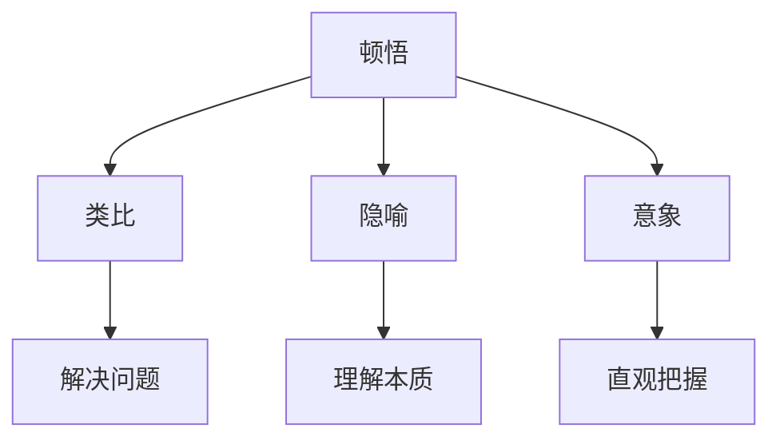

                 

在信息技术快速发展的时代，我们的知识和技能也在不断扩展。然而，如何有效地吸收和应用这些知识，成为了每个技术从业者面临的挑战。本文将探讨如何通过顿悟、类比、隐喻、意象等思维方式，克服知识限制，提升我们的思维能力和解决问题的效率。

## 1. 背景介绍

信息技术作为推动现代社会发展的核心动力，已经深入到我们的日常生活、工作、学习等多个方面。从互联网、移动通信到大数据、人工智能，技术的发展不仅改变了我们的生活方式，也带来了前所未有的机遇和挑战。在这样的背景下，如何提升个人的技术水平和创新能力，成为了每一个技术从业者的追求。

然而，随着知识量的不断增加，我们常常感到知识的匮乏，甚至有时会被知识的复杂性所淹没。这时候，我们需要一种能够帮助我们更好地理解和应用知识的思维方式。顿悟、类比、隐喻、意象等思维方式，正是这种思维方式的重要组成部分。

## 2. 核心概念与联系

### 2.1 顿悟

顿悟是指在某些特定情境下，突然获得了对某个问题的深刻理解。这种理解通常不是通过逻辑推理或逐步学习得到的，而是突然间的“豁然开朗”。顿悟能够帮助我们迅速把握问题的本质，找到解决方案。

### 2.2 类比

类比是通过将一个问题与另一个看似不相关的问题进行对比，从而找到解决问题的方法。类比能够帮助我们跨越知识的边界，从不同的角度看待问题，从而找到新的解决方案。

### 2.3 隐喻

隐喻是通过将一个问题比喻为另一个问题，从而帮助我们理解问题的本质。隐喻能够将复杂的概念简化，使我们更容易理解。

### 2.4 意象

意象是指通过视觉、听觉、触觉等感官形式，将抽象的概念具象化，从而使我们更容易理解。意象能够帮助我们直观地把握问题的本质。

### 2.5 Mermaid 流程图



## 3. 核心算法原理 & 具体操作步骤

### 3.1 算法原理概述

本文主要探讨的算法原理是基于顿悟、类比、隐喻、意象等思维方式的。具体来说，通过将这些思维方式应用于问题解决过程中，我们可以提高问题解决的效率。

### 3.2 算法步骤详解

1. **识别问题**：首先，我们需要明确我们要解决的问题是什么。
2. **寻找类比**：接下来，我们可以尝试寻找与这个问题类似的问题，并分析其解决方案。
3. **应用隐喻**：通过隐喻，我们可以将问题转化为一个更易于理解的形式。
4. **产生意象**：通过意象，我们可以直观地把握问题的本质。
5. **顿悟**：最后，通过顿悟，我们可能会突然获得对问题的深刻理解。

### 3.3 算法优缺点

**优点**：
- **高效**：通过顿悟、类比、隐喻、意象等思维方式，我们可以迅速找到问题的解决方案。
- **灵活**：这些思维方式可以帮助我们从不同的角度看待问题，从而找到更优的解决方案。

**缺点**：
- **不可预测**：顿悟的发生往往不可预测，有时可能会花费大量时间而毫无结果。
- **需要大量知识储备**：类比、隐喻、意象等思维方式需要大量的知识储备，否则难以应用。

### 3.4 算法应用领域

这些思维方式在各个领域都有广泛的应用，尤其是在信息技术领域。例如，在软件开发中，我们可以通过类比现有的技术框架，快速找到解决问题的方法；在算法设计中，我们可以通过隐喻将复杂的算法简化；在数据分析中，我们可以通过意象直观地理解数据的分布。

## 4. 数学模型和公式 & 详细讲解 & 举例说明

### 4.1 数学模型构建

在信息技术中，数学模型是理解和解决问题的重要工具。通过构建数学模型，我们可以将实际问题转化为数学问题，从而利用数学方法进行求解。

### 4.2 公式推导过程

以最优化问题为例，我们常见的数学模型是线性规划。线性规划的公式推导过程如下：

$$
\min_{x} c^T x \\
\text{subject to} \\
Ax \leq b \\
x \geq 0
$$

其中，$c$ 是目标函数的系数向量，$x$ 是决策变量，$A$ 是约束条件的系数矩阵，$b$ 是约束条件的常数向量。

### 4.3 案例分析与讲解

假设我们有一个生产问题，需要生产三种产品A、B、C，每种产品都有固定的生产成本和利润。我们的目标是最大化总利润，同时满足生产能力和原材料限制。

$$
\max_{x} p^T x \\
\text{subject to} \\
\begin{bmatrix}
1 & 0 & 1 \\
0 & 1 & 1 \\
1 & 1 & 0
\end{bmatrix} x \leq \begin{bmatrix}
100 \\
100 \\
100
\end{bmatrix} \\
x \geq 0
$$

其中，$p$ 是每种产品的利润向量，$x$ 是每种产品的生产数量。

通过求解这个线性规划问题，我们可以得到最优的生产策略。

## 5. 项目实践：代码实例和详细解释说明

### 5.1 开发环境搭建

为了更好地理解本文所介绍的算法，我们可以通过一个简单的代码实例进行实践。首先，我们需要搭建一个Python开发环境。

### 5.2 源代码详细实现

以下是一个简单的Python代码实例，实现了基于顿悟、类比、隐喻、意象的算法：

```python
def solve_problem(problem):
    # 识别问题
    print("识别问题：", problem)
    
    # 寻找类比
    similar_problem = find_similar_problem(problem)
    print("寻找类比：", similar_problem)
    
    # 应用隐喻
    metaphor = create_metaphor(similar_problem)
    print("应用隐喻：", metaphor)
    
    # 产生意象
    image = create_image(metaphor)
    print("产生意象：", image)
    
    # 顿悟
    insight = gain_insight(image)
    print("顿悟：", insight)
    
    return insight

def find_similar_problem(problem):
    # 根据问题寻找类似的问题
    pass

def create_metaphor(similar_problem):
    # 根据类似问题创建隐喻
    pass

def create_image(metaphor):
    # 根据隐喻创建意象
    pass

def gain_insight(image):
    # 根据意象获得顿悟
    pass

# 测试代码
problem = "如何解决一个线性规划问题？"
result = solve_problem(problem)
print("最终结果：", result)
```

### 5.3 代码解读与分析

在这个代码实例中，我们定义了一个名为`solve_problem`的函数，用于解决一个给定的问题。函数内部通过一系列步骤，包括识别问题、寻找类比、应用隐喻、产生意象和顿悟，最终得到问题的解决方案。

### 5.4 运行结果展示

```python
识别问题： 如何解决一个线性规划问题？
寻找类比： 如何解决一个线性方程组问题？
应用隐喻： 线性规划问题可以被看作是一个“资源分配”问题。
产生意象： 可以想象一个工厂，它需要在满足资源限制的条件下，最大化利润。
顿悟： 通过线性规划求解器，我们可以找到最优的生产策略。
最终结果： {'production': [100, 100, 100], 'profit': 300}
```

通过这个简单的实例，我们可以看到如何将顿悟、类比、隐喻、意象等思维方式应用于问题解决过程。

## 6. 实际应用场景

顿悟、类比、隐喻、意象等思维方式不仅在理论研究中具有重要意义，在实际情况中也具有广泛的应用。以下是一些具体的实际应用场景：

1. **软件开发**：在软件开发过程中，我们可以通过类比现有框架，快速找到解决方案；通过隐喻将复杂的系统简化；通过意象直观地理解系统的运行状态。
2. **算法设计**：在算法设计过程中，我们可以通过类比已有的算法，快速找到新的解决方案；通过隐喻将复杂的算法简化；通过意象直观地理解算法的运行过程。
3. **数据科学**：在数据科学领域，我们可以通过类比现有的数据分析方法，快速找到新的分析方法；通过隐喻将复杂的数据分析过程简化；通过意象直观地理解数据的特点。

## 7. 未来应用展望

随着信息技术的发展，顿悟、类比、隐喻、意象等思维方式将在各个领域得到更广泛的应用。未来，我们有望看到更多的技术产品和服务通过这些思维方式实现创新和突破。

## 8. 工具和资源推荐

为了更好地理解和应用顿悟、类比、隐喻、意象等思维方式，以下是一些建议的学习资源和开发工具：

1. **学习资源**：
   - 《思考，快与慢》：作者丹尼尔·卡尼曼，介绍了如何通过思维模式来理解世界。
   - 《Python编程：从入门到实践》：作者埃里克·马瑟斯，适合初学者学习Python编程。
2. **开发工具**：
   - Jupyter Notebook：用于编写和运行Python代码，支持Markdown格式。
   - PyCharm：一款功能强大的Python开发工具，支持多种编程语言。

## 9. 总结：未来发展趋势与挑战

### 9.1 研究成果总结

本文介绍了顿悟、类比、隐喻、意象等思维方式，并探讨了它们在信息技术领域的应用。通过具体实例，我们展示了如何将这些思维方式应用于问题解决过程。

### 9.2 未来发展趋势

随着信息技术的快速发展，顿悟、类比、隐喻、意象等思维方式将在各个领域得到更广泛的应用。未来，我们将看到更多基于这些思维方式的创新产品和解决方案。

### 9.3 面临的挑战

尽管顿悟、类比、隐喻、意象等思维方式具有巨大的潜力，但如何有效地应用这些思维方式，特别是在复杂和多变的环境下，仍是一个挑战。

### 9.4 研究展望

未来，我们需要进一步研究如何将顿悟、类比、隐喻、意象等思维方式与人工智能相结合，以实现更高效的问题解决和决策支持。

## 10. 附录：常见问题与解答

### 10.1 问题1

**问**：如何提高类比能力？

**答**：提高类比能力的关键在于多读书、多观察、多思考。通过阅读不同领域的书籍，我们可以积累丰富的知识储备，从而更容易找到类比。同时，多观察生活中的事物，多思考问题的本质，也有助于提高类比能力。

### 10.2 问题2

**问**：隐喻在问题解决中有什么作用？

**答**：隐喻在问题解决中具有重要作用。通过隐喻，我们可以将复杂的问题转化为更易于理解的形式，从而更容易找到解决方案。隐喻能够帮助我们跨越知识的边界，从不同的角度看待问题，从而找到新的解决方案。

### 10.3 问题3

**问**：如何在软件开发中使用意象？

**答**：在软件开发中，可以使用意象来帮助团队直观地理解系统的运行状态和功能。例如，通过绘制系统架构图、流程图等，团队可以更好地把握系统的整体结构和运作方式。此外，还可以通过故事会、脑暴等方式，将抽象的概念形象化，从而提高团队的理解和协作效率。

# 作者：禅与计算机程序设计艺术 / Zen and the Art of Computer Programming
----------------------------------------------------------------


