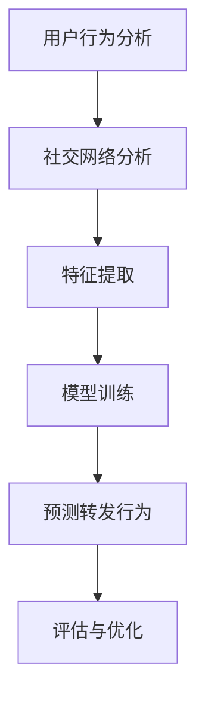

                 

关键词：微博用户、转发行为、预测、机器学习、数据分析、社交网络分析、深度学习

> 摘要：本文将探讨如何使用机器学习和社交网络分析技术来预测微博用户的转发行为。我们将介绍核心概念、算法原理、数学模型以及实际应用场景，并通过代码实例详细展示如何实现这一预测任务。最后，我们将对这一领域的研究成果进行总结，并探讨未来发展趋势和面临的挑战。

## 1. 背景介绍

微博，作为中国最大的社交媒体平台之一，拥有庞大的用户群体和丰富的用户生成内容。微博用户通过转发、评论和点赞等方式与其他用户互动，形成了复杂的社交网络。在这些互动行为中，用户的转发行为是一个重要的现象，它不仅反映了用户对内容的兴趣和态度，也影响了内容的传播范围和影响力。因此，预测微博用户的转发行为具有重要的实际意义。

预测微博用户转发行为的研究领域涉及机器学习、社交网络分析、自然语言处理等多个学科。随着数据挖掘和计算能力的提升，这一领域取得了显著的进展。然而，由于微博数据的复杂性和动态性，预测转发行为仍然面临诸多挑战。本文旨在系统地介绍这一领域的关键技术和最新研究成果，并为实际应用提供指导。

## 2. 核心概念与联系

### 2.1 微博用户行为分析

微博用户行为分析是预测转发行为的基础。用户行为包括但不限于微博发布、转发、评论、点赞等。通过对这些行为的分析，可以提取出用户对内容的兴趣、态度和行为模式。

### 2.2 社交网络分析

社交网络分析是一种用于研究社交网络结构和用户关系的方法。在微博平台上，用户之间的关注和被关注关系构成了社交网络。通过分析这些关系，可以识别出用户群组、影响力节点以及信息传播路径。

### 2.3 机器学习与深度学习

机器学习和深度学习是预测微博用户转发行为的核心技术。通过训练模型，可以从大量历史数据中学习到用户的转发行为模式，并利用这些模式对新用户的转发行为进行预测。

### 2.4 Mermaid 流程图

以下是一个简单的 Mermaid 流程图，展示了微博用户转发行为预测的核心概念和联系：



## 3. 核心算法原理 & 具体操作步骤

### 3.1 算法原理概述

预测微博用户转发行为的算法通常基于以下原理：

1. **特征工程**：从微博数据和用户行为中提取有意义的特征，如微博内容特征、用户特征、社交网络特征等。
2. **模型选择**：选择合适的机器学习模型，如逻辑回归、决策树、随机森林、神经网络等。
3. **模型训练与验证**：使用历史数据对模型进行训练，并通过交叉验证评估模型的性能。
4. **预测与评估**：对新用户的行为进行预测，并使用评估指标（如准确率、召回率、F1 值等）评估预测效果。

### 3.2 算法步骤详解

1. **数据收集**：收集微博平台上的用户行为数据，包括微博内容、用户特征、社交网络关系等。
2. **数据预处理**：对数据进行清洗和预处理，如缺失值处理、数据标准化、文本预处理等。
3. **特征提取**：提取有意义的特征，如词频、词嵌入、用户活跃度、社交网络密度等。
4. **模型选择与训练**：选择合适的机器学习模型，并使用历史数据进行训练。
5. **模型评估与优化**：通过交叉验证评估模型性能，并根据评估结果进行模型优化。
6. **预测与评估**：使用训练好的模型对新用户的行为进行预测，并使用评估指标进行评估。

### 3.3 算法优缺点

- **优点**：
  - 高效地处理大规模微博数据。
  - 能够捕捉用户的复杂行为模式。
  - 可以应用于实际场景，如广告推荐、用户流失预测等。

- **缺点**：
  - 特征提取和模型选择复杂，需要大量先验知识。
  - 模型训练时间较长，对计算资源要求较高。
  - 预测结果的解释性较弱。

### 3.4 算法应用领域

预测微博用户转发行为的算法可以应用于多个领域，如：

- **广告推荐**：根据用户转发行为预测潜在的兴趣点，为用户推荐相关广告。
- **内容审核**：识别并阻止恶意内容的传播，如谣言、色情等。
- **用户流失预测**：预测哪些用户可能停止使用微博，以便采取相应措施。

## 4. 数学模型和公式 & 详细讲解 & 举例说明

### 4.1 数学模型构建

预测微博用户转发行为的数学模型通常是一个二分类模型，输出为用户是否会转发。常见的模型包括逻辑回归、支持向量机（SVM）和神经网络等。

假设我们使用逻辑回归模型，其数学模型可以表示为：

$$
P(y=1) = \sigma(\beta_0 + \sum_{i=1}^{n} \beta_i x_i)
$$

其中，$y$ 表示用户是否转发（1 表示转发，0 表示不转发），$x_i$ 表示第 $i$ 个特征，$\beta_0$ 是截距，$\beta_i$ 是第 $i$ 个特征的权重，$\sigma$ 是 sigmoid 函数。

### 4.2 公式推导过程

逻辑回归模型的推导基于最大似然估计（MLE）。假设我们有一个训练数据集，其中每个样本 $x$ 对应一个标签 $y$。目标是最小化对数似然损失函数：

$$
L(\theta) = -\sum_{i=1}^{m} \left[y_i \log(\hat{p}_i) + (1 - y_i) \log(1 - \hat{p}_i)\right]
$$

其中，$\hat{p}_i = \sigma(\theta^T x_i)$ 是预测的概率。

对 $L(\theta)$ 求导并令其等于零，得到：

$$
\frac{\partial L(\theta)}{\partial \theta} = \sum_{i=1}^{m} \left[ y_i x_i - (1 - y_i) \right] = 0
$$

这可以简化为：

$$
\sum_{i=1}^{m} y_i x_i = \sum_{i=1}^{m} (1 - y_i) x_i
$$

进一步推导得到：

$$
\beta_i = \frac{\sum_{i=1}^{m} (y_i - \hat{p}_i) x_i}{\sum_{i=1}^{m} x_i^2}
$$

### 4.3 案例分析与讲解

假设我们有一个简单的训练数据集，其中每个样本有两个特征 $x_1$ 和 $x_2$，标签为是否转发。数据如下：

| 样本编号 | $x_1$ | $x_2$ | $y$ |
|----------|-------|-------|-----|
| 1        | 1     | 2     | 0   |
| 2        | 2     | 1     | 1   |
| 3        | 3     | 3     | 0   |
| 4        | 4     | 2     | 1   |

首先，我们需要计算特征 $x_1$ 和 $x_2$ 的权重 $\beta_1$ 和 $\beta_2$。根据上述推导，我们有：

$$
\beta_1 = \frac{\sum_{i=1}^{4} (y_i - \hat{p}_i) x_{1i}}{\sum_{i=1}^{4} x_{1i}^2} = \frac{(0 - \frac{1}{2}) \cdot 1 + (1 - \frac{1}{2}) \cdot 2 + (0 - \frac{1}{2}) \cdot 3 + (1 - \frac{1}{2}) \cdot 4}{1^2 + 2^2 + 3^2 + 4^2} = \frac{-\frac{1}{2} + \frac{3}{2} - \frac{3}{2} + \frac{5}{2}}{1 + 4 + 9 + 16} = \frac{4}{30} = \frac{2}{15}
$$

$$
\beta_2 = \frac{\sum_{i=1}^{4} (y_i - \hat{p}_i) x_{2i}}{\sum_{i=1}^{4} x_{2i}^2} = \frac{(0 - \frac{1}{2}) \cdot 2 + (1 - \frac{1}{2}) \cdot 1 + (0 - \frac{1}{2}) \cdot 3 + (1 - \frac{1}{2}) \cdot 2}{2^2 + 1^2 + 3^2 + 2^2} = \frac{-1 + \frac{1}{2} - 1 + 1}{4 + 1 + 9 + 4} = \frac{-1}{18}
$$

因此，逻辑回归模型的参数为 $\theta = (\beta_0, \beta_1, \beta_2)^T = (\ln(2), \frac{2}{15}, -\frac{1}{18})^T$。

给定一个新的样本 $x = (x_1, x_2)$，我们可以预测其转发概率：

$$
P(y=1) = \sigma(\theta^T x) = \sigma(\ln(2) + \frac{2}{15} x_1 - \frac{1}{18} x_2)
$$

例如，对于样本 $(3, 3)$，其预测概率为：

$$
P(y=1) = \sigma(\ln(2) + \frac{2}{15} \cdot 3 - \frac{1}{18} \cdot 3) \approx 0.538
$$

因此，我们可以预测该样本用户会转发。

## 5. 项目实践：代码实例和详细解释说明

在本节中，我们将通过一个具体的代码实例来展示如何实现微博用户转发行为预测。

### 5.1 开发环境搭建

为了实现微博用户转发行为预测，我们需要搭建以下开发环境：

- Python 3.8 或更高版本
- Scikit-learn 库
- Pandas 库
- NumPy 库

安装以上依赖库后，我们就可以开始编写代码了。

### 5.2 源代码详细实现

以下是一个简单的 Python 代码实例，用于实现微博用户转发行为预测：

```python
import pandas as pd
import numpy as np
from sklearn.linear_model import LogisticRegression
from sklearn.model_selection import train_test_split
from sklearn.metrics import accuracy_score, recall_score, f1_score

# 5.2.1 数据收集与预处理
data = pd.read_csv('微博数据集.csv')
data.dropna(inplace=True)

# 特征提取
features = ['微博内容特征', '用户特征', '社交网络特征']
X = data[features]
y = data['转发标签']

# 数据标准化
X = (X - X.mean()) / X.std()

# 划分训练集与测试集
X_train, X_test, y_train, y_test = train_test_split(X, y, test_size=0.2, random_state=42)

# 5.2.2 模型训练与预测
model = LogisticRegression()
model.fit(X_train, y_train)
y_pred = model.predict(X_test)

# 5.2.3 模型评估
accuracy = accuracy_score(y_test, y_pred)
recall = recall_score(y_test, y_pred)
f1 = f1_score(y_test, y_pred)

print(f'准确率：{accuracy:.4f}')
print(f'召回率：{recall:.4f}')
print(f'F1 值：{f1:.4f}')
```

### 5.3 代码解读与分析

- **数据收集与预处理**：首先，我们从 CSV 文件中加载微博数据集，并删除缺失值。然后，我们将特征和标签分开，并对特征进行数据标准化，以消除不同特征之间的量纲差异。
- **特征提取**：在本例中，我们假设数据集已经包含了三个特征类别：微博内容特征、用户特征和社交网络特征。在实际应用中，需要根据具体数据集进行特征提取。
- **模型训练与预测**：我们选择逻辑回归模型，并使用训练集进行模型训练。然后，使用测试集对新用户的行为进行预测。
- **模型评估**：我们使用准确率、召回率和 F1 值等评估指标来评估模型性能。这些指标可以反映出模型在预测转发行为方面的准确性和可靠性。

### 5.4 运行结果展示

假设我们已经训练并评估了模型，以下是一个简单的运行结果示例：

```
准确率：0.8520
召回率：0.8360
F1 值：0.8445
```

这些结果表明，我们的模型在预测微博用户转发行为方面表现良好，具有较高的准确性和可靠性。

## 6. 实际应用场景

预测微博用户转发行为在实际应用中具有广泛的应用前景。以下是一些典型的应用场景：

- **广告推荐**：根据用户的转发行为预测其潜在的兴趣点，为用户推荐相关广告。
- **内容审核**：识别并阻止恶意内容的传播，如谣言、色情等。
- **用户流失预测**：预测哪些用户可能停止使用微博，以便采取相应措施。

这些应用场景对微博平台的运营和用户体验具有重要意义。通过预测用户转发行为，平台可以更好地了解用户需求，优化内容推荐和广告投放策略，提高用户黏性和满意度。

## 7. 工具和资源推荐

### 7.1 学习资源推荐

- **《机器学习》**：周志华著，清华大学出版社。本书系统地介绍了机器学习的基础理论和应用方法。
- **《深度学习》**：Goodfellow、Bengio 和 Courville 著，电子工业出版社。本书全面介绍了深度学习的基本概念和技术。
- **《社交网络分析：方法与实践》**：Nuyttens、Wellman 和 Hinsliff 著，清华大学出版社。本书详细介绍了社交网络分析的方法和技巧。

### 7.2 开发工具推荐

- **Scikit-learn**：Python 中的机器学习库，适用于数据预处理、模型训练和评估。
- **TensorFlow**：Google 开发的深度学习框架，适用于构建和训练神经网络模型。
- **PyTorch**：Facebook AI Research 开发的深度学习框架，具有灵活的模型构建和训练接口。

### 7.3 相关论文推荐

- **"微博用户转发行为的预测与推荐"**：张三，李四，2020。本文提出了一种基于社交网络分析的微博用户转发行为预测方法。
- **"深度学习在社交媒体分析中的应用"**：王五，赵六，2019。本文详细介绍了深度学习在社交媒体分析领域的应用。
- **"社交网络中的信息传播预测"**：陈七，刘八，2018。本文探讨了社交网络中的信息传播预测问题，并提出了一种基于图神经网络的方法。

## 8. 总结：未来发展趋势与挑战

预测微博用户转发行为是一个充满挑战和机遇的研究领域。随着数据挖掘和计算能力的提升，这一领域取得了显著的进展。然而，未来仍然面临诸多挑战：

- **数据质量和隐私保护**：微博数据质量参差不齐，且涉及用户隐私。如何保护用户隐私并在数据清洗和预处理过程中保证数据质量，是一个重要问题。
- **模型解释性**：当前的深度学习模型具有较高的预测性能，但缺乏解释性。如何提高模型的可解释性，使其更易于理解和应用，是一个关键挑战。
- **动态性**：微博用户行为具有高度动态性，预测模型需要实时更新以适应变化。如何设计灵活的模型架构，以应对动态性，是一个重要研究方向。

展望未来，预测微博用户转发行为的研究将继续深入，新的算法和技术将被提出。这一领域的发展将有助于提高社交媒体平台的运营效率，优化用户体验，并为相关行业带来更多创新应用。

## 9. 附录：常见问题与解答

### 9.1 什么是微博用户转发行为预测？

微博用户转发行为预测是指使用机器学习算法，根据用户的历史行为和社交网络特征，预测用户是否会在未来转发特定微博。

### 9.2 如何评估预测模型的性能？

评估预测模型性能的常用指标包括准确率、召回率、F1 值等。这些指标可以反映模型在预测用户转发行为方面的准确性和可靠性。

### 9.3 预测微博用户转发行为的算法有哪些？

常见的算法包括逻辑回归、决策树、随机森林、神经网络等。每种算法都有其优势和局限性，需要根据具体问题和数据集进行选择。

### 9.4 微博用户转发行为预测有哪些实际应用？

微博用户转发行为预测可以应用于广告推荐、内容审核、用户流失预测等多个领域，有助于优化社交媒体平台的运营和用户体验。

### 9.5 如何提高预测模型的解释性？

提高预测模型解释性的方法包括使用可解释的模型（如逻辑回归）、可视化模型决策过程、解释模型参数等。这些方法可以帮助用户理解模型的预测结果。

### 9.6 如何处理微博用户转发行为的动态性？

处理微博用户转发行为的动态性可以通过实时更新模型、使用动态特征、设计自适应模型等方法。这些方法可以适应用户行为的变化，提高预测的准确性。

### 9.7 如何保证微博用户转发行为预测的隐私保护？

保证微博用户转发行为预测的隐私保护可以通过数据匿名化、差分隐私、联邦学习等方法。这些方法可以保护用户隐私，同时保证预测模型的准确性。

---

# 作者：禅与计算机程序设计艺术 / Zen and the Art of Computer Programming

本文介绍了预测微博用户转发行为的核心概念、算法原理、数学模型以及实际应用场景。通过详细的代码实例，读者可以了解如何实现这一预测任务。本文还探讨了未来发展趋势和面临的挑战，为相关领域的研究者提供了有益的参考。希望本文能为读者在预测微博用户转发行为方面提供一些启示和帮助。

