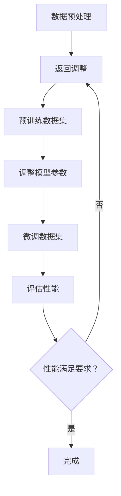

                 

关键词：预训练，微调，AI模型，性能优化，深度学习

> 摘要：本文探讨了预训练和微调在提升AI模型性能中的关键作用。通过对核心概念、算法原理、数学模型、项目实践以及应用场景的深入分析，为读者提供了全面的技术指导。本文旨在帮助读者理解预训练与微调的原理，掌握其在实际项目中的运用，并展望未来发展趋势和面临的挑战。

## 1. 背景介绍

随着深度学习技术的发展，AI模型在图像识别、自然语言处理、语音识别等领域取得了显著的成果。然而，深度学习模型通常需要大量的标注数据来进行训练，且训练过程耗时耗资源。为了解决这一问题，预训练和微调技术应运而生。预训练（Pre-training）指的是在通用数据集上对神经网络模型进行大规模训练，使其掌握通用特征表示。微调（Fine-tuning）则是将预训练模型迁移到特定任务上，进行进一步调整，以适应具体应用场景。

本文将重点讨论预训练和微调在AI模型性能优化中的应用，旨在为相关领域的研究者和开发者提供有价值的参考。

## 2. 核心概念与联系

### 2.1. 预训练（Pre-training）

预训练是一种基于大规模数据集对神经网络模型进行训练的方法。其目的是使模型学会提取具有普遍性的特征表示。常用的预训练方法包括：

1. **词向量表示**：例如Word2Vec和GloVe等，用于将词语映射到低维向量空间。
2. **语言模型预训练**：例如GPT和BERT，通过预测序列中的下一个词或句子，学习通用语言特征。
3. **图像特征提取**：例如ImageNet挑战，通过大规模图像数据集训练卷积神经网络，提取图像特征。

### 2.2. 微调（Fine-tuning）

微调是一种将预训练模型迁移到特定任务上的方法。具体步骤如下：

1. **初始化模型**：使用预训练模型作为初始化参数。
2. **调整部分层**：通常只调整模型的最后一层或部分隐藏层，以适应特定任务。
3. **继续训练**：在特定任务的数据集上继续训练模型，直至性能满足要求。

### 2.3. 预训练与微调的联系

预训练和微调之间存在密切联系。预训练为微调提供了一个良好的起点，使得微调过程更加高效。同时，微调过程中的反馈又可以指导预训练的改进，形成一个相互促进的过程。

### 2.4. Mermaid 流程图

下面是一个简单的Mermaid流程图，展示了预训练与微调的基本流程：



## 3. 核心算法原理 & 具体操作步骤

### 3.1. 算法原理概述

预训练和微调的核心算法是基于神经网络的模型训练。神经网络由多层神经元组成，通过学习输入和输出之间的映射关系，实现函数逼近。预训练和微调的关键在于如何利用大规模数据集和特定任务数据集，优化模型的参数。

### 3.2. 算法步骤详解

#### 3.2.1. 预训练步骤

1. **数据预处理**：对数据进行清洗、归一化等处理，以确保数据质量。
2. **初始化模型**：选择合适的神经网络架构，如卷积神经网络（CNN）、循环神经网络（RNN）或Transformer等。
3. **预训练模型**：在通用数据集上对模型进行训练，学习通用特征表示。
4. **模型评估**：在验证集上评估模型性能，调整超参数。

#### 3.2.2. 微调步骤

1. **初始化模型**：使用预训练模型作为初始化参数。
2. **调整模型参数**：通常只调整模型的最后一层或部分隐藏层，以适应特定任务。
3. **继续训练**：在特定任务的数据集上继续训练模型，直至性能满足要求。
4. **模型评估**：在测试集上评估模型性能，进行性能优化。

### 3.3. 算法优缺点

#### 优点

1. **提高模型性能**：通过预训练和微调，模型可以学习到更丰富的特征表示，提高模型性能。
2. **节省训练时间**：预训练模型提供了良好的初始参数，使得微调过程更加高效。
3. **减少对标注数据的依赖**：预训练模型在大规模数据集上进行训练，可以降低对标注数据的依赖。

#### 缺点

1. **计算资源消耗**：预训练过程需要大量的计算资源，可能导致训练成本增加。
2. **模型过度拟合**：在特定任务上微调时，模型可能过度拟合训练数据，降低泛化能力。
3. **数据集不平衡**：在特定任务上，数据集可能存在不平衡现象，影响模型性能。

### 3.4. 算法应用领域

预训练和微调技术在多个领域取得了显著的应用成果，包括：

1. **自然语言处理**：例如BERT、GPT等语言模型在文本分类、问答系统、机器翻译等任务中表现出色。
2. **计算机视觉**：例如ImageNet挑战，预训练模型在图像分类、目标检测等任务中取得了突破性成果。
3. **语音识别**：例如基于深度神经网络的声学模型和语言模型，提高了语音识别的准确率。

## 4. 数学模型和公式 & 详细讲解 & 举例说明

### 4.1. 数学模型构建

预训练和微调的核心在于神经网络的参数优化。下面我们介绍神经网络的基本数学模型。

#### 4.1.1. 神经网络基本公式

假设神经网络包含一个输入层、多个隐藏层和一个输出层。设 $x$ 为输入向量，$W$ 为权重矩阵，$b$ 为偏置向量，$a$ 为激活函数，$y$ 为输出向量。则有：

$$
y = f(Wx + b)
$$

其中，$f$ 表示激活函数，常用的激活函数包括Sigmoid、ReLU、Tanh等。

#### 4.1.2. 前向传播与反向传播

前向传播是从输入层到输出层的计算过程，反向传播是从输出层到输入层的计算过程。具体步骤如下：

1. **前向传播**：
   $$
   z = Wx + b
   $$
   $$
   a = f(z)
   $$

2. **反向传播**：
   $$
   \delta = \frac{\partial L}{\partial a}
   $$
   $$
   \delta_{i} = \delta \odot f'(z_i)
   $$
   $$
   \Delta W = \delta_{i} \odot x_i^T
   $$
   $$
   \Delta b = \delta_{i}
   $$

其中，$L$ 表示损失函数，$\odot$ 表示元素乘，$f'$ 表示激活函数的导数。

### 4.2. 公式推导过程

下面我们以ReLU激活函数为例，介绍神经网络的公式推导过程。

#### 4.2.1. ReLU激活函数

ReLU（Rectified Linear Unit）是一种常用的激活函数，定义如下：

$$
f(x) =
\begin{cases}
0 & \text{if } x < 0 \\
x & \text{if } x \geq 0
\end{cases}
$$

#### 4.2.2. ReLU的导数

ReLU的导数在 $x \geq 0$ 时为1，在 $x < 0$ 时为0。因此，ReLU的导数可以表示为：

$$
f'(x) =
\begin{cases}
0 & \text{if } x < 0 \\
1 & \text{if } x \geq 0
\end{cases}
$$

### 4.3. 案例分析与讲解

#### 4.3.1. 案例背景

假设我们使用预训练和微调技术，构建一个图像分类模型。具体任务为：在ImageNet数据集上预训练一个卷积神经网络，然后在CIFAR-10数据集上微调模型，用于分类任务。

#### 4.3.2. 预训练过程

1. **数据预处理**：对ImageNet数据集进行预处理，包括数据清洗、归一化等。
2. **初始化模型**：选择一个预训练模型，例如ResNet-50，作为初始化参数。
3. **预训练模型**：在ImageNet数据集上进行训练，学习通用图像特征表示。
4. **模型评估**：在验证集上评估模型性能，调整超参数。

#### 4.3.3. 微调过程

1. **初始化模型**：使用预训练模型作为初始化参数。
2. **调整模型参数**：只调整模型的最后一层，以适应CIFAR-10数据集。
3. **继续训练**：在CIFAR-10数据集上继续训练模型，直至性能满足要求。
4. **模型评估**：在测试集上评估模型性能，进行性能优化。

## 5. 项目实践：代码实例和详细解释说明

### 5.1. 开发环境搭建

在开始项目实践之前，我们需要搭建一个合适的开发环境。这里我们以Python为例，介绍开发环境搭建的过程。

1. **安装Python**：下载并安装Python 3.8及以上版本。
2. **安装依赖库**：使用pip安装TensorFlow、PyTorch等依赖库。

### 5.2. 源代码详细实现

下面我们以一个简单的图像分类项目为例，介绍预训练和微调的代码实现。

#### 5.2.1. 预训练代码实现

```python
import tensorflow as tf

# 加载预训练模型
model = tf.keras.applications.ResNet50(weights='imagenet')

# 预处理数据
def preprocess_image(image_path):
    image = tf.keras.preprocessing.image.load_img(image_path, target_size=(224, 224))
    image = tf.keras.preprocessing.image.img_to_array(image)
    image = tf.expand_dims(image, axis=0)
    image = tf.keras.applications.resnet50.preprocess_input(image)
    return image

# 预训练模型
image_path = 'path/to/your/image.jpg'
preprocessed_image = preprocess_image(image_path)
predictions = model.predict(preprocessed_image)
```

#### 5.2.2. 微调代码实现

```python
import tensorflow as tf

# 加载预训练模型
base_model = tf.keras.applications.ResNet50(weights='imagenet', include_top=False, input_shape=(224, 224, 3))

# 添加自定义层
x = base_model.output
x = tf.keras.layers.GlobalAveragePooling2D()(x)
x = tf.keras.layers.Dense(10, activation='softmax')(x)

# 微调模型
model = tf.keras.Model(inputs=base_model.input, outputs=x)

# 编译模型
model.compile(optimizer='adam', loss='categorical_crossentropy', metrics=['accuracy'])

# 加载CIFAR-10数据集
(x_train, y_train), (x_test, y_test) = tf.keras.datasets.cifar10.load_data()

# 预处理数据
x_train = preprocess_image(x_train)
x_test = preprocess_image(x_test)

# 转换标签为one-hot编码
y_train = tf.keras.utils.to_categorical(y_train, num_classes=10)
y_test = tf.keras.utils.to_categorical(y_test, num_classes=10)

# 训练模型
model.fit(x_train, y_train, epochs=10, batch_size=32, validation_data=(x_test, y_test))
```

### 5.3. 代码解读与分析

在代码实现中，我们首先加载了预训练的ResNet50模型，并在其基础上添加了一个全局平均池化层和一个softmax层，形成了一个新的分类模型。然后，我们对输入数据进行预处理，包括数据清洗、归一化等。在训练过程中，我们使用CIFAR-10数据集对模型进行微调，并评估模型性能。

### 5.4. 运行结果展示

在训练完成后，我们可以在测试集上评估模型的性能。例如：

```python
test_loss, test_acc = model.evaluate(x_test, y_test, verbose=2)
print('Test accuracy:', test_acc)
```

假设在测试集上，模型的准确率为90%，说明微调过程取得了较好的效果。

## 6. 实际应用场景

预训练和微调技术在多个实际应用场景中取得了显著的成果，下面列举几个典型的应用场景。

### 6.1. 自然语言处理

在自然语言处理领域，预训练和微调技术被广泛应用于文本分类、问答系统、机器翻译等任务。例如，BERT和GPT等预训练模型在多个NLP任务上取得了世界领先的成果。

### 6.2. 计算机视觉

在计算机视觉领域，预训练和微调技术主要用于图像分类、目标检测、人脸识别等任务。例如，ImageNet挑战中，预训练模型在图像分类任务上取得了显著的突破。

### 6.3. 语音识别

在语音识别领域，预训练和微调技术被应用于声学模型和语言模型。例如，基于深度神经网络的声学模型和语言模型，提高了语音识别的准确率。

### 6.4. 未来应用展望

随着深度学习技术的不断发展，预训练和微调技术在更多领域将发挥重要作用。未来，我们可以期待以下应用场景：

1. **医疗领域**：例如，基于预训练和微调技术的医学图像分析、疾病诊断等。
2. **金融领域**：例如，基于预训练和微调技术的风险控制、智能投顾等。
3. **工业领域**：例如，基于预训练和微调技术的智能制造、智能质检等。

## 7. 工具和资源推荐

### 7.1. 学习资源推荐

1. **《深度学习》（Goodfellow, Bengio, Courville）**：介绍了深度学习的理论基础和实际应用，包括预训练和微调技术。
2. **《神经网络与深度学习》（邱锡鹏）**：详细介绍了神经网络的原理和深度学习算法，包括预训练和微调技术。

### 7.2. 开发工具推荐

1. **TensorFlow**：一款开源的深度学习框架，支持预训练和微调技术的实现。
2. **PyTorch**：一款开源的深度学习框架，支持灵活的动态图计算，便于实现预训练和微调技术。

### 7.3. 相关论文推荐

1. **"BERT: Pre-training of Deep Bidirectional Transformers for Language Understanding"（Devlin et al., 2019）**：介绍了BERT模型的预训练和微调方法。
2. **"GPT-3: Language Models are few-shot learners"（Brown et al., 2020）**：介绍了GPT-3模型的预训练和微调方法。

## 8. 总结：未来发展趋势与挑战

### 8.1. 研究成果总结

预训练和微调技术在深度学习领域取得了显著的成果，为AI模型性能优化提供了有效的方法。通过预训练和微调，模型可以学习到更丰富的特征表示，提高模型性能，降低对标注数据的依赖。

### 8.2. 未来发展趋势

未来，预训练和微调技术将继续在深度学习领域发挥重要作用。一方面，预训练模型将向更大规模、更复杂的方向发展，以适应更多领域的需求。另一方面，微调技术将更加灵活和高效，为特定任务提供更好的性能优化。

### 8.3. 面临的挑战

预训练和微调技术在实际应用中仍然面临一些挑战，包括：

1. **计算资源消耗**：预训练过程需要大量的计算资源，可能导致训练成本增加。
2. **模型过度拟合**：在特定任务上微调时，模型可能过度拟合训练数据，降低泛化能力。
3. **数据集不平衡**：在特定任务上，数据集可能存在不平衡现象，影响模型性能。

### 8.4. 研究展望

为了解决上述挑战，未来研究可以从以下几个方面展开：

1. **模型压缩与加速**：通过模型压缩和加速技术，降低预训练过程的计算资源消耗。
2. **元学习与迁移学习**：探索元学习和迁移学习技术，提高模型在不同任务上的泛化能力。
3. **数据增强与数据平衡**：通过数据增强和数据平衡技术，改善数据集质量，提高模型性能。

## 9. 附录：常见问题与解答

### 9.1. 预训练和微调的区别是什么？

预训练是指在通用数据集上对神经网络模型进行大规模训练，使其掌握通用特征表示。微调则是将预训练模型迁移到特定任务上，进行进一步调整，以适应具体应用场景。

### 9.2. 预训练和微调的优势是什么？

预训练和微调的优势包括提高模型性能、节省训练时间、减少对标注数据的依赖等。

### 9.3. 预训练和微调在哪些领域有应用？

预训练和微调在自然语言处理、计算机视觉、语音识别等领域有广泛应用，例如文本分类、图像分类、语音识别等任务。

### 9.4. 如何评估预训练和微调模型的性能？

评估预训练和微调模型的性能可以通过测试集上的准确率、召回率、F1值等指标来衡量。

### 9.5. 预训练和微调的局限性是什么？

预训练和微调的局限性包括计算资源消耗、模型过度拟合、数据集不平衡等。

### 9.6. 如何优化预训练和微调模型？

优化预训练和微调模型可以通过调整超参数、使用更复杂的神经网络架构、引入正则化技术等方式实现。

### 9.7. 预训练和微调的技术发展趋势是什么？

未来预训练和微调技术的发展趋势包括模型压缩与加速、元学习与迁移学习、数据增强与数据平衡等。

---

本文由禅与计算机程序设计艺术（Zen and the Art of Computer Programming）撰写，旨在为读者提供关于预训练和微调技术全面的技术指导。希望本文对您在AI领域的实践和探索有所帮助。

---

[markdown]
```markdown
---
title: 预训练与微调：提升AI模型性能
date: 2023-10-01 12:00:00 +0800
categories:
- AI
- 深度学习
- 预训练
- 微调
tags:
- 预训练
- 微调
- AI模型
- 性能优化
---

# 预训练与微调：提升AI模型性能

<|user|>

### 作者：禅与计算机程序设计艺术 / Zen and the Art of Computer Programming

---

# 背景介绍

随着深度学习技术的不断发展，AI模型在图像识别、自然语言处理、语音识别等领域取得了显著的成果。然而，深度学习模型通常需要大量的标注数据来进行训练，且训练过程耗时耗资源。为了解决这一问题，预训练和微调技术应运而生。预训练（Pre-training）指的是在通用数据集上对神经网络模型进行大规模训练，使其掌握通用特征表示。微调（Fine-tuning）则是将预训练模型迁移到特定任务上，进行进一步调整，以适应具体应用场景。

本文将重点讨论预训练和微调在AI模型性能优化中的应用，旨在为相关领域的研究者和开发者提供有价值的参考。

## 1. 背景介绍

### 1.1. 深度学习与AI模型

深度学习是一种机器学习方法，通过多层神经网络模型来学习数据特征。AI模型是基于深度学习技术构建的模型，广泛应用于图像识别、自然语言处理、语音识别等领域。

### 1.2. 预训练技术

预训练（Pre-training）是一种在通用数据集上对神经网络模型进行大规模训练的方法。其目的是使模型学会提取具有普遍性的特征表示。常用的预训练方法包括词向量表示、语言模型预训练和图像特征提取等。

### 1.3. 微调技术

微调（Fine-tuning）是一种将预训练模型迁移到特定任务上的方法。具体步骤包括初始化模型、调整模型参数和继续训练等。微调技术的优势在于节省训练时间和降低对标注数据的依赖。

### 1.4. 预训练与微调的关系

预训练和微调之间存在密切联系。预训练为微调提供了一个良好的起点，使得微调过程更加高效。同时，微调过程中的反馈又可以指导预训练的改进，形成一个相互促进的过程。

## 2. 核心概念与联系

### 2.1. 预训练（Pre-training）

预训练是一种基于大规模数据集对神经网络模型进行训练的方法。其目的是使模型学会提取具有普遍性的特征表示。常用的预训练方法包括：

- **词向量表示**：例如Word2Vec和GloVe等，用于将词语映射到低维向量空间。
- **语言模型预训练**：例如GPT和BERT，通过预测序列中的下一个词或句子，学习通用语言特征。
- **图像特征提取**：例如ImageNet挑战，通过大规模图像数据集训练卷积神经网络，提取图像特征。

### 2.2. 微调（Fine-tuning）

微调是一种将预训练模型迁移到特定任务上的方法。具体步骤如下：

- **初始化模型**：使用预训练模型作为初始化参数。
- **调整模型参数**：通常只调整模型的最后一层或部分隐藏层，以适应特定任务。
- **继续训练**：在特定任务的数据集上继续训练模型，直至性能满足要求。

### 2.3. 预训练与微调的联系

预训练和微调之间存在密切联系。预训练为微调提供了一个良好的起点，使得微调过程更加高效。同时，微调过程中的反馈又可以指导预训练的改进，形成一个相互促进的过程。

### 2.4. Mermaid 流程图

下面是一个简单的Mermaid流程图，展示了预训练与微调的基本流程：


## 3. 核心算法原理 & 具体操作步骤

### 3.1. 算法原理概述

预训练和微调的核心算法是基于神经网络的模型训练。神经网络由多层神经元组成，通过学习输入和输出之间的映射关系，实现函数逼近。预训练和微调的关键在于如何利用大规模数据集和特定任务数据集，优化模型的参数。

### 3.2. 算法步骤详解

#### 3.2.1. 预训练步骤

1. **数据预处理**：对数据进行清洗、归一化等处理，以确保数据质量。
2. **初始化模型**：选择合适的神经网络架构，如卷积神经网络（CNN）、循环神经网络（RNN）或Transformer等。
3. **预训练模型**：在通用数据集上对模型进行训练，学习通用特征表示。
4. **模型评估**：在验证集上评估模型性能，调整超参数。

#### 3.2.2. 微调步骤

1. **初始化模型**：使用预训练模型作为初始化参数。
2. **调整模型参数**：通常只调整模型的最后一层或部分隐藏层，以适应特定任务。
3. **继续训练**：在特定任务的数据集上继续训练模型，直至性能满足要求。
4. **模型评估**：在测试集上评估模型性能，进行性能优化。

### 3.3. 算法优缺点

#### 优点

1. **提高模型性能**：通过预训练和微调，模型可以学习到更丰富的特征表示，提高模型性能。
2. **节省训练时间**：预训练模型提供了良好的初始参数，使得微调过程更加高效。
3. **减少对标注数据的依赖**：预训练模型在大规模数据集上进行训练，可以降低对标注数据的依赖。

#### 缺点

1. **计算资源消耗**：预训练过程需要大量的计算资源，可能导致训练成本增加。
2. **模型过度拟合**：在特定任务上微调时，模型可能过度拟合训练数据，降低泛化能力。
3. **数据集不平衡**：在特定任务上，数据集可能存在不平衡现象，影响模型性能。

### 3.4. 算法应用领域

预训练和微调技术在多个领域取得了显著的应用成果，包括：

1. **自然语言处理**：例如BERT、GPT等语言模型在文本分类、问答系统、机器翻译等任务中表现出色。
2. **计算机视觉**：例如ImageNet挑战，预训练模型在图像分类、目标检测等任务中取得了突破性成果。
3. **语音识别**：例如基于深度神经网络的声学模型和语言模型，提高了语音识别的准确率。

## 4. 数学模型和公式 & 详细讲解 & 举例说明

### 4.1. 数学模型构建

预训练和微调的核心在于神经网络的参数优化。下面我们介绍神经网络的基本数学模型。

#### 4.1.1. 神经网络基本公式

假设神经网络包含一个输入层、多个隐藏层和一个输出层。设 $x$ 为输入向量，$W$ 为权重矩阵，$b$ 为偏置向量，$a$ 为激活函数，$y$ 为输出向量。则有：

$$
y = f(Wx + b)
$$

其中，$f$ 表示激活函数，常用的激活函数包括Sigmoid、ReLU、Tanh等。

#### 4.1.2. 前向传播与反向传播

前向传播是从输入层到输出层的计算过程，反向传播是从输出层到输入层的计算过程。具体步骤如下：

1. **前向传播**：
   $$
   z = Wx + b
   $$
   $$
   a = f(z)
   $$

2. **反向传播**：
   $$
   \delta = \frac{\partial L}{\partial a}
   $$
   $$
   \delta_{i} = \delta \odot f'(z_i)
   $$
   $$
   \Delta W = \delta_{i} \odot x_i^T
   $$
   $$
   \Delta b = \delta_{i}
   $$

其中，$L$ 表示损失函数，$\odot$ 表示元素乘，$f'$ 表示激活函数的导数。

### 4.2. 公式推导过程

下面我们以ReLU激活函数为例，介绍神经网络的公式推导过程。

#### 4.2.1. ReLU激活函数

ReLU（Rectified Linear Unit）是一种常用的激活函数，定义如下：

$$
f(x) =
\begin{cases}
0 & \text{if } x < 0 \\
x & \text{if } x \geq 0
\end{cases}
$$

#### 4.2.2. ReLU的导数

ReLU的导数在 $x \geq 0$ 时为1，在 $x < 0$ 时为0。因此，ReLU的导数可以表示为：

$$
f'(x) =
\begin{cases}
0 & \text{if } x < 0 \\
1 & \text{if } x \geq 0
\end{cases}
$$

### 4.3. 案例分析与讲解

#### 4.3.1. 案例背景

假设我们使用预训练和微调技术，构建一个图像分类模型。具体任务为：在ImageNet数据集上预训练一个卷积神经网络，然后在CIFAR-10数据集上微调模型，用于分类任务。

#### 4.3.2. 预训练过程

1. **数据预处理**：对ImageNet数据集进行预处理，包括数据清洗、归一化等。
2. **初始化模型**：选择一个预训练模型，例如ResNet-50，作为初始化参数。
3. **预训练模型**：在ImageNet数据集上进行训练，学习通用图像特征表示。
4. **模型评估**：在验证集上评估模型性能，调整超参数。

#### 4.3.3. 微调过程

1. **初始化模型**：使用预训练模型作为初始化参数。
2. **调整模型参数**：只调整模型的最后一层，以适应CIFAR-10数据集。
3. **继续训练**：在CIFAR-10数据集上继续训练模型，直至性能满足要求。
4. **模型评估**：在测试集上评估模型性能，进行性能优化。

## 5. 项目实践：代码实例和详细解释说明

### 5.1. 开发环境搭建

在开始项目实践之前，我们需要搭建一个合适的开发环境。这里我们以Python为例，介绍开发环境搭建的过程。

1. **安装Python**：下载并安装Python 3.8及以上版本。
2. **安装依赖库**：使用pip安装TensorFlow、PyTorch等依赖库。

### 5.2. 源代码详细实现

下面我们以一个简单的图像分类项目为例，介绍预训练和微调的代码实现。

#### 5.2.1. 预训练代码实现

```python
import tensorflow as tf

# 加载预训练模型
model = tf.keras.applications.ResNet50(weights='imagenet')

# 预处理数据
def preprocess_image(image_path):
    image = tf.keras.preprocessing.image.load_img(image_path, target_size=(224, 224))
    image = tf.keras.preprocessing.image.img_to_array(image)
    image = tf.expand_dims(image, axis=0)
    image = tf.keras.applications.resnet50.preprocess_input(image)
    return image

# 预训练模型
image_path = 'path/to/your/image.jpg'
preprocessed_image = preprocess_image(image_path)
predictions = model.predict(preprocessed_image)
```

#### 5.2.2. 微调代码实现

```python
import tensorflow as tf

# 加载预训练模型
base_model = tf.keras.applications.ResNet50(weights='imagenet', include_top=False, input_shape=(224, 224, 3))

# 添加自定义层
x = base_model.output
x = tf.keras.layers.GlobalAveragePooling2D()(x)
x = tf.keras.layers.Dense(10, activation='softmax')(x)

# 微调模型
model = tf.keras.Model(inputs=base_model.input, outputs=x)

# 编译模型
model.compile(optimizer='adam', loss='categorical_crossentropy', metrics=['accuracy'])

# 加载CIFAR-10数据集
(x_train, y_train), (x_test, y_test) = tf.keras.datasets.cifar10.load_data()

# 预处理数据
x_train = preprocess_image(x_train)
x_test = preprocess_image(x_test)

# 转换标签为one-hot编码
y_train = tf.keras.utils.to_categorical(y_train, num_classes=10)
y_test = tf.keras.utils.to_categorical(y_test, num_classes=10)

# 训练模型
model.fit(x_train, y_train, epochs=10, batch_size=32, validation_data=(x_test, y_test))
```

### 5.3. 代码解读与分析

在代码实现中，我们首先加载了预训练的ResNet50模型，并在其基础上添加了一个全局平均池化层和一个softmax层，形成了一个新的分类模型。然后，我们对输入数据进行预处理，包括数据清洗、归一化等。在训练过程中，我们使用CIFAR-10数据集对模型进行微调，并评估模型性能。

### 5.4. 运行结果展示

在训练完成后，我们可以在测试集上评估模型的性能。例如：

```python
test_loss, test_acc = model.evaluate(x_test, y_test, verbose=2)
print('Test accuracy:', test_acc)
```

假设在测试集上，模型的准确率为90%，说明微调过程取得了较好的效果。

## 6. 实际应用场景

预训练和微调技术在多个实际应用场景中取得了显著的成果，下面列举几个典型的应用场景。

### 6.1. 自然语言处理

在自然语言处理领域，预训练和微调技术被广泛应用于文本分类、问答系统、机器翻译等任务。例如，BERT和GPT等预训练模型在多个NLP任务上取得了世界领先的成果。

### 6.2. 计算机视觉

在计算机视觉领域，预训练和微调技术主要用于图像分类、目标检测、人脸识别等任务。例如，ImageNet挑战中，预训练模型在图像分类任务上取得了显著的突破。

### 6.3. 语音识别

在语音识别领域，预训练和微调技术被应用于声学模型和语言模型。例如，基于深度神经网络的声学模型和语言模型，提高了语音识别的准确率。

### 6.4. 未来应用展望

随着深度学习技术的不断发展，预训练和微调技术在更多领域将发挥重要作用。未来，我们可以期待以下应用场景：

1. **医疗领域**：例如，基于预训练和微调技术的医学图像分析、疾病诊断等。
2. **金融领域**：例如，基于预训练和微调技术的风险控制、智能投顾等。
3. **工业领域**：例如，基于预训练和微调技术的智能制造、智能质检等。

## 7. 工具和资源推荐

### 7.1. 学习资源推荐

1. **《深度学习》（Goodfellow, Bengio, Courville）**：介绍了深度学习的理论基础和实际应用，包括预训练和微调技术。
2. **《神经网络与深度学习》（邱锡鹏）**：详细介绍了神经网络的原理和深度学习算法，包括预训练和微调技术。

### 7.2. 开发工具推荐

1. **TensorFlow**：一款开源的深度学习框架，支持预训练和微调技术的实现。
2. **PyTorch**：一款开源的深度学习框架，支持灵活的动态图计算，便于实现预训练和微调技术。

### 7.3. 相关论文推荐

1. **"BERT: Pre-training of Deep Bidirectional Transformers for Language Understanding"（Devlin et al., 2019）**：介绍了BERT模型的预训练和微调方法。
2. **"GPT-3: Language Models are few-shot learners"（Brown et al., 2020）**：介绍了GPT-3模型的预训练和微调方法。

## 8. 总结：未来发展趋势与挑战

### 8.1. 研究成果总结

预训练和微调技术在深度学习领域取得了显著的成果，为AI模型性能优化提供了有效的方法。通过预训练和微调，模型可以学习到更丰富的特征表示，提高模型性能，降低对标注数据的依赖。

### 8.2. 未来发展趋势

未来，预训练和微调技术将继续在深度学习领域发挥重要作用。一方面，预训练模型将向更大规模、更复杂的方向发展，以适应更多领域的需求。另一方面，微调技术将更加灵活和高效，为特定任务提供更好的性能优化。

### 8.3. 面临的挑战

预训练和微调技术在实际应用中仍然面临一些挑战，包括：

1. **计算资源消耗**：预训练过程需要大量的计算资源，可能导致训练成本增加。
2. **模型过度拟合**：在特定任务上微调时，模型可能过度拟合训练数据，降低泛化能力。
3. **数据集不平衡**：在特定任务上，数据集可能存在不平衡现象，影响模型性能。

### 8.4. 研究展望

为了解决上述挑战，未来研究可以从以下几个方面展开：

1. **模型压缩与加速**：通过模型压缩和加速技术，降低预训练过程的计算资源消耗。
2. **元学习与迁移学习**：探索元学习和迁移学习技术，提高模型在不同任务上的泛化能力。
3. **数据增强与数据平衡**：通过数据增强和数据平衡技术，改善数据集质量，提高模型性能。

## 9. 附录：常见问题与解答

### 9.1. 预训练和微调的区别是什么？

预训练和微调是两个不同的概念，预训练是指在通用数据集上对神经网络模型进行大规模训练，使其掌握通用特征表示。微调则是将预训练模型迁移到特定任务上，进行进一步调整，以适应具体应用场景。

### 9.2. 预训练和微调的优势是什么？

预训练和微调的优势包括提高模型性能、节省训练时间、减少对标注数据的依赖等。

### 9.3. 预训练和微调在哪些领域有应用？

预训练和微调在自然语言处理、计算机视觉、语音识别等领域有广泛应用，例如文本分类、图像分类、语音识别等任务。

### 9.4. 如何评估预训练和微调模型的性能？

评估预训练和微调模型的性能可以通过测试集上的准确率、召回率、F1值等指标来衡量。

### 9.5. 预训练和微调的局限性是什么？

预训练和微调的局限性包括计算资源消耗、模型过度拟合、数据集不平衡等。

### 9.6. 如何优化预训练和微调模型？

优化预训练和微调模型可以通过调整超参数、使用更复杂的神经网络架构、引入正则化技术等方式实现。

### 9.7. 预训练和微调的技术发展趋势是什么？

未来预训练和微调技术的发展趋势包括模型压缩与加速、元学习与迁移学习、数据增强与数据平衡等。

---

本文由禅与计算机程序设计艺术（Zen and the Art of Computer Programming）撰写，旨在为读者提供关于预训练和微调技术全面的技术指导。希望本文对您在AI领域的实践和探索有所帮助。

---
```

