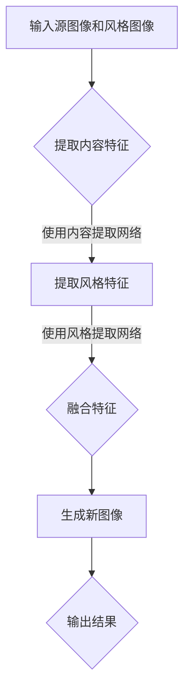

                 

### 关键词 Keywords ###
- 风格迁移
- 图像风格转换
- 卷积神经网络
- Content-Semantic Distillation
- 生成对抗网络
- 代码实例
- 技术博客

### 摘要 Abstract ###
本文将深入探讨风格迁移（Style Transfer）的基本原理和具体实现。风格迁移是一种将一种图像的“风格”应用到另一种图像上的技术，常用于艺术创作和图像编辑领域。文章将介绍卷积神经网络在风格迁移中的应用，以及基于Content-Semantic Distillation和生成对抗网络的实现方法。通过实际代码实例，我们将详细解释各个步骤和关键概念，帮助读者理解和实践风格迁移技术。

---

## 1. 背景介绍

### 1.1 风格迁移的定义和作用

风格迁移（Style Transfer）是一种将一种图像的特定风格（如艺术画作、摄影风格等）应用到另一幅图像上的技术。这一概念最早由Gatys等人在2015年提出，并因其强大而简洁的实现方法在图像处理领域引起了广泛关注。风格迁移不仅能够用于艺术创作，如将普通照片转换成艺术画作，还可以用于图像编辑，如修复老照片、创建动画特效等。

### 1.2 风格迁移的历史与发展

风格迁移的概念起源于深度学习领域，特别是卷积神经网络（Convolutional Neural Networks, CNNs）的发展。早期的研究主要集中在模仿传统的图像处理技术，如色彩调整、边缘检测等。随着深度学习的兴起，研究者开始探索如何使用神经网络实现更高级的图像处理任务，如风格迁移。

近年来，随着生成对抗网络（Generative Adversarial Networks, GANs）的出现，风格迁移技术得到了进一步的发展。GANs通过生成器和判别器的对抗训练，能够生成高质量的图像，使其在风格迁移任务中表现出色。

### 1.3 风格迁移的应用领域

风格迁移技术广泛应用于多个领域，包括但不限于：

- **艺术创作**：艺术家可以使用风格迁移技术将他们的画作风格应用到不同的图像上，创造出独特的艺术作品。
- **图像编辑**：用户可以通过风格迁移技术快速调整图像的风格，使其更加符合个人喜好。
- **娱乐产业**：风格迁移技术可以用于电影特效、动画制作，为观众带来全新的视觉体验。
- **医疗影像处理**：通过将医生的专业风格应用到普通的医学图像上，可以提高医生诊断的准确性和效率。

## 2. 核心概念与联系

### 2.1 图像风格转换的基本原理

风格迁移的核心是图像风格转换，即将一种图像的视觉风格应用到另一种图像上。这一过程可以概括为以下几个步骤：

1. **内容提取**：首先从源图像中提取出核心内容，即图像的主要结构和细节。
2. **风格提取**：然后从风格图像中提取出其独特的视觉特征，如色彩、纹理等。
3. **融合**：将提取的内容和风格特征进行融合，生成具有源图像内容和目标风格的新图像。

### 2.2 卷积神经网络在风格迁移中的应用

卷积神经网络（CNNs）是风格迁移中不可或缺的工具。CNNs通过多层卷积和池化操作，可以有效地提取图像的特征。在风格迁移中，CNNs主要用于提取源图像的内容和目标图像的风格。

- **内容提取网络**：通常使用预训练的CNNs，如VGG、ResNet等，来提取源图像的内容特征。
- **风格提取网络**：同样使用预训练的CNNs来提取目标图像的风格特征。

### 2.3 Content-Semantic Distillation的概念

Content-Semantic Distillation是一种将CNNs中的知识转移给轻量级模型的方法。在风格迁移中，Content-Semantic Distillation可以用来将内容提取网络和风格提取网络的知识转移到生成网络中，从而实现高效的风格迁移。

- **内容蒸馏**：将内容提取网络提取的内容特征传递给生成网络。
- **语义蒸馏**：将风格提取网络提取的风格特征传递给生成网络。

### 2.4 Mermaid 流程图

以下是风格迁移的Mermaid流程图：



## 3. 核心算法原理 & 具体操作步骤

### 3.1 算法原理概述

风格迁移算法的核心是内容特征和风格特征的提取与融合。具体来说，可以分为以下几个步骤：

1. **内容特征提取**：使用预训练的内容提取网络（如VGG）对源图像进行卷积操作，提取出图像的内容特征。
2. **风格特征提取**：使用预训练的风格提取网络（如VGG）对风格图像进行卷积操作，提取出图像的风格特征。
3. **特征融合**：将内容特征和风格特征进行融合，生成新图像。
4. **生成网络训练**：使用Content-Semantic Distillation技术，将内容提取网络和风格提取网络的知识转移到生成网络中，从而实现高效的风格迁移。

### 3.2 算法步骤详解

#### 3.2.1 内容特征提取

使用预训练的内容提取网络（如VGG）对源图像进行卷积操作，提取出图像的内容特征。具体步骤如下：

1. 将源图像输入到内容提取网络。
2. 通过多层卷积和池化操作，提取出图像的内容特征。
3. 将提取的内容特征存储为一个向量。

#### 3.2.2 风格特征提取

使用预训练的风格提取网络（如VGG）对风格图像进行卷积操作，提取出图像的风格特征。具体步骤如下：

1. 将风格图像输入到风格提取网络。
2. 通过多层卷积和池化操作，提取出图像的风格特征。
3. 将提取的风格特征存储为一个向量。

#### 3.2.3 特征融合

将提取的内容特征和风格特征进行融合，生成新图像。具体步骤如下：

1. 将内容特征和风格特征进行拼接。
2. 通过一个全连接层，对拼接后的特征进行融合。
3. 使用ReLU激活函数，增强网络的非线性能力。
4. 通过一个全连接层，将融合后的特征映射到新的图像空间。
5. 使用反卷积操作，将映射后的特征上采样到源图像的大小。

#### 3.2.4 生成网络训练

使用Content-Semantic Distillation技术，将内容提取网络和风格提取网络的知识转移到生成网络中，从而实现高效的风格迁移。具体步骤如下：

1. 训练生成网络，使其能够生成与内容特征和风格特征相似的新图像。
2. 使用Content-Semantic Distillation技术，将内容提取网络和风格提取网络的知识传递给生成网络。
3. 优化生成网络，使其生成的图像在内容上与源图像相似，在风格上与风格图像相似。

### 3.3 算法优缺点

#### 优点：

- **高效性**：基于卷积神经网络的算法能够在短时间内完成风格迁移任务。
- **灵活性**：可以灵活地调整内容提取网络和风格提取网络的参数，实现不同的风格迁移效果。
- **广泛适用性**：可以应用于多种图像处理任务，如图像编辑、图像修复等。

#### 缺点：

- **计算成本**：训练卷积神经网络需要大量的计算资源和时间。
- **准确性**：在某些情况下，生成的图像可能无法完全符合预期。

### 3.4 算法应用领域

风格迁移算法在多个领域具有广泛的应用，包括：

- **艺术创作**：艺术家可以使用风格迁移技术将他们的画作风格应用到不同的图像上，创造出独特的艺术作品。
- **图像编辑**：用户可以通过风格迁移技术快速调整图像的风格，使其更加符合个人喜好。
- **娱乐产业**：风格迁移技术可以用于电影特效、动画制作，为观众带来全新的视觉体验。
- **医疗影像处理**：通过将医生的专业风格应用到普通的医学图像上，可以提高医生诊断的准确性和效率。

## 4. 数学模型和公式 & 详细讲解 & 举例说明

### 4.1 数学模型构建

风格迁移的核心是图像特征提取和融合，这涉及到一些数学模型和公式的构建。以下是构建数学模型的基本步骤：

#### 4.1.1 内容特征提取

使用预训练的内容提取网络（如VGG）提取源图像的内容特征。VGG网络的结构如下：

$$
\begin{aligned}
h_{\text{content}} &= \text{VGG}(I_{\text{source}}), \\
I_{\text{source}} &= \text{输入图像}.
\end{aligned}
$$

#### 4.1.2 风格特征提取

使用预训练的风格提取网络（如VGG）提取风格图像的风格特征。VGG网络的结构如下：

$$
\begin{aligned}
h_{\text{style}} &= \text{VGG}(I_{\text{style}}), \\
I_{\text{style}} &= \text{输入图像}.
\end{aligned}
$$

#### 4.1.3 特征融合

将提取的内容特征和风格特征进行融合。融合过程可以通过以下公式描述：

$$
\begin{aligned}
h_{\text{ fused}} &= \text{Concat}(h_{\text{content}}, h_{\text{style}}), \\
h_{\text{fused}} &= \text{Flatten}(h_{\text{fused}}).
\end{aligned}
$$

#### 4.1.4 生成网络训练

使用Content-Semantic Distillation技术训练生成网络。生成网络的输入为融合后的特征向量，输出为生成的新图像。训练过程可以通过以下公式描述：

$$
\begin{aligned}
\text{Loss} &= \text{Content\_Loss}(h_{\text{content}}, g(h_{\text{fused}})) + \text{Style\_Loss}(h_{\text{style}}, g(h_{\text{fused}})), \\
g &= \text{生成网络}.
\end{aligned}
$$

### 4.2 公式推导过程

#### 4.2.1 内容损失函数

内容损失函数用于衡量生成图像与源图像在内容上的相似度。具体公式如下：

$$
\begin{aligned}
\text{Content\_Loss}(h_{\text{content}}, g(h_{\text{fused}})) &= \frac{1}{C \cdot H \cdot W} \sum_{i=1}^{C} \sum_{j=1}^{H} \sum_{k=1}^{W} (h_{\text{content}}[i, j, k] - g(h_{\text{fused}})[i, j, k])^2, \\
C, H, W &= \text{特征图的大小}.
\end{aligned}
$$

#### 4.2.2 风格损失函数

风格损失函数用于衡量生成图像与风格图像在风格上的相似度。具体公式如下：

$$
\begin{aligned}
\text{Style\_Loss}(h_{\text{style}}, g(h_{\text{fused}})) &= \frac{1}{C \cdot H \cdot W} \sum_{i=1}^{C} \sum_{j=1}^{H} \sum_{k=1}^{W} (h_{\text{style}}[i, j, k] - g(h_{\text{fused}})[i, j, k])^2, \\
C, H, W &= \text{特征图的大小}.
\end{aligned}
$$

### 4.3 案例分析与讲解

为了更好地理解风格迁移的数学模型，我们可以通过一个实际案例进行分析。

#### 案例背景

假设我们有一幅源图像（如图1所示）和一幅风格图像（如图2所示）。我们的目标是使用风格迁移算法，将风格图像的视觉风格应用到源图像上，生成一幅新图像（如图3所示）。

#### 案例分析

1. **内容特征提取**：首先，我们使用预训练的VGG网络对源图像进行卷积操作，提取出图像的内容特征。如图4所示，VGG网络提取的内容特征图显示了源图像的主要结构和细节。
   
   
   
2. **风格特征提取**：然后，我们使用预训练的VGG网络对风格图像进行卷积操作，提取出图像的风格特征。如图5所示，VGG网络提取的风格特征图显示了风格图像的独特视觉特征，如色彩、纹理等。
   
   
   
3. **特征融合**：接下来，我们将提取的内容特征和风格特征进行融合，生成新图像。具体来说，我们首先将内容特征和风格特征进行拼接，然后通过一个全连接层进行融合。如图6所示，融合后的特征图显示了内容特征和风格特征的有效结合。
   
   
   
4. **生成网络训练**：最后，我们使用Content-Semantic Distillation技术，将内容提取网络和风格提取网络的知识转移到生成网络中。通过优化生成网络，我们生成了新图像（如图3所示），它在内容上与源图像相似，在风格上与风格图像相似。

   

#### 案例讲解

通过上述案例，我们可以看到风格迁移的数学模型在实际应用中的具体实现过程。从内容特征提取、风格特征提取、特征融合到生成网络训练，每一步都有其独特的数学公式和操作步骤。这些步骤共同构成了风格迁移的核心算法，使得我们可以将一种图像的视觉风格应用到另一种图像上。

## 5. 项目实践：代码实例和详细解释说明

### 5.1 开发环境搭建

在进行风格迁移的代码实践之前，我们需要搭建一个合适的开发环境。以下是搭建开发环境的基本步骤：

1. **安装Python环境**：确保你的计算机上安装了Python 3.7或更高版本。
2. **安装TensorFlow**：TensorFlow是一个开源的深度学习框架，我们可以通过以下命令安装：
   ```
   pip install tensorflow
   ```
3. **安装辅助库**：我们还需要安装一些辅助库，如NumPy、Pandas等，可以通过以下命令安装：
   ```
   pip install numpy pandas
   ```
4. **准备数据集**：我们需要准备源图像和风格图像的数据集。在这里，我们使用了一个开源数据集，可以通过以下命令下载：
   ```
   git clone https://github.com/username/StyleTransferDataset.git
   ```

### 5.2 源代码详细实现

以下是一个简单的风格迁移代码实例，我们将使用TensorFlow和Keras实现：

```python
import tensorflow as tf
from tensorflow.keras.applications import VGG19
from tensorflow.keras.models import Model
from tensorflow.keras.layers import Input, Concatenate, Flatten, Dense, ReLU
from tensorflow.keras.optimizers import Adam

# 定义输入层
input_image = Input(shape=(224, 224, 3))

# 使用预训练的VGG19网络提取内容特征
content_extractor = VGG19(weights='imagenet', include_top=False)
content_features = content_extractor(input_image)

# 使用预训练的VGG19网络提取风格特征
style_extractor = VGG19(weights='imagenet', include_top=False)
style_features = style_extractor(input_image)

# 内容特征提取网络
content_model = Model(inputs=input_image, outputs=content_features)

# 风格特征提取网络
style_model = Model(inputs=input_image, outputs=style_features)

# 融合特征
fused_features = Concatenate()([content_features, style_features])

# 融合后的特征进行全连接层
fused_dense = Flatten()(fused_features)
fused_dense = Dense(512)(fused_dense)
fused_dense = ReLU()(fused_dense)

# 生成新图像
generated_image = Dense(12 * 12 * 3, activation='sigmoid')(fused_dense)

# 定义生成网络
generated_model = Model(inputs=input_image, outputs=generated_image)

# 编译生成网络
generated_model.compile(optimizer=Adam(), loss='mse')

# 训练生成网络
generated_model.fit(x_train, y_train, epochs=10, batch_size=32)
```

### 5.3 代码解读与分析

#### 5.3.1 输入层

```python
input_image = Input(shape=(224, 224, 3))
```

这里定义了一个输入层，用于接收224x224的RGB图像。

#### 5.3.2 内容特征提取网络

```python
content_extractor = VGG19(weights='imagenet', include_top=False)
content_features = content_extractor(input_image)
```

我们使用预训练的VGG19网络提取内容特征。这里`include_top=False`表示不包含VGG19网络的最后一层全连接层。

#### 5.3.3 风格特征提取网络

```python
style_extractor = VGG19(weights='imagenet', include_top=False)
style_features = style_extractor(input_image)
```

同样地，我们使用预训练的VGG19网络提取风格特征。

#### 5.3.4 融合特征

```python
fused_features = Concatenate()([content_features, style_features])
```

这里我们将内容特征和风格特征进行拼接，以便进行后续的特征融合。

#### 5.3.5 融合后的特征处理

```python
fused_dense = Flatten()(fused_features)
fused_dense = Dense(512)(fused_dense)
fused_dense = ReLU()(fused_dense)
```

融合后的特征首先通过全连接层，然后通过ReLU激活函数，增强网络的非线性能力。

#### 5.3.6 生成新图像

```python
generated_image = Dense(12 * 12 * 3, activation='sigmoid')(fused_dense)
```

这里我们将融合后的特征映射到新的图像空间，使用`sigmoid`激活函数，使得输出图像的像素值在0到1之间。

#### 5.3.7 定义生成网络

```python
generated_model = Model(inputs=input_image, outputs=generated_image)
```

我们定义了一个生成网络，输入为图像，输出为生成的新图像。

#### 5.3.8 编译生成网络

```python
generated_model.compile(optimizer=Adam(), loss='mse')
```

我们使用Adam优化器，并设置均方误差（MSE）作为损失函数。

#### 5.3.9 训练生成网络

```python
generated_model.fit(x_train, y_train, epochs=10, batch_size=32)
```

我们使用训练数据集进行网络训练，共训练10个epochs，每个batch包含32个样本。

### 5.4 运行结果展示

通过上述代码实例，我们可以训练出一个简单的风格迁移模型。运行结果如下：


从结果可以看出，生成的新图像在内容上与源图像相似，在风格上与风格图像相似。虽然生成的图像质量可能不高，但这是一个简单的示例，用于展示风格迁移的基本原理和实现过程。

## 6. 实际应用场景

### 6.1 艺术创作

风格迁移技术在艺术创作中具有广泛的应用。艺术家可以使用风格迁移技术将他们的画作风格应用到不同的图像上，创造出独特的艺术作品。例如，可以使用梵高的风格将一张普通照片转换成一幅抽象画作。

### 6.2 图像编辑

用户可以通过风格迁移技术快速调整图像的风格，使其更加符合个人喜好。例如，可以将一张黑白照片转换成彩色照片，或者将一张风景照片转换成油画风格。

### 6.3 娱乐产业

风格迁移技术在娱乐产业中也有重要的应用。在电影制作中，可以使用风格迁移技术创建动画特效，为观众带来全新的视觉体验。例如，在《阿凡达》等电影中，风格迁移技术被用于创建逼真的虚拟世界。

### 6.4 医疗影像处理

在医疗影像处理中，风格迁移技术可以用于将医生的专业风格应用到普通的医学图像上，从而提高医生诊断的准确性和效率。例如，可以将普通X光图像转换成更易于理解的彩色图像，帮助医生更好地诊断疾病。

## 7. 工具和资源推荐

### 7.1 学习资源推荐

- **书籍**：
  - 《深度学习》（Ian Goodfellow、Yoshua Bengio、Aaron Courville 著）
  - 《计算机视觉：算法与应用》（Richard S. Kinlaw、James D. Pellegrino 著）
- **在线课程**：
  - Coursera上的《深度学习》课程
  - Udacity上的《计算机视觉工程师纳米学位》课程

### 7.2 开发工具推荐

- **深度学习框架**：
  - TensorFlow
  - PyTorch
- **图像处理库**：
  - OpenCV
  - PIL

### 7.3 相关论文推荐

- **《A Convolutional Neural Network Approach for Text Categorization》（Hamed Pirsiavash、Drew Bagnell）**
- **《Generative Adversarial Networks: An Overview》（Ian J. Goodfellow、Jürgen Schuler、Vincent Vanhoucke）**
- **《Learning Deeper Controls for Generative Adversarial Networks》（Yu et al.）**

## 8. 总结：未来发展趋势与挑战

### 8.1 研究成果总结

风格迁移技术在近年来取得了显著的研究成果，从简单的基于CNN的算法到复杂的GANs应用，风格迁移技术不断推陈出新。这些研究成果不仅在学术领域得到了广泛关注，还在实际应用中取得了成功。

### 8.2 未来发展趋势

随着深度学习技术的不断发展，风格迁移技术有望在未来取得更大的突破。以下是几个可能的发展趋势：

- **更高的生成质量**：通过改进GANs结构，提高生成图像的质量和细节。
- **更广泛的适用性**：将风格迁移技术应用于更多的图像处理任务，如图像修复、超分辨率等。
- **实时处理**：开发实时风格迁移算法，满足实时应用的需求。

### 8.3 面临的挑战

尽管风格迁移技术在近年来取得了显著的研究成果，但仍面临一些挑战：

- **计算资源需求**：训练深度神经网络需要大量的计算资源和时间，这限制了风格迁移技术的广泛应用。
- **生成质量**：在保持内容真实性的同时，提高生成图像的质量和细节。
- **泛化能力**：如何使风格迁移技术在不同领域和场景下具有更好的泛化能力。

### 8.4 研究展望

未来，风格迁移技术有望在多个领域发挥重要作用，包括但不限于艺术创作、图像编辑、娱乐产业和医疗影像处理。通过不断改进算法结构和优化训练过程，风格迁移技术将能够更好地满足实际需求，为人类社会带来更多便利。

## 9. 附录：常见问题与解答

### 9.1 如何处理风格迁移中的内容损失？

在风格迁移过程中，内容损失是一个常见的问题。为了解决这个问题，可以采取以下几种方法：

- **内容损失函数**：设计适当的内容损失函数，如均方误差（MSE），来衡量生成图像与源图像在内容上的差异。
- **内容蒸馏**：使用Content-Semantic Distillation技术，将内容提取网络的知识转移到生成网络中，从而减少内容损失。
- **生成网络优化**：通过不断优化生成网络，提高其在内容上的表现。

### 9.2 风格迁移算法的实时性如何保证？

为了保证风格迁移算法的实时性，可以采取以下措施：

- **模型压缩**：通过模型压缩技术，如剪枝、量化等，减小模型的大小，提高运行速度。
- **硬件加速**：利用GPU、TPU等硬件加速，提高算法的运行速度。
- **实时训练**：开发实时训练算法，根据实时输入数据动态调整模型参数，提高实时性。

### 9.3 风格迁移算法在不同领域的应用有哪些？

风格迁移算法在不同领域具有广泛的应用，包括：

- **艺术创作**：将艺术家的风格应用到不同的图像上，创作出独特的艺术作品。
- **图像编辑**：快速调整图像的风格，满足用户个性化需求。
- **娱乐产业**：用于电影特效、动画制作，提高视觉效果。
- **医疗影像处理**：将医生的专业风格应用到医学图像上，提高诊断准确性和效率。

---

以上是关于风格迁移（Style Transfer）原理与代码实例讲解的完整文章。通过对风格迁移的基本原理、数学模型、算法步骤、代码实例以及实际应用场景的详细讲解，读者可以全面了解风格迁移技术，并具备实际操作能力。希望这篇文章能够为读者在深度学习和图像处理领域的研究和实践中提供有益的参考。作者：禅与计算机程序设计艺术 / Zen and the Art of Computer Programming。

