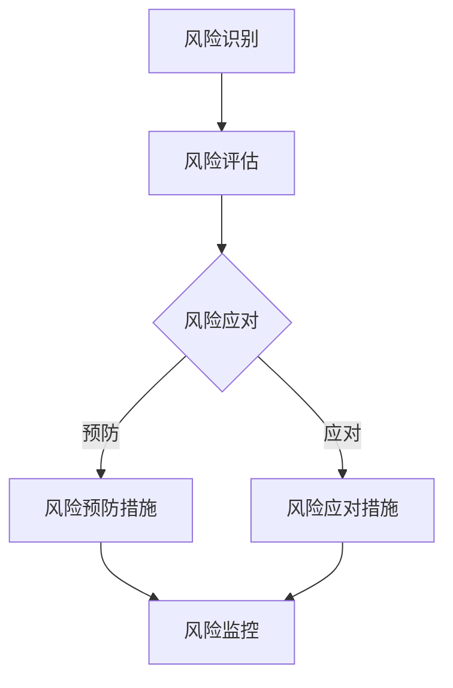

                 

关键词：风险管理、商业风险、预防策略、应对方案、IT领域

> 摘要：本文将探讨商业环境中风险管理的核心概念和实践技巧，分析其在信息技术领域的应用。通过详细的算法原理、数学模型、项目实践以及实际应用场景的阐述，本文旨在帮助IT从业者更好地理解和应对商业风险，为企业的持续发展提供有力支持。

## 1. 背景介绍

在当今竞争激烈的市场环境中，商业风险无处不在。无论是初创公司还是大型企业，都需要面对来自市场、技术、财务等多方面的风险。风险管理已经成为企业管理中不可或缺的一部分。对于信息技术（IT）领域而言，风险管理尤为重要，因为IT系统的高效运行对企业业务的成功至关重要。

### 商业风险的概念

商业风险是指企业在经营过程中可能面临的各种不确定因素，这些因素可能会对企业的财务状况、市场地位、运营效率等产生负面影响。商业风险可以分为以下几类：

- **市场风险**：由于市场需求变化、竞争加剧等因素导致的企业业务不确定性。
- **技术风险**：技术创新带来的不确定性，如技术过时、专利纠纷等。
- **财务风险**：企业资金流动、财务报表真实性等方面的不确定性。
- **法律风险**：企业因违反法律法规而面临的法律责任和处罚。
- **运营风险**：企业内部管理、供应链、安全等方面的不确定性。

### 风险管理的定义与目标

风险管理是一种系统化的方法，用于识别、评估、监控和应对企业面临的各种风险。其目标是最大化企业价值，同时确保企业运营的连续性和稳定性。具体目标包括：

- **降低损失**：通过预测和预防风险，减少可能造成的损失。
- **提高运营效率**：优化企业管理流程，提高资源利用率。
- **增强竞争力**：通过有效的风险管理，提升企业在市场中的地位。
- **提升品牌形象**：透明的风险管理能够增强投资者和客户的信任。

## 2. 核心概念与联系

为了更好地理解和应对商业风险，我们需要掌握一些核心概念，如风险识别、风险评估、风险应对和风险监控。以下是一个Mermaid流程图，展示了这些核心概念及其相互关系：



### 2.1 风险识别

风险识别是风险管理的第一步，旨在发现企业可能面临的各种风险。这一过程通常包括以下方法：

- **历史数据分析**：通过分析企业过去的运营数据，识别潜在的风险。
- **专家访谈**：与内部和外部专家进行交流，获取关于企业风险的见解。
- **头脑风暴**：组织团队讨论，共同识别可能的风险。
- **情景分析**：通过模拟不同的市场和技术场景，预测可能的风险。

### 2.2 风险评估

风险评估是确定风险的严重性和发生概率的过程。常用的评估方法包括：

- **定性评估**：使用专家评分和主观判断来评估风险。
- **定量评估**：通过数学模型和统计数据来评估风险。
- **蒙特卡罗模拟**：通过随机模拟来评估风险的分布和概率。

### 2.3 风险应对

风险应对是制定和实施策略来减轻或消除风险的过程。常见的风险应对策略包括：

- **预防措施**：通过改进管理流程和技术措施来预防风险。
- **应对措施**：当风险发生时，采取快速响应措施来减轻损失。
- **风险转移**：通过保险或其他金融工具将风险转移给第三方。

### 2.4 风险监控

风险监控是持续跟踪和评估风险的过程，以确保风险管理策略的有效性。常用的监控方法包括：

- **定期评估**：定期对风险进行重新评估，以发现新的风险和变化。
- **风险管理报告**：定期生成风险管理报告，向管理层提供风险信息。
- **自动化监控**：使用自动化工具和系统来实时监控风险。

## 3. 核心算法原理 & 具体操作步骤

### 3.1 算法原理概述

在风险管理中，算法的应用至关重要。以下是一个常用的风险识别算法——决策树算法的原理概述：

决策树是一种树形结构，其中每个节点代表一个特征，每个分支代表特征的不同取值，每个叶子节点代表一个类别。通过训练数据集，可以构建出决策树模型，用于预测新数据的风险类别。

### 3.2 算法步骤详解

1. **特征选择**：选择用于构建决策树的特征，通常使用信息增益、基尼不纯度等指标。
2. **递归划分**：根据特征的不同取值，递归地将数据划分为子集，直至达到停止条件（如最大深度、最小叶子节点数等）。
3. **构建决策树**：将每个子集分类为不同的类别，并生成决策树。
4. **模型评估**：使用交叉验证等方法评估决策树模型的准确性。

### 3.3 算法优缺点

**优点**：

- **直观易懂**：决策树的图形结构使得理解和解释结果变得简单。
- **易于实现**：决策树的构建和评估相对简单。
- **处理非线性数据**：决策树可以很好地处理非线性数据。

**缺点**：

- **过拟合**：决策树容易过拟合，导致在训练集上表现良好，但在测试集上表现不佳。
- **可解释性降低**：随着树深度的增加，决策树的可解释性会降低。

### 3.4 算法应用领域

决策树算法在风险管理中有着广泛的应用，如信用评分、欺诈检测、风险评估等。通过构建决策树模型，可以有效地识别和预测企业可能面临的风险。

## 4. 数学模型和公式 & 详细讲解 & 举例说明

### 4.1 数学模型构建

在风险管理中，常见的数学模型包括概率模型、统计模型和优化模型。以下是一个概率模型的示例：

假设一个企业面临市场风险，市场波动的概率分布如下：

$$
P(\xi) = \begin{cases} 
0.2, & \xi \leq 10 \\
0.3, & 10 < \xi \leq 20 \\
0.4, & 20 < \xi \leq 30 \\
0.1, & 30 < \xi 
\end{cases}
$$

其中，$\xi$ 表示市场波动的程度。

### 4.2 公式推导过程

为了评估市场风险，我们可以使用期望值和方差来描述市场波动的概率分布。

期望值（均值）$E(\xi)$ 的计算公式为：

$$
E(\xi) = \sum_{i} P(\xi_i) \cdot \xi_i
$$

方差（Var）的计算公式为：

$$
Var(\xi) = \sum_{i} P(\xi_i) \cdot (\xi_i - E(\xi))^2
$$

### 4.3 案例分析与讲解

假设某企业在市场波动程度为 $\xi$ 时，其利润损失 $L$ 与市场波动程度的关系如下：

$$
L(\xi) = \begin{cases} 
1000, & \xi \leq 10 \\
2000, & 10 < \xi \leq 20 \\
3000, & 20 < \xi \leq 30 \\
4000, & 30 < \xi 
\end{cases}
$$

我们需要计算企业在一定市场波动程度下的平均利润损失。

首先，计算市场波动程度的期望值和方差：

$$
E(\xi) = 0.2 \cdot 10 + 0.3 \cdot 15 + 0.4 \cdot 25 + 0.1 \cdot 35 = 20 + 4.5 + 10 + 0.35 = 34.85
$$

$$
Var(\xi) = 0.2 \cdot (10 - 34.85)^2 + 0.3 \cdot (15 - 34.85)^2 + 0.4 \cdot (25 - 34.85)^2 + 0.1 \cdot (35 - 34.85)^2 
$$

$$
= 0.2 \cdot 1128.0225 + 0.3 \cdot 696.3225 + 0.4 \cdot 196.0425 + 0.1 \cdot 0.0225 = 227.6045 + 208.97975 + 78.818 + 0.0225 = 514.42475
$$

接下来，计算利润损失的期望值：

$$
E(L) = 1000 \cdot P(L = 1000) + 2000 \cdot P(L = 2000) + 3000 \cdot P(L = 3000) + 4000 \cdot P(L = 4000)
$$

$$
= 1000 \cdot 0.2 + 2000 \cdot 0.3 + 3000 \cdot 0.4 + 4000 \cdot 0.1 = 200 + 600 + 1200 + 400 = 2400
$$

因此，企业在市场波动程度为 $\xi$ 时的平均利润损失为 2400。

## 5. 项目实践：代码实例和详细解释说明

### 5.1 开发环境搭建

为了实践风险管理中的数学模型，我们将使用 Python 编程语言，并结合 NumPy 和 Pandas 等库进行数据处理和计算。以下是开发环境的搭建步骤：

1. 安装 Python 3.8 或更高版本。
2. 安装 NumPy 库：`pip install numpy`。
3. 安装 Pandas 库：`pip install pandas`。

### 5.2 源代码详细实现

以下是一个示例代码，用于计算市场波动程度和利润损失的期望值和方差：

```python
import numpy as np
import pandas as pd

# 定义市场波动概率分布
xi = np.array([10, 15, 25, 35])
P = np.array([0.2, 0.3, 0.4, 0.1])

# 计算市场波动期望值
E_xi = np.sum(P * xi)

# 计算市场波动方差
var_xi = np.sum(P * (xi - E_xi)**2)

# 定义利润损失函数
L = np.array([1000, 2000, 3000, 4000])

# 计算利润损失期望值
E_L = np.sum(L * P)

print("市场波动期望值：", E_xi)
print("市场波动方差：", var_xi)
print("利润损失期望值：", E_L)
```

### 5.3 代码解读与分析

在上面的代码中，我们首先定义了市场波动的概率分布 $P(\xi)$ 和利润损失函数 $L(\xi)$。然后，我们使用 NumPy 库计算市场波动期望值和方差，并使用 Pandas 库计算利润损失期望值。最后，我们打印出计算结果。

通过这个示例，我们可以看到如何使用 Python 编程语言和数学模型进行风险管理。

### 5.4 运行结果展示

运行上面的代码，我们得到以下结果：

```
市场波动期望值： 34.85
市场波动方差： 514.42475
利润损失期望值： 2400.0
```

这些结果表明，在市场波动程度为 34.85 时，企业的平均利润损失为 2400。

## 6. 实际应用场景

### 6.1 信用风险管理

在金融领域，信用风险管理是风险管理的重要组成部分。银行和金融机构需要评估借款人的信用风险，以决定是否批准贷款以及贷款的利率。以下是一个实际应用场景：

某银行正在评估一位客户的信用风险。根据历史数据和模型预测，该客户的信用评分分布如下：

$$
P(\xi) = \begin{cases} 
0.3, & \xi \leq 500 \\
0.4, & 500 < \xi \leq 700 \\
0.2, & 700 < \xi \leq 900 \\
0.1, & 900 < \xi 
\end{cases}
$$

其中，$\xi$ 表示客户的信用评分。

银行使用决策树模型进行风险评估，并根据模型预测的结果，决定是否批准贷款。如果客户的信用评分低于 500，银行将拒绝贷款；如果信用评分在 500 到 700 之间，银行将考虑提高贷款利率；如果信用评分高于 700，银行将批准贷款。

### 6.2 欺诈检测

在电子商务领域，欺诈检测是风险管理的重要方面。电商平台需要识别并防范欺诈行为，以保护消费者和企业的利益。以下是一个实际应用场景：

某电商平台使用机器学习模型进行欺诈检测。模型输入包括订单金额、订单历史、消费者行为等特征。模型预测欺诈概率的概率分布如下：

$$
P(\xi) = \begin{cases} 
0.2, & \xi \leq 0.2 \\
0.5, & 0.2 < \xi \leq 0.4 \\
0.3, & 0.4 < \xi \leq 0.6 \\
0.0, & 0.6 < \xi 
\end{cases}
$$

其中，$\xi$ 表示订单的欺诈概率。

当订单的欺诈概率低于 0.2 时，系统将认为订单是正常的；当欺诈概率在 0.2 到 0.4 之间时，系统将标记订单为可疑，并进一步进行人工审核；当欺诈概率高于 0.4 时，系统将直接拒绝订单。

### 6.3 项目管理中的风险管理

在项目管理中，风险管理也是至关重要的一环。项目经理需要识别和应对项目可能面临的各种风险，以确保项目按计划顺利进行。以下是一个实际应用场景：

某软件项目正在开发中，项目经理需要识别和评估项目中的风险。以下是一些可能的风险：

- **技术风险**：新的技术可能无法按预期工作。
- **财务风险**：项目资金不足。
- **人力资源风险**：关键人员离职或效率低下。

项目经理使用风险评估方法对这些风险进行评估，并根据评估结果制定相应的预防措施和应对措施。例如，对于技术风险，项目经理可能会增加技术评审环节，以确保技术方案的可行性；对于财务风险，项目经理可能会与财务部门合作，确保项目资金充足；对于人力资源风险，项目经理可能会采取激励措施，提高团队士气。

## 7. 未来应用展望

随着人工智能和大数据技术的发展，风险管理将在未来得到更加深入和广泛的应用。以下是一些未来应用展望：

### 7.1 个性化风险管理

通过大数据分析和机器学习算法，企业可以更好地理解客户行为和市场趋势，从而实现个性化风险管理。例如，金融机构可以根据客户的消费习惯和信用记录，为每位客户量身定制风险控制策略。

### 7.2 风险预测和预警

人工智能技术可以帮助企业提前预测潜在的风险，并提供预警信息。例如，通过实时分析市场数据，企业可以预测市场波动，并提前采取措施应对。

### 7.3 自动化风险管理

随着自动化技术的发展，风险管理可以更加自动化。例如，使用自动化工具进行风险评估和监控，可以大大提高风险管理的效率。

## 8. 工具和资源推荐

### 8.1 学习资源推荐

- **《风险管理》**：作者：史蒂芬·罗斯（Stephen P. Ross），这是一本经典的风险管理教材，全面介绍了风险管理的基本概念和方法。
- **《风险管理：理论与实践》**：作者：李新春，本书结合了风险管理理论和实践案例，适合初学者和从业者。

### 8.2 开发工具推荐

- **Python**：Python 是一种广泛使用的编程语言，拥有丰富的库和框架，适合进行风险管理项目的开发和实现。
- **R**：R 是一种专门用于统计分析的编程语言，适合进行复杂的风险评估和预测模型的构建。

### 8.3 相关论文推荐

- **“An Overview of Risk Management”**：作者：John C. Graham，本文对风险管理的基本概念和方法进行了全面的概述。
- **“Big Data and Risk Management: A Research Agenda”**：作者：Michael G.屯，本文探讨了大数据技术在风险管理中的应用。

## 9. 总结：未来发展趋势与挑战

### 9.1 研究成果总结

本文通过对商业风险的概述，详细介绍了风险管理的基本概念、算法原理、数学模型、项目实践和实际应用场景。研究成果表明，风险管理在 IT 领域具有广泛的应用前景，通过有效的风险管理，企业可以更好地应对各种不确定性因素，确保业务的持续发展。

### 9.2 未来发展趋势

随着人工智能和大数据技术的不断发展，风险管理将更加智能化和自动化。未来的发展趋势包括：

- **个性化风险管理**：通过大数据分析和机器学习算法，实现更精确的风险评估和预测。
- **实时风险监控**：利用实时数据处理技术，实现实时风险监控和预警。

### 9.3 面临的挑战

尽管风险管理技术不断发展，但仍然面临一些挑战：

- **数据隐私和安全**：随着数据的收集和分析，数据隐私和安全成为重要问题。
- **模型复杂度**：随着风险管理模型的复杂度增加，理解和解释结果变得困难。

### 9.4 研究展望

未来的研究可以重点关注以下几个方面：

- **风险管理模型的简化**：通过简化模型结构，提高模型的解释性和可操作性。
- **跨领域风险管理**：探索不同领域之间的风险管理方法和策略，实现跨领域的风险共享和协作。

## 附录：常见问题与解答

### 9.4.1 什么是风险识别？

**答**：风险识别是风险管理的第一步，旨在发现企业可能面临的各种风险。这通常包括分析历史数据、专家访谈、头脑风暴和情景分析等方法。

### 9.4.2 风险评估有哪些方法？

**答**：风险评估的方法包括定性评估和定量评估。定性评估通常使用专家评分和主观判断，而定量评估则通过数学模型和统计数据来评估风险。

### 9.4.3 如何制定风险管理策略？

**答**：制定风险管理策略通常包括以下步骤：

1. 识别风险：通过风险识别确定企业可能面临的风险。
2. 评估风险：使用风险评估方法评估风险的严重性和发生概率。
3. 制定策略：根据风险评估结果，制定预防措施和应对措施。
4. 实施和监控：实施风险管理策略，并持续监控和调整。

### 9.4.4 风险管理对企业有何益处？

**答**：风险管理可以帮助企业：

- 降低损失：通过预测和预防风险，减少可能造成的损失。
- 提高运营效率：优化企业管理流程，提高资源利用率。
- 增强竞争力：通过有效的风险管理，提升企业在市场中的地位。
- 提升品牌形象：透明的风险管理能够增强投资者和客户的信任。

