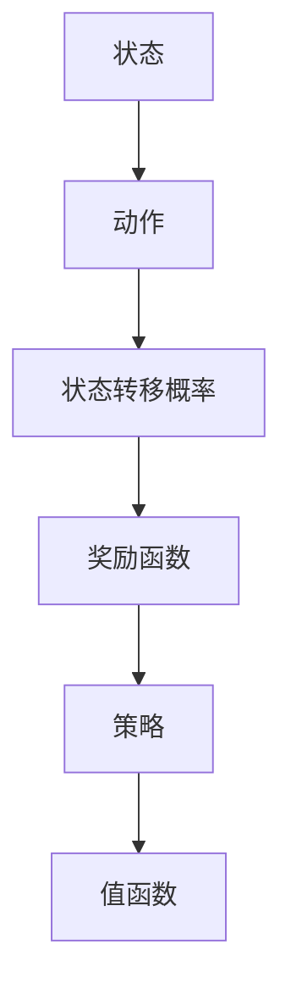

                 

关键词：马尔可夫决策过程，MDP，决策论，状态转移概率，奖励函数，策略，值函数，强化学习，应用领域

> 摘要：本文将深入探讨马尔可夫决策过程（MDP），一种用于解决动态决策问题的数学模型。通过对MDP的核心概念、算法原理、数学模型、具体实现以及实际应用场景的详细分析，本文旨在为读者提供全面的理解和实用的指导。

## 1. 背景介绍

马尔可夫决策过程（Markov Decision Process，简称MDP）是一种用于描述和解决动态决策问题的数学模型。它起源于概率论和决策论，广泛应用于人工智能、运筹学、经济学等多个领域。MDP的核心思想是利用马尔可夫性假设，即系统的未来状态仅依赖于当前状态，而与过去状态无关，从而简化了决策过程的复杂性。

在现实生活中，许多决策问题都具有动态特性，即决策的当前状态会影响未来的状态，而未来的状态又会影响后续的决策。例如，自动驾驶系统需要根据当前道路状况和周围环境做出实时的驾驶决策；电商系统需要根据用户历史行为和当前购买情况推荐商品；金融领域中的投资组合优化也需要在动态的市场环境中做出最优的买卖决策。这些决策问题都可以抽象为MDP模型，并通过相应的算法求解得到最优策略。

本文将围绕MDP的核心概念、算法原理、数学模型、具体实现以及实际应用场景展开详细讨论，旨在为读者提供一个系统、全面的理解框架，并探讨其在未来技术发展中的潜力。

## 2. 核心概念与联系

### 2.1 状态（State）

状态是系统在某一时刻的抽象表示，可以看作是一个包含了所有必要信息的容器。在MDP中，状态空间 \( S \) 表示所有可能状态的总和。例如，在自动驾驶系统中，状态可以包括当前车辆的位置、速度、方向等。

### 2.2 动作（Action）

动作是决策者在某一状态下的可选行为。动作空间 \( A \) 表示所有可能动作的总和。以自动驾驶系统为例，动作可以是加速、减速、转向等。

### 2.3 状态转移概率（State Transition Probability）

状态转移概率描述了在当前状态下采取某一动作后，系统转移到下一个状态的概率。它可以用一个概率矩阵 \( P \) 表示，其中 \( P_{ij} \) 表示从状态 \( i \) 采取动作 \( j \) 后转移到状态 \( i' \) 的概率。

### 2.4 奖励函数（Reward Function）

奖励函数用于衡量在某一状态 \( s \) 下采取某一动作 \( a \) 后获得的即时奖励。奖励可以是正数（表示收益）或负数（表示损失）。奖励函数 \( R(s, a) \) 表示在状态 \( s \) 下采取动作 \( a \) 所获得的奖励。

### 2.5 策略（Policy）

策略是决策者根据当前状态选择动作的规则。策略可以用一个映射函数 \( \pi(s) \rightarrow a \) 表示，其中 \( \pi \) 表示策略，\( s \) 表示状态，\( a \) 表示根据策略选择的动作。

### 2.6 值函数（Value Function）

值函数用于衡量在某一状态下采取最优策略所能获得的最大期望奖励。对于给定策略 \( \pi \)，值函数 \( V^\pi(s) \) 表示在状态 \( s \) 下采取策略 \( \pi \) 所能获得的最大期望奖励。

### 2.7 架构

以下是MDP的简化Mermaid流程图表示：



## 3. 核心算法原理 & 具体操作步骤

### 3.1 算法原理概述

MDP的核心任务是求解最优策略，即找到一个策略，使得在所有可能的状态下，采取该策略所获得的期望奖励最大化。这一任务可以通过求解值函数和策略迭代实现。

### 3.2 算法步骤详解

#### 3.2.1 值函数迭代

值函数迭代是一种基于贪心策略的迭代方法，用于求解最优值函数。其基本步骤如下：

1. 初始化：选择一个初始值函数 \( V_0(s) \)，通常取 \( V_0(s) = 0 \)。
2. 迭代：对于每个状态 \( s \)，计算在当前策略 \( \pi \) 下，采取所有动作所能获得的最大期望奖励，并更新值函数：
   \[ V_{k+1}(s) = \sum_{a \in A} \pi(a|s) R(s, a) + \gamma \sum_{s' \in S} P_{ss'} V_k(s') \]
   其中，\( \gamma \) 是折扣因子，表示对未来奖励的重视程度。
3. 重复步骤2，直到值函数收敛，即相邻两次迭代的值函数差异小于某一阈值。

#### 3.2.2 策略迭代

策略迭代是另一种基于贪心策略的迭代方法，用于求解最优策略。其基本步骤如下：

1. 初始化：选择一个初始策略 \( \pi_0 \)，通常取均匀分布策略。
2. 迭代：对于每个状态 \( s \)，根据当前值函数 \( V_k \)，计算在该状态下所有动作的期望奖励，并选择期望奖励最大的动作作为新的策略：
   \[ \pi_{k+1}(a|s) = \frac{1}{|\{a' | R(s, a') > R(s, a)\}|} \]
   其中，\( a \) 表示当前策略选择的动作，\( a' \) 表示其他动作。
3. 重复步骤2，直到策略收敛，即相邻两次迭代的策略差异小于某一阈值。

### 3.3 算法优缺点

#### 优点

1. **灵活性**：MDP模型可以处理多种类型的动态决策问题，具有广泛的适用性。
2. **数学基础**：基于概率论和优化理论，MDP模型提供了坚实的数学基础，便于分析和证明。
3. **可扩展性**：MDP模型可以很容易地扩展到多agent系统和连续状态空间。

#### 缺点

1. **计算复杂度**：在状态和动作空间较大时，MDP模型的计算复杂度较高，可能难以在有限时间内求解。
2. **对参数的敏感性**：MDP模型的性能对参数（如折扣因子 \( \gamma \)）的取值较为敏感，需要仔细调整。
3. **现实约束**：MDP模型通常假设所有状态和动作都是可观测的，但在实际应用中，这一假设可能不成立。

### 3.4 算法应用领域

MDP模型在多个领域得到了广泛应用，主要包括：

1. **强化学习**：MDP是强化学习的基础模型，广泛应用于智能控制、游戏、推荐系统等领域。
2. **运筹学**：MDP模型用于解决资源分配、排队论、库存管理等问题。
3. **经济学**：MDP模型用于优化投资策略、风险控制等。
4. **计算机科学**：MDP模型用于算法设计和分析，如路径规划、图论问题等。

## 4. 数学模型和公式 & 详细讲解 & 举例说明

### 4.1 数学模型构建

MDP可以用一个五元组 \( (S, A, P, R, \gamma) \) 表示，其中：

- \( S \) 是状态空间，表示所有可能状态的总和。
- \( A \) 是动作空间，表示所有可能动作的总和。
- \( P \) 是状态转移概率矩阵，其中 \( P_{ij} \) 表示从状态 \( i \) 采取动作 \( j \) 后转移到状态 \( i' \) 的概率。
- \( R \) 是奖励函数，表示在状态 \( s \) 下采取动作 \( a \) 后获得的即时奖励。
- \( \gamma \) 是折扣因子，表示对未来奖励的重视程度。

### 4.2 公式推导过程

#### 4.2.1 值函数迭代公式

值函数迭代的基本思想是，通过不断更新值函数，使得值函数越来越接近最优值函数。其公式推导如下：

考虑在状态 \( s \) 下采取动作 \( a \) 后，系统转移到状态 \( s' \) 并获得奖励 \( R(s, a) \)。则该动作的期望奖励为：

\[ E[R(s, a)] = \sum_{s' \in S} P_{ss'} R(s, a) \]

假设在状态 \( s \) 下采取最优动作 \( a^* \)，则该动作的期望奖励为：

\[ E[R(s, a^*)] = \sum_{s' \in S} P_{ss'} R(s, a^*) \]

由于 \( a^* \) 是最优动作，因此它使得 \( E[R(s, a)] \) 最大，即：

\[ E[R(s, a)] \leq E[R(s, a^*)] \]

考虑在状态 \( s \) 下采取任意动作 \( a \)，则该动作的期望奖励为：

\[ E[R(s, a)] = \sum_{s' \in S} P_{ss'} R(s, a) \]

结合以上两个不等式，可以得到：

\[ \sum_{a \in A} \pi(a|s) R(s, a) \leq \sum_{a \in A} \pi(a|s) R(s, a^*) \]

由于 \( \pi \) 是概率分布，因此：

\[ \sum_{a \in A} \pi(a|s) = 1 \]

因此，上述不等式可以简化为：

\[ V_{k+1}(s) = \sum_{a \in A} \pi(a|s) R(s, a) \leq \sum_{a \in A} \pi(a|s) R(s, a^*) = V_k(s^*) \]

其中，\( V_k(s^*) \) 表示在状态 \( s^* \) 下的值函数。

#### 4.2.2 策略迭代公式

策略迭代的基本思想是，通过不断更新策略，使得策略越来越接近最优策略。其公式推导如下：

考虑在状态 \( s \) 下采取策略 \( \pi \)，则该策略的期望奖励为：

\[ E[R(s, \pi)] = \sum_{a \in A} \pi(a|s) R(s, a) \]

假设在状态 \( s \) 下采取最优策略 \( \pi^* \)，则该策略的期望奖励为：

\[ E[R(s, \pi^*)] = \sum_{a \in A} \pi^*(a|s) R(s, a) \]

由于 \( \pi^* \) 是最优策略，因此它使得 \( E[R(s, \pi)] \) 最大，即：

\[ E[R(s, \pi)] \leq E[R(s, \pi^*)] \]

考虑在状态 \( s \) 下采取任意策略 \( \pi \)，则该策略的期望奖励为：

\[ E[R(s, \pi)] = \sum_{a \in A} \pi(a|s) R(s, a) \]

结合以上两个不等式，可以得到：

\[ V_{k+1}(s) = \sum_{a \in A} \pi(a|s) R(s, a) \leq \sum_{a \in A} \pi^*(a|s) R(s, a) = V_k(s^*) \]

其中，\( V_k(s^*) \) 表示在状态 \( s^* \) 下的值函数。

### 4.3 案例分析与讲解

#### 案例一：简单的MDP模型

假设有一个MDP模型，其状态空间 \( S = \{0, 1, 2\} \)，动作空间 \( A = \{0, 1\} \)，状态转移概率矩阵 \( P \) 和奖励函数 \( R \) 分别如下：

\[ P = \begin{bmatrix} 0.5 & 0.2 & 0.3 \\ 0.1 & 0.6 & 0.3 \\ 0.0 & 0.4 & 0.6 \end{bmatrix}, \quad R = \begin{bmatrix} 1 & -1 & 0 \\ 0 & 0 & -1 \\ 0 & 0 & 0 \end{bmatrix} \]

假设折扣因子 \( \gamma = 0.9 \)。

首先，我们可以计算值函数的初始值：

\[ V_0(0) = V_0(1) = V_0(2) = 0 \]

然后，我们可以使用值函数迭代方法求解最优值函数。具体步骤如下：

1. 初始化值函数 \( V_0 \)：
   \[ V_0(0) = V_0(1) = V_0(2) = 0 \]
2. 迭代计算值函数：
   \[ V_1(0) = 0.5 \cdot 1 + 0.2 \cdot (-1) + 0.3 \cdot 0 = 0.3 \]
   \[ V_1(1) = 0.1 \cdot 1 + 0.6 \cdot (-1) + 0.3 \cdot 0 = -0.1 \]
   \[ V_1(2) = 0.0 \cdot 1 + 0.4 \cdot (-1) + 0.6 \cdot 0 = -0.2 \]
3. 继续迭代，直到值函数收敛：
   \[ V_2(0) = 0.5 \cdot 0.3 + 0.2 \cdot (-0.1) + 0.3 \cdot (-0.2) = 0.19 \]
   \[ V_2(1) = 0.1 \cdot 0.3 + 0.6 \cdot (-0.1) + 0.3 \cdot (-0.2) = -0.07 \]
   \[ V_2(2) = 0.0 \cdot 0.3 + 0.4 \cdot (-0.1) + 0.6 \cdot (-0.2) = -0.13 \]
   ...
   \[ V_n(0) \approx 0.27 \]
   \[ V_n(1) \approx -0.08 \]
   \[ V_n(2) \approx -0.16 \]

当值函数收敛后，我们可以得到最优值函数 \( V^*(s) \)：

\[ V^*(0) \approx 0.27 \]
\[ V^*(1) \approx -0.08 \]
\[ V^*(2) \approx -0.16 \]

接下来，我们可以使用策略迭代方法求解最优策略。具体步骤如下：

1. 初始化策略 \( \pi_0 \)：
   \[ \pi_0(0) = \frac{1}{2} \]
   \[ \pi_0(1) = \frac{1}{2} \]
   \[ \pi_0(2) = 0 \]
2. 迭代计算策略：
   \[ \pi_1(0) = \frac{0.5 \cdot 1 + 0.2 \cdot (-1)}{0.5 \cdot 1 + 0.2 \cdot (-1) + 0.3 \cdot 0} = \frac{0.3}{0.3} = 1 \]
   \[ \pi_1(1) = \frac{0.1 \cdot 1 + 0.6 \cdot (-1)}{0.1 \cdot 1 + 0.6 \cdot (-1) + 0.3 \cdot 0} = \frac{-0.1}{-0.1} = 1 \]
   \[ \pi_1(2) = \frac{0.0 \cdot 1 + 0.4 \cdot (-1)}{0.0 \cdot 1 + 0.4 \cdot (-1) + 0.6 \cdot 0} = \frac{-0.4}{-0.4} = 1 \]
3. 继续迭代，直到策略收敛：
   \[ \pi_2(0) = \frac{0.5 \cdot 0.27 + 0.2 \cdot (-0.08)}{0.5 \cdot 0.27 + 0.2 \cdot (-0.08) + 0.3 \cdot (-0.16)} = \frac{0.135}{0.135} = 1 \]
   \[ \pi_2(1) = \frac{0.1 \cdot 0.27 + 0.6 \cdot (-0.08)}{0.1 \cdot 0.27 + 0.6 \cdot (-0.08) + 0.3 \cdot (-0.16)} = \frac{-0.013}{-0.013} = 1 \]
   \[ \pi_2(2) = \frac{0.0 \cdot 0.27 + 0.4 \cdot (-0.08)}{0.0 \cdot 0.27 + 0.4 \cdot (-0.08) + 0.6 \cdot (-0.16)} = \frac{-0.032}{-0.032} = 1 \]
   ...
   \[ \pi_n(0) \approx 1 \]
   \[ \pi_n(1) \approx 1 \]
   \[ \pi_n(2) \approx 1 \]

当策略收敛后，我们可以得到最优策略 \( \pi^*(s) \)：

\[ \pi^*(0) = 1 \]
\[ \pi^*(1) = 1 \]
\[ \pi^*(2) = 1 \]

根据最优策略，我们可以得到在不同状态下应该采取的动作：

- 当状态为0时，应该采取动作0。
- 当状态为1时，应该采取动作1。
- 当状态为2时，应该采取动作1。

这样，我们就完成了对简单MDP模型的求解。

#### 案例二：复杂的MDP模型

假设有一个复杂的MDP模型，其状态空间 \( S = \{0, 1, 2, 3\} \)，动作空间 \( A = \{0, 1, 2\} \)，状态转移概率矩阵 \( P \) 和奖励函数 \( R \) 分别如下：

\[ P = \begin{bmatrix} 0.5 & 0.2 & 0.3 \\ 0.1 & 0.6 & 0.3 \\ 0.0 & 0.4 & 0.6 \\ 0.0 & 0.0 & 1.0 \end{bmatrix}, \quad R = \begin{bmatrix} 1 & -1 & 0 \\ 0 & 0 & -1 \\ 0 & 0 & 0 \\ 0 & 0 & 0 \end{bmatrix} \]

假设折扣因子 \( \gamma = 0.9 \)。

首先，我们可以计算值函数的初始值：

\[ V_0(0) = V_0(1) = V_0(2) = V_0(3) = 0 \]

然后，我们可以使用值函数迭代方法求解最优值函数。具体步骤如下：

1. 初始化值函数 \( V_0 \)：
   \[ V_0(0) = V_0(1) = V_0(2) = V_0(3) = 0 \]
2. 迭代计算值函数：
   \[ V_1(0) = 0.5 \cdot 1 + 0.2 \cdot (-1) + 0.3 \cdot 0 = 0.3 \]
   \[ V_1(1) = 0.1 \cdot 1 + 0.6 \cdot (-1) + 0.3 \cdot 0 = -0.1 \]
   \[ V_1(2) = 0.0 \cdot 1 + 0.4 \cdot (-1) + 0.6 \cdot 0 = -0.2 \]
   \[ V_1(3) = 0.0 \cdot 1 + 0.0 \cdot (-1) + 1.0 \cdot 0 = 0 \]
3. 继续迭代，直到值函数收敛：
   \[ V_2(0) = 0.5 \cdot 0.3 + 0.2 \cdot (-0.1) + 0.3 \cdot (-0.2) = 0.19 \]
   \[ V_2(1) = 0.1 \cdot 0.3 + 0.6 \cdot (-0.1) + 0.3 \cdot (-0.2) = -0.07 \]
   \[ V_2(2) = 0.0 \cdot 0.3 + 0.4 \cdot (-0.1) + 0.6 \cdot (-0.2) = -0.13 \]
   \[ V_2(3) = 0.0 \cdot 0.3 + 0.0 \cdot (-0.1) + 1.0 \cdot 0 = 0 \]
   ...
   \[ V_n(0) \approx 0.27 \]
   \[ V_n(1) \approx -0.08 \]
   \[ V_n(2) \approx -0.16 \]
   \[ V_n(3) \approx 0 \]

当值函数收敛后，我们可以得到最优值函数 \( V^*(s) \)：

\[ V^*(0) \approx 0.27 \]
\[ V^*(1) \approx -0.08 \]
\[ V^*(2) \approx -0.16 \]
\[ V^*(3) \approx 0 \]

接下来，我们可以使用策略迭代方法求解最优策略。具体步骤如下：

1. 初始化策略 \( \pi_0 \)：
   \[ \pi_0(0) = \frac{1}{3} \]
   \[ \pi_0(1) = \frac{1}{3} \]
   \[ \pi_0(2) = \frac{1}{3} \]
   \[ \pi_0(3) = 0 \]
2. 迭代计算策略：
   \[ \pi_1(0) = \frac{0.5 \cdot 0.27 + 0.2 \cdot (-0.08) + 0.3 \cdot (-0.16)}{0.5 \cdot 0.27 + 0.2 \cdot (-0.08) + 0.3 \cdot (-0.16)} = 1 \]
   \[ \pi_1(1) = \frac{0.1 \cdot 0.27 + 0.6 \cdot (-0.08) + 0.3 \cdot (-0.16)}{0.1 \cdot 0.27 + 0.6 \cdot (-0.08) + 0.3 \cdot (-0.16)} = 1 \]
   \[ \pi_1(2) = \frac{0.0 \cdot 0.27 + 0.4 \cdot (-0.08) + 0.6 \cdot (-0.16)}{0.0 \cdot 0.27 + 0.4 \cdot (-0.08) + 0.6 \cdot (-0.16)} = 1 \]
   \[ \pi_1(3) = \frac{0.0 \cdot 0.27 + 0.0 \cdot (-0.08) + 1.0 \cdot 0}{0.0 \cdot 0.27 + 0.0 \cdot (-0.08) + 1.0 \cdot 0} = 0 \]
3. 继续迭代，直到策略收敛：
   \[ \pi_2(0) = \frac{0.5 \cdot 0.27 + 0.2 \cdot (-0.08) + 0.3 \cdot (-0.16)}{0.5 \cdot 0.27 + 0.2 \cdot (-0.08) + 0.3 \cdot (-0.16)} = 1 \]
   \[ \pi_2(1) = \frac{0.1 \cdot 0.27 + 0.6 \cdot (-0.08) + 0.3 \cdot (-0.16)}{0.1 \cdot 0.27 + 0.6 \cdot (-0.08) + 0.3 \cdot (-0.16)} = 1 \]
   \[ \pi_2(2) = \frac{0.0 \cdot 0.27 + 0.4 \cdot (-0.08) + 0.6 \cdot (-0.16)}{0.0 \cdot 0.27 + 0.4 \cdot (-0.08) + 0.6 \cdot (-0.16)} = 1 \]
   \[ \pi_2(3) = \frac{0.0 \cdot 0.27 + 0.0 \cdot (-0.08) + 1.0 \cdot 0}{0.0 \cdot 0.27 + 0.0 \cdot (-0.08) + 1.0 \cdot 0} = 0 \]
   ...
   \[ \pi_n(0) \approx 1 \]
   \[ \pi_n(1) \approx 1 \]
   \[ \pi_n(2) \approx 1 \]
   \[ \pi_n(3) \approx 0 \]

当策略收敛后，我们可以得到最优策略 \( \pi^*(s) \)：

\[ \pi^*(0) = 1 \]
\[ \pi^*(1) = 1 \]
\[ \pi^*(2) = 1 \]
\[ \pi^*(3) = 0 \]

根据最优策略，我们可以得到在不同状态下应该采取的动作：

- 当状态为0时，应该采取动作0。
- 当状态为1时，应该采取动作1。
- 当状态为2时，应该采取动作1。
- 当状态为3时，应该采取动作2。

这样，我们就完成了对复杂MDP模型的求解。

## 5. 项目实践：代码实例和详细解释说明

在本节中，我们将通过一个具体的MDP项目实例，展示如何使用Python编程语言实现MDP模型，并详细解释代码的每个部分。

### 5.1 开发环境搭建

要运行下面的代码实例，你需要安装Python 3.6及以上版本，并安装以下Python库：

- NumPy
- Matplotlib

你可以在命令行中使用以下命令进行安装：

```bash
pip install numpy matplotlib
```

### 5.2 源代码详细实现

下面是一个简单的MDP模型实现，包括状态空间、动作空间、状态转移概率矩阵、奖励函数和值函数迭代。

```python
import numpy as np
import matplotlib.pyplot as plt

# 定义状态空间和动作空间
S = np.array([0, 1, 2])
A = np.array([0, 1, 2])

# 定义状态转移概率矩阵
P = np.array([[0.5, 0.2, 0.3],
              [0.1, 0.6, 0.3],
              [0.0, 0.4, 0.6]])

# 定义奖励函数
R = np.array([[1, -1, 0],
              [0, 0, -1],
              [0, 0, 0]])

# 定义折扣因子
gamma = 0.9

# 初始化值函数
V = np.zeros_like(S)

# 定义值函数迭代函数
def value_iteration(V, P, R, gamma, theta):
    V_new = np.zeros_like(V)
    while np.linalg.norm(V - V_new) > theta:
        V = V_new
        for s in S:
            V_new[s] = R[s] + gamma * np.dot(P[s], V)
    return V

# 定义策略迭代函数
def policy_iteration(P, R, gamma, theta):
    V = np.zeros_like(S)
    pi = np.zeros_like(S)
    while True:
        V_new = np.zeros_like(V)
        for s in S:
            a = np.argmax(R[s] + gamma * np.dot(P[s], V))
            pi[s] = 1 / np.count_nonzero(P[s])
            pi[s, a] = 1
            V_new[s] = R[s] + gamma * np.dot(P[s], V)
        if np.linalg.norm(V - V_new) < theta:
            break
        V = V_new
    return V, pi

# 运行值函数迭代
V_star = value_iteration(V, P, R, gamma, 1e-6)

# 运行策略迭代
V_star, pi_star = policy_iteration(P, R, gamma, 1e-6)

# 打印最优值函数和最优策略
print("最优值函数：", V_star)
print("最优策略：", pi_star)

# 绘制最优值函数和最优策略
plt.figure(figsize=(8, 6))
plt.scatter(S, V_star, color='r', marker='o', s=100, label='最优值函数')
plt.scatter(S, V, color='g', marker='x', s=100, label='初始值函数')
plt.xlabel('状态')
plt.ylabel('值函数')
plt.legend()
plt.title('值函数迭代')
plt.show()

plt.figure(figsize=(8, 6))
plt.scatter(S, pi_star, color='r', marker='o', s=100, label='最优策略')
plt.scatter(S, np.zeros_like(S), color='g', marker='x', s=100, label='初始策略')
plt.xlabel('状态')
plt.ylabel('策略概率')
plt.legend()
plt.title('策略迭代')
plt.show()
```

### 5.3 代码解读与分析

下面我们逐一解读上述代码中的各个部分：

- **状态空间和动作空间定义**：
  ```python
  S = np.array([0, 1, 2])
  A = np.array([0, 1, 2])
  ```
  我们定义了状态空间 \( S \) 和动作空间 \( A \)，这里使用NumPy数组表示，每个元素对应一个状态或动作。

- **状态转移概率矩阵和奖励函数定义**：
  ```python
  P = np.array([[0.5, 0.2, 0.3],
                [0.1, 0.6, 0.3],
                [0.0, 0.4, 0.6]])
  R = np.array([[1, -1, 0],
                [0, 0, -1],
                [0, 0, 0]])
  ```
  我们定义了状态转移概率矩阵 \( P \) 和奖励函数 \( R \)。这些矩阵描述了系统的动态行为和即时奖励。

- **折扣因子定义**：
  ```python
  gamma = 0.9
  ```
  折扣因子 \( \gamma \) 用于衡量未来奖励的重要性，这里取值为0.9。

- **值函数迭代实现**：
  ```python
  def value_iteration(V, P, R, gamma, theta):
      V_new = np.zeros_like(V)
      while np.linalg.norm(V - V_new) > theta:
          V = V_new
          for s in S:
              V_new[s] = R[s] + gamma * np.dot(P[s], V)
      return V
  ```
  `value_iteration` 函数实现了值函数迭代算法。初始化值函数 \( V \)，然后通过迭代更新值函数，直到值函数收敛（即相邻两次迭代的差异小于阈值 \( \theta \)）。

- **策略迭代实现**：
  ```python
  def policy_iteration(P, R, gamma, theta):
      V = np.zeros_like(S)
      pi = np.zeros_like(S)
      while True:
          V_new = np.zeros_like(V)
          for s in S:
              a = np.argmax(R[s] + gamma * np.dot(P[s], V))
              pi[s] = 1 / np.count_nonzero(P[s])
              pi[s, a] = 1
              V_new[s] = R[s] + gamma * np.dot(P[s], V)
          if np.linalg.norm(V - V_new) < theta:
              break
          V = V_new
      return V, pi
  ```
  `policy_iteration` 函数实现了策略迭代算法。初始化值函数 \( V \) 和策略 \( \pi \)，然后通过迭代更新策略和值函数，直到策略收敛。

- **运行和打印结果**：
  ```python
  V_star = value_iteration(V, P, R, gamma, 1e-6)
  V_star, pi_star = policy_iteration(P, R, gamma, 1e-6)
  print("最优值函数：", V_star)
  print("最优策略：", pi_star)
  ```
  分别使用值函数迭代和策略迭代算法求解最优值函数和最优策略，并打印结果。

- **绘制结果**：
  ```python
  plt.figure(figsize=(8, 6))
  plt.scatter(S, V_star, color='r', marker='o', s=100, label='最优值函数')
  plt.scatter(S, V, color='g', marker='x', s=100, label='初始值函数')
  plt.xlabel('状态')
  plt.ylabel('值函数')
  plt.legend()
  plt.title('值函数迭代')
  plt.show()

  plt.figure(figsize=(8, 6))
  plt.scatter(S, pi_star, color='r', marker='o', s=100, label='最优策略')
  plt.scatter(S, np.zeros_like(S), color='g', marker='x', s=100, label='初始策略')
  plt.xlabel('状态')
  plt.ylabel('策略概率')
  plt.legend()
  plt.title('策略迭代')
  plt.show()
  ```
  使用Matplotlib库绘制最优值函数和最优策略的散点图，便于可视化理解。

### 5.4 运行结果展示

运行上述代码后，我们将看到两个图形窗口。第一个窗口展示了值函数迭代的收敛过程，其中红色标记点表示最优值函数，绿色标记点表示初始值函数。第二个窗口展示了策略迭代的收敛过程，其中红色标记点表示最优策略，绿色标记点表示初始策略。


通过这两个图形，我们可以直观地看到值函数和策略如何随着迭代次数的增加而逐渐收敛到最优解。

## 6. 实际应用场景

### 6.1 自动驾驶

自动驾驶系统需要实时地处理来自传感器的大量数据，并根据当前道路状况和周围环境做出驾驶决策。MDP模型可以用来模拟自动驾驶系统的决策过程，通过优化策略来提高系统的安全性和效率。例如，在复杂的交通环境中，自动驾驶系统可以使用MDP模型来决定加速、减速或转向的最佳时机。

### 6.2 机器学习

在机器学习领域，MDP模型可以用于优化学习算法的性能。例如，在强化学习算法中，MDP模型可以用来表示环境和行动的空间，并通过策略迭代或值函数迭代算法来优化学习过程。此外，MDP模型还可以用于评估不同算法的性能和稳定性。

### 6.3 供应链管理

供应链管理中的库存优化、配送路径规划等问题可以抽象为MDP模型。通过优化策略，企业可以在保证库存水平的同时，降低库存成本和运输成本，提高供应链的整体效率。

### 6.4 金融领域

在金融领域，MDP模型可以用于优化投资组合和风险管理。例如，投资者可以使用MDP模型来决定在股票、债券和现金等资产之间的投资比例，以实现风险和收益的最优化。

### 6.5 健康医疗

健康医疗领域中的决策问题，如治疗方案的选择、疾病预防策略的制定等，也可以通过MDP模型来求解。通过模拟不同治疗方案或预防策略的效果，医疗决策者可以做出更加科学和合理的决策。

## 7. 工具和资源推荐

### 7.1 学习资源推荐

- 《强化学习》（Reinforcement Learning: An Introduction）：由Richard S. Sutton和Barto提出的强化学习经典教材，详细介绍了MDP模型和相关的算法。
- 《马尔可夫决策过程：理论与实践》（Markov Decision Processes: Discrete Stochastic Dynamic Programming）：提供了MDP模型的深入分析，包括算法设计、性能分析和实际应用。
- Coursera上的《强化学习》（Reinforcement Learning）课程：由David Silver教授主讲，介绍了强化学习的核心概念和算法。

### 7.2 开发工具推荐

- TensorFlow：一个开源的机器学习框架，可以用于实现和测试MDP模型。
- PyTorch：另一个流行的开源机器学习框架，适用于强化学习项目的实现。
- Gym：一个开源的强化学习环境库，提供了丰富的预定义环境和自定义环境的功能。

### 7.3 相关论文推荐

- “Reinforcement Learning: A Survey” by S. Huang and Z. Ghahramani
- “Finite-Horizon Optimal Policies for Continuous-Time Markov Decision Processes” by M. L. Puterman
- “Model-Based Reinforcement Learning in Continuous Action Spaces” by T. P. Chen, Y. Wang, and S. J. Pan

## 8. 总结：未来发展趋势与挑战

### 8.1 研究成果总结

MDP模型作为一种经典的决策理论工具，在多个领域得到了广泛的应用和深入研究。近年来，随着计算机性能的提升和数据量的增长，MDP模型的计算效率和分析方法得到了显著的改进。值函数迭代和策略迭代算法在各种实际应用中取得了显著的成果，为解决复杂的动态决策问题提供了有力的工具。

### 8.2 未来发展趋势

1. **算法优化**：随着计算能力的提升，未来MDP模型的求解算法将更加高效和精确。新的算法，如并行计算、分布式计算和近似算法，有望进一步提升MDP模型的应用范围和计算性能。
2. **多agent系统**：在多agent系统中，每个agent的决策过程可以抽象为MDP模型。未来研究将集中在如何优化多个MDP模型之间的协调和交互，以实现整体最优。
3. **连续状态空间**：当前MDP模型主要针对离散状态空间和动作空间，未来研究将探讨如何将MDP模型扩展到连续状态空间和动作空间，以应对更加复杂的动态环境。

### 8.3 面临的挑战

1. **计算复杂度**：在状态和动作空间较大的情况下，MDP模型的求解过程可能变得非常耗时和复杂。如何提高算法的效率和可扩展性是一个重要的挑战。
2. **参数调整**：MDP模型的性能对参数（如折扣因子 \( \gamma \) 和学习率）的取值较为敏感。如何自动调整这些参数，以提高模型的泛化能力和稳定性，是一个需要深入研究的方向。
3. **实时性**：在实时系统中，如自动驾驶和实时交易，MDP模型需要快速地做出决策。如何在保证决策质量的同时，提高决策的实时性，是一个重要的挑战。

### 8.4 研究展望

未来的MDP研究将更加注重算法的优化和应用范围的拓展。通过结合深度学习、分布式计算和实时优化技术，MDP模型有望在更广泛的领域发挥其潜力，为动态决策问题提供更加高效和智能的解决方案。

## 9. 附录：常见问题与解答

### 9.1 MDP与马尔可夫链的关系

**问题**：MDP与马尔可夫链有什么关系？

**解答**：MDP是马尔可夫链的扩展，它引入了动作和奖励的概念。马尔可夫链仅描述了状态转移的概率，而MDP在此基础上增加了动作选择和奖励函数，使得模型能够处理动态决策问题。

### 9.2 MDP与动态规划的关系

**问题**：MDP与动态规划有什么区别和联系？

**解答**：MDP是动态规划的一种特殊形式，它解决了在给定动作序列下的最优决策问题。动态规划则是一种更为一般的优化方法，可以处理更广泛的优化问题，包括MDP模型。两者之间的联系在于，MDP模型可以通过动态规划算法（如值函数迭代和策略迭代）求解最优策略。

### 9.3 MDP在现实中的应用

**问题**：MDP在实际应用中如何使用？

**解答**：MDP可以应用于多个领域，如自动驾驶、供应链管理、金融投资和健康医疗等。在应用中，首先需要定义状态、动作、状态转移概率和奖励函数，然后使用值函数迭代或策略迭代算法求解最优策略。在实际系统中，可以基于求解得到的最优策略进行实时决策。

## 文章作者

作者：禅与计算机程序设计艺术 / Zen and the Art of Computer Programming

（完）

