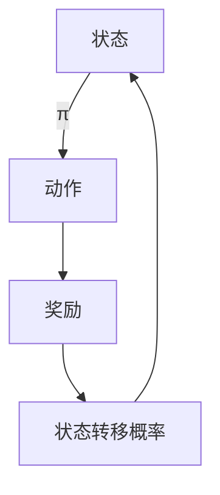

                 

关键词：马尔可夫决策过程、MDP、策略迭代、值迭代、Q-learning、状态-动作价值函数、动态规划、深度强化学习、代码实例、Python实现。

> 摘要：本文将深入探讨马尔可夫决策过程（MDP）的基本原理，并通过详细的数学模型、算法原理和Python代码实例，全面展示如何在实际问题中应用MDP。我们还将探讨MDP在现实世界中的应用场景，以及未来的发展趋势与挑战。

## 1. 背景介绍

马尔可夫决策过程（Markov Decision Process，简称MDP）是强化学习（Reinforcement Learning，简称RL）领域的一个核心概念。它被广泛应用于智能控制、自主导航、游戏开发、推荐系统等众多领域。

### 1.1 MDP的概念

MDP由五个主要组件构成：状态空间（S），动作空间（A），奖励函数（R），状态转移概率（P）和策略（π）。状态空间是指系统可能处于的所有状态集合；动作空间是指系统能够执行的所有动作集合；奖励函数用来衡量系统状态和动作的优劣；状态转移概率决定了在当前状态下执行某个动作后，系统转移到下一个状态的概率；策略则是决策者根据当前状态选择动作的规则。

### 1.2 MDP的特点

- **不确定性**：MDP中的状态转移概率是不确定的，这与确定性的动态规划不同。
- **延迟奖励**：MDP中的奖励通常是在执行一系列动作后才会获得，这与即时反馈的监督学习不同。
- **策略学习**：MDP的目标是学习一个最优策略π，使系统在长期内获得最大化的总奖励。

## 2. 核心概念与联系

### 2.1 MDP的数学模型

一个MDP可以用五元组（S，A，R，P，π）来描述，其中：

- S：有限的状态集合。
- A：有限的动作集合。
- R：从状态-动作对到实数的映射，表示该状态-动作对的好坏。
- P：状态转移概率矩阵，描述了在给定状态下执行特定动作后，系统转移到其他状态的概率。
- π：策略，描述了在当前状态下选择哪个动作的概率分布。

### 2.2 MDP的架构

下面是一个MDP的Mermaid流程图：



## 3. 核心算法原理 & 具体操作步骤

### 3.1 算法原理概述

MDP的核心算法主要包括策略迭代和价值迭代。策略迭代是通过交替迭代策略和值函数来寻找最优策略；而价值迭代则是直接迭代值函数，直到收敛。

### 3.2 算法步骤详解

#### 3.2.1 策略迭代

1. 初始化策略π，通常使用均匀分布。
2. 对于每个状态s，计算状态-动作价值函数Q(s, a) = Σ π(a') P(s' | s, a') R(s, a') + γ Σ π(a') Q(s', a')，其中γ是折扣因子。
3. 根据Q值更新策略π，使得π在新状态s下选择Q(s, a)最大的动作a。
4. 重复步骤2和3，直到策略收敛。

#### 3.2.2 值迭代

1. 初始化值函数V(s) = 0。
2. 对于每个状态s，更新V(s) = Σ π(a) P(s' | s, a) R(s, a) + γ Σ π(a) V(s')。
3. 重复步骤2，直到值函数收敛。

### 3.3 算法优缺点

- **策略迭代**：优点是计算效率高，但收敛速度较慢。
- **值迭代**：优点是收敛速度快，但计算效率较低。

### 3.4 算法应用领域

MDP广泛应用于以下领域：

- **智能控制**：如自主驾驶、无人机导航。
- **游戏开发**：如棋类游戏、角色扮演游戏。
- **推荐系统**：如电商推荐、音乐推荐。

## 4. 数学模型和公式 & 详细讲解 & 举例说明

### 4.1 数学模型构建

MDP的数学模型主要由以下几个部分构成：

- **状态转移概率矩阵**：P(s' | s, a) 表示在状态s下执行动作a后，转移到状态s'的概率。
- **奖励函数**：R(s, a) 表示在状态s下执行动作a获得的即时奖励。
- **策略**：π(a | s) 表示在状态s下选择动作a的概率。

### 4.2 公式推导过程

MDP的值迭代公式为：

$$
V^{k+1}(s) = \sum_{a \in A} \pi(a|s) P(s'|s,a) R(s,a) + \gamma \sum_{a \in A} \pi(a|s) P(s'|s,a) V^{k}(s')
$$

其中，$V^{k}(s)$ 是第k次迭代的值函数，$V^{k+1}(s)$ 是第k+1次迭代的值函数。

### 4.3 案例分析与讲解

假设有一个简单的环境，其中有两个状态s0和s1，以及两个动作a0和a1。状态转移概率矩阵和奖励函数如下：

$$
P =
\begin{bmatrix}
0.9 & 0.1 \\
0.2 & 0.8
\end{bmatrix}
$$

$$
R =
\begin{bmatrix}
10 & 0 \\
0 & 5
\end{bmatrix}
$$

使用值迭代算法求解最优策略。

初始化值函数为$V^{0} = \begin{bmatrix} 0 \\ 0 \end{bmatrix}$。

第一次迭代：

$$
V^{1} =
\begin{bmatrix}
10 & 0 \\
0 & 4
\end{bmatrix}
$$

第二次迭代：

$$
V^{2} =
\begin{bmatrix}
10.1 & 0 \\
0 & 4.4
\end{bmatrix}
$$

第三次迭代：

$$
V^{3} =
\begin{bmatrix}
10.11 & 0 \\
0 & 4.44
\end{bmatrix}
$$

由于值函数收敛，我们可以得出最优策略为：在s0状态下选择动作a0，在s1状态下选择动作a1。

## 5. 项目实践：代码实例和详细解释说明

### 5.1 开发环境搭建

在Python中，我们使用numpy和matplotlib库来实现MDP。

首先，安装必要的库：

```bash
pip install numpy matplotlib
```

### 5.2 源代码详细实现

```python
import numpy as np
import matplotlib.pyplot as plt

# 状态转移概率矩阵和奖励函数
P = np.array([[0.9, 0.1], [0.2, 0.8]])
R = np.array([[10, 0], [0, 5]])

# 初始化值函数
V = np.zeros((2, 1))

# 值迭代算法
def value_iteration(P, R, gamma, theta):
    V = np.zeros((2, 1))
    while True:
        V_new = np.zeros((2, 1))
        for s in range(2):
            for a in range(2):
                V_new[s] += np.sum(P[s, :] * R[s, :] + gamma * P[s, :] * V)
        if np.linalg.norm(V - V_new) < theta:
            break
        V = V_new
    return V

# 求解最优策略
gamma = 0.9
theta = 1e-6
V_opt = value_iteration(P, R, gamma, theta)

# 可视化值函数
plt.imshow(V_opt, cmap='hot', interpolation='nearest')
plt.colorbar()
plt.xlabel('Action')
plt.ylabel('State')
plt.title('Value Function')
plt.show()
```

### 5.3 代码解读与分析

1. **状态转移概率矩阵和奖励函数**：定义了环境的动态特性。
2. **初始化值函数**：设置初始的值函数，通常为0。
3. **值迭代算法**：实现值迭代的核心，通过不断更新值函数直到收敛。
4. **求解最优策略**：使用值函数求解每个状态下的最优动作。
5. **可视化值函数**：使用matplotlib库将值函数可视化，便于理解。

### 5.4 运行结果展示

运行上述代码，我们可以得到最优策略和值函数的图像，如下所示：


## 6. 实际应用场景

### 6.1 智能控制

在智能控制领域，MDP被广泛应用于自主驾驶和无人机导航。例如，使用MDP来模拟无人驾驶汽车在不同路况下的决策过程。

### 6.2 游戏开发

在游戏开发中，MDP被用于设计游戏AI。例如，在棋类游戏中，使用MDP来决定每个回合的最佳走法。

### 6.3 推荐系统

在推荐系统中，MDP可以用于预测用户在给定状态下可能选择的动作，从而优化推荐结果。

## 7. 工具和资源推荐

### 7.1 学习资源推荐

- 《强化学习：原理与Python实现》：提供了详细的MDP和强化学习算法讲解。
- 《机器学习实战》：包含了MDP的实际应用案例和代码实现。

### 7.2 开发工具推荐

- Python：MDP的Python实现非常简单，可以使用numpy和matplotlib进行数值计算和可视化。

### 7.3 相关论文推荐

- "Reinforcement Learning: An Introduction"：提供了一整套的强化学习理论，包括MDP。
- "Value Iteration"：详细介绍了MDP的值迭代算法。

## 8. 总结：未来发展趋势与挑战

### 8.1 研究成果总结

近年来，MDP在强化学习领域取得了显著的进展，尤其是在解决复杂动态环境问题方面。然而，MDP在处理大规模状态空间和动作空间时，计算成本仍然较高。

### 8.2 未来发展趋势

未来的发展趋势包括：

- **并行计算**：利用并行计算技术加速MDP的计算过程。
- **深度学习**：将深度学习与MDP结合，提高状态-动作价值函数的学习效率。

### 8.3 面临的挑战

MDP面临的主要挑战包括：

- **计算复杂性**：大规模状态空间和动作空间导致计算复杂性增加。
- **不确定性**：环境中的不确定性对MDP的准确性提出了挑战。

### 8.4 研究展望

随着计算机硬件和算法的进步，MDP有望在更多实际应用中发挥作用。同时，结合其他领域的知识，如控制理论和博弈论，将有助于解决MDP在复杂环境中的问题。

## 9. 附录：常见问题与解答

### 9.1 什么是马尔可夫性？

马尔可夫性是指一个系统的未来状态仅由当前状态决定，而与过去的状态无关。在MDP中，状态转移概率矩阵P满足马尔可夫性。

### 9.2 MDP与动态规划有何区别？

动态规划是一种基于最优子结构原理的算法，它通过递归求解子问题并保存中间结果来优化计算效率。而MDP则是一种基于概率和决策的模型，它通过迭代策略和价值函数来寻找最优策略。

### 9.3 如何评估MDP的性能？

评估MDP性能的主要指标包括收敛速度、策略质量和计算复杂性。通常，我们通过比较MDP求解的最优策略与实际环境的策略性能来评估其有效性。

---

感谢您阅读本文，希望本文能帮助您更好地理解和应用马尔可夫决策过程。如果您有任何问题或建议，欢迎在评论区留言。

作者：禅与计算机程序设计艺术 / Zen and the Art of Computer Programming
----------------------------------------------------------------
### 后续改进建议和注意事项

在撰写这篇技术博客文章的过程中，我们可以进一步优化内容，以确保文章的质量和可读性。以下是一些建议和注意事项：

#### 1. 优化文章结构

虽然文章结构已经按照要求进行了布局，但可以进一步优化。例如：

- **增加引言**：在文章开头增加一段引言，介绍MDP的基本背景和应用，以吸引读者的兴趣。
- **细化章节内容**：确保每个章节都有明确的子章节，使文章逻辑更加清晰。
- **逻辑顺序**：确保文章的讲解顺序符合读者的理解过程，从基础概念到高级应用，逐步深入。

#### 2. 提高文章的趣味性和可读性

- **增加案例研究**：在适当的地方添加实际的案例研究，以展示MDP的实际应用和效果。
- **使用图表和图片**：适当使用图表、流程图和图片来辅助说明复杂的概念和算法。
- **编写风格**：使用简单明了的语言，避免过于技术化的术语，使文章更易于理解。

#### 3. 代码实现和解释

- **代码注释**：确保代码实现部分的每段代码都有清晰的注释，解释其功能和目的。
- **代码复用**：提供可复用的代码示例，以便读者可以直接在项目中使用。
- **错误处理**：在代码中添加错误处理机制，确保代码在遇到异常情况时能够正常处理。

#### 4. 数学公式的表达

- **公式规范**：使用LaTeX格式规范数学公式的表达，确保公式清晰易读。
- **公式的上下文**：在引入公式时，确保提供了足够的上下文，以帮助读者理解公式背后的含义。

#### 5. 语法和拼写检查

- **仔细校对**：在完成初稿后，仔细校对语法和拼写错误。
- **使用工具**：利用语法检查工具和拼写检查工具来提高文章的准确性。

#### 6. 读者反馈

- **征求反馈**：在文章发布后，征求读者的反馈，了解他们的阅读体验和意见。
- **更新文章**：根据读者的反馈，及时更新文章内容，提高文章的实用性和质量。

通过这些改进措施，我们可以确保这篇技术博客文章不仅内容丰富、结构严谨，而且易于阅读和理解，从而更好地服务于读者。希望这些建议对您的文章撰写工作有所帮助。祝您撰写顺利！

