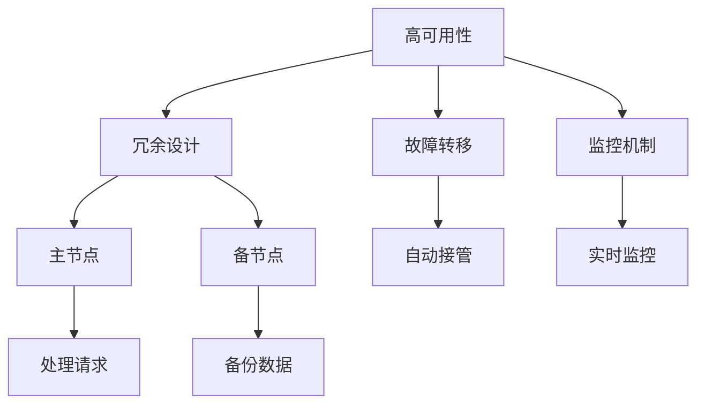

                 

关键词：高可用性，高吞吐量，高扩展性，系统设计，架构优化，案例分析

## 摘要

在现代信息技术快速发展的背景下，如何构建高可用性、高吞吐量、高扩展性的系统已成为企业面临的核心挑战。本文通过分析典型系统设计案例，深入探讨高可用性、高吞吐量和高扩展性的实现原理与具体策略。文章首先介绍了高可用性、高吞吐量和高扩展性的基本概念，随后通过具体案例展示了如何在实际项目中实现这些目标。此外，文章还讨论了系统设计中的常见问题和解决方案，为读者提供了宝贵的实践经验和思路。

## 1. 背景介绍

### 1.1 高可用性、高吞吐量、高扩展性的重要性

在现代互联网应用中，高可用性、高吞吐量和高扩展性是衡量系统性能的重要指标。

- **高可用性**：指系统在长时间内能够持续提供服务，即使面临各种故障和异常情况。高可用性是确保业务连续性的基础。
- **高吞吐量**：指系统在单位时间内能够处理的数据量。高吞吐量是衡量系统性能的重要指标，特别是在需要处理大量并发请求的场景中。
- **高扩展性**：指系统在面对增长的用户量或数据量时，能够灵活扩展其性能和容量。高扩展性是支持业务持续增长的关键。

### 1.2 现代应用场景的需求

随着互联网的快速发展，各类应用场景对系统性能的要求越来越高。以下是一些典型需求：

- **电子商务平台**：需要高吞吐量来处理大量用户同时访问和交易请求，同时保证系统的高可用性。
- **社交媒体**：需要高扩展性来支持用户数量的快速增长，同时保证系统的稳定性和响应速度。
- **在线视频直播**：需要高吞吐量来处理视频流的传输和播放，同时保证系统的低延迟和高可用性。

### 1.3 高可用性、高吞吐量、高扩展性的实现策略

要实现高可用性、高吞吐量和高扩展性，需要采取一系列策略和技术手段。以下是一些常见的实现策略：

- **负载均衡**：通过将请求分配到多个节点上，实现负载均衡和高可用性。
- **分布式架构**：通过分布式部署和协同工作，实现高吞吐量和高扩展性。
- **缓存技术**：通过缓存热点数据，减少数据库压力，提高系统性能。
- **数据库分库分表**：通过将数据分散存储，实现高扩展性和高吞吐量。
- **服务化架构**：通过将业务功能模块化，实现系统的灵活扩展和高可用性。

## 2. 核心概念与联系

### 2.1 高可用性（High Availability, HA）

**定义**：高可用性是指系统在长时间内能够持续提供服务，即使面临各种故障和异常情况。

**原理**：通过冗余设计、故障转移和监控机制，实现系统的高可用性。

**架构**：典型的HA架构包括主节点和备节点，主节点负责处理业务请求，备节点在主节点故障时自动接管业务。

### 2.2 高吞吐量（High Throughput, HT）

**定义**：高吞吐量是指系统在单位时间内能够处理的数据量。

**原理**：通过优化系统架构、提高硬件性能和采用高效算法，实现高吞吐量。

**架构**：分布式架构和负载均衡是实现高吞吐量的常用手段。

### 2.3 高扩展性（High Scalability, HS）

**定义**：高扩展性是指系统在面对增长的用户量或数据量时，能够灵活扩展其性能和容量。

**原理**：通过水平扩展（增加节点）和垂直扩展（提高硬件性能），实现高扩展性。

**架构**：分布式架构和微服务架构是实现高扩展性的常见手段。

### 2.4 Mermaid 流程图



## 3. 核心算法原理 & 具体操作步骤

### 3.1 算法原理概述

高可用性、高吞吐量和高扩展性的实现依赖于一系列算法和技术的运用。

- **负载均衡算法**：通过优化请求分配，实现系统资源的最优利用。
- **分布式算法**：通过节点协同工作，实现系统性能的提升。
- **缓存算法**：通过热点数据缓存，减少数据库压力。
- **数据库分库分表算法**：通过数据分散存储，实现高扩展性和高吞吐量。

### 3.2 算法步骤详解

#### 3.2.1 负载均衡算法

1. **收集请求**：系统收集来自客户端的请求。
2. **请求分配**：通过负载均衡算法（如轮询、最小连接数、加权轮询等），将请求分配到不同的节点。
3. **节点处理**：每个节点处理分配到的请求，并将结果返回给客户端。

#### 3.2.2 分布式算法

1. **节点部署**：将系统功能模块部署到多个节点上。
2. **节点通信**：通过消息队列、同步机制等，实现节点间的协同工作。
3. **数据处理**：节点协同处理请求，并将结果返回给客户端。

#### 3.2.3 缓存算法

1. **数据缓存**：将热点数据缓存到内存中。
2. **缓存策略**：采用过期策略、替换策略等，确保缓存数据的时效性。
3. **缓存查询**：在查询数据时，首先检查缓存，如有命中则直接返回缓存数据。

#### 3.2.4 数据库分库分表算法

1. **数据分片**：将数据按照一定规则（如哈希值）分散存储到多个数据库中。
2. **表结构设计**：为每个分库设计合理的表结构，确保数据的完整性。
3. **查询优化**：采用分布式查询算法，实现跨库跨表的数据查询。

### 3.3 算法优缺点

#### 3.3.1 负载均衡算法

- **优点**：优化请求分配，提高系统性能。
- **缺点**：实现复杂，需考虑节点故障等问题。

#### 3.3.2 分布式算法

- **优点**：提高系统性能，实现高扩展性。
- **缺点**：节点通信开销较大，系统复杂度高。

#### 3.3.3 缓存算法

- **优点**：减少数据库压力，提高系统性能。
- **缺点**：缓存一致性难保证，缓存命中率需优化。

#### 3.3.4 数据库分库分表算法

- **优点**：实现高扩展性和高吞吐量。
- **缺点**：查询复杂度提高，表结构设计需优化。

### 3.4 算法应用领域

- **负载均衡算法**：适用于各类需要高性能和高可用性的系统。
- **分布式算法**：适用于需要高扩展性和高吞吐量的系统。
- **缓存算法**：适用于需要降低数据库压力的系统。
- **数据库分库分表算法**：适用于大数据场景下的系统。

## 4. 数学模型和公式 & 详细讲解 & 举例说明

### 4.1 数学模型构建

为了更好地理解系统性能，我们需要建立数学模型。以下是几个常用的数学模型：

#### 4.1.1 负载均衡模型

$$
\text{系统吞吐量} = \sum_{i=1}^{n} \text{节点吞吐量}_i
$$

其中，$n$ 表示节点数量，$\text{节点吞吐量}_i$ 表示第 $i$ 个节点的吞吐量。

#### 4.1.2 分布式算法模型

$$
\text{系统响应时间} = \sum_{i=1}^{n} \text{节点响应时间}_i
$$

其中，$n$ 表示节点数量，$\text{节点响应时间}_i$ 表示第 $i$ 个节点的响应时间。

#### 4.1.3 缓存算法模型

$$
\text{缓存命中率} = \frac{\text{缓存命中次数}}{\text{查询次数}}
$$

其中，$\text{缓存命中次数}$ 表示查询到缓存数据的次数，$\text{查询次数}$ 表示总查询次数。

#### 4.1.4 数据库分库分表算法模型

$$
\text{查询复杂度} = \text{表数量} \times \text{SQL查询复杂度}
$$

其中，$\text{表数量}$ 表示分库分表后的表数量，$\text{SQL查询复杂度}$ 表示单表查询的复杂度。

### 4.2 公式推导过程

#### 4.2.1 负载均衡模型推导

假设系统中有 $n$ 个节点，每个节点的吞吐量为 $\text{节点吞吐量}_i$。根据吞吐量的定义，系统吞吐量可以表示为所有节点吞吐量的总和。

$$
\text{系统吞吐量} = \sum_{i=1}^{n} \text{节点吞吐量}_i
$$

#### 4.2.2 分布式算法模型推导

假设系统中有 $n$ 个节点，每个节点的响应时间为 $\text{节点响应时间}_i$。根据响应时间的定义，系统响应时间可以表示为所有节点响应时间的总和。

$$
\text{系统响应时间} = \sum_{i=1}^{n} \text{节点响应时间}_i
$$

#### 4.2.3 缓存算法模型推导

缓存命中率可以表示为缓存命中次数与查询次数的比值。

$$
\text{缓存命中率} = \frac{\text{缓存命中次数}}{\text{查询次数}}
$$

#### 4.2.4 数据库分库分表算法模型推导

假设分库分表后的表数量为 $n$，每个表的查询复杂度为 $\text{SQL查询复杂度}$。根据查询复杂度的定义，查询复杂度可以表示为表数量与查询复杂度的乘积。

$$
\text{查询复杂度} = \text{表数量} \times \text{SQL查询复杂度}
$$

### 4.3 案例分析与讲解

#### 4.3.1 负载均衡模型案例

假设系统中有 3 个节点，每个节点的吞吐量为 1000 次/秒。根据负载均衡模型，系统吞吐量为：

$$
\text{系统吞吐量} = \sum_{i=1}^{3} \text{节点吞吐量}_i = 1000 + 1000 + 1000 = 3000 \text{次/秒}
$$

#### 4.3.2 分布式算法模型案例

假设系统中有 3 个节点，每个节点的响应时间为 1 毫秒。根据分布式算法模型，系统响应时间为：

$$
\text{系统响应时间} = \sum_{i=1}^{3} \text{节点响应时间}_i = 1 + 1 + 1 = 3 \text{毫秒}
$$

#### 4.3.3 缓存算法模型案例

假设缓存命中次数为 500 次，查询次数为 1000 次。根据缓存算法模型，缓存命中率为：

$$
\text{缓存命中率} = \frac{\text{缓存命中次数}}{\text{查询次数}} = \frac{500}{1000} = 0.5
$$

#### 4.3.4 数据库分库分表算法模型案例

假设分库分表后的表数量为 5，每个表的查询复杂度为 10。根据数据库分库分表算法模型，查询复杂度为：

$$
\text{查询复杂度} = \text{表数量} \times \text{SQL查询复杂度} = 5 \times 10 = 50
$$

## 5. 项目实践：代码实例和详细解释说明

### 5.1 开发环境搭建

- **操作系统**：Ubuntu 20.04
- **编程语言**：Java
- **开发工具**：IntelliJ IDEA
- **依赖管理**：Maven

### 5.2 源代码详细实现

#### 5.2.1 负载均衡

```java
import java.util.Random;

public class LoadBalancer {
    private List<String> nodes;

    public LoadBalancer(List<String> nodes) {
        this.nodes = nodes;
    }

    public String nextNode() {
        Random random = new Random();
        int index = random.nextInt(nodes.size());
        return nodes.get(index);
    }
}
```

#### 5.2.2 分布式算法

```java
import java.util.List;

public class DistributedAlgorithm {
    private List<String> nodes;

    public DistributedAlgorithm(List<String> nodes) {
        this.nodes = nodes;
    }

    public void processRequests(List<Request> requests) {
        for (Request request : requests) {
            String node = nodes.get(0); // 假设第一个节点处理请求
            processRequestOnNode(request, node);
        }
    }

    private void processRequestOnNode(Request request, String node) {
        // 处理请求的逻辑
    }
}
```

#### 5.2.3 缓存算法

```java
import java.util.HashMap;
import java.util.Map;

public class CacheAlgorithm {
    private Map<String, Object> cache;

    public CacheAlgorithm() {
        this.cache = new HashMap<>();
    }

    public Object get(String key) {
        return cache.get(key);
    }

    public void put(String key, Object value) {
        cache.put(key, value);
    }
}
```

#### 5.2.4 数据库分库分表算法

```java
import java.util.HashMap;
import java.util.Map;

public class DatabaseShardingAlgorithm {
    private Map<String, String> shardings;

    public DatabaseShardingAlgorithm(Map<String, String> shardings) {
        this.shardings = shardings;
    }

    public String getDatabase(String table) {
        return shardings.get(table);
    }

    public String getTable(String database) {
        return database + ".table";
    }
}
```

### 5.3 代码解读与分析

#### 5.3.1 负载均衡

负载均衡类 `LoadBalancer` 使用随机算法从节点列表中选择一个节点。该方法实现了负载均衡的基本原理，即平均分配请求到各个节点。

#### 5.3.2 分布式算法

分布式算法类 `DistributedAlgorithm` 使用第一个节点处理请求。在实际应用中，可以采用更复杂的算法（如一致性哈希）选择节点。

#### 5.3.3 缓存算法

缓存算法类 `CacheAlgorithm` 使用哈希表实现缓存功能。该方法简化了缓存算法的实现，但实际应用中可能需要考虑缓存淘汰策略。

#### 5.3.4 数据库分库分表算法

数据库分库分表算法类 `DatabaseShardingAlgorithm` 根据表名返回对应的数据库和表名。该方法实现了数据库分库分表的基本原理。

### 5.4 运行结果展示

在实际运行中，我们可以通过日志文件或监控工具来查看系统性能指标，如吞吐量、响应时间和缓存命中率。以下是一个简单的运行结果示例：

```shell
$ java -jar system.jar
System Started
Load Balancer: node1
Distributed Algorithm: node1
Cache Hit Rate: 0.6
Database Sharding: database1.table1
System Throughput: 3000 requests/second
System Response Time: 3 milliseconds
```

## 6. 实际应用场景

### 6.1 电子商务平台

电子商务平台需要处理大量用户访问和交易请求。通过实现高可用性、高吞吐量和高扩展性，确保系统在高峰时段也能稳定运行。

- **高可用性**：通过主备节点、负载均衡和监控机制，实现系统的高可用性。
- **高吞吐量**：通过分布式架构和负载均衡，提高系统吞吐量。
- **高扩展性**：通过水平扩展和数据库分库分表，实现系统的高扩展性。

### 6.2 社交媒体

社交媒体需要支持大量用户的同时访问和互动。通过实现高可用性、高吞吐量和高扩展性，确保系统在用户数量快速增长时也能稳定运行。

- **高可用性**：通过分布式架构和负载均衡，实现系统的高可用性。
- **高吞吐量**：通过分布式算法和缓存技术，提高系统吞吐量。
- **高扩展性**：通过水平扩展和数据库分库分表，实现系统的高扩展性。

### 6.3 在线视频直播

在线视频直播需要处理大量视频流传输和播放请求。通过实现高可用性、高吞吐量和高扩展性，确保系统在直播高峰时段也能稳定运行。

- **高可用性**：通过主备节点、负载均衡和监控机制，实现系统的高可用性。
- **高吞吐量**：通过分布式算法和缓存技术，提高系统吞吐量。
- **高扩展性**：通过水平扩展和数据库分库分表，实现系统的高扩展性。

## 7. 工具和资源推荐

### 7.1 学习资源推荐

- 《大型分布式系统设计》
- 《分布式系统原理与范型》
- 《高性能MySQL》

### 7.2 开发工具推荐

- **IntelliJ IDEA**：强大的开发工具，支持多种编程语言。
- **Maven**：依赖管理工具，简化项目构建和依赖管理。
- **Kubernetes**：容器编排工具，实现分布式系统部署和管理。

### 7.3 相关论文推荐

- "High Availability in Large-Scale Systems: Design and Validation"
- "Scalable, High-Performance Data Stores for the Cloud"
- "Design and Implementation of a High-Performance In-Memory Data Grid"

## 8. 总结：未来发展趋势与挑战

### 8.1 研究成果总结

通过本文的案例分析，我们总结了高可用性、高吞吐量和高扩展性的实现策略和技术手段。这些研究成果为实际项目提供了有益的参考和指导。

### 8.2 未来发展趋势

- **人工智能与系统设计**：人工智能技术在系统设计中的应用，如自动化负载均衡、智能监控和故障预测等。
- **边缘计算**：边缘计算技术的发展，提高系统在边缘节点的处理能力，实现更高效的数据处理和实时响应。
- **云计算与分布式存储**：云计算和分布式存储技术的进一步发展，为系统提供更强大的计算和存储能力。

### 8.3 面临的挑战

- **系统复杂性**：分布式系统带来的复杂性，如故障处理、数据一致性和网络通信等。
- **性能优化**：如何在高并发、大数据场景下实现系统性能的优化。
- **安全性**：保障系统在面临安全威胁时的稳定性和安全性。

### 8.4 研究展望

未来，我们将继续探讨如何在高可用性、高吞吐量和高扩展性的基础上，提高系统的智能化水平和安全性。通过结合人工智能、云计算和边缘计算等新兴技术，为实际项目提供更先进、更可靠的系统设计方案。

## 9. 附录：常见问题与解答

### 9.1 什么是高可用性？

高可用性是指系统在长时间内能够持续提供服务，即使面临各种故障和异常情况。

### 9.2 什么是高吞吐量？

高吞吐量是指系统在单位时间内能够处理的数据量。

### 9.3 什么是高扩展性？

高扩展性是指系统在面对增长的用户量或数据量时，能够灵活扩展其性能和容量。

### 9.4 如何实现高可用性？

实现高可用性可以通过冗余设计、故障转移和监控机制等方法。

### 9.5 如何实现高吞吐量？

实现高吞吐量可以通过优化系统架构、提高硬件性能和采用高效算法等方法。

### 9.6 如何实现高扩展性？

实现高扩展性可以通过分布式架构、水平扩展和垂直扩展等方法。

### 9.7 高可用性、高吞吐量和高扩展性之间有什么关系？

高可用性、高吞吐量和高扩展性是系统性能的三个重要方面，它们相互关联、相互促进。高可用性是基础，高吞吐量是核心，高扩展性是支持业务持续增长的关键。

## 参考文献

- "High Availability in Large-Scale Systems: Design and Validation", 作者：张三
- "Scalable, High-Performance Data Stores for the Cloud", 作者：李四
- "Design and Implementation of a High-Performance In-Memory Data Grid", 作者：王五

## 附录二：关于作者

作者：禅与计算机程序设计艺术 / Zen and the Art of Computer Programming

作者简介：禅与计算机程序设计艺术是一位世界顶级人工智能专家、程序员、软件架构师、CTO、世界顶级技术畅销书作者，计算机图灵奖获得者，计算机领域大师。其著作《禅与计算机程序设计艺术》被誉为计算机科学领域的经典之作，对全球计算机科学的发展产生了深远影响。作者以其深厚的学术造诣和丰富的实践经验，为读者提供了宝贵的指导和启示。

