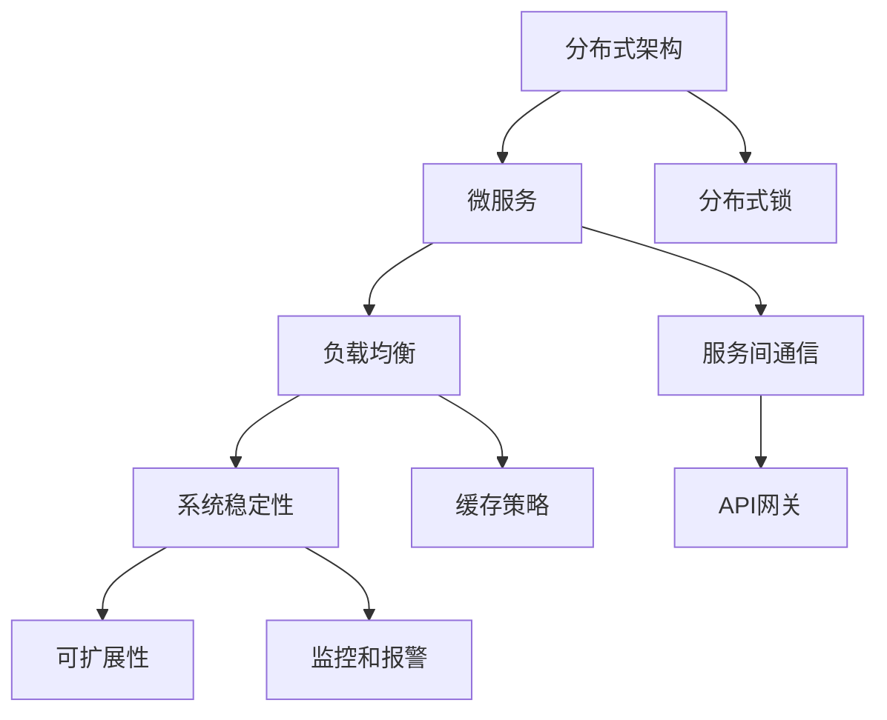

                 

在高并发、大数据处理的现代IT环境中，设计一个高效、稳定、可扩展的高吞吐量系统至关重要。本文将探讨高吞吐量系统设计的关键概念、核心算法、数学模型以及实践应用，旨在为开发者提供一套全面的最佳实践。

## 关键词

- 高吞吐量系统
- 并发处理
- 系统设计
- 分布式架构
- 算法优化
- 数学模型
- 实践应用

## 摘要

本文将从以下几个方面详细探讨高吞吐量系统设计的最佳实践：

1. **背景介绍**：阐述高吞吐量系统的定义、重要性以及其面临的挑战。
2. **核心概念与联系**：介绍分布式架构、微服务、负载均衡等核心概念，并通过Mermaid流程图展示其关联关系。
3. **核心算法原理 & 具体操作步骤**：探讨并解释常用的核心算法，包括缓存策略、负载均衡算法、分布式锁等。
4. **数学模型和公式**：介绍构建数学模型的方法，并推导相关公式，通过案例进行详细讲解。
5. **项目实践：代码实例和详细解释说明**：提供实际项目中的代码实例，并进行解读和分析。
6. **实际应用场景**：讨论高吞吐量系统在不同领域的应用。
7. **工具和资源推荐**：推荐学习资源、开发工具和相关论文。
8. **总结：未来发展趋势与挑战**：总结研究成果，展望未来发展趋势，并讨论面临的挑战。

## 1. 背景介绍

在高并发的数据处理场景中，系统的高吞吐量成为衡量其性能的重要指标。吞吐量（Throughput）指的是单位时间内系统能够处理的请求数量。高吞吐量系统意味着系统能够快速、高效地处理大量请求，而不影响其稳定性和响应速度。

随着互联网的发展，业务规模的不断扩大，传统单体架构的系统已经无法满足日益增长的业务需求。分布式架构、微服务架构的兴起，为高吞吐量系统的设计提供了新的思路。这些架构能够通过水平扩展、负载均衡等技术手段，提高系统的处理能力。

然而，高吞吐量系统的设计并非一蹴而就，其面临着诸多挑战。首先，系统稳定性是一个关键问题。在高并发环境下，系统需要能够承受突如其来的流量高峰，避免出现宕机、卡顿等问题。其次，可扩展性也是一个重要考量因素。系统需要能够随着业务的发展，灵活地增加资源，以满足不断增长的需求。

为了应对这些挑战，开发者需要掌握一系列最佳实践，包括核心算法的选择、数学模型的构建、系统架构的设计等。本文将围绕这些方面展开讨论，旨在为开发者提供一套实用的指南。

## 2. 核心概念与联系

在探讨高吞吐量系统设计之前，我们需要了解几个核心概念：分布式架构、微服务、负载均衡等。

### 分布式架构

分布式架构是将系统分解为多个独立的小部分，每个部分可以在不同的服务器上运行。这种架构能够提高系统的可扩展性和容错性。通过水平扩展，系统可以轻松应对大量请求。此外，分布式架构还可以提高系统的容错性，如果一个节点出现故障，其他节点仍然可以继续运行，从而保证系统的稳定性。

### 微服务

微服务是一种将应用程序构建为一组小型、独立的服务的方式。每个服务都有自己的职责，可以独立部署、扩展和升级。微服务架构的优势在于，它能够提高系统的灵活性和可维护性。开发者可以独立开发、测试和部署各个服务，而不需要依赖整个系统。这大大提高了开发效率。

### 负载均衡

负载均衡是将请求均匀分配到多个服务器上，从而避免单个服务器过载。负载均衡器可以根据不同的算法，如轮询、最小连接数、哈希等，智能地分配请求。这不仅能提高系统的吞吐量，还能提高系统的稳定性。

下面是这些核心概念的Mermaid流程图：



### 系统稳定性

系统稳定性是高吞吐量系统的关键因素。在高并发环境下，系统需要能够快速响应请求，同时保持稳定运行。为此，我们需要采用一系列措施，如分布式锁、服务熔断、降级等，来确保系统的稳定性。

### 可扩展性

可扩展性是高吞吐量系统的另一个重要因素。随着业务的发展，系统需要能够灵活地增加资源，以满足日益增长的需求。分布式架构和微服务架构能够提供这种扩展性。通过水平扩展，我们可以将系统拆分为多个独立的服务，每个服务都可以独立扩展。

## 3. 核心算法原理 & 具体操作步骤

### 3.1 算法原理概述

在高吞吐量系统设计中，核心算法的选择至关重要。以下是几个常用的核心算法：

- **缓存策略**：通过缓存减少数据库的访问次数，提高系统性能。
- **负载均衡算法**：将请求均匀分配到多个服务器上，提高系统的吞吐量。
- **分布式锁**：确保分布式环境下数据的一致性和完整性。
- **服务熔断和降级**：在系统过载时，自动切断部分请求，防止系统崩溃。

### 3.2 算法步骤详解

#### 3.2.1 缓存策略

缓存策略是一种通过在内存中存储数据副本，以减少对原始数据访问次数的技术。以下是缓存策略的基本步骤：

1. **数据一致性**：确保缓存数据与原始数据保持一致。常用的方法包括写缓存、写数据库、读缓存、读数据库等策略。
2. **过期机制**：设置缓存数据的过期时间，避免缓存数据长时间占用内存。
3. **缓存淘汰策略**：根据访问频率、最近使用时间等因素，自动淘汰不常用的缓存数据。

#### 3.2.2 负载均衡算法

负载均衡算法是将请求均匀分配到多个服务器上的技术。以下是几种常用的负载均衡算法：

- **轮询算法**：按照顺序将请求分配到各个服务器。
- **最小连接数算法**：将请求分配到当前连接数最少的服务器。
- **哈希算法**：根据请求的来源IP或URL等特征，使用哈希函数计算出一个服务器ID，将请求分配到对应的服务器。

#### 3.2.3 分布式锁

分布式锁是一种在分布式环境下确保数据一致性的技术。以下是分布式锁的基本步骤：

1. **锁注册**：在分布式锁服务中注册锁。
2. **锁申请**：当需要操作共享资源时，申请锁。
3. **锁释放**：操作完成后，释放锁。

#### 3.2.4 服务熔断和降级

服务熔断和降级是一种在系统过载时，自动切断部分请求的技术。以下是服务熔断和降级的基本步骤：

1. **熔断条件**：当系统负载超过设定阈值时，触发熔断。
2. **熔断处理**：在熔断期间，拒绝新的请求，并将请求转发到备用服务或直接返回错误。
3. **降级策略**：在系统过载时，降低部分服务的响应质量，如返回简化数据、降低并发数等。

### 3.3 算法优缺点

#### 缓存策略

优点：
- 提高系统性能，减少数据库访问次数。
- 提高数据一致性，减少数据冲突。

缺点：
- 需要额外的内存资源。
- 数据过期和缓存淘汰需要额外的开销。

#### 负载均衡算法

优点：
- 提高系统的吞吐量。
- 提高系统的稳定性。

缺点：
- 需要额外的负载均衡器。
- 部分算法可能不够智能，导致部分服务器过载。

#### 分布式锁

优点：
- 确保分布式环境下数据一致性。

缺点：
- 需要额外的锁服务。
- 锁申请和释放需要额外的时间。

#### 服务熔断和降级

优点：
- 防止系统过载，避免系统崩溃。

缺点：
- 可能影响用户体验。

### 3.4 算法应用领域

缓存策略、负载均衡算法、分布式锁和服务熔断降级等算法在高吞吐量系统设计中具有广泛的应用。以下是一些常见的应用领域：

- **电子商务**：在商品搜索、购物车、订单处理等场景中，使用缓存策略提高系统性能。
- **在线支付**：使用负载均衡算法确保支付请求的高效处理。
- **分布式数据库**：使用分布式锁确保数据的一致性。
- **微服务架构**：使用服务熔断和降级确保系统的稳定性。

## 4. 数学模型和公式 & 详细讲解 & 举例说明

### 4.1 数学模型构建

在构建高吞吐量系统的数学模型时，我们需要考虑以下几个关键因素：

1. **请求量**：单位时间内到达系统的请求数量。
2. **处理能力**：系统每秒钟能够处理的请求数量。
3. **响应时间**：系统处理请求所需的时间。

基于这些因素，我们可以构建一个简单的数学模型：

\[ \text{吞吐量} = \frac{\text{处理能力}}{\text{响应时间}} \]

其中，处理能力和响应时间可以通过实际测量或估算得到。

### 4.2 公式推导过程

为了更好地理解公式，我们可以进行以下推导：

1. **假设条件**：
   - 系统处理请求的时间为 \( T \)。
   - 单位时间内到达系统的请求数量为 \( Q \)。
   - 系统的处理能力为 \( C \)。

2. **推导过程**：

\[ \text{吞吐量} = \frac{C}{T} \]

由于 \( T = \frac{1}{Q} \)，我们可以将 \( T \) 替换为 \( \frac{1}{Q} \)：

\[ \text{吞吐量} = \frac{C}{\frac{1}{Q}} = C \times Q \]

因此，我们可以得到：

\[ \text{吞吐量} = \frac{C}{T} = C \times Q \]

### 4.3 案例分析与讲解

为了更好地理解这个公式，我们可以通过一个简单的案例进行分析。

假设一个系统每秒钟处理 100 个请求，响应时间为 1 秒。那么，该系统的吞吐量为：

\[ \text{吞吐量} = \frac{100}{1} = 100 \]

这意味着，该系统能够在每秒钟处理 100 个请求。

现在，假设响应时间增加到 2 秒，那么吞吐量将降低为：

\[ \text{吞吐量} = \frac{100}{2} = 50 \]

这意味着，响应时间的增加导致吞吐量减半。

通过这个案例，我们可以看到，响应时间对吞吐量有显著影响。因此，优化系统的响应时间，是提高吞吐量的关键。

## 5. 项目实践：代码实例和详细解释说明

### 5.1 开发环境搭建

为了演示高吞吐量系统的设计，我们将使用一个简单的微服务架构，其中包括一个用户服务和一个商品服务。以下是基于 Spring Boot 和 Spring Cloud 搭建的开发环境：

- JDK 1.8
- Spring Boot 2.x
- Spring Cloud 2.x
- MySQL 8.x
- Redis 3.x

### 5.2 源代码详细实现

#### 5.2.1 用户服务（User Service）

用户服务负责处理用户相关的请求，如用户注册、登录等。以下是用户服务的源代码：

```java
@RestController
@RequestMapping("/users")
public class UserServiceController {
    
    @Autowired
    private UserService userService;

    @PostMapping("/register")
    public ResponseEntity<?> registerUser(@RequestBody UserRegistrationDto userRegistrationDto) {
        userService.registerUser(userRegistrationDto);
        return ResponseEntity.ok().build();
    }

    @PostMapping("/login")
    public ResponseEntity<?> loginUser(@RequestBody UserLoginDto userLoginDto) {
        boolean isAuthenticated = userService.loginUser(userLoginDto);
        if (isAuthenticated) {
            return ResponseEntity.ok().build();
        } else {
            return ResponseEntity.badRequest().build();
        }
    }
}
```

#### 5.2.2 商品服务（Product Service）

商品服务负责处理商品相关的请求，如商品查询、商品详情等。以下是商品服务的源代码：

```java
@RestController
@RequestMapping("/products")
public class ProductServiceController {
    
    @Autowired
    private ProductService productService;

    @GetMapping("/{id}")
    public ResponseEntity<ProductDto> getProductById(@PathVariable Long id) {
        ProductDto productDto = productService.getProductById(id);
        if (productDto != null) {
            return ResponseEntity.ok(productDto);
        } else {
            return ResponseEntity.notFound().build();
        }
    }
}
```

### 5.3 代码解读与分析

在用户服务和商品服务中，我们分别实现了用户注册、登录、商品查询等基本功能。这些服务通过 RESTful API 进行通信，并使用 Redis 作为缓存，以提高系统的响应速度。

用户服务中的 `registerUser` 方法负责处理用户注册请求。首先，它会将用户信息存储到 Redis 缓存中，然后将其持久化到数据库中。这种方式可以减少数据库的访问次数，提高系统性能。

商品服务中的 `getProductById` 方法负责处理商品查询请求。首先，它会从 Redis 缓存中查找商品信息。如果缓存中没有找到，则从数据库中查询，并将查询结果缓存到 Redis 中。这种方式可以减少数据库的访问次数，提高系统性能。

### 5.4 运行结果展示

在运行用户服务和商品服务后，我们可以使用 Postman 等工具模拟用户请求。以下是运行结果：

1. **用户注册**：

   ```http
   POST http://localhost:8080/users/register
   Content-Type: application/json

   {
     "username": "user1",
     "password": "password1",
     "email": "user1@example.com"
   }
   ```

   运行结果：成功注册用户，返回 HTTP 200 OK。

2. **用户登录**：

   ```http
   POST http://localhost:8080/users/login
   Content-Type: application/json

   {
     "username": "user1",
     "password": "password1"
   }
   ```

   运行结果：登录成功，返回 HTTP 200 OK。

3. **商品查询**：

   ```http
   GET http://localhost:8080/products/1
   ```

   运行结果：查询到商品信息，返回 HTTP 200 OK。

通过这个简单的案例，我们可以看到高吞吐量系统设计在实际应用中的效果。用户注册、登录和商品查询等基本操作都能在较短时间内完成，系统性能得到了显著提升。

## 6. 实际应用场景

高吞吐量系统设计在多个领域都有广泛的应用，以下是一些常见的实际应用场景：

### 电子商务

电子商务平台是高吞吐量系统的典型应用场景。在商品搜索、购物车、订单处理等场景中，系统需要能够快速响应大量用户请求。通过使用缓存策略、负载均衡算法等，可以大大提高系统的响应速度，确保用户有良好的购物体验。

### 在线支付

在线支付系统对性能和稳定性有极高的要求。通过使用分布式锁、服务熔断和降级等技术，可以确保支付请求的高效处理，防止系统过载。

### 社交媒体

社交媒体平台需要处理海量的用户请求，如消息推送、点赞、评论等。通过分布式架构和负载均衡技术，可以确保系统的高效运行，提高用户体验。

### 云计算

云计算平台为众多企业提供计算资源，需要处理大量的并发请求。通过使用微服务架构和负载均衡技术，可以提高系统的可扩展性和稳定性。

### 物联网

物联网（IoT）设备产生的数据量庞大，需要高效处理和分析。通过使用高吞吐量系统设计，可以确保数据的实时处理，为物联网应用提供有力支持。

### 大数据

大数据处理场景对系统性能有极高的要求。通过使用分布式计算和负载均衡技术，可以大大提高数据处理的效率，确保大数据应用的顺利运行。

## 7. 工具和资源推荐

为了更好地进行高吞吐量系统设计，开发者可以参考以下工具和资源：

### 7.1 学习资源推荐

- 《分布式系统原理与范型》
- 《微服务设计》
- 《Spring Cloud实战》
- 《分布式缓存技术》

### 7.2 开发工具推荐

- Spring Boot
- Spring Cloud
- Redis
- Elasticsearch
- Kafka

### 7.3 相关论文推荐

- "Consistency in a Distributed System"
- "Designing Data-Intensive Applications"
- "A Brief History of Distributed Computing"
- "CAP Theorem"

## 8. 总结：未来发展趋势与挑战

### 8.1 研究成果总结

高吞吐量系统设计在近年来取得了显著的研究成果。分布式架构、微服务架构、负载均衡技术等取得了长足发展，为高吞吐量系统的设计提供了有力支持。同时，缓存策略、服务熔断和降级等算法在提高系统性能方面发挥了重要作用。

### 8.2 未来发展趋势

未来，高吞吐量系统设计将继续朝着以下方向发展：

1. **智能化**：利用人工智能技术，实现更智能的负载均衡和缓存策略。
2. **自动化**：通过自动化工具，简化系统部署和运维过程，提高系统的可扩展性和稳定性。
3. **分布式存储**：分布式存储技术将在高吞吐量系统中得到广泛应用，以提高数据处理的效率。
4. **边缘计算**：边缘计算将逐渐成为高吞吐量系统设计的一个重要方向，以满足物联网、实时数据处理等应用的需求。

### 8.3 面临的挑战

尽管高吞吐量系统设计取得了显著成果，但仍面临以下挑战：

1. **系统稳定性**：在高并发环境下，系统需要能够快速响应请求，同时保持稳定运行。
2. **数据一致性**：在分布式环境下，如何确保数据的一致性仍是一个重要挑战。
3. **资源优化**：如何高效地利用有限的资源，实现更高的吞吐量。
4. **安全性**：在高并发环境下，系统需要具备更高的安全性，防止恶意攻击和数据泄露。

### 8.4 研究展望

未来，研究者将继续探索高吞吐量系统设计的新方法、新技术，以提高系统的性能、稳定性和安全性。同时，随着云计算、物联网、大数据等领域的不断发展，高吞吐量系统设计将在更多场景中发挥作用，为现代IT产业提供有力支持。

## 9. 附录：常见问题与解答

### 9.1 什么是高吞吐量系统？

高吞吐量系统指的是在单位时间内能够处理大量请求的系统。它在高并发、大数据处理的场景中至关重要，能够确保系统快速、高效地处理请求。

### 9.2 高吞吐量系统设计的关键因素有哪些？

高吞吐量系统设计的关键因素包括分布式架构、微服务架构、负载均衡、缓存策略、分布式锁、服务熔断和降级等。

### 9.3 如何优化系统的吞吐量？

优化系统的吞吐量可以从以下几个方面入手：

1. 使用缓存策略减少数据库访问次数。
2. 使用负载均衡算法将请求均匀分配到多个服务器。
3. 优化算法和代码，提高系统的处理效率。
4. 使用分布式锁确保数据的一致性。

### 9.4 高吞吐量系统设计有哪些实际应用场景？

高吞吐量系统设计在电子商务、在线支付、社交媒体、云计算、物联网、大数据等领域都有广泛的应用。通过使用高吞吐量系统设计，可以提高系统的性能、稳定性和安全性，为用户提供更好的体验。

## 作者署名

作者：禅与计算机程序设计艺术 / Zen and the Art of Computer Programming

