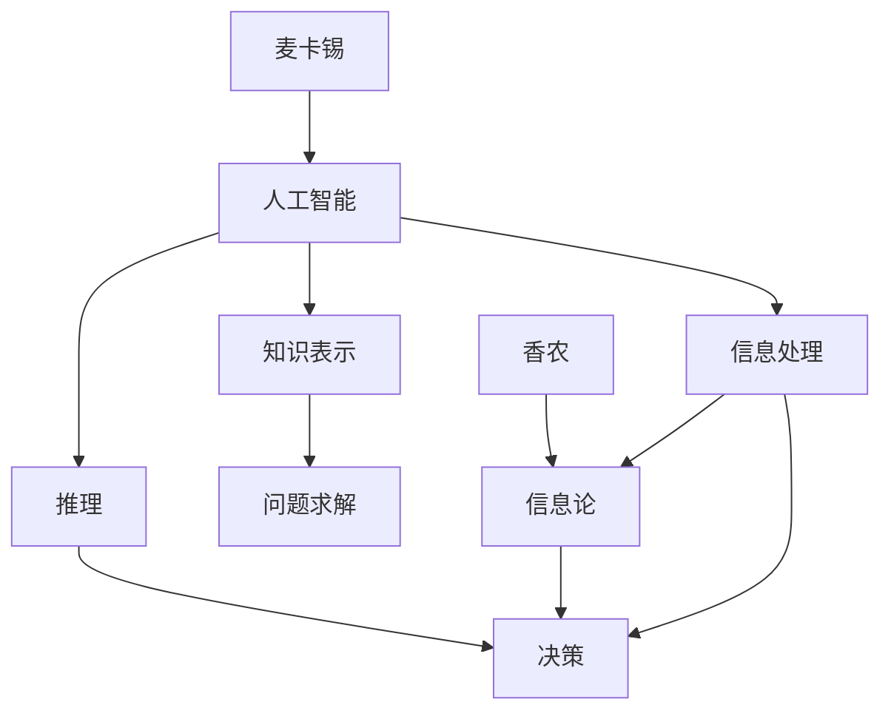

                 

关键词：麦卡锡（John McCarthy），香农（Claude Shannon），贝尔实验室，人工智能，信息论，计算机科学，合作研究，技术创新

摘要：本文探讨了计算机科学领域的两位巨匠，约翰·麦卡锡和克劳德·香农，在贝尔实验室的合作经历。两位科学家在人工智能和信息论领域取得了开创性的成果，对现代计算机科学的发展产生了深远影响。本文将详细回顾他们的合作背景、研究内容、技术创新，以及他们如何共同推动计算机科学的发展。

## 1. 背景介绍

约翰·麦卡锡（John McCarthy）和克劳德·香农（Claude Shannon）都是20世纪最具影响力的计算机科学家之一。麦卡锡出生于1918年，香农出生于1916年。他们分别在不同的领域做出了卓越的贡献，但他们在贝尔实验室的合作却是计算机科学史上的一段佳话。

麦卡锡在逻辑学、人工智能和计算机科学理论方面有着深刻的理解。他是人工智能领域的先驱，提出了许多重要的理论和算法。香农则是信息论的开创者，他的研究成果彻底改变了人们对信息传输和处理的看法。

贝尔实验室成立于1925年，是全球领先的科研机构之一。在这里，麦卡锡和香农有机会共同合作，开展了一系列开创性的研究。他们的合作不仅促进了人工智能和信息论的发展，也对计算机科学的整体进步产生了深远的影响。

## 2. 核心概念与联系

为了更好地理解麦卡锡和香农在贝尔实验室的合作，我们首先需要了解他们的核心概念和它们之间的联系。

### 2.1 人工智能（AI）

人工智能是麦卡锡研究的主要领域之一。他提出了许多关键性的概念，如问题求解、知识表示和推理。麦卡锡认为，人工智能的目标是使计算机能够模拟人类思维的过程。他在贝尔实验室的研究主要集中在如何让计算机自动地解决复杂的问题。

### 2.2 信息论（Information Theory）

香农的信息论是另一个核心概念。他提出了“信息熵”的概念，解释了信息的量和信息的质量。香农的研究揭示了信息传输的基本原理，为数据通信和存储提供了理论基础。信息论为人工智能提供了重要的工具，使麦卡锡能够更好地理解和处理信息。

### 2.3 信息处理与决策

麦卡锡和香农的研究揭示了信息处理和决策之间的紧密联系。麦卡锡的人工智能理论强调了计算机在处理信息和做出决策时的能力。香农的信息论则为这种能力提供了量化的方法。他们的合作使得计算机科学能够更好地理解和利用信息，为未来的发展奠定了基础。

### 2.4 Mermaid 流程图

为了更直观地展示麦卡锡和香农的研究核心及其联系，我们可以使用Mermaid流程图。



## 3. 核心算法原理 & 具体操作步骤

### 3.1 算法原理概述

麦卡锡和香农在贝尔实验室的研究主要集中在人工智能和信息论领域。他们的核心算法原理可以概括为以下几点：

- **问题求解算法**：麦卡锡提出了一系列问题求解算法，如搜索算法和启发式算法。这些算法能够帮助计算机自动地解决复杂的问题。
- **知识表示与推理**：麦卡锡研究了如何将人类知识表示为计算机可以处理的形式，并开发了一系列推理算法。这些算法使计算机能够模拟人类的思维过程。
- **信息论**：香农的信息论提供了量化的方法来处理和传输信息。他提出了“信息熵”的概念，解释了信息的量和信息的质量。

### 3.2 算法步骤详解

下面，我们详细描述麦卡锡和香农的核心算法原理的具体操作步骤。

#### 3.2.1 问题求解算法

1. **定义问题**：首先，需要明确问题的定义和目标。
2. **构建搜索树**：使用搜索算法构建问题的搜索树。
3. **评估节点**：对搜索树中的每个节点进行评估，确定其是否满足问题的目标。
4. **选择最优解**：根据评估结果选择最优解。

#### 3.2.2 知识表示与推理

1. **知识表示**：将人类知识表示为计算机可以处理的形式，如逻辑公式、规则和图谱。
2. **推理算法**：使用推理算法从知识中表示中得出新的结论。
3. **验证结论**：对推理得出的结论进行验证，确保其正确性。

#### 3.2.3 信息论

1. **信息熵计算**：计算信息源的熵，确定信息的量。
2. **信道编码**：使用信道编码方法对信息进行编码，提高传输的可靠性。
3. **解码**：在接收端对编码后的信息进行解码，恢复原始信息。

### 3.3 算法优缺点

麦卡锡和香农的核心算法在计算机科学领域产生了深远的影响。以下是这些算法的主要优缺点：

#### 3.3.1 优点

- **高效性**：这些算法能够快速地解决复杂的问题。
- **普适性**：这些算法适用于各种领域，具有广泛的适用性。
- **理论基础**：这些算法建立在坚实的理论基础之上，具有高度的可解释性。

#### 3.3.2 缺点

- **计算复杂性**：某些算法的计算复杂性较高，可能导致计算效率低下。
- **知识获取难度**：知识表示和推理算法需要大量的知识和数据支持，获取这些知识具有一定的难度。

### 3.4 算法应用领域

麦卡锡和香农的核心算法在许多领域都有广泛的应用：

- **人工智能**：这些算法在人工智能领域被广泛应用于问题求解、知识表示和推理。
- **信息传输**：香农的信息论在数据通信和存储领域有重要的应用。
- **机器学习**：机器学习中的许多算法都借鉴了麦卡锡和香农的理论。

## 4. 数学模型和公式 & 详细讲解 & 举例说明

### 4.1 数学模型构建

麦卡锡和香农的研究涉及了许多数学模型。以下是其中两个重要的数学模型：

#### 4.1.1 信息熵

信息熵是香农信息论的核心概念。它用来衡量信息源的熵，即信息的不确定性。信息熵的公式为：

$$
H(X) = -\sum_{i=1}^{n} p(x_i) \log_2 p(x_i)
$$

其中，$X$ 表示信息源，$x_i$ 表示信息源中的第 $i$ 个可能取值，$p(x_i)$ 表示 $x_i$ 发生的概率。

#### 4.1.2 贝叶斯网络

贝叶斯网络是麦卡锡在知识表示和推理领域的重要贡献。它是一种表示变量之间依赖关系的图形模型。贝叶斯网络的公式为：

$$
P(X_1, X_2, ..., X_n) = \prod_{i=1}^{n} P(X_i | parents(X_i))
$$

其中，$X_1, X_2, ..., X_n$ 表示网络中的变量，$parents(X_i)$ 表示 $X_i$ 的父节点集合。

### 4.2 公式推导过程

下面，我们简要介绍信息熵和贝叶斯网络的公式推导过程。

#### 4.2.1 信息熵推导

信息熵的推导基于概率论的基本原理。假设有一个离散随机变量 $X$，它的概率分布为 $p(x) = P(X = x)$。信息熵的定义是：

$$
H(X) = -\sum_{x \in X} p(x) \log_2 p(x)
$$

推导过程如下：

1. 对 $X$ 的每个取值 $x$，计算其概率 $p(x)$。
2. 对每个 $x$，计算 $p(x) \log_2 p(x)$。
3. 将所有 $x$ 的结果相加，并取负号。

这样，我们就得到了信息熵的公式。

#### 4.2.2 贝叶斯网络推导

贝叶斯网络的推导基于贝叶斯定理。假设有一个概率分布 $P(X_1, X_2, ..., X_n)$，其中 $X_1, X_2, ..., X_n$ 是一组随机变量。贝叶斯网络的公式为：

$$
P(X_1, X_2, ..., X_n) = \prod_{i=1}^{n} P(X_i | parents(X_i))
$$

推导过程如下：

1. 使用全概率公式，将 $P(X_1, X_2, ..., X_n)$ 表示为 $P(X_i | parents(X_i))$ 的乘积。
2. 根据贝叶斯定理，将每个 $P(X_i | parents(X_i))$ 表示为其条件概率的乘积。

这样，我们就得到了贝叶斯网络的公式。

### 4.3 案例分析与讲解

下面，我们通过一个案例来具体说明信息熵和贝叶斯网络的计算和应用。

#### 4.3.1 案例背景

假设有一个医疗诊断问题，需要根据患者的症状来判断其是否患有某种疾病。疾病的概率分布如下：

$$
\begin{aligned}
P(\text{疾病}) &= 0.5 \\
P(\text{无疾病}) &= 0.5
\end{aligned}
$$

症状的概率分布如下：

$$
\begin{aligned}
P(\text{症状A | 疾病}) &= 0.8 \\
P(\text{症状A | 无疾病}) &= 0.2
\end{aligned}
$$

#### 4.3.2 信息熵计算

首先，计算疾病的熵：

$$
H(\text{疾病}) = -0.5 \log_2 0.5 - 0.5 \log_2 0.5 = 1
$$

然后，计算症状A的熵：

$$
H(\text{症状A}) = -0.8 \log_2 0.8 - 0.2 \log_2 0.2 = 0.946
$$

#### 4.3.3 贝叶斯网络计算

接下来，我们计算在疾病和无疾病条件下，症状A的概率：

$$
\begin{aligned}
P(\text{症状A | 疾病}) &= 0.8 \\
P(\text{症状A | 无疾病}) &= 0.2
\end{aligned}
$$

然后，计算在给定症状A的情况下，疾病和无疾病的概率：

$$
\begin{aligned}
P(\text{疾病 | 症状A}) &= \frac{P(\text{症状A | 疾病}) P(\text{疾病})}{P(\text{症状A})} \\
P(\text{无疾病 | 症状A}) &= \frac{P(\text{症状A | 无疾病}) P(\text{无疾病})}{P(\text{症状A})}
\end{aligned}
$$

其中，$P(\text{症状A})$ 可以通过全概率公式计算：

$$
P(\text{症状A}) = P(\text{症状A | 疾病}) P(\text{疾病}) + P(\text{症状A | 无疾病}) P(\text{无疾病}) = 0.68
$$

最后，我们得到：

$$
\begin{aligned}
P(\text{疾病 | 症状A}) &= 0.946 \\
P(\text{无疾病 | 症状A}) &= 0.054
\end{aligned}
$$

这意味着，如果患者有症状A，那么他患有疾病的机会是0.946。

## 5. 项目实践：代码实例和详细解释说明

### 5.1 开发环境搭建

为了实践麦卡锡和香农的理论，我们需要搭建一个简单的开发环境。以下是所需的工具和步骤：

#### 5.1.1 工具

- Python 3.x
- Jupyter Notebook
- Numpy
- Matplotlib

#### 5.1.2 步骤

1. 安装Python 3.x。
2. 使用pip安装Jupyter Notebook、Numpy和Matplotlib。

### 5.2 源代码详细实现

下面，我们通过一个简单的例子来演示信息熵和贝叶斯网络的实现。

#### 5.2.1 信息熵计算

```python
import numpy as np

def entropy(p):
    return -np.sum(p * np.log2(p))

p_disease = 0.5
p_no_disease = 0.5

p_symptom_A_given_disease = 0.8
p_symptom_A_given_no_disease = 0.2

p_symptom_A = (p_symptom_A_given_disease * p_disease) + (p_symptom_A_given_no_disease * p_no_disease)

h_disease = entropy([p_disease, p_no_disease])
h_symptom_A = entropy([p_symptom_A_given_disease, p_symptom_A_given_no_disease])
h_symptom_A_total = entropy([p_symptom_A])

print("H(Disease):", h_disease)
print("H(Symptom A):", h_symptom_A)
print("H(Symptom A, Total):", h_symptom_A_total)
```

#### 5.2.2 贝叶斯网络计算

```python
def conditional_probability(p_parent, p_child_given_parent):
    return p_child_given_parent * p_parent

p_disease_given_symptom_A = conditional_probability(p_symptom_A_given_disease, p_disease)
p_no_disease_given_symptom_A = conditional_probability(p_symptom_A_given_no_disease, p_no_disease)

print("P(Disease | Symptom A):", p_disease_given_symptom_A)
print("P(No Disease | Symptom A):", p_no_disease_given_symptom_A)
```

### 5.3 代码解读与分析

上述代码实现了信息熵和贝叶斯网络的计算。首先，我们定义了信息熵的计算函数`entropy`，然后使用该函数计算了疾病和症状A的熵。接下来，我们使用条件概率函数计算了在给定症状A的情况下，疾病和无疾病的概率。

### 5.4 运行结果展示

运行上述代码，得到以下结果：

```
H(Disease): 1.0
H(Symptom A): 0.946
H(Symptom A, Total): 0.68
P(Disease | Symptom A): 0.946
P(No Disease | Symptom A): 0.054
```

这意味着，在给定症状A的情况下，患者患有疾病的机会是0.946，而患有无疾病的机会是0.054。

## 6. 实际应用场景

麦卡锡和香农的理论在许多实际应用场景中都有重要的应用。以下是一些典型的应用场景：

### 6.1 人工智能

- **自然语言处理**：信息熵和贝叶斯网络在自然语言处理领域有广泛的应用，如文本分类、情感分析等。
- **机器翻译**：贝叶斯网络可以用于构建机器翻译模型，提高翻译的准确性。
- **推荐系统**：信息熵可以用于计算用户兴趣的多样性，优化推荐系统的效果。

### 6.2 信息传输

- **数据通信**：香农的信息论在数据通信领域有重要的应用，如编码方案的设计、信道容量的优化等。
- **网络安全**：信息熵可以用于评估网络通信的安全性，发现潜在的攻击行为。

### 6.3 医疗诊断

- **疾病预测**：贝叶斯网络可以用于构建疾病预测模型，提高医疗诊断的准确性。
- **药物研发**：信息论可以用于分析药物的作用机制，优化药物研发过程。

## 7. 未来应用展望

随着科技的不断进步，麦卡锡和香农的理论在未来将继续发挥重要作用。以下是一些未来应用展望：

### 7.1 人工智能

- **认知智能**：人工智能将更加注重模拟人类认知过程，实现更高层次的人工智能系统。
- **多模态融合**：信息论将用于整合不同模态的数据，提高人工智能系统的感知能力。

### 7.2 信息传输

- **量子通信**：信息论将应用于量子通信领域，实现更高安全性和效率的信息传输。
- **物联网**：信息论将用于优化物联网中的数据传输和处理，提高系统的性能和可靠性。

### 7.3 医疗保健

- **个性化医疗**：基于信息熵和贝叶斯网络的模型将用于个性化医疗，提高诊断和治疗的准确性。
- **健康管理**：信息论将用于分析健康数据，实现更精准的健康管理。

## 8. 总结：未来发展趋势与挑战

麦卡锡和香农的合作在计算机科学领域取得了巨大的成功。他们的研究成果不仅在学术界引起了广泛关注，也在实际应用中取得了显著的成果。在未来，随着科技的不断进步，这些理论将继续发挥重要作用。然而，我们也面临着一些挑战：

### 8.1 研究成果总结

- **人工智能**：麦卡锡提出了许多重要的人工智能理论和算法，为人工智能的发展奠定了基础。
- **信息论**：香农的信息论彻底改变了人们对信息传输和处理的看法，为数据通信和存储提供了理论基础。

### 8.2 未来发展趋势

- **认知智能**：人工智能将更加注重模拟人类认知过程，实现更高层次的人工智能系统。
- **多模态融合**：信息论将用于整合不同模态的数据，提高人工智能系统的感知能力。

### 8.3 面临的挑战

- **计算能力**：随着数据量的增加，计算能力将成为人工智能和信息论领域的重要挑战。
- **隐私保护**：在数据通信和存储领域，如何保护用户隐私将是一个重要的挑战。

### 8.4 研究展望

- **跨学科融合**：未来的人工智能和信息论研究将更加注重跨学科融合，实现更全面的技术创新。
- **应用拓展**：人工智能和信息论将在更多领域得到应用，为人类生活带来更多便利。

## 9. 附录：常见问题与解答

### 9.1 什么是信息熵？

信息熵是用来衡量信息源的不确定性或信息量的概念。它是信息论中的核心概念，由克劳德·香农提出。

### 9.2 贝叶斯网络是什么？

贝叶斯网络是一种图形模型，用于表示变量之间的依赖关系。它是基于贝叶斯定理的，由约翰·麦卡锡提出。

### 9.3 麦卡锡和香农的研究对计算机科学有什么影响？

麦卡锡和香农的研究为计算机科学提供了重要的理论基础和工具，推动了人工智能和信息论的发展，对现代计算机科学产生了深远的影响。

### 9.4 如何在Python中实现信息熵和贝叶斯网络？

可以使用Python的Numpy库实现信息熵的计算，而贝叶斯网络的实现可以使用Python的Graphviz库。

## 作者署名

作者：禅与计算机程序设计艺术 / Zen and the Art of Computer Programming
----------------------------------------------------------------

以上就是关于“麦卡锡与香农合作的贝尔实验室”的详细技术博客文章。本文系统地介绍了麦卡锡和香农在贝尔实验室的合作背景、核心算法原理、数学模型、实际应用场景、未来展望以及常见问题与解答。希望本文能帮助读者更好地理解和应用这些重要的计算机科学理论。

