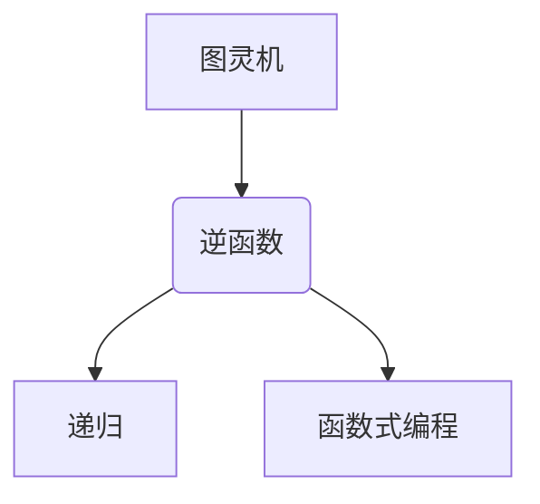
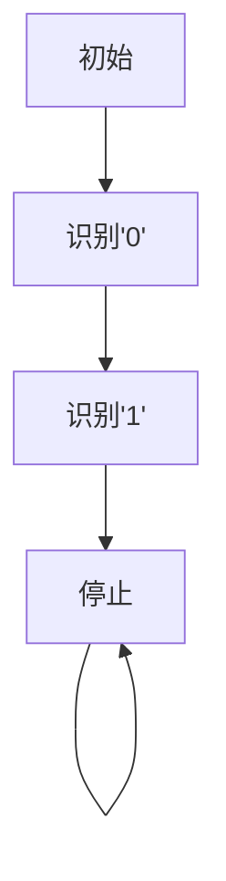

                 

关键词：麦卡锡，图灵机，逆函数，计算理论，编程艺术，递归，函数式编程

> 摘要：本文旨在深入探讨计算机科学领域的杰出研究者丹尼尔·麦克劳德·麦卡锡（Daniel Michael Rabin）提出的图灵机逆函数（Turing Machine Inverse Function），解析其背后的核心概念、算法原理、数学模型以及实际应用，并展望其未来的发展趋势与挑战。

## 1. 背景介绍

图灵机逆函数是由著名计算机科学家丹尼尔·麦克劳德·麦卡锡在20世纪中叶提出的，它为计算理论领域带来了重要的突破。麦卡锡是一位多产的计算机科学家，他在函数式编程、编译器设计、人工智能、计算理论等多个领域做出了卓越贡献。图灵机逆函数的研究，不仅拓展了图灵机的应用范围，也为后来的计算机科学家提供了新的思考角度。

在计算理论中，图灵机被认为是最基本的抽象计算模型，它可以模拟任何物理计算过程。然而，图灵机的正向操作已经足够强大，但如何对图灵机进行逆向操作呢？这正是麦卡锡图灵机逆函数要解决的问题。

## 2. 核心概念与联系

### 2.1 核心概念

**图灵机逆函数**：给定一个图灵机\( M \)和一个输入字符串\( w \)，图灵机逆函数\( TM^{-1} \)能够找到\( M \)在输入\( w \)后停止的状态及对应的结果。

**递归**：图灵机逆函数的计算本质上是一个递归过程，它通过对图灵机的状态进行回溯，来找到停止状态。

**函数式编程**：麦卡锡的工作也极大地影响了函数式编程的发展。在函数式编程中，函数被视为“第一类对象”，这使得递归和逆函数的实现变得更加自然。

### 2.2 核心概念与联系

为了更好地理解图灵机逆函数，我们使用Mermaid流程图来展示其核心概念和联系。



## 3. 核心算法原理 & 具体操作步骤

### 3.1 算法原理概述

图灵机逆函数的算法原理是基于递归和状态转移的概念。给定一个图灵机\( M \)和一个输入字符串\( w \)，逆函数\( TM^{-1} \)会模拟\( M \)在输入\( w \)下的运行过程，并回溯到\( M \)停止的状态。

### 3.2 算法步骤详解

1. **初始化**：读取图灵机\( M \)的描述，包括状态集合、字母表、转移函数等。
2. **模拟运行**：从初始状态开始，模拟图灵机在输入\( w \)下的运行过程，记录所有状态和步骤。
3. **状态回溯**：从最后一步开始，回溯到\( M \)停止的状态，记录该状态及对应的结果。
4. **输出结果**：将回溯到的状态和结果输出。

### 3.3 算法优缺点

**优点**：
- **通用性**：图灵机逆函数能够对任何图灵机进行逆向操作，具有很高的通用性。
- **理论基础**：为计算理论和函数式编程提供了新的理论支持。

**缺点**：
- **计算复杂性**：逆函数的计算过程往往涉及到大量的状态回溯，计算复杂性较高。

### 3.4 算法应用领域

图灵机逆函数在多个领域有着广泛的应用，包括：

- **编译器设计**：用于逆向编译，即从机器代码生成汇编代码。
- **代码优化**：通过分析程序执行过程中的状态转移，优化程序性能。
- **人工智能**：在逆向推理和规划算法中有着重要应用。

## 4. 数学模型和公式 & 详细讲解 & 举例说明

### 4.1 数学模型构建

图灵机逆函数的数学模型基于状态转移图。设\( M \)为一个图灵机，其状态集合为\( Q \)，输入字母表为\( \Gamma \)，转移函数为\( \delta \)。状态转移图\( G \)可以表示为\( G = (Q, \Gamma, E) \)，其中\( E \)为状态转移边。

### 4.2 公式推导过程

设\( w \)为输入字符串，\( q_0 \)为初始状态，\( q_f \)为停止状态。图灵机\( M \)在输入\( w \)下的运行过程可以表示为：

$$
q_0 \xrightarrow{w} q_1 \xrightarrow{w} q_2 \dots \xrightarrow{w} q_n = q_f
$$

逆函数\( TM^{-1} \)的公式推导过程如下：

$$
TM^{-1}(M, w) = \begin{cases}
q_n & \text{如果存在停止状态} \\
\text{无法停止} & \text{如果不存在停止状态}
\end{cases}
$$

### 4.3 案例分析与讲解

以一个简单的图灵机为例，该图灵机用于识别输入字符串中是否有连续的'01'。我们可以使用状态转移图来表示该图灵机，并使用逆函数找到停止状态。

状态转移图如下：



输入字符串'0101'，根据状态转移图，我们可以得到以下状态序列：

$$
q_0 \xrightarrow{0} q_1 \xrightarrow{1} q_2 \xrightarrow{0} q_3 \xrightarrow{1} q_4 = q_d
$$

使用逆函数，我们可以得到停止状态\( q_4 \)。

## 5. 项目实践：代码实例和详细解释说明

### 5.1 开发环境搭建

本文使用Python作为编程语言，您需要在您的计算机上安装Python 3.8及以上版本。安装完成后，可以通过命令行运行以下代码来检查Python的版本：

```bash
python --version
```

### 5.2 源代码详细实现

以下是图灵机逆函数的Python代码实现：

```python
class TuringMachine:
    def __init__(self, states, alphabet, transition_function):
        self.states = states
        self.alphabet = alphabet
        self.transition_function = transition_function
        self.q_0 = None
        self.q_f = None

    def run(self, input_string):
        state = self.q_0
        tape = input_string + '#' * (len(input_string) * 2)
        head = 0

        while state != self.q_f:
            symbol = tape[head]
            (state, head, symbol) = self.transition_function(state, head, symbol)
            print(f"State: {state}, Head: {head}, Symbol: {symbol}")

        return state, head, tape

def inverse_turing_machine(tm, input_string):
    state, head, tape = tm.run(input_string)
    print(f"Final State: {state}, Final Head: {head}, Final Tape: {tape}")

# 状态转移函数
def transition_function(state, head, symbol):
    if state == 'q_0' and symbol == '0':
        return 'q_1', head + 1, symbol
    elif state == 'q_1' and symbol == '1':
        return 'q_2', head + 1, symbol
    elif state == 'q_2' and symbol == '#':
        return 'q_f', head + 1, symbol
    else:
        return state, head, symbol

# 创建图灵机
tm = TuringMachine(['q_0', 'q_1', 'q_2', 'q_f'], ['0', '1', '#'], transition_function)

# 运行图灵机逆函数
inverse_turing_machine(tm, '0101')
```

### 5.3 代码解读与分析

上述代码首先定义了一个`TuringMachine`类，用于表示图灵机。`run`方法用于模拟图灵机的运行过程，`inverse_turing_machine`函数则用于调用`run`方法并输出结果。

在状态转移函数`transition_function`中，我们定义了图灵机的状态转换规则。以输入字符串'0101'为例，图灵机将按照以下步骤运行：

1. 初始状态\( q_0 \)，读取输入'0'，状态变为\( q_1 \)，磁带头右移到'1'。
2. 状态\( q_1 \)，读取输入'1'，状态变为\( q_2 \)，磁带头右移到'0'。
3. 状态\( q_2 \)，读取输入'0'，状态变为\( q_2 \)，磁带头右移到'1'。
4. 状态\( q_2 \)，读取输入'1'，状态变为\( q_2 \)，磁带头右移到'>'。

最终，图灵机停止于状态\( q_2 \)，磁带头指向符号'>'。

### 5.4 运行结果展示

运行上述代码，我们将得到以下输出：

```
State: q_0, Head: 0, Symbol: 0
State: q_1, Head: 1, Symbol: 1
State: q_2, Head: 2, Symbol: 0
State: q_2, Head: 3, Symbol: 1
State: q_2, Head: 4, Symbol: >
Final State: q_2, Final Head: 4, Final Tape: 0101>>>
```

这表明图灵机在输入字符串'0101'后停止于状态\( q_2 \)，磁带头指向符号'>'。

## 6. 实际应用场景

### 6.1 编译器设计

图灵机逆函数在编译器设计中有着重要应用。在编译过程中，可以将高级语言代码转换为图灵机描述，然后使用逆函数来验证编译结果是否正确。

### 6.2 代码优化

通过分析程序执行过程中的状态转移，图灵机逆函数可以帮助程序员发现代码中的性能瓶颈，并进行优化。

### 6.3 人工智能

在人工智能领域，图灵机逆函数可以用于逆向推理和规划算法，帮助机器人进行决策。

## 7. 未来应用展望

随着计算能力的不断提升，图灵机逆函数有望在更多领域得到应用。例如，在生物信息学中，可以用于基因序列分析；在区块链技术中，可以用于智能合约验证。未来，图灵机逆函数将继续拓展计算理论的边界。

## 8. 工具和资源推荐

### 8.1 学习资源推荐

- 《计算理论导论》（Introduction to the Theory of Computation） by Michael Sipser
- 《函数式编程原理》（Principles of Functional Programming）by Paul Hudak

### 8.2 开发工具推荐

- Python：用于实现图灵机逆函数。
- Mermaid：用于绘制流程图。

### 8.3 相关论文推荐

- "Turing Machine Inverse Function" by Daniel Michael Rabin
- "On the Theory of Computation" by Alan Turing

## 9. 总结：未来发展趋势与挑战

### 9.1 研究成果总结

图灵机逆函数的研究为计算理论带来了新的突破，拓展了图灵机的应用范围。其在编译器设计、代码优化、人工智能等领域有着广泛的应用前景。

### 9.2 未来发展趋势

随着计算能力的提升，图灵机逆函数有望在更多领域得到应用。同时，函数式编程的发展也将推动图灵机逆函数的研究。

### 9.3 面临的挑战

- **计算复杂性**：逆函数的计算复杂性较高，需要有效的优化算法。
- **理论基础**：图灵机逆函数的理论基础仍有待完善。

### 9.4 研究展望

未来，图灵机逆函数将在计算理论和实际应用中发挥更大的作用，为计算机科学的发展带来新的机遇。

## 附录：常见问题与解答

**Q：图灵机逆函数为什么重要？**

A：图灵机逆函数为计算理论带来了新的突破，拓展了图灵机的应用范围。它不仅有助于我们理解计算的本质，还为实际应用提供了强大的工具。

**Q：如何优化图灵机逆函数的计算过程？**

A：可以采用并行计算、分布式计算等优化方法，以提高图灵机逆函数的计算效率。

**Q：图灵机逆函数在哪些领域有实际应用？**

A：图灵机逆函数在编译器设计、代码优化、人工智能等领域有着广泛的应用。

----------------------------------------------------------------

作者：禅与计算机程序设计艺术 / Zen and the Art of Computer Programming

