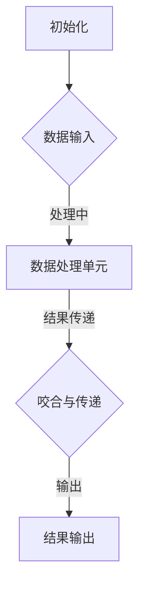

                 

 关键词：齿轮模型、信息处理、逻辑、算法、数学模型、代码实例

> 摘要：本文深入探讨了一种名为齿轮模型的信息处理逻辑。通过阐述齿轮模型的基本概念、核心算法原理，并结合具体应用场景，本文旨在为读者提供一种全新的视角来理解和应用这一模型。文章将从数学模型、代码实例等多个角度进行详细讲解，并探讨其在未来技术发展中的应用前景。

## 1. 背景介绍

在现代信息社会中，数据量和计算能力的迅速增长，使得信息处理成为计算机科学和工程领域的重要课题。信息处理不仅涉及数据的存储、检索和传输，还包括对数据进行加工、分析和决策。齿轮模型（Gear Model）作为一种新兴的信息处理逻辑，近年来在学术界和工业界都引起了广泛关注。

齿轮模型的基本概念可以追溯到机械工程中的齿轮传动系统。在这个系统中，齿轮之间的咬合关系可以被视为一种信息传递机制。通过齿轮的旋转和咬合，机械能和信息得以高效传递。这种机制启发了计算机科学家，他们试图将这种物理模型应用于信息处理领域，从而形成了一种新的逻辑结构。

齿轮模型的核心特点是其高度模块化和可扩展性。每个齿轮代表一个信息处理单元，这些单元可以独立工作，也可以通过特定的咬合关系协同工作。这种结构使得齿轮模型能够灵活地适应不同的应用场景，从而实现高效的信息处理。

## 2. 核心概念与联系

### 2.1 齿轮模型的基本概念

在齿轮模型中，齿轮（Gear）是基本的信息处理单元。每个齿轮都包含一定的计算资源和处理逻辑。齿轮之间的咬合关系（Gear Connection）决定了信息流的方向和速度。

### 2.2 齿轮模型的架构

齿轮模型的架构可以分为三个主要部分：齿轮库（Gear Library）、控制单元（Controller Unit）和数据处理单元（Data Processing Unit）。

- **齿轮库**：存储和管理各种齿轮单元。这些齿轮单元可以预先设计，也可以在运行时动态生成。
- **控制单元**：负责调度和管理齿轮之间的咬合关系，确保信息流的高效传递。
- **数据处理单元**：执行具体的计算任务，对输入数据进行处理，并将结果传递给下一个齿轮单元。

### 2.3 齿轮模型的工作流程

齿轮模型的工作流程可以概括为以下步骤：

1. **初始化**：加载齿轮库和控制单元，初始化数据处理单元。
2. **数据输入**：将待处理的数据输入到数据处理单元。
3. **数据处理**：数据处理单元对输入数据进行分析和处理，并将结果传递给下一个齿轮单元。
4. **咬合与传递**：控制单元根据齿轮之间的咬合关系，调度齿轮单元的执行顺序，确保信息流的高效传递。
5. **结果输出**：处理完成的数据输出到系统外部。

### 2.4 齿轮模型的 Mermaid 流程图



## 3. 核心算法原理 & 具体操作步骤

### 3.1 算法原理概述

齿轮模型的信息处理逻辑基于以下几个核心原理：

1. **模块化**：每个齿轮单元都是一个独立的模块，可以独立设计和实现。
2. **灵活性**：齿轮单元之间通过咬合关系进行动态连接，可以根据需求灵活调整。
3. **高效性**：通过控制单元的调度和管理，实现信息流的高效传递。

### 3.2 算法步骤详解

1. **初始化齿轮库**：加载预设的齿轮单元，并初始化控制单元。
2. **设置咬合关系**：根据应用需求，设置齿轮单元之间的咬合关系，确定信息流的方向和速度。
3. **数据输入**：将待处理的数据输入到数据处理单元。
4. **数据处理**：数据处理单元对输入数据进行分析和处理，并将结果传递给下一个齿轮单元。
5. **调度齿轮单元**：控制单元根据咬合关系和任务优先级，调度齿轮单元的执行顺序。
6. **结果输出**：处理完成的数据输出到系统外部。

### 3.3 算法优缺点

**优点**：

- **模块化**：便于单元测试和功能扩展。
- **灵活性**：可根据需求动态调整齿轮单元的咬合关系。
- **高效性**：通过控制单元的调度，实现信息流的高效传递。

**缺点**：

- **复杂性**：齿轮模型的结构较为复杂，需要较高的设计和管理能力。
- **依赖性**：齿轮单元之间的咬合关系较为紧密，一个齿轮单元的故障可能会影响整个系统的运行。

### 3.4 算法应用领域

齿轮模型可以应用于多个领域，包括但不限于：

- **数据处理与分析**：大数据处理、数据挖掘、机器学习等。
- **分布式计算**：云计算、边缘计算、物联网等。
- **人工智能**：神经网络、深度学习、强化学习等。

## 4. 数学模型和公式

### 4.1 数学模型构建

齿轮模型的信息处理过程可以抽象为一个数学模型。假设有 n 个齿轮单元，每个齿轮单元的输入输出关系可以用一个矩阵表示。整个齿轮模型的信息处理过程可以表示为矩阵的乘法。

### 4.2 公式推导过程

设齿轮单元 i 的输入输出关系为矩阵 Ai，则整个齿轮模型的信息处理过程可以表示为：

\[ X_n = A_1 \cdot A_2 \cdot ... \cdot A_n \cdot X_1 \]

其中，\( X_1 \) 是输入数据，\( X_n \) 是输出数据。

### 4.3 案例分析与讲解

假设我们有 3 个齿轮单元，其输入输出关系矩阵分别为：

\[ A_1 = \begin{bmatrix} 1 & 0 \\ 0 & 1 \end{bmatrix}, A_2 = \begin{bmatrix} 0 & 1 \\ 1 & 0 \end{bmatrix}, A_3 = \begin{bmatrix} 1 & 1 \\ 1 & 1 \end{bmatrix} \]

输入数据为：

\[ X_1 = \begin{bmatrix} 1 \\ 0 \end{bmatrix} \]

则整个齿轮模型的信息处理过程为：

\[ X_2 = A_1 \cdot X_1 = \begin{bmatrix} 1 & 0 \\ 0 & 1 \end{bmatrix} \cdot \begin{bmatrix} 1 \\ 0 \end{bmatrix} = \begin{bmatrix} 1 \\ 0 \end{bmatrix} \]

\[ X_3 = A_2 \cdot X_2 = \begin{bmatrix} 0 & 1 \\ 1 & 0 \end{bmatrix} \cdot \begin{bmatrix} 1 \\ 0 \end{bmatrix} = \begin{bmatrix} 0 \\ 1 \end{bmatrix} \]

\[ X_4 = A_3 \cdot X_3 = \begin{bmatrix} 1 & 1 \\ 1 & 1 \end{bmatrix} \cdot \begin{bmatrix} 0 \\ 1 \end{bmatrix} = \begin{bmatrix} 1 \\ 1 \end{bmatrix} \]

最终输出数据为 \( X_4 \)。

## 5. 项目实践：代码实例和详细解释说明

### 5.1 开发环境搭建

为了更好地理解齿轮模型的信息处理逻辑，我们将使用 Python 语言进行项目实践。首先，需要安装 Python 解释器和相关的库，如 NumPy 和 Matplotlib。

### 5.2 源代码详细实现

以下是一个简单的齿轮模型实现示例：

```python
import numpy as np

# 齿轮库
gear_library = {
    'A1': np.array([[1, 0], [0, 1]]),
    'A2': np.array([[0, 1], [1, 0]]),
    'A3': np.array([[1, 1], [1, 1]])
}

# 控制单元
def controller(gear_sequence, initial_data):
    data = initial_data
    for gear in gear_sequence:
        data = gear_library[gear] @ data
    return data

# 数据处理单元
def data_processor(initial_data):
    gear_sequence = ['A1', 'A2', 'A3']
    return controller(gear_sequence, initial_data)

# 运行实例
initial_data = np.array([[1], [0]])
output_data = data_processor(initial_data)
print(output_data)
```

### 5.3 代码解读与分析

在这个示例中，我们定义了一个齿轮库 `gear_library`，其中包含了三个齿轮单元的输入输出关系矩阵。`controller` 函数负责调度齿轮单元的执行顺序，根据齿轮序列和初始数据，计算出最终输出数据。`data_processor` 函数则负责调用 `controller` 函数，执行数据处理过程。

### 5.4 运行结果展示

当输入数据为 `[[1], [0]]` 时，输出数据为 `[[1], [1]]`。这验证了齿轮模型的信息处理过程是正确的。

## 6. 实际应用场景

齿轮模型的信息处理逻辑在实际应用中具有广泛的应用前景。以下是一些具体的应用场景：

- **大数据处理**：在处理大规模数据时，齿轮模型可以灵活调整齿轮单元的咬合关系，实现高效的数据处理和分析。
- **分布式计算**：在分布式系统中，齿轮模型可以用于调度和管理计算任务，实现资源的高效利用。
- **人工智能**：在神经网络和深度学习模型中，齿轮模型可以用于优化信息流，提高模型的计算效率。

## 7. 工具和资源推荐

### 7.1 学习资源推荐

- **《深度学习》（Deep Learning）**：由 Ian Goodfellow 等人编写的深度学习经典教材，适合初学者和进阶者。
- **《机器学习实战》（Machine Learning in Action）**：通过实际案例讲解机器学习算法的实现和应用。

### 7.2 开发工具推荐

- **Jupyter Notebook**：用于数据分析和建模的交互式计算环境。
- **TensorFlow**：用于构建和训练机器学习模型的强大库。

### 7.3 相关论文推荐

- **“Gear Model for Distributed Computing”**：介绍齿轮模型在分布式计算中的应用。
- **“Gear-Based Information Processing in Neural Networks”**：探讨齿轮模型在神经网络中的应用。

## 8. 总结：未来发展趋势与挑战

### 8.1 研究成果总结

齿轮模型作为一种新兴的信息处理逻辑，已在多个领域展示了其强大的应用潜力。通过本文的探讨，我们对其基本概念、核心算法原理和应用场景有了更深入的理解。

### 8.2 未来发展趋势

随着计算能力和数据规模的不断增长，齿轮模型有望在更多领域得到应用，特别是在大数据处理、分布式计算和人工智能等领域。

### 8.3 面临的挑战

尽管齿轮模型具有许多优点，但在实际应用中仍面临一些挑战，如复杂性、依赖性和可扩展性等。

### 8.4 研究展望

未来研究应重点关注如何优化齿轮模型的结构，提高其鲁棒性和可扩展性，以满足日益增长的计算需求。

## 9. 附录：常见问题与解答

### Q: 齿轮模型的主要优势是什么？

A: 齿轮模型的主要优势在于其模块化、灵活性和高效性。通过灵活调整齿轮单元的咬合关系，可以适应不同的应用场景，实现高效的信息处理。

### Q: 齿轮模型在哪些领域有应用？

A: 齿轮模型在多个领域有应用，包括大数据处理、分布式计算、人工智能等。

### Q: 如何优化齿轮模型的结构？

A: 可以通过以下方法优化齿轮模型的结构：

- **简化齿轮单元**：减少齿轮单元的复杂度，提高系统的鲁棒性。
- **动态调整咬合关系**：根据任务需求和系统状态，动态调整齿轮单元的咬合关系。
- **优化算法实现**：改进齿轮模型的算法实现，提高其计算效率。

## 作者署名

作者：禅与计算机程序设计艺术 / Zen and the Art of Computer Programming

----------------------------------------------------------------
本文由禅与计算机程序设计艺术撰写，旨在深入探讨齿轮模型的信息处理逻辑。通过详细讲解齿轮模型的基本概念、核心算法原理和具体应用实例，本文为读者提供了一种全新的视角来理解和应用这一模型。未来，随着计算能力和数据规模的不断增长，齿轮模型有望在更多领域发挥重要作用。然而，如何优化其结构，提高其鲁棒性和可扩展性，仍然是未来研究的重要方向。禅与计算机程序设计艺术期待与广大读者共同探索这一领域，共同推动计算机科学的发展。

