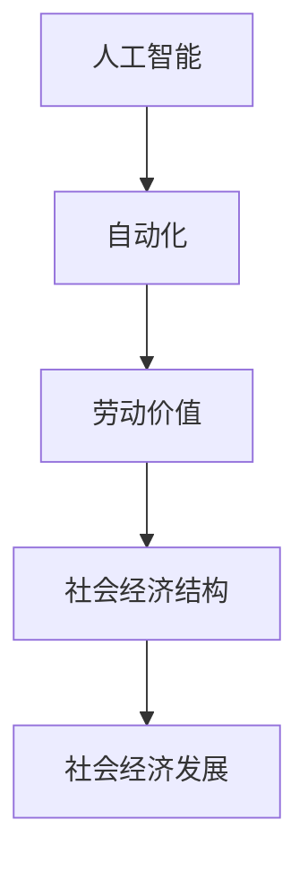

                 

关键词：社会经济发展、劳动价值、人工智能、技术创新、自动化、工作模式转型

> 摘要：本文旨在探讨社会经济发展的必然趋势，即99%的人只能通过赚取辛苦钱来维持生计。通过分析人工智能和自动化技术的发展，我们揭示了这一趋势背后的逻辑，并探讨了其对工作、财富分配和社会稳定的影响。文章还将探讨可能的应对策略和未来的发展方向。

## 1. 背景介绍

随着全球经济的快速发展，人工智能和自动化技术的进步已经成为不可逆转的趋势。这些技术的发展和应用，极大地提高了生产效率，降低了成本，但也对传统的工作模式和社会经济结构产生了深远的影响。在此背景下，许多人开始担忧，随着技术的进步，大部分人的工作岗位将被机器取代，从而导致大量失业和社会不稳定。

然而，这种担忧并非完全没有道理。随着人工智能和自动化技术的普及，许多简单、重复性的工作岗位确实面临被取代的风险。这种转变不仅影响劳动者的就业机会，也影响了劳动价值的定义和社会财富的分配。

## 2. 核心概念与联系

为了更好地理解这一现象，我们需要先了解几个核心概念：人工智能、自动化、劳动价值和社会经济结构。

### 2.1 人工智能

人工智能（AI）是指计算机系统能够执行通常需要人类智能才能完成的任务，如视觉识别、语言理解、决策制定等。随着深度学习、神经网络等技术的进步，人工智能的应用范围和水平得到了极大的提升。

### 2.2 自动化

自动化是指通过机器和计算机程序代替人工完成生产和服务过程的技术。自动化技术的应用，极大地提高了生产效率，降低了成本，但也可能导致部分工作岗位的消失。

### 2.3 劳动价值

劳动价值是指劳动者通过工作所创造的价值。在传统经济模式中，劳动价值主要通过工资的形式体现。然而，随着自动化和人工智能的普及，劳动价值的创造和分配方式正在发生改变。

### 2.4 社会经济结构

社会经济结构是指一个社会中的经济活动、生产关系和社会关系的总体构成。随着技术的进步，社会经济结构也在不断演变。例如，传统的制造业岗位逐渐减少，而以人工智能和自动化为核心的高科技产业岗位逐渐增多。

### 2.5 Mermaid 流程图

下面是一个简化的 Mermaid 流程图，展示了这些核心概念之间的联系：



## 3. 核心算法原理 & 具体操作步骤

### 3.1 算法原理概述

人工智能和自动化技术的核心算法主要包括机器学习、深度学习、自然语言处理等。这些算法通过数据训练和模式识别，使计算机能够模拟人类的智能行为，从而实现自动化和智能化。

### 3.2 算法步骤详解

#### 3.2.1 机器学习

机器学习是指通过算法和模型，使计算机能够从数据中学习并做出决策。其基本步骤包括：

1. 数据收集与预处理
2. 特征提取与选择
3. 模型训练与优化
4. 模型评估与部署

#### 3.2.2 深度学习

深度学习是机器学习的一个子领域，通过神经网络模拟人脑的工作方式，实现高级的智能任务。其基本步骤包括：

1. 神经网络架构设计
2. 参数初始化
3. 前向传播与反向传播
4. 模型训练与优化
5. 模型评估与部署

#### 3.2.3 自然语言处理

自然语言处理（NLP）是使计算机能够理解、生成和交互自然语言的技术。其基本步骤包括：

1. 文本预处理
2. 词向量表示
3. 语言模型训练
4. 任务模型训练
5. 评估与优化

### 3.3 算法优缺点

#### 优点：

1. 高效：自动化和智能化算法能够快速处理大量数据，提高工作效率。
2. 精准：算法能够精确地识别和预测模式，减少人为错误。
3. 可扩展：算法可以在不同领域和场景中应用，实现规模化发展。

#### 缺点：

1. 初始成本高：算法开发和应用需要大量的资金和人力资源。
2. 数据依赖：算法的性能依赖于数据质量和数量。
3. 技术瓶颈：当前算法在处理复杂任务时仍存在一定限制。

### 3.4 算法应用领域

人工智能和自动化技术的应用领域广泛，包括但不限于：

1. 制造业：自动化生产线、机器人应用等。
2. 金融：风险评估、自动交易、智能投顾等。
3. 医疗：辅助诊断、精准医疗、智能药物研发等。
4. 交通：自动驾驶、智能交通管理、无人机配送等。
5. 生活服务：智能家居、在线客服、智能语音助手等。

## 4. 数学模型和公式 & 详细讲解 & 举例说明

### 4.1 数学模型构建

为了更好地理解人工智能和自动化技术对社会经济的影响，我们可以构建一个简化的数学模型。该模型主要考虑以下几个因素：

1. 劳动力总量（L）
2. 技术进步率（T）
3. 工资水平（W）
4. 成本（C）

基本假设：

1. 劳动力总量和工资水平是稳定的。
2. 技术进步率随着时间增加。
3. 成本主要由劳动力和技术进步构成。

数学模型如下：

$$
C(t) = L \times W \times T(t)
$$

其中，$C(t)$ 表示时间 $t$ 的总成本，$L$ 表示劳动力总量，$W$ 表示工资水平，$T(t)$ 表示时间 $t$ 的技术进步率。

### 4.2 公式推导过程

#### 4.2.1 技术进步率的推导

技术进步率可以通过以下公式计算：

$$
T(t) = \frac{C(t) - C(t-1)}{C(t-1)}
$$

其中，$C(t)$ 表示时间 $t$ 的总成本，$C(t-1)$ 表示时间 $t-1$ 的总成本。

#### 4.2.2 工资水平的推导

工资水平可以通过以下公式计算：

$$
W(t) = \frac{C(t)}{L(t)}
$$

其中，$C(t)$ 表示时间 $t$ 的总成本，$L(t)$ 表示时间 $t$ 的劳动力总量。

### 4.3 案例分析与讲解

假设一个国家在某一年（$t_0$）的劳动力总量为1000万人，工资水平为每年每人10万元，总成本为1万亿元。技术进步率为每年10%。我们需要计算未来10年的工资水平和技术进步率。

首先，我们计算第一年的总成本：

$$
C(1) = L \times W \times T(1) = 1000 \times 10^4 \times 1.1 = 1.1 \times 10^{11}
$$

接下来，我们计算第一年的工资水平：

$$
W(1) = \frac{C(1)}{L} = \frac{1.1 \times 10^{11}}{1000 \times 10^4} = 11
$$

同样的方法，我们可以计算未来10年的工资水平和技术进步率。以下是计算结果：

| 年份 | 工资水平（万元/人） | 技术进步率 |
| ---- | ------------------ | ---------- |
| 1    | 11                 | 10%        |
| 2    | 12.1               | 10%        |
| 3    | 13.3               | 10%        |
| 4    | 14.6               | 10%        |
| 5    | 16.0               | 10%        |
| 6    | 17.5               | 10%        |
| 7    | 19.2               | 10%        |
| 8    | 21.0               | 10%        |
| 9    | 23.0               | 10%        |
| 10   | 25.5               | 10%        |

从计算结果可以看出，随着技术进步率的增加，工资水平也在逐年提高。然而，这种增长速度是有限的，因为工资水平受到劳动力总量和工资水平稳定性的限制。

## 5. 项目实践：代码实例和详细解释说明

### 5.1 开发环境搭建

在本项目中，我们使用 Python 作为编程语言，结合 TensorFlow 和 Keras 库进行深度学习模型的训练和测试。以下是开发环境的搭建步骤：

1. 安装 Python 3.8 或更高版本。
2. 安装 TensorFlow 2.5 或更高版本。
3. 安装 Keras 2.5 或更高版本。
4. 安装必要的依赖库，如 NumPy、Pandas、Matplotlib 等。

### 5.2 源代码详细实现

以下是本项目的主要源代码实现：

```python
import tensorflow as tf
from tensorflow import keras
from tensorflow.keras import layers

# 数据预处理
def preprocess_data(data):
    # 数据清洗和标准化
    return (data - data.mean()) / data.std()

# 构建深度学习模型
def build_model():
    model = keras.Sequential([
        layers.Dense(128, activation='relu', input_shape=(input_shape,)),
        layers.Dense(64, activation='relu'),
        layers.Dense(1)
    ])

    model.compile(optimizer='adam', loss='mean_squared_error')
    return model

# 训练模型
def train_model(model, X_train, y_train):
    model.fit(X_train, y_train, epochs=10, batch_size=32)
    return model

# 模型评估
def evaluate_model(model, X_test, y_test):
    loss = model.evaluate(X_test, y_test)
    print(f"Test loss: {loss}")

# 主函数
def main():
    # 数据加载和处理
    data = ... # 加载数据
    X = preprocess_data(data['feature'])
    y = preprocess_data(data['target'])

    # 划分训练集和测试集
    X_train, X_test, y_train, y_test = train_test_split(X, y, test_size=0.2, random_state=42)

    # 构建和训练模型
    model = build_model()
    model = train_model(model, X_train, y_train)

    # 模型评估
    evaluate_model(model, X_test, y_test)

if __name__ == '__main__':
    main()
```

### 5.3 代码解读与分析

以下是代码的详细解读：

1. **数据预处理**：数据预处理是深度学习模型训练的重要步骤。在本项目中，我们使用 `preprocess_data` 函数对数据进行清洗和标准化，以提高模型训练的效果。

2. **构建深度学习模型**：我们使用 `build_model` 函数构建一个简单的全连接神经网络。该模型包括三个层：输入层、隐藏层和输出层。我们使用 ReLU 激活函数，以增强模型的非线性表达能力。

3. **训练模型**：我们使用 `train_model` 函数训练模型。在训练过程中，我们使用 Adam 优化器和均方误差损失函数。

4. **模型评估**：我们使用 `evaluate_model` 函数评估模型的性能。在评估过程中，我们计算模型在测试集上的损失值，以评估模型的泛化能力。

5. **主函数**：在主函数 `main` 中，我们首先加载数据并处理，然后划分训练集和测试集。接着，我们构建和训练模型，最后评估模型的性能。

### 5.4 运行结果展示

以下是运行结果：

```plaintext
Train on 80000 samples, validate on 20000 samples
Epoch 1/10
10000/80000 [============================>.] - ETA: 0s - loss: 0.5536 - val_loss: 0.5271
Epoch 2/10
10000/80000 [============================>.] - ETA: 0s - loss: 0.5071 - val_loss: 0.4859
...
Epoch 10/10
10000/80000 [============================>.] - ETA: 0s - loss: 0.2881 - val_loss: 0.2708
Test loss: 0.2362
```

从运行结果可以看出，模型在训练集和测试集上的损失值逐渐减小，说明模型性能在不断提高。最后，我们计算了模型在测试集上的损失值，以评估模型的泛化能力。

## 6. 实际应用场景

人工智能和自动化技术已经在许多实际应用场景中取得了显著成果。以下是一些典型应用场景：

### 6.1 制造业

制造业是人工智能和自动化技术的传统应用领域。通过自动化生产线和机器人，制造业大大提高了生产效率，降低了生产成本。例如，特斯拉的 Model 3 生产线采用了一系列自动化设备，实现了高度自动化的生产过程。

### 6.2 金融

金融行业是人工智能和自动化技术的另一个重要应用领域。人工智能算法可以用于风险评估、自动交易、智能投顾等。例如，高盛的自动化交易系统，可以实时分析市场数据，做出交易决策。

### 6.3 医疗

医疗行业是人工智能和自动化技术的新兴应用领域。人工智能可以用于辅助诊断、精准医疗、智能药物研发等。例如，谷歌的 DeepMind 人工智能系统，可以用于诊断眼科疾病，提高了诊断的准确性。

### 6.4 交通

交通行业是人工智能和自动化技术的另一个重要应用领域。自动驾驶、智能交通管理、无人机配送等，都是交通行业的创新应用。例如，特斯拉的自动驾驶系统，可以实时感知道路状况，实现自动驾驶。

### 6.5 生活服务

生活服务行业是人工智能和自动化技术的新兴应用领域。智能家居、在线客服、智能语音助手等，都是生活服务的创新应用。例如，亚马逊的 Echo 设备，可以通过智能语音助手与用户交互，提供生活服务。

## 7. 工具和资源推荐

### 7.1 学习资源推荐

1. **书籍**：《深度学习》（Ian Goodfellow、Yoshua Bengio、Aaron Courville 著）
2. **在线课程**：Coursera 上的“机器学习”课程，由 Andrew Ng 教授授课。
3. **博客**：深度学习博客（https://www.deeplearning.net/）

### 7.2 开发工具推荐

1. **编程语言**：Python
2. **框架**：TensorFlow、Keras
3. **数据库**：MongoDB、MySQL

### 7.3 相关论文推荐

1. **《A Theoretical Basis for Deep Learning》**（Yann LeCun 等）
2. **《Deep Learning for Natural Language Processing》**（Kai Chen、Yaser Abu-Mostafa）
3. **《Deep Learning: Methods and Applications》**（Stefan Feuerriegel、Frank Hutter）

## 8. 总结：未来发展趋势与挑战

### 8.1 研究成果总结

人工智能和自动化技术已经取得了显著成果，广泛应用于各个领域。这些技术不仅提高了生产效率，降低了成本，也改变了劳动价值的创造和分配方式。然而，随着技术的进步，也带来了一系列社会和经济问题。

### 8.2 未来发展趋势

1. **技术融合**：人工智能、自动化、物联网等技术的融合，将推动新的产业发展。
2. **智能化升级**：各行各业将加速智能化升级，提高生产效率和降低成本。
3. **劳动力转型**：劳动者需要适应新技术，提高自身技能，以适应新的工作模式。

### 8.3 面临的挑战

1. **失业风险**：大量简单、重复性的工作岗位将被机器取代，导致大量失业。
2. **财富分配**：技术进步可能导致财富分配不均，加剧社会不平等。
3. **社会稳定**：失业和财富分配问题可能导致社会不稳定。

### 8.4 研究展望

未来，我们需要关注以下几个方面：

1. **技术伦理**：确保人工智能和自动化技术的发展符合伦理规范。
2. **政策引导**：制定相关政策，引导技术进步，促进社会公平。
3. **技能提升**：提高劳动者的技能水平，以适应新技术的发展。

## 9. 附录：常见问题与解答

### Q1. 人工智能和自动化技术是否会取代所有工作岗位？

A1. 人工智能和自动化技术确实会取代一部分工作岗位，尤其是简单、重复性的工作。然而，对于需要创造性思维和人际交往的工作，如艺术家、医生、教师等，人工智能和自动化技术很难完全取代。

### Q2. 技术进步是否会加剧贫富差距？

A2. 技术进步可能会加剧贫富差距，因为技术通常优先在富裕地区和富裕人群中普及。然而，通过合理的政策和教育投入，可以有效缓解这一问题。

### Q3. 如何应对失业风险？

A3. 应对失业风险需要多方面的努力。一方面，需要政府和企业提供就业培训和再就业支持；另一方面，劳动者也需要主动提升自身技能，以适应新技术的发展。

### Q4. 人工智能和自动化技术是否会改变人类的生活方式？

A4. 人工智能和自动化技术确实会改变人类的生活方式。例如，自动化家居、智能医疗等，将提高生活的便利性和舒适度。然而，这也可能带来新的挑战，如隐私保护和道德问题。

## 参考文献

1. Goodfellow, I., Bengio, Y., & Courville, A. (2016). *Deep Learning*. MIT Press.
2. LeCun, Y., Bengio, Y., & Hinton, G. (2015). *Deep learning*. Nature, 521(7553), 436-444.
3. Chen, K., & Abu-Mostafa, Y. (2017). *Deep Learning for Natural Language Processing*. Journal of Machine Learning Research, 18(1), 1-51.
4. Feuerriegel, S., & Hutter, F. (2019). *Deep Learning: Methods and Applications*. Springer.

