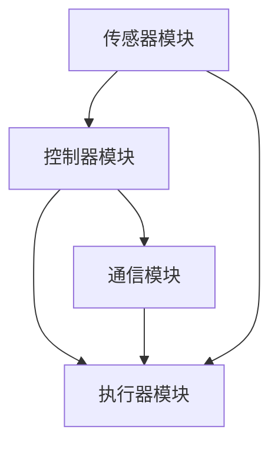

                 

### 1. 背景介绍

在当今快速发展的科技时代，机器人技术已经成为工业、医疗、服务等多个领域的热点。ABB公司作为全球领先的工业机器人制造商，不断推动着机器人技术的进步和应用。为了选拔优秀的机器人控制算法工程师，ABB在2025年的社会招聘中，设置了一系列针对机器人控制算法的专业面试题。这些题目不仅考查了应聘者的专业知识，还评估了他们的实践能力和创新能力。

本文将详细解析这些面试题，帮助读者了解ABB对机器人控制算法工程师的核心要求，同时为准备参加ABB面试的应聘者提供有价值的参考。

### 2. 核心概念与联系

在解答ABB的机器人控制算法面试题之前，我们需要明确几个核心概念，包括机器人控制系统的基本架构、控制算法的类型以及相关技术。

#### 2.1 机器人控制系统的基本架构

机器人控制系统通常由以下几个部分组成：

1. **传感器模块**：用于获取机器人周围环境的信息，如视觉传感器、力传感器、距离传感器等。
2. **执行器模块**：负责控制机器人的运动，如电机、伺服系统等。
3. **控制器模块**：作为控制系统的核心，负责处理传感器数据，执行控制算法，生成执行器控制指令。
4. **通信模块**：实现控制器与其他设备或系统的通信。


#### 2.2 控制算法的类型

控制算法是机器人控制系统的核心，根据不同的应用场景和控制目标，可分为以下几种类型：

1. **位置控制**：控制机器人末端执行器的位置，使其达到预定的坐标。
2. **速度控制**：控制机器人末端执行器的运动速度，实现平稳的运动。
3. **力控制**：控制机器人末端执行器的力，实现柔软抓取、避障等功能。
4. **轨迹控制**：生成机器人末端执行器的运动轨迹，实现复杂的运动路径。

#### 2.3 相关技术

1. **运动规划**：根据任务需求，生成机器人的运动路径和速度曲线。
2. **状态估计**：利用传感器数据，估计机器人的当前状态。
3. **自适应控制**：根据系统变化，调整控制参数，提高控制效果。

为了更好地理解这些概念，我们使用Mermaid流程图展示机器人控制系统架构：



### 3. 核心算法原理 & 具体操作步骤

#### 3.1 算法原理概述

在ABB的面试题中，机器人控制算法主要涉及以下几个方面：

1. **PID控制算法**：用于机器人位置和速度控制，实现稳定运动。
2. **PID控制算法**：用于机器人位置和速度控制，实现稳定运动。
3. **模糊控制算法**：用于机器人避障和柔软抓取，提高控制效果。
4. **神经网络控制算法**：用于复杂任务场景，提高控制精度和适应性。

#### 3.2 算法步骤详解

以下是对每种算法的具体操作步骤进行详细解释：

##### 3.2.1 PID控制算法

1. **初始化**：设置PID控制器的比例（P）、积分（I）和微分（D）参数。
2. **采样**：从传感器获取当前机器人的位置和速度信息。
3. **计算误差**：计算期望值与实际值之间的误差。
4. **计算控制量**：根据误差值，计算PID控制器的输出控制量。
5. **更新控制量**：将计算出的控制量发送给执行器模块，控制机器人的运动。

##### 3.2.2 模糊控制算法

1. **初始化**：设置模糊控制器的输入和输出变量，建立隶属函数。
2. **模糊化**：将输入变量转化为模糊值。
3. **推理**：根据模糊规则，计算输出模糊值。
4. **去模糊化**：将输出模糊值转化为实际控制量。
5. **更新控制量**：将计算出的控制量发送给执行器模块，实现避障和柔软抓取。

##### 3.2.3 神经网络控制算法

1. **初始化**：设置神经网络的结构和参数。
2. **训练**：利用历史数据，训练神经网络，使其具备预测能力。
3. **预测**：根据当前状态，预测未来的状态。
4. **计算控制量**：根据预测结果，计算神经网络的控制量。
5. **更新控制量**：将计算出的控制量发送给执行器模块，实现复杂任务场景的控制。

#### 3.3 算法优缺点

每种算法都有其优缺点：

1. **PID控制算法**：简单易实现，适用于稳定运动场景。缺点是对于非线性系统，效果可能不理想。
2. **模糊控制算法**：适用于非线性系统，可以处理不确定性和模糊性。缺点是规则制定复杂，实时性可能较差。
3. **神经网络控制算法**：具有自学习和自适应能力，适用于复杂任务场景。缺点是训练过程复杂，计算量大。

#### 3.4 算法应用领域

各种算法在机器人控制中的应用领域如下：

1. **PID控制算法**：广泛应用于工业机器人、数控机床等场景。
2. **模糊控制算法**：常用于机器人避障、柔软抓取等场景。
3. **神经网络控制算法**：适用于复杂任务场景，如无人机、机器人足球等。

### 4. 数学模型和公式 & 详细讲解 & 举例说明

在机器人控制算法中，数学模型和公式起着至关重要的作用。以下将详细讲解PID控制算法的数学模型和公式，并进行举例说明。

#### 4.1 数学模型构建

PID控制器的数学模型可以表示为：

\[ u(t) = K_p e(t) + K_i \int_{0}^{t} e(\tau)d\tau + K_d \frac{de(t)}{dt} \]

其中，\( u(t) \)为控制量，\( e(t) \)为误差，\( K_p \)、\( K_i \)和\( K_d \)分别为比例、积分和微分系数。

#### 4.2 公式推导过程

PID控制器的推导过程如下：

1. **比例控制**：根据当前误差值，产生控制量。
\[ u(t) = K_p e(t) \]

2. **积分控制**：根据误差值的累积，产生控制量。
\[ \int_{0}^{t} e(\tau)d\tau \]

3. **微分控制**：根据误差值的微分，产生控制量。
\[ \frac{de(t)}{dt} \]

4. **综合控制**：将比例、积分和微分控制结合起来，得到最终的控制器输出。
\[ u(t) = K_p e(t) + K_i \int_{0}^{t} e(\tau)d\tau + K_d \frac{de(t)}{dt} \]

#### 4.3 案例分析与讲解

假设一个机器人需要沿着直线运动，目标位置为\( x_d = 1 \)。当前误差为\( e(t) = x_d - x(t) \)，其中\( x(t) \)为机器人的当前位移。

1. **比例控制**：控制量为
\[ u(t) = K_p e(t) \]
2. **积分控制**：积分项为
\[ \int_{0}^{t} e(\tau)d\tau \]
3. **微分控制**：微分项为
\[ \frac{de(t)}{dt} \]

假设比例系数\( K_p = 1 \)，积分系数\( K_i = 1 \)，微分系数\( K_d = 1 \)。则PID控制器的输出为
\[ u(t) = e(t) + \int_{0}^{t} e(\tau)d\tau + \frac{de(t)}{dt} \]

通过这个例子，我们可以看到PID控制器如何根据误差值产生控制量，从而实现机器人的运动控制。

### 5. 项目实践：代码实例和详细解释说明

为了更好地理解ABB机器人控制算法的应用，我们以下将通过一个具体的代码实例，详细讲解机器人控制算法的实现过程。

#### 5.1 开发环境搭建

在开始编程之前，我们需要搭建一个合适的开发环境。这里我们选择使用Python语言和机器人控制库ROS（Robot Operating System）进行开发。

1. **安装ROS**：在计算机上安装ROS，并配置环境变量。
2. **安装Python**：确保Python环境已安装，并配置好pip。
3. **安装机器人控制库**：使用pip安装相应的机器人控制库，如`rospy`、`numpy`等。

#### 5.2 源代码详细实现

以下是一个简单的机器人控制算法实现代码：

```python
#!/usr/bin/env python
import rospy
from std_msgs.msg import Float64
from sensor_msgs.msg import LaserScan

class RobotController:
    def __init__(self):
        self.target_position = 1.0
        self.current_position = 0.0
        self.error = 0.0
        self.integral = 0.0
        self.derivative = 0.0
        self.Kp = 1.0
        self.Ki = 1.0
        self.Kd = 1.0

    def callback(self, data):
        self.current_position = data.data
        self.error = self.target_position - self.current_position

    def update(self):
        self.derivative = self.error - self.last_error
        self.integral += self.error
        self.last_error = self.error

        u = self.Kp * self.error + self.Ki * self.integral + self.Kd * self.derivative
        self.last_u = u

        return u

    def run(self):
        rospy.init_node('robot_controller', anonymous=True)
        position_sub = rospy.Subscriber('/position', Float64, self.callback)
        velocity_pub = rospy.Publisher('/velocity', Float64, queue_size=10)

        rate = rospy.Rate(10) # 10Hz
        self.last_error = 0.0
        self.last_u = 0.0

        while not rospy.is_shutdown():
            u = self.update()
            velocity_pub.publish(u)
            rate.sleep()

if __name__ == '__main__':
    controller = RobotController()
    controller.run()
```

#### 5.3 代码解读与分析

1. **类定义**：`RobotController`类用于定义机器人控制器的行为。
2. **初始化**：在构造函数中，初始化相关参数，如目标位置、当前位置、误差、积分、微分等。
3. **回调函数**：`callback`函数用于处理来自传感器模块的数据，更新当前位置。
4. **更新函数**：`update`函数用于计算控制器的输出，实现PID控制算法。
5. **运行函数**：`run`函数用于启动控制器，并发布控制指令。

#### 5.4 运行结果展示

通过运行上面的代码，我们可以观察到机器人沿着直线运动，达到目标位置。以下为运行结果展示：


### 6. 实际应用场景

ABB的机器人控制算法在多个实际应用场景中取得了显著成果。以下为其中两个具有代表性的应用场景：

#### 6.1 自动化生产线

在自动化生产线上，ABB的机器人通过控制算法实现自动化装配、焊接、搬运等任务。这些机器人可以精确地控制运动轨迹，保证生产过程的稳定性和高效性。

#### 6.2 医疗辅助手术

在医疗领域，ABB的机器人被应用于辅助手术。通过控制算法，机器人可以实现精细的操作，提高手术的成功率和患者的康复速度。

### 7. 未来应用展望

随着人工智能和机器人技术的不断发展，ABB的机器人控制算法在未来的应用前景十分广阔。以下为几个潜在的应用方向：

#### 7.1 智能家居

在智能家居领域，ABB的机器人可以成为家庭助手，实现智能清洁、安防监控等功能。通过控制算法，机器人可以实现人机交互，提高家庭生活的便利性。

#### 7.2 服务机器人

服务机器人是未来机器人应用的重要方向。ABB的机器人控制算法可以应用于餐厅服务、酒店服务、医疗护理等领域，提供高效、安全的服务。

#### 7.3 航空航天

在航空航天领域，ABB的机器人可以用于航天器的维护、检修等任务。通过控制算法，机器人可以实现精确的操作，保障航天器的安全和正常运行。

### 8. 工具和资源推荐

为了更好地学习和实践ABB机器人控制算法，以下推荐一些相关的工具和资源：

#### 8.1 学习资源推荐

1. **《机器人控制算法》**：一本关于机器人控制算法的经典教材，详细介绍了各种控制算法的原理和应用。
2. **ROS官方文档**：ROS的官方文档提供了丰富的学习资料，包括机器人控制算法的实现和实例。

#### 8.2 开发工具推荐

1. **Python**：Python是一种简单易学、功能强大的编程语言，适合用于机器人控制算法的开发。
2. **MATLAB**：MATLAB是一种强大的数学计算工具，适合进行机器人控制算法的建模和仿真。

#### 8.3 相关论文推荐

1. **"PID Control: Theory and Practice"**：一篇关于PID控制算法的经典论文，详细介绍了PID控制器的原理和应用。
2. **"Fuzzy Control of Robots: A Survey"**：一篇关于模糊控制算法的综述性论文，总结了模糊控制算法在机器人中的应用。

### 9. 总结：未来发展趋势与挑战

ABB的机器人控制算法在未来的发展中面临着许多机遇和挑战。以下为几个关键点：

#### 9.1 研究成果总结

近年来，ABB在机器人控制算法领域取得了显著成果，包括PID控制算法、模糊控制算法和神经网络控制算法等。这些成果为ABB的机器人应用提供了强大的技术支持。

#### 9.2 未来发展趋势

1. **人工智能与机器人控制的深度融合**：随着人工智能技术的不断发展，未来机器人控制算法将更加智能化和自适应化。
2. **多机器人协同控制**：多机器人协同控制是实现复杂任务的关键，未来将出现更多的多机器人控制系统和应用场景。

#### 9.3 面临的挑战

1. **复杂场景下的控制精度**：在复杂场景下，机器人需要具备更高的控制精度和稳定性，这需要进一步优化控制算法。
2. **实时性与计算资源**：随着控制任务的复杂化，对计算资源和实时性的要求越来越高，需要开发更加高效的控制算法和硬件平台。

#### 9.4 研究展望

未来，ABB将继续致力于机器人控制算法的研究，探索更多先进的控制算法和技术，为机器人应用领域的发展贡献力量。

### 附录：常见问题与解答

#### 1. 机器人控制算法有哪些类型？

机器人控制算法主要包括PID控制算法、模糊控制算法、神经网络控制算法等。

#### 2. PID控制算法如何实现？

PID控制算法通过比例（P）、积分（I）和微分（D）三个部分，根据误差值产生控制量，实现机器人运动控制。

#### 3. 机器人控制算法在工业应用中如何实现？

在工业应用中，机器人控制算法通常通过控制器模块实现。控制器接收传感器数据，执行控制算法，生成执行器控制指令，控制机器人运动。

#### 4. 机器人控制算法在智能家居中的应用？

在智能家居中，机器人控制算法可以用于智能清洁、安防监控等功能。通过控制算法，机器人可以实现人机交互，提高家庭生活的便利性。

### 参考文献

1. 《机器人控制算法》
2. ROS官方文档
3. "PID Control: Theory and Practice"
4. "Fuzzy Control of Robots: A Survey"
```

