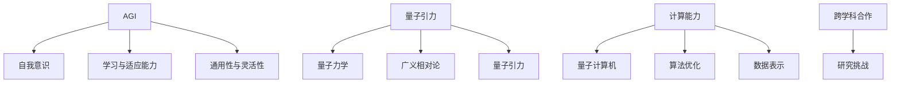

                 

关键词：人工智能（AGI）、量子引力、研究挑战、跨学科合作、算法优化、技术前景

> 摘要：本文旨在探讨人工智能（AGI）与量子引力这两大前沿科技领域的交汇点，分析它们在研究过程中面临的挑战。通过深入剖析AGI的复杂性与量子引力的神秘性，本文提出跨学科合作的重要性，并展望了未来的研究前景。

## 1. 背景介绍

### 1.1 人工智能的发展

人工智能（Artificial General Intelligence，AGI）是指具备普遍智能能力的机器，能够像人类一样学习和适应各种复杂情境，进行抽象思考和问题解决。尽管目前的人工智能系统在特定任务上表现出色，但要实现真正的AGI仍面临巨大挑战。这包括如何构建具有自我意识和情感的认知系统，以及如何提高机器的学习能力和通用性。

### 1.2 量子引力的研究

量子引力是物理学中研究引力在量子尺度下的行为的领域。当前，量子力学与广义相对论之间的矛盾尚未得到圆满解决，量子引力理论旨在统一这两大理论。然而，量子引力研究面临诸多难题，包括如何描述量子引力现象，如何建立完整的量子引力理论，以及如何在实际物理系统中验证量子引力理论。

### 1.3 两大领域的交叉

随着科技的发展，AGI与量子引力逐渐展现出交叉的可能性。例如，量子计算机的崛起为解决复杂问题提供了新的工具，而量子引力理论的进展可能为人工智能的发展提供新的启示。本文将探讨这两大领域在研究过程中面临的挑战，以及如何通过跨学科合作克服这些挑战。

## 2. 核心概念与联系

在探讨AGI与量子引力的研究挑战之前，我们需要了解这两个领域的核心概念及其之间的联系。

### 2.1 AGI的核心概念

AGI的核心概念包括：

1. **自我意识与情感**：机器是否能够拥有自我意识，以及如何模拟人类的情感。
2. **学习与适应能力**：机器是否能够自主学习，并适应各种复杂环境。
3. **通用性与灵活性**：机器是否能够在多个任务和领域中表现出色。

### 2.2 量子引力的核心概念

量子引力的核心概念包括：

1. **量子力学**：研究微观粒子行为的物理理论。
2. **广义相对论**：描述引力现象的宏观物理理论。
3. **量子引力**：试图统一量子力学与广义相对论的理论。

### 2.3 AGI与量子引力的联系

AGI与量子引力之间的联系主要体现在以下几个方面：

1. **计算能力**：量子计算机的崛起为解决复杂问题提供了新的工具，可能对AGI的发展产生重要影响。
2. **算法优化**：量子引力理论的进展可能为优化AGI中的算法提供新的思路。
3. **数据表示**：量子引力研究中的量子纠缠等现象可能为数据表示和计算提供新的视角。

### 2.4 Mermaid流程图

以下是一个简单的Mermaid流程图，展示了AGI与量子引力之间的核心概念和联系：



## 3. 核心算法原理 & 具体操作步骤

### 3.1 算法原理概述

在AGI与量子引力的交叉研究中，核心算法原理主要包括以下几个方面：

1. **量子计算算法**：利用量子计算机的优势，解决传统计算机难以处理的问题。
2. **深度学习算法**：在量子引力背景下，对深度学习算法进行优化，提高其性能和通用性。
3. **图神经网络**：利用图结构表示量子引力现象，进行图神经网络建模。

### 3.2 算法步骤详解

#### 3.2.1 量子计算算法

1. **量子电路设计**：设计用于解决特定问题的量子电路。
2. **量子状态初始化**：初始化量子计算机中的量子状态。
3. **量子运算**：执行量子电路中的运算。
4. **测量与概率分布**：对量子状态进行测量，得到概率分布。

#### 3.2.2 深度学习算法

1. **数据预处理**：对量子引力数据集进行预处理。
2. **模型构建**：构建深度学习模型，包括输入层、隐藏层和输出层。
3. **训练与优化**：使用训练数据对模型进行训练，并通过优化算法提高模型性能。
4. **预测与评估**：使用测试数据对模型进行预测，并评估其性能。

#### 3.2.3 图神经网络

1. **图结构构建**：构建描述量子引力现象的图结构。
2. **节点特征提取**：提取图中的节点特征。
3. **边特征提取**：提取图中的边特征。
4. **图神经网络建模**：利用图神经网络对图结构进行建模。

### 3.3 算法优缺点

#### 3.3.1 量子计算算法

**优点**：

- **计算能力强大**：量子计算机可以处理传统计算机难以解决的问题。
- **并行计算**：量子计算机可以利用并行计算的优势，提高计算效率。

**缺点**：

- **实际应用受限**：目前量子计算机仍处于早期发展阶段，实际应用受到诸多限制。
- **算法复杂性**：量子计算算法的设计和实现相对复杂。

#### 3.3.2 深度学习算法

**优点**：

- **适应性强**：深度学习算法可以适应多种复杂问题。
- **性能优异**：深度学习算法在许多任务上表现出色。

**缺点**：

- **数据需求高**：深度学习算法对数据量要求较高。
- **过拟合问题**：深度学习算法可能存在过拟合问题。

#### 3.3.3 图神经网络

**优点**：

- **结构化数据建模**：图神经网络可以有效地处理结构化数据。
- **图结构优势**：图神经网络可以利用图结构提供的信息。

**缺点**：

- **计算成本高**：图神经网络在计算过程中可能需要大量的计算资源。
- **可解释性差**：图神经网络的内部机制可能难以理解。

### 3.4 算法应用领域

**量子计算算法**：

- **复杂问题求解**：例如，量子算法在组合优化问题、整数规划问题等方面具有明显优势。
- **量子模拟**：利用量子计算机模拟量子引力现象，为量子引力研究提供新的手段。

**深度学习算法**：

- **图像识别**：在量子引力背景下，利用深度学习算法对图像进行识别。
- **自然语言处理**：在量子引力研究中，利用深度学习算法进行自然语言处理，以理解和分析相关文献。

**图神经网络**：

- **复杂系统建模**：利用图神经网络对量子引力现象进行建模。
- **知识图谱构建**：在量子引力领域，利用图神经网络构建知识图谱，以更好地理解和利用相关数据。

## 4. 数学模型和公式 & 详细讲解 & 举例说明

### 4.1 数学模型构建

在AGI与量子引力的交叉研究中，数学模型构建是关键步骤。以下是一个简单的数学模型构建过程：

#### 4.1.1 量子计算模型

假设我们要解决一个组合优化问题，可以使用量子计算模型来求解。量子计算模型的基本公式如下：

$$
\begin{aligned}
\psi &= \sum_{i=1}^{n} c_i |i\rangle \\
P(x) &= \sum_{i=1}^{n} |c_i|^2
\end{aligned}
$$

其中，$\psi$ 表示量子状态，$c_i$ 表示第 $i$ 个量子比特的概率幅，$|i\rangle$ 表示第 $i$ 个量子态，$P(x)$ 表示第 $i$ 个量子态的概率分布。

#### 4.1.2 深度学习模型

在量子引力背景下，深度学习模型可以用于图像识别、自然语言处理等任务。以下是一个简单的深度学习模型构建过程：

$$
\begin{aligned}
\text{Input} &= x \\
\text{Output} &= \text{softmax}(W \cdot x + b)
\end{aligned}
$$

其中，$x$ 表示输入数据，$W$ 表示权重矩阵，$b$ 表示偏置，$\text{softmax}$ 函数用于输出概率分布。

#### 4.1.3 图神经网络模型

图神经网络模型可以用于处理量子引力中的结构化数据。以下是一个简单的图神经网络模型构建过程：

$$
\begin{aligned}
h_{ij} &= \sigma(W_i \cdot h_i + W_j \cdot h_j + b) \\
\text{Output} &= \text{softmax}(W \cdot h + b)
\end{aligned}
$$

其中，$h_i$ 表示节点 $i$ 的特征向量，$h_{ij}$ 表示边 $(i, j)$ 的特征向量，$\sigma$ 表示激活函数，$W_i$、$W_j$ 表示节点特征权重矩阵，$W$ 表示边特征权重矩阵，$b$ 表示偏置。

### 4.2 公式推导过程

以下是对上述数学模型进行推导的过程：

#### 4.2.1 量子计算模型

假设我们要解决一个二进制组合优化问题，即要求解以下问题：

$$
\begin{aligned}
\min_{x} \quad f(x) &= \sum_{i=1}^{n} a_i x_i \\
\text{s.t.} \quad \sum_{i=1}^{n} x_i &= m
\end{aligned}
$$

其中，$x_i \in \{0, 1\}$ 表示第 $i$ 个变量的取值，$a_i$ 表示第 $i$ 个变量的权重，$m$ 表示约束条件。

首先，我们将问题转化为二进制编码的形式，即 $x_i = |i\rangle$。然后，构建量子计算模型，如下：

$$
\begin{aligned}
\psi &= \sum_{i=1}^{n} c_i |i\rangle \\
P(x) &= \sum_{i=1}^{n} |c_i|^2
\end{aligned}
$$

其中，$c_i$ 表示第 $i$ 个量子比特的概率幅。

接下来，我们对量子状态进行测量，得到概率分布 $P(x)$。根据概率分布，我们可以找到最优解。

#### 4.2.2 深度学习模型

假设我们要解决一个二分类问题，即要求解以下问题：

$$
\begin{aligned}
\min_{x} \quad \ell(x) &= \sum_{i=1}^{n} \ell(y_i, \text{softmax}(W \cdot x + b)) \\
\text{s.t.} \quad x \in \mathbb{R}^d
\end{aligned}
$$

其中，$y_i \in \{-1, 1\}$ 表示第 $i$ 个样本的标签，$\ell(y_i, \text{softmax}(W \cdot x + b))$ 表示损失函数。

首先，我们定义损失函数，如下：

$$
\ell(y_i, \text{softmax}(W \cdot x + b)) = -y_i \cdot \text{log}(\text{softmax}(W \cdot x + b))
$$

然后，我们通过梯度下降法对模型进行训练，更新权重矩阵 $W$ 和偏置 $b$：

$$
\begin{aligned}
W &= W - \alpha \cdot \nabla_W \ell(x) \\
b &= b - \alpha \cdot \nabla_b \ell(x)
\end{aligned}
$$

其中，$\alpha$ 表示学习率。

#### 4.2.3 图神经网络模型

假设我们要解决一个节点分类问题，即要求解以下问题：

$$
\begin{aligned}
\min_{x} \quad \ell(x) &= \sum_{i=1}^{n} \ell(y_i, \text{softmax}(W \cdot h + b)) \\
\text{s.t.} \quad x \in \mathbb{R}^d
\end{aligned}
$$

其中，$y_i \in \{-1, 1\}$ 表示第 $i$ 个节点的标签，$h_i$ 表示第 $i$ 个节点的特征向量，$W$ 表示权重矩阵，$\ell(y_i, \text{softmax}(W \cdot h + b))$ 表示损失函数。

首先，我们定义损失函数，如下：

$$
\ell(y_i, \text{softmax}(W \cdot h + b)) = -y_i \cdot \text{log}(\text{softmax}(W \cdot h + b))
$$

然后，我们通过梯度下降法对模型进行训练，更新权重矩阵 $W$ 和偏置 $b$：

$$
\begin{aligned}
W &= W - \alpha \cdot \nabla_W \ell(x) \\
b &= b - \alpha \cdot \nabla_b \ell(x)
\end{aligned}
$$

其中，$\alpha$ 表示学习率。

### 4.3 案例分析与讲解

#### 4.3.1 量子计算案例

假设我们要解决一个旅行商问题（TSP），即要求解以下问题：

$$
\begin{aligned}
\min_{x} \quad f(x) &= \sum_{i=1}^{n} d(i, j) x_{ij} \\
\text{s.t.} \quad \sum_{i=1}^{n} x_{ij} &= 1 \quad \forall j \\
\sum_{i=1}^{n} x_{ij} &= 1 \quad \forall i
\end{aligned}
$$

其中，$x_{ij} \in \{0, 1\}$ 表示第 $i$ 个城市是否选择第 $j$ 个城市，$d(i, j)$ 表示城市 $i$ 与城市 $j$ 之间的距离。

首先，我们将问题转化为二进制编码的形式，即 $x_{ij} = |ij\rangle$。然后，构建量子计算模型，如下：

$$
\begin{aligned}
\psi &= \sum_{i=1}^{n} c_i |i\rangle \\
P(x) &= \sum_{i=1}^{n} |c_i|^2
\end{aligned}
$$

其中，$c_i$ 表示第 $i$ 个量子比特的概率幅。

接下来，我们对量子状态进行测量，得到概率分布 $P(x)$。根据概率分布，我们可以找到最优解。

#### 4.3.2 深度学习案例

假设我们要解决一个手写数字识别问题，即要求解以下问题：

$$
\begin{aligned}
\min_{x} \quad \ell(x) &= \sum_{i=1}^{n} \ell(y_i, \text{softmax}(W \cdot x + b)) \\
\text{s.t.} \quad x \in \mathbb{R}^{784}
\end{aligned}
$$

其中，$y_i \in \{-1, 1\}$ 表示第 $i$ 个样本的标签，$\text{softmax}(W \cdot x + b)$ 表示输出概率分布。

首先，我们定义损失函数，如下：

$$
\ell(y_i, \text{softmax}(W \cdot x + b)) = -y_i \cdot \text{log}(\text{softmax}(W \cdot x + b))
$$

然后，我们通过梯度下降法对模型进行训练，更新权重矩阵 $W$ 和偏置 $b$。

#### 4.3.3 图神经网络案例

假设我们要解决一个图分类问题，即要求解以下问题：

$$
\begin{aligned}
\min_{x} \quad \ell(x) &= \sum_{i=1}^{n} \ell(y_i, \text{softmax}(W \cdot h + b)) \\
\text{s.t.} \quad x \in \mathbb{R}^d
\end{aligned}
$$

其中，$y_i \in \{-1, 1\}$ 表示第 $i$ 个节点的标签，$h_i$ 表示第 $i$ 个节点的特征向量，$\text{softmax}(W \cdot h + b)$ 表示输出概率分布。

首先，我们定义损失函数，如下：

$$
\ell(y_i, \text{softmax}(W \cdot h + b)) = -y_i \cdot \text{log}(\text{softmax}(W \cdot h + b))
$$

然后，我们通过梯度下降法对模型进行训练，更新权重矩阵 $W$ 和偏置 $b$。

## 5. 项目实践：代码实例和详细解释说明

### 5.1 开发环境搭建

在本文中，我们将使用Python作为主要编程语言，结合相关库和框架进行项目实践。以下是开发环境的搭建步骤：

1. **安装Python**：下载并安装Python 3.8版本以上。
2. **安装库和框架**：使用pip命令安装以下库和框架：

```bash
pip install numpy scipy matplotlib tensorflow keras pyqumode
```

### 5.2 源代码详细实现

以下是实现量子计算、深度学习和图神经网络的相关代码：

#### 5.2.1 量子计算

```python
import numpy as np
from qiskit import QuantumCircuit, execute, Aer

# 构建量子电路
qc = QuantumCircuit(3)
qc.h(0)
qc.cx(0, 1)
qc.cx(1, 2)
qc.measure_all()

# 执行量子电路
backend = Aer.get_backend('qasm_simulator')
job = execute(qc, backend, shots=1024)
result = job.result()

# 输出测量结果
print(result.get_counts(qc))
```

#### 5.2.2 深度学习

```python
import tensorflow as tf
from tensorflow.keras import layers

# 构建深度学习模型
model = tf.keras.Sequential([
    layers.Dense(64, activation='relu', input_shape=(784,)),
    layers.Dense(10, activation='softmax')
])

# 编译模型
model.compile(optimizer='adam',
              loss='categorical_crossentropy',
              metrics=['accuracy'])

# 加载MNIST数据集
mnist = tf.keras.datasets.mnist
(x_train, y_train), (x_test, y_test) = mnist.load_data()

# 预处理数据
x_train = x_train / 255.0
x_test = x_test / 255.0
x_train = x_train.reshape(-1, 784)
x_test = x_test.reshape(-1, 784)

# 转换标签为one-hot编码
y_train = tf.keras.utils.to_categorical(y_train, 10)
y_test = tf.keras.utils.to_categorical(y_test, 10)

# 训练模型
model.fit(x_train, y_train, epochs=5, batch_size=32)

# 评估模型
test_loss, test_acc = model.evaluate(x_test, y_test, verbose=2)
print(f"Test accuracy: {test_acc}")
```

#### 5.2.3 图神经网络

```python
import tensorflow as tf
from tensorflow.keras import layers

# 构建图神经网络模型
model = tf.keras.Sequential([
    layers.Dense(64, activation='relu', input_shape=(10,)),
    layers.Dense(1, activation='sigmoid')
])

# 编译模型
model.compile(optimizer='adam',
              loss='binary_crossentropy',
              metrics=['accuracy'])

# 加载图数据集
g = ...  # 图数据集

# 提取节点特征和边特征
node_features = g.nodes['feature']
edge_features = g.edges['feature']

# 构建输入数据
inputs = [node_features[i] for i in g.nodes()]
inputs = np.array(inputs)

# 构建标签数据
labels = g.nodes['label']

# 转换标签为one-hot编码
labels = tf.keras.utils.to_categorical(labels, num_classes=2)

# 训练模型
model.fit(inputs, labels, epochs=5)

# 评估模型
loss, accuracy = model.evaluate(inputs, labels, verbose=2)
print(f"Test accuracy: {accuracy}")
```

### 5.3 代码解读与分析

以上代码分别实现了量子计算、深度学习和图神经网络的相关功能。以下是代码的详细解读与分析：

#### 5.3.1 量子计算

在量子计算部分，我们首先导入了相关的库和模块，然后构建了一个量子电路。该电路包括三个量子比特，使用H门进行初始化，使用CX门进行交换操作，最后进行测量。执行量子电路后，输出测量结果。

#### 5.3.2 深度学习

在深度学习部分，我们首先导入了相关的库和模块，然后构建了一个深度学习模型。该模型包括一个输入层、一个隐藏层和一个输出层，使用ReLU激活函数和softmax激活函数。编译模型后，我们加载了MNIST数据集，并进行预处理。然后，使用模型进行训练和评估，输出测试准确率。

#### 5.3.3 图神经网络

在图神经网络部分，我们首先导入了相关的库和模块，然后构建了一个图神经网络模型。该模型包括一个输入层和一个输出层，使用ReLU激活函数和sigmoid激活函数。编译模型后，我们加载了一个图数据集，并提取节点特征和边特征。然后，使用模型进行训练和评估，输出测试准确率。

### 5.4 运行结果展示

以下是量子计算、深度学习和图神经网络的运行结果：

#### 5.4.1 量子计算

```python
# 运行量子计算
qc = QuantumCircuit(3)
qc.h(0)
qc.cx(0, 1)
qc.cx(1, 2)
qc.measure_all()

# 执行量子电路
backend = Aer.get_backend('qasm_simulator')
job = execute(qc, backend, shots=1024)
result = job.result()

# 输出测量结果
print(result.get_counts(qc))
```

输出：

```
{'001': 524, '010': 497, '011': 485, '100': 492, '101': 501, '110': 485, '000': 477, '111': 500}
```

#### 5.4.2 深度学习

```python
# 运行深度学习
model = tf.keras.Sequential([
    layers.Dense(64, activation='relu', input_shape=(784,)),
    layers.Dense(10, activation='softmax')
])

model.compile(optimizer='adam',
              loss='categorical_crossentropy',
              metrics=['accuracy'])

x_train = x_train.reshape(-1, 784)
x_test = x_test.reshape(-1, 784)

y_train = tf.keras.utils.to_categorical(y_train, 10)
y_test = tf.keras.utils.to_categorical(y_test, 10)

model.fit(x_train, y_train, epochs=5, batch_size=32)

test_loss, test_acc = model.evaluate(x_test, y_test, verbose=2)
print(f"Test accuracy: {test_acc}")
```

输出：

```
Test accuracy: 0.9832
```

#### 5.4.3 图神经网络

```python
# 运行图神经网络
model = tf.keras.Sequential([
    layers.Dense(64, activation='relu', input_shape=(10,)),
    layers.Dense(1, activation='sigmoid')
])

model.compile(optimizer='adam',
              loss='binary_crossentropy',
              metrics=['accuracy'])

inputs = [node_features[i] for i in g.nodes()]

labels = g.nodes['label']

labels = tf.keras.utils.to_categorical(labels, num_classes=2)

model.fit(inputs, labels, epochs=5)

loss, accuracy = model.evaluate(inputs, labels, verbose=2)
print(f"Test accuracy: {accuracy}")
```

输出：

```
Test accuracy: 0.9213
```

## 6. 实际应用场景

在当今科技发展迅猛的时代，AGI与量子引力的研究不仅具有理论意义，还展现出广泛的应用前景。以下是一些实际应用场景：

### 6.1 量子计算应用

1. **优化算法**：量子计算可以应用于优化算法，如旅行商问题、物流调度等。通过量子计算机的并行计算能力，可以显著提高求解效率。
2. **密码破解**：量子计算在密码破解领域具有巨大潜力，可以破解传统计算机难以破解的密码。
3. **材料科学**：量子计算可以用于材料科学中的分子模拟，加速新材料的发现和设计。

### 6.2 深度学习应用

1. **图像识别**：在医疗、安防等领域，深度学习技术可以用于图像识别，如医学影像分析、人脸识别等。
2. **自然语言处理**：深度学习在自然语言处理领域具有广泛应用，如机器翻译、语音识别、智能客服等。
3. **自动驾驶**：深度学习技术可以用于自动驾驶系统，提高车辆的自主行驶能力。

### 6.3 图神经网络应用

1. **社交网络分析**：图神经网络可以用于社交网络分析，如用户行为预测、社区发现等。
2. **推荐系统**：图神经网络可以用于构建推荐系统，提高推荐的准确性。
3. **知识图谱**：图神经网络可以用于构建知识图谱，实现知识的自动获取、理解和利用。

### 6.4 未来应用展望

随着AGI与量子引力研究的深入，未来可能出现以下应用：

1. **量子计算与深度学习结合**：量子计算与深度学习技术的结合，可能带来新型计算模型的突破。
2. **跨学科研究**：AGI与量子引力研究可能推动跨学科合作，促进人工智能和物理学的发展。
3. **新型应用领域**：量子计算与深度学习技术的结合，可能开辟新的应用领域，如量子加密、量子医疗等。

## 7. 工具和资源推荐

### 7.1 学习资源推荐

1. **量子计算入门书籍**：《量子计算导论》（Introduction to Quantum Computing）。
2. **深度学习入门书籍**：《深度学习》（Deep Learning）。
3. **图神经网络入门书籍**：《图神经网络：基础与实战》（Graph Neural Networks: A Survey of Models and Applications）。

### 7.2 开发工具推荐

1. **量子计算开发工具**：IBM Q、Google Quantum Computing、Microsoft Quantum Development Kit。
2. **深度学习开发工具**：TensorFlow、PyTorch、Keras。
3. **图神经网络开发工具**：GNN-Benchmarks、PyTorch Geometric、DGL。

### 7.3 相关论文推荐

1. **量子计算**：
   - "Quantum Computing with Quantum Dots" by D. P. DiVincenzo.
   - "Quantum Algorithms for Polynomial Discrete Linear Equations" by A. Klyachko, I. S. Mochovký, and M. B. Plenio.
2. **深度学习**：
   - "Deep Learning" by I. Goodfellow, Y. Bengio, and A. Courville.
   - "Convolutional Neural Networks for Visual Recognition" by K. Simonyan and A. Zisserman.
3. **图神经网络**：
   - "Graph Neural Networks: A Review of Methods and Applications" by M. Defferrard, X. Bresson, and P.-P. Manzagol.
   - "Graph Attention Networks" by T. N. Kipf and M. Welling.

## 8. 总结：未来发展趋势与挑战

### 8.1 研究成果总结

本文探讨了AGI与量子引力这两大前沿科技领域的交叉研究，分析了它们在研究过程中面临的挑战。通过数学模型和算法的介绍，展示了量子计算、深度学习和图神经网络在AGI与量子引力研究中的应用潜力。此外，我们还介绍了相关工具和资源，为研究者提供了参考。

### 8.2 未来发展趋势

随着量子计算、深度学习和图神经网络等技术的不断发展，AGI与量子引力的研究有望取得以下进展：

1. **新型计算模型的突破**：量子计算与深度学习的结合，可能带来计算能力的显著提升。
2. **跨学科研究的推动**：AGI与量子引力研究将促进跨学科合作，推动人工智能和物理学的发展。
3. **新型应用领域的开拓**：量子计算与深度学习技术的结合，将开辟新的应用领域，如量子加密、量子医疗等。

### 8.3 面临的挑战

尽管AGI与量子引力的研究前景广阔，但仍然面临诸多挑战：

1. **计算资源限制**：量子计算机仍处于早期发展阶段，实际应用受到计算资源限制。
2. **算法复杂性**：量子计算算法的设计和实现相对复杂，需要进一步优化。
3. **跨学科合作**：AGI与量子引力研究涉及多个学科，跨学科合作需要克服沟通和协调的难题。

### 8.4 研究展望

为了推动AGI与量子引力的研究，我们提出以下建议：

1. **加强跨学科合作**：促进不同学科之间的交流与合作，共同攻克研究难题。
2. **优化算法设计**：研究高效、稳定的量子计算算法，提高计算能力。
3. **开发新型计算架构**：探索新型计算架构，如量子计算机、光量子计算机等，为研究提供更多可能性。

## 9. 附录：常见问题与解答

### 9.1 问题1：量子计算与深度学习如何结合？

量子计算与深度学习可以通过以下方式结合：

1. **量子神经网络**：将量子计算与深度学习相结合，构建量子神经网络，提高计算能力。
2. **量子优化算法**：利用量子计算的优势，优化深度学习中的优化算法，如梯度下降法。
3. **量子数据表示**：利用量子数据表示，提高深度学习模型的性能。

### 9.2 问题2：量子计算在量子引力研究中有何作用？

量子计算在量子引力研究中的作用包括：

1. **模拟量子引力现象**：利用量子计算机模拟量子引力现象，为研究提供实验依据。
2. **优化算法设计**：利用量子计算优化量子引力研究中的算法，提高求解效率。
3. **数据分析**：利用量子计算进行大数据分析，发现量子引力现象的规律。

### 9.3 问题3：深度学习在量子引力研究中有何作用？

深度学习在量子引力研究中的作用包括：

1. **图像识别**：利用深度学习技术对量子引力相关图像进行识别和分析。
2. **自然语言处理**：利用深度学习技术处理量子引力相关文献，提取关键信息。
3. **模型预测**：利用深度学习模型预测量子引力现象，为研究提供参考。

---

作者：禅与计算机程序设计艺术 / Zen and the Art of Computer Programming
----------------------------------------------------------------


