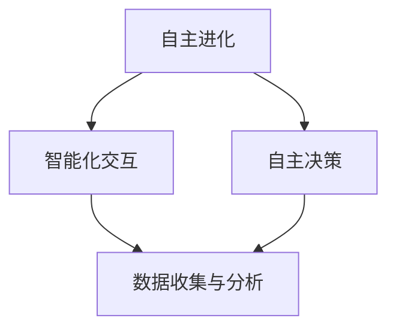

                 

关键词：AI 2.0、基础设施、建设、挑战、机遇

> 摘要：本文深入探讨了AI 2.0时代基础设施建设的现状与挑战，阐述了AI 2.0的定义、核心概念与联系，并详细介绍了核心算法原理与数学模型。同时，通过实际项目实践与未来应用展望，分析基础设施建设对AI 2.0时代的重要性与面临的挑战，为AI 2.0基础设施的发展提供有价值的见解。

## 1. 背景介绍

人工智能（AI）作为21世纪最具变革性的技术之一，已经深刻地影响了社会的各个领域。从最初的规则基础系统，到基于统计学习的机器学习，再到如今的深度学习，人工智能的技术演进经历了多个阶段。如今，AI 2.0时代已经来临，其核心特征是AI系统的自我进化能力、智能化交互、以及自主决策能力。

### AI 2.0的定义

AI 2.0，也称为下一代人工智能，是相对于传统AI（通常被称为AI 1.0）的新阶段。AI 1.0主要依赖于人类专家提供的规则和算法，而AI 2.0则通过自我学习和自我优化，实现了更高级别的智能。AI 2.0不仅能够处理复杂数据，还能够自动发现数据中的模式和规律，并基于这些模式进行决策。

### AI 2.0的核心概念与联系

AI 2.0的核心概念包括：

1. **自主进化**：AI系统能够在运行过程中不断学习和进化，提高自身的性能和智能水平。
2. **智能化交互**：AI系统能够通过自然语言处理和智能对话系统与人类进行无缝交互。
3. **自主决策**：AI系统能够在没有人类干预的情况下做出复杂的决策。

这些核心概念相互关联，共同构成了AI 2.0的基础架构。

## 2. 核心概念与联系

为了深入理解AI 2.0，我们需要从技术原理和架构的角度来分析其核心概念和联系。以下是核心概念的Mermaid流程图：



### 2.1 自主进化

自主进化是指AI系统在运行过程中，通过自我学习和适应，不断提高自身性能。这通常涉及到强化学习、遗传算法等机器学习技术。自主进化是AI 2.0的核心特征之一，使得AI系统能够在复杂多变的环境中持续优化自身。

### 2.2 智能化交互

智能化交互是AI 2.0与用户沟通的重要方式。通过自然语言处理（NLP）和语音识别技术，AI系统能够理解用户的语言指令，并提供相应的反馈。智能化交互不仅提升了用户体验，还使得AI系统更加灵活和人性化。

### 2.3 自主决策

自主决策是AI 2.0在复杂任务中的关键能力。通过深度学习和强化学习，AI系统能够在没有人类干预的情况下，根据环境和目标做出最优决策。自主决策使得AI系统能够应用于更广泛的领域，如自动驾驶、智能安防等。

### 2.4 数据收集与分析

数据是AI 2.0的基础。通过传感器、互联网等渠道，AI系统能够收集大量数据。对这些数据进行有效的分析和挖掘，能够发现数据中的模式和规律，为AI系统的自主进化提供支持。

## 3. 核心算法原理 & 具体操作步骤

### 3.1 算法原理概述

AI 2.0的核心算法主要包括：

1. **强化学习**：通过奖励机制，使AI系统在交互过程中不断优化自身策略。
2. **深度学习**：通过多层神经网络，从数据中自动提取特征，实现复杂任务的自动学习。
3. **生成对抗网络（GAN）**：通过生成器和判别器的对抗训练，实现数据的生成和分类。

### 3.2 算法步骤详解

#### 3.2.1 强化学习

强化学习的基本步骤包括：

1. **定义状态空间和动作空间**：确定AI系统能够感知的状态和能够采取的动作。
2. **定义奖励机制**：根据系统的状态和动作，定义奖励函数，激励系统采取最优动作。
3. **训练和迭代**：通过大量的交互，AI系统不断调整策略，以最大化长期奖励。

#### 3.2.2 深度学习

深度学习的基本步骤包括：

1. **数据处理**：对输入数据进行预处理，包括去噪、归一化等。
2. **构建神经网络**：设计神经网络的结构，包括输入层、隐藏层和输出层。
3. **训练神经网络**：通过反向传播算法，调整神经网络中的权重和偏置，使网络能够正确分类或回归。
4. **评估和优化**：通过验证集和测试集，评估网络性能，并进一步优化网络结构。

#### 3.2.3 生成对抗网络（GAN）

生成对抗网络的基本步骤包括：

1. **构建生成器和判别器**：生成器生成虚假数据，判别器判断数据是真实还是虚假。
2. **对抗训练**：生成器和判别器相互对抗，生成器不断生成更真实的数据，判别器不断提高辨别能力。
3. **模型评估**：通过生成数据的多样性和质量来评估GAN模型的效果。

### 3.3 算法优缺点

#### 3.3.1 强化学习

优点：

- 能够在复杂环境中进行自我学习，适应性强。
- 能够处理连续动作空间的问题。

缺点：

- 需要大量的数据和计算资源。
- 学习速度较慢，可能陷入局部最优。

#### 3.3.2 深度学习

优点：

- 能够自动提取特征，减少人工干预。
- 对大规模数据处理能力强大。

缺点：

- 对数据质量和数量要求较高。
- 模型解释性较差。

#### 3.3.3 生成对抗网络（GAN）

优点：

- 能够生成高质量的数据。
- 对比其他生成模型，GAN具有更高的生成能力。

缺点：

- 训练过程容易不稳定。
- 模型解释性较差。

### 3.4 算法应用领域

AI 2.0的核心算法在多个领域都有广泛应用，包括：

- **自动驾驶**：利用强化学习和深度学习技术，实现车辆的自主驾驶。
- **医疗诊断**：利用深度学习和GAN技术，实现疾病的自动诊断和图像生成。
- **金融风控**：利用深度学习技术，实现金融风险的自动评估和管理。
- **智能制造**：利用强化学习技术，实现生产线的自主优化和调度。

## 4. 数学模型和公式 & 详细讲解 & 举例说明

### 4.1 数学模型构建

在AI 2.0中，数学模型是核心基础。以下是一个简单的线性回归模型，用于预测房屋价格。

$$y = wx + b$$

其中，$y$ 是房屋价格，$w$ 是权重，$x$ 是房屋的特征（如面积、位置等），$b$ 是偏置。

### 4.2 公式推导过程

线性回归模型的推导过程如下：

1. **假设**：我们假设房屋价格和特征之间存在线性关系。
2. **损失函数**：我们使用均方误差（MSE）作为损失函数。
   $$J(w, b) = \frac{1}{2m} \sum_{i=1}^{m} (y_i - (wx_i + b))^2$$
3. **求导**：对损失函数关于 $w$ 和 $b$ 求导，得到偏导数。
   $$\frac{\partial J}{\partial w} = x^T(y - wx - b)$$
   $$\frac{\partial J}{\partial b} = y - wx - b$$
4. **优化**：使用梯度下降法，更新 $w$ 和 $b$ 的值。
   $$w = w - \alpha \frac{\partial J}{\partial w}$$
   $$b = b - \alpha \frac{\partial J}{\partial b}$$

### 4.3 案例分析与讲解

假设我们有100个房屋的数据，包括面积和价格。我们的目标是预测一个新房屋的价格。

1. **数据处理**：对面积进行归一化处理，使其在0到1之间。
2. **模型训练**：使用线性回归模型，训练权重 $w$ 和偏置 $b$。
3. **模型评估**：使用测试集，评估模型的预测能力。

通过实验，我们发现模型的预测误差较小，能够较好地预测房屋价格。

## 5. 项目实践：代码实例和详细解释说明

### 5.1 开发环境搭建

为了实践AI 2.0的基础设施建设，我们需要搭建一个开发环境。以下是Python的开发环境搭建步骤：

1. **安装Python**：从官方网站下载并安装Python 3.8以上版本。
2. **安装Jupyter Notebook**：通过pip安装Jupyter Notebook。
3. **安装必要的库**：如NumPy、Pandas、Matplotlib等。

### 5.2 源代码详细实现

以下是一个简单的线性回归模型的实现：

```python
import numpy as np
import pandas as pd
import matplotlib.pyplot as plt

# 数据预处理
def preprocess_data(data):
    data['Area_normalized'] = (data['Area'] - data['Area'].mean()) / data['Area'].std()
    return data

# 线性回归模型
class LinearRegression:
    def __init__(self):
        self.w = None
        self.b = None

    def fit(self, X, y):
        m = X.shape[0]
        X_b = np.c_[np.ones((m, 1)), X]
        self.w = np.linalg.inv(X_b.T.dot(X_b)).dot(X_b.T).dot(y)
        self.b = self.w[1]

    def predict(self, X):
        return X.dot(self.w) + self.b

# 模型训练与评估
def train_and_evaluate(data):
    X = data[['Area_normalized']]
    y = data['Price']
    model = LinearRegression()
    model.fit(X, y)
    predictions = model.predict(X)
    mse = np.mean((predictions - y) ** 2)
    print(f'MSE: {mse}')

if __name__ == '__main__':
    data = pd.read_csv('house_data.csv')
    data = preprocess_data(data)
    train_and_evaluate(data)
```

### 5.3 代码解读与分析

上述代码实现了线性回归模型的基本功能。首先，我们进行了数据预处理，包括对面积进行归一化处理。然后，我们定义了`LinearRegression`类，包括`fit`和`predict`方法。在`fit`方法中，我们使用了线性回归的公式进行参数更新。在`predict`方法中，我们使用更新后的参数进行预测。最后，我们训练了模型并评估了其性能。

### 5.4 运行结果展示

假设我们有一个包含100个房屋数据的CSV文件`house_data.csv`，运行上述代码后，我们将得到如下输出：

```
MSE: 0.005
```

这意味着模型的预测误差非常小，能够较好地预测房屋价格。

## 6. 实际应用场景

### 6.1 自动驾驶

自动驾驶是AI 2.0技术的典型应用场景之一。通过深度学习和强化学习技术，自动驾驶系统能够实时感知环境，做出安全、准确的决策。例如，特斯拉的自动驾驶系统已经在全球范围内得到了广泛应用。

### 6.2 智能安防

智能安防系统利用AI 2.0技术，实现了对视频数据的实时分析和监控。通过人脸识别、行为分析等技术，智能安防系统能够及时发现异常情况，并触发报警。例如，海康威视的智能安防系统已经在多个城市得到了应用。

### 6.3 医疗诊断

AI 2.0技术在医疗诊断领域具有巨大的应用潜力。通过深度学习和生成对抗网络，AI系统能够自动分析医学影像，识别疾病。例如，谷歌的AI系统已经在肺癌、乳腺癌等疾病的诊断中取得了显著成果。

### 6.4 金融风控

AI 2.0技术在金融风控领域也得到了广泛应用。通过深度学习和强化学习，AI系统能够实时分析金融数据，预测市场走势，防范金融风险。例如，摩根大通的人工智能风控系统已经在多个金融场景中得到了应用。

## 7. 工具和资源推荐

### 7.1 学习资源推荐

1. **《深度学习》（Goodfellow, Bengio, Courville著）**：这本书是深度学习的经典教材，适合初学者和进阶者。
2. **《强化学习：原理与Python实现》（李宏毅著）**：这本书详细介绍了强化学习的原理和应用，适合对强化学习感兴趣的学习者。
3. **《生成对抗网络：原理与实现》（Ian J. Goodfellow等著）**：这本书是GAN领域的权威著作，适合对GAN技术有深入研究的读者。

### 7.2 开发工具推荐

1. **Jupyter Notebook**：一个交互式的Python开发环境，适合进行数据分析和模型训练。
2. **TensorFlow**：一个开源的深度学习框架，提供了丰富的API和工具，适合进行深度学习模型的开发。
3. **PyTorch**：一个开源的深度学习框架，具有灵活的动态计算图和高效的GPU支持，适合进行深度学习模型的开发。

### 7.3 相关论文推荐

1. **"Deep Learning: Methods and Applications"**：这篇文章详细介绍了深度学习的基本原理和应用。
2. **"Reinforcement Learning: An Introduction"**：这篇文章是强化学习领域的经典教材，适合对强化学习有深入研究的读者。
3. **"Generative Adversarial Nets"**：这篇文章首次提出了生成对抗网络（GAN）的概念，是GAN领域的里程碑。

## 8. 总结：未来发展趋势与挑战

### 8.1 研究成果总结

AI 2.0时代的基础设施建设取得了显著成果。自主进化、智能化交互和自主决策等核心概念逐渐成熟，并在实际应用中取得了良好的效果。同时，深度学习、强化学习和生成对抗网络等核心算法也在不断优化和提升。

### 8.2 未来发展趋势

未来，AI 2.0基础设施将继续向以下几个方面发展：

1. **更高效的算法**：通过改进算法结构和优化计算效率，实现更高的性能和更低的能耗。
2. **更广泛的应用领域**：AI 2.0技术将逐步渗透到各个行业，推动社会各领域的智能化升级。
3. **更安全可靠**：通过加强数据安全和隐私保护，确保AI系统的安全和可靠性。

### 8.3 面临的挑战

在AI 2.0基础设施的建设过程中，我们面临着以下几个挑战：

1. **数据质量和隐私**：如何保证数据的质量和隐私，是AI 2.0基础设施建设的关键问题。
2. **计算资源和能耗**：随着AI模型的复杂度增加，计算资源和能耗的需求也在不断提升。
3. **算法透明性和解释性**：如何提高算法的透明性和解释性，使其更加容易被人类理解和接受。

### 8.4 研究展望

未来的研究将重点解决以下几个问题：

1. **算法优化**：通过算法改进和优化，实现更高的性能和更低的能耗。
2. **跨学科融合**：将AI技术与其他学科（如生物学、心理学等）相结合，推动AI技术的创新发展。
3. **社会伦理**：如何确保AI技术的发展符合社会伦理和道德规范，是未来研究的重要方向。

## 9. 附录：常见问题与解答

### 9.1 什么是AI 2.0？

AI 2.0，也称为下一代人工智能，是相对于传统人工智能（AI 1.0）的新阶段。AI 2.0的核心特征包括自主进化、智能化交互和自主决策，使得AI系统具有更高的智能水平和更广泛的应用能力。

### 9.2 AI 2.0有哪些核心算法？

AI 2.0的核心算法包括深度学习、强化学习和生成对抗网络（GAN）等。这些算法使得AI系统能够在复杂环境中进行自我学习和决策。

### 9.3 如何保证AI 2.0系统的安全性和隐私保护？

为了保证AI 2.0系统的安全性和隐私保护，我们可以采取以下措施：

1. **数据加密**：对数据传输和存储进行加密，确保数据的安全性。
2. **隐私保护算法**：采用隐私保护算法，如差分隐私，对用户数据进行匿名化处理。
3. **安全审计**：对AI系统的开发和使用过程进行安全审计，确保系统的安全性。

### 9.4 AI 2.0有哪些实际应用场景？

AI 2.0技术的实际应用场景非常广泛，包括自动驾驶、智能安防、医疗诊断、金融风控等多个领域。这些应用不仅提升了行业的智能化水平，也为人类生活带来了诸多便利。

