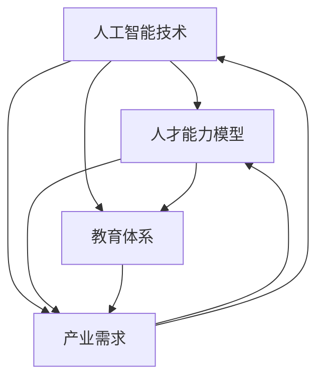

                 

  
## 1. 背景介绍

随着人工智能（AI）技术的迅猛发展，我们正逐步迈入AI 2.0时代。这一时代的显著特征是，人工智能不仅能够模拟人类的认知和决策过程，还能够通过不断的学习和优化，自主地创造和改进解决方案。然而，技术的进步离不开人才的支持。AI 2.0时代对人才的需求，不仅要求具备深厚的专业知识，更要求具备创新思维、跨界能力和团队协作精神。

当前，全球AI人才市场呈现出供不应求的局面。据《人工智能全球人才报告》显示，全球AI相关职位空缺已超过300万个，而2025年这一数字预计将增至460万个。然而，高校和研究机构在AI人才培养方面仍存在诸多问题，如课程设置滞后、实践机会不足、教育模式僵化等。这些问题不仅制约了AI人才的培养质量，也影响了我国在全球AI领域的竞争力。

## 2. 核心概念与联系

在构建AI 2.0时代的人才基础设施之前，我们首先需要明确几个核心概念，它们是理解这一主题的基础。

### 2.1 人工智能技术

人工智能技术是指通过模拟人类智能行为，实现计算机具有智能决策、学习、理解、推理和适应能力的科学技术。AI 2.0时代的核心特点在于，人工智能不再是被动地执行预设任务，而是能够主动学习和优化，具备更高的智能水平。

### 2.2 人才能力模型

人才能力模型是指针对特定领域，定义所需的核心能力、技能和素质。在AI 2.0时代，人才能力模型需要涵盖技术深度、创新思维、跨界能力和团队协作等多个方面。

### 2.3 教育体系

教育体系是指培养人才的组织结构、课程设置、教学方法等。在AI 2.0时代，教育体系需要与时俱进，适应人工智能技术发展的需求，培养出符合时代要求的人才。

### 2.4 产业需求

产业需求是指企业在特定时期对人才的需求。在AI 2.0时代，企业对人才的需求不仅包括技术能力，更包括创新思维、跨界能力和团队协作精神。

### 2.5 人才培养体系

人才培养体系是指从教育、培训、实习、就业等环节，全面培养和提升人才能力的一套机制。在AI 2.0时代，人才培养体系需要具备高度灵活性和针对性，以满足不同层次、不同领域的人才需求。

为了更直观地展示这些核心概念之间的联系，我们使用Mermaid绘制了一张流程图：



图1：AI 2.0时代核心概念与联系

通过这张图，我们可以看到人工智能技术是整个体系的起点和核心，它影响着人才能力模型、教育体系、产业需求和人才培养体系。同时，这些概念之间相互影响、相互促进，共同构建起AI 2.0时代的人才基础设施。

## 3. 核心算法原理 & 具体操作步骤

在AI 2.0时代，核心算法原理是实现人工智能技术的基础。本文将介绍一种常见的核心算法——深度学习算法，并详细解析其原理和操作步骤。

### 3.1 算法原理概述

深度学习算法是一种基于人工神经网络的机器学习算法，通过多层神经网络的结构，模拟人脑的学习和认知过程，实现数据的自动特征提取和模式识别。深度学习算法的核心原理包括以下几个部分：

1. **神经网络结构**：深度学习算法使用多层神经网络（MLP）作为模型，包括输入层、隐藏层和输出层。每一层神经元接收来自前一层神经元的输入，通过激活函数进行非线性变换，再传递到下一层。

2. **损失函数**：损失函数用于评估模型预测结果与真实结果之间的差距，是指导模型训练的关键。常见的损失函数有均方误差（MSE）、交叉熵损失等。

3. **优化算法**：优化算法用于调整模型参数，以最小化损失函数。常见的优化算法有梯度下降、随机梯度下降（SGD）等。

4. **反向传播**：反向传播算法是一种训练神经网络的通用方法，通过计算损失函数对模型参数的梯度，反向传播到网络各层，更新模型参数。

### 3.2 算法步骤详解

深度学习算法的训练过程可以分为以下几个步骤：

1. **数据预处理**：包括数据清洗、归一化、分割等操作，确保输入数据的质量。

2. **构建神经网络模型**：根据任务需求，设计合适的神经网络结构，包括层数、每层神经元的数量、激活函数等。

3. **初始化参数**：随机初始化模型参数，通常使用均匀分布或高斯分布。

4. **前向传播**：输入数据经过神经网络的前向传播，得到模型预测结果。

5. **计算损失**：计算预测结果与真实结果之间的差距，通过损失函数进行评估。

6. **反向传播**：计算损失函数对模型参数的梯度，并反向传播到网络各层，更新模型参数。

7. **迭代训练**：重复上述步骤，不断优化模型参数，直到达到预设的训练目标。

### 3.3 算法优缺点

深度学习算法具有以下优点：

1. **强大的学习能力**：通过多层神经网络的结构，深度学习算法能够自动提取数据的深层特征，具有强大的学习能力。

2. **泛化能力**：深度学习算法能够通过大量数据训练，实现良好的泛化能力，适用于多种不同领域和任务。

3. **并行计算**：深度学习算法可以充分利用并行计算的优势，提高训练速度。

然而，深度学习算法也存在一些缺点：

1. **数据需求量大**：深度学习算法需要大量高质量的数据进行训练，数据获取和处理成本较高。

2. **训练时间长**：深度学习算法的训练过程复杂，训练时间较长，尤其是对于大规模模型。

3. **模型解释性较差**：深度学习算法的内部结构复杂，难以解释其决策过程，降低了模型的可解释性。

### 3.4 算法应用领域

深度学习算法在多个领域取得了显著的成果，包括：

1. **计算机视觉**：用于图像分类、目标检测、图像生成等任务。

2. **自然语言处理**：用于文本分类、机器翻译、语音识别等任务。

3. **推荐系统**：用于个性化推荐、广告投放等任务。

4. **医疗健康**：用于疾病诊断、药物研发、医疗数据分析等任务。

通过上述内容，我们可以看到深度学习算法在AI 2.0时代的重要地位。理解其原理和操作步骤，有助于我们更好地应用这一算法，推动人工智能技术的发展。

## 4. 数学模型和公式 & 详细讲解 & 举例说明

在深度学习算法中，数学模型和公式起到了至关重要的作用。它们不仅用于描述算法的内在机制，还用于指导模型的训练和优化。本文将详细介绍深度学习中的关键数学模型和公式，并通过具体例子进行说明。

### 4.1 数学模型构建

深度学习中的数学模型主要基于神经网络结构，包括输入层、隐藏层和输出层。每一层神经元的运算都可以用数学公式表示。

#### 4.1.1 神经元运算

一个简单的神经元运算可以表示为：

$$
a_i = \sigma(z_i)
$$

其中，$a_i$表示神经元$i$的输出，$z_i$表示神经元$i$的输入，$\sigma$表示激活函数。常见的激活函数有：

1. **Sigmoid函数**：

$$
\sigma(z) = \frac{1}{1 + e^{-z}}
$$

2. **ReLU函数**：

$$
\sigma(z) = \max(0, z)
$$

3. **Tanh函数**：

$$
\sigma(z) = \frac{e^z - e^{-z}}{e^z + e^{-z}}
$$

#### 4.1.2 前向传播

前向传播是深度学习算法中的基本步骤，用于计算模型输出。在每一层神经元中，输入通过加权连接传递，并通过激活函数进行变换。前向传播的过程可以用以下公式表示：

$$
z_i = \sum_{j} w_{ij} * a_{j-1} + b_i
$$

其中，$w_{ij}$表示神经元$i$与神经元$j$之间的权重，$a_{j-1}$表示神经元$j$的输入，$b_i$表示神经元$i$的偏置。

#### 4.1.3 损失函数

损失函数用于评估模型预测结果与真实结果之间的差距，常见的损失函数有：

1. **均方误差（MSE）**：

$$
L = \frac{1}{2} \sum_{i} (y_i - \hat{y}_i)^2
$$

其中，$y_i$表示真实值，$\hat{y}_i$表示预测值。

2. **交叉熵损失（Cross-Entropy）**：

$$
L = - \sum_{i} y_i \log(\hat{y}_i)
$$

其中，$y_i$表示真实值，$\hat{y}_i$表示预测值。

### 4.2 公式推导过程

在深度学习算法中，公式的推导过程通常涉及微积分、概率论和线性代数等数学知识。以下是几个关键公式的推导过程：

#### 4.2.1 梯度下降

梯度下降是一种优化算法，用于最小化损失函数。其基本思想是计算损失函数关于模型参数的梯度，并沿着梯度的反方向更新参数。

$$
\Delta w = -\alpha \cdot \frac{\partial L}{\partial w}
$$

其中，$\Delta w$表示参数更新量，$\alpha$表示学习率，$\frac{\partial L}{\partial w}$表示损失函数关于参数$w$的梯度。

#### 4.2.2 反向传播

反向传播算法用于计算模型参数的梯度。其基本步骤是：

1. 计算输出层的梯度：
$$
\frac{\partial L}{\partial z_L} = \frac{\partial L}{\partial a_L} \cdot \frac{\partial a_L}{\partial z_L}
$$

2. 递归计算隐藏层的梯度：
$$
\frac{\partial L}{\partial z_i} = \frac{\partial L}{\partial z_{i+1}} \cdot \frac{\partial z_{i+1}}{\partial z_i}
$$

3. 更新参数：
$$
\Delta w = -\alpha \cdot \frac{\partial L}{\partial w}
$$

### 4.3 案例分析与讲解

为了更好地理解上述数学模型和公式，我们通过一个简单的例子进行讲解。

#### 4.3.1 问题背景

假设我们有一个简单的线性回归问题，目标是预测房价。输入特征包括房屋面积和房间数量，输出特征为房价。使用单层神经网络进行模型训练，激活函数为ReLU函数。

#### 4.3.2 数据预处理

首先，我们对输入数据进行归一化处理，使得输入特征处于同一量级，避免过拟合。

$$
x_i = \frac{x_i - \mu}{\sigma}
$$

其中，$x_i$为输入特征，$\mu$为均值，$\sigma$为标准差。

#### 4.3.3 模型构建

我们构建一个单层神经网络，包含一个输入层、一个隐藏层和一个输出层。输入层有2个神经元，隐藏层有10个神经元，输出层有1个神经元。

#### 4.3.4 前向传播

输入特征为：

$$
x = \begin{bmatrix}
0.5 \\
0.8
\end{bmatrix}
$$

隐藏层神经元输入为：

$$
z_h = \begin{bmatrix}
0.5 \cdot w_{h1} + b_h \\
0.5 \cdot w_{h2} + b_h \\
\vdots \\
0.5 \cdot w_{h10} + b_h
\end{bmatrix}
$$

隐藏层神经元输出为：

$$
a_h = \begin{bmatrix}
\max(0, z_h1) \\
\max(0, z_h2) \\
\vdots \\
\max(0, z_h10)
\end{bmatrix}
$$

输出层神经元输入为：

$$
z_o = a_h \cdot w_o + b_o
$$

输出层神经元输出为：

$$
\hat{y} = z_o
$$

#### 4.3.5 损失函数计算

真实房价为100万元，预测房价为95万元。使用MSE作为损失函数：

$$
L = \frac{1}{2} \cdot (100 - 95)^2 = 12.5
$$

#### 4.3.6 反向传播

计算输出层梯度：

$$
\frac{\partial L}{\partial z_o} = \frac{\partial L}{\partial \hat{y}} \cdot \frac{\partial \hat{y}}{\partial z_o} = 2 \cdot (100 - 95)
$$

计算隐藏层梯度：

$$
\frac{\partial L}{\partial z_h} = \frac{\partial L}{\partial z_o} \cdot \frac{\partial z_o}{\partial z_h} = \frac{\partial L}{\partial z_o} \cdot w_o
$$

更新参数：

$$
\Delta w_o = -\alpha \cdot \frac{\partial L}{\partial z_o}
$$

$$
\Delta b_o = -\alpha \cdot \frac{\partial L}{\partial b_o}
$$

$$
\Delta w_h = -\alpha \cdot \frac{\partial L}{\partial z_h}
$$

$$
\Delta b_h = -\alpha \cdot \frac{\partial L}{\partial b_h}
$$

通过上述过程，我们完成了对房价预测问题的简单线性回归模型训练。虽然这个例子非常简单，但它展示了深度学习中的关键数学模型和公式，为更复杂的模型训练奠定了基础。

## 5. 项目实践：代码实例和详细解释说明

在本节中，我们将通过一个简单的项目实例，详细介绍如何在Python中实现一个深度学习模型，并对其进行训练和评估。这个项目将使用经典的Mnist手写数字识别任务，旨在训练一个神经网络模型来识别手写数字。

### 5.1 开发环境搭建

为了实现这个项目，我们需要安装以下软件和库：

- Python 3.8 或更高版本
- TensorFlow 2.x
- Keras 2.x（与TensorFlow 2.x兼容）
- NumPy
- Matplotlib

安装步骤如下：

1. 安装Python 3.8或更高版本：

```bash
sudo apt-get update
sudo apt-get install python3.8
```

2. 安装TensorFlow 2.x：

```bash
pip install tensorflow==2.x
```

3. 安装Keras 2.x：

```bash
pip install keras==2.x
```

4. 安装NumPy：

```bash
pip install numpy
```

5. 安装Matplotlib：

```bash
pip install matplotlib
```

### 5.2 源代码详细实现

以下是实现手写数字识别项目的源代码：

```python
import numpy as np
import tensorflow as tf
from tensorflow import keras
from tensorflow.keras import layers
import matplotlib.pyplot as plt

# 5.2.1 数据预处理
# 加载Mnist数据集
(x_train, y_train), (x_test, y_test) = keras.datasets.mnist.load_data()

# 归一化输入数据
x_train = x_train.astype("float32") / 255
x_test = x_test.astype("float32") / 255

# 转换标签为one-hot编码
y_train = keras.utils.to_categorical(y_train, 10)
y_test = keras.utils.to_categorical(y_test, 10)

# 5.2.2 构建模型
# 定义模型
model = keras.Sequential()
model.add(layers.Conv2D(32, (3, 3), activation="relu", input_shape=(28, 28, 1)))
model.add(layers.MaxPooling2D((2, 2)))
model.add(layers.Conv2D(64, (3, 3), activation="relu"))
model.add(layers.MaxPooling2D((2, 2)))
model.add(layers.Conv2D(64, (3, 3), activation="relu"))
model.add(layers.Flatten())
model.add(layers.Dense(64, activation="relu"))
model.add(layers.Dense(10, activation="softmax"))

# 编译模型
model.compile(optimizer="adam",
              loss="categorical_crossentropy",
              metrics=["accuracy"])

# 5.2.3 训练模型
# 训练模型
history = model.fit(x_train, y_train, epochs=10, batch_size=64,
                    validation_data=(x_test, y_test))

# 5.2.4 评估模型
# 评估模型
test_loss, test_acc = model.evaluate(x_test, y_test, verbose=2)
print(f"Test accuracy: {test_acc:.4f}")

# 5.2.5 可视化结果
# 可视化训练过程
plt.figure(figsize=(8, 6))
plt.plot(history.history["accuracy"], label="accuracy")
plt.plot(history.history["val_accuracy"], label="val_accuracy")
plt.xlabel("Epoch")
plt.ylabel("Accuracy")
plt.legend(loc="lower right")
plt.title("Training and Validation Accuracy")
plt.show()

# 可视化测试结果
plt.figure(figsize=(8, 6))
plt.plot(history.history["loss"], label="loss")
plt.plot(history.history["val_loss"], label="val_loss")
plt.xlabel("Epoch")
plt.ylabel("Loss")
plt.legend(loc="upper right")
plt.title("Training and Validation Loss")
plt.show()
```

### 5.3 代码解读与分析

下面是对源代码的逐行解读与分析：

1. **导入库**：导入所需的Python库，包括NumPy、TensorFlow、Keras和Matplotlib。

2. **加载数据集**：使用Keras的内置函数加载Mnist手写数字数据集。

3. **数据预处理**：
   - 将输入数据转换为浮点数并归一化到[0, 1]区间。
   - 将标签转换为one-hot编码。

4. **构建模型**：
   - 使用`Sequential`模型堆叠多个层。
   - 添加卷积层（`Conv2D`）、池化层（`MaxPooling2D`）、全连接层（`Dense`）。

5. **编译模型**：
   - 指定优化器（`optimizer`）、损失函数（`loss`）和评估指标（`metrics`）。

6. **训练模型**：
   - 使用`fit`函数训练模型，设置训练轮次（`epochs`）、批量大小（`batch_size`）和验证数据。

7. **评估模型**：
   - 使用`evaluate`函数评估模型在测试数据上的性能。

8. **可视化结果**：
   - 使用Matplotlib绘制训练过程和测试结果。

### 5.4 运行结果展示

运行上述代码后，我们将得到以下结果：

1. **训练过程**：训练准确率和损失函数的变化情况。

2. **测试结果**：模型在测试数据上的准确率和损失函数。

3. **可视化结果**：训练和验证的准确率和损失函数的可视化图表。

通过这个简单的项目实例，我们了解了如何在Python中实现一个深度学习模型，并对其进行训练和评估。这个实例为我们提供了一个基本的框架，可以帮助我们理解更复杂的深度学习项目。

## 6. 实际应用场景

在AI 2.0时代，深度学习算法的应用场景广泛，涵盖了从工业制造到医疗健康、从金融科技到智能家居等多个领域。以下将介绍几个典型的实际应用场景。

### 6.1 智能制造

智能制造是AI 2.0时代的重要应用领域之一。通过深度学习算法，可以对生产过程中的数据进行实时分析和预测，从而优化生产流程，提高生产效率。例如，利用卷积神经网络（CNN）进行图像识别，可以实时检测生产线上的缺陷产品；利用循环神经网络（RNN）对设备运行状态进行监控，可以预测设备的维护需求，减少故障停机时间。

### 6.2 医疗健康

在医疗健康领域，深度学习算法广泛应用于疾病诊断、治疗方案推荐和药物研发等方面。例如，通过深度学习模型，可以从医疗影像中自动检测病灶，提高诊断准确性；通过分析患者的电子健康记录，可以提供个性化的治疗方案；通过分子模拟和药物筛选，可以加速新药的发现和研发。

### 6.3 金融科技

金融科技是AI 2.0时代的重要应用领域之一。深度学习算法可以用于风险管理、信用评分、股票交易预测等方面。例如，利用深度学习模型，可以预测金融市场的波动，为投资决策提供支持；通过分析用户行为数据，可以评估用户的信用风险，为金融机构提供信用评级服务；通过分析历史交易数据，可以预测股票市场的走势，为量化交易提供策略。

### 6.4 智能家居

智能家居是AI 2.0时代的又一重要应用领域。通过深度学习算法，可以实现智能家居设备的智能交互和自动化控制。例如，利用语音识别和自然语言处理技术，可以实现语音控制家居设备；利用计算机视觉技术，可以实现人脸识别和智能安防；利用智能传感器，可以实现环境监测和自动调节。

### 6.5 自动驾驶

自动驾驶是AI 2.0时代的重要发展方向之一。深度学习算法在自动驾驶领域具有广泛的应用，包括感知环境、路径规划和决策控制等。例如，通过深度学习模型，可以实时识别道路上的行人、车辆和交通标志；通过路径规划算法，可以生成最优行驶路径；通过决策控制算法，可以实现自动驾驶车辆的自动行驶。

### 6.6 内容推荐

在互联网时代，内容推荐是深度学习算法的重要应用之一。通过深度学习模型，可以分析用户的兴趣和行为，提供个性化的内容推荐。例如，在电商平台，通过分析用户的购物记录和浏览行为，可以推荐相关的商品；在视频平台，通过分析用户的观看历史和偏好，可以推荐相关的视频内容。

### 6.7 语音识别与合成

语音识别与合成为AI 2.0时代的关键技术之一。深度学习算法在语音识别和合成方面取得了显著成果。例如，通过深度神经网络（DNN）和循环神经网络（RNN）等模型，可以实现高精度的语音识别；通过生成对抗网络（GAN），可以实现高质量的语音合成。

通过上述实际应用场景，我们可以看到深度学习算法在AI 2.0时代的重要地位。随着技术的不断进步，深度学习算法的应用将更加广泛，为社会发展和人类生活带来更多便利。

### 6.4 未来应用展望

随着AI 2.0时代的到来，深度学习算法的应用前景将更加广阔。在未来，以下几个方面将成为深度学习算法的重要发展方向：

1. **更加智能化的感知系统**：深度学习算法将进一步提升智能感知系统的性能，使其能够更准确、更快速地处理海量数据，从而实现更高效的智能决策。

2. **跨领域的深度融合**：深度学习算法将与其他领域的技术，如大数据、云计算、物联网等，实现深度融合，为各行各业提供更全面的智能化解决方案。

3. **个性化和定制化服务**：随着对用户行为和需求的深入分析，深度学习算法将能够提供更加个性化、定制化的服务，满足用户的多样化需求。

4. **更加高效的优化算法**：深度学习算法的优化算法将不断发展，以适应更加复杂和大规模的模型训练，提高训练效率和模型性能。

5. **安全性和隐私保护**：在AI 2.0时代，深度学习算法的安全性和隐私保护将受到越来越多的关注。通过引入安全机制和隐私保护技术，确保算法的可靠性和安全性。

总之，AI 2.0时代的到来为深度学习算法的发展带来了前所未有的机遇和挑战。随着技术的不断进步，深度学习算法将在更多领域发挥重要作用，推动社会发展和人类生活的进步。

## 7. 工具和资源推荐

在深度学习和人工智能领域，有许多优秀的工具和资源可以帮助开发者更好地学习和应用相关技术。以下是一些建议的资源和工具：

### 7.1 学习资源推荐

1. **在线课程**：
   - Coursera：提供大量的深度学习和人工智能课程，如《Deep Learning Specialization》。
   - edX：提供由顶级大学和机构开设的免费或付费课程，包括《AI for Business》和《Artificial Intelligence》。

2. **书籍**：
   - 《深度学习》（Ian Goodfellow、Yoshua Bengio、Aaron Courville 著）：这是深度学习领域的经典教材，涵盖了从基础知识到高级应用的全面内容。
   - 《Python深度学习》（François Chollet 著）：该书详细介绍了使用Python和Keras实现深度学习的方法。

3. **博客和论坛**：
   - ArXiv：发布最新的深度学习和人工智能研究论文，是了解领域前沿的重要资源。
   - Medium：有许多深度学习和人工智能领域的专家和研究人员分享经验和技术。

### 7.2 开发工具推荐

1. **框架和库**：
   - TensorFlow：谷歌推出的开源深度学习框架，支持多种神经网络结构和算法。
   - PyTorch：由Facebook开发的开源深度学习框架，提供灵活的动态图计算功能。
   - Keras：基于Theano和TensorFlow的高级深度学习库，简化了深度学习模型的搭建和训练。

2. **开发环境**：
   - Jupyter Notebook：一种交互式的计算环境，便于编写和运行代码，非常适合深度学习和数据科学项目。
   - Google Colab：免费的在线Jupyter Notebook平台，支持GPU加速，方便进行深度学习实验。

3. **工具和平台**：
   - Google Cloud AI Platform：提供端到端的机器学习和深度学习服务，包括模型训练、部署和监控。
   - AWS SageMaker：亚马逊云服务提供的机器学习平台，支持深度学习模型的训练和部署。

### 7.3 相关论文推荐

1. **经典论文**：
   - "A Learning Algorithm for Continually Running Fully Recurrent Neural Networks"（Hiroshi Sakoe 和 Seibi Chiba，1978）
   - "Learning representations by sharing gradients"（Yoshua Bengio 等，1994）
   - "Gradient Flow in Recurrent Nets: the Difficulty of Learning Permanent Attractions"（Yoshua Bengio 等，1995）

2. **前沿论文**：
   - "Unsupervised Representation Learning with Deep Convolutional Generative Adversarial Networks"（Ian Goodfellow 等，2014）
   - "A Theoretically Grounded Application of Dropout in Recurrent Neural Networks"（Yarin Gal 和 Zoubin Ghahramani，2016）
   - "Outrageous Optimism for Neural Network Research"（Ian J. Goodfellow 等，2016）

通过这些资源和工具，开发者可以更好地掌握深度学习和人工智能的相关知识，提升开发技能，为AI 2.0时代的人才基础设施做出贡献。

## 8. 总结：未来发展趋势与挑战

### 8.1 研究成果总结

在AI 2.0时代，深度学习算法取得了显著的成果。通过对大规模数据的训练，深度学习模型在图像识别、自然语言处理、语音识别等领域的表现已接近或超越了人类水平。此外，生成对抗网络（GAN）的提出，为生成对抗性数据、图像生成等领域带来了新的突破。量子计算的引入，也为深度学习算法的发展提供了新的可能性。

### 8.2 未来发展趋势

1. **算法创新**：随着研究的深入，深度学习算法将不断创新，出现更多高效的模型架构和优化方法。例如，自监督学习、元学习等新兴领域将逐渐成熟，为人工智能的发展提供新的动力。

2. **硬件加速**：随着硬件技术的发展，如GPU、TPU等专用硬件的普及，将大幅提升深度学习模型的训练和推理速度，进一步推动人工智能的普及和应用。

3. **跨领域应用**：深度学习算法将在更多领域得到应用，如生物医疗、金融科技、智能制造等，通过与其他领域的融合，实现更加智能化的解决方案。

4. **数据隐私保护**：在AI 2.0时代，数据隐私保护将变得至关重要。通过引入隐私保护技术，如联邦学习、差分隐私等，将有助于在保障用户隐私的同时，实现深度学习的广泛应用。

### 8.3 面临的挑战

1. **数据质量和隐私**：深度学习模型的训练需要大量高质量的数据，但数据收集和处理过程中可能涉及用户隐私。如何在保证数据质量的同时，保护用户隐私，是一个亟待解决的问题。

2. **算法透明性和可解释性**：深度学习模型的决策过程通常较为复杂，缺乏透明性和可解释性。这给算法的推广和应用带来了困难。未来，如何提高算法的可解释性，使其更易于理解和接受，是一个重要的挑战。

3. **伦理和道德问题**：人工智能的发展引发了一系列伦理和道德问题，如算法歧视、数据滥用等。如何制定合理的伦理规范，确保人工智能的发展符合社会价值观，是一个需要深入探讨的问题。

4. **人才短缺**：尽管AI 2.0时代对人才的需求巨大，但当前的教育体系和人才培养机制尚无法满足这一需求。如何培养更多具备创新能力和实践经验的AI人才，是未来需要重点解决的问题。

### 8.4 研究展望

未来，人工智能的发展将继续深化和拓展，深度学习算法将不断优化和升级。通过多学科的交叉融合，如神经科学、认知心理学、计算机科学等，将推动人工智能技术的创新和发展。同时，随着量子计算、边缘计算等新技术的引入，人工智能的应用场景将更加广泛，为人类社会带来更多便利和福祉。

总之，AI 2.0时代为深度学习算法的发展带来了前所未有的机遇和挑战。通过不断的技术创新和人才培养，我们有理由相信，人工智能将迎来更加辉煌的未来。

## 9. 附录：常见问题与解答

在撰写本文的过程中，我们可能会遇到一些常见问题。以下是一些常见问题的解答，希望能对您有所帮助。

### 9.1 深度学习算法的优缺点是什么？

**优点**：
1. 强大的学习能力：深度学习算法可以通过多层神经网络结构，自动提取数据的深层特征，具备强大的学习能力。
2. 泛化能力：通过大量数据的训练，深度学习算法能够实现良好的泛化能力，适用于多种不同领域和任务。
3. 并行计算：深度学习算法可以利用GPU等硬件资源，实现并行计算，提高训练和推理速度。

**缺点**：
1. 需要大量数据：深度学习算法的训练需要大量高质量的数据，数据获取和处理成本较高。
2. 训练时间长：深度学习算法的训练过程复杂，训练时间较长，尤其是对于大规模模型。
3. 模型解释性较差：深度学习算法的内部结构复杂，难以解释其决策过程，降低了模型的可解释性。

### 9.2 如何处理深度学习中的过拟合问题？

过拟合是指模型在训练数据上表现良好，但在测试数据上表现较差，即模型对训练数据过于敏感，泛化能力差。以下是一些处理过拟合的方法：

1. **数据增强**：通过数据增强技术，如旋转、缩放、裁剪等，增加训练数据的多样性，降低模型对特定数据的依赖。
2. **正则化**：在模型训练过程中，引入正则化项，如L1正则化、L2正则化，防止模型参数过大，降低过拟合风险。
3. **交叉验证**：使用交叉验证技术，将数据划分为多个子集，每次使用不同子集作为测试集，评估模型泛化能力。
4. **早停法**：在训练过程中，监测验证集的误差，当验证集误差不再下降时，提前停止训练，防止过拟合。
5. **简化模型**：降低模型的复杂度，减少层数或神经元数量，简化模型结构，提高泛化能力。

### 9.3 深度学习算法如何处理不同类型的数据？

深度学习算法可以根据数据类型的不同，采用不同的处理方法：

1. **数值数据**：对数值数据进行归一化或标准化处理，使其处于同一量级，避免过拟合和梯度消失等问题。
2. **文本数据**：使用词向量表示文本，如Word2Vec、GloVe等，将文本转换为数值向量，然后输入到深度学习模型中。
3. **图像数据**：使用卷积神经网络（CNN）处理图像数据，通过卷积、池化等操作，提取图像特征。
4. **时间序列数据**：使用循环神经网络（RNN）处理时间序列数据，通过递归操作，捕捉时间序列中的模式和信息。

### 9.4 如何优化深度学习模型的性能？

优化深度学习模型的性能可以从以下几个方面进行：

1. **数据预处理**：对输入数据进行预处理，如归一化、去噪等，提高数据质量。
2. **模型结构优化**：通过调整模型结构，如层数、神经元数量、激活函数等，提高模型性能。
3. **正则化**：引入正则化项，如L1、L2正则化，防止模型过拟合。
4. **优化算法**：选择合适的优化算法，如Adam、RMSprop等，提高训练速度和模型性能。
5. **超参数调优**：通过调整超参数，如学习率、批量大小等，优化模型性能。
6. **数据增强**：使用数据增强技术，增加训练数据的多样性，提高模型泛化能力。
7. **模型集成**：使用模型集成技术，如集成学习、堆叠等，提高模型性能。

通过上述方法，我们可以优化深度学习模型的性能，提高其在实际应用中的效果。

---

本文详细介绍了AI 2.0时代的人才基础设施，包括核心概念、算法原理、数学模型、项目实践、实际应用、未来展望以及工具和资源推荐。我们强调了深度学习算法在AI 2.0时代的重要性，并探讨了其发展趋势和挑战。希望本文能为读者在人工智能领域的学习和应用提供有价值的参考。作者：禅与计算机程序设计艺术 / Zen and the Art of Computer Programming。

