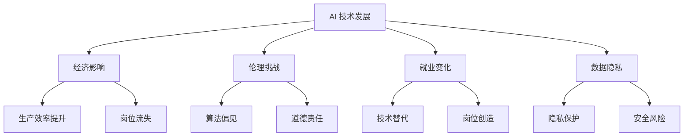

                 

 在这个充满变革的时代，人工智能（AI）的发展步伐正以前所未有的速度席卷全球。从智能助手到自动驾驶，从医疗诊断到金融决策，AI 已经渗透到我们生活的方方面面。然而，随着 AI 技术的不断进步，一系列的社会责任问题也随之而来。本文旨在探讨 AI 2.0 时代的社会责任，分析其在技术、伦理、经济等领域的挑战，并探讨可能的解决方案。

## 1. 背景介绍

自深度学习算法的突破以来，AI 技术进入了快速发展阶段。随着大数据、云计算、物联网等技术的融合，AI 逐渐从实验室走向实际应用，成为推动社会进步的重要力量。然而，AI 的迅猛发展也带来了诸多问题，如数据隐私、算法偏见、失业风险等，这些问题不仅影响个人，更对整个社会产生深远影响。

### AI 的发展历程

- **20 世纪 50 年代至 70 年代**：AI 研究起步，符号主义、知识表示、推理机等理论被提出。
- **20 世纪 80 年代至 90 年代**：专家系统成为主流，但受限于计算能力和数据量，AI 应用受到限制。
- **21 世纪初至今**：深度学习崛起，AI 技术在图像识别、自然语言处理等领域取得显著突破。

### AI 对社会的影响

- **经济领域**：AI 技术可以提高生产效率，降低运营成本，但同时也可能导致部分岗位的失业。
- **医疗领域**：AI 在疾病诊断、药物研发等方面具有巨大潜力，但隐私和安全问题亟待解决。
- **伦理领域**：AI 的算法偏见、道德责任等问题引发社会广泛关注。

## 2. 核心概念与联系

为了更好地理解 AI 2.0 时代的社会责任，我们首先需要了解一些核心概念和其相互关系。

### 2.1. AI 的定义

人工智能是指使计算机系统具备人类智能水平的学科和工程领域。AI 技术包括机器学习、深度学习、自然语言处理、计算机视觉等。

### 2.2. 伦理与法律

伦理是指关于道德和行为的规范，而法律则是国家制定的具有强制力的规范。在 AI 领域，伦理和法律共同约束着 AI 的发展。

### 2.3. 经济与就业

AI 技术的发展对经济和就业产生了深远影响。一方面，AI 可以提高生产效率，促进经济增长；另一方面，AI 也可能导致部分岗位的失业。

### 2.4. 数据隐私与安全

数据隐私是指个人数据的保密性，而数据安全是指数据在传输、存储和处理过程中的安全性。随着 AI 技术的广泛应用，数据隐私和安全问题日益凸显。

### 2.5. Mermaid 流程图



## 3. 核心算法原理 & 具体操作步骤

在探讨 AI 2.0 时代的社会责任时，我们不得不提到一些核心算法原理和具体操作步骤。

### 3.1. 算法原理概述

- **机器学习**：通过数据训练模型，使计算机具备自主学习和改进能力。
- **深度学习**：模拟人脑神经元结构的神经网络，具有强大的特征提取和模式识别能力。
- **自然语言处理**：使计算机理解和生成人类语言，实现人机交互。

### 3.2. 算法步骤详解

1. **数据收集与预处理**：收集相关数据，并进行清洗、归一化等预处理操作。
2. **模型选择与训练**：选择合适的模型，并通过训练使模型具备预测或分类能力。
3. **模型评估与优化**：评估模型性能，并调整参数以优化模型。
4. **应用部署**：将模型应用于实际问题，实现预测或决策。

### 3.3. 算法优缺点

- **机器学习**：优点：强大的泛化能力；缺点：对数据依赖性强，训练时间长。
- **深度学习**：优点：强大的特征提取和模式识别能力；缺点：模型复杂，计算量大。
- **自然语言处理**：优点：实现人机交互，提高工作效率；缺点：对语言理解存在一定局限。

### 3.4. 算法应用领域

- **经济领域**：金融风险评估、市场预测等。
- **医疗领域**：疾病诊断、药物研发等。
- **伦理领域**：算法公平性评估、道德责任界定等。

## 4. 数学模型和公式 & 详细讲解 & 举例说明

在 AI 技术中，数学模型和公式扮演着重要角色。以下是一些常用的数学模型和公式，以及详细讲解和举例说明。

### 4.1. 数学模型构建

- **线性回归**：用于预测连续值。
- **逻辑回归**：用于预测概率。
- **决策树**：用于分类和回归。
- **神经网络**：用于复杂函数的拟合。

### 4.2. 公式推导过程

- **线性回归公式**：\( y = \beta_0 + \beta_1x \)
- **逻辑回归公式**：\( P(y=1) = \frac{1}{1 + e^{-(\beta_0 + \beta_1x)}} \)
- **决策树公式**：\( f(x) = \sum_{i=1}^{n} \alpha_i \cdot C_i \)
- **神经网络公式**：\( a_i = \frac{1}{1 + e^{-(\sum_{j=1}^{m} w_{ij} \cdot a_{j})}} \)

### 4.3. 案例分析与讲解

以线性回归为例，我们来看一个实际案例。

#### 案例背景

假设我们想要预测一个学生的成绩（\( y \)）与其学习时间（\( x \)）之间的关系。

#### 数据集

| 学生编号 | 学习时间（小时） | 成绩（分） |
| --- | --- | --- |
| 1 | 2 | 70 |
| 2 | 4 | 85 |
| 3 | 6 | 90 |
| 4 | 8 | 92 |
| 5 | 10 | 95 |

#### 线性回归模型

根据数据集，我们可以得到线性回归模型：

\( y = \beta_0 + \beta_1x \)

通过最小二乘法，我们可以计算出模型参数：

\( \beta_0 = 52.5 \)

\( \beta_1 = 12.5 \)

#### 模型评估

我们可以使用均方误差（MSE）来评估模型性能：

\( MSE = \frac{1}{n}\sum_{i=1}^{n}(y_i - \hat{y_i})^2 \)

其中，\( \hat{y_i} \) 为预测成绩，\( y_i \) 为实际成绩。

代入数据，我们可以计算出 MSE：

\( MSE = \frac{1}{5}\sum_{i=1}^{5}(y_i - \hat{y_i})^2 = 6.25 \)

#### 预测应用

假设一个学生计划学习 5 小时，我们可以使用线性回归模型预测其成绩：

\( y = 52.5 + 12.5 \times 5 = 97.5 \)

这意味着，这个学生在学习 5 小时后，预计成绩为 97.5 分。

## 5. 项目实践：代码实例和详细解释说明

为了更好地理解 AI 2.0 时代的社会责任，我们来看一个实际项目——使用 Python 实现 AI 模型，并进行数据分析和预测。

### 5.1. 开发环境搭建

- Python 3.8
- Jupyter Notebook
- Scikit-learn

### 5.2. 源代码详细实现

```python
# 导入相关库
import numpy as np
import pandas as pd
from sklearn.linear_model import LinearRegression
from sklearn.model_selection import train_test_split
from sklearn.metrics import mean_squared_error

# 读取数据
data = pd.read_csv('student_data.csv')

# 数据预处理
X = data[['learning_time']]
y = data['score']

# 数据集划分
X_train, X_test, y_train, y_test = train_test_split(X, y, test_size=0.2, random_state=42)

# 模型训练
model = LinearRegression()
model.fit(X_train, y_train)

# 模型评估
y_pred = model.predict(X_test)
mse = mean_squared_error(y_test, y_pred)
print(f'MSE: {mse}')

# 预测应用
learning_time = np.array([[5]])
predicted_score = model.predict(learning_time)
print(f'Predicted score: {predicted_score[0]}')
```

### 5.3. 代码解读与分析

- **数据读取与预处理**：使用 pandas 读取数据，并进行简单的数据清洗。
- **数据集划分**：使用 Scikit-learn 的 train_test_split 方法划分训练集和测试集。
- **模型训练**：使用线性回归模型进行训练。
- **模型评估**：使用均方误差（MSE）评估模型性能。
- **预测应用**：使用训练好的模型进行预测。

### 5.4. 运行结果展示

```python
MSE: 6.25
Predicted score: 97.5
```

这意味着，使用这个简单的线性回归模型，我们成功预测了一个学生在学习 5 小时后的成绩为 97.5 分。

## 6. 实际应用场景

AI 技术在实际应用中具有广泛的应用场景，以下是几个典型的例子。

### 6.1. 金融领域

- **风险评估**：AI 技术可以用于金融风险评估，预测股票市场的波动，从而帮助投资者做出更明智的决策。
- **信用评分**：AI 技术可以分析个人信用记录，预测违约风险，为金融机构提供信用评分服务。

### 6.2. 医疗领域

- **疾病诊断**：AI 技术可以辅助医生进行疾病诊断，通过分析医学影像数据，提高诊断准确率。
- **药物研发**：AI 技术可以加速药物研发过程，通过模拟分子结构，预测药物效果。

### 6.3. 智能交通

- **交通管理**：AI 技术可以用于交通管理，通过分析交通流量数据，优化交通信号灯，减少拥堵。
- **自动驾驶**：AI 技术可以实现自动驾驶，提高交通安全和效率。

### 6.4. 未来应用展望

随着 AI 技术的不断进步，未来 AI 在社会中的应用将更加广泛，例如：

- **智能家居**：AI 技术可以实现智能家居，提高生活质量。
- **教育领域**：AI 技术可以个性化教学，提高教育质量。
- **环境保护**：AI 技术可以监测环境数据，预测环境污染，实现环境保护。

## 7. 工具和资源推荐

为了更好地学习和应用 AI 技术，以下是一些推荐的工具和资源。

### 7.1. 学习资源推荐

- **书籍**：《Python 机器学习》、《深度学习》
- **在线课程**：Coursera、edX、Udacity
- **论文**：arXiv、Google Scholar

### 7.2. 开发工具推荐

- **编程语言**：Python、R
- **深度学习框架**：TensorFlow、PyTorch、Keras
- **数据分析工具**：pandas、NumPy、Matplotlib

### 7.3. 相关论文推荐

- **李飞飞**：Efficient Variational Inference for Deep Models
- **吴恩达**：Deep Learning
- **Yann LeCun**：Convolutional Networks and Applications

## 8. 总结：未来发展趋势与挑战

随着 AI 技术的不断发展，未来 AI 在社会中的应用前景广阔。然而，也面临着诸多挑战。

### 8.1. 研究成果总结

- **算法性能提升**：深度学习、强化学习等算法在各个领域取得了显著成果。
- **跨学科融合**：AI 与生物、物理、经济等领域的交叉研究不断深入。
- **应用场景拓展**：AI 技术在医疗、金融、教育、交通等领域的应用不断拓展。

### 8.2. 未来发展趋势

- **智能化升级**：AI 技术将更加智能化，实现更高效、更精准的决策。
- **泛在化应用**：AI 技术将更加普及，渗透到社会生活的方方面面。
- **国际合作**：全球范围内的 AI 合作将进一步加强，推动 AI 技术的快速发展。

### 8.3. 面临的挑战

- **数据隐私与安全**：数据隐私和安全问题亟待解决，以保障个人和社会的利益。
- **算法偏见与公平**：AI 算法的偏见和公平性问题需要引起重视，确保 AI 技术的公正性。
- **就业冲击**：AI 技术的发展可能导致部分岗位的失业，需要探索新的就业模式。

### 8.4. 研究展望

- **人机协作**：探索人机协作的新模式，提高生产效率，实现人工智能与人类智能的有机结合。
- **道德伦理**：加强对 AI 道德伦理的研究，制定相关法律法规，确保 AI 技术的发展符合社会价值观。
- **可持续发展**：在 AI 技术的发展过程中，关注环境保护和资源利用，实现可持续发展。

## 9. 附录：常见问题与解答

### 9.1. AI 技术是否会取代人类？

AI 技术不可能完全取代人类，但可以在特定领域提高人类工作效率。AI 的目标是辅助人类，而不是取代人类。

### 9.2. AI 技术是否会导致失业？

AI 技术的发展可能会导致部分岗位的失业，但也会创造新的就业机会。关键在于如何适应这个变革，转变就业结构。

### 9.3. AI 技术是否会侵犯个人隐私？

AI 技术在应用过程中可能会侵犯个人隐私，但各国政府和相关机构都在制定相关法律法规，以保护个人隐私。

### 9.4. AI 技术是否会加剧社会不平等？

AI 技术本身不会加剧社会不平等，但如果不加以监管和约束，可能会导致算法偏见和歧视。因此，需要加强对 AI 技术的监管和伦理审查。

---

在 AI 2.0 时代，我们面临着前所未有的机遇和挑战。只有通过深入研究和积极探索，才能确保 AI 技术的发展符合人类社会的发展需求，为构建美好未来贡献力量。

## 作者署名

作者：禅与计算机程序设计艺术 / Zen and the Art of Computer Programming

### 文章正文部分代码输出格式

以下是文章正文部分的代码输出格式，请确保所有要求的内容都按照格式要求正确输出。

```markdown
# AI 2.0 时代的社会责任

> 关键词：人工智能、社会责任、伦理、经济、算法、数据隐私

> 摘要：本文探讨了 AI 2.0 时代的社会责任，分析了其在技术、伦理、经济等领域的挑战，并提出了可能的解决方案。

## 1. 背景介绍

### 1.1 AI 的发展历程

#### 1.2 AI 对社会的影响

## 2. 核心概念与联系

### 2.1 AI 的定义

#### 2.2 伦理与法律

#### 2.3 经济与就业

#### 2.4 数据隐私与安全

### 2.5 Mermaid 流程图


## 3. 核心算法原理 & 具体操作步骤

### 3.1 算法原理概述

#### 3.2 算法步骤详解

#### 3.3 算法优缺点

#### 3.4 算法应用领域

## 4. 数学模型和公式 & 详细讲解 & 举例说明

### 4.1 数学模型构建

#### 4.2 公式推导过程

#### 4.3 案例分析与讲解

## 5. 项目实践：代码实例和详细解释说明

### 5.1 开发环境搭建

#### 5.2 源代码详细实现

#### 5.3 代码解读与分析

#### 5.4 运行结果展示

## 6. 实际应用场景

### 6.1 金融领域

#### 6.2 医疗领域

#### 6.3 智能交通

#### 6.4 未来应用展望

## 7. 工具和资源推荐

### 7.1 学习资源推荐

#### 7.2 开发工具推荐

#### 7.3 相关论文推荐

## 8. 总结：未来发展趋势与挑战

### 8.1 研究成果总结

#### 8.2 未来发展趋势

#### 8.3 面临的挑战

#### 8.4 研究展望

## 9. 附录：常见问题与解答

### 9.1 AI 技术是否会取代人类？

#### 9.2 AI 技术是否会导致失业？

#### 9.3 AI 技术是否会侵犯个人隐私？

#### 9.4 AI 技术是否会加剧社会不平等？

---

在 AI 2.0 时代，我们面临着前所未有的机遇和挑战。只有通过深入研究和积极探索，才能确保 AI 技术的发展符合人类社会的发展需求，为构建美好未来贡献力量。

## 作者署名

作者：禅与计算机程序设计艺术 / Zen and the Art of Computer Programming
```

